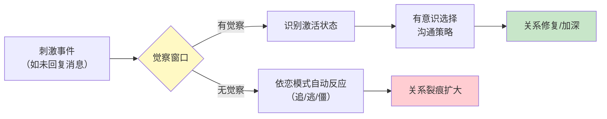
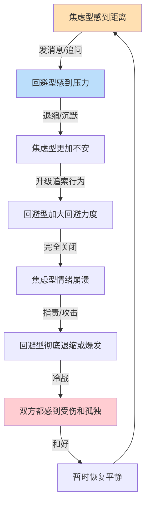

## 五、依恋觉察与沟通调整

依恋模式是一套在早年关系中形成的自动化反应程序。它不会因为你知道了它的存在就自动消失，但你可以通过有意识的觉察和反复练习，从"被依恋模式驱动"转变为"主动选择沟通方式"。本节提供一套完整的觉察-识别-调整工具箱，帮助你在真实沟通场景中实时识别依恋系统的激活状态，并做出有意识的沟通调整。

### 5.1 为什么依恋觉察是沟通进阶的核心能力

大多数沟通失败不是因为"不会说话"，而是因为依恋系统在后台被激活后，人的认知资源被恐惧、焦虑或防御性愤怒所劫持，导致说出的话和本意完全相反。

一个典型场景：你发了一条消息给伴侣，对方两小时没回复。如果此刻你的依恋系统被激活，你接下来发出的消息大概率不是你想表达的，而是依恋恐惧驱动的自动化反应。焦虑型会连发追问，回避型会开始冷处理——两者都在无意中制造更大的沟通裂痕。

依恋觉察的核心价值在于：**在"刺激"和"反应"之间插入一个觉察窗口**。这个窗口可能只有几秒钟，但足以让你从自动驾驶切换到手动驾驶。



### 5.2 依恋模式的实时识别信号

识别依恋模式不能只靠心理测评问卷——那种识别是回顾性的，对实时沟通没有帮助。真正有用的是学会在当下识别身体信号、思维模式和行为冲动这三类即时线索。

#### 5.2.1 焦虑型依恋的激活信号

**身体信号：**
- 胸口发紧、心跳加速、呼吸变浅
- 胃部有一种"下沉"或"空洞"的感觉
- 手心出汗、坐立不安
- 不自觉地反复拿起手机查看

**思维模式：**
- "他/她是不是不想理我了？"
- "我是不是做错了什么？"
- "如果我不主动联系，这段关系就完了"
- 脑海中不断回放对方过去的"冷漠"片段，构建一个被抛弃的叙事

**行为冲动：**
- 想要立刻发消息、打电话、追问对方
- 想要检查对方的社交媒体动态
- 说话变得急促、音量升高、语速加快
- 用愤怒或指责来掩盖恐惧（"你根本就不在乎我！"）

**关键辨别点：** 焦虑型激活的核心感受是**被抛弃的恐惧**，行为方向是**向外索取确认**。如果你发现自己在"追"——追着要答案、追着要回应、追着要承诺——那大概率是焦虑型依恋系统被激活了。

#### 5.2.2 回避型依恋的激活信号

**身体信号：**
- 肩颈僵硬、身体不自觉后倾或转向别处
- 呼吸变浅或刻意屏住呼吸
- 感到一种"需要逃离"的身体冲动
- 面部表情变僵硬或刻意保持中性

**思维模式：**
- "我需要一个人待着"
- "对方的要求太过分了"
- "我处理不了这么多情绪"
- 将对方的情感需求解读为"控制"或"依赖"

**行为冲动：**
- 沉默、冷处理、"嗯""哦"单字回复
- 转移注意力到工作、手机、游戏或其他事务上
- 回避眼神接触、身体语言封闭
- 用逻辑分析替代情感回应（"从理性的角度来说……"）

**关键辨别点：** 回避型激活的核心感受是**被吞噬/窒息的恐惧**，行为方向是**向内撤退或向外推离**。如果你发现自己在"逃"——逃进工作、逃进沉默、逃进理性分析——那大概率是回避型依恋系统被激活了。

#### 5.2.3 混乱型依恋的激活信号

混乱型依恋者同时拥有焦虑和回避两套系统，激活时的表现最为矛盾和不可预测：

- 渴望亲密但在对方靠近时感到恐惧
- 一会儿强烈索求回应，一会儿又推开对方
- 情绪剧烈波动，行为前后不一致
- 可能在同一段对话中交替出现追和逃的模式

**关键辨别点：** 如果你在同一次冲突中既想靠近又想逃离，感到"怎么做都不对"，或者你的情绪和行为方向完全相反（嘴上说"你走吧"但心里希望对方留下），可能是混乱型依恋在起作用。

#### 5.2.4 安全型依恋的行为基线

安全型依恋并非没有负面情绪，而是在负面情绪出现时仍能保持基本的沟通能力：

- 能够在焦虑中仍然表达需求而非攻击
- 能够在需要空间时给出明确说明而非消失
- 能够信任对方有善意，即使对方的行为暂时让自己不舒服
- 能够在冲突后主动修复，不陷入羞耻或怨恨

安全型是调整的目标方向，不是一种"天赋"——它可以通过练习获得。

### 5.3 三步实时觉察法

当沟通中出现强烈情绪反应时，按以下三步进行实时觉察：

**第一步：身体扫描（5秒钟）**

停下来，快速扫描自己的身体状态：
- 我的心跳是否加速？（焦虑型信号）
- 我的身体是否在后倾/紧缩？（回避型信号）
- 我是否想追着对方要回应？（焦虑型冲动）
- 我是否想关闭对话离开？（回避型冲动）

**第二步：内在对话（10秒钟）**

问自己三个问题：
1. "我现在感受到的是什么？"——给情绪命名（恐惧、愤怒、羞耻、被抛弃感、窒息感）
2. "这个感受是在保护我免受什么伤害？"——依恋恐惧通常是害怕被抛弃（焦虑型）或害怕被吞噬（回避型）
3. "我真正想要的是什么？"——通常不是"赢"这场争论，而是感到被爱、被尊重、被看见

**第三步：策略选择（5秒钟）**

根据觉察结果选择沟通策略：

| 觉察到的状态 | 不推荐的行为 | 推荐的替代行为 |
|-------------|------------|-------------|
| 焦虑型激活，想追问 | 连发消息、打电话质问 | 先自我安抚，然后用"我感到"句式表达需求 |
| 回避型激活，想逃跑 | 沉默、冷处理、转移话题 | 告知对方"我需要一点时间"，约定回复时间 |
| 混乱型激活，又追又逃 | 情绪爆发后立刻后悔 | 暂停对话，先稳定自己，再决定要表达什么 |

### 5.4 针对不同依恋类型的沟通调整策略

#### 5.4.1 与焦虑型依恋者沟通的调整策略

**核心原则：提供可预测性和情感确认**

焦虑型依恋者的神经系统对"不确定性"高度敏感。模糊的回应、不一致的行为、意料之外的变化都会激活他们的依恋警报系统。与他们沟通的关键不是"给予更多"，而是"给予更稳定"。

**具体策略：**

**① 主动提供信息，减少信息真空**

焦虑型会在信息真空中自动填充最坏的假设。与其等他们追问，不如主动告知。

- 不要说："我晚点回来。"
- 要说："我今晚和同事吃饭，大概8点到家，结束前给你发消息。"

差异分析：前者留下巨大的信息真空（"晚点"是多久？和谁？做什么？），后者用具体的时间、人物、事件和后续动作填满了焦虑型需要的每一个"安全锚点"。

**② 回应要明确，避免模糊地带**

- 不要说："我再想想吧。"
- 要说："这件事我需要考虑一下，明天晚上之前给你一个确定的答复。"

模糊的"再想想"在焦虑型的解读中等于"拒绝但不好意思说"。给出明确的时间框架能有效降低焦虑。

**③ 情绪回应优先于问题解决**

当焦虑型表达不安时，他们的首要需求不是解决方案，而是情感确认。

- 不要说："你想多了，我怎么可能不爱你。"
- 要说："我能感受到你现在很不安，我在这里，我们慢慢聊。"

前者虽然意图是安慰，但"你想多了"在焦虑型听来是在否定他们的感受，反而会让他们觉得自己的情绪不被接纳。后者先确认感受，再提供存在感，才是焦虑型真正需要的安全信号。

**④ 冲突时保持语言的"连接线"**

在激烈争论中，焦虑型最害怕的不是冲突本身，而是冲突可能导致的连接断裂。即使在争论中，也要时不时释放"连接仍在"的信号。

- "我现在很生气，但我不想伤害你，我们只是在解决一个问题。"
- "我需要冷静一下，但我不是在离开你，20分钟后我们继续聊。"

**⑤ 避免使用"惩罚性沉默"**

对焦虑型来说，不回应=抛弃。如果你需要冷静时间，请明确告知原因和预计时长。沉默是焦虑型最大的触发器，哪怕你只是在想怎么措辞，在他们看来也可能是在"故意不理我"。

#### 5.4.2 与回避型依恋者沟通的调整策略

**核心原则：尊重自主性，降低压力感**

回避型依恋者的神经系统对"被要求/被控制"高度敏感。密集的情感表达、持续的追问、突然的亲密请求都会激活他们的防御系统。与他们沟通的关键是"松手"——不是放弃需求，而是换一种不会触发对方防御的方式表达需求。

**具体策略：**

**① 给选择而非下命令**

- 不要说："我们必须谈谈。"
- 要说："我有些想法想和你聊聊，你觉得今晚方便还是明天方便？"

差异分析："必须谈"是命令式框架，激活回避型的"自主性威胁"传感器。给选择让他们感到自己有掌控权，更可能主动参与对话。

**② 分段式沟通，避免一次倾倒太多**

回避型在面对大量情感信息时容易"宕机"。将一个大话题拆成多次小对话。

- 不要在一次对话中抛出所有不满
- 每次聚焦一个具体问题，说完给对方消化的时间

**③ 用行动和具体事件说话，而非抽象的情感表达**

- 不要说："我觉得你不够在乎我。"
- 要说："上周我生病的时候，如果你能问一句'好点了吗'，我会感觉好很多。"

差异分析：前者是抽象的情感指控，回避型不知道怎么回应；后者是具体的行为请求，可操作、可执行，不涉及"爱不爱"这种高压力话题。

**④ 认可对方的独处需求，不将其个人化**

当回避型说"我需要一个人待着"时，这不是对你的拒绝，而是他们的神经系统在做自我调节。

- "好的，你去休息吧，我做我自己的事。需要我的时候随时找我。"

这种回应传递了两个关键信息：我尊重你的需求（降低自主性威胁）+ 我仍然在这里（提供安全基地）。长此以往，回避型会因为感到"被允许离开"而更愿意"主动回来"。

**⑤ 肯定对方在关系中的付出和努力**

回避型经常被误解为"不在乎"，但他们往往通过行动而非语言来表达关心。注意并肯定这些行动。

- "你今天主动帮我修了那个架子，我注意到了，谢谢你。"

这种具体的肯定会强化回避型在关系中的正向行为，让他们更愿意继续投入。

#### 5.4.3 与混乱型依恋者沟通的调整策略

**核心原则：提供极致的稳定性和一致性**

混乱型依恋者的内部矛盾（渴望亲近又害怕亲近）使他们的沟通需求最为复杂。他们最需要的是一个"不被他们的混乱影响"的稳定存在。

- **保持行为的高度一致**：混乱型会反复测试你是否可靠。你今天的回应方式和昨天是否一样？你说过的话是否做到了？一致性本身就是最强的安全信号。
- **不被对方的情绪风暴卷入**：当混乱型情绪爆发时，保持冷静但温暖的存在。"我看到你现在很痛苦，我不会因为你的愤怒而离开。"
- **温和但坚定地设定边界**：混乱型需要知道关系是有边界的，但边界不是拒绝。"我理解你现在很激动，但我不能接受被骂。我们可以等你冷静后再聊。"
- **鼓励寻求专业支持**：混乱型依恋通常与早期创伤有关，伴侣的支持很重要但不够。温和地建议寻求心理咨询师的帮助。

### 5.5 培养"获得性安全依恋"

依恋模式不是命运。大量研究表明，即使是不安全依恋类型的人，也可以通过有意识的练习发展出"获得性安全依恋"（Earned Security）。这一概念由Mary Main等人在成人依恋访谈（AAI）研究中提出：有些人在回顾不安全的童年经历时，仍能以一种连贯、反思性的方式讲述，说明他们已经通过后天经历或自我工作"挣得"了安全感。

#### 5.5.1 获得性安全的核心机制

获得性安全不是"假装自己是安全型"，而是在神经系统层面建立新的反应路径。核心机制是：**每一次在依恋激活时做出有意识的调整，都在强化前额叶皮层对杏仁核的调节能力**。

神经可塑性研究（Davidson & Begley, 2012）表明，持续的情绪调节练习可以改变大脑的默认反应模式。这意味着焦虑型可以逐渐降低对分离信号的敏感度，回避型可以逐渐提高对亲密的耐受度。

#### 5.5.2 日常练习框架

**焦虑型的成长练习：**

| 练习名称 | 具体做法 | 训练目标 |
|---------|---------|---------|
| 延迟反应训练 | 感到焦虑时，先等30分钟再采取行动 | 打破"焦虑→立即行动"的自动化链 |
| 自我安抚日记 | 记录焦虑事件、触发点、实际结果和感受变化 | 建立"焦虑不一定成真"的新经验 |
| 安全基地多元化 | 列出3个以上能带来安全感的活动/关系 | 减少对单一关系的过度依赖 |
| 情绪标注练习 | 每天识别并命名3种不同的情绪 | 提升情绪粒度，降低情绪劫持概率 |
| "如果最坏的情况"练习 | 写下最担心的结果，然后问"我能承受吗？" | 降低灾难化思维的控制力 |

**回避型的成长练习：**

| 练习名称 | 具体做法 | 训练目标 |
|---------|---------|---------|
| 每日情感分享 | 每天用一句话分享一个感受（不一定是深层的） | 降低情感表达的门槛 |
| "多停留10秒"练习 | 想回避时，在原地多待10秒再决定是否离开 | 提升对亲密不适的耐受窗口 |
| 主动求助练习 | 每周主动向他人请求一次小帮助 | 挑战"求助=脆弱=危险"的信念 |
| 身体接触练习 | 增加非性意图的身体接触（拥抱、握手） | 降低身体对亲密的警惕度 |
| 需求表达阶梯 | 从最小的需求开始表达（"帮我递一下杯子"），逐步升级 | 建立"表达需求不会被惩罚"的新经验 |

#### 5.5.3 关系中的"安全型示范"

如果你的伴侣是安全型依恋，你非常幸运——安全型伴侣的回应方式本身就是一种治疗。但即使没有安全型伴侣，你也可以通过以下方式为自己创造安全体验：

- **找一个安全型的朋友或导师**：在非亲密关系中体验被接纳和被稳定回应的感觉
- **心理咨询**：治疗关系本身就是一种安全型依恋关系的微缩模型
- **正念练习**：正念冥想的核心——觉察而不反应——正是依恋觉察需要的核心能力

### 5.6 混合依恋配对的沟通实操指南

现实中最常见的冲突配对是焦虑型+回避型（心理学称为"焦虑-回避陷阱"），这个组合占不安全依恋配对的大多数。理解这个配对的特殊动态，才能找到有效的沟通策略。

#### 5.6.1 焦虑-回避配对的互动模式

这个配对的问题核心在于：焦虑型的"追"恰好是回避型最大的触发器，而回避型的"逃"恰好是焦虑型最大的触发器。两人在无意中互相强化了对方的不安全感。



打破这个循环需要双方同时做出"反直觉"的调整：焦虑型要学会"不追"，回避型要学会"不逃"。

#### 5.6.2 焦虑型的"不追"策略

1. **识别"追"的升级阶梯**：发消息→打电话→质问→指责→情绪崩溃。在每一步之间插入一个"刹车点"
2. **用"表达需求"替代"追索行为"**：从"你为什么不回我消息！"转变为"你没回复的时候，我会感到不安，一个简单的'在忙'对我来说就够了"
3. **建立自我安抚的备选方案**：焦虑来临时，不是只有"找对方确认"这一条路。散步、运动、和朋友聊天、写下感受，都是有效的替代安抚方式
4. **给对方回复的"时间窗口"**：和伴侣约定"我可以在X小时内等待回复，超过X小时我会发一条温和的提醒"

#### 5.6.3 回避型的"不逃"策略

1. **识别"逃"的信号**：突然变得"很忙"、开始分析而不是感受、想转移话题、身体后倾。这些都是回避系统激活的早期信号
2. **发送"最小连接信号"**：即使需要空间，也先发送一个简单的连接信号。"我现在需要一点时间消化，但我不是在推开你，X小时后我们再聊"
3. **练习"情绪延迟表达"**：如果当下说不出感受，承诺在特定时间点回来分享。"我现在组织不好语言，但我今晚会把我的想法告诉你"
4. **主动发起连接**：不要总是等焦虑型来追。定期主动分享日常、表达关心，这能从根本上降低焦虑型的不安全感，从而减少追索行为

### 5.7 职场中的依恋觉察与沟通调整

依恋模式不仅影响亲密关系，同样影响职场沟通。但职场场景的调整策略有所不同——你不能像在亲密关系中那样直接讨论依恋模式，而需要将觉察转化为更专业的沟通行为。

#### 5.7.1 焦虑型在职场中的常见表现与调整

**常见表现：**
- 过度在意领导和同事的评价，一条批评能毁掉一整天
- 发出邮件/消息后反复检查对方是否回复
- 在团队中倾向于过度承诺，害怕拒绝会导致被排斥
- 会议中不敢表达不同意见，但事后在内心反复重播

**调整策略：**
- **建立"评估延迟"习惯**：收到负面反馈后，等24小时再判断其合理性。在等待期间写下自己的感受，24小时后再读一遍，通常会有不同的视角
- **区分"事实"和"解读"**：领导说"这个方案需要修改"是事实；"领导觉得我不行"是解读。练习只回应事实
- **设定健康的付出边界**：用"能力范围"而非"情感取悦"来决定是否接受任务。"这个任务我目前手上已经有三个项目在同时推进，如果接的话可能会影响交付质量，建议找XX支持"——这是专业的拒绝，不是"不配合"

#### 5.7.2 回避型在职场中的常见表现与调整

**常见表现：**
- 在需要协作的项目中倾向于独立完成，不愿意请求帮助
- 对团队建设活动和非正式社交感到不适
- 面对冲突时选择沉默或绕行，而非直接面对
- 绩效评估中倾向于淡化自己的贡献

**调整策略：**
- **将"求助"重新框架为"效率工具"**：不是"我做不到"，而是"整合团队资源能让结果更好"
- **设定"最小社交参与"目标**：不需要成为社交达人，但每周至少主动和同事进行一次非工作相关的对话
- **学习"建设性表达异议"的模板**："我理解你的方案，从XX角度来看我有一个不同的想法……"——这不是冲突，是专业贡献

### 5.8 常见误区与纠正

| 误区 | 为什么是错的 | 正确理解 |
|------|------------|---------|
| "我知道自己是焦虑型就行了" | 知道≠能做到。依恋觉察需要持续练习，不是一次性的认知 | 觉察是起点，调整是日常练习 |
| "回避型就是不在乎感情" | 回避型有情感，只是表达方式不同，压抑情感不等于没有情感 | 学习解读回避型的"行动语言" |
| "焦虑型应该学会不黏人" | 焦虑型的需求是真实的，问题不在需求本身而在表达方式 | 目标是改变表达方式，而非压抑需求 |
| "依恋类型是固定的，改不了" | 大量研究表明依恋模式可以通过后天经历和有意识练习改变 | 依恋模式有可塑性，但改变需要时间和练习 |
| "只要双方都变成安全型就好了" | 安全型不是唯一"正确"的依恋类型，重点是有效沟通 | 目标是灵活调整，而非追求完美标签 |
| "沟通技巧够好就不需要觉察依恋" | 再好的技巧在依恋系统被激活时也会失效，觉察是技巧生效的前提 | 觉察和技巧是并行发展的两条线 |

### 5.9 综合练习：依恋觉察周记

持续记录是提升依恋觉察最有效的方法之一。建议进行为期4周的依恋觉察周记练习。

**每日记录模板：**

```markdown
## 日期：____

### 今日依恋激活事件
- 触发事件：____
- 身体反应：____
- 情绪反应：____
- 自动化冲动：____（追/逃/僵）
- 实际采取的行为：____

### 觉察质量评估
- 我是否在反应前觉察到了激活？（是/否/部分）
- 觉察发生在哪个阶段？（身体信号/思维模式/行为冲动之后）
- 觉察花了多长时间？（秒/分钟/事后才意识到）

### 调整复盘
- 如果重来一次，我会选择什么不同的行为？
- 今天最成功的一次调整是什么？

### 伴侣/他人反馈（可选）
- 对方今天对我的沟通方式有什么反应？
```

**第1周目标**：只记录，不评判。目标是识别自己的依恋激活模式。
**第2周目标**：在记录中加入"觉察窗口"的观察，尝试在行为冲动出现后暂停。
**第3周目标**：尝试至少3次在觉察后做出不同的沟通选择。
**第4周目标**：回顾整个月的记录，总结自己的依恋模式规律和调整进展。

### 5.10 本节小结

依恋觉察与沟通调整不是一项需要"学会"的技能，而是一种需要"持续练习"的生活方式。核心要点：

1. **依恋模式是自动化的，但可以被觉察中断**。觉察是改变的第一步，也是最关键的一步。
2. **识别激活信号需要同时关注身体、思维和行为三个层面**。身体信号往往最先出现，是最可靠的早期预警。
3. **与不同依恋类型的人沟通需要不同的策略**，但核心原则一致：降低对方的依恋恐惧，提供安全感。
4. **获得性安全是真实可实现的**。每一次在激活状态下做出有意识的调整，都在重塑大脑的默认反应路径。
5. **混合依恋配对（特别是焦虑-回避）需要双方同时调整**，目标不是一方改变去迎合另一方，而是共同跳出负性互动循环。
6. **记录和复盘是加速成长的关键工具**。看不见的模式无法改变，看得见的模式才能被调整。

***
