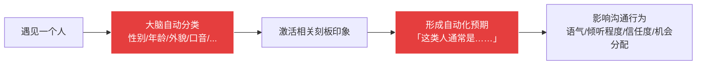
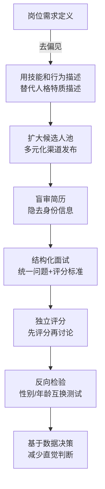

## 六、无意识偏见觉察技巧

无意识偏见（Unconscious Bias），又称隐性偏见（Implicit Bias），是指人们在无意识中对特定社会群体形成的自动化态度和刻板印象。与第一章讨论的认知偏差不同——认知偏差是大脑处理信息的系统性"捷径"错误，无意识偏见则根植于社会文化经验，针对的是**人**：基于性别、年龄、种族、外貌、口音、学历、职业等社会分类标签，自动触发对他人的评价和预期。

无意识偏见之所以"无意识"，是因为持有者本人往往真诚地相信自己是公正客观的。2003年哈佛大学Mahzarin Banaji团队开发的内隐联想测试（IAT）揭示了一个令人不安的事实：超过70%的参与者表现出与自己公开声明态度相矛盾的隐性偏见。这意味着，即使你发自内心地认同"人人平等"，你的大脑仍然可能在毫秒之间做出带有偏见的自动化判断。

在沟通领域，无意识偏见的影响尤为深远——它决定了你愿意听谁说话、相信谁的判断、给谁更多表达机会、对谁的话打折扣。觉察这些偏见，是实现真正有效沟通的前提。

### 6.1 无意识偏见的心理学机制

#### 6.1.1 社会分类理论

人类大脑天然倾向于将世界分类。Henri Tajfel（1970）的"最小群体范式"实验表明，即使将人随机分成两组（比如"蓝队"和"红队"），人们就会立刻开始偏袒自己所在的组。这种分类不需要任何实际理由——仅仅是"被分到一组"这一个动作，就足以触发内群体偏好（In-group Favoritism）。

在沟通中，社会分类的自动化过程如下：

整个过程在200毫秒内完成——比有意识思考快得多。这就是为什么无意识偏见如此难以觉察：它发生在你"决定"之前。

#### 6.1.2 刻板印象的认知根源

刻板印象并非单纯的"恶意"，它有其认知功能基础：

| 认知功能 | 具体机制 | 偏见表现 |
|----------|----------|----------|
| **认知节省** | 用群体特征替代个体信息，减少认知负荷 | "程序员都是内向的"——不需要深入了解每个人 |
| **预测需求** | 基于过去经验对未来做快速预期 | "年轻人缺乏经验"——用年龄代替实际评估 |
| **不确定性管理** | 在信息不足时用刻板印象填补空白 | 面试前10秒根据外貌形成"适不适合"的判断 |
| **自我认同维护** | 通过抬高内群体来维护自尊 | "我们这行的人比他们那行靠谱" |

理解这些机制不是为了给偏见找借口，而是为了知道从哪里入手干预——认知节省型偏见需要降低分类成本（建立新类别），预测需求型偏见需要增加个体信息（让具体事实替代群体标签）。

#### 6.1.3 无意识偏见与系统1的协同

第一章讨论了Kahneman的系统1（快思维）与系统2（慢思维）。无意识偏见正是系统1的"产物"——它是大脑在自动化模式下对社会信息的快速处理结果。当系统2处于低能量状态（疲劳、压力、时间紧迫）时，无意识偏见的影响会显著增强。

**关键发现**：2007年Bertrand和Mullainathan的经典研究"Are Emily and Greg More Employable Than Lakisha and Jamal?"发现，简历上使用"白人常见名字"的求职者收到面试回电的概率比使用"黑人常见名字"的求职者高出50%——即使简历内容完全相同。更值得注意的是，当招聘人员工作负荷越大时，这种差距越明显。

### 6.2 无意识偏见的主要类型

#### 6.2.1 性别偏见

性别偏见是最普遍、研究最充分的无意识偏见类型。它在沟通中的表现极为隐蔽：

**语言层面的偏见：**

| 场景 | 对男性常用描述 | 对女性常用描述 | 隐含偏见 |
|------|---------------|---------------|----------|
| 领导力表现 | "果断""有魄力" | "强势""咄咄逼人" | 同一行为被不同框架解读 |
| 表达意见 | "有想法""专业" | "话多""情绪化" | 女性的专业表达被降格为情绪 |
| 沉默不语 | "深思熟虑""沉稳" | "没主见""不够自信" | 男性的沉默被赋予正面含义 |
| 犯错时 | "经验不足""需要时间" | "果然不行""能力问题" | 男性的错误被归因于情境，女性被归因于能力 |

**打断模式的偏见：**

语言学家Victoria Tannen的研究显示，在混合性别会议中，男性打断女性发言的频率是打断其他男性的3倍；女性的发言被引用和采纳的比例低于同等质量的男性发言。这些模式大多不是有意为之，而是无意识的权力动态在语言层面的投射。

**觉察方法：**

1. **语言审计**：回顾自己最近写的绩效评语或推荐信，统计形容词的使用——是否对男性更多用"能力类"词汇（competent, analytical），对女性更多用"态度类"词汇（helpful, warm）
2. **发言记录**：在下次会议中，记录每个人被打断的次数和发言时长，看是否存在性别模式
3. **决策回溯**：在团队晋升或任务分配决策后，问自己："如果候选人的性别互换，我的决定会不同吗？"

#### 6.2.2 年龄偏见

年龄偏见在职场沟通中普遍存在，且往往是双向的：

**对年长者的偏见：**
- "年纪大了学不了新东西"——忽视了终身学习的研究证据
- "他快退休了，不会真正投入"——用年龄替代实际承诺度
- "这种老方法行不通"——经验被当作包袱而非资产

**对年轻者的偏见：**
- "年轻人不靠谱，缺乏耐心"——用年龄标签否定能力
- "90后/00后就是不能吃苦"——代际标签替代个体评估
- "他才工作几年，能有什么见解"——经验年限=能力的错误等式

**沟通中的具体表现：**

年龄偏见最隐蔽的表现是"信息过滤"——你无意识地降低了某些年龄段人群的信息可信度。比如：在技术讨论中对年长同事的建议打折扣（"他不了解新技术"），或在战略讨论中对年轻同事的观点不够重视（"他还太年轻，不懂这些"）。

#### 6.2.3 外貌与身体偏见

外貌偏见（Lookism）是最"不被承认"但影响巨大的偏见之一：

- **光环效应的外貌版**：研究表明，被认为"有吸引力"的人在面试、审判、选举中都获得系统性优势（Dion et al., 1972）。在沟通中，人们倾向于认为外貌出众者更聪明、更可信、更有能力
- **体型偏见**：体重较高的个体在职场中面临隐性歧视——研究显示他们被认为"缺乏自律"（即使完全不了解他们的生活习惯）
- **残障偏见**：面对有可见残障的沟通对象时，人们倾向于降低语速、简化内容、回避眼神接触——这些"善意"行为实际上传达的是"我认为你不如其他人有能力"

#### 6.2.4 口音与语言偏见

口音偏见在跨区域、跨文化沟通中尤为突出：

- **标准口音偏好**：人们倾向于认为说"标准普通话"或"标准美式英语"的人更聪明、更值得信赖（Lev-Ari & Keysar, 2010）
- **方言歧视**：对说方言或带有地方口音的人自动降低能力预期
- **非母语者偏见**：对母语非中文/英文的沟通对象，不自觉地降低倾听耐心、增加打断频率

**实际影响**：在团队会议中，带有方言口音的成员发言被认真对待的概率显著低于说标准口音的成员。这不完全是"听不清"——即使内容完全理解，口音本身已经触发了"不够专业"的刻板印象。

#### 6.2.5 学历与机构偏见

学历偏见在中国职场尤为普遍：

- **名校光环**：985/211标签带来系统性的能力高估；非名校毕业生需要更多"证据"才能获得同等信任
- **学历门第观**：第一学历比最高学历的影响力更大——即使一个人通过努力获得了名校硕士或博士学位，"本科出身"仍然可能成为隐性天花板
- **海归偏好/偏见**：部分环境对海归有正向偏见（"视野开阔"），部分环境则有负向偏见（"不了解国情"）

#### 6.2.6 社会经济地位偏见

基于对一个人经济状况的感知而产生的沟通偏见：

- **穿着与消费信号**：穿戴品牌、使用高端设备的人被认为"更成功、更有能力"——但这只是消费行为，不是能力指标
- **职业声望偏见**：对不同职业的人采用不同的沟通方式和尊重程度——对"高端职业"更客气，对"低端职业"更随意
- **阶层归因**：将经济地位差异归因于个人努力差异，忽略结构性因素——"他穷是因为不努力"

#### 6.2.7 确认偏见的社会版

确认偏见（参见第一章1.4节）在社会偏见领域的特殊表现是：一旦你对某个群体形成了刻板印象，你会选择性地注意、记忆和引用与刻板印象一致的信息，同时忽略或遗忘不一致的信息。

**具体机制：**

1. **选择性注意**：你更容易注意到符合刻板印象的行为。比如你认为"年轻人不靠谱"，那么一个年轻同事犯的错误会被你"看到"，而他做对的十件事会被你忽略
2. **选择性记忆**：符合刻板印象的信息更容易被编码和提取。面试结束后，你更容易记住候选人"符合你预期"的表现
3. **行为诱导**：你的偏见会影响你对待对方的方式，从而让对方"表现得"符合你的预期——这就是自证预言（Self-fulfilling Prophecy）

> **罗森塔尔效应**：1968年Robert Rosenthal的实验表明，当老师被随机告知某些学生"智力发展潜力很高"后，这些学生在一年后的IQ测试中确实表现更好——不是因为他们真的更聪明，而是老师无意识地给了他们更多关注、反馈和鼓励。在沟通中，你对某人的偏见预期会通过你的非语言行为（眼神接触频率、点头次数、语气温度）传递给对方，从而影响对方的实际表现。

### 6.3 偏见觉察三问：沟通前的快速自检

在重要沟通或决策前，用以下三个问题进行快速扫描。这三个问题分别针对无意识偏见的三个核心维度：群体归类、证据基础和机会公平。

#### 6.3.1 第一问：换人测试

**"如果对方是另一种性别/年龄/外貌/背景，我会这样反应吗？"**

这是最有效的偏见觉察工具。它的原理是"反事实推理"——通过改变一个变量（对方的社会身份），来检测你的反应是否受到该变量的影响。

**操作方法：**

在心里将对方"替换"为另一个社会身份的人，然后观察自己的直觉反应是否变化：

情境：一位年轻女性在会议上提出了一个大胆的方案。

替换测试：
- 如果提出者是一位中年男性，我对这个方案的第一反应会不同吗？
- 如果提出者是一位年纪较大的女性，我会用同样的语气提出质疑吗？
- 如果这个方案是我信任的同事提出的，我会更认真地考虑吗？

→ 如果任一替换导致你的反应发生变化，说明偏见可能在起作用。

**使用场景：**

- 评估下属的工作表现时
- 决定谁来负责重要项目时
- 在会议上选择认真回应哪个观点时
- 撰写绩效评价或推荐信时

#### 6.3.2 第二问：证据检验

**"我的判断是基于具体证据，还是基于刻板印象？"**

这个问题帮助你区分"基于事实的判断"和"基于标签的判断"。

**判断标准：**

| 你的判断依据 | 偏见风险 | 举例 |
|-------------|---------|------|
| "我觉得他不行" | 高——纯直觉，无事实支撑 | 面试中第一印象不佳就下了结论 |
| "他的经验不够" | 中——需要量化检验 | "经验不够"具体指什么？几年？哪些技能？ |
| "他上个项目延期了两周" | 低——有具体事实 | 可以讨论具体原因和改进方案 |
| "他连续三个季度绩效排名末位" | 极低——数据支撑 | 可以基于数据做客观评估 |

**关键原则：** 如果你的判断不能用具体的、可验证的事实来支撑，它很可能受到了刻板印象的影响。"我觉得他不够专业"是刻板印象可能的温床；"他在过去两次客户汇报中都出现了数据错误"是基于事实的评估。

#### 6.3.3 第三问：机会审计

**"我是否给了所有人同等的表达机会？"**

这个问题关注的不是你"想了什么"，而是你"做了什么"——你的沟通行为是否受到了偏见的影响。

**自检清单：**

- 在团队讨论中，我是否倾向于先征求某些人的意见？
- 当有人发言被打断时，我是否会做同样的干预——还是只在某些人被打断时才出面？
- 重要信息和机会（高曝光项目、和高层汇报的机会）的分配是否集中在某些"类型"的人身上？
- 当我需要找人商量事情时，我的"首选名单"是否存在某种模式（比如总是同性别、同年龄段、同部门的人）？

### 6.4 拓宽社交圈：从源头削弱偏见

无意识偏见的核心来源之一是"接触不足"——你对不熟悉的群体缺乏足够的个体经验，因此大脑只能依赖刻板印象来"填充"信息空白。拓宽社交圈是从根源上削弱偏见的方法。

#### 6.4.1 接触假说：接触减少偏见的科学依据

1954年Gordon Allport提出的"接触假说"（Contact Hypothesis）指出，在特定条件下，不同群体之间的接触能有效减少偏见。这些条件包括：

1. **平等地位**：接触双方在情境中处于平等地位
2. **共同目标**：双方需要合作完成某个共同任务
3. **制度支持**：接触得到权威或制度的认可和支持
4. **个体化接触**：接触足够深入，能够了解对方的个体特征而非群体标签

后续70年的研究（Pettigrew & Tropp, 2006的元分析涵盖515项研究）证实了这一假说：群体间接触确实能减少偏见，效果量中等偏大（d=0.43），且效果具有持久性。

#### 6.4.2 操作方案

**短期行动（本周开始）：**

1. **信息源多样化**：主动关注不同背景的创作者、作者、博主。如果你的信息源高度同质化（相同性别、年龄、职业、观点），你就在持续强化既有的刻板印象
2. **跨圈对话**：每周至少一次与"不同圈子"的人进行实质性对话——不是寒暄，而是真正了解对方的工作、想法和经历
3. **阅读多样化**：选择不同文化背景、不同社会阶层视角的书籍和文章。文学作品尤其有效——阅读小说能通过"沉浸式视角采择"减少偏见（Johnson, 2012）

**中期行动（1-3个月）：**

4. **跨部门项目**：主动参与与不同部门、不同层级合作的项目。在协作中，"群体标签"让位于"个体能力"
5. **导师/学员交换**：如果公司有导师制度，主动选择与自己"不同类型"的学员或导师
6. **社区参与**：参加不同于自己日常社交圈的社区活动（志愿者、兴趣小组、行业交流）

**长期行动（持续进行）：**

7. **反思性接触**：在每次跨群体接触后，花2分钟反思——"这次接触改变了我对这个群体的哪些假设？"
8. **偏见日志**：记录每次发现自己持有偏见的时刻，追踪偏见的变化轨迹

### 6.5 建立客观标准：用制度对抗偏见

依赖个人意志来对抗无意识偏见是不可靠的。更有效的方法是建立结构化的决策流程和客观标准，让偏见"无处藏身"。

#### 6.5.1 结构化评估框架

**招聘场景的去偏见流程：**

第一步：盲审简历（隐去姓名、性别、照片、年龄、学校名称）
  → 只看：工作经历描述、项目成果、技能匹配度

第二步：统一面试问题（所有候选人回答相同的问题）
  → 避免：对"顺眼"的候选人问更多深入问题

第三步：独立评分（面试官各自评分后再讨论）
  → 避免：权威面试官的意见"锚定"其他人

第四步：基于行为的评估（STAR方法）
  → 要求：具体的Situation、Task、Action、Result
  → 避免：基于"感觉""潜力""文化匹配"的模糊判断

第五步：反向检验
  → 问自己：如果候选人的[性别/年龄/学校]不同，分数会变吗？

**绩效评估的去偏见流程：**

| 步骤 | 操作 | 防止的偏见 |
|------|------|-----------|
| 收集多源数据 | 360度评估，不只听直属上级的 | 个人关系偏见 |
| 使用行为锚定 | 用具体行为描述替代"好/中/差"评分 | 主观标准偏见 |
| 分维度评分 | 分开评估技术能力、协作能力、领导力 | 光环效应 |
| 校准会议 | 多位评估者一起讨论极端评分的理由 | 个人偏见放大 |
| 反向检验 | "如果这个员工是[另一性别]，评分一样吗？" | 性别/年龄偏见 |

#### 6.5.2 会议中的去偏见机制

会议是无意识偏见最容易发生的场景之一。以下机制可以显著减少会议中的偏见影响：

**发言管理机制：**

1. **轮流发言制**：按固定顺序发言，避免总是"嗓门大的先说"或"职位高的先说"
2. **前置书面输入**：重要议题先收集书面意见，再进行讨论——避免先发言者的观点锚定后续讨论
3. **匿名投票/意见收集**：用匿名工具收集初始偏好，避免从众压力
4. **打断管理**：设定"不打断"规则，或由主持人维护发言秩序

**决策检查机制：**

5. **假设审计**：在决策前花5分钟列出"我们做了哪些假设？这些假设都有证据支持吗？"
6. **反向论证**：指定一人负责提出反对意见（"魔鬼代言人"角色，参见第一章1.4节）
7. **决策日志**：记录决策理由，便于事后回顾是否存在偏见模式

#### 6.5.3 书面沟通中的去偏见技巧

**用语审查：**

书面沟通中的偏见比口头沟通更隐蔽，但影响范围更广。以下是常见的去偏见修改：

| 偏见用语 | 去偏见替代 | 原因 |
|----------|-----------|------|
| "他/她应该……"（假设性别） | "该岗位的负责人应该……" | 用角色替代人称 |
| "年轻人做不了这个" | "这个任务需要X年相关经验" | 用具体条件替代年龄标签 |
| "找个男生来做吧" | "需要体力较好的人" | 用具体要求替代性别假设 |
| "需要形象好的人" | "需要良好的沟通表达能力" | 用具体能力替代外貌要求 |
| "有冲劲的人" | "有X行业经验、能承受Y工作节奏" | 用具体描述替代模糊的代际标签 |

### 6.6 偏见觉察的进阶方法

#### 6.6.1 内隐联想测试（IAT）

IAT是目前最广泛使用的隐性偏见测量工具，由哈佛大学Project Implicit团队开发。它通过测量你在不同概念之间切换的速度来推断隐性态度。

**原理**：如果"女性"和"领导力"在你的大脑中联系不紧密，那么当IAT要求你把"女性面孔"和"领导力词汇"归为同一类时，你的反应速度会比把"男性面孔"和"领导力词汇"归为同一类时更慢。这种速度差异揭示了你的隐性态度。

**在线体验**：Project Implicit网站（implicit.harvard.edu）提供多种语言版本的IAT测试，包括性别-职业、种族、年龄等维度。

**注意事项**：

- IAT测量的是联想强度，不是"你是什么样的人"。得分不代表你有意识地歧视他人
- IAT的结果受当天状态影响较大，单次测试的信度有限
- IAT最大的价值不是"给你打标签"，而是让你体验到"原来我的自动化反应和我的有意识信念之间可能存在差距"——这种认知本身就是觉察的开始

#### 6.6.2 偏见日记法

比起IAT的实验室测量，偏见日记法更贴近日常沟通场景。它的核心是"记录-分析-干预"的循环。

**记录模板：**

日期：____
场景描述：____
触发对象：____（描述对方的特征，而非标签）
我的自动化反应/判断：____
这个判断可能基于哪种偏见？
  □ 性别  □ 年龄  □ 外貌  □ 口音  □ 学历  □ 职业  □ 其他：____
如果有意识地重新评估，我的判断会不同吗？____
如果有更多关于对方个体的信息，我的判断会不同吗？____
下次类似场景，我可以怎么做？____

**分析周期**：每两周回顾一次偏见日记，统计以下维度：

1. **最常触发的偏见类型**：是性别？年龄？外貌？——了解自己的"盲区"
2. **触发频率的变化趋势**：随着练习，触发频率是否在降低？
3. **觉察时机的变化**：从事后回顾→事中觉察→事前预判

#### 6.6.3 角色反转练习

角色反转练习是打破偏见的强力工具。它通过"站在对方的位置"来暴露自己的隐性假设。

**练习方法：**

选择一个最近的沟通场景，然后进行"身份互换"想象：

原场景：我（男性，35岁，部门经理）评估了小王（女性，28岁）的晋升申请。

角色反转：
想象我是28岁的女性员工，正在提交晋升申请。
- 我的直属上级是一位35岁的男性
- 他对我工作表现的评价是"不错，但还需要更多历练"
- 同期提交申请的男性同事，评价是"表现突出，可以尝试"

反转后的思考：
- "历练"这个词对我和对那位男同事，含义一样吗？
- 如果我是男性，上级会用同样的理由让我"再等等"吗？
- 我对"潜力"和"准备好了"的判断标准，是否存在性别差异？

#### 6.6.4 第三人视角法

当你在沟通中面临涉及潜在偏见的判断时，切换到"第三人视角"——想象你是一个完全中立的旁观者，正在观察这场沟通。

**操作步骤：**

1. **抽离**：想象自己从对话中"飘出来"，站在旁边看
2. **描述**：用中性语言描述你看到的场景——"A说了X，B的反应是Y"
3. **评估**：作为旁观者，你认为这个沟通中是否存在不公平的模式？
4. **回归**：带着旁观者的视角回到对话中

这个方法的原理是：当我们以"旁观者"身份观察时，会自动启动更理性的系统2思维，降低系统1的偏见影响。

### 6.7 职场中的无意识偏见：系统性应对

#### 6.7.1 招聘环节的去偏见

招聘是无意识偏见造成经济损失最大的场景之一。麦肯锡2015年的研究估计，招聘中的偏见导致企业在人才获取方面的效率损失高达30%。

**结构性去偏见策略：**

**关键细节：**

- **岗位描述审查**：去掉"有冲劲""抗压能力强"等隐含性别/年龄偏好（研究表明，"有冲劲"让女性申请率降低40%），改为具体的能力和经验要求
- **面试问题标准化**：所有候选人回答相同的核心问题，减少对"合眼缘"的候选人的深入追问
- **评分量表具体化**：用行为锚定评分量表（BARS）替代"1-5分"的模糊打分，每个分数对应具体的行为描述

#### 6.7.2 日常团队沟通中的去偏见

**会议发言模式监测：**

| 监测维度 | 记录方法 | 偏见信号 |
|----------|---------|---------|
| 发言时长 | 统计每个人的累计发言时间 | 某一群体的发言时间系统性偏少 |
| 打断频率 | 记录谁打断了谁 | 某一群体被系统性打断更多 |
| 观点采纳 | 记录哪些人的建议被采纳 | 同类观点由不同人提出时采纳率不同 |
| 赞许反馈 | 记录谁获得了更多"好主意""说得对" | 赞许分布不均可能是偏见信号 |
| 机会分配 | 高曝光任务给了谁 | 是否集中在某一群体 |

**去偏见话术模板：**

当发现偏见模式时，如何干预需要技巧——直接指责"你有偏见"会引发防御反应。以下是更有效的干预话术：

场景1：某人的观点被忽略后，别人提出了类似观点被采纳
话术："我注意到[姓名]之前也提过类似的想法，[姓名]能展开说说吗？"

场景2：讨论中某些人没有发言机会
话术："我们还没听到每个人的想法，[姓名]你怎么看？"

场景3：对某人的评价可能带有偏见
话术："我注意到我们的评价标准可能需要对齐——能否具体说说
      '不够成熟'在哪些行为上体现的？"

场景4：决策过程中存在偏见风险
话术："在最终决定前，我们做个简单的检查——如果候选人的
      [背景]不同，我们的决定会一样吗？"

#### 6.7.3 管理者特别指南

作为管理者，你对团队成员的偏见影响会被权力关系放大。以下是你需要特别注意的领域：

**任务分配偏见：**

无意识偏见在任务分配中的典型表现是"舒适区分配"——把高挑战性任务分配给"像自己"或"看起来靠谱"的人（通常是你偏好的群体），把日常性工作分配给其他人。长期结果是：被偏爱的人积累了更多成长机会，不被偏爱的人陷入了"低曝光→低成长→低评价"的恶性循环。

**解决方法**：

1. 用标准化标准（技能匹配度、发展需求、轮换公平性）替代直觉分配
2. 每季度回顾任务分配数据，检查是否存在群体模式
3. 对高潜力任务设立透明的申请机制，而非主管"钦点"

**反馈偏见：**

研究显示，管理者给予不同群体的反馈存在系统性差异（Correll & Simard, 2016）：

| 反馈维度 | 对优势群体的倾向 | 对弱势群体的倾向 |
|----------|----------------|----------------|
| 具体性 | 更具体、更有建设性 | 更模糊、更笼统 |
| 频率 | 更频繁（含正面和负面） | 更少（尤其是正面反馈） |
| 类型 | 更多关于业务策略的深入讨论 | 更多关于沟通风格的建议 |
| 发展性 | 更多关于未来发展的讨论 | 更多关于当前表现的纠正 |

### 6.8 无意识偏见的常见误区与纠正

#### 误区一：偏见等于歧视

**误解**：发现自己有无意识偏见，就意味着自己是一个"坏人"或"歧视者"。

**纠正**：无意识偏见是人类大脑的默认运作方式——它是进化遗产，不是道德缺陷。区别在于：

- **偏见**是自动化思维的产物，是认知层面的
- **歧视**是有意识的行为选择，是行动层面的
- 觉察偏见的目标是**防止偏见转化为歧视性行为**，而非要求自己"没有偏见"

拥有偏见不代表你是坏人，但选择不觉察、不管理偏见，才是一种选择。

#### 误区二：只对别人用——"我是没有偏见的那个人"

**误解**：认为偏见是"别人的问题"，自己是客观公正的。

**纠正**：这正是"偏差盲点"（Bias Blind Spot）——研究表明，大多数人认为自己比"一般人"更少受到偏见影响（Pronin et al., 2002），但这本身就是一个认知偏差。无意识偏见的核心特征恰恰是"持有者本人无法自行察觉"。

**行动**：在分析他人的偏见之前，先检查自己的。觉察偏见的第一原则是"我也不免疫"。

#### 误区三：多样性培训能消除偏见

**误解**：参加一次多元化/反偏见培训就能消除无意识偏见。

**纠正**：2019年的元分析（Forscher et al.）表明，改变内隐态度的干预措施效果有限，且衰减速度快。单一的培训不会"消除"偏见。有效的策略是**持续性的结构化干预**——改变制度、流程和环境设计，而非仅仅改变个人意识。

**正确做法**：培训是起点，不是终点。培训之后需要配套制度变革（结构化评估、决策审计、反馈机制）来将意识转化为行为改变。

#### 误区四：偏见猎巫——过度敏感化

**误解**：学了无意识偏见后，开始在每一次互动中寻找偏见，把所有不愉快都归因于"对方有偏见"。

**纠正**：无意识偏见是真实存在的，但不是所有不愉快的沟通都源于偏见。将所有负面经历归因于偏见，会导致两种问题：①忽视了其他可能的解释（沟通风格差异、具体情境因素等）；②让"偏见"成为一个无法证伪的解释，从而失去了改进的动力。

**正确态度**：保持警觉但不偏执。发现偏见信号时，用"证据检验"来确认而非直接下结论。

#### 误区五：用偏见术语攻击他人

**误解**：学了无意识偏见的概念后，在争论中用"你有性别偏见""这是年龄歧视"来压制对方。

**纠正**：无意识偏见知识是**自我觉察工具**，不是攻击他人的武器。当你用"偏见"标签否定对方时，你实际上是在做和偏见相同的事——基于标签而非具体行为来评价一个人。

**正确做法**：

❌ "你刚才的话明显有性别偏见。"
✅ "我注意到你的评价标准可能没有对所有人一致——
    能具体说说'不够成熟'体现在哪些行为上吗？"

后者指向行为而非身份，邀请对话而非制造对抗。

### 6.9 组织层面的去偏见体系

个人觉察是起点，组织层面的系统性干预才是根本。以下是经过验证的组织级去偏见策略。

#### 6.9.1 流程去偏见

| 流程 | 偏见风险 | 去偏见措施 |
|------|---------|-----------|
| 招聘 | 姓名/外貌/性别偏见 | 盲审简历、结构化面试、多元面试小组 |
| 绩效评估 | 光环效应、近因效应 | 多源评估、行为锚定量表、校准会议 |
| 晋升决策 | 相似性偏见、玻璃天花板 | 透明标准、晋升委员会、数据审计 |
| 薪酬谈判 | 性别薪资差距 | 标准化薪资体系、减少谈判空间 |
| 任务分配 | 机会不均 | 轮换制度、透明申请机制 |

#### 6.9.2 环境设计去偏见

- **物理环境**：会议室布局平等化——避免主位/次位的等级暗示
- **数字环境**：协作工具中的匿名选项——收集创意时隐去提交者身份
- **文化环境**：建立"允许质疑"的文化——鼓励员工指出流程中的偏见风险，而非将质疑视为"不配合"

#### 6.9.3 度量与问责

不能度量就不能管理。组织需要建立偏见监控的量化指标：

关键指标：
1. 不同群体的招聘转化率差异（简历→面试→录用）
2. 不同群体的绩效评分分布差异
3. 不同群体的晋升率和晋升速度差异
4. 不同群体的离职率差异（尤其是"非自愿离职"vs"主动离职"）
5. 薪资中位数的群体差异

追踪频率：每季度生成报告，管理层审查

### 6.10 特殊场景中的无意识偏见应对

#### 6.10.1 跨文化沟通中的偏见

在跨文化沟通中，无意识偏见与文化误解容易混淆。区分两者至关重要：

| 维度 | 文化差异 | 无意识偏见 |
|------|---------|-----------|
| 本质 | 不同文化有不同的沟通规范，没有"对错"之分 | 对特定群体的自动化负面预期 |
| 应对 | 学习和尊重对方的文化规范 | 觉察自己的自动化判断，用事实替代标签 |
| 例子 | 日本人说"考虑一下"可能意味着拒绝 | 认为"日本人都不直接表达=不坦诚=不值得信任" |

**操作建议**：在跨文化沟通中，先假设差异是"文化差异"（中性），而非"对方的缺陷"（负面）。只有在收集了充分的个体信息后，再做个性化判断。

#### 6.10.2 线上沟通中的偏见

数字环境既可能加剧也可能减轻无意识偏见：

**加剧因素：**
- 文字沟通缺少非语言线索，更容易投射刻板印象
- 头像和用户名成为偏见触发器
- 异步沟通中的"已读不回"可能被偏见性解读

**减轻因素：**
- 匿名协作工具可以消除身份线索
- 文字记录便于事后审计偏见模式
- 异步沟通给系统2更多启动时间

**实践建议**：在重要的线上协作中，探索匿名头脑风暴和匿名评审机制——先收集想法，再揭示身份。

#### 6.10.3 冲突场景中的偏见

情绪激动时，无意识偏见的影响最强烈。在冲突场景中：

1. **觉察"标签化"倾向**：当你开始用群体标签来描述对方（"男人就是这样""90后就是不靠谱"），这是偏见正在接管思维的信号
2. **回到个体**：强迫自己用对方的名字而非标签来思考——"张三做了什么"而非"某类人做了什么"
3. **分离行为和身份**：批评具体行为（"你这次没有按时交付"），而非群体特征（"你这种背景的人都不靠谱"）

### 6.11 偏见觉察的长期训练体系

#### 6.11.1 四阶段训练计划

**第一阶段：意识唤醒（第1-2周）**

- 完成至少一次IAT测试，体验"我的自动化反应和我的有意识信念之间的差距"
- 每天记录1次偏见相关的观察（可以是自己的，也可以是观察到的他人的行为）
- 阅读至少2篇关于无意识偏见的研究报告或科普文章

**第二阶段：自我监测（第3-4周）**

- 开始偏见日记，每天记录1次自己可能受到偏见影响的沟通场景
- 在3次重要沟通前使用"偏见觉察三问"
- 统计自己的偏见触发模式——哪种偏见最常出现？什么场景最容易触发？

**第三阶段：行为干预（第5-8周）**

- 在团队会议中尝试至少一种去偏见机制（轮流发言、前置书面输入等）
- 在至少一次评估决策中使用结构化评估框架
- 主动进行一次跨群体的深度对话
- 开始使用"角色反转练习"

**第四阶段：系统建设（第9-12周）**

- 推动至少一项团队/组织层面的去偏见流程改进
- 建立个人的"偏见觉察信号词"清单——当你发现自己使用这些词时，自动触发检查
- 定期回顾偏见日志，评估进步和仍然存在的盲区

#### 6.11.2 偏见觉察信号词清单

以下词汇和表达模式可能是偏见正在影响你判断的信号：

绝对化标签：
  "男人/女人就是……"  "年轻人/老年人都是……"
  "90后/00后就是……"  "北方人/南方人都……"

能力归因于群体：
  "女生数学不好"  "文科生不懂技术"
  "农村来的眼界有限"  "城里人吃不了苦"

外貌关联能力：
  "看着就不专业"  "形象不太好"
  "太年轻了，镇不住场"

模糊的降格评价：
  "还需要历练"  "火候不到"  "差点意思"
  （这些话对谁说的？是否对所有群体一致？）

当你发现自己使用这些表达，或在心里用这些框架评价他人时，启动"偏见觉察三问"进行自检。

#### 6.11.3 偏见觉察的评估指标

| 维度 | 初级指标 | 中级指标 | 高级指标 |
|------|---------|---------|---------|
| 觉察频率 | 每周1-2次偏见觉察 | 每周5次以上 | 几乎每次重要沟通都有觉察 |
| 觉察时机 | 事后回顾才发现 | 对话中实时觉察 | 对话前就能预判偏见风险 |
| 行为改变 | 知道了偏见的存在 | 使用三问和STOP等工具 | 主动推动团队去偏见机制 |
| 影响范围 | 自我觉察 | 影响身边人的意识 | 推动制度和流程改进 |

### 6.12 本节小结

无意识偏见觉察是沟通心理学进阶中最具挑战性的技能——因为它要求你质疑自己最深层的自动化判断。核心要点：

**理论基础**：无意识偏见源于大脑的社会分类机制和系统1的自动化加工，它不等于恶意歧视，但会系统性地影响沟通的公平性和质量。

**觉察三问**：换人测试（"如果对方不同，我会这样反应吗？"）、证据检验（"我的判断基于事实还是标签？"）、机会审计（"所有人获得了同等机会吗？"）。

**个人层面**：拓宽社交圈（从源头削弱偏见）、偏见日记（记录-分析-干预循环）、角色反转练习（暴露隐性假设）。

**制度层面**：结构化评估（用流程对抗偏见）、环境设计（让正确做法成为默认做法）、度量问责（不能度量就不能管理）。

**核心原则**：无意识偏见觉察的目标不是成为"没有偏见的人"——这既不可能也不必要。目标是成为一个**觉察到自己有偏见、并主动管理这些偏见的人**。觉察本身，就是改变的开始。

> "偏见是人脑的默认设置。觉察偏见不是承认自己是坏人，而是选择做一个更有意识的人。"——Mahzarin Banaji，《盲点》作者
