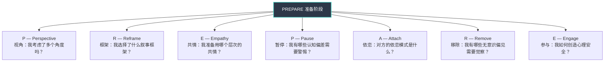
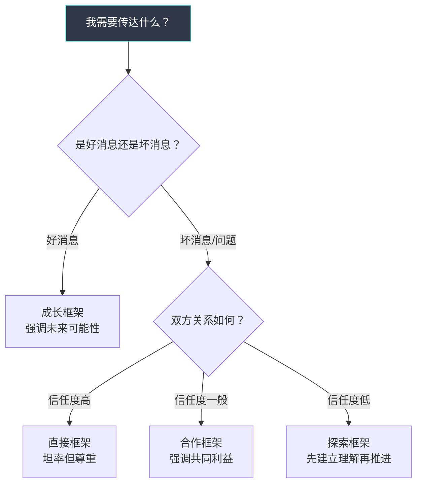
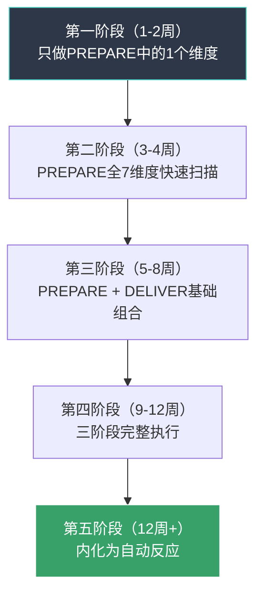

## 七、综合应用：心理智慧沟通模型

前六节分别讲解了认知偏差觉察、框架转换、高级共情、心理安全感构建、依恋觉察、无意识偏见觉察六项独立技巧。这些技巧每项都有明确的适用场景和操作步骤，但在真实沟通中，你面对的从来不是"单一问题"——一场绩效面谈可能同时涉及锚定效应、依恋动态、框架选择和心理安全感；一次亲密关系中的争吵可能同时触发确认偏差、回避型依恋模式和情绪传染。

因此，你需要的不是六套独立工具，而是一个**统一的思维框架**，能够在沟通前、沟通中、沟通后系统性地调用这些心理学工具。本节提供的"心理智慧沟通模型"（Psychologically Wise Communication Model，简称PWCM）就是这个框架。

### 7.1 模型设计原理

#### 为什么需要一个整合模型

心理学工具的碎片化使用存在三个典型问题：

**问题一：工具选择困难。** 面对一场即将到来的艰难对话，你同时知道认知偏差觉察、共情技巧、框架转换都很重要，但时间有限，你不知道该优先关注哪个。结果往往是哪个都没用好。

**问题二：只在事后才想起。** 很多人在沟通结束后才意识到"我当时应该觉察锚定效应"或"我应该切换共情层次"。碎片化的知识无法在高压实时对话中被自动调用。

**问题三：知道但做不到。** 学了很多技巧但实际沟通中完全回到旧模式。原因不是技巧本身无效，而是缺乏一个让技巧"嵌入"沟通流程的结构化方法。

PWCM模型通过**三阶段流程（PREPARE → DELIVER → REFLECT）** 解决这三个问题。它不教你新知识，而是帮你把已有知识变成可执行的沟通习惯。

#### 模型的理论基础

PWCM模型的设计融合了三个成熟框架：

| 来源框架 | 核心理念 | PWCM中的对应 |
|---------|---------|-------------|
| OODA循环（博伊德决策循环） | 观察→定向→决策→行动的快速决策模型 | PREPARE阶段的结构化观察与定向 |
| GROW教练模型 | 目标→现实→选择→意愿的教练对话框架 | DELIVER阶段的对话推进逻辑 |
| 反思性实践（唐纳德·舍恩） | 行动中反思与行动后反思的双重机制 | REFLECT阶段的双重反思结构 |

这三个框架的共同特点是：**提供结构化的思考顺序，减少认知负荷，让复杂决策变得可操作。** PWCM将它们与沟通心理学的具体技巧结合，形成一个专为高质量沟通设计的操作系统。

### 7.2 PREPARE：沟通前的七维准备

PREPARE是沟通前的准备阶段，每个字母对应一个需要检查的心理维度。这不是一个需要花30分钟填写的表格，而是一套**可在2-5分钟内快速扫描的心智清单**。随着练习的深入，这些检查会变成自动化的思维习惯。

#### P — Perspective（视角）：跳出单一视角的局限

**核心问题：** 我是否只从自己的角度看这件事？

视角切换是所有心理智慧的起点。沟通中最常见的错误就是**把"我的视角"当作"唯一的真相"**。心理学称之为"naive realism"（朴素实在论）——我们倾向于认为自己看到的就是客观事实，而不同意我们的人要么信息不足，要么有偏见，要么动机有问题。

**三层视角检查法：**

| 视角层次 | 具体问题 | 作用 |
|---------|---------|------|
| 第一层：自我视角 | 我对这件事的核心诉求是什么？我的情绪状态是什么？我最害怕什么结果？ | 明确自己的立场和情绪，防止无意识地被情绪驱动 |
| 第二层：对方视角 | 对方的核心诉求是什么？对方可能的情绪状态是什么？对方最害怕什么结果？对方的压力来源是什么？ | 理解对方的行为逻辑，避免基本归因错误 |
| 第三层：旁观者视角 | 如果一个公正的第三方在场旁观，他会怎么看这件事？他会指出谁的盲区？ | 跳出双方的情绪纠缠，看到更客观的图景 |

**实操示例：** 你准备和下属小李谈绩效问题。你对他的工作态度不满，觉得他"不够投入"。

- **自我视角检查：** 我的不满有多少是基于客观数据（迟到次数、交付质量），多少是基于主观感受（"感觉他不在状态"）？我是否因为自己的工作压力而对下属更加苛刻？
- **对方视角检查：** 小李最近是否面临工作之外的压力？他的工作量是否合理？他是否知道我对他的期望？他是否曾经尝试表达困难但被忽略了？
- **旁观者视角检查：** 如果HR在场旁观这次谈话，他们会认为我的反馈是建设性的还是攻击性的？我的语气和措辞经得起第三方审视吗？

**常见错误：** 很多人做了第一层检查就觉得自己"已经反思了"，但跳过了第二层和第三层。真正有效的视角切换必须完成全部三层，尤其是第三层——旁观者视角是打破自我中心最有力的工具。

#### R — Reframe（框架）：选择最有利的叙事方式

**核心问题：** 我用什么框架来组织这次对话？

框架效应（详见理论基础第七节和核心技巧第二节）告诉我们：同样的信息，用不同的方式呈现，会产生截然不同的心理影响。在沟通准备阶段，你需要主动选择一个**既能表达你的真实意图、又能被对方接受的叙事框架**。

**三种常用的沟通框架：**

| 框架类型 | 核心叙事 | 适用场景 | 示例 |
|---------|---------|---------|------|
| 合作框架 | "我们共同面对一个问题" | 双方有共同利益但存在分歧 | "我们都需要这个项目成功，来讨论一下怎么做最好" |
| 成长框架 | "这是一个学习和改进的机会" | 需要指出问题但不想打击对方 | "这次的经验能帮我们下次做得更好，关键教训是什么？" |
| 探索框架 | "让我们一起弄清楚" | 情况不明朗、需要更多信息 | "我对这个情况还不完全了解，帮我理解一下你的思考过程" |

**框架选择的决策逻辑：**

**框架陷阱警告：** 框架选择不是"操纵"对方。如果你选择的框架与你的真实意图不一致（比如用合作框架包装单方面要求），对方迟早会感受到被操纵，信任会遭到更严重的破坏。好的框架选择是**找到一种既能表达真相、又能被对方接受的表达方式**，而不是给真相穿一件伪装。

#### E — Empathy（共情）：确定共情的层次和方式

**核心问题：** 这次沟通需要哪种层次的共情？

共情不是一个"越深越好"的能力。如理论基础第四节所述，共情分为三个层次——认知共情、情感共情、共情关怀——每种层次适用于不同场景。在沟通前确定你需要使用哪种共情，可以避免"共情不足"或"共情过度"两种极端。

**共情层次选择指南：**

| 沟通类型 | 推荐共情层次 | 原因 | 具体做法 |
|---------|------------|------|---------|
| 绩效反馈 | 认知共情为主 | 需要保持客观判断，情感共情可能让你"心软"而回避关键反馈 | "我理解完成这个项目对你来说很有挑战性"（理解而不代入） |
| 亲密关系冲突 | 情感共情为主 | 对方需要的不是分析，而是被感受 | 停下来，感受对方的情绪，用身体语言和简短回应传达"我感受到你了" |
| 朋友遇到困难 | 共情关怀为主 | 理解和感受之后，对方需要实际行动支持 | "我能感受到你的困难，我能做些什么来帮你？" |
| 跨文化沟通 | 认知共情为主 | 文化差异大时，情感共情容易误判对方的情绪状态 | "在你的文化背景下，这件事可能意味着……我理解得对吗？" |
| 危机处理 | 认知共情为主 | 情况紧急，需要冷静判断，情感共情可能消耗过多认知资源 | "我理解你现在很焦虑，我需要先确保安全，然后我们再讨论感受" |

**关键提醒：** 在一次较长的对话中，你可能需要在不同阶段切换共情层次。比如绩效面谈开始时用认知共情建立理解，中间用情感共情让对方感到被尊重，最后用共情关怀提供具体支持。PREPARE阶段的任务是**确定开场时使用哪种共情，以及在什么信号出现时切换**。

#### P — Pause（暂停）：系统性检查认知偏差

**核心问题：** 我有哪些已知的认知偏差可能在这次沟通中被触发？

这是PREPARE模型中最需要诚实的一个环节。认知偏差觉察技巧（核心技巧第一节）提供了STOP技巧用于实时制动，但PREPARE阶段的暂停是**事前预警**——在沟通开始前，你就识别出高风险偏差并做好应对预案。

**高频偏差预检清单：**

| 偏差类型 | 自检问题 | 如果答案是"是"，该怎么做 |
|---------|---------|----------------------|
| 确认偏差 | 我是否已经对这次沟通的结论有了预判？ | 写下你的预判，然后刻意寻找3条反驳证据 |
| 锚定效应 | 是否有某个数字/信息可能成为不合理的锚点？ | 提前准备自己的锚点，或用"这个数字是怎么来的？"来解构对方的锚点 |
| 基本归因错误 | 我是否把对方的行为归因于"人品/态度"而非情境？ | 列出至少2个可能的情境因素（压力、信息不足、资源限制等） |
| 光环效应/尖角效应 | 我对这个人的整体印象是否过度影响了我对具体事件的判断？ | 把"对人的评价"和"对事的评价"分开写在两列 |
| 现状偏差 | 我是否倾向于维持现状而抗拒必要的改变？ | 问自己"如果今天是我第一天接手这个情况，我会怎么做？" |
| 损失厌恶 | 我是否因为害怕失去而做出了不理性的决策？ | 量化"不行动的代价"和"行动的风险"，用数字代替感觉 |

**偏差叠加风险：** 真实沟通中，多个偏差往往同时作用。比如你对某人有光环效应（觉得他能力强），同时又有确认偏差（只看到支持他能力强的证据），两个偏差叠加会让你对他工作中的问题视而不见。PREPARE阶段的预检就是要**把这些叠加的偏差链条识别出来**。

#### A — Attach（依恋）：觉察关系中的依恋动态

**核心问题：** 这次沟通是否涉及依恋模式的激活？

依恋理论（详见理论基础第六节和核心技巧第五节）揭示了一个反直觉的事实：很多看似"就事论事"的沟通冲突，背后其实是依恋系统的激活。当一个人感到被忽视、被抛弃、被控制时，依恋系统会接管他的行为模式——焦虑型的人会追着要回应，回避型的人会关闭沟通通道。

**依恋觉察在PREPARE中的应用：**

不需要给对方"贴标签"，而是通过以下信号做初步判断：

| 依恋模式 | 常见沟通行为 | 对方可能出现这些行为时的应对准备 |
|---------|------------|-------------------------------|
| 安全型 | 能坦率表达需求，能接受分歧，不过度防御 | 正常沟通即可，他们能处理直接反馈 |
| 焦虑型 | 频繁寻求确认，害怕被忽视，容易过度解读沉默和模糊信息 | 提前准备明确、具体的回应，避免模糊表述，主动给予确认 |
| 回避型 | 面对冲突时退缩，不喜欢被"逼"表态，需要独处空间来处理情绪 | 给对方思考的时间和空间，不要追问"你现在怎么想"，用书面方式可能比面对面更有效 |
| 混乱型 | 行为不可预测，既渴望亲密又恐惧亲密 | 保持稳定一致的态度，不被对方的情绪波动带着走 |

**关于自我依恋模式的检查：** 同样重要的是觉察你自己的依恋模式。如果你是焦虑型，你可能在这次沟通中过度寻求对方的认可；如果你是回避型，你可能在对话变得紧张时想要逃离。提前觉察自己的模式，才能在模式被激活时做出有意识的选择而非自动反应。

#### R — Remove（移除）：识别并削弱无意识偏见

**核心问题：** 我对沟通对象有哪些可能影响公正判断的无意识偏见？

无意识偏见（详见理论基础第八节和核心技巧第六节）是最难在PREPARE阶段处理的维度，因为偏见的特点就是"你意识不到它存在"。但研究显示，仅仅**知道偏见的存在**就能降低其影响约20-30%。

**PREPARE阶段的偏见扫描：**

扫描以下维度，问自己"在这个维度上，我对沟通对象有没有预设判断？"

- **人口统计维度：** 性别、年龄、外貌、口音、学历、地域
- **关系维度：** 对方是"我的人"还是"别人的人"？是新人还是老员工？
- **过往经验维度：** 我是否因为对方过去某次表现而形成了整体判断？
- **相似性维度：** 我是否因为对方"和我像"而放松了标准，或者因为"和我不像"而提高了标准？

**偏见削弱策略：** 一旦识别出可能的偏见，使用以下策略削弱其影响：

| 策略 | 操作方法 | 效果 |
|------|---------|------|
| 个体化 | 刻意关注这个人的独特特质，而非其所属群体的刻板印象 | 从"这类人都……"转变为"这个人具体是……" |
| 反向思考 | 如果对方的性别/年龄/外貌不同，我会做出同样的判断吗？ | 暴露隐藏的双重标准 |
| 数据锚定 | 用客观数据代替主观印象来评估 | 减少"感觉"对判断的影响 |
| 延迟判断 | 在收集足够信息之前，有意识地悬置判断 | 避免第一印象的过度影响 |

#### E — Engage（参与）：设计心理安全的沟通环境

**核心问题：** 我如何让这次沟通在心理安全的环境中进行？

心理安全感（详见理论基础第五节和核心技巧第四节）决定了对方是否愿意在这次沟通中展现真实的自己——说出真实想法、承认真实错误、表达真实需求。如果心理安全感不足，对方会进入"自我保护模式"，你得到的信息都是经过过滤和修饰的，沟通质量大打折扣。

**PREPARE阶段的环境设计：**

| 设计维度 | 需要提前决定的事项 | 心理学原理 |
|---------|------------------|-----------|
| 物理环境 | 在哪里谈？办公室（权力感强）还是中性空间（平等感强）？坐着还是站着？ | 环境线索会激活不同的心理状态 |
| 时间安排 | 选在什么时间？对方是否有足够的时间而不必赶下一个会议？ | 时间压力会激活系统1思维，降低沟通质量 |
| 开场方式 | 第一句话说什么？是直入主题还是先寒暄？ | 开场30秒决定了整场对话的情绪基调 |
| 隐私保障 | 对话内容是否会保密？需要明确告知对方保密边界 | 信息泄露的恐惧是心理安全的最大杀手 |
| 退出机制 | 对方是否可以申请暂停或改期？ | 知道自己有"退出权"反而会降低防御 |

**PREPARE检查清单（完整版）：**

在每次重要沟通前，用2-5分钟快速扫描以下问题：

PREPARE 快速检查清单

□ P-视角：我考虑了自我视角、对方视角、旁观者视角吗？
□ R-框架：我选择了什么框架？这个框架与我的真实意图一致吗？
□ E-共情：这次沟通需要认知共情、情感共情还是共情关怀？
□ P-暂停：我有哪些认知偏差可能被触发？有应对预案吗？
□ A-依恋：对方和我的依恋模式可能如何影响这次对话？
□ R-偏见：我对沟通对象有哪些可能的无意识偏见？
□ E-安全：我如何设计环境和开场来营造心理安全感？

### 7.3 DELIVER：沟通中的实时执行

PREPARE解决了"想清楚"的问题，但沟通是实时的、动态的、不可预测的。你需要一个执行框架来应对对话中的变化。DELIVER阶段的核心理念是：**保持心理觉察的"后台进程"运行，同时聚焦于对话本身。**

#### D — Detect（检测）：实时捕捉情绪和认知信号

在对话过程中，你需要同时关注两个层面的信号：

**情绪信号：** 对方的语速、音量、呼吸模式、面部表情、身体姿态的变化。比如语速突然加快可能意味着焦虑或愤怒，身体后仰可能意味着防御或不认同，长时间的沉默可能意味着正在处理强烈的情绪。

**认知信号：** 对方是否出现了认知偏差的迹象？比如对方是否只引用支持自己观点的证据（确认偏差）？是否过度依赖第一个提到的数字（锚定效应）？是否因为对方某个优点而忽视了其他问题（光环效应）？

**"后台监控"的正确方式：** 检测信号不等于分析瘫痪。你不需要对每个信号都做出反应，而是像雷达一样持续扫描，只在出现**显著偏差或关键情绪转折**时才介入。过度分析会让你"不在场"——对方会感觉你在观察他而不是在和他对话。

#### E — Empathize（共情回应）：在正确的时机使用正确的共情

当检测到情绪信号时，你需要做出即时的共情回应。关键是**匹配对方的情绪强度**——回应过轻显得冷漠，回应过重显得夸张。

**共情回应的校准表：**

| 对方的情绪强度 | 适当的回应方式 | 不适当的回应 |
|-------------|-------------|-------------|
| 低度（轻微不满） | 简短确认："我听到了，这确实让人不舒服" | 过度放大："天哪，这太糟糕了！" |
| 中度（明显沮丧/焦虑） | 停下正题，用1-2分钟回应情绪："看得出来这件事对你影响很大，能多说说吗？" | 跳过情绪直接解决问题："别想那么多了，我们来看看怎么办" |
| 高度（强烈愤怒/悲伤） | 完全暂停议题，全力回应情绪：保持安静的陪伴、递水、等对方平复 | 讲道理/反驳/催促冷静：这些只会火上浇油 |

#### L — Listen（深度倾听）：超越表面信息的四层倾听

深度倾听不是"安静地等对方说完"。它需要你同时听到四个层次：

| 倾听层次 | 关注点 | 常用回应 |
|---------|-------|---------|
| 事实层 | 对方说了什么具体内容？ | "你说的是……对吗？" |
| 情绪层 | 对方在表达什么情绪？ | "听起来你对这件事感到……" |
| 需求层 | 对方真正需要什么？ | "你是不是希望……" |
| 身份层 | 这件事对对方的自我认知意味着什么？ | "这件事是不是让你觉得自己……" |

大多数人只听到第一层，偶尔听到第二层。真正有质量的倾听需要到达第三层和第四层——尤其是第四层，身份层的信息往往才是对方真正的"痛点"所在。

**示例：** 下属说"这个项目的资源分配不公平"。

- **事实层：** 他在说资源分配问题。
- **情绪层：** 他感到不公平、被忽视。
- **需求层：** 他需要更多的资源或更透明的分配机制。
- **身份层：** 他可能觉得自己不被重视、不被当作核心成员。这一层才是真正的驱动力——即使你解决了资源问题，如果身份层的需要没有被回应，不满会以其他形式再次出现。

#### I — Inquire（探索性提问）：用提问推进理解而非推进议程

提问有两种截然不同的目的：**推进理解**（我真的想知道答案）和**推进议程**（我用提问来引导你同意我）。在心理智慧沟通中，你应该以前者为主。

**高质量提问的特征：**

| 低质量提问 | 高质量提问 | 为什么后者更好 |
|-----------|-----------|-------------|
| "你难道不觉得这样做有问题吗？"（引导性） | "你怎么看这个方案？"（开放性） | 前者已经包含了你的判断，后者真正邀请对方思考 |
| "你为什么不早点说？"（追责性） | "是什么让你现在决定提出来？"（探索性） | 前者让对方防御，后者让对方打开心扉 |
| "你是不是不想干了？"（威胁性） | "最近工作上有什么让你困扰的吗？"（关怀性） | 前者激活对抗，后者激活信任 |

**探索性提问的万能句式：**

- "能帮我理解一下你的思考过程吗？"
- "如果站在你的角度，最让你担心的是什么？"
- "你理想中的结果是什么样的？"
- "有没有什么是我遗漏了的信息？"

#### V — Validate（确认理解）：在表达自己之前先确认对方

这一步是很多人跳过的——他们听完对方说的，直接开始表达自己的观点。但跳过确认步骤会导致一个严重问题：你以为你理解了对方，但其实你理解的是你**以为**的对方。

**确认的标准句式：**

> "我确认一下我是否理解正确：你觉得……（复述核心内容），同时你感到……（复述情绪），你希望的是……（复述需求）。我理解得对吗？"

这个句式覆盖了事实、情绪、需求三个层次，给对方充分的修正空间。它传递的信号是："我认真听了，我不假设自己一定理解对了，你有最终的解释权。"

**当对方说"不，你理解错了"时：** 这不是失败，而是成功——你避免了基于错误理解做出错误回应。感谢对方的纠正，然后重新倾听。

#### E — Express（表达）：用心理智慧组织你的表达

在充分理解对方之后，才是表达自己观点的时机。这时候PREPARE阶段选择的框架开始发挥作用。

**表达的三层结构：**

1. **连接层：** 先连接对方的立场，建立"我听到了你"的基础。"我理解你的顾虑是……，这确实很重要。"
2. **观点层：** 清晰、具体地表达你的立场。使用"我"语句而非"你"语句。"我观察到的是……"而非"你的问题是……"
3. **邀请层：** 邀请对方回应你的观点。"你怎么看我刚才说的？"

**避免的表达方式：**

| 有害表达 | 替代方式 | 心理机制 |
|---------|---------|---------|
| "你总是……" | "在最近这三次情况中，我注意到……" | "总是"激活防御，具体事例降低威胁感 |
| "你应该……" | "我建议……你觉得可行吗？" | "应该"暗示对方做错了，建议给予选择权 |
| "但是……"（在肯定之后） | "同时……"或"我补充一个角度……" | "但是"会否定前面所有的肯定 |
| "我不是针对你" | 直接说事实，不需要声明 | 声明本身就是负面信号，暗示"我接下来说的话可能让你觉得被针对" |

#### R — Resolve（解决）：推进具体行动方案

沟通的最终目的是解决问题或达成共识，而非仅仅"互相理解"。RESOLVE阶段将对话从"理解"推进到"行动"。

**推进解决的结构：**

1. **总结共识：** "到目前为止，我们都同意的是……"
2. **明确分歧：** "我们还没有达成一致的是……"
3. **探索选项：** "针对这个分歧，有哪些可能的方案？"（用头脑风暴的心态，不急于评判）
4. **选择方案：** "这几个方案中，哪个你觉得最可行？"
5. **确定行动：** "那我们接下来各自做什么？什么时候再跟进？"

**解决阶段的常见陷阱：**

- **假共识：** 对方说"好的"但其实心里不同意——通过观察非语言信号和主动确认来避免。"你点头了，但我感觉你可能还有顾虑？"
- **没有行动的共识：** "以后注意"不是行动方案——具体到"下次遇到这种情况，你先做X，然后做Y，周三前给我反馈"。
- **跳过情绪直接解决：** 如果对方的情绪还没有被充分回应就急着推进解决方案，方案的执行率会极低。

### 7.4 REFLECT：沟通后的双重反思

REFLECT是模型的第三个阶段，也是最容易被跳过的阶段。大多数人沟通完就"翻篇了"，但真正的能力提升发生在沟通之后的反思中。

#### 行动中反思（Reflection-in-Action）

这是唐纳德·舍恩提出的概念，指的是**在对话进行中进行的快速自我检查**。它不是停下来思考一分钟，而是一种同时"参与对话"和"观察对话"的双轨能力。

**行动中反思的核心问题（在对话中快速扫描）：**

- "我现在是系统1还是系统2在主导？"
- "对方的情绪在哪个层次？我的回应匹配了吗？"
- "对话的方向对吗？是否被某个偏差带偏了？"
- "对方的非语言信号和语言内容是否一致？"

这种能力需要大量练习才能自动化。初期，你可以在对话的自然停顿点（比如对方说完一段话之后、你回应之前）做一次快速扫描。随着练习深入，扫描会变成几乎无意识的习惯。

#### 行动后反思（Reflection-on-Action）

这是每次重要沟通结束后应该进行的系统性反思。不需要写长篇日记，但需要回答以下问题：

**REFLECT反思清单：**

| 维度 | 反思问题 | 记录要点 |
|------|---------|---------|
| 视角（P） | 我是否真正做到了多视角？哪个视角是我遗漏的？ | 记录遗漏的视角及其可能带来的不同判断 |
| 框架（R） | 我选择的框架效果如何？对方接受了吗？ | 记录框架的接受度和需要调整的地方 |
| 共情（E） | 我的共情层次选对了吗？有没有过度或不足？ | 记录共情时机和效果 |
| 偏差（P） | 哪些偏差实际出现了？我成功觉察了吗？ | 记录具体偏差及其影响 |
| 依恋（A） | 依恋动态是否影响了对话？我处理得当吗？ | 记录依恋相关的互动模式 |
| 偏见（R） | 我的无意识偏见是否影响了判断？ | 记录偏见触发点和应对效果 |
| 安全（E） | 心理安全水平如何？对方是否全程坦率？ | 记录安全感的变化和关键时刻 |

**反思的时间要求：** 重要沟通后的反思不需要超过10分钟。但这10分钟的价值极高——它是你从"偶尔应用心理学技巧"到"内化为沟通本能"的关键转化器。

**反思的记录方式：** 建议使用简单的结构化模板：

日期：YYYY-MM-DD
沟通对象：
沟通类型：[绩效面谈/亲密对话/团队会议/冲突处理/其他]
PREPARE准备评估（1-5分）：___
实际执行评估（1-5分）：___
做得最好的一点：
最需要改进的一点：
下次我会这样调整：

### 7.5 模型的场景化应用

PWCM模型不是一套固定流程，而是一个**可按场景裁剪的框架**。不同的沟通场景需要对模型的不同维度给予不同的权重。

#### 场景一：绩效面谈

| 阶段 | 重点关注 | 简化处理 |
|------|---------|---------|
| PREPARE | 框架（R）+ 偏差（P）+ 偏见（R） | 绩效面谈最容易受到确认偏差和光环效应影响，框架选择决定了对话的基调 |
| DELIVER | 倾听（L）+ 表达（E） | 先充分倾听对方的自我评估，再用事实数据表达你的评估 |
| REFLECT | 偏差 + 偏见 | 重点反思"我是否公正地评估了这个人？" |

**PREPARE快速检查：** "我对这个人的评价有多少基于客观数据？如果换一个人做了同样的工作，我会给出相同评价吗？"

#### 场景二：亲密关系冲突

| 阶段 | 重点关注 | 简化处理 |
|------|---------|---------|
| PREPARE | 依恋（A）+ 共情（E）+ 安全（E） | 亲密关系冲突的核心是依恋系统被激活，安全的沟通环境比"赢"更重要 |
| DELIVER | 检测（D）+ 共情（E）+ 确认（V） | 先回应情绪，再讨论事情——顺序不能反 |
| REFLECT | 依恋 + 共情 | 重点反思"我是否真正理解了对方的情绪和需求？" |

**PREPARE快速检查：** "对方现在是在用理性说话还是在用依恋系统反应？我需要先回应情绪。"

#### 场景三：团队决策会议

| 阶段 | 重点关注 | 简化处理 |
|------|---------|---------|
| PREPARE | 视角（P）+ 安全（E）+ 偏差（P） | 团队决策最容易受到群体思维和锚定效应影响 |
| DELIVER | 提问（I）+ 确认（V） | 用提问鼓励不同声音，用确认避免假共识 |
| REFLECT | 偏差 + 视角 | 重点反思"我们是否充分考虑了不同角度？是否有人被忽视了？" |

**PREPARE快速检查：** "团队中是否有人可能因为权力梯度而不敢表达异议？我如何邀请他们发言？"

#### 场景四：跨文化沟通

| 阶段 | 重点关注 | 简化处理 |
|------|---------|---------|
| PREPARE | 偏见（R）+ 框架（R）+ 共情（E） | 跨文化沟通中的偏见和框架陷阱最隐蔽，需要额外警惕 |
| DELIVER | 倾听（L）+ 确认（V） | 多确认，少假设——你对对方文化的理解可能完全错误 |
| REFLECT | 偏见 + 框架 | 重点反思"我是否用了自己的文化标准来评判对方？" |

**PREPARE快速检查：** "我对这个文化有哪些刻板印象？我是否把自己的沟通习惯当作了'通用标准'？"

### 7.6 从刻意练习到自动反应

PWCM模型看起来复杂——七个PREPARE维度、七个DELIVER步骤、七个REFLECT问题。如果你试图在每次沟通中都完整执行这三个阶段，会陷入"分析瘫痪"，反而比不用模型更糟。

**正确的学习路径是渐进式的：**

**第一阶段（1-2周）：单维度练习。** 选择PREPARE中你最薄弱的一个维度，比如"视角切换"。在接下来两周的每次重要沟通前，只做这一个检查。不要管其他六个维度。目标是让这个检查变成本能反应。

**第二阶段（3-4周）：PREPARE完整扫描。** 当单维度练习变成习惯后，扩展到完整的PREPARE七维检查。此时你应该能在2-3分钟内完成全部扫描。可以在手机备忘录中保存检查清单，每次沟通前看一眼。

**第三阶段（5-8周）：加入DELIVER。** 在沟通中加入"后台监控"——不试图控制对话走向，只是保持对情绪信号和认知偏差的觉察。当信号出现时，从DELIVER中选择一个最合适的步骤回应。

**第四阶段（9-12周）：加入REFLECT。** 每次重要沟通后花5-10分钟做结构化反思。这个阶段的关键是**记录和回顾**——你会发现自己的模式，比如"我总是对小李有确认偏差"或"我在亲密关系中遇到冲突就进入回避模式"。

**第五阶段（12周以后）：内化。** 当三阶段的执行都变成习惯后，你不再需要刻意检查清单。PREPARE变成了一种"直觉"——在沟通前几秒自动完成视角切换、框架选择、偏差扫描。DELIVER变成了"自然"——你在对话中自然而然地检测信号、调整共情、深度倾听。REFLECT变成了"本能"——沟通结束后你自动开始回顾。

### 7.7 模型的常见错误和纠偏

即使有了PWCM模型，使用过程中仍然有一些高频错误需要警惕：

**错误一：把PREPARE变成了操控工具。** 有人用PREPARE来精心设计"如何让对方按我想的做"。这是对模型的根本误用。PWCM的目标是**提升沟通质量**，而非提升操控能力。如果PREPARE的结果是"我找到了操纵对方的最佳策略"，你已经走偏了。

**纠偏方法：** 检查你的PREPARE——如果七个维度的检查都在优化"如何让对方接受我的观点"，而没有一个在优化"我是否真正理解了对方"，你需要重新来过。

**错误二：在DELIVER阶段过度分析。** 有人在对话中不停地分析"对方的依恋模式是什么""这是不是锚定效应"，结果完全丧失了对话的自然感。对方会觉得你在"审视"他而非"倾听"他。

**纠偏方法：** DELIVER阶段的分析应该是"后台进程"，不是"前台应用"。把注意力的90%放在对话本身，只有10%用于心理觉察。当出现显著信号时才切换注意力。

**错误三：REFLECT变成自我批评。** 有人在反思中反复纠结"我做得不好""我又犯了确认偏差"，把反思变成了焦虑的来源。

**纠偏方法：** REFLECT的目标是**学习**，不是**审判**。用好奇心而非自责的心态来反思："有趣，我今天又出现了光环效应，下次我可以在什么信号出现时提醒自己？"

**错误四：只对自己使用模型，不对对方使用。** PWCM不只是"管理自己"的工具，也是"理解对方"的工具。如果你只用它来觉察自己的偏差，却不用它来理解对方的偏差和需求，你就只发挥了模型一半的价值。

**错误五：在低风险沟通中过度使用。** 不是每句话都需要PREPARE。和同事闲聊、和朋友开玩笑、日常事务性沟通，不需要启动PWCM模型。过度使用会让沟通变得僵硬和不自然。PWCM适用于**重要的、复杂的、高风险的沟通场景**。

### 7.8 本节小结

心理智慧沟通模型（PWCM）将前六节的心理学技巧整合为一个可操作的三阶段框架：

| 阶段 | 核心任务 | 时间投入 | 关键能力 |
|------|---------|---------|---------|
| PREPARE | 沟通前的七维心理准备 | 2-5分钟 | 视角切换、框架选择、共情定位、偏差预警、依恋觉察、偏见扫描、安全设计 |
| DELIVER | 沟通中的实时心理觉察 | 贯穿全程 | 情绪检测、即时共情、深度倾听、探索提问、确认理解、心理表达、推进解决 |
| REFLECT | 沟通后的双重反思 | 5-10分钟 | 行动中反思（实时）、行动后反思（事后） |

模型的核心价值不在于它提供了多少新知识，而在于它**把已有的知识嵌入了一个可重复的沟通流程**。通过渐进式练习（从单维度到三阶段完整执行），你最终会将这些心理学工具内化为自动反应——在任何沟通场景中，自然而然地觉察偏差、选择框架、调适共情、营造安全。

这是从"知道心理学"到"活用心理学"的关键跨越。
