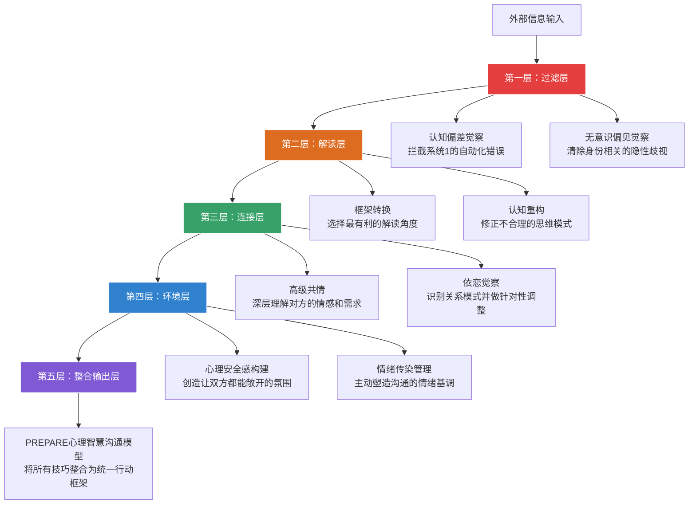
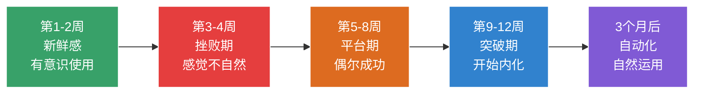

## 本节小结：核心技巧全景回顾与整合

本节从七个维度系统拆解了沟通心理学的核心技巧——从认知偏差觉察、框架转换、高级共情、心理安全感构建、依恋觉察、无意识偏见识别，到综合应用的心理智慧沟通模型。这些技巧不是孤立的工具箱，而是一个相互咬合的齿轮系统：觉察偏差的能力支撑着框架转换的准确性，共情的深度决定了心理安全感的厚度，依恋模式的识别帮助你选择正确的共情策略，而无意识偏见的清除是所有技巧发挥效力的前提条件。

本小结的目标不是简单重复前文要点，而是帮助你建立**全景式的认知地图**——理解这些技巧之间的逻辑关系、掌握从"知道"到"做到"的转化路径、识别实践中的常见陷阱，并为你规划一条可执行的持续精进路线。

### 技巧间的逻辑关系：一张完整的认知地图

很多读者学完一组技巧后最大的困惑是：这些技巧之间是什么关系？什么时候用哪个？实际上，这七个技巧构成了一个**层次递进的系统**，可以按照信息处理的时间顺序来理解：

**过滤层（偏差觉察 + 偏见识别）**解决的是"我看到的是真实信息吗"的问题。在信息到达你的意识之前，系统1已经完成了初步加工，认知偏差和无意识偏见就像两层有色滤镜——前者扭曲你对事件的判断，后者扭曲你对人的判断。这一层的目标不是消除它们（这不可能），而是在它们造成后果之前**拦截**。

**解读层（框架转换 + 认知重构）**解决的是"我怎么理解这件事"的问题。过滤后的信息进入你的认知系统，框架转换改变的是**外部信息的呈现角度**——同一个事实，换一个参照系就有不同的意义；认知重构改变的是**内部思维的运作模式**——识别并修正那些自动化的不合理信念。两者配合，一个从外向内调整输入，一个从内向外调整处理规则。

**连接层（高级共情 + 依恋觉察）**解决的是"我和对方之间发生了什么"的问题。共情让你穿透语言表层，捕捉对方真正的情感和需求；依恋觉察让你理解对方的反应模式不是针对你个人，而是源于更深层的关系图式。这一层的产出是**对关系动态的准确地图**。

**环境层（心理安全感 + 情绪管理）**解决的是"我们对话的土壤是什么状态"的问题。前六项技巧再精妙，如果对话发生在恐惧和防御的土壤上，也很难开花结果。心理安全感构建的是**信任的基础设施**，情绪传染管理维护的是**对话的情绪生态系统**。

**整合层（PREPARE模型）**将上述所有技巧压缩为一个可在重要沟通前快速执行的检查清单：Perspective（多视角）→ Reframe（框架选择）→ Empathy（共情层次）→ Pause（偏差暂停）→ Attach（依恋觉察）→ Remove（偏见清除）→ Engage（安全参与）。

### 每项技巧的核心要点速览

为了方便回顾和查阅，以下用表格形式梳理每项技巧的核心信息：

| 技巧 | 核心问题 | 关键工具 | 最适用场景 | 常见误用 |
|------|----------|----------|------------|----------|
| 认知偏差觉察 | 我的判断是否被自动化思维劫持？ | STOP技巧、系统1/系统2切换信号检测 | 争论、谈判、紧急决策 | 过度怀疑自己的所有直觉，导致决策瘫痪 |
| 框架转换 | 同一事实能否换一个更有建设性的角度？ | 情境换框、意义换框、参照点调整 | 冲突调解、危机沟通、激励团队 | 框架转换变成粉饰事实或逃避问题 |
| 高级共情 | 对方真正的情感和需求是什么？ | 三层共情递进（认知→情感→行动）、观点采择四步法 | 亲密关系沟通、客户投诉、心理咨询 | 共情变成讨好，失去自我边界 |
| 心理安全感 | 对方是否敢于真实表达？ | 谦逊语言、邀请异议、正常化失败 | 团队管理、教育场景、医患沟通 | 安全感变成无底线纵容，失去建设性张力 |
| 依恋觉察 | 对方的反应模式背后的依恋需求是什么？ | 焦虑/回避信号识别、针对性回应策略 | 亲密关系、亲子关系、长期合作关系 | 给对方贴标签，忽略情境因素 |
| 无意识偏见 | 我是否因身份标签而做了不公正的判断？ | 偏见觉察三问、客观标准建立、社交圈拓宽 | 招聘评估、绩效反馈、跨文化沟通 | 认为自己"没有偏见"而不做检查 |
| 情绪传染管理 | 对话的情绪基调是我想要的吗？ | 情绪调节前置、情绪命名法、节奏控制 | 高压会议、冲突对话、客户服务 | 强行压制对方情绪，导致情绪积压 |

### 从"知道"到"做到"：三个转化瓶颈

学习心理学技巧最大的陷阱是"知识幻觉"——读完觉得"我懂了"，但在真实对话中完全用不出来。这个陷阱有三个具体的瓶颈：

**瓶颈一：觉察延迟**

大多数人在对话中觉察到自己"被偏差劫持"或"情绪失控"的时间点，是在对话结束之后——回到家里复盘时才反应过来："当时我应该……"。从"事后觉察"到"实时觉察"的跨越，是整个技巧体系中难度最大的一步。

突破方法：

- **低强度场景先行练习**：不要在高利害对话中首次使用STOP技巧。先从日常无风险对话开始——同事闲聊、家人晚餐、朋友聚会。在这些场景中刻意练习"暂停2秒再回应"，让这个动作变成肌肉记忆。
- **设置物理提醒物**：在手机壳内侧贴一个小圆点，在电脑显示器边框贴一条彩色胶带。每次看到这些标记，就检查一次"我现在的情绪状态是什么"。持续21天后，这种检查会逐渐自动化。
- **建立事后复盘→事前提醒的循环**：每次复盘发现一个偏差模式后，把下次需要警惕的具体信号写在备忘录里。例如："上次我在客户提出预算削减时立刻进入了防御模式，下次听到'预算'这个词时要特别注意STOP。"

**瓶颈二：技巧之间的切换**

在真实对话中，你往往需要在多个技巧之间快速切换——前一秒在用共情倾听，下一秒发现对方有认知扭曲需要做框架转换，同时还要管理自己的情绪传染。初学者常见的问题是"一次只能用一个技巧"，导致对话变得机械。

突破方法：

- **先精通一个，再叠加第二个**：建议的优先顺序是：STOP技巧（最小成本最大收益）→ 基础共情倾听 → 框架转换。每个技巧至少在真实场景中成功使用20次后，再叠加下一个。
- **建立"如果-那么"预设**：提前为常见场景设定反应规则。例如："如果对方开始人身攻击，那么先用情绪命名法降低强度，再用框架转换把焦点拉回问题本身。"预设减少了实时决策的认知负担。
- **接受不完美**：真实对话不是实验室，你不可能完美地执行每一步。目标不是"每次都做对"，而是"比上次多觉察到一个信号"。

**瓶颈三：自我关怀缺失**

心理学技巧的学习者有一个反直觉的风险：当你开始深度觉察自己的认知模式后，你可能会陷入**过度自我审视**——"我又犯了确认偏误""我的共情又不够深""我的依恋模式是焦虑型"。这种持续的自我批评不仅消耗心理资源，还会让你在沟通中变得更加不自然。

突破方法：

- **设定觉察的"下班时间"**：每天设定一个时间点（例如晚上8点），在此之后停止自我审视的复盘。你的大脑需要整合和休息的时间。
- **用好奇替代评判**：当你发现自己犯了一个偏差时，不要想"我怎么又这样了"，而是想"有意思，我的大脑在什么条件下会选择这条捷径"。好奇是学习的燃料，评判是学习的刹车。
- **记住目标**：你学这些技巧的目的是让沟通更有效、关系更健康，而不是把自己变成一台完美的沟通机器。适度的偏差、适度的情绪化、适度的不完美，恰恰是人类沟通中最珍贵的部分。

### 高效学习者的进阶路径

如果你已经完成了本节的学习，以下是三条可选择的进阶路径：

**路径一：深度专精型**

选择一个你最薄弱或最常用的技巧，用30天时间进行刻意练习。每天至少在一次真实对话中使用该技巧，晚上用情绪日记记录效果。30天后，这个技巧应该已经变成你的第二本能。

推荐练习节奏：

| 周次 | 重点 | 每日练习 |
|------|------|----------|
| 第1周 | 纯觉察 | 记录每天发生的偏差/框架/情绪事件，不求改变，只求看到 |
| 第2周 | 低强度实操 | 在安全场景中（家人、好友）使用STOP或基础共情 |
| 第3周 | 中强度实操 | 在工作场景中（同事、会议）有意识地使用目标技巧 |
| 第4周 | 复盘与固化 | 整理成功和失败案例，提炼个人化的使用规则 |

**路径二：场景驱动型**

不按技巧分类，而是按你最常面对的沟通场景来组织学习。例如：

- **向上沟通场景**（向领导汇报、争取资源）→ 重点练习框架转换 + 认知负荷管理 + 说服心理学
- **冲突管理场景**（意见分歧、利益冲突）→ 重点练习高级共情 + 情绪传染管理 + 认知重构
- **团队管理场景**（绩效反馈、团队建设）→ 重点练习心理安全感 + 无意识偏见觉察 + 依恋觉察
- **亲密关系场景**（伴侣沟通、亲子教育）→ 重点练习依恋觉察 + 高级共情 + 情绪命名法

选择你当前最痛的场景，集中学习对应的技巧组合。

**路径三：教学相长型**

认知科学研究反复证明：**教是最好的学**。当你试图向另一个人解释"什么是框架转换"或"如何做认知偏差觉察"时，你会被迫把模糊的理解变成清晰的表达，这个过程会暴露你自己理解中的盲区。

具体方法：

- 找一个愿意学习的朋友或同事，每周分享一个技巧
- 在工作中做一次15分钟的内部分享
- 在个人笔记中为每个技巧写一个"给5年前的自己的解释"
- 用具体的沟通案例来教，不要用抽象的概念

### 常见误区与纠正

**误区一：把心理学技巧当成操控工具**

所有本节介绍的技巧都有一个共同的前提：**以尊重对方的自主权为基础**。框架转换不是洗脑，共情不是讨好，说服不是操控。如果你发现自己在使用这些技巧时的核心动机是"让对方按我的想法做"，你需要停下来重新审视。真正的沟通高手追求的是**双赢的理解**，而不是单方面的控制。

判断标准很简单：你是否愿意让对方知道你正在使用这个技巧？如果答案是否定的，那它已经越过了操控的边界。

**误区二：试图在每次对话中都使用所有技巧**

这不是目标，也不现实。日常对话的大部分时间，你只需要做一个"觉察者"——安静地观察自己的思维过程，只在关键时刻介入。技巧是消防栓，不是水龙头；它们在危机时刻发挥作用，但不应该一直开着。

一个实用的比例建议：在一天的所有对话中，你可能需要主动使用心理学技巧的次数大约是2-5次。其余时间，正常的直觉反应就够了。

**误区三：忽略文化差异**

本节的许多技巧建立在西方心理学研究的基础上。在中国文化语境中，有些技巧需要做适应性调整：

- **共情的表达方式**：西方强调直接的语言确认（"我能感受到你的愤怒"），中国文化中可能更适合通过行动表达（递一杯水、默默陪伴）
- **心理安全感**：中国组织中的权力距离较大，领导者展示谦逊的方式需要更加含蓄，否则可能被解读为能力不足
- **框架转换**：在中国谈判文化中，"面子"是一个需要特别敏感的框架维度——框架转换时必须同时考虑事实层面和面子层面
- **依恋表达**：中国文化中回避型依恋的表达可能更加隐晦，需要结合语境和关系历史来判断

**误区四：期待立竿见影的效果**

心理学技巧的学习曲线是**阶梯型**的，不是线性的。你会经历这样的过程：

第3-4周的挫败期是最容易放弃的阶段——你已经知道了这些技巧，但在实际对话中总是"来不及用"或者"用得不自然"。这是完全正常的。每一个沟通高手都经历过这个阶段。坚持过去，你会在某个瞬间突然发现"我已经不需要刻意去想了"。

### 核心原则回顾

最后，用四条原则总结本节的全部内容。这四条原则不是口号，而是从所有技巧中提炼出的底层操作系统：

**原则一：觉察先于改变**

你无法改变你看不到的东西。认知偏差、无意识偏见、自动化思维、依恋模式——它们之所以能控制你的沟通行为，恰恰因为你在觉察它们之前，根本不知道它们的存在。因此，**一切改变的起点是觉察**。不要急于"变好"，先学会"看到"。

**原则二：灵活而非机械**

没有任何一个技巧在所有场景中都有效。共情在某些时刻是正确的回应，在另一些时刻可能变成纵容；框架转换在某些情境下能化解冲突，在另一些情境下可能被感知为回避问题。真正的技能不是"知道什么时候用什么"的清单记忆，而是**在实时对话中做出恰当判断的直觉**。这种直觉只能通过大量真实场景的练习来培养。

**原则三：持续练习才能内化**

心理学技巧与骑自行车有相同的特征：你可以通过阅读理解原理，但只有通过反复摔倒才能学会保持平衡。每天5分钟的情绪日记、每次重要沟通后的10分钟复盘、每周一次的角色互换练习——这些看似微小的习惯，经过3-6个月的积累，会在你的沟通能力上产生显著的质变。

**原则四：自我关怀是持续精进的燃料**

学习沟通心理学的最大风险不是"学不会"，而是"学了之后对自己更苛刻"。当你开始用心理学的放大镜审视自己的每一次沟通时，你会发现自己"满身都是问题"。这时候需要记住：你是一个正在学习的人，不是一个已经完成的产品。对自己的偏差保持好奇而非评判，对自己的进步保持耐心而非焦虑——这本身就是最好的沟通心理学实践。

***
