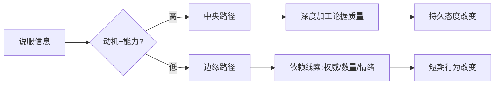
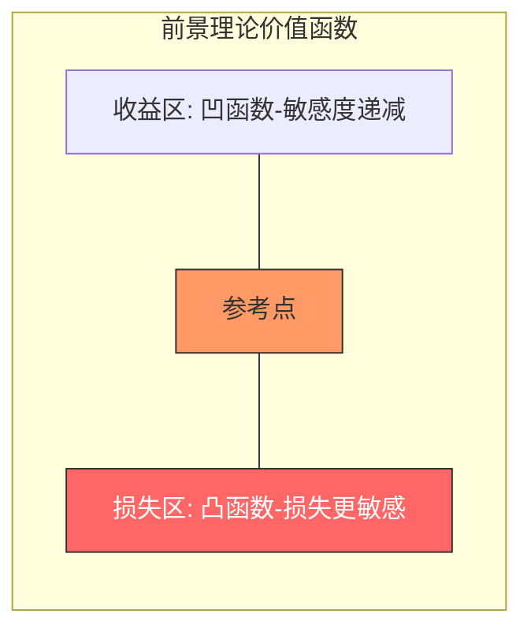
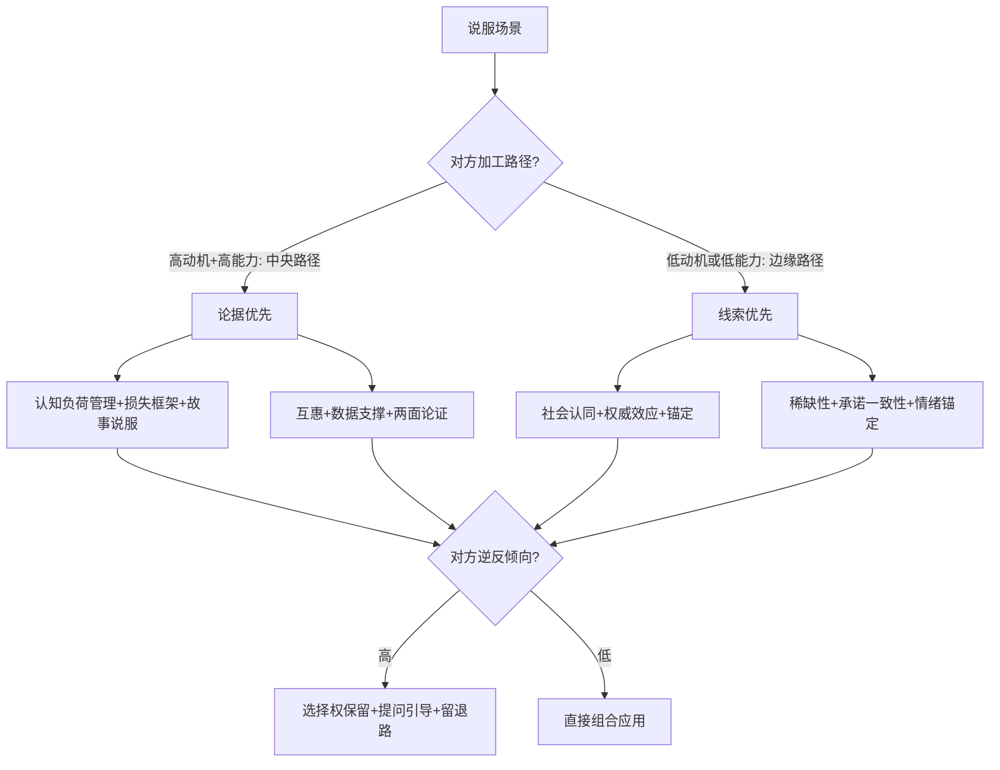

## 八、高级说服心理学技巧

说服不是操控，而是帮助他人在信息充分、心理安全的条件下做出更优决策。本节从认知科学、社会心理学和行为经济学三大理论源流出发，系统拆解八项高级说服技巧：认知负荷管理、社会认同应用、情绪锚定、承诺一致性、损失厌恶框架、互惠触发、故事说服与心理逆反化解。每项技巧均包含原理机制、操作步骤、实战案例与常见误区，帮助读者从"知道"走向"做到"。

### 8.1 说服的底层逻辑：ELM 精细加工可能性模型

在讨论具体技巧之前，需要先理解说服发生的心理路径。Petty 和 Cacioppo 提出的**精细加工可能性模型（Elaboration Likelihood Model, ELM）** 是说服研究的核心框架，它将说服分为两条路径：

| 维度 | 中央路径 | 边缘路径 |
|------|----------|----------|
| 加工深度 | 深度思考论据逻辑 | 依赖表面线索 |
| 所需条件 | 高动机 + 高能力 | 低动机或低能力 |
| 态度持久性 | 持久、抗反驳 | 短暂、易改变 |
| 典型场景 | 专业采购决策、长期合作谈判 | 日常推荐、限时促销 |
| 说服策略重心 | 论据质量、数据支撑 | 社会认同、权威、情绪 |

**关键洞察：** 说服策略必须匹配对方的加工路径。对深度思考的人用"权威效应"会被视为套路；对无暇思考的人用严密逻辑则收效甚微。判断对方处于哪条路径，是所有说服技巧的前提。

### 8.2 认知负荷管理：降低决策阻力

#### 8.2.1 原理机制

米勒（George Miller, 1956）在经典论文《神奇的数字7±2》中证实，人的工作记忆容量有限，同时处理的信息单元约为 5-9 个。当信息超过认知负荷时，大脑会启动"认知捷径"——简化处理、依赖直觉、推迟决策或直接拒绝。Kahneman 的双系统理论进一步解释：认知超载时，快思考（系统1）接管，决策质量显著下降。

更具体地说，认知负荷分为三类（Sweller, 1988）：

- **内在负荷（Intrinsic Load）：** 任务本身的复杂度，由信息的固有难度决定
- **外在负荷（Extraneous Load）：** 呈现方式造成的额外负担，可通过优化表达降低
- **关联负荷（Germane Load）：** 构建理解框架所需的认知资源，应被引导而非消除

说服者的任务是：降低外在负荷（让信息易于消化），管理内在负荷（分层递进），引导关联负荷（帮助对方构建有利于你的理解框架）。

#### 8.2.2 信息分层法

将信息按优先级分三层递进呈现：

**第一层——核心信息（1-2 个关键点）：** 对方听完这一层就能做出初步判断。

> "这个方案能帮您将年度IT运维成本降低30%，相当于节省约120万元。"

**第二层——支撑信息（3-5 个论据）：** 提供可信的理由。

> "通过三个方面的优化实现：第一，云资源弹性调度减少闲置浪费；第二，自动化运维替代60%的人工巡检；第三，统一监控平台将故障定位时间从2小时缩短到15分钟。"

**第三层——详细信息（按需提供）：** 准备好数据、案例、技术方案，只在对方提问时展示。

**操作要点：**
- 每一层讲完后停顿，观察对方反应，决定是否继续
- 如果对方在第一层就表现出认同，不必展开第二层
- 第三层是"弹药库"——准备充分但克制使用，回应质疑时才亮出

#### 8.2.3 选择架构法

行为经济学家 Thaler 和 Sunstein 在《助推》中系统阐述了选择架构对决策的影响。核心操作包括：

**三选项策略：** 提供 3 个选项而非 2 个。两个选项容易触发"非此即彼"的对抗心态，三个选项则让决策从"要不要"变成"选哪个"，心理框架完全不同。

**中间选项偏好：** 当三个选项并列时，中间位置被选择的概率显著更高（Simonson, 1989）。将你推荐的选项放在中间，利用的是"折中效应"——人们倾向于回避极端，选择"安全"的中间选项。

**默认选项效应：** Johnson 和 Goldstein（2003）的研究显示，器官捐献同意率在"默认同意"国家高达 90%+，而"默认不同意"国家仅 15%。大多数人不会主动改变默认设置。在商务场景中，可以将推荐方案设为"标准配置"，需要对方主动选择才能更改。

**实际应用示例（SaaS 产品定价页）：**

| | 基础版 | **专业版（推荐）** | 企业版 |
|---|---|---|---|
| 价格 | ¥99/月 | **¥299/月** | ¥899/月 |
| 用户数 | 5 人 | **20 人** | 无限 |
| 核心功能 | 基础 | **全部** | 全部+定制 |
| 支持 | 工单 | **专属客服** | 7×24 |

注意"专业版"被标记为"推荐"并置于中间，基础版作为价格锚点（详见8.3节），企业版则让专业版显得"不贵"。

#### 8.2.4 常见误区

- **误区一：** "信息越多越有说服力"——信息过载反而触发防御机制，对方会直接关闭接收通道
- **误区二：** "一层把所有数据铺开"——信息密度太高导致认知超载，关键信息被淹没
- **误区三：** 忽略对方的认知容量差异——对决策疲劳的人（如下午最后一个会议）需要更简洁的呈现

### 8.3 社会认同的心理应用：借力群体行为

#### 8.3.1 原理机制

Robert Cialdini 在《影响力》中将"社会认同"列为六大说服原则之一。其进化根源在于：在信息不确定的环境中，参照他人的行为是成本最低的决策策略。神经科学研究进一步发现，观察他人行为会激活观察者大脑中的镜像神经元系统，产生"替代性体验"，降低自身的决策不确定性。

社会认同的强度受三个变量影响：

- **数量：** 越多人选择，可信度越高（但有阈值，超过一定数量后边际效应递减）
- **相似性：** 与自己越相似的人的选择，参考价值越大
- **时效性：** 近期行为比远期行为更有说服力

#### 8.3.2 具体化社会认同

模糊的社会认同几乎没有说服力。对比：

| 弱表述 | 强表述 | 改进要点 |
|--------|--------|----------|
| "很多人都在用" | "过去三个月有2347位与您情况相似的客户选择了这个方案" | 具体数字+相似性 |
| "效果很好" | "使用后平均提效42%，NPS评分87分" | 量化结果 |
| "大公司都在用" | "财富500强中有67家是我们的客户，包括XX、YY、ZZ" | 可验证的权威名单 |
| "用户反馈不错" | "这是三位与您同行业的客户的真实反馈（附截图）" | 可验证的原始证据 |

#### 8.3.3 相似性原则

人们更容易被与自己相似的人说服（Brock, 1965）。在说服前，花 2-3 分钟建立相似性连接：

1. **背景相似：** 校友、同乡、行业背景——"我之前也在制造业待过5年，理解您的痛点"
2. **处境相似：** 面临相同挑战——"上个月有家规模和您差不多的公司，遇到了同样的问题"
3. **价值观相似：** 对目标的共识——"我们都追求长期价值而非短期利益"

**关键句式：** "像您这样的（身份/处境）……（具体案例）"

#### 8.3.4 权威效应及其边界

权威效应（Milgram, 1963）是最古老的社会认同形式。应用方式：

- 引用权威人物或机构的观点（"诺贝尔经济学奖得主 Kahneman 的研究表明……"）
- 展示专业资质和行业经验（"我们团队在这个领域服务了15年"）
- 借助第三方背书（媒体报道、行业奖项、认证资质）

**重要边界：** 当对方具有较强的反说服能力（高心理抗拒特质）或在专业领域内行时，粗暴的权威堆砌反而会触发逆反心理。此时应转为"同行认同"——"业内几位资深专家也关注到这个问题"——用同行视角替代高高在上的权威姿态。

### 8.4 情绪锚定技术：设定参照框架

#### 8.4.1 原理机制

Tversky 和 Kahneman（1974）的锚定效应研究表明，人们在做判断时会过度依赖最初接触到的信息（锚点），后续的调整远不足以脱离锚点的影响。这种效应不仅存在于数字判断中，也深刻影响情绪评估和价值感知。

锚定效应的神经机制：大脑在处理新信息时，会自动调取最近激活的相关概念作为参照点。初始信息越突出、越具体、越情绪化，锚定效果越强。

#### 8.4.2 价格锚定

先展示高价选项，再展示目标选项，目标选项会显得更加"合理"。

**操作步骤：**
1. 先展示一个"锚点价格"——可以是行业标杆价格、全功能价格或竞品价格
2. 停顿，让对方充分消化这个数字
3. 再展示你的目标价格
4. 强调两者的差异或价值对比

**示例：**
> "行业头部厂商的同类方案报价是380万。我们经过优化后，核心功能完全覆盖，报价168万——相当于节省了55%。"

注意：锚点不是凭空编造的高价，而必须是真实存在的参照（行业均价、竞品报价、标准配置价格）。虚假锚点一旦被识破，信任将瞬间崩塌。

#### 8.4.3 期望锚定

在谈判开始前，设定一个较高的初始期望值。即使最终结果低于初始期望，对方也会因为"锚定效应"而觉得"还不错"。

**谈判场景示例：**
- 你的实际目标是项目预算 80 万
- 开场先提出 120 万的需求，附带充分理由
- 经过多轮谈判，"艰难让步"到 90 万
- 对方的感受：砍掉了 25%，很有成就感
- 实际结果：超出你的真实目标 10 万

#### 8.4.4 情绪锚定

情绪锚定是锚定效应的高级应用——在提出关键请求前，先将对方的情绪状态引导到积极方向。

**操作流程：**
1. **建立积极前置体验：** 先展示好消息、共同成果、认可对方贡献
2. **维持积极窗口（约3-5分钟）：** 在积极情绪窗口内提出请求
3. **关联请求与积极情绪：** "正因为我们合作这么顺利，我觉得下一步可以……"

**神经科学基础：** 积极情绪状态下，大脑前额叶皮层的执行功能增强，思维更开放，对新想法的接受度更高（Fredrickson 的拓展-建构理论）。反之，消极情绪会窄化注意力，增加防御性。

### 8.5 承诺一致性原理：行为的自我驱动

#### 8.5.1 原理机制

Festinger（1957）的认知失调理论指出，当行为与信念不一致时，人会产生心理不适，驱使自己调整信念或行为以恢复一致。承诺一致性原理利用的是：一旦人们做出承诺（即使很小），后续行为会被"保持一致"的内在压力所驱动。

#### 8.5.2 登门槛技术（Foot-in-the-Door）

**原理：** 先获得一个小承诺，再逐步升级请求。小承诺会改变对方的自我认知——"我是那种会帮忙的人"——这种新的自我认知会驱动后续行为。

**三步操作法：**

1. **微承诺：** 提出一个几乎不会被拒绝的小请求
   > "您能花2分钟看一下这份摘要吗？"

2. **确认一致性：** 强化对方的"好行为"身份
   > "感谢您的反馈，能看出您对这个领域确实很关注"

3. **升级请求：** 基于已建立的一致性提出更大的请求
   > "既然您已经了解了背景，是否愿意参加下周的深入讨论会？"

**经典实证：** Freedman 和 Fraser（1966）的实验显示，先在窗户上贴一个小标志的家庭，后续同意在前院立大广告牌的比例是对照组的 4 倍。

#### 8.5.3 公开承诺与书面承诺

| 承诺类型 | 约束力 | 心理机制 | 典型应用 |
|----------|--------|----------|----------|
| 私下承诺 | 弱 | 仅自我约束 | 心中暗下决心 |
| 口头承诺 | 中 | 社交信用约束 | "我答应你" |
| 公开承诺 | 强 | 社交形象约束+群体压力 | 会议上的表态 |
| 书面承诺 | 最强 | 记录可查+签字仪式感 | 签署意向书 |
| 行为承诺 | 极强 | 沉没成本+身份认同 | 付费/预付定金 |

**操作要点：**
- 在关键会议中创造表态机会——"在座各位对这个方向有什么看法？"——让支持者公开表达
- 将关键协议形成书面记录——哪怕不是正式合同，会议纪要、邮件确认也有约束力
- 引导对方投入资源（时间、精力、金钱），投入本身就是最强的承诺

#### 8.5.4 常见误区

- **过度升级：** 小承诺到大请求之间的跨度太大，会触发"被操控感"，破坏信任
- **忽视真诚：** 如果小请求明显是铺垫，对方会提前警觉
- **强制公开：** 在对方未准备好时强迫表态，可能得到敷衍的口头承诺，反而削弱一致性

### 8.6 损失厌恶框架：重新定义选择的得失

#### 8.6.1 原理机制

Kahneman 和 Tversky（1979）的前景理论（Prospect Theory）是行为经济学的基石。核心发现：人们对损失的敏感度约为收益的 2-2.5 倍。失去 100 元的痛苦强度，需要获得约 250 元的快乐才能抵消。

更深层的原因在于进化心理学：在生存环境中，"不失去已有的资源"比"获得新资源"对存活更重要。这种不对称性深植于人类本能，不会因为理性认知而消失。

#### 8.6.2 框架转换技术

将同一信息从"获得框架"转换为"损失框架"，说服力可提升 40-60%（Meyerowitz & Chaiken, 1987）。

| 获得框架（弱） | 损失框架（强） | 适用场景 |
|----------------|----------------|----------|
| "使用这个方案可节省10万" | "不使用这个方案将多花10万" | 成本优化 |
| "参与培训可提升30%效率" | "不培训每年浪费约500人时" | 能力建设 |
| "买保险获得保障" | "不买保险暴露全部积蓄于风险中" | 保险销售 |
| "投资这个项目有高回报" | "错过这个窗口期至少再等18个月" | 商机推动 |

#### 8.6.3 风险强调与行动触发

损失厌恶不仅用于框架转换，还可直接用于推动行动：

1. **现状风险量化：** "如果我们现在不处理这个问题，根据历史数据，三个月后损失将扩大到目前的3.7倍"
2. **不作为成本计算：** "每天维持现状的成本约为2.3万元，一个月就是近70万"
3. **窗口期提醒：** "这个政策优惠月底截止，下个月同样的方案成本增加22%"

#### 8.6.4 稀缺性原则

稀缺性是损失厌恶的特殊应用——当资源变得稀缺时，感知价值会急剧上升（Worchel et al., 1975）。

**三种稀缺类型：**
- **时间稀缺：** "这个优惠只剩最后48小时"
- **数量稀缺：** "本月仅剩3个名额"
- **机会稀缺：** "这个赛道的先发优势窗口期约6个月"

**使用红线：** 稀缺性必须是真实的。虚假紧迫感（fake urgency）被识破后，不仅当次说服失败，对方会将你标记为"不可信"，长期关系严重受损。如果确实有时间或数量限制，明确说明限制原因，增加可信度。

### 8.7 互惠触发：给予的力量

#### 8.7.1 原理机制

互惠原则（Reciprocity）是人类社会合作的基石之一。Gouldner（1960）将其称为"互惠规范"——当一个人接受了他人的帮助或礼物后，会产生强烈的回报义务感，即使回报超过所获。

神经科学研究（Rilling et al., 2002）发现，互惠行为会激活大脑的奖赏回路（纹状体），产生愉悦感。这意味着回报他人不仅是义务，还是一种本能的快乐来源。

#### 8.7.2 互惠的四种形态

| 形态 | 说明 | 示例 |
|------|------|------|
| 物质互惠 | 提供有形价值 | 免费样品、试用期、赠品 |
| 信息互惠 | 分享有价值的知识 | 行业报告、独家数据、专业建议 |
| 情感互惠 | 给予情感支持 | 真诚的赞美、理解、共情 |
| 让步互惠 | 主动让步促使对方让步 | "我可以在交付时间上灵活调整，您看预算方面是否也有空间？" |

#### 8.7.3 高级互惠策略

**先给予，不急于索取：** 最有效的互惠触发是在提出请求之前，先无条件地提供价值。让对方在没有压力的情况下接受帮助，互惠义务感会自然积累。

> 在推销产品之前，先免费提供一份针对性的行业分析报告；在谈合作之前，先帮对方解决一个实际问题。

**个性化给予：** 通用赠品的互惠效应较弱，但针对性的帮助会触发强烈的情感回报。关键是让对方感受到"你是专门为我做的"。

**延迟索取：** 给予之后不要立即索取回报。研究表明，时间间隔会让互惠义务感增强而非减弱——对方会在这段时间内不断强化"欠了人情"的认知。

#### 8.7.4 常见误区

- **交易感过强：** "我帮你了所以你得帮我"——将互惠变成交易会触发抗拒
- **给予过多：** 不成比例的给予会让对方感到被操控或产生警觉
- **忽视对方需求：** 给的东西不是对方真正需要的，互惠效果为零

### 8.8 故事说服：从论据到叙事

#### 8.8.1 原理机制

人类大脑天然偏好叙事结构。Zak（2014）的研究发现，听故事时大脑会释放催产素（oxytocin），增强共情和信任感。同时，故事激活的大脑区域远多于纯数据——不仅语言处理区被激活，感觉皮层、运动皮层也会参与，产生"体验性理解"。

**数据 vs 故事的记忆留存对比：**

| 呈现方式 | 24小时后记忆留存率 | 情感卷入度 |
|----------|-------------------|-----------|
| 纯数据/统计 | 5-10% | 低 |
| 数据+案例 | 20-30% | 中 |
| 故事+数据 | 65-70% | 高 |

#### 8.8.2 说服性故事的 STAR 结构

一个有效的说服故事应包含四个要素：

1. **情境（Situation）：** 描述一个与对方处境相似的场景
2. **困境（Trouble）：** 展现面临的具体挑战和痛点
3. **行动（Action）：** 说明采取了什么措施（即你的方案/方法）
4. **结果（Result）：** 展示具体、可量化的成果

**示例：**
> "去年有家和您规模差不多的制造企业（S），面临订单响应时间过长导致客户流失的问题——他们的平均交付周期是28天，竞争对手已经做到了15天（T）。我们帮他们部署了智能排产系统，重新设计了三个核心流程（A）。三个月后，交付周期缩短到12天，客户复购率提升了34%（R）。"

#### 8.8.3 讲故事的五个禁忌

- **主角不是自己：** 让对方成为故事的主角或受益者，而非你自己
- **数据缺失：** 故事必须有具体数据支撑，否则变成"鸡汤"
- **过度夸张：** 每一个细节都应可验证，一旦某个细节被质疑，整个故事的可信度崩塌
- **缺乏关联：** 故事与对方的处境无关，"别人的成功"无法说服眼前的人
- **自说自话：** 故事讲完后应抛出问题引导对方参与，"您觉得这个思路在您的场景中适用吗？"

### 8.9 心理逆反化解：尊重自主权

#### 8.9.1 原理机制

Brehm（1966）提出的**心理逆反理论（Psychological Reactance Theory）** 指出：当人感到自己的自由或选择权受到威胁时，会产生一种激发状态——逆反，驱使自己通过反向行为来恢复自由感。逆反的强度与三个因素成正比：

- 被威胁的自由对当事人越重要，逆反越强
- 威胁越明确、越强制，逆反越强
- 当事人可替代选择越少，逆反越强

**这意味着：** 你越是强硬地"说服"对方，对方的抵触越强——不是因为你的论据不好，而是因为"被说服"本身就威胁了对方的自主感。

#### 8.9.2 逆反化解五法

**1. 选择权保留法：** 永远让对方觉得"这是我自己选的"

> "当然，最终决定权完全在您。我只是提供一个参考角度。"

**2. 两面论证法：** 主动提及反面观点，降低对方的"反驳动机"

> "这个方案确实有一个局限——初期投入较高。但综合全生命周期成本来看……"

**3. 提问替代陈述：** 用问题引导对方自己得出结论，而非直接告诉对方结论

> ❌ "你应该选择方案A"
> ✅ "从成本和效率两个维度比较，您觉得哪个方案更符合您的优先级？"

**4. 限制信息而非限制选择：** 提供精心筛选的信息影响判断，而非强制对方接受你的结论

> 不说"你必须用A"，而说"基于目前的数据，A方案在效率指标上领先23%"

**5. 故意留出退路：** 给对方一个"不选也行"的空间，反而会增加选你的概率

> "如果这次时机不合适，完全没有问题。我们可以在下一个季度重新评估。"

#### 8.9.3 反说服能力应对

当面对具有高反说服能力的人（如资深采购、谈判专家、反销售培训过的人）时：

- 避免使用明显的说服技巧——他们会识别并利用这些技巧反制你
- 转为咨询姿态——"我更想了解您的真实需求，而非推销产品"
- 使用透明度策略——直接告知"我会从以下三个角度分析"，消除对方的防御心态
- 借助第三方——让对方信任的人传达信息，绕过针对你的防御机制

### 8.10 综合应用：说服策略选择矩阵

真正的说服高手不是单一技巧的使用者，而是根据场景灵活组合策略的整合者。以下是策略选择的决策框架：

**决策要点：**

| 对方特征 | 推荐策略 | 避免策略 |
|----------|----------|----------|
| 理性型决策者 | 数据+损失框架+两面论证 | 纯情绪引导、模糊的权威引用 |
| 关系型决策者 | 故事+互惠+相似性 | 高压技巧、过度强调数字 |
| 怀疑型决策者 | 选择权保留+提问引导+透明度 | 强推、虚假稀缺、单面论证 |
| 疲惫型决策者 | 认知负荷管理+默认选项+三选项 | 大量信息、复杂对比 |
| 权威型决策者 | 同行认同+咨询姿态+数据 | 直接权威对抗、操控痕迹 |

### 8.11 说服伦理：能力的边界

掌握高级说服技巧后，最大的挑战不是"能不能说服"，而是"应不应该说服"。

**伦理检验三问：**

1. **真实性检验：** 你传达的信息是否真实、完整？如果对方掌握全部信息后仍会做出相同选择，说明说服是正当的
2. **受益性检验：** 说服的结果是否对对方也有益？还是只对你单方面有利？
3. **可逆性检验：** 对方能否在充分反思后轻松改变这个决定？如果决定是可逆的且对方有反思空间，说服的风险更低

**不可逾越的红线：**
- 不伪造数据、不虚构案例、不夸大承诺
- 不利用对方的情绪脆弱期做重大决策
- 不利用信息不对称获取不当利益
- 不将说服技巧用于欺诈、操控或有害目的

说服的最高境界不是"让对方做了你想让他做的事"，而是"帮助对方发现了一个本来就应该做的选择"。当你的方案确实好，说服只是帮助消除信息障碍和决策阻力；当你的方案不够好，再多的技巧也掩盖不了本质。

---

**本节核心要点回顾：**

- 说服必须匹配对方的加工路径（ELM 中央/边缘）
- 认知负荷管理让信息更易消化，选择架构引导决策方向
- 社会认同要具体化、可验证，相似性增强说服力
- 锚定效应影响价格感知、期望设定和情绪状态
- 承诺一致性通过小承诺逐步升级，公开和书面承诺更强
- 损失框架比获得框架说服力更强，但稀缺性必须真实
- 互惠要先给予、个性化、延迟索取
- 故事比数据更易记忆和共情，但必须有数据支撑
- 逆反化解的核心是保留对方的自主选择感
- 策略选择应根据场景灵活组合，伦理是不可逾越的底线
