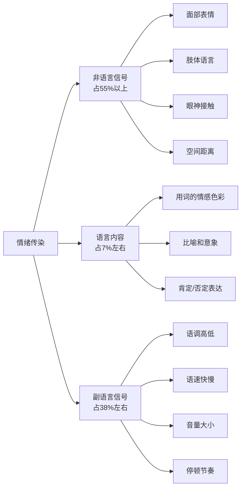
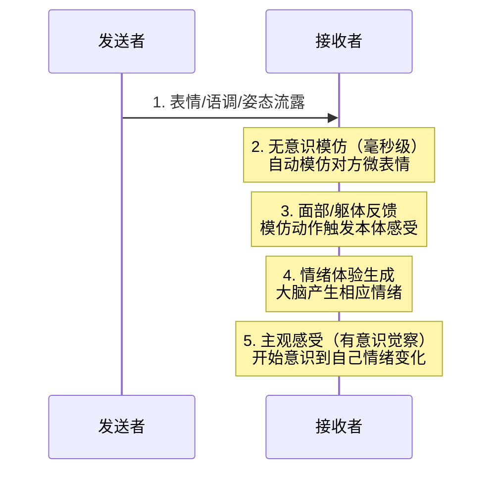

## 九、情绪传染与沟通氛围管理

沟通不只是信息的传递，更是情绪的流动。两个人面对面坐着，还没开口说第一句话，彼此的情绪已经在无声地交换——你的紧张会让对方紧绷，你的从容会让对方放松。这种看不见的情绪流动，就是**情绪传染**（Emotional Contagion）。掌握情绪传染的规律，你就掌握了沟通氛围的遥控器：能在谈判中稳住局面、在冲突中化解敌意、在汇报中激发热情、在安慰中传递温暖。

### 9.1 情绪传染的科学机制

#### 9.1.1 镜像神经元：大脑里的情绪接收器

1992年，意大利帕尔马大学的Giacomo Rizzolatti教授在研究猕猴运动皮层时意外发现：当猴子观察另一个个体执行动作时，其大脑中的一组神经元会像自己在执行该动作一样放电。这组神经元被命名为**镜像神经元**（Mirror Neurons）。

人类大脑中的镜像神经元系统更为发达，分布在前运动皮层、顶下小叶、颞上沟和脑岛等区域。它让我们在观察他人表情、姿态和语调时，自动在大脑中"模拟"对方的状态。这就是为什么：

- 看到别人打哈欠，自己也会忍不住打哈欠
- 和一个焦虑的人待久了，自己也莫名烦躁
- 看到朋友笑容满面，自己的心情也会变好
- 观看恐怖电影时，身体会产生和角色类似的恐惧反应

Daniel Goleman在《社交商》中将这一现象称为"社交脑"的核心功能：人类大脑天生就是一个情绪接收器，我们无法关闭这个功能，但可以学会管理它。

#### 9.1.2 情绪传染的三条路径

情绪并非只通过语言传递。事实上，研究表明情绪传染主要依赖非语言通道，语言内容只占很小一部分。

> 上述比例来自Albert Mehrabian的沟通研究模型，适用于态度和情绪传递场景（而非纯信息传递场景）。核心结论：**你怎么说，比你说什么更重要。**

**路径一：非语言信号（占55%以上）**

面部表情是最强的情绪传染载体。Paul Ekman的研究证实，人类有六种跨文化的基本情绪表情（快乐、悲伤、恐惧、愤怒、惊讶、厌恶），这些表情具有先天性和普遍性。更关键的是，面部表情不仅表达情绪，还会**制造**情绪——当你刻意微笑时，面部肌肉的反馈会激活大脑的愉悦回路（面部反馈假说，Facial Feedback Hypothesis）。

肢体语言的情绪传递同样强大：双臂交叉传递防御信号、身体前倾表达兴趣、频繁看手机传递不耐烦。这些信号以每秒数百万比特的速度向对方大脑传送，远超语言的信息量。

**路径二：副语言信号（占38%左右）**

副语言（Paralanguage）指的是说话的方式而非内容。同一句"我很高兴"，用不同的语调说出，可以表达真正的高兴、讽刺的假高兴、压抑的苦中作乐。人类大脑对副语言信号的敏感度极高——婴儿在理解语言含义之前，就已经能通过语调判断照顾者的情绪状态。

**路径三：语言内容（占7%左右）**

虽然占比最小，但语言内容在认知层面的作用不可忽视。当一个人说"这个项目完蛋了"和"这个项目遇到了一些挑战"，虽然描述的是同一事件，但前者会激活听者的灾难化思维，后者则保留了解决空间。语言的框架效应（Framing Effect）会改变听者对事件的解读，从而影响情绪反应。

#### 9.1.3 情绪传染的过程模型

情绪传染不是瞬间完成的，它遵循一个从无意识到有意识的渐进过程。Hatfield等人在《Emotional Contagion》一书中提出了经典的过程模型：

整个过程在**毫秒到秒级**完成，步骤2-4完全在无意识中运行。这意味着：你无法阻止情绪传染的发生，但你可以在步骤5——有意识觉察——介入，选择如何回应和管理已经被"感染"的情绪。

#### 9.1.4 影响情绪传染强度的因素

情绪传染并非均匀发生，以下因素会显著影响传染的强度：

| 因素 | 增强传染 | 减弱传染 |
|------|----------|----------|
| **关系亲密度** | 亲密关系中传染更强（对伴侣的情绪感染是对陌生人的2-3倍） | 陌生人之间传染较弱 |
| **情绪强度** | 强烈情绪（暴怒、极度悲伤）传染力远大于温和情绪 | 轻微情绪变化容易被忽略 |
| **注意力聚焦** | 当你专注于对方时，传染加速 | 心不在焉时传染减弱 |
| **个体易感性** | 高共情能力者更易被传染 | 低共情能力者较难被影响 |
| **情绪一致性** | 当你本身状态与对方情绪方向一致时，传染放大 | 当你状态相反时，传染被部分抵消 |
| **群体规模** | 群体中同一情绪的人越多，传染力越大 | 只有一人情绪不同，传染力有限 |

### 9.2 沟通氛围的本质与维度

#### 9.2.1 什么是沟通氛围

沟通氛围（Communication Climate）是指一场对话中弥漫的整体情绪基调。它在对话开始的前30秒就已初步形成，一旦确立便具有很强的惯性——氛围好的对话越聊越顺畅，氛围差的对话越聊越僵。

心理学家Jack Gibb在1965年提出了经典的沟通氛围理论，将沟通氛围分为**支持性氛围**和**防御性氛围**两种对立类型：

| 维度 | 支持性氛围 | 防御性氛围 |
|------|-----------|-----------|
| **描述方式** | 描述性语言："我注意到数据有误差" | 评价性语言："你的数据全是错的" |
| **问题导向** | 聚焦问题本身："我们怎么解决这个？" | 聚焦人身："你怎么又犯这种错？" |
| **自发性** | 真诚表达，言行一致 | 假面沟通，言不由衷 |
| **同理心** | 尝试理解对方立场："你的难处我能理解" | 冷漠评判："这有什么好难的？" |
| **平等性** | 平等协商："我们一起看看" | 居高临下："你必须按我说的做" |
| **确定性** | 灵活探索："我们可以考虑几种方案" | 绝对化论断："只有一种方法" |

#### 9.2.2 心理安全感：好氛围的基石

Google的亚里士多德项目（Project Aristotle）花费数年时间研究了180个团队，发现高效团队的首要特征不是技能、不是智商，而是**心理安全感**（Psychological Safety）——团队成员敢于表达不同意见、承认错误、提出问题，而不用担心被惩罚或嘲笑。

在日常沟通中，心理安全感意味着：

- **说真话不受伤**：即使观点不同，也不会被攻击或边缘化
- **犯错可修复**：承认失误不会被永久钉在耻辱柱上
- **提问不丢人**：问"愚蠢的问题"不会被嘲笑
- **情绪可表达**：说"我感到压力很大"不会被视为软弱

建立心理安全感不是一句"我们很开放"就能实现的，它需要通过具体的沟通行为反复证明。最重要的信号是：**当有人表达了不同意见或承认了错误，领导者/权威方的实际反应是什么？**

### 9.3 情绪调节：沟通前的自我准备

#### 9.3.1 为什么沟通前的情绪准备至关重要

神经科学研究表明，情绪具有**惯性**。如果你带着烦躁的情绪进入一场对话，你的大脑会倾向于以威胁模式解读对方的每一个信号——一个无害的表情被解读为挑衅，一句中性的话被理解为抱怨。这种**情绪过滤器**会扭曲你的感知，导致你做出过激反应，进而激发对方的防御，形成恶性循环。

哈佛商学院Amy Cuddy教授的研究表明，在高压沟通场景（如谈判、面试、述职）前，仅用2分钟进行情绪准备，就能显著改善表现和结果。

#### 9.3.2 情绪调节五步法

**第一步：觉察——我现在是什么情绪？**

不要跳过这一步。大多数人进入沟通场景时并没有清晰地意识到自己的情绪状态，带着模糊的不适感就开始对话。具体做法：

- 闭眼30秒，扫描身体感受：胸口是否发紧？肩膀是否僵硬？胃部是否不适？
- 给情绪命名：焦虑、烦躁、期待、疲惫、兴奋……
- 给情绪强度打分：1-10分

**第二步：溯源——这个情绪从哪来？**

情绪的来源不一定是当前的沟通对象。可能是上一场会议的余波、路上的堵车、家里的烦心事。识别来源能帮你把不相关的情绪"隔离"出来，避免转嫁到当前对话中。

问自己三个问题：
- 这个情绪是和当前对话相关的，还是从别处带来的？
- 如果是从别处带来的，我能把它暂时搁置吗？
- 我对当前对话的预期是什么？这个预期合理吗？

**第三步：呼吸——用生理手段调节神经系统**

腹式呼吸是激活副交感神经系统（"刹车系统"）最直接的方式。具体做法：

- 吸气4秒（用鼻子，感受腹部膨胀）
- 屏气4秒
- 呼气6秒（用嘴巴，缓慢均匀）
- 重复3-5个循环

4-4-6呼吸法已被临床研究证实能在90秒内降低皮质醇水平和心率。如果时间充裕，可以做完整的盒式呼吸（4-4-4-4），美国海军海豹突击队在高压任务前使用的就是这个方法。

**第四步：锚定——回忆一个与目标状态一致的成功经验**

大脑不善于区分真实经历和生动想象。回忆一次你在这个场景中表现出色的经历，重新体验当时的自信、冷静或热情。具体操作：

- 选择一个与当前场景类似的记忆
- 调动多感官回忆：当时的画面、声音、身体感觉
- 让积极情绪充满全身，停留30秒
- 给这个状态一个锚点词（如"稳"或"行"），关键时刻默念即可唤起

**第五步：意图——设定这场沟通的情绪目标**

不要只设定信息目标（"我要说服他"），还要设定情绪目标（"我要让对方感到被尊重"或"我要保持冷静和开放"）。

问自己：
- 我希望对方离开时是什么感受？
- 为了达成这个感受，我自己需要保持什么状态？
- 可能出现什么情况会破坏这个状态？我如何应对？

### 9.4 沟通氛围的主动塑造

#### 9.4.1 积极情绪启动（Positive Priming）

在正式话题前花1-3分钟营造积极情绪，效果远超你的想象。这不是浪费时间，而是在为后续的信息传递铺设高速公路。

**有效的启动方式（按场景分）：**

| 场景 | 启动方式 | 原理 |
|------|----------|------|
| **商务会议** | 先简短认可对方的成就或进展："上次你们团队的方案执行得很漂亮" | 激活对方的自尊和合作意愿 |
| **一对一谈话** | 从对方感兴趣的话题切入："你上次说在学吉他，进展怎么样？" | 建立个人连接，降低防御 |
| **冲突场景** | 先表达对关系的重视："我很在意我们的合作关系" | 将对话框架从对抗转为合作 |
| **汇报场景** | 用数据或故事开场引起兴趣，而非直接念PPT | 激活好奇心和注意力 |
| **安慰场景** | 先用非语言信号表达关怀（安静地坐到对方身边、递一杯水） | 通过副语言传递温暖和安全 |

**注意：积极启动必须真诚。** 虚假的恭维和套路化的寒暄反而会激活对方的警觉——"他今天这么客气，肯定没好事。"真诚的关键在于你确实关注到了对方某个具体的事、特质或进展，而不是泛泛地说"你真棒"。

#### 9.4.2 节奏控制：对话的"呼吸感"

好的对话像好的音乐一样有节奏感——有快有慢、有张有弛、有高音有留白。而糟糕的对话要么像机关枪一样不停扫射，要么像死水一样毫无波澜。

**节奏控制的具体技巧：**

**主动放慢。** 当对话变得紧张或对方情绪激动时，刻意放慢语速、降低音量、增加停顿。这不是示弱，而是用你的节奏去"拖拽"对方的神经系统从交感模式（战斗/逃跑）回到副交感模式（休息/连接）。研究显示，当一个人的语速降低30%时，对方的语速也会自动降低——这就是节奏传染。

**战略性停顿。** 在关键观点之后停顿2-3秒。这个停顿的信号是："这句话很重要，我想让你消化一下。"在对方说完之后停顿1-2秒再回应。这个停顿的信号是："我在认真思考你说的话，而不是急着反驳。"停顿还能制造"信息真空"，让对方更愿意填补空白、说出更多真实想法。

**能量校准。** 对方兴奋时，你也要适度提升能量以匹配对方的热情（不是模仿，是共频）。对方低落时，你需要降低能量以匹配对方的状态。能量差异过大会让双方感到"不在一个频道上"。

#### 9.4.3 物理环境对氛围的影响

沟通氛围不完全由人的行为决定，物理环境是隐形但强大的氛围塑造者：

- **空间布局**：并排坐比面对面坐更减少对抗感；圆桌比长桌更促进平等参与
- **光线**：暖色调柔和光线促进放松和信任；过亮的荧光灯增加紧张感
- **温度**：微暖的环境（约22-24°C）促进合作倾向；过冷的环境增加防御心态
- **噪声**：适度的背景白噪声（如咖啡馆环境音）提升创造力；安静环境适合需要深度思考的对话
- **身体姿态**：开放式姿态（手臂放松、身体略微前倾）传递接纳信号；封闭姿态（双臂交叉、后仰）传递拒绝信号

如果你有权选择沟通场景，优先选择中性或轻松的环境（如散步谈话、咖啡馆而非会议室），物理空间的改变往往能带来沟通氛围的根本性转变。

### 9.5 情绪命名法：最强的情绪调节工具

#### 9.5.1 "命名即驯服"的神经科学原理

UCLA的Matthew Lieberman教授通过fMRI脑成像实验发现了一个令人惊叹的现象：当一个人给情绪贴上标签（如说出"我很愤怒"）时，大脑杏仁核（情绪反应中心）的活动会**显著降低**，而前额叶皮层（理性思考区域）的活动会**增强**。

这个过程被Lieberman称为**"命名即驯服"（Name It to Tame It）**。语言标签就像一个"翻译器"，把模糊的、压倒性的情绪体验转化为具体的、可控的认知对象。当情绪还是"一团模糊的强烈感受"时，它具有压倒性的力量；当它被命名为"焦虑"或"失望"时，它的力量就被削减了。

Daniel Siegel将这一原理推广到人际沟通中：当你帮助对方命名他们的情绪时，你不仅帮助了对方调节情绪，还向对方传递了一个强大的信号——"我理解你的内在体验。"

#### 9.5.2 情绪命名的实操方法

**层次一：基础命名——识别情绪类别**

这是最基础的层次，适用于日常沟通：

- "我能感受到你现在很**失望**。"
- "听起来你对这个结果感到很**挫败**。"
- "你好像对这件事有些**担心**？"

**层次二：精确命名——区分相似情绪**

更精确的命名能更有效地调节情绪，因为不同的情绪需要不同的回应方式。比如：

| 表面情绪 | 可能的深层情绪 | 精确命名示例 |
|----------|---------------|-------------|
| 生气 | 被背叛、被忽视、感到不公平、失去控制 | "你是不是觉得自己的付出没有被看到？" |
| 焦虑 | 不确定感、完美主义压力、害怕失败 | "你是不是在担心事情的走向不在预期之内？" |
| 伤心 | 失落、被抛弃、理想破灭 | "你是不是觉得之前投入的那些努力白费了？" |
| 烦躁 | 疲惫、边界被侵犯、需求未被满足 | "你是不是觉得这个节奏让你喘不过气来？" |

**层次三：共情性命名——连接对方的感受**

最高层次的命名不仅是描述情绪，还要连接到对方的体验和需求：

- "你花了三个月的方案被这样否决，那种**被辜负的感觉**一定很难受。"
- "你知道自己是对的却说服不了别人，那种**无力感**真的让人沮丧。"
- "你一直在为团队兜底，现在连一句谢谢都没有，**心里肯定不平衡**。"

这种命名方式需要真正的倾听和理解，但效果是惊人的——它能让对方从情绪中"被看见"，从而放下防御、打开心扉。

#### 9.5.3 情绪命名的常见误区

**误区一：给对方贴标签而非命名情绪。**

- 错误："你太敏感了。"（贴标签——否定对方的体验）
- 错误："你在无理取闹。"（贴标签——攻击对方人格）
- 正确："你现在的情绪很强烈，我理解。"（命名情绪——接纳对方的体验）

**误区二：用反问句命名情绪。**

- 错误："你有什么好生气的？"（隐含评判：你不该生气）
- 正确："我能感受到你很生气。"（直接描述：你的生气我看到了）

**误区三：急着从命名跳到解决问题。**

- 错误："我知道你很难过，不过我们应该……"（命名后立刻转移）
- 正确：命名后**停顿**，给对方一个空间来确认或补充。通常对方会说"对，而且……"然后说出更多。这个"而且"里往往藏着真正重要的信息。

### 9.6 处理负面情绪的沟通策略

#### 9.6.1 当对方愤怒时

愤怒是最具传染力的情绪之一，也是最容易导致沟通灾难的情绪。愤怒的核心不是"攻击欲"，而是**边界被侵犯**或**需求被忽视**的信号。理解这一点，你才能从恐惧中解脱出来，真正帮助对话回到正轨。

**处理愤怒的黄金法则：先接情绪，再谈事情。**

**第一步：保护自己，不要对抗。**

当对方愤怒到人身攻击或摔门的程度时，你的首要任务是保护自己的安全和尊严。不要试图用更大的声音压过对方，这只会升级冲突。降低音量、放缓语速、后退半步——用你的身体语言传递"我不打算和你战斗"的信号。

**第二步：承认对方的情绪，而不是评判情绪。**

- 正确："我能感受到你现在非常生气。"（承认情绪的存在）
- 错误："你冷静一点！"（否定情绪——这会让愤怒加倍）
- 错误："你发这么大火至于吗？"（评判情绪——暗示对方小题大做）

"你冷静一点"可能是人际沟通中最糟糕的三个字。它对愤怒者的潜台词是："你的感受不重要，你的反应不合理。"这会让愤怒者感到自己的情绪被否定，从而更加愤怒。

**第三步：倾听，真正地倾听。**

愤怒的人最需要的不是解决方案，而是被听到。让对方把话说完，不要打断、不要辩解、不要解释。偶尔用"嗯""我在听""然后呢"引导对方继续。很多愤怒在被充分倾听后会自然消退——因为愤怒的底层需求就是"你看到我了"。

**第四步：探索愤怒背后的真正诉求。**

等对方情绪稍有缓和（注意是"稍有"，不是"完全平静"），用开放性问题探索深层需求：

- "对你来说，这件事最让你在意的是什么？"
- "你希望这件事最终变成什么样？"
- "你觉得什么样的处理方式是公平的？"

**第五步：共同寻找解决方案。**

只有在对方情绪得到充分承认之后，才能进入解决问题的阶段。跳过前面四步直接谈方案，就像在流血不止的伤口上直接缝合——表面看效率高，实际上只会让伤口感染。

#### 9.6.2 当对方焦虑时

焦虑的本质是对不确定性的恐惧。焦虑者的大脑处于高度警觉状态，不断扫描潜在威胁。面对焦虑的人，你要做的不是告诉他们"别担心"（这等于说"你的担心不合理"），而是提供**确定性和控制感**。

**策略一：将不可控变为可控。**

焦虑的人害怕的不是困难本身，而是"不知道会发生什么"。把模糊的恐惧转化为具体的问题，每个问题都有可执行的行动方案：

- 焦虑者："这个项目肯定要出问题。"
- 无效回应："不会的，别想太多。"（否定感受）
- 有效回应："你觉得最可能出问题的是哪个环节？我们现在能不能针对这个环节做一些预案？"（将模糊恐惧变为具体问题）

**策略二：用"脚手架思维"降低认知负荷。**

当焦虑者面对一个庞大的、看似无法完成的任务时，帮助他们将任务拆解为小步骤。每个步骤都足够小、足够清晰，小到他们觉得"这个我肯定能做到"。完成每一个小步骤都会给大脑注入一点多巴胺（奖励信号），逐步覆盖焦虑信号。

**策略三：提供信息而非安慰。**

"一切都会好的"是最空洞的安慰。如果你真的有信息可以降低不确定性——分享它。"目前进度是这样的""我们有三个备选方案""类似情况的处理经验是这样的"——具体的、有信息量的内容比情感安慰有效得多。

#### 9.6.3 当对方悲伤时

悲伤是一种收缩性情绪，它让人想要退缩、独处、沉默。面对悲伤的人，最常见的错误是急着"修复"他们的感受。

**错误示范：**

- "别难过了，想开点。"（否定情绪）
- "至少你还……"（比较情绪——暗示对方不该难过）
- "我告诉你应该怎么做。"（跳过陪伴直接给方案）
- "时间会治愈一切。"（空洞安慰——当下需要的是被理解）

**正确做法：**

**陪伴优先于建议。** 有时候，最有力的支持就是安静地坐在对方身边，什么都不说。沉默不是尴尬——当它是出于陪伴的意图时，它传递的信号是："我在这里，你不是一个人。"研究表明，悲伤时被"修复型"回应（给建议、讲道理）反而会让人更加退缩，因为这种回应传递的潜台词是"你的悲伤是需要被解决的问题"。

**用镜映（Mirroring）表达理解。** 镜映不是鹦鹉学舌，而是用自己的语言把对方的感受和经历反映出来："你确实为这件事投入了很多，现在变成这样，心里肯定很不是滋味。"这种方式让对方知道：你不仅听到了内容，还感受到了背后的情感。

**在对方准备好后再提供建议。** 一个信号是：对方开始主动问"那你觉得我该怎么办？"或者开始从倾诉转向思考解决方案。在此之前，你的角色是陪伴者，不是顾问。

**避免的词语和句式：**

- "我理解你的感受"（如果你没有类似经历，这句话会显得空洞）
- "你应该……"（在悲伤中给出指令，只增加压力）
- "至少……"（最小化对方的痛苦）
- 替代方案：直接说出你观察到的——"你现在看起来很难过"，然后等待对方回应。

#### 9.6.4 当对方焦虑与愤怒混合时

现实中，情绪很少是单一的。更常见的场景是对方同时表现出焦虑和愤怒——焦虑源于不确定感，愤怒源于失控感。这种混合情绪最具破坏力，因为愤怒驱使对方攻击，焦虑驱使对方回避，两种力量交替出现会让对话极不稳定。

**处理策略：**

- 先处理愤怒（因为它更紧迫、更具破坏性），使用9.6.1中的方法
- 愤怒平息后，再处理焦虑（因为焦虑需要更细致、更耗时的工作）
- 识别混合情绪的信号：时而大声指责、时而沉默退缩；前一秒攻击你、后一秒自我贬低
- 对混合情绪的命名要涵盖两种感受："我能感觉到你既很着急又很生气。"

### 9.7 高级技巧：情绪领导力

#### 9.7.1 情绪领导力的定义

情绪领导力（Emotional Leadership）是指在群体沟通中主动引导和管理集体情绪状态的能力。一个具备情绪领导力的人不仅管理自己的情绪，还能成为群体情绪的"定海神针"——在混乱中稳定人心、在低落中激发热情、在冲突中创造和解。

Goleman等人在《Primal Leadership》中指出，领导者对团队情绪的影响力是普通成员的2-3倍。这是因为人类大脑对权威和地位信号更加敏感——来自领导者的正面或负面情绪传染都会被放大。

#### 9.7.2 情绪领导力的四大实践

**实践一：成为情绪温度计**

在群体沟通中持续扫描整体情绪状态。注意：谁在退缩？谁在变得激动？沉默是思考还是不满？笑声是放松还是紧张？这些信号的解读需要结合具体情境——同样是在会议上不说话，一个平时活跃的人突然沉默可能意味着不满，而一个一直安静的人继续保持沉默则可能是正常状态。

**实践二：做情绪的翻译器**

当群体中弥漫着未被表达的情绪时，代为命名和表达："我注意到大家讨论到现在，好像都有些疲惫和沮丧。我们确实遇到了一些硬骨头，这很正常。"这种做法打破了"房间里的大象"——那些所有人都感受到但没人敢说的情绪。一旦被命名，群体的情绪张力就会大幅降低。

**实践三：主动注入正面情绪**

在高压场景中（如项目危机、业绩低谷），主动分享正面信息、庆祝小胜利、表达对团队的信任和感激。不是粉饰太平（那会被识破），而是在承认困难的同时，有意识地强化团队中的积极信号。

**实践四：在冲突中充当"情绪缓冲区"**

当两个人或两个群体情绪对立时，充当缓冲区而非裁判。具体做法：先分别倾听双方（让他们感到被理解），然后帮助双方看到对方情绪背后的合理需求，最后引导双方聚焦于共同目标而非分歧。

#### 9.7.3 跨文化情绪传染的注意事项

情绪传染在不同文化中的表现存在显著差异。在国际沟通中忽视这些差异，可能导致严重误解。

| 维度 | 高语境文化（如中国、日本） | 低语境文化（如美国、德国） |
|------|--------------------------|--------------------------|
| **情绪表达方式** | 含蓄内敛，依赖副语言和情境 | 直接外显，依赖语言明确表达 |
| **愤怒表达** | 冷处理、沉默、间接暗示 | 直接说出来、当面对质 |
| **积极情绪** | 内敛微笑、行动表达感谢 | 热情拥抱、大声赞美 |
| **情绪传染路径** | 更依赖非语言信号和关系语境 | 更依赖语言内容和逻辑论述 |
| **面子因素** | 公开批评的负面传染被加倍放大 | 当面反馈被视为正常沟通 |

### 9.8 常见误区与纠正

#### 误区一：以为情绪管理=压抑情绪

很多人把情绪管理理解为"控制自己的情绪不让别人看到"。这是对情绪管理最大的误解。压抑情绪不仅无效（被压抑的情绪会通过微表情、语调变化、身体紧绷泄露出来），而且有害（长期压抑情绪会导致身心健康问题）。

**纠正：** 情绪管理不是压抑，而是**觉察→理解→选择表达方式**。你可以感到愤怒，但选择不在愤怒的驱动下说话。你可以感到焦虑，但选择把焦虑转化为谨慎。关键区别在于：压抑是否认情绪的存在，管理是承认情绪的存在后选择如何回应。

#### 误区二：以为积极氛围=无冲突

很多人追求沟通氛围的和谐，把任何冲突都视为氛围破坏者。实际上，健康的沟通氛围不是没有冲突，而是冲突可以安全地表达和处理。

**纠正：** 无冲突的团队往往不是最和谐的团队，而是最害怕冲突的团队。真正健康的氛围是：人们可以在尊重彼此的前提下直接表达不同意见，冲突被当作解决问题的机会而非威胁。

#### 误区三：以为情绪传染是"别人传染我"

很多人只意识到自己被别人的情绪影响，却忽略了自己也在持续地向他人输出情绪。每一次叹气、每一个皱眉、每一声冷笑，都是你向周围人发射的情绪信号。

**纠正：** 你的情绪影响半径远超你的想象。在一场8人会议中，你的情绪状态会影响至少3-4个人。这意味着管理自己的情绪不仅是自我关怀，更是对他人的责任。

#### 误区四：以为情绪传染可以精确控制

有些人读了情绪传染的理论后，试图精确控制每一场沟通的情绪走向。这既不现实，也不可取。

**纠正：** 情绪传染可以被影响，但无法被精确控制。每个人的情绪状态受到无数因素的影响（身体状况、之前经历、个人偏好等）。你的目标不是控制对方的情绪，而是创造一个有利于积极情绪发生的环境，并在消极情绪出现时提供有效的应对。

### 9.9 实用工具箱

#### 工具一：沟通前情绪自检清单

在重要沟通前花2分钟完成：

□ 我现在的主要情绪是什么？（命名它）
□ 这个情绪和当前对话有关吗？（是/否，如果否，把它隔离出来）
□ 我的呼吸是否平稳？（如果不，做3个4-4-6呼吸循环）
□ 这场沟通的情绪目标是什么？（我希望对方离开时的感受是___）
□ 可能破坏氛围的触发点是什么？（识别并准备应对方案）
□ 我的身体姿态是否开放？（调整：松开交叉的手臂，身体前倾）

#### 工具二：情绪命名词汇表

很多人在需要命名情绪时找不到准确的词。以下词汇表可供参考：

**负面情绪细分：**

| 大类 | 细分情绪 | 描述 |
|------|----------|------|
| 愤怒类 | 恼怒、愤慨、暴怒、怨恨、愤恨、烦躁、恼火 | 从轻到重排列 |
| 恐惧类 | 不安、紧张、焦虑、恐惧、惊恐、恐慌 | 从轻到重排列 |
| 悲伤类 | 惆怅、失落、沮丧、悲伤、哀痛、绝望 | 从轻到重排列 |
| 羞耻类 | 尴尬、窘迫、羞愧、耻辱、自卑 | 从轻到重排列 |
| 厌恶类 | 反感、排斥、厌烦、鄙视、恶心 | 从轻到重排列 |

**正面情绪细分：**

| 大类 | 细分情绪 | 描述 |
|------|----------|------|
| 快乐类 | 愉悦、高兴、开心、快乐、兴奋、狂喜 | 从轻到重排列 |
| 平静类 | 放松、安宁、平和、从容、自在 | 不同维度的平静 |
| 满足类 | 满意、欣慰、成就感、自豪、骄傲 | 与成就相关 |
| 连接类 | 温暖、亲近、信任、感激、感动 | 与关系相关 |
| 好奇类 | 兴趣、好奇、惊喜、敬畏、震撼 | 与探索相关 |

#### 工具三：氛围修复话术模板

当沟通氛围已经被破坏时，使用以下模板进行修复：

**当气氛已经很紧张时：**
> "我注意到我们现在的对话好像有些紧张了。（停顿）我不希望我们的讨论变成这样。对我来说，和你保持好的沟通关系很重要。我们能不能退一步，重新看一下问题的核心是什么？"

**当有人在对话中被伤害时：**
> "刚才的话可能让人感到不舒服，这不是我的本意。让我换一种方式来说。"

**当对话陷入僵局时：**
> "我觉得我们在一些方面是有共识的，比如我们都希望[共同目标]。我们现在的分歧在于[具体分歧]。让我们回到共同目标上来，看看有没有一个方案是双方都能接受的。"

**当你意识到自己的情绪污染了对话时：**
> "抱歉，我刚才的反应可能比正常激烈了一些。这不是因为你说的话，而是我自己今天有些事情影响了情绪。让我重新来说。"

最后一条特别重要——承认自己的情绪失控，不是示弱，而是展现情绪成熟度。它向对方传递的信号是："我尊重这个对话，也尊重你，所以我愿意为自己的情绪负责。"

### 9.10 延伸阅读

- **Richard Hatfield, John Cacioppo, Rapson Richard** —《Emotional Contagion》情绪传染理论的奠基之作
- **Daniel Goleman** —《社交商》（Social Intelligence）社交脑与镜像神经元
- **Daniel Goleman, Annie McKee, Richard Boyatzis** —《Primal Leadership》情绪领导力
- **Jack Gibb** — "Defensive Communication" 1965年经典论文，支持性/防御性氛围理论
- **Amy Cuddy** —《Presence》身体姿态与情绪调节
- **Matthew Lieberman** — "Name It to Tame It" fMRI研究系列
- **Daniel Siegel** —《The Whole-Brain Child》"命名即驯服"的实践应用
- **Amy Edmondson** —《The Fearless Organization》心理安全感

***
