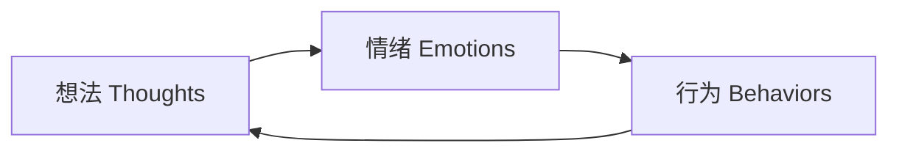
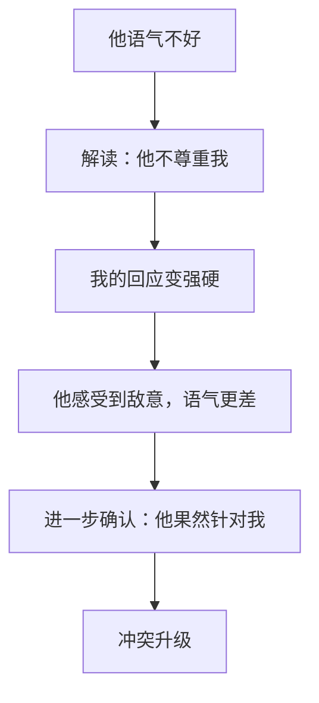

## 十、认知重构在沟通中的应用

> "困扰我们的不是事情本身，而是我们对事情的看法。"——爱比克泰德

你和同事同时收到一封措辞严厉的邮件。你觉得"完了，领导对我有意见"，同事却觉得"领导只是着急，跟事不跟人"。同样的信息，两种截然不同的解读，导致两种截然不同的情绪和后续行为。这个差异的根源，就是**认知模式**的不同。

认知重构（Cognitive Restructuring）是认知行为疗法（CBT）的核心技术，由Aaron Beck在1960年代提出。它的核心假设是：**情绪和行为不是由外部事件直接决定的，而是由我们对事件的解读（认知）决定的。** 改变认知，就能改变情绪和行为。

在沟通场景中，认知重构的价值尤为突出——它帮助我们识别那些自动跳出来的、往往带有偏差的解读，用更准确、更有建设性的想法替代它们，从而做出更明智的沟通决策。

### 10.1 理论基础：认知三角模型

认知重构建立在一个简洁而强大的模型之上——**认知三角**（Cognitive Triangle）：

三者相互影响、循环强化。在沟通中的典型链条：

| 环节 | 消极循环 | 重构后循环 |
|------|----------|------------|
| **想法** | "他否定我的方案，说明他不尊重我" | "他对方案有不同看法，可能是我没讲清楚" |
| **情绪** | 愤怒、委屈、防御 | 好奇、平静、开放 |
| **行为** | 回怼、沉默对抗、消极配合 | 追问具体意见、调整表达方式 |

认知重构的工作原理，就是**在想法这个环节进行干预**，打破消极循环，启动积极循环。

**ABC模型**是另一个常用框架（Albert Ellis提出）：

- **A（Activating Event）**：触发事件——同事在会上打断了你的发言
- **B（Belief）**：信念/解读——"他觉得我说的都是废话"
- **C（Consequence）**：后果——愤怒、之后不再积极发言

认知重构干预的是B环节。同样被打断，如果你的解读是"他太着急表达自己的观点了，不代表否定我"，你的情绪和行为就会完全不同。

### 10.2 沟通中常见的认知扭曲

认知扭曲（Cognitive Distortions）是思维中系统性的偏差。Beck和Burns的研究识别了多种常见模式，以下是沟通场景中最高频出现的10种：

#### 10.2.1 非黑即白思维（All-or-Nothing Thinking）

**特征**：用极端二元的方式看待事物，没有中间地带。"要么完美，要么彻底失败。"

**沟通中的表现**：
- "这次谈判如果不成功，之前的努力就全白费了"
- "如果他不完全同意我的方案，就是反对我"
- "要么他说的是对的，要么我说的是对的"

**重构方法**：引入连续光谱思维。谈判结果不是"成功/失败"的二元，而是在0到100的连续光谱上。即使这次没达成全部目标，能推进30%也是进展。

**实操练习**：每当你发现自己用"完全、彻底、绝对、总是、从不"这类词时，停下来问自己："在0到100的光谱上，这件事大概在什么位置？"

#### 10.2.2 灾难化思维（Catastrophizing）

**特征**：把事情往最坏的方向想象，并且认定最坏的结果一定会发生。

**沟通中的表现**：
- "如果我在会上说错话，职业生涯就完了"
- "客户这次没回消息，合同肯定要黄了"
- "如果我提出加薪，一定会被开除"

**重构方法**：进行"最坏情况分析"——问自己三个问题：(1) 最坏的结果是什么？(2) 这个最坏结果发生的概率有多大？(3) 即使最坏结果发生，我真的无法应对吗？

**案例**：一位项目经理担心向高层汇报时出错会被开除。经过分析：历史上公司从未因汇报失误开除过人（概率极低）；即使汇报不理想，最坏结果是被要求重新准备（可应对）。这个分析帮助她放松心态，实际汇报效果反而更好。

#### 10.2.3 读心术（Mind Reading）

**特征**：假设自己知道别人在想什么，而且通常假设的是最坏的解读。

**沟通中的表现**：
- "他没回复我消息，肯定是对我有意见"
- "她听完我的建议后笑了笑，一定是在嘲笑我"
- "老板今天没跟我打招呼，说明我最近表现不好"

**重构方法**：记住一条原则——**你不是读心者，你不知道别人在想什么**。列出至少3种其他可能的解释。他没回消息可能是：在开会、手机没电、需要时间考虑、消息被淹没了——这些都比"对我有意见"更常见。

**实操模板**：
我的自动解读：____________________
其他可能的解释：
1. ____________________
2. ____________________
3. ____________________
证据支持自动解读的程度（1-10）：____

#### 10.2.4 过度概括（Overgeneralization）

**特征**：从一次事件得出普遍性结论，用"总是""从来""每次""所有人"来描述。

**沟通中的表现**：
- "这次项目延期了，说明我不适合做项目管理"
- "上次合作不愉快，他这个人就是靠不住"
- "每次我提出新想法都会被否决"

**重构方法**：区分"这一次"和"永远"。把"我总是搞砸"替换为"这次的结果不理想"。用具体数据替代模糊概括——你提出新想法真的"每次"都被否决吗？还是10次中有3次？

#### 10.2.5 个人化（Personalization）

**特征**：把与自己无关的事情归因到自己身上，认为是自己导致了问题。

**沟通中的表现**：
- "团队气氛不好，一定是因为我之前说了那句话"
- "客户不续约了，是我的服务没做好"
- "会议上大家都不说话，是我刚才的发言太无聊了"

**重构方法**：认识到大多数结果是多因素的。客户不续约可能是预算调整、战略变化、竞争对手降价——不一定是你的问题。列出所有可能的因素，评估每个因素的权重。

#### 10.2.6 应该思维（Should Statements）

**特征**：用"应该""必须""一定要"来要求自己或他人，产生不必要的压力和失望。

**沟通中的表现**：
- "我应该永远保持专业和冷静"
- "作为领导，他应该理解我的处境"
- "同事之间应该互相支持"

**重构方法**：把"应该"替换为"希望""更愿意""最好"。"我希望领导能理解我的处境"比"他应该理解我"少了愤怒和失望，多了行动空间。

#### 10.2.7 情绪推理（Emotional Reasoning）

**特征**：把感受当作事实。"我觉得是这样，所以一定是这样。"

**沟通中的表现**：
- "我觉得这次合作不会成功"（然后就真的不努力了）
- "我感觉自己不被重视，所以我一定不被重视"
- "我觉得他说的是反话，所以他一定在讽刺我"

**重构方法**：感受是真实的信号，但不等于事实。区分"我感觉……"和"事实是……"。你感觉不被重视，但事实是什么？你的建议被采纳过吗？你的贡献被承认过吗？

#### 10.2.8 贴标签（Labeling）

**特征**：用一个负面标签概括一个人或自己，忽略复杂性。

**沟通中的表现**：
- "他就是个杠精"
- "我就是不会说话的人"
- "这个客户就是难缠"

**重构方法**：描述行为，而非定义人。把"他就是杠精"替换为"他这次提出了很多反对意见"。行为可以改变，标签却会形成固定预期。

#### 10.2.9 选择性过滤（Selective Abstraction）

**特征**：只关注负面信息，忽略正面信息，就像用滤镜只看缺点。

**沟通中的表现**：
- 开会时收到10条正面反馈和1条负面反馈，只记住那1条
- 合作方整体很满意，但你只记得他说"这里可以改进"
- 客户续了约，但你只记得他说"价格有点高"

**重构方法**：刻意记录全面信息。用表格列出正面和负面反馈，强制自己看到全貌。问自己："如果正面和负面的比例是9:1，我为什么只盯着那1？"

#### 10.2.10 算命式思维（Fortune Telling）

**特征**：预测未来一定不好，然后用这个预测来指导当前行为。

**沟通中的表现**：
- "说了也没用，领导不会同意的"（所以干脆不说）
- "这个方案客户不会接受的"（所以不提）
- "跟他谈加薪肯定会被拒"（所以永远不谈）

**重构方法**：区分"预测"和"事实"。你没有水晶球，未来尚未发生。问自己："我的预测基于什么证据？这些证据足够支撑如此确定的结论吗？"

### 10.3 认知重构的五步实操框架

当你在沟通中感到强烈情绪（愤怒、焦虑、委屈、恐惧）时，用以下五步进行重构：

#### 第一步：觉察——"我现在有什么感觉？"

身体是情绪的第一信号。愤怒时心跳加速、手握紧；焦虑时胃部紧缩、呼吸变浅；委屈时喉咙发紧、眼眶发热。

**练习**：每天三次停下来扫描身体感受（早中晚各一次），建立对身体信号的敏感度。

#### 第二步：记录——"触发我的具体事件是什么？"

客观描述发生了什么，不加解读。用摄像机视角记录：谁、说了什么、做了什么、在什么场景下。

| 项目 | 填写 |
|------|------|
| 时间 | ____ |
| 场景 | ____ |
| 触发事件（客观事实） | ____ |
| 我的情绪（1-10强度） | ____ |
| 我的自动想法 | ____ |

#### 第三步：质疑——"这个想法有证据支持吗？"

用苏格拉底式提问法检验自动思维：

1. **支持证据**：有什么具体事实支持这个想法？
2. **反对证据**：有什么具体事实与这个想法矛盾？
3. **替代解释**：有没有其他更合理的解释？
4. **概率评估**：最坏情况发生的可能性有多大？
5. **双标检验**：如果朋友遇到同样的情况，我会怎么看？
6. **历史检验**：过去类似情况下，实际结果是什么？

#### 第四步：重构——"更准确、更有建设性的想法是什么？"

新想法必须满足三个条件：
- **更准确**：能经得起证据检验
- **更平衡**：既不盲目乐观，也不过度悲观
- **更有用**：能引导出更好的情绪和行为

**示例**：

| 自动想法 | 重构后想法 |
|----------|-----------|
| "他在会上当众批评我，就是想让我难堪" | "他指出了方案中的问题，方式可能不够委婉，但内容有价值。我可以会后跟他沟通表达方式的问题" |
| "客户选了竞争对手，说明我们的方案很差" | "客户做了符合他们需求的选择。这次没赢说明我在需求挖掘上还有提升空间" |
| "领导从来不听我的建议" | "领导最近三次会议中有一次采纳了我的建议。我需要改进的是建议的呈现方式，不是放弃提出建议" |

#### 第五步：行动——"基于新的想法，我现在可以做什么？"

认知重构的最终目的是指导行动。重构后问自己：
- 基于新的理解，我现在应该做什么？
- 这件事我可以采取的第一步是什么？
- 什么时候开始？

### 10.4 在不同沟通场景中的应用

#### 10.4.1 冲突场景中的认知重构

冲突是认知扭曲最高频出现的场景。双方都有自动思维，而且互相强化。

**典型冲突升级链条**：

**干预点**：在B环节插入认知重构——"他语气不好可能是因为他也在压力下，不一定是针对我"。然后用好奇而非防御的方式回应："我听出来你对这个方案有顾虑，能具体说说你担心的是什么吗？"

#### 10.4.2 说服场景中的认知重构

说服别人时，认知扭曲会让你高估阻力、低估对方的开放性。

**常见扭曲**：
- 灾难化："如果我提出这个想法，一定会被否决"
- 读心术："他肯定不会接受"
- 算命式思维："说了也没用"

**重构策略**：用数据替代猜测。回顾历史——你的建议被采纳的比率是多少？对方在什么情况下接受过新想法？基于这些数据调整你的说服策略。

#### 10.4.3 反馈场景中的认知重构

收到负面反馈时，认知扭曲最容易被触发。

**练习**：收到反馈后，强制自己做以下操作：
1. 写下第一反应（自动想法）
2. 识别其中的认知扭曲类型
3. 用24小时冷却期后再做出回应
4. 列出反馈中具体可操作的改进点

### 10.5 帮助他人进行认知重构

当沟通对象陷入消极认知时，直接告诉他们"你想错了"通常适得其反。以下是引导他人认知重构的四步法：

#### 步骤一：倾听与共情（不评判）

先让对方感受到被理解，这是后续引导的前提。

**有效表达**：
- "我理解你现在很沮丧/担心/生气"
- "换作是我，可能也会这么想"
- "你的感受是真实的"

**避免的表达**：
- "你不应该这么想"
- "你想太多了"
- "这有什么好生气的"

#### 步骤二：好奇式提问（不命令）

用开放式问题引导对方自己审视想法：

- "你觉得还有什么其他可能性？"
- "你这个判断是基于哪些信息？"
- "如果换一个角度看，有没有不同的解读？"
- "之前遇到类似情况时，实际结果是什么？"

#### 步骤三：提供新视角（不强加）

以"我的观察"而非"你应该"的方式提供不同解读：

- "我注意到一个细节，可能你没看到——他后来主动帮你说了话"
- "从我的角度来看，他的反馈可能是出于对你的期待，而不是否定"
- "我之前和他合作时，他的表达方式一直是这样，但其实人很好"

#### 步骤四：引导行动（不替代）

把新的认知转化为具体行动，让对方自己得出结论：

- "基于这个新的可能性，你觉得下一步可以怎么做？"
- "如果他的意思其实是X，你会怎么回应？"
- "你觉得直接跟他确认一下，会不会比猜测更有效？"

### 10.6 认知重构的高级技巧

#### 10.6.1 概率思维训练

用量化替代模糊判断，这是对抗灾难化和算命式思维的利器。

**练习方法**：每当出现消极预测时，强制给它打一个概率分：

| 消极预测 | 我的概率估计 | 历史数据中的实际概率 | 差距 |
|----------|-------------|---------------------|------|
| "领导会否决我的提案" | 80% | 类似提案通过率约60% | 偏差20% |
| "同事会觉得我的想法很蠢" | 70% | 同事通常反应积极占80% | 偏差极大 |

持续练习会发现，我们对负面结果的概率估计通常远高于实际情况。

#### 10.6.2 思维记录日志

建立日常记录习惯，系统性地追踪和改变认知模式。

**每日思维记录模板**：
日期：____
场景：____
自动想法：____
情绪及强度（1-10）：____
认知扭曲类型：____
证据支持：____
证据反对：____
重构后想法：____
重构后情绪强度（1-10）：____
行动计划：____

坚持2-4周，你会发现自己识别认知扭曲的速度越来越快，重构能力显著提升。

#### 10.6.3 认知距离化（Cognitive Defusion）

来自接纳承诺疗法（ACT）的技术。核心思想：**想法是想法，不是事实。**

**练习**：
- 把"我是个失败者"替换为"我注意到我正在产生'我是个失败者'这个想法"
- 给反复出现的消极想法起个名字："哦，'老故事'又来了"
- 用滑稽的声音在心里重复消极想法（降低其情绪冲击力）

这些技巧帮助你与消极想法保持距离，而不是被它们裹挟。

### 10.7 认知重构的常见误区

| 误区 | 纠正 |
|------|------|
| 认知重构就是"想开点""正能量" | 认知重构追求的是**准确**，不是盲目乐观。如果负面解读确实是准确的，应该接受它并采取行动，而不是用正面想法掩盖 |
| 只需要改变想法，不需要行动 | 认知重构是行动的前提，但不是替代品。重构后必须跟进具体行动 |
| 一次重构就能永久改变 | 认知模式是多年形成的，改变需要反复练习。通常需要4-8周的持续练习才能形成新习惯 |
| 对别人做认知重构就是告诉他们"你想错了" | 直接否定只会引发防御。引导对方自己发现偏差才是有效方法 |
| 认知重构压抑情绪 | 认知重构不是否定情绪，而是通过改变认知来自然地改变情绪。情绪本身是正常的信号 |

### 10.8 与其他沟通技巧的整合

认知重构不是孤立的技术，它与多种沟通技巧深度整合：

- **与非暴力沟通（NVC）整合**：NVC的"观察"步骤帮助你客观描述事件，为认知重构提供准确的A（触发事件）
- **与积极倾听整合**：倾听他人时，觉察自己的解读偏差，避免用自己的认知扭曲去曲解对方的意思
- **与情绪管理整合**：情绪是认知的信号灯。强烈情绪出现时，立即启动认知重构流程
- **与冲突解决整合**：冲突中的"停火期"是进行认知重构的最佳时机

### 10.9 自我评估：你的认知扭曲模式

花5分钟完成以下自评，了解你最容易陷入哪种认知扭曲：

在过去一周的沟通中，你是否有过以下想法？

1. "如果这件事搞砸了，一切就完了" → 灾难化
2. "他一定是在针对我" → 读心术
3. "我总是把事情搞砸" → 过度概括
4. "要么做到完美，要么就别做" → 非黑即白
5. "他应该知道我的感受" → 应该思维
6. "我觉得不被重视，所以一定不被重视" → 情绪推理
7. "说了也没用，他不会听的" → 算命式思维

识别你得分最高的2-3种模式，在接下来两周重点练习这些模式的重构。

### 10.10 小结

认知重构是沟通心理学中最具实操价值的技术之一。它的核心逻辑简单清晰：**识别自动想法 → 检验证据 → 用更准确的想法替代 → 基于新想法行动。** 但这简单的四步需要持续练习才能内化为习惯。

从今天开始，选择一个你最常遇到的沟通场景（比如收到负面反馈、面对冲突、需要说服他人），每次遇到强烈情绪时，用本章的五步框架进行一次认知重构练习。21天后，你会发现自己的沟通反应模式发生根本性的变化。

记住：认知重构不是让你变成一个没有情绪的机器，而是让你在情绪和行动之间插入一个"缓冲区"——在这个缓冲区里，你可以选择如何回应，而不是被自动反应所控制。这个选择的能力，就是沟通智慧的核心。
