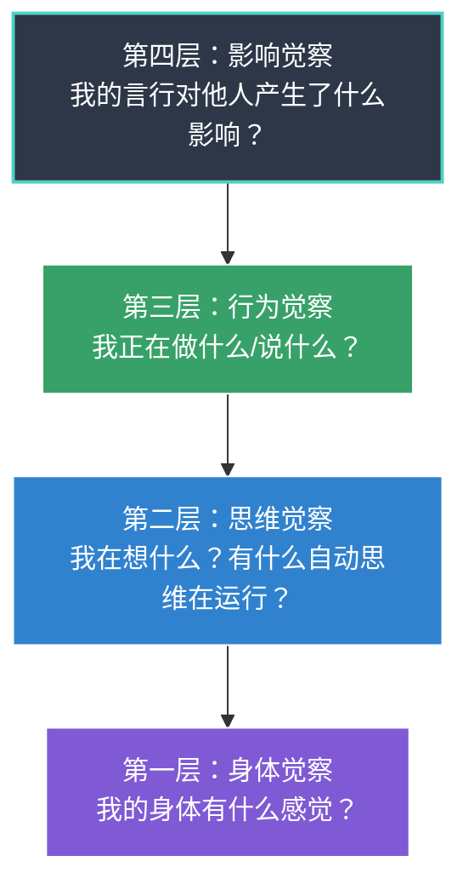
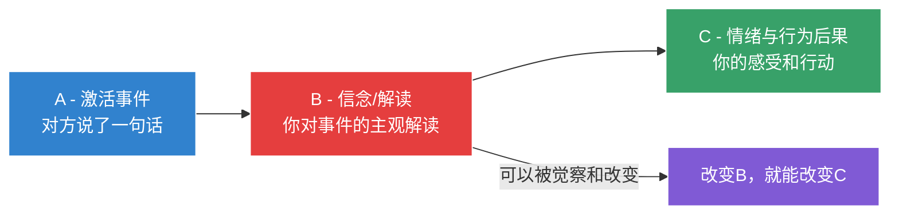
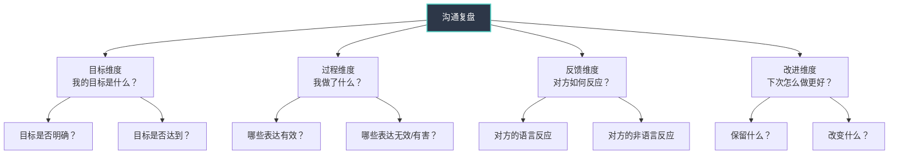
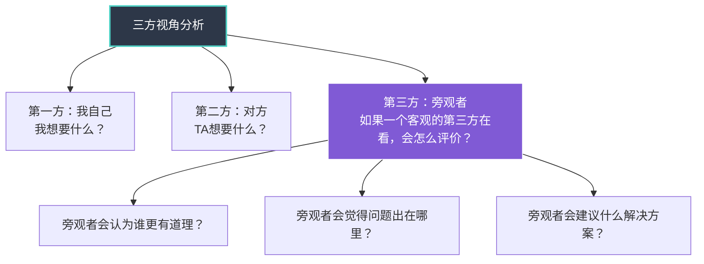
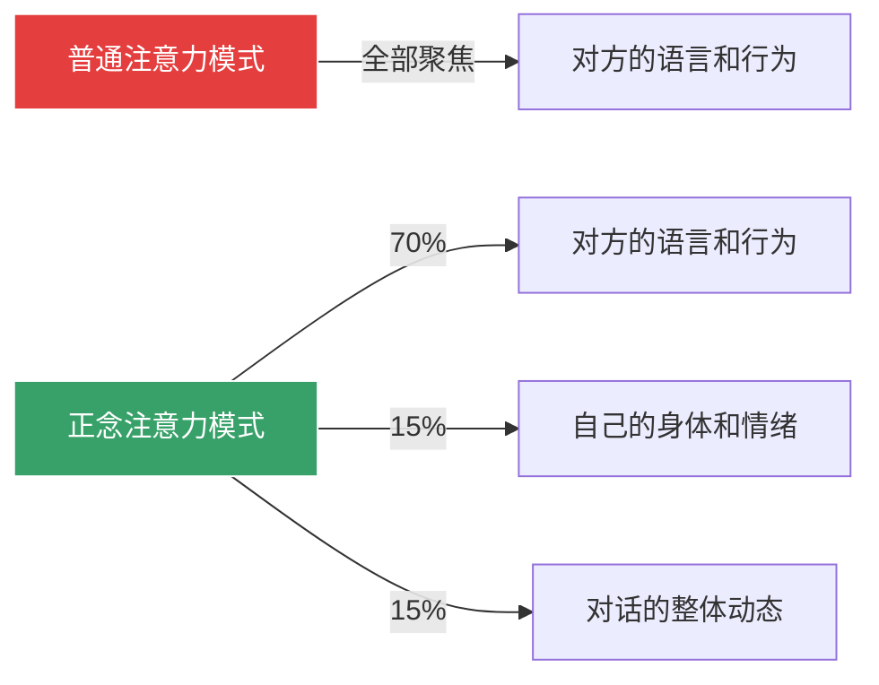

## 十一、沟通中的自我觉察练习

前面十个技巧从不同角度拆解了沟通心理学的实战工具——认知偏差觉察、框架转换、共情切换、心理安全构建、依恋调整、偏见干预、说服策略、情绪传染管理、认知重构。但所有这些技巧有一个共同的前提条件：**你必须先"看见"自己**。如果你不知道自己此刻在想什么、感受什么、身体在发出什么信号，就无法启动任何修正机制。

自我觉察不是天赋，而是一种可以系统训练的能力。神经科学研究表明，持续的自我反思练习能够增强前额叶皮层与杏仁核之间的神经连接——简单来说，你练得越多，大脑在情绪涌起时"按暂停键"的神经通路就越粗、反应越快。Tasha Eurich在其研究中发现，只有约10%-15%的人真正具备高水平的自我觉察，但通过有意识的练习，这个比例可以显著提升。

本节提供一套**从入门到精通的完整练习体系**，包含六种核心练习方法、四种场景化应用方案、常见误区纠正、以及一个可直接使用的28天训练计划。

---

### 11.1 自我觉察的理论基础

#### 11.1.1 什么是沟通中的自我觉察

自我觉察（Self-Awareness）是指个体能够清晰地认识自己的内在状态——包括情绪、想法、身体感受、行为模式——以及这些内在状态如何影响自己与他人的互动。

在沟通场景中，自我觉察包含四个层次：

| 层次 | 觉察内容 | 训练难度 | 典型内心独白 |
|------|----------|----------|-------------|
| 第一层：身体觉察 | 心跳、呼吸、肌肉紧张、体温、胃部感受 | ★☆☆☆☆ 入门 | "我的肩膀在发紧，胃有点收缩" |
| 第二层：思维觉察 | 自动思维、认知框架、内在叙事、信念系统 | ★★★☆☆ 进阶 | "我在想'他肯定看不起我'——这是我的解读，不是事实" |
| 第三层：行为觉察 | 语速、音量、肢体动作、表情、措辞选择 | ★★★★☆ 高级 | "我发现自己在打断对方，而且语速越来越快" |
| 第四层：影响觉察 | 对方的情绪变化、对话氛围的转变、关系动态 | ★★★★★ 精通 | "我注意到我一说完那句话，他就开始后仰并交叉双臂" |

**关键洞察**：四个层次不是"依次学会"的关系，而是在每次沟通中**同时运作**的。初学者需要刻意将注意力聚焦在某一层（通常从身体觉察开始），熟练后逐渐做到同时感知多个层次——就像一个指挥家同时听出弦乐、管乐、打击乐各自在做什么。

#### 11.1.2 为什么练习比知识更重要

理解了前文讲的认知偏差、情绪智力、共情层次，你获得了"地图"。但地图不等于走路的能力。沟通中的自我觉察有一个残酷的特点：**你必须在情绪涌起的那个瞬间做出反应，而那个瞬间恰好是你的理性大脑最容易"断线"的时刻**。

这就像游泳——你在岸上理解浮力原理、划水角度、换气节奏，但跳进水里的那一刻，身体必须"自动"执行这些动作。而这种自动化只能通过反复练习来建立。

心理学家Anders Ericsson提出的"刻意练习"理论指出：技能的习得需要满足三个条件——有明确目标、获得即时反馈、持续突破舒适区。本节的每一种练习方法都围绕这三个条件设计。

---

### 11.2 练习一：情绪日记——训练第一层（身体觉察）与第二层（思维觉察）

情绪日记是自我觉察训练的"地基"。它的原理来自认知行为疗法（CBT）的核心工具——思想记录表（Thought Record），经过简化后用于日常沟通反思。

#### 11.2.1 原理与机制

情绪日记的底层逻辑基于认知行为疗法的ABC模型：

在ABC模型中，**A（事件）本身不直接导致C（情绪后果）**，而是B（你对事件的解读/信念）决定了你的情绪反应。两个人面对同一个事件可能产生截然不同的情绪——区别在于B。

情绪日记的作用就是：**把B从无意识中拖到意识层面**。当B变得可见，你就获得了修改它的可能。

#### 11.2.2 每日五问模板

每天花5-8分钟，用以下模板记录当天最有情绪的一次沟通经历：

┌─────────────────────────────────────────────────────────────┐
│                    沟通情绪日记 - 每日五问                      │
├─────────────────────────────────────────────────────────────┤
│ 日期：________    场景：□职场 □家庭 □社交 □其他________     │
│                                                             │
│ ❶ 事件（A）：发生了什么？                                    │
│    用摄像机视角描述——只记录"如果拍下来会看到什么"              │
│    ________________________________________________________ │
│                                                             │
│ ❷ 解读（B）：我对这件事的解读/想法是什么？                    │
│    写下脑中冒出的第一个念头，不要修饰，不要"合理化"            │
│    ________________________________________________________ │
│                                                             │
│ ❸ 情绪（C）：我感受到了什么？                                │
│    给情绪命名（至少用一个精确的词）并打分（1-10）              │
│    情绪：____________ 强度：____/10                         │
│                                                             │
│ ❹ 身体信号：我的身体有什么反应？                              │
│    心跳____ 呼吸____ 肌肉____ 胃____ 温度____               │
│                                                             │
│ ❺ 替代解读：还有哪些可能的原因/解读？（至少写2个）            │
│    解读2：_________________________________________________  │
│    解读3：_________________________________________________  │
│                                                             │
│ 备注：这次沟通中，我是什么时候意识到自己有情绪的？              │
│ □ 事前就注意到了  □ 沟通中注意到了  □ 事后才意识到           │
└─────────────────────────────────────────────────────────────┘

#### 11.2.3 填写示例

以下是一份真实的填写示例，帮助理解每个字段应该怎么写：

**❶ 事件（A）——摄像机视角**

> 下午三点的项目会议上，我汇报完进度后，李经理皱了一下眉，然后说："这个时间线不太现实吧。"其他人都没有说话。

注意：这里只描述了"如果用摄像机拍下来会看到和听到什么"。没有加任何解读（比如"李经理不信任我""他在当众给我难堪"）。

**❷ 解读（B）——脑中第一个念头**

> "他根本不信任我的能力。他在所有人面前质疑我，让别人觉得我不行。"

**❸ 情绪（C）——精确命名**

> 情绪：羞耻（6/10）+ 愤怒（5/10）+ 焦虑（4/10）

注意：不是只写"不开心"——精确命名情绪本身就具有调节作用。UCLA的研究表明，仅仅是给情绪贴上精确的标签（"affect labeling"），就能降低杏仁核的激活水平。

**❹ 身体信号**

> 心跳加速，呼吸变浅，肩膀紧绷，胃有收缩感，面部发热。

**❺ 替代解读**

> 解读2：李经理可能确实觉得时间线太紧，他在保护项目不延期，不是针对我个人。
>
> 解读3：他自己可能刚被上级施压，要求加快进度，所以在找问题。他的语气严厉可能跟他自己的压力有关，与我的能力无关。

#### 11.2.4 情绪命名精准化指南

很多人在写情绪日记时，情绪词汇过于笼统（"不开心""烦""不舒服"）。情绪命名越精确，觉察效果越好。以下是沟通场景中常见情绪的精确词汇表：

| 基础情绪 | 精确细分（在沟通中更可能出现的具体情绪） |
|----------|----------------------------------------|
| 生气 | 愤怒、恼火、被冒犯、不耐烦、被激怒、不满、愤慨、暴怒 |
| 伤心 | 失望、被忽视、孤独、被抛弃、心酸、委屈、落寞、心碎 |
| 害怕 | 焦虑、紧张、不安、恐惧、担心、惊慌、心虚、胆怯 |
| 开心 | 满足、欣慰、感激、兴奋、自豪、释然、安心、愉悦 |
| 厌恶 | 反感、排斥、鄙视、不屑、尴尬、羞耻、厌烦、抵触 |
| 惊讶 | 意外、震惊、困惑、难以置信、措手不及、始料未及 |

**练习建议**：第一周先做到"至少用一个精确词"，第二周开始尝试"同时识别2-3种混合情绪"。高级练习者会发现，在一次沟通中同时存在2-4种不同情绪是常态，而非例外。

#### 11.2.5 进阶：追踪情绪模式

坚持记录2-3周后，回顾日记并寻找以下模式：

**模式一：高频触发场景**

> 统计过去21天的记录，哪种场景引发的负面情绪最多？
> - 职场汇报相关：8次
> - 伴侣沟通相关：6次
> - 社交场合：3次
> - 其他：4次
>
> → 结论：职场汇报是最大触发点，需要重点练习。

**模式二：反复出现的自动思维**

> 回顾所有B栏，哪些念头反复出现？
> - "他不信任我"——出现7次
> - "我不够好"——出现5次
> - "他们觉得我很奇怪"——出现4次
>
> → 结论："不被信任"是核心主题，可能与依恋风格有关（参见本章依恋理论部分）。

**模式三：身体信号-情绪对应关系**

> 你的身体信号是否有固定模式？
> - 胃部收缩 → 焦虑（每次都是）
> - 肩膀紧绷 → 愤怒或挫败
> - 面部发热 → 羞耻
>
> → 结论：身体信号可以成为情绪的"早期预警系统"——下次胃部一收缩，你就知道焦虑来了，不必等到情绪完全爆发后才意识到。

---

### 11.3 练习二：沟通复盘——训练第二层（思维觉察）与第三层（行为觉察）

情绪日记侧重于"内在状态"的觉察，沟通复盘则更进一步——将觉察范围扩展到自己的**行为**以及行为对**沟通效果**的影响。

#### 11.3.1 复盘的四维框架

每次重要沟通后，用以下四个维度进行结构化复盘：

#### 11.3.2 复盘记录模板

┌─────────────────────────────────────────────────────────────┐
│                    沟通复盘记录表                              │
├─────────────────────────────────────────────────────────────┤
│ 日期：________    沟通对象：________ 关系：________          │
│ 沟通形式：□面对面 □电话 □视频 □文字消息 □邮件              │
│ 重要程度：□低 □中 □高 □关键                                │
│ 花费时间：____分钟                                          │
├─────────────────────────────────────────────────────────────┤
│                                                             │
│ 维度一：目标                                                │
│ ─────────────                                               │
│ 我的沟通目标是什么？（如果不确定，写"不确定"）                │
│ → ________________________________________________________ │
│ 目标达成程度：____/10                                       │
│ 没达成目标的原因分析：                                       │
│ → ________________________________________________________ │
│                                                             │
│ 维度二：过程                                                │
│ ─────────────                                               │
│ 我说了什么/做了什么对沟通有正面推动作用？                     │
│ → ________________________________________________________ │
│ 我说了什么/做了什么对沟通产生了负面影响？                     │
│ → ________________________________________________________ │
│ 沟通中出现过哪些偏差？（参照11.2的情绪日记）                  │
│ → ________________________________________________________ │
│                                                             │
│ 维度三：反馈                                                │
│ ─────────────                                               │
│ 对方的语言反应（说了什么）：                                  │
│ → ________________________________________________________ │
│ 对方的非语言反应（表情、语气、肢体语言）：                    │
│ → ________________________________________________________ │
│ 我解读对方反应时有没有偏差？（确认偏差？归因错误？）          │
│ → ________________________________________________________ │
│                                                             │
│ 维度四：改进                                                │
│ ─────────────                                               │
│ 下次遇到类似场景，我会保留的做法：                            │
│ → ________________________________________________________ │
│ 下次遇到类似场景，我会改变的做法：                            │
│ → ________________________________________________________ │
│ 需要提前准备什么？                                          │
│ → ________________________________________________________ │
│                                                             │
│ 这次沟通的最大收获/教训（一句话）：                           │
│ → ________________________________________________________ │
└─────────────────────────────────────────────────────────────┘

#### 11.3.3 复盘时机与深度控制

不是所有沟通都需要复盘。过度复盘会消耗精力并导致自我苛责。以下是复盘时机的判断标准：

| 沟通类型 | 是否需要复盘 | 复盘深度 | 建议时长 |
|----------|-------------|----------|----------|
| 日常寒暄 | ✗ 不需要 | — | — |
| 工作中的例行沟通 | ✗ 通常不需要 | — | — |
| 重要会议/汇报 | ✓ 需要 | 中度 | 5-10分钟 |
| 冲突性对话 | ✓ 强烈建议 | 深度 | 10-15分钟 |
| 关键谈判/敏感谈话 | ✓ 必须 | 深度 | 15-20分钟 |
| 沟通结果令你不满意的 | ✓ 必须 | 深度 | 15-20分钟 |
| 你感到被触发/情绪强烈的 | ✓ 必须 | 深度 | 10-15分钟 |

**黄金窗口**：最佳复盘时间是沟通结束后**30分钟内**。超过2小时，很多细节会模糊；超过24小时，大脑会自动"编辑"记忆，加入合理化叙事，复盘的准确性大幅下降。

如果无法当场复盘，至少在手机备忘录中记下3个关键词（比如"打断了对方、语气太硬、最后和解了"），作为后续详细复盘的记忆锚点。

#### 11.3.4 进阶：STAR沟通事件分析法

对于关键沟通事件（比如一次失败的谈判、一次成功的说服、一次升级的冲突），可以使用更深入的STAR分析法：

| 维度 | 含义 | 分析内容 |
|------|------|----------|
| **S — Situation（情境）** | 沟通发生的具体背景 | 时间、地点、参与者、前置事件、关系历史、当时的状态（疲劳/焦虑/兴奋） |
| **T — Trigger（触发点）** | 沟通走向改变的关键时刻 | 哪句话、哪个动作、哪个表情改变了对话的方向？是正面转折还是负面转折？ |
| **A — Action（行动）** | 你在触发点做了什么 | 你的即时反应是什么？你使用了什么策略？是系统1还是系统2在主导？ |
| **R — Result（结果）** | 行动导致的后果 | 沟通结果如何？对方的反应如何？关系受到了什么影响？如果重来你会怎么做？ |

STAR分析的真正价值在于**识别触发点（Trigger）**。大多数沟通在大部分时间里是顺畅的——真正决定成败的是那几个"关键转折瞬间"。当你能精确识别这些瞬间，你的觉察就从"整体模糊感受"升级为"精确时间点定位"。

---

### 11.4 练习三：角色互换练习——训练第四层（影响觉察）

角色互换练习的目标是打破"自我中心视角"的局限，训练你从对方的眼睛看世界的能力。它是共情能力的系统化训练方法。

#### 11.4.1 为什么角色互换比"换位思考"更有效

"换位思考"是一个常见建议，但它的问题在于：你是在用自己的认知框架去"猜测"对方的想法。你所认为的"如果我是他，我会怎么想"，往往只是"如果我是我但坐在他的位置上，我会怎么想"——你并没有真正切换到对方的思维方式。

角色互换练习通过**物理化的角色扮演**来克服这个局限。它的核心设计原理来自心理剧疗法（Psychodrama）创始人Jacob Moreno的理论——身体的物理移动能够触发认知框架的切换。

#### 11.4.2 完整四步练习法

**适用场景**：当你遇到沟通困境、与某人产生冲突、无法理解对方的行为时。

**准备工作**：

- 找一个安静的空间，准备两把椅子（或两个坐垫），面对面放置
- 如果可能，留出30-40分钟不受打扰的时间
- 准备纸笔

**步骤一：撰写对方视角的信件（10分钟）**

坐在"对方的椅子"上，以对方的身份给自己写一封信。信中需要包含：

给 [你自己的名字]：

我（[对方的名字]）想告诉你的是：

在那次沟通中，我之所以那样做/说，是因为______________________
我的真实感受是______________________
我真正想要的是______________________
我害怕的是______________________
我对你的看法是______________________
我希望你能理解的是______________________

[对方的名字]

**关键要求**：不要写"对方可能在想什么"——要写"对方在想什么"。用第一人称（"我"），假装自己就是对方。如果发现自己在用"他可能觉得……"的句式，立刻切换回"我觉得……"。

**步骤二：识别对方的核心需求与恐惧（5分钟）**

从步骤一的信中提取以下信息：

| 提取维度 | 从信中找到的内容 |
|----------|-----------------|
| 对方的核心需求 | （被尊重/被认可/安全感/自主权/公平感） |
| 对方的核心恐惧 | （被否定/被抛弃/失去控制/不被理解/犯错） |
| 对方的价值观 | （什么对TA最重要？TA的原则是什么？） |
| 对方的误解 | （TA可能对我有哪些错误的解读？） |

**步骤三：寻找共同利益（5分钟）**

列出双方的共同利益和不一致的利益：

共同利益（双方都想要的）：
1. ________________________________________________
2. ________________________________________________
3. ________________________________________________

不一致的利益（冲突点）：
1. 我想要的：__________________ 对方想要的：__________________
2. 我想要的：__________________ 对方想要的：__________________

我能做出的让步/妥协：
→ ________________________________________________

我不愿让步的底线：
→ ________________________________________________

**步骤四：设计双赢方案（10分钟）**

基于步骤一到三的分析，设计一个具体的沟通方案：

下次沟通计划：

开场白：_________________________________________________
（选择一个不会触发对方防御的说法）

我需要首先承认/理解的：
→ ___________________________________________________

我的核心诉求（用对方能接受的方式表达）：
→ ___________________________________________________

对方可能的反对及我的回应：
反对1：______________ 我的回应：______________
反对2：______________ 我的回应：______________

我准备的妥协方案：
→ _________________________________________________

一个我可以主动给予的"善意信号"：
→ _________________________________________________

#### 11.4.3 进阶变体：三方视角分析

在团队冲突或多人沟通中，简单的"双方互换"可能不够。此时可以使用三方视角：

第三方视角的价值在于：它逼迫你跳出"我vs你"的对立框架，引入一个更客观的评估维度。很多在"我的视角"中看起来完全合理的立场，在"旁观者视角"中会显露出问题。

**操作方法**：想象你是一个不认识任何一方的旁观者，仅凭双方的行为和语言来判断。然后问自己：

- "作为旁观者，我会觉得这个冲突的根源是什么？"
- "旁观者会觉得谁需要先做出改变？"
- "旁观者会给出什么建议？"

---

### 11.5 练习四：正念觉察练习——沟通中的"实时监控"

前三项练习（情绪日记、沟通复盘、角色互换）都是"事后"或"事前"练习。正念觉察则是唯一的**"事中"练习**——它训练你在沟通进行的同时保持对自己的觉察。

#### 11.5.1 沟通正念的核心原理

正念（Mindfulness）在沟通中的应用不是"闭眼冥想"，而是一种**注意力的分配能力**——在关注对方说什么的同时，保持一部分注意力放在自己的内在状态上。

这种能力可以用"聚光灯"来比喻：普通的沟通就像一个聚光灯，全部打在对方身上；具有正念觉察的沟通就像一个"双焦点"聚光灯，70%打在对方身上，30%照着自己。

**为什么不是50/50？** 因为沟通的核心仍然是关注对方。如果把太多注意力放在自己身上，反而会错过对方的重要信息（微表情、语调变化、未说出口的话）。30%的自我觉察足以让你捕捉到关键信号，又不会干扰倾听。

#### 11.5.2 三种实时觉察锚点

在沟通中保持正念觉察需要一个"锚点"——一个你可以随时将注意力拉回的参照物。以下是三种常用锚点，从易到难：

**锚点一：呼吸锚点（入门级）**

在对话的自然间隙（比如对方说话时、自己思考时），悄悄注意一次呼吸。

操作指南：

1. 对方在说话时，不必时刻盯着对方——可以微微低头做思考状，自然地将注意力拉到呼吸上2-3秒
2. 不需要深呼吸或改变呼吸节奏，只是"注意"到它
3. 注意呼吸的位置：是胸腔还是腹部？是深还是浅？
4. 然后将注意力自然地转回对方的话语

这个动作不超过3秒，对方通常不会注意到。但就是这3秒足以让你从"自动驾驶"模式中脱离出来。

**锚点二：脚底锚点（进阶级）**

感觉双脚与地面的接触。这个锚点的优势是：它完全不可见，可以在任何场景下使用。

操作指南：

1. 在对话中感觉到情绪涌起时，将注意力转移到脚底
2. 感受脚底的压力分布——是重心前倾（可能在进攻/紧张）还是后倾（可能在退缩/防御）
3. 感受双脚是否稳稳踩在地面上
4. 如果发现重心前倾，微微后移——这个微小的身体调整可以传递信号给大脑："你站稳了，不需要战斗"

**锚点三：空间觉察锚点（高级）**

觉察自己和对方之间的物理空间，以及这个空间中的"能量"变化。

操作指南：

1. 注意你和对方之间的距离——比刚才更近了还是更远了？
2. 注意空气中的"氛围"——是紧绷的、轻松的、对抗的还是合作的？
3. 注意声音——你的音量是否在增大？对方的语速是否在加快？
4. 注意温度——你是否感觉到"热度"（情绪升温）或"冷感"（关系降温）？

#### 11.5.3 三分钟呼吸空间练习

这是在沟通前（重要会议、敏感对话、谈判前）使用的快速正念准备练习。整个过程只需要3分钟。

**第一分钟：觉察（60秒）**

> 闭上眼睛（如果场合允许），问自己三个问题：
>
> "我现在的身体感受是什么？"——扫描一遍，注意任何紧绷、不适或放松的区域。
>
> "我现在的主导情绪是什么？"——给它一个名字。焦虑？兴奋？不安？平静？
>
> "我现在的思维状态是什么？"——脑中在转什么念头？有没有什么担忧或预设正在运行？

**第二分钟：聚焦（60秒）**

> 将注意力集中在呼吸上，跟随每一次吸气和呼气。
>
> 如果脑中出现关于即将到来的沟通的念头（"他会不会又反对？""我说不好怎么办？"），不要压制——只是标记"这是担忧"，然后把注意力轻柔地拉回呼吸。

**第三分钟：意图设定（60秒）**

> 睁开眼睛，为即将到来的沟通设定一个"觉察意图"：
>
> "在这次对话中，我要注意自己的________。"（填入你最需要关注的一项：比如"语速不要太快""不要打断对方""注意自己是否在做归因判断"）
>
> 把这个意图在脑中重复三遍，然后开始沟通。

---

### 11.6 练习五：身体觉察练习——被忽略的信息通道

身体是情绪的第一个"报告者"。在大多数情况下，你的身体比你的意识更早感知到情绪的变化——胃部收缩可能在你意识到焦虑之前就发生了，肩膀紧绷可能在你意识到愤怒之前就出现了。

#### 11.6.1 沟通中的身体信号地图

以下是不同情绪在身体上的典型"着陆点"：

| 情绪 | 身体信号 | 在沟通中的具体表现 | 觉察难度 |
|------|----------|-------------------|----------|
| 焦虑 | 胃部收缩、手心出汗、呼吸变浅 | 说话前先"嗯""那个"比较多，语句不完整 | ★★☆☆☆ |
| 愤怒 | 肩膀/下巴紧握、心跳加速、体温升高 | 语速加快、音量增大、用语更绝对化 | ★★☆☆☆ |
| 羞耻 | 面部发热、视线回避、身体收缩/蜷缩 | 声音变小、话语变少、开始自嘲或道歉 | ★★★☆☆ |
| 防御 | 双臂交叉、身体后仰、拳头微握 | 开始频繁解释、语气变硬、用"但是"开头 | ★★★☆☆ |
| 悲伤 | 胸口发紧、喉部堵塞、眼眶湿润 | 语速变慢、声音变小、话语变少、开始沉默 | ★★★★☆ |
| 兴奋 | 心跳加快、呼吸加深、身体前倾 | 语速加快但节奏稳定、手势变多、笑容变多 | ★☆☆☆☆ |
| 厌恶 | 鼻翼微张、上唇微抬、身体微微后退 | 措辞变模糊、开始用"可能""也许"回避直接回应 | ★★★★☆ |

#### 11.6.2 30秒快速身体扫描

在沟通中（尤其是感觉到某种不舒服但说不清楚时），执行以下30秒快速扫描：

扫描顺序（从上到下，每个部位花3-5秒感受）：

头部和面部
├── 额头：是放松的还是皱眉的？
├── 眼睛：是自然睁开还是眯着/回避视线？
├── 下颌：是放松的还是紧咬的？
└── 面部温度：正常还是发热/发冷？

颈部和肩膀
├── 颈部：能自由转动还是僵硬的？
└── 肩膀：是下沉放松的还是耸起紧绷的？

胸部和腹部
├── 呼吸：深还是浅？快还是慢？
├── 胸口：有没有紧绷感或压迫感？
└── 胃部：有没有收缩、翻搅的感觉？

四肢
├── 手臂：是自然垂放还是交叉/紧握？
├── 手：是放松的还是握拳的？手心干还是湿？
└── 双脚：是稳稳踩地还是脚尖朝向门口（想要逃离）？

整体
└── 身体重心：前倾（进攻）/正坐（中立）/后仰（防御）？

#### 11.6.3 身体觉察→行为调整链

觉察到身体信号后，关键是进行即时调整。以下是最常见的"觉察→调整"链条：

觉察：肩膀在发紧 → 判断：可能在进入愤怒/防御状态
调整：有意识地让肩膀下沉，做一次缓慢的呼气
效果：副交感神经被激活，愤怒的生理基础被削弱

觉察：双臂已经交叉 → 判断：可能在心理上关闭了通道
调整：把手臂放下，双手自然放在桌上或膝上
效果：开放的身体姿态反过来向大脑传递"我是开放的"信号

觉察：呼吸变浅变快 → 判断：可能在焦虑或紧张
调整：在对方说话时悄悄做一次深呼吸（吸4秒-呼6秒）
效果：心率下降，焦虑的生理症状被缓解

觉察：身体开始前倾 → 判断：可能在进入攻击性状态
调整：微微后靠，双脚踩稳地面
效果：给自己一个物理的"刹车"，降低冲动反应的可能

**原理解释**：这不是"假装没事"——身体姿态确实会反向影响情绪状态。哈佛商学院Amy Cuddy的研究（虽然原始的"能量姿势"研究有争议，但身体-情绪互动的基本结论被多项后续研究支持）表明，身体姿态的改变能够在生理层面影响皮质醇和睾酮水平。你不需要"说服"自己的情绪改变，只需要调整身体——情绪会跟着身体走。

---

### 11.7 练习六：外部反馈获取——突破自我觉察的天花板

自我觉察有一个天然的局限：**你无法看到自己的后脑勺**。无论你的自我观察多么敏锐，总有一些行为模式、沟通习惯是你的"盲区"——因为它们太自动化了，自动化到你根本意识不到自己在做。

突破这个局限的唯一方法是：**从他人那里获取反馈**。

#### 11.7.1 结构化反馈请求

泛泛地问"你觉得我沟通怎么样"通常得不到有用的回答。你需要用结构化的问题来引导反馈：

**反馈请求模板：**

我想请你帮我一个忙。我最近在练习提升自己的沟通能力，
你是我信任的人，所以想听听你的真实观察。

请你回忆最近1-2个月内我们之间的2-3次沟通，回答以下问题：

1. 我在沟通中最大的优点是什么？
   （你最欣赏/最舒服的地方）

2. 我在沟通中最大的可以改善的地方是什么？
   （你希望我能做得更好的地方）

3. 你有没有发现我有一些重复出现的沟通习惯？
   （不管好坏——可能是口头禅、某种语气、某个动作）

4. 如果我说一句话就能立刻改善我的沟通，那句话是什么？

请放心——这不是考试，我不会因为你说了"不好听的"而生气。
我就是需要一个外视角来补全我的自我认知。

#### 11.7.2 选择反馈来源的原则

不是所有人都能提供有价值的反馈。理想的反馈来源需要满足以下条件：

| 原则 | 说明 | 好的例子 | 差的例子 |
|------|------|----------|----------|
| 信任基础 | 对方信任你不会因为真话而报复 | 一起工作3年的同事 | 刚入职1个月的新人 |
| 观察频率 | 对方有足够的沟通样本来做判断 | 每天一起工作的搭档 | 一年只见2次的朋友 |
| 观察意愿 | 对方愿意认真回答而非敷衍 | 主动提出"有啥说啥"的朋友 | 已经在催你结束对话的人 |
| 视角互补 | 对方看到的是你的盲区 | 你的下属（看到你的领导沟通） | 你的和你风格类似的朋友 |
| 安全感 | 对方不会因为说了真话而面临社交风险 | 匿名的360度评估参与者 | 当着其他同事面被问的下属 |

**最佳反馈来源清单**（按价值排序）：

1. 值得信赖且经常沟通的同事/合作伙伴（看到你在工作场景中的表现）
2. 亲密伴侣或家人（看到你在非社交状态下的真实面貌）
3. 曾经跟你产生过冲突但已和解的人（知道你在冲突中的表现）
4. 你的下属或学生（看到你作为"上级"的沟通风格——这通常是你最不自知的盲区）

#### 11.7.3 360度反馈的简化版

如果条件允许，可以做一次"简化版360度反馈"——从3-5个不同类型的人那里收集匿名反馈：

反馈收集问卷（匿名填写）

关于 [你的名字] 的沟通风格，请就以下维度打分（1-5分）：

倾听能力：  ○1  ○2  ○3  ○4  ○5
表达清晰度：○1  ○2  ○3  ○4  ○5
情绪管理：  ○1  ○2  ○3  ○4  ○5
尊重他人：  ○1  ○2  ○3  ○4  ○5
建设性反馈：○1  ○2  ○3  ○4  ○5
开放度：    ○1  ○2  ○3  ○4  ○5

开放问题：
• [你的名字] 在沟通中最大的优势是：________________
• [你的名字] 在沟通中最需要改善的是：________________
• 一个具体的例子（可以匿名化）：________________

**处理反馈的心理准备**：

1. 收到反馈后，不要立刻反应——给自己24小时的消化时间
2. 不要试图猜"这是谁说的"——这会触发防御机制
3. 关注**模式**而非单条意见——如果3个人中2个人都提到了同一个问题，那大概率是真实存在的
4. 区分"风格偏好"和"实际问题"——有人说"你太安静了"不一定是问题，但3个人都说"你不太听人说话"就需要重视

---

### 11.8 进阶练习：元认知与模式识别

当基础练习（情绪日记、沟通复盘、角色互换、正念觉察、身体觉察、外部反馈）已经成为习惯后，可以进入更高层次的练习——元认知和模式识别。

#### 11.8.1 元认知：关于"思考的思考"

元认知（Metacognition）是指你能够观察自己的思维过程本身——不仅是"我在想什么"（思维觉察），还包括"我是怎么想到这个的"（思维过程觉察）。

在沟通中的具体应用：

普通觉察：
"我在想'他不信任我'。"

元认知觉察：
"我注意到，在他说完那句话后，我的大脑立刻跳到了'他不信任我'这个结论。
我注意到这个结论形成得非常快——不到1秒。
我注意到我没有经过任何证据检验就接受了这个结论。
我注意到这个结论让我产生了一种熟悉的愤怒感——'又是这样'。
我注意到'又是这样'这个想法本身暗示着一种模式——我似乎经常在特定
类型的沟通中快速做出'不被信任'的归因。"

**元认知觉察练习**：每周选1次沟通，在事后用"思维回放"的方式，逐帧还原自己的思维过程：

1. "对方说了什么触发了我的反应？"（触发点）
2. "我的大脑在那之后的第1秒想了什么？"（自动思维A）
3. "第2秒呢？"（自动思维B）
4. "这些想法之间有没有一个隐含的逻辑链条？"（底层信念）
5. "这个逻辑链条的起点是什么？"（核心假设/核心信念）

#### 11.8.2 模式识别：从单次觉察到长期画像

单次觉察是"点"，多次觉察的模式才是"面"。当你积累了足够多的觉察数据（通常需要4-8周的持续记录），就可以开始识别自己的沟通模式。

**个人沟通模式画像模板：**

┌─────────────────────────────────────────────────────────────┐
│                 个人沟通模式画像                               │
│                 基于 ____ 周的自我观察数据                     │
├─────────────────────────────────────────────────────────────┤
│                                                             │
│ 📊 情绪模式                                                 │
│ ─────────                                                   │
│ 最常出现的情绪：________________________________             │
│ 触发最强情绪的场景：________________________________         │
│ 我处理情绪的默认方式：□压抑 □爆发 □回避 □理性分析           │
│ 我处理情绪的默认方式的效果（好/坏）：________________         │
│                                                             │
│ 🧠 认知模式                                                 │
│ ─────────                                                   │
│ 最常犯的认知偏差：________________________________           │
│ 最常出现的自动思维：________________________________         │
│ 我的核心假设/信念：________________________________          │
│  （比如"世界是竞争性的""我必须完美""别人会评判我"）          │
│                                                             │
│ 🗣️ 行为模式                                                 │
│ ─────────                                                   │
│ 在舒适场景中的典型表现：____________________________         │
│ 在压力场景中的典型表现：____________________________         │
│ 我的口头禅/高频用词：____________________________            │
│ 我的默认沟通策略：□进攻 □防守 □讨好 □理智 □回避              │
│                                                             │
│ 🔄 关系模式                                                 │
│ ─────────                                                   │
│ 在权威面前的典型反应：____________________________           │
│ 在下属/晚辈面前的典型反应：____________________________       │
│ 在冲突中的典型反应：____________________________             │
│ 在亲密关系中的典型反应：____________________________          │
│                                                             │
│ 💡 最大的觉察发现：                                          │
│ ________________________________________________________    │
│                                                             │
│ 🎯 下一个要改善的重点：                                      │
│ ________________________________________________________    │
└─────────────────────────────────────────────────────────────┘

#### 11.8.3 模式打断技术

识别出模式后，下一步是"打断"那些对你不利的自动模式。模式打断（Pattern Interruption）借鉴了神经语言编程（NLP）和习惯科学的原理——你不需要消灭旧模式，只需要在旧模式和行为之间插入一个新的选择。

**三步模式打断法：**

1. **标记模式**：给你的自动模式起一个简短的名字，比如"防御性解释""攻击性反驳""讨好性同意""逃避性沉默"
2. **设置触发器**：选择一个特定的身体信号作为"模式即将启动"的预警。比如"下巴开始紧咬＝攻击性反驳即将启动"
3. **插入替代行为**：当触发器激活时，执行一个预设的替代行为（可以是物理动作也可以是语言动作）

示例：

模式名称："防御性解释"
触发器信号：感觉到自己开始说话的速度变快
替代行为：在继续说话之前，先暂停2秒，然后说"我理解你的关注，
我想确认一下——你主要担心的是什么？"
  ↑ 把"为自己辩护"转换为"询问对方的核心关切"

---

### 11.9 场景化应用方案

自我觉察练习不能脱离具体场景。以下是四个高频场景中的觉察重点和具体操作指南。

#### 11.9.1 职场汇报与会议

**场景特点**：有明确的权力层级，有观众，压力高，"表现"焦虑容易干扰觉察。

**觉察重点：**

| 常见问题 | 觉察目标 | 实时调整 |
|----------|---------|----------|
| 汇报时紧张导致语速过快 | 觉察呼吸和语速 | 每讲完一个要点，停顿1秒 |
| 被提问时感到被攻击 | 觉察身体是否进入防御状态 | 深呼吸+肩膀下沉+回答前重复问题 |
| 讨论中急于表达自己的观点 | 觉察是否在"听"还是在"等对方说完" | 要求自己先总结对方观点再回应 |
| 被批评时自动进入辩解模式 | 觉察下巴和肩膀的紧绷 | 先说"谢谢你的反馈"（给自己3秒缓冲） |

#### 11.9.2 亲密关系沟通

**场景特点**：情绪强度高，安全感需求强，容易触发依恋相关的情绪反应。

**觉察重点：**

| 常见问题 | 觉察目标 | 实时调整 |
|----------|---------|----------|
| 对方说了某句话，你"瞬间就懂了"（但可能懂错了） | 觉察自己是否在用过去的经验"预判"对方 | 复述确认："你刚才说的是不是这个意思？" |
| 情绪升温时想说狠话 | 觉察"这股冲动的强度有多高"（1-10分） | 如果>7分，说"我需要10分钟冷静一下" |
| 吵架后陷入冷战 | 觉察自己是在"冷静"还是在"惩罚" | 如果是后者，诚实地说"我现在在生气，但我想等平静了再聊" |
| 觉得对方"不理解自己" | 觉察自己是否清晰地表达了需求 | 用"我感到……因为……我希望……"句式 |

#### 11.9.3 跨文化沟通

**场景特点**：文化差异可能让同一个行为产生完全不同的解读，觉察的重点从"我的情绪"扩展到"我的文化假设"。

**觉察重点：**

- "我对对方行为的解读，有没有可能是我的文化框架在起作用？"
- "我是否在用自己的文化标准来评判对方的沟通方式？"
- "对方的沉默/直接/间接/热情/冷淡，有没有可能在TA的文化中是正常甚至礼貌的表现？"

**实用技巧**：在不确定时，用好奇而非评判的方式提问。比如不说"你怎么这么直接"（有评判意味），而是说"在你的文化中，直接表达不同意见是很正常的对吗？"（好奇+确认）。

#### 11.9.4 文字沟通（消息/邮件）

**场景特点**：缺少非语言信号，对方的语气和意图容易被"脑补"，情绪反应可能在发送前就有充分时间发酵。

**觉察重点：**

| 触发场景 | 自动反应 | 觉察检查 | 调整方案 |
|----------|---------|---------|----------|
| 收到一封语气"冰冷"的邮件 | "他对我不满" | "我是在解读语气还是在分析内容？" | 先只关注邮件中的事实和请求，暂不解读语气 |
| 对方的消息回复很慢 | "他不重视我/这件事" | "我有没有考虑过其他可能的原因？" | 等待至少2小时再做判断 |
| 想发一条带有情绪的消息 | 立刻打出并发送 | "如果对方把这条消息给第三方看，我会尴尬吗？" | 写完后不发送，等30分钟再看一遍 |
| 在群聊中看到让人生气的发言 | 立刻反驳 | "我是在回应内容还是在回应我的情绪？" | 先退出群聊界面，做一次深呼吸 |

---

### 11.10 常见误区与纠正

#### 误区一：过度自我批评——把觉察变成了自我审判

**表现**：每次复盘都在挑自己的毛病，感觉"我怎么总是做不好"，复盘后情绪比沟通时还差。

**原因**：混淆了"觉察"和"评判"。觉察是"我注意到了"，评判是"我给自己打了低分"。

**纠正**：复盘时使用"观察者语言"而非"法官语言"：

| 法官语言（自我批评） | 观察者语言（自我觉察） |
|---------------------|---------------------|
| "我又打断别人了，我真差劲" | "我注意到自己在第三次打断时意识到了——前两次没有。进步。" |
| "我说话太冲了，每次都这样" | "这次语速比上次快，情绪强度大概8/10。上次是6/10。需要关注触发场景的变化。" |
| "我完全没控制住情绪" | "我是在情绪达到9/10时才注意到的。目标是下次在6/10时就能注意到。" |

**核心原则**：自我觉察的目的是**理解**自己，不是**改造**自己。当你带着理解而非批判去观察自己，改变反而更容易发生。

#### 误区二：分析瘫痪——思考太多导致行动瘫痪

**表现**：在每次沟通前都要分析一堆"我可能有什么偏差""我需要注意什么"，结果反而不自然，沟通质量下降。

**原因**：把"系统2"过度激活了——所有沟通都变成了"手动挡"，累且低效。

**纠正**：

1. 不是每次沟通都需要启动觉察——只在**高风险**或**高情绪**的沟通中刻意练习
2. 日常沟通中只保留一个"微型觉察"——比如每小时做一次身体扫描（30秒），不需要更多
3. 记住：觉察训练的最终目标是**自动化**，不是永远保持手动模式

#### 误区三：只觉察不行动——收集了一堆数据但从不改变

**表现**：情绪日记写了三个月，每次都能精确识别自己的偏差和情绪模式，但在实际沟通中的行为没有任何变化。

**原因**：停留在"觉察舒适区"——识别偏差比改变行为容易得多。觉察本身变成了"我已经做了功课"的心理安慰。

**纠正**：每次觉察后必须跟一个**具体的行动承诺**：

觉察记录：
"今天会议中我再次犯了基本归因错误——同事没完成任务，我第一反应是他态度有问题。"

行动承诺（不是"下次注意"这种空话）：
"明天早上给他发一条消息，问'最近工作量怎么样？有没有什么我能帮忙的？'
——这个行为既验证了他没完成任务的真实原因，也传达了关心而非指责。"

#### 误区四：觉察疲劳——新鲜感消退后放弃

**表现**：前两周热情满满，每天写日记、做复盘，第三周开始觉得"也没什么新发现"，第四周就停了。

**原因**：缺乏外部激励和进阶挑战。就像健身一样，只做同一个动作很快会无聊。

**纠正**：

1. **设置进阶梯度**——每两周增加一项新的练习，保持新鲜感
2. **找一个觉察伙伴**——互相分享发现，互相督促
3. **记录"觉察突破时刻"**——那些"如果没有觉察，我就会……但这次我……"的瞬间。回顾这些时刻是坚持下去最强大的动力
4. **接受"平淡期"**——技能学习都有"高原期"，看似没有进步，但神经连接在后台持续强化

#### 误区五：用觉察知识攻击他人

**表现**：学了认知偏差后，开始在争论中说"你这是确认偏差""你在做基本归因错误"。

**原因**：把自我工具变成了武器。

**纠正**：这条规则很简单——**永远不要在冲突中对对方使用心理学标签**。这些知识是用来理解自己和理解对方的（在脑中），不是用来教训对方的（在嘴上）。

如果你真的想帮助对方觉察偏差，用**问题**而非**标签**：

| 错误做法 | 正确做法 |
|----------|---------|
| "你这是确认偏差" | "你有没有考虑过另外一种可能性？" |
| "你在做基本归因错误" | "你觉得除了性格原因，有没有可能是其他因素导致的？" |
| "你这是框架效应" | "如果换一种角度来看这件事，你觉得会怎样？" |

---

### 11.11 28天自我觉察训练计划

以下是一个循序渐进的28天训练计划，从最基础的身体觉察开始，逐步升级到元认知和模式识别。

#### 第一周：建立基础觉察习惯

| 天数 | 练习内容 | 时长 | 目标 |
|------|----------|------|------|
| Day 1 | 学习"情绪日记"模板，记录第一次 | 10分钟 | 熟悉模板 |
| Day 2 | 记录第二次情绪日记，尝试更精确的情绪命名 | 8分钟 | 命名精度提升 |
| Day 3 | 学习"30秒身体扫描"，在1次沟通前/后各做一次 | 2分钟 | 建立身体觉察入口 |
| Day 4 | 情绪日记 + 1次身体扫描 | 10分钟 | 组合练习 |
| Day 5 | 情绪日记 + 2次身体扫描（上午1次+下午1次） | 10分钟 | 增加频率 |
| Day 6 | 回顾前5天的日记，寻找初步模式 | 15分钟 | 首次模式识别 |
| Day 7 | 休息日：回顾本周最有收获的一次觉察 | 5分钟 | 巩固正反馈 |

#### 第二周：加入沟通复盘

| 天数 | 练习内容 | 时长 | 目标 |
|------|----------|------|------|
| Day 8 | 学习"沟通复盘四维框架"，复盘一次近期沟通 | 15分钟 | 熟悉复盘模板 |
| Day 9 | 情绪日记 + 复盘一天中最重要的沟通 | 15分钟 | 双练习组合 |
| Day 10 | 尝试"呼吸锚点"——在1次沟通中注意呼吸 | 5分钟 | 正念觉察入门 |
| Day 11 | 情绪日记 + 复盘 + 1次呼吸锚点 | 15分钟 | 三练习组合 |
| Day 12 | 复盘 + 尝试在复盘中使用STAR分析 | 15分钟 | 深化复盘 |
| Day 13 | 回顾本周所有记录，识别"最常见的情绪"和"最常见的偏差" | 20分钟 | 模式识别 |
| Day 14 | 向1个人请求结构化反馈（使用11.7的模板） | 10分钟 | 外部视角 |

#### 第三周：练习高级觉察技术

| 天数 | 练习内容 | 时长 | 目标 |
|------|----------|------|------|
| Day 15 | 学习"角色互换四步法"，针对一个沟通困境进行练习 | 30分钟 | 共情视角训练 |
| Day 16 | 练习"脚底锚点"——在情绪涌起时使用 | 5分钟 | 进阶身体锚点 |
| Day 17 | 情绪日记 + 复盘 + 尝试在沟通中使用"暂停-观察-继续" | 15分钟 | 实时觉察练习 |
| Day 18 | 练习"元认知觉察"——回放一次沟通的思维过程 | 15分钟 | 元认知入门 |
| Day 19 | 复盘 + 对比本周和第一周的觉察能力变化 | 15分钟 | 评估进步 |
| Day 20 | 回顾反馈来源的回复（如果已收到），提取关键发现 | 15分钟 | 整合外部反馈 |
| Day 21 | 填写"个人沟通模式画像"（初版） | 20分钟 | 综合画像 |

#### 第四周：整合与巩固

| 天数 | 练习内容 | 时长 | 目标 |
|------|----------|------|------|
| Day 22 | 根据模式画像中的"最大问题"，设计一个"模式打断"方案 | 15分钟 | 行动导向 |
| Day 23 | 在1次真实沟通中尝试使用"模式打断" | 5分钟 | 实战测试 |
| Day 24 | 复盘Day 23的尝试——模式打断有效吗？需要调整吗？ | 10分钟 | 迭代改进 |
| Day 25 | 练习"三分钟呼吸空间"——为一次重要沟通做准备 | 5分钟 | 沟通前准备 |
| Day 26 | 做一次完整的"角色互换练习"（针对本周的一个真实困境） | 30分钟 | 深度共情训练 |
| Day 27 | 回顾28天的所有记录，更新"个人沟通模式画像" | 25分钟 | 最终画像 |
| Day 28 | 制定"下一阶段"的练习计划——选择1-2项最有价值的练习作为长期习惯 | 15分钟 | 长期习惯固化 |

#### 28天后的长期维护方案

完成28天训练后，不需要继续保持高强度的每日练习。建议采用以下"维护方案"：

每日（2分钟）：
→ 选择1次沟通，在沟通中注意1次呼吸（呼吸锚点）

每周（15-20分钟）：
→ 选择1次重要沟通做深度复盘（STAR分析）
→ 情绪日记写3天（不必每天写）

每月（30分钟）：
→ 回顾本月的复盘记录，检查模式是否有变化
→ 更新"个人沟通模式画像"

每季度（1小时）：
→ 做一次完整的"角色互换练习"（针对一个持续存在的沟通困境）
→ 向1-2个人请求新一轮的结构化反馈
→ 对比本季度和上季度的画像，评估长期趋势

---

### 11.12 本节小结

自我觉察是所有沟通心理学技巧的**底层操作系统**——没有它，偏差觉察、共情切换、框架转换都是空中楼阁。

本节介绍了六种核心练习方法，它们各有侧重，组合使用效果最佳：

| 练习方法 | 主要训练层次 | 核心价值 | 使用频率建议 |
|----------|------------|----------|-------------|
| 情绪日记 | 身体觉察 + 思维觉察 | 将无意识的情绪和思维模式变为可见 | 每日/高频阶段 |
| 沟通复盘 | 思维觉察 + 行为觉察 | 从单次沟通中提取学习 | 每次重要沟通后 |
| 角色互换 | 影响觉察 | 打破自我中心视角，理解对方 | 遇到困境时 |
| 正念觉察 | 实时身体+思维+行为 | 在沟通进行中保持觉察 | 每次重要沟通中 |
| 身体觉察 | 身体觉察→行为调整 | 通过身体信号获得情绪早期预警 | 随时 |
| 外部反馈 | 突破自我觉察盲区 | 看见自己看不见的部分 | 定期（每季度） |

**核心公式**：

> 沟通自我觉察 = 持续练习 × 场景应用 × 模式识别 × 反馈整合

缺任何一项，觉察能力都会停留在表面。持续练习建立神经通路，场景应用确保觉察能力在真实环境中发挥作用，模式识别让单次觉察升级为系统理解，反馈整合则突破自我观察的天花板。

**记住**：自我觉察的终极目标不是"完美沟通"——世上没有完美沟通。目标是**从无意识的重复**走向**有意识的选择**。当你可以选择如何回应，而不是被自动反应牵着走，你就真正获得了沟通的自由。
