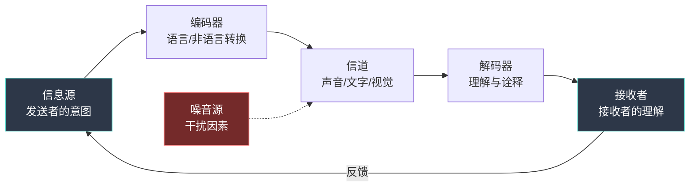
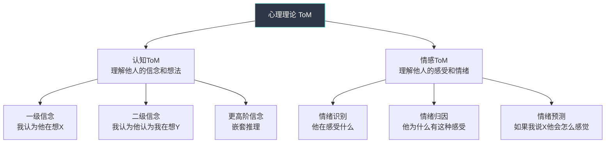
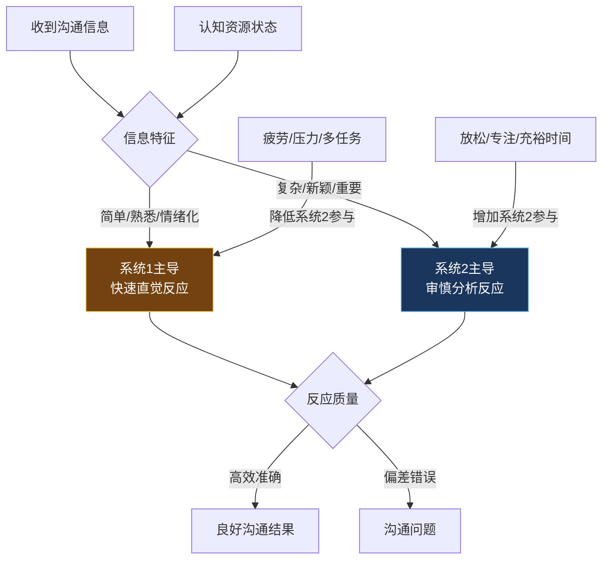
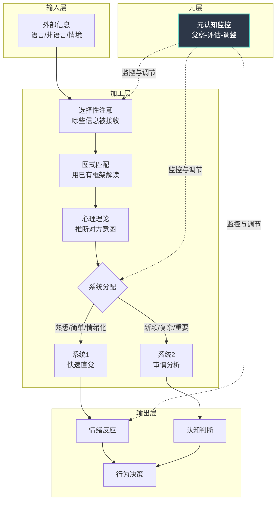

## 一、认知心理学视角下的沟通

沟通不只是"说话"和"听话"——它是两个大脑之间极其复杂的信息加工过程。认知心理学为我们提供了一套精密的理论工具，帮助我们理解这个过程中每一步可能发生什么、为什么会出错、以及如何改进。

本节从信息加工的基本模型出发，依次介绍工作记忆与认知负荷、图式理论、心理理论、双系统思维，以及元认知在沟通中的角色。这些理论不是孤立的学术概念，它们构成了一套完整的"认知透视镜"——戴上它，你将能在对话进行的同时，看到表层之下的心理运作机制。

---

### 1.1 人类信息加工模型

#### 1.1.1 从香农到沟通：信息论的基础框架

1948年，克劳德·香农（Claude Shannon）在贝尔实验室提出了信息论的数学框架。虽然这个模型最初是为电话通信设计的，但它对理解人际沟通有深远的启发意义。

**香农-韦弗沟通模型的核心要素：**

这个模型揭示了沟通中一个根本性的挑战：**编码与解码之间永远存在信息损耗**。你说出的话和对方听到的话，从来不是同一件事。

#### 1.1.2 沟通的三阶段加工模型

认知心理学将沟通过程分解为三个核心阶段，每个阶段都有独特的认知机制和潜在的失真来源：

**阶段一：编码（Encoding）**

发送者将内在的想法、情感和意图转化为外在的符号系统（语言、表情、手势、语调）。这个过程远比大多数人意识到的要困难：

- **概念化困难**：你脑中的想法往往是模糊的、多维的、非线性的，但语言是线性的、离散的。把一个三维的想法"压扁"成一维的文字序列，必然会有信息损失。这就是为什么人们常说"我有感觉但说不出来"。
- **框架限制**：你的认知框架决定了你能"看到"什么，进而决定了你能"说出"什么。一个从未经历过贫困的人，在描述经济困难时只能使用抽象概念，缺乏具体的感知细节。
- **情绪干扰**：强烈的情绪会扭曲编码过程。愤怒时，你会选择更具攻击性的词汇；焦虑时，你的表达会变得含糊和回避。神经科学研究表明，杏仁核的过度激活会抑制前额叶皮层的语言组织功能。
- **社会性过滤**：在编码时，发送者会无意识地进行"社会可接受性"筛选——不是所有想法都会被转化为语言。这种过滤在有权力差异的沟通中尤为明显（下属对上级、学生对老师）。

**阶段二：传递（Transmission）**

编码后的信息通过某种信道传递给接收者。人际沟通中的"噪音"远不止环境声音：

| 噪音类型 | 具体表现 | 对沟通的影响 |
|----------|----------|-------------|
| 物理噪音 | 环境嘈杂、信号干扰、距离太远 | 信息丢失、需要重复 |
| 心理噪音 | 内心焦虑、偏见、先入为主 | 选择性接收、扭曲解读 |
| 语义噪音 | 专业术语、文化差异、歧义表达 | 误解、完全错误的理解 |
| 生理噪音 | 疲劳、饥饿、身体不适 | 注意力下降、反应迟钝 |
| 文化噪音 | 价值观差异、沟通规范不同 | 无意冒犯、含义误读 |

一个常被忽视的要点是：**信息在传递过程中不是被动传输，而是在每一个节点被重新加工**。电话游戏中信息逐渐走样，正是这个原理的极端表现。即使在两人面对面的直接对话中，信息也会因为信道特性（表情、语调、肢体语言的丰富程度）而发生微妙变化。

**阶段三：解码（Decoding）**

接收者将接收到的符号转化回内在的心理表征。这是最容易出错的阶段，因为解码不是被动接收，而是**主动建构**：

- **自上而下加工**：接收者会用自己的知识框架、期望和假设来"填补"信息中的空白。当你说"我需要一些时间"时，对方可能理解为"几天"，也可能理解为"几分钟"，取决于他们的参照系。
- **自下而上加工**：接收者也会根据实际接收到的信息来修正预期。但如果自上而下的加工过于强大（先入为主），自下而上的修正就会被压制——这就是"充耳不闻"的认知机制。
- **投射效应**：接收者会把自己内心的想法和感受"投射"到发送者的信息上。一个心情不好的人更容易从中性信息中解读出敌意。

#### 1.1.3 反馈循环：沟通的自我修正机制

单向的信息传递不是真正的沟通。**反馈**是沟通模型中至关重要的第四要素——它使沟通成为一个动态的、可自我修正的过程。

有效的反馈循环包含三个环节：

1. **确认信号**：接收者通过语言（"嗯"、"我理解"）或非语言（点头、眼神接触）向发送者表示正在接收
2. **理解检验**：发送者通过提问或观察来验证信息是否被正确理解
3. **调整修正**：根据反馈信息调整编码方式、信息量或表达策略

当反馈循环被打破时——比如在大型会议中无法获得即时反馈，或者在文字沟通中缺乏非语言线索——信息失真的风险会显著增加。这也解释了为什么视频会议的沟通质量低于面对面沟通，而纯文字消息的误解率最高。

---

### 1.2 工作记忆与认知负荷

#### 1.2.1 工作记忆：沟通的"瓶颈"

1956年，乔治·米勒（George Miller）发表了经典论文《神奇的数字7±2》，揭示了人类工作记忆的容量限制：我们一次只能同时处理大约5到9个信息块（chunk）。后续研究（Cowan, 2001）将这个数字进一步修正为**4±1个信息块**。

这个限制对沟通有深远的影响：

**信息超载的典型场景：**
- 领导在会议上一口气布置了8项任务，下属走出会议室只记得3项
- 产品介绍中包含12个功能亮点，客户听完后一个也记不住
- 培训师在30分钟内讲解了15个概念，学员只理解了前5个

**为什么这个限制如此关键？** 因为工作记忆是沟通中"实时理解"的基础。当信息量超过工作记忆容量时，多余的信息不会被"排队等待处理"，而是直接丢失。更糟糕的是，过载还会导致已处理信息的质量下降——这被称为"认知资源溢出效应"。

#### 1.2.2 认知负荷理论在沟通中的应用

约翰·斯威勒（John Sweller）的认知负荷理论将认知负荷分为三种类型，每种都对沟通策略有直接指导意义：

| 负荷类型 | 定义 | 在沟通中的表现 | 优化策略 |
|----------|------|-------------|----------|
| 内在负荷（Intrinsic） | 信息本身的复杂度 | 专业概念多、逻辑关系复杂 | 分解为小块，由浅入深 |
| 外在负荷（Extraneous） | 不良的信息呈现方式 | 术语堆砌、结构混乱、无关信息干扰 | 简化表达，清除噪音 |
| 相关负荷（Germane） | 促进深度理解的认知加工 | 建立新旧知识连接、思考应用场景 | 提供类比、案例、练习 |

**优化沟通认知负荷的实操原则：**

**原则一：分块（Chunking）**
将复杂信息组织成有意义的单元。不要说"我们有七个目标：A、B、C、D、E、F、G"，而是"我们有三个战略方向：第一个方向包含目标A和B，第二个包含C、D、E，第三个包含F和G"。通过组织结构，7个信息块被压缩为3个高层块。

**原则二：渐进式加载（Progressive Loading）**
先给框架，再填细节。就像建房子先搭框架再砌砖——如果先给你一堆砖头让你猜这是什么建筑，认知负荷会高得多。沟通中，先说"我想讨论三个问题"，再逐一展开，比直接开始讲述第一个问题的细节更高效。

**原则三：信号标记（Signaling）**
使用明确的过渡语和标记词来降低接收者的加工负担。"首先...""重点是...""总结一下..."这些看似简单的词语，在认知心理学上有明确的效果——它们帮助接收者建立心理地图，知道信息在哪里、结构是什么。

**原则四：冗余管理（Redundancy Management）**
适度冗余有助于理解（重复关键信息），但过度冗余会增加外在负荷。判断标准是：重复的内容是否帮助理解？还是只是在浪费工作记忆容量？

#### 1.2.3 认知负荷的个体差异

不同人在相同沟通场景中的认知负荷水平差异很大，影响因素包括：

- **先验知识**：专家对本领域的信息加工效率远高于新手。同样一个技术概念，对工程师来说是1个信息块，对非技术人员可能是5个。
- **工作记忆容量**：个体差异范围在2-7个信息块之间，且与流体智力高度相关。
- **情绪状态**：焦虑和压力会显著降低有效工作记忆容量。一个紧张的演讲者，其工作记忆可能从正常的5个块降到2-3个。
- **疲劳程度**：认知疲劳会降低信息加工效率，增加对简单启发式（系统1）的依赖。

---

### 1.3 图式理论：沟通中的认知滤镜

#### 1.3.1 什么是图式

图式（Schema）是认知心理学中最重要的概念之一，由心理学家弗雷德里克·巴特莱特（Frederic Bartlett）在1932年首次系统提出。简单来说，图式是**大脑中存储的有组织的知识结构**，它像一个模板，帮助我们快速理解和处理新信息。

日常生活中图式无处不在：

- **场景图式**：你走进一家餐厅，不需要任何人告诉你"先坐下、看菜单、点菜、吃饭、买单"——你脑中的"餐厅图式"自动提供了整个流程的预期。
- **角色图式**：你对"老师""领导""父母"这些角色有预设的期望——他们应该怎么说话、做什么决定、如何对待你。
- **事件图式（脚本）**：面试、约会、开会……每个场景你都有一套"标准剧本"，告诉你接下来可能发生什么。
- **自我图式**：你对自己有整体的认知结构——"我是一个怎样的人"，这影响你如何解读他人对你的反馈。

#### 1.3.2 图式如何影响沟通

图式对沟通的影响是双刃剑：它既提高了处理效率，又引入了系统性偏差。

**正面作用——加速理解：**

图式让我们能够快速处理大量信息。当同事说"我今天加班"时，你不需要逐字解码——你的"工作日脚本"自动告诉你这意味着他可能在赶项目、有紧急任务、或者效率需要提升。没有图式，每次沟通都需要从零开始建构意义，这在认知上是不可承受的。

**负面作用——扭曲理解：**

- **图式一致性偏差**：我们更容易注意到、记住和接受与现有图式一致的信息。如果你对某人形成了"不靠谱"的图式，你会特别留意他犯错的时刻，而忽略他做对的事情。
- **图式驱动的填补**：当信息模糊或缺失时，大脑会用图式自动"填补空白"。你听到"他从后门走了"——如果场景图式是办公室，你理解为"下班了"；如果是商场，你理解为"从紧急出口离开"；如果是监狱，你的理解又完全不同。填补出来的内容往往被当作"事实"，而不是"推断"。
- **图式的固化与抵抗**：一旦图式形成，它就具有高度的惯性。与图式矛盾的信息往往被忽略、歪曲或合理化。这就是为什么"第一印象"如此顽固——初始图式会过滤后续所有信息。
- **群体图式（刻板印象）**：对某一群体的图式会成为沟通中的隐性过滤器。"年轻人不靠谱""女性不理性""技术人员不善沟通"——这些群体图式在无意识中影响着你如何解读特定个体的信息。

#### 1.3.3 图式觉察与更新策略

**觉察练习：识别你的沟通图式**

在日常沟通中，尝试识别以下类型的图式是否在起作用：

1. **对某人的"标签图式"**——你是否已经给对方贴了标签（"他就是那种人"），这个标签如何影响你对他每句话的解读？
2. **对某类场景的"脚本图式"**——你是否在按照预设剧本进行对话，而没有真正倾听对方在说什么？
3. **对某类话题的"内容图式"**——你是否因为自认为"已经知道"而提前关闭了信息接收通道？

**更新策略：**

- **反例积累**：有意识地收集与现有图式矛盾的证据。如果你认为"领导都很冷漠"，就特别留意领导展现关怀的时刻。
- **精细化重构**：把粗糙的标签细化为多维度的描述。从"他很难相处"变成"他在技术讨论中非常固执，但在生活中其实很热心"。
- **情境化理解**：将行为放回具体情境中理解，而不是用全局性图式一笔带过。

---

### 1.4 心理理论：理解他人脑中的世界

#### 1.4.1 什么是心理理论

心理理论（Theory of Mind，简称ToM）是指**理解他人拥有与自己不同的信念、欲望、意图和情感的能力**。这是人类认知中最精妙的能力之一，也是有效沟通的基石。

发展心理学研究表明，大多数儿童在4岁左右通过"错误信念任务"，标志着心理理论的基本形成。但心理理论并非一次性获得的能力，它在整个生命周期中持续发展和精细化。

**心理理论的核心成分：**

#### 1.4.2 心理理论在沟通中的作用

**理解"言外之意"：**

高水平的心理理论使你能够推断对方话语背后的真实意图。当伴侣说"随便"时，一个拥有发达心理理论的人不会仅仅理解字面意思，而是能推断出对方可能在表达不满、失望或回避冲突。

**预测对方的反应：**

在开口之前，你已经在用心理理论预测：如果我说这句话，对方会怎么理解？会有什么感受？会怎么回应？这种"沟通预演"能力是成熟沟通者的标志。

**理解"我知道你知道"：**

人类沟通中大量的信息是"不言自明"的——我们依赖共享知识和共同背景。心理理论使我们能精确判断哪些信息需要说、哪些可以省略。高功能自闭症患者的沟通困难，很大程度上就源于心理理论的发展受限——他们难以判断听者已经知道什么、还需要补充什么。

#### 1.4.3 心理理论的局限与常见失败

心理理论虽然精密，但有一个根本性的局限：**它是推测，不是读心术**。我们永远无法100%确认对方脑中在想什么。

**典型的失败模式：**

- **投射替代推测**：把自己的想法和感受投射到对方身上，误以为"如果我是他，我会这么想"等同于"他一定在这么想"。
- **过度自信**：对自己的推断过于自信，以至于不去验证。"我看得出来他不高兴"——但你真的看得出来吗？
- **文化差异的忽视**：心理理论是文化嵌入的。在你的文化中，回避眼神接触意味着"心虚"，但在另一种文化中它可能意味着"尊重"。
- **神经多样性的低估**：不同人的心理理论能力差异很大。自闭症谱系个体、ADHD个体在心理理论的某些维度上可能有显著差异。

**提升心理理论的实践方法：**

1. **养成验证习惯**——推断对方想法后，用温和的方式验证。"我感觉你似乎有些顾虑，是不是我理解错了？"
2. **增加心理词汇量**——能精确命名情绪的人，更容易理解他人的内心状态。区分"失望"和"伤心"、"焦虑"和"恐惧"、"烦躁"和"愤怒"。
3. **阅读文学作品**——大量研究（Kidd & Castano, 2013）表明，阅读文学小说能显著提升心理理论能力，因为文学作品迫使读者持续推断角色的内心世界。
4. **角色互换练习**——在重要对话前，花5分钟认真模拟对方的视角：他面临什么压力？他的目标是什么？他对这件事的预期是什么？

---

### 1.5 双系统思维理论

#### 1.5.1 理论核心

诺贝尔经济学奖得主丹尼尔·卡尼曼（Daniel Kahneman）在《思考，快与慢》中系统阐述了双系统思维理论。这不是一个"严格意义上的两种大脑系统"，而是**两种认知加工模式**的隐喻。

**系统1（快思考）的特征：**
- 自动化运作，不需要意识努力
- 速度极快（毫秒级别）
- 基于直觉、模式匹配和情感反应
- 认知资源消耗极少
- 并行处理多个信息流
- 难以自我关闭——你无法"选择不看到"一个愤怒的表情
- 容易受到各种认知偏差的影响
- 在进化上更古老，是大脑的"默认模式"

**系统2（慢思考）的特征：**
- 需要主动启动和维持
- 速度较慢（秒级到分钟级）
- 基于逻辑推理、规则应用和审慎分析
- 认知资源消耗大
- 串行处理——一次只能专注一件事
- 容量有限，容易疲劳
- 更加准确可靠，但需要足够的认知资源
- 在进化上较新，是人类区别于其他动物的关键能力

#### 1.5.2 双系统在沟通中的运作机制

沟通中的每一个瞬间，两个系统都在同时运作，但主导权在不断切换：

**沟通中系统1主导的高风险时刻：**

| 情境 | 系统1的自动反应 | 可能的问题 | 更好的系统2回应 |
|------|---------------|----------|--------------|
| 收到批评邮件 | 感到愤怒和防御，立即回复反驳 | 冲动回应损害关系 | 暂停30分钟，分析批评的合理成分 |
| 对方突然沉默 | 认为对方不同意或生气 | 过度解读，主动制造尴尬 | 考虑多种可能（在思考、累了、需要时间） |
| 听到模糊信息 | 选择最符合已有预期的理解 | 确认偏差放大误解 | 主动澄清，"你是指A还是B？" |
| 第一印象形成 | 快速判断"这个人好不好" | 光环效应/刻板印象 | 认识到第一印象是假设而非结论 |
| 情绪传染 | 无意识模仿对方的情绪状态 | 被对方的负面情绪带走 | 觉察自己的情绪变化，区分"我的"和"他的" |
| 面对熟悉话题 | "我已经知道了"——关闭接收 | 错过有价值的新信息 | 假设对方的视角与自己不同，保持好奇 |

#### 1.5.3 从系统1到系统2的切换策略

了解双系统理论最有价值的实践意义在于：**学会在关键时刻启动系统2**。以下是经过验证的策略：

**策略一：暂停技术**

在回应前强制插入一个停顿。这个停顿的长度因场景而异：

- **日常对话**：3秒——足以让系统2"介入"。在情绪被触发时，深吸一口气再开口。
- **重要邮件/消息**：至少30分钟。写完后不要立即发送，先存为草稿。
- **重大决定**：24小时规则。不在当天做出情绪化的决定。"让我考虑一下明天回复你"是成熟沟通者的标志性用语。

**策略二：认知标签化**

给自己的第一反应贴标签。"我现在感到愤怒——这是系统1的反应。"研究表明，仅仅是命名情绪这个动作，就能降低杏仁核的激活程度，增加前额叶的参与（Lieberman et al., 2007）。这种技术在心理学中被称为"情感标签化"（affect labeling）。

**策略三：预设偏差清单**

在重要沟通前，预先列出你可能面临的认知偏差：

- 我对这个人/话题是否有既定立场？（确认偏差）
- 我的第一印象是否过于主导？（锚定效应）
- 我是否因为对方的某个特点而全面判断？（光环效应）
- 我是否忽略了情境因素？（基本归因错误）

**策略四：增加认知距离**

从第三人视角审视当前的沟通场景。"如果一个旁观者看到这段对话，他会怎么评价双方的行为？"这种"心理退后一步"的技巧能够有效激活系统2，减少情绪化反应。

**策略五：环境设计**

不要依赖意志力来启动系统2——意志力本身是有限资源。更好的做法是设计环境来降低系统1犯错的概率：

- 将重要对话安排在你精力充沛的时段（通常是上午）
- 在需要审慎思考的场景中移除干扰（关闭手机通知、选择安静的环境）
- 建立沟通检查清单，在关键节点提醒自己暂停思考

#### 1.5.4 系统1并非"坏的"

需要特别强调：系统1不是需要被消灭的敌人。在大多数日常沟通中，系统1的快速反应是高效且准确的。你不需要在朋友打招呼时分析3秒钟再回应。

**系统1的优势场景：**
- 日常社交互动中的快速回应
- 阅读对方的情绪状态（直觉性的共情）
- 在紧急情况下快速做出沟通决策
- 处理大量的社会信息而不被淹没

**系统2的必要场景：**
- 重要的谈判、决策、冲突解决
- 需要精确表达的场合
- 涉及重大利益的沟通
- 处理文化差异或跨群体沟通
- 自己感到强烈情绪时

沟通高手不是"始终用系统2思考的人"，而是**知道何时信任直觉、何时启动分析的人**。

---

### 1.6 元认知：对自己思维的觉察

#### 1.6.1 元认知的定义与构成

元认知（Metacognition）是美国心理学家约翰·弗拉维尔（John Flavell）在1976年提出的概念，指的是**对自己认知过程的认知**——即"思考自己是如何思考的"。

元认知包含两个核心成分：

- **元认知知识**：关于认知过程的知识。比如你知道"我在疲劳时判断力下降""我倾向于对批评过度反应""我的注意力在下午2点最差"。
- **元认知调节**：对认知过程的监控和调控。比如你在发现自己开始防御性回应时，主动切换到倾听模式。

#### 1.6.2 元认知在沟通中的应用

元认知是沟通中最高阶的认知能力——它让你能够"一边对话，一边观察自己在如何对话"。

**沟通中的元认知问题清单：**

在对话进行中，高水平的沟通者会持续问自己：

1. **觉察层面**——"我现在处于什么状态？"
   - 我的情绪是什么？强度如何？
   - 我的认知资源是否充足？（是否疲劳、分心、焦虑？）
   - 我正在使用系统1还是系统2？

2. **理解层面**——"我是否正确理解了对方？"
   - 我有没有在用自己的图式"填补"对方的信息？
   - 我的推断是否经过验证，还是只是假设？
   - 我是否因为确认偏差而选择性地听取信息？

3. **策略层面**——"我的沟通策略是否有效？"
   - 当前的表达方式是否达到了预期效果？
   - 对方的反应是否符合我的预期？如果不符，为什么？
   - 我是否需要调整策略？

4. **反思层面**——"这段对话中我学到了什么？"
   - 我的哪些假设被证实或推翻了？
   - 下次遇到类似情况我会怎么处理？

#### 1.6.3 元认知能力的培养

元认知不是天赋，而是一种可以通过刻意练习提升的技能。

**练习一：沟通日志**

每天花5分钟记录一次重要沟通的元认知反思：

日期：____
沟通对象：____
沟通主题：____

我的情绪状态（1-10）：____
我使用的主要思维模式：□系统1  □系统2  □混合
我觉察到的偏差：____
对方的真实意图vs我的理解：____
下次改进点：____

**练习二：实时觉察训练**

在日常对话中，设置"觉察触发器"。每当你注意到以下信号时，暂停一下进行自我检查：
- 情绪突然升温（心跳加速、肌肉紧张）
- 脑中开始准备反驳而不是倾听
- 感到"我已经知道他要说什么了"
- 发现自己走神了

**练习三：事后复盘**

对一次重要的沟通进行"慢镜头回放"。逐句分析：
- 在第X句话时，我的反应是什么？为什么？
- 我当时觉察到了什么？忽略了什么？
- 如果重来一次，我会如何调整？

---

### 1.7 整合框架：认知加工的全景图

将上述理论整合为一个完整的认知沟通框架：

**这个框架的核心信息是**：认知加工不是一个被动的管道，而是一个主动的、多层的、持续被个人历史和当下状态塑造的建构过程。理解这一点，是成为高水平沟通者的认知基础。

---

### 1.8 从理论到实践：认知心理学视角的沟通检查清单

将本节的理论转化为日常可用的沟通工具：

**对话前（准备阶段）：**
- [ ] 识别自己对这个话题/对方的已有图式
- [ ] 预估当前的认知资源状态（是否疲劳、焦虑、分心）
- [ ] 设定沟通目标和策略
- [ ] 预设可能面临的认知偏差

**对话中（实时阶段）：**
- [ ] 注意选择性注意——是否只听到了自己想听的
- [ ] 觉察系统1/系统2的切换需求
- [ ] 运用心理理论验证自己的推断
- [ ] 管理认知负荷——是否信息过多需要分块
- [ ] 监控情绪标签——命名正在经历的情绪

**对话后（复盘阶段）：**
- [ ] 评估信息编码-传递-解码的保真度
- [ ] 识别哪些图式在影响自己的解读
- [ ] 记录元认知觉察的发现
- [ ] 提炼下次改进的具体行动项

---

> **本节要点回顾**：认知心理学为我们提供了理解沟通的精密工具——从信息加工的基本模型（编码-传递-解码），到工作记忆的容量限制与认知负荷管理，再到图式理论揭示的认知滤镜效应，心理理论让我们理解"他人脑中的世界"，双系统思维帮助我们识别何时该信任直觉、何时该启动分析，而元认知则赋予我们"观察自己思考"的高阶能力。这些理论不是彼此孤立的，它们共同构成了一个完整的"认知透视镜"——在下一节中，我们将把这副透镜对准沟通中最常见的认知偏差，看它们是如何具体扭曲我们的判断的。

***
