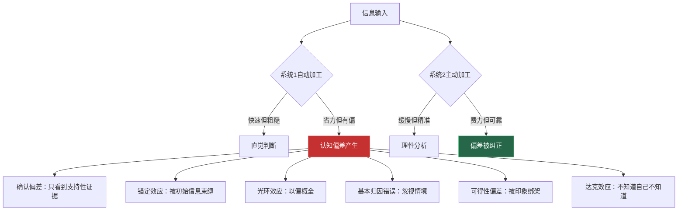
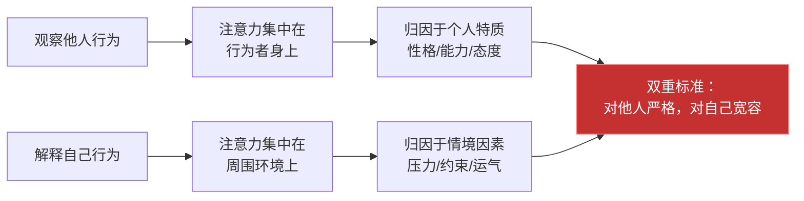
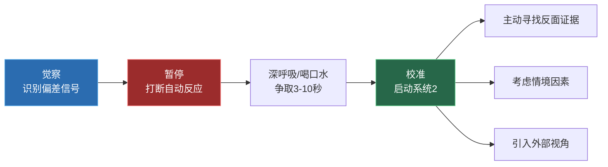

## 二、核心认知偏差

认知偏差是人类思维的系统性偏离。它们不是随机错误，而是大脑在亿万年进化中形成的"快捷方式"——在原始环境中帮助我们快速做出生死攸关的判断，却在现代复杂沟通中频频制造误判。理解这些偏差，是成为沟通高手的必修课。

本节将深入剖析沟通中最常见、影响最深远的六种核心认知偏差：确认偏差、锚定效应、光环效应、基本归因错误、可得性偏差和达克效应。每一种偏差都会从定义、神经机制、沟通表现、真实案例和应对策略五个维度展开，最后讨论偏差之间的相互作用和系统性去偏方法。

### 2.0 认知偏差的系统框架

在逐一讨论具体偏差之前，先建立一个整体框架。认知偏差并非互不相关的独立现象，它们有一个共同的认知根源。



**为什么沟通特别容易触发认知偏差？**

三个原因：

1. **时间压力**。对话是实时的，没有充裕的时间启动系统2思考。当你在会议中被突然提问，系统1会抢先给出答案。
2. **情绪干扰**。沟通天然带有情绪色彩——焦虑、愤怒、期待都会削弱系统2的监控能力。
3. **信息不对称**。你永远无法完全了解对方的真实想法，大脑会自动用偏见填补信息空白。

这意味着：沟通是认知偏差的高发场景，而觉察偏差本身就是一种沟通能力。

---

### 2.1 确认偏差（Confirmation Bias）

#### 2.1.1 定义与本质

确认偏差是指人们倾向于寻找、解释和记忆那些支持自己已有信念的信息，而忽略、低估或排斥与之矛盾的证据。这是所有认知偏差中研究最充分、影响最广泛的一种。

彼得·沃森（Peter Wason）在1960年的经典"2-4-6任务"实验中首次系统证明了这一偏差：参与者被要求猜测一个数字序列的规则，他们得到的初始序列是2、4、6。大多数人猜测规则是"等差递增"并用2、4、6或10、12、14来验证——这些当然符合，但真正的规则只是"三个递增数字"。很少有人尝试用反例（如1、2、3）来证伪自己的假设。人们天然倾向于验证而非证伪。

#### 2.1.2 神经科学机制

确认偏差不是"懒惰"或"不聪明"的结果，它有深层的神经基础：

- **认知节能**。处理一致性信息比处理矛盾信息消耗更少的认知资源。大脑天生倾向于走"低能耗路径"。
- **奖赏回路激活**。神经影像研究（如Klucharev等人2009年的fMRI研究）表明，当人们接收到支持自己观点的信息时，腹侧纹状体（与愉悦感相关的脑区）会被激活。确认自己的信念本质上是一种"认知快感"。
- **认知失调规避**。当面对矛盾信息时，前扣带皮层（负责冲突监测的脑区）会发出警报信号，产生不适感。大脑为了消除这种不适，会选择性地过滤掉矛盾信息。

#### 2.1.3 在沟通中的表现

确认偏差在沟通中有三种典型表现形态：

**选择性倾听**。在对话中，我们无意识地"过滤"信息——只听进支持自己观点的部分。例如，下属向领导汇报项目进展，提到了三个好消息和两个风险。如果领导已经认为这个项目会成功，他事后回忆时可能只记得三个好消息。

**选择性解释**。同样的信息，不同信念的人会做出截然不同的解读。"他说话声音很大"可以被理解为"充满激情"，也可以被理解为"咄咄逼人"——取决于你对这个人的预先判断。

**选择性记忆**。人们更容易记住支持自己观点的对话内容。研究表明，在一场辩论结束后，双方都觉得自己"赢了"，因为他们各自记住了对自己有利的论据。

#### 2.1.4 真实案例

> **案例：管理者的第一印象陷阱**
>
> 张经理在面试时对小李的第一印象很好——名校毕业、表达流利。入职后，张经理不自觉地倾向于关注小李的优点：小李提了一个好建议，张经理在周会上特别表扬；小李犯了一个错误，张经理内心为他找理由——"新人嘛，正常"。
>
> 三个月后，其他同事反映小李在团队协作中有明显问题，张经理的第一反应是"你们不了解他"，直到拿到了具体的数据和多人反馈才开始重新审视。
>
> 这个过程中，确认偏差让张经理花了三个月才看到本该在第一个月就注意到的问题。

#### 2.1.5 应对策略

| 策略 | 具体做法 | 适用场景 |
|------|----------|----------|
| 红队思维 | 刻意扮演"反对者"角色，寻找自己观点的漏洞 | 重要决策前的自我审查 |
| 事前验尸法 | 假设决策已经失败，逆向分析可能的原因 | 项目启动、方案评估 |
| 对立面清单 | 列出3-5条反对自己观点的有力论据 | 形成观点后、发表意见前 |
| 多元信息源 | 主动接触不同立场的信息来源 | 日常信息获取习惯 |
| 第三方视角 | 邀请与议题无关的人提供看法 | 陷入"当局者迷"时 |

**实操练习——"五五验证法"**：

在做出重要沟通决策（如绩效谈话、谈判策略）之前，拿出一张纸，左边写下5条支持你判断的证据，右边写下5条可能推翻你判断的证据。如果右边写不出5条，说明你可能正处于确认偏差中——你需要主动去寻找反面证据，直到能找到5条为止。

---

### 2.2 锚定效应（Anchoring Effect）

#### 2.2.1 定义与本质

锚定效应是指人们在做判断和决策时，会过度依赖最先接收到的信息（即"锚点"），即使这个信息与当前决策无关或质量不高。后续的判断会围绕这个锚点进行"不充分调整"——调整幅度通常远低于应有的程度。

锚定效应由特沃斯基（Tversky）和卡尼曼（Kahneman）在1974年的开创性论文中首次系统描述。他们设计的"联合国中非洲国家比例"转盘实验成为心理学史上最经典的实验之一。

#### 2.2.2 双过程机制

锚定效应涉及两个心理过程，理解它们有助于更好地应对：

**锚定（Anchoring）**：注意力自动聚焦在锚点上。这是一个系统1的自动化过程——你无法阻止自己注意到第一个数字或第一个信息。研究表明，即使被告知锚点是随机生成的，人们仍然会被其影响。

**调整（Adjustment）**：基于锚点进行不充分的修正。这是一个系统2的过程，但通常"不够努力"——人们从锚点出发做调整，但调整到"差不多感觉可以"就停了，而不是调整到真正合理的位置。

#### 2.2.3 沟通中的锚定场景

| 场景 | 锚点来源 | 锚定效应表现 | 影响程度 |
|------|----------|--------------|----------|
| 薪资谈判 | 第一个提出的数字 | 整个谈判围绕该数字波动 | 极高——研究显示先出价方平均多获15% |
| 项目报价 | 初始报价 | 即使后续折扣很小，客户也会觉得"赚了" | 高 |
| 第一印象 | 初次见面的3-7秒 | 后续所有互动都被"初见滤镜"覆盖 | 高 |
| 问题描述 | 问题被呈现的方式 | 同一个问题的两种描述导致截然不同的决策 | 中高 |
| 会议发言 | 第一个发言者的立场 | 后续发言者不自觉地围绕该立场展开讨论 | 中 |

#### 2.2.4 经典实验详解

特沃斯基和卡尼曼的转盘实验设计如下：

参与者被要求转动一个固定在10或65的转盘（实际是实验者控制的伪随机装置），然后回答："联合国中非洲国家的百分比是多少？"

结果令人震惊：
- 转到**10**的人，平均估计为**25%**
- 转到**65**的人，平均估计为**45%**

一个完全无关的随机数字——参与者自己也知道它是随机的——竟然将估计值拉偏了20个百分点。这个实验的力量在于它揭示了锚定效应的顽固性：即使理性告诉你锚点毫无意义，你的直觉判断仍然会被它牵着走。

后续大量研究复制了这一发现。在一项房地产估值实验中，挂牌价格不同（高低相差12%）的同一套房子，专业经纪人的估值平均相差8%。连专家都无法免疫锚定效应。

#### 2.2.5 沟通中的锚定攻防

**主动设锚（进攻策略）**：

在谈判、讨论、说服中，第一个提出数字或框架的一方拥有天然优势。关键原则：
- 激进但合理。锚点应该在你能辩护的范围内尽可能有利于自己。例如薪资谈判中，如果你的合理期望是月薪20K，可以锚定在25K——这足够激进但不至于让对方觉得不靠谱。
- 附带理由。单纯的数字容易被质疑，但一个有理有据的数字更具锚定力。"基于我三年的经验和市场薪资报告，我期望25K"比"我想要25K"更有锚定效果。
- 具体比笼统更强。研究表明，"24,800元"比"25,000元"更有锚定力——具体数字暗示你做了精确计算，对方的调整空间会更小。

**打破锚点（防御策略）**：

当对方先设锚时：
- 识别锚点。意识到"这个数字/框架正在影响我的判断"本身就是防御的第一步。
- 重新基准。主动引入替代锚点——"我不太认同从那个角度来看，让我们换个角度考虑……"
- 做充分准备。了解合理范围后，锚点的影响力会减弱。如果你知道市场薪资范围是18-22K，对方报15K就不会把你拉到低位。
- 暂停后再回应。不要在锚点抛出的瞬间做出反应，给自己时间让系统2介入。

#### 2.2.6 超越数字的锚定

锚定效应不仅限于数字。在沟通中，**概念框架**同样可以成为锚点：

- **语言锚定**："这个项目存在风险"和"这个项目有挑战"是不同的锚点，前者让人更谨慎，后者让人更积极。
- **叙事锚定**：讨论的起点会影响整个对话走向。如果你以"我们面临的问题"开始讨论，团队的注意力会聚焦在问题上；如果以"我们拥有的机会"开始，讨论重心会转向可能性。
- **情感锚定**：对话开始时的情绪基调会锚定整个沟通氛围。一场以抱怨开头的会议，很难在中途转向积极讨论。

---

### 2.3 光环效应（Halo Effect）

#### 2.3.1 定义与本质

光环效应是指人们对某人某一方面的正面（或负面）评价，会扩散到对其其他方面的评价上。这个概念最早由心理学家爱德华·桑代克（Edward Thorndike）在1920年提出——他发现军队评估者会因为士兵的外表吸引力而高估其智力、领导力和体能。

光环效应的本质是认知捷径：当我们缺乏关于某人各方面的完整信息时，大脑会用已知的一个维度"推断"其他维度。这在进化上有其合理性（健康→力量→生存能力），但在现代沟通中却频繁导致误判。

#### 2.3.2 光环效应的几种类型

| 类型 | 触发条件 | 表现 | 常见场景 |
|------|----------|------|----------|
| 外貌光环 | 外表吸引力高 | 被认为更聪明、更可信、更有能力 | 求职面试、销售、社交 |
| 职位光环 | 社会地位或职位高 | 其观点被认为更有价值、更正确 | 会议讨论、专家咨询 |
| 相似性光环 | 与自己有共同点 | 被认为更可靠、更值得信赖 | 团队组建、社交选择 |
| 首因光环 | 第一印象良好 | 后续缺点被忽视或合理化 | 新员工评估、恋爱初期 |
| 品牌光环 | 知名机构/公司出身 | 能力被默认高估 | 招聘、合作评估 |
| 负面光环 | 某一方面的负面印象 | 导致全面否定其能力或品质 | 犯错后的评估、政治判断 |

#### 2.3.3 深度案例

> **案例：名校光环与评估盲区**
>
> 某互联网公司招聘高级产品经理时，面试官王总监遇到了两位候选人：
>
> 候选人A：名校MBA，曾在知名企业任职，面试时表达流畅、PPT精美。王总监对A的第一印象非常好，在随后的面试中，问题都围绕"A的能力有多强"展开，而非客观评估。
>
> 候选人B：普通本科，创业公司背景，面试时表达略显紧张，但回答问题的深度和对用户洞察的敏锐度明显高于A。
>
> 结果：A被录用，B被淘汰。
>
> 入职后，A的表现远低于预期——PPT做得好但缺乏产品直觉，表达流利但决策质量不高。王总监后来反思："我被他的背景光环绑架了。面试时我问A的问题都是在验证他很优秀，而不是在测试他是否真的适合这个岗位。"
>
> **反思要点**：光环效应最危险的地方不是让你犯错，而是让你意识不到自己在犯错——因为一切都"看起来很对"。

#### 2.3.4 应对策略

**结构化评估法**：

用预先设定的评估维度和标准替代整体印象。具体做法：
1. 在面试、评估、选择之前，先列出你要评估的具体维度（如：专业能力、沟通能力、团队协作、抗压能力）。
2. 为每个维度设定独立的评分标准。
3. 在评估过程中，逐个维度独立打分，不要让一个维度的分数影响其他维度。
4. 所有维度打完分后，再进行综合判断。

**多人独立评估法**：

让多人分别独立评估同一个人，然后再汇总。研究显示，独立评估后的汇总意见比集体讨论更准确，因为集体讨论中光环效应强的人会影响其他人的判断。

**"反面证据"清单**：

在形成对某人的正面（或负面）印象后，主动列出至少3条与该印象矛盾的证据。如果你对某人印象很好，去找他的3个缺点；如果印象很差，去找他的3个优点。这能有效削弱光环效应的影响。

---

### 2.4 基本归因错误（Fundamental Attribution Error）

#### 2.4.1 定义与本质

基本归因错误是指在解释他人行为时，人们过度强调个人特质因素（性格、能力、态度），而低估情境因素（环境、压力、约束）的影响。与此同时，人们在解释自己的行为时，恰恰相反——倾向于将原因归于情境而非自身特质。

这种"观察者-行动者"的不对称归因模式，由社会心理学家李·罗斯（Lee Ross）在1977年正式命名，被认为是社会心理学中最重要的发现之一。

#### 2.4.2 为什么叫"基本"归因错误

"基本"（fundamental）有两层含义：
1. **普遍性**：这种错误是跨文化、跨年龄、跨情境的，几乎所有人都会犯。
2. **根源性**：它影响的不是某个具体判断，而是我们理解人类行为的基本方式——它是一种"元偏差"，会引发其他连锁误判。

#### 2.4.3 归因不对称的深层机制



**视觉注意力差异**：当你看别人时，你的视线聚焦在"人"身上——他/她的表情、动作、言语成为注意力的主体，环境因素退为背景。当你回顾自己的行为时，你的注意力聚焦在"当时的情况"——压力、资源限制、信息不足成为主要因素。

**信息可得性差异**：你了解自己的完整历史——知道自己在不同情境下的行为是不同的，所以会考虑情境变量。但你对他人通常只有有限的几次观察，样本太小，无法区分"这个人在不同情境下的行为差异"，于是将行为归结为稳定的个人特质。

#### 2.4.4 沟通中的归因偏差矩阵

| 情境 | 常见的特质归因（偏差） | 可能的情境归因（更准确） | 归因方式对沟通的影响 |
|------|----------------------|------------------------|---------------------|
| 同事开会迟到 | "不尊重他人的时间" | 交通堵塞/家里有急事/会议通知不清楚 | 特质归因→指责语气→防御性回应→关系恶化 |
| 下属报告出错 | "能力不足/粗心大意" | 资源不足/信息不全/时间过于紧迫 | 特质归因→下属感到不被理解→士气低落 |
| 伴侣忘记纪念日 | "不重视这段感情" | 工作压力大/近期内存负荷过重/不同的情感表达方式 | 特质归因→情感伤害→亲密关系裂痕 |
| 客户态度恶劣 | "素质低/故意刁难" | 正经历困难时期/之前的服务体验留下的创伤 | 特质归因→服务态度变差→客户关系破裂 |
| 孩子成绩下滑 | "不用功/太贪玩" | 校园欺凌/心理健康问题/学习方法不当 | 特质归因→批评惩罚→孩子关闭沟通通道 |

#### 2.4.5 文化差异的启示

一个有趣的发现：基本归因错误在不同文化中的强度不同。

约瑟夫·亨利希（Joseph Henrich）等人的跨文化研究表明，东亚文化中的个体相对较少犯基本归因错误。这与文化差异有关：
- **个人主义文化**（如美国）强调个体的独特性和内在特质，更容易将行为归因于个人。
- **集体主义文化**（如中国、日本）强调情境和关系的重要性，更倾向于考虑环境因素。

但需要注意："较少犯"不等于"不犯"。在高压、疲劳或情绪激动时，任何文化背景的人都可能退回到特质归因模式。

#### 2.4.6 应对策略

**"情境优先"三步法**：

第一步：注意到自己的归因冲动——"我又在给人贴标签了"。

第二步：强制要求自己先列出至少3个情境因素——"在假设这是他的性格问题之前，先想想有没有环境原因"。

第三步：如果可能，直接询问对方——"我想了解一下，当时是什么情况？"给对方解释的机会。

**角色互换测试**：

在评判他人行为之前，诚实地问自己："如果我在完全相同的情境下，面对同样的约束和压力，我一定会做出不同的行为吗？"答案通常是"不确定"——这种不确定性就是你修正归因的空间。

**"行为-情境"双栏笔记**：

当你对某人形成强烈判断时，拿出纸笔画两列：

| 你观察到的行为 | 可能的情境因素 |
|--------------|---------------|
| 他没有回复我的消息 | 他可能正在开会/他可能需要时间思考如何回复/他可能没看到 |
| 她在会议上否定了我的方案 | 她可能看到了我没看到的风险/她可能压力很大/她可能对事不对人 |

这种简单的练习可以显著减少基本归因错误的影响。

---

### 2.5 可得性偏差（Availability Bias）

#### 2.5.1 定义与本质

可得性偏差是指人们倾向于根据信息在记忆中的"容易获得程度"来判断事件发生的概率或频率。简单说：越容易想到的事情，越被认为经常发生。

特沃斯基和卡尼曼在1973年的论文中指出，当人们被问及"英语中以K开头的单词多，还是K作为第三个字母的单词多"时，大多数人回答前者。实际上后者是前者的三倍。但以K开头的单词（如king、kitchen）更容易被回忆起来，因此被高估了频率。

#### 2.5.2 影响可得性的因素

信息在记忆中的"可得性"受四个因素影响：

1. **情绪强度**：情绪强烈的事件更容易被回忆。一次激烈的争吵比十次平静的对话更容易留在记忆中。
2. **时间近度**：最近发生的事件比很久以前的事件更容易被回忆（近因效应）。
3. **重复频率**：被反复提及或接触的信息更容易被激活。媒体反复报道的事件会被高估发生概率。
4. **叙事生动性**：有故事、有细节、有画面感的信息比抽象数据更容易被记住。

#### 2.5.3 沟通中的可得性偏差

**风险评估失真**：

人们倾向于高估生动、有画面感的风险，而低估抽象、统计性的风险。例如：
- 很多人害怕坐飞机（空难画面太震撼），但开车通勤的风险实际上远高于飞行。
- 在团队中，一次严重的安全事故会让所有人长期过度谨慎，即使统计数据显示安全水平已经很高。

**沟通评价偏差**：

我们对他人的评价往往不是基于其行为的总体统计，而是基于最容易回忆的几次互动。这就是为什么：
- 一次严重的冲突会覆盖之前所有的愉快交流，导致你认为"和这个人总是合不来"。
- 一次超常的精彩表现会让领导长期高估某人的能力（与光环效应叠加）。
- 近期的表现比远期的表现对评价的影响更大——绩效评估中存在严重的"近因效应"。

**决策中的案例效应**：

一个生动的案例在说服力上往往胜过大量的统计数据。在会议上，讲一个"上个月客户投诉的故事"比展示"客户满意度下降3%"更能引发行动。这不是因为案例更准确，而是因为它更容易被记住和传播。

#### 2.5.4 应对策略

| 策略 | 具体做法 |
|------|----------|
| 基率思维 | 养成先问"总体概率是多少"再考虑具体案例的习惯 |
| 数据锚定 | 在做重要判断时，强制自己查阅客观数据，而非依赖直觉 |
| 样本意识 | 问自己"我的判断基于多少次观察？样本是否有代表性？" |
| 情绪校准 | 意识到"这件事让我印象深刻"不等于"这件事经常发生" |
| 多元记忆 | 刻意回忆与当前判断方向不同的经历 |

**沟通实操——"十次回忆法"**：

当你对某人形成一个总体印象（如"他很难合作"）时，尝试回忆与这个人的10次互动——不是最容易想到的那几次，而是尽可能完整的10次。你可能会发现，让你印象深刻的那2-3次负面互动并不代表常态，其余7-8次可能是正常甚至正面的。

---

### 2.6 达克效应（Dunning-Kruger Effect）

#### 2.6.1 定义与本质

达克效应是指能力较低的人倾向于高估自己的能力水平，而能力较高的人反而倾向于低估自己。这不是自大或谦虚的个性差异，而是一种系统性的认知偏差：评估能力需要的能力，恰恰是你可能缺乏的能力。

大卫·邓宁（David Dunning）和贾斯汀·克鲁格（Justin Kruger）在1999年的论文中首次描述了这一现象。他们发现，在逻辑推理、语法、幽默感等测试中，表现最差的25%的参与者平均高估了自己的能力约50个百分点。

#### 2.6.2 认知机制

达克效应有一个精巧的逻辑：

```mermaid
graph TD
    A[判断自己<br/>是否擅长X] --> B[需要了解<br/>什么是"擅长X"]
    B --> C[需要具备<br/>X领域的专业知识]
    C --> D{你是否具备<br/>足够的X知识?}
    D -->|是| E[你能准确评估自己<br/>→倾向于谦虚]
    D -->|否| F[你缺乏评估标准<br/>→倾向于高估]

    style F fill:#c53030,stroke:#fc8181,color:#fff
    style E fill:#276749,stroke:#68d391,color:#fff
```

换言之：**你不知道自己不知道什么**。一个沟通能力差的人，往往缺乏判断"什么是好的沟通"的标准，因此无法识别自己的不足。

#### 2.6.3 沟通中的达克效应

达克效应在沟通领域的表现尤为普遍，因为沟通能力的评估不像考试成绩那样有明确的数字标准：

**"我觉得我说得很清楚"综合症**：表达者认为自己已经解释得很清楚了（高估了自己的表达清晰度），但听者实际上一头雾水。达克效应让表达者无法意识到自己的表达存在问题。

**"我沟通能力没问题"盲区**：研究表明，大多数人都认为自己的沟通能力高于平均水平——这在统计上是不可能的。自我报告的沟通能力与他人评估之间的相关性通常很弱。

**"专家的谦逊"现象**：真正的沟通高手反而更清楚自己在哪些场景下沟通不好——他们知道沟通有多复杂，有多少变量需要考虑。这种"无知之知"是专业成熟的标志。

#### 2.6.4 达克效应的四个阶段

邓宁本人将能力发展划分为四个阶段：

| 阶段 | 自我评估 | 实际能力 | 特征 |
|------|----------|----------|------|
| 第一阶段：无知自信 | 极高 | 极低 | "这个很简单，我完全没问题" |
| 第二阶段：意识到差距 | 急剧下降 | 上升中 | "原来有这么多我不知道的" |
| 第三阶段：刻意学习 | 偏低 | 中等偏上 | "我还有很多要学的" |
| 第四阶段：精通 | 回归准确 | 高水平 | "我知道自己知道什么、不知道什么" |

第二阶段到第三阶段的"谷底期"是最危险的——很多人在这个阶段因为自我怀疑而放弃。理解这是正常的学习曲线，有助于坚持下去。

#### 2.6.5 应对策略

**寻求外部反馈**：

当你认为自己沟通能力没问题时，这是最需要外部反馈的时候。具体做法：
- 在重要沟通后主动询问对方："我刚才说清楚了吗？有没有什么地方让你觉得困惑？"
- 建立信任的反馈伙伴——定期互相给予关于沟通表现的真实反馈。
- 录音回听自己的一次重要对话（如会议发言、电话沟通），自己评价表达质量和倾听质量。

**"能力清单"自评法**：

列出沟通能力的细分维度（如：倾听质量、表达清晰度、情绪管理、冲突处理、说服能力），逐一诚实评分。大多数人会发现自己在某些维度上强，在另一些维度上明显弱。这种细分评估能有效对抗"我觉得我沟通不错"的笼统错觉。

**与标杆对比**：

找到你认为沟通能力很强的人，仔细观察他们在一个具体场景中是怎么做的，然后对比自己在类似场景中的做法。差距的发现是对抗达克效应的最佳药方。

---

### 2.7 偏差间的相互作用

上述六种认知偏差不是孤立存在的，在真实沟通中它们常常相互叠加、相互强化，形成"偏差链"。

```mermaid
graph TD
    A[确认偏差] -->|强化| B[光环效应]
    B -->|触发| C[基本归因错误]
    C -->|加剧| A

    D[锚定效应] -->|配合| A
    E[可得性偏差] -->|为确认偏差<br/>提供"证据"| A
    F[达克效应] -->|阻止觉察| A
    F -->|阻止觉察| B
    F -->|阻止觉察| C

    style A fill:#c53030,stroke:#fc8181,color:#fff
    style F fill:#9b2c2c,stroke:#fc8181,color:#fff
```

**偏差链示例**：

1. 你对某人形成了好的**第一印象**（锚定效应）。
2. 这个好的第一印象形成了**光环效应**，让你倾向于认为他各方面都优秀。
3. **确认偏差**开始运作——你只注意到他做得好的地方，忽视或合理化他的不足。
4. 当他确实犯错时，你用**情境归因**为他开脱（"是环境的问题"），而如果其他人犯同样的错，你会用**特质归因**（"是能力问题"）——基本归因错误的不对称。
5. 你的**可得性记忆**中充满了对他的正面互动，进一步巩固了正面印象。
6. 你从未意识到自己的判断已经严重偏离了客观事实——因为**达克效应**让你对自己"看人很准"充满信心。

这就是为什么一个人的"第一印象"可以顽固地持续数年，即使有大量反面证据。偏差链形成了一个自我强化的闭环，外部力量很难打破。

**打破偏差链的关键介入点**：

- **最高效的切入点**是觉察达克效应——承认"我的判断可能是错的"是一切改变的前提。
- **最有力的工具**是引入结构化评估——用客观标准替代直觉判断。
- **最实际的习惯**是定期寻求外部反馈——他人的视角可以打破你自己的偏差闭环。

---

### 2.8 系统性去偏方法

单独应对每一种偏差是不够的。在真实的沟通场景中，偏差是同时发生、相互作用的。因此，需要一套系统性的"去偏"（debiasing）方法。

#### 2.8.1 觉察-暂停-校准三步法



**觉察**（Awareness）：识别偏差正在发生的信号。以下列表帮助你快速定位：

| 偏差信号 | 可能触发的偏差 | 快速应对 |
|----------|---------------|----------|
| "我就知道他是这样的人" | 确认偏差 + 光环效应 | 要求自己举出反例 |
| "第一次见面我就觉得他不靠谱" | 锚定效应 + 负面光环 | 用后续具体行为重新评估 |
| "他迟到就是因为不尊重我" | 基本归因错误 | 想3个情境原因 |
| "最近总听到这类问题" | 可得性偏差 | 查看客观统计数据 |
| "这事儿很简单，没必要想那么多" | 达克效应 | 问一个专家的意见 |

**暂停**（Pause）：打断系统1的自动反应。具体技巧：
- 深呼吸一次（约3-5秒），足以让系统2开始介入。
- 喝一口水——物理动作中断思维惯性。
- 说"让我想想"——给自己争取思考时间，同时降低对方的期待。

**校准**（Calibrate）：启动系统2进行理性分析。关键问题：
- "我有没有只看到支持自己观点的证据？"（确认偏差）
- "我的判断是否被第一个信息过度影响了？"（锚定效应）
- "我是不是在用一个方面的印象推断其他方面？"（光环效应）
- "我是否忽略了情境因素？"（基本归因错误）
- "我想到的'证据'是否有代表性？"（可得性偏差）
- "我对这件事的判断有多大的把握？我的把握依据是什么？"（达克效应）

#### 2.8.2 日常训练方案

觉察认知偏差是一种技能，需要刻意练习。以下是一个四周训练方案：

| 周次 | 训练重点 | 每日练习 |
|------|----------|----------|
| 第一周 | 确认偏差觉察 | 每天对一个重要观点，主动寻找1条反面证据并记录 |
| 第二周 | 归因校准练习 | 每天对1次他人的负面行为，列出至少2个情境原因 |
| 第三周 | 锚点识别练习 | 每天识别1个正在影响你判断的"锚点"（数字/印象/框架） |
| 第四周 | 综合去偏练习 | 每天选1次重要沟通，用"觉察-暂停-校准"三步法复盘 |

每周结束后，回顾自己的练习记录，评估进步和困难点。

#### 2.8.3 团队层面的去偏机制

个人去偏有其局限性——你很难揪着自己的头发把自己提起来。在团队中，可以通过制度设计来集体去偏：

- **魔鬼代言人**制度：在重大决策会议上，指定一人专门负责质疑主流观点。研究表明，即使是"装出来的反对"也能显著减少确认偏差。
- **匿名意见收集**：在集体讨论之前先匿名收集每个人的看法，避免第一个发言者的锚定效应影响所有人。
- **预设评估标准**：在面试、绩效评估等场景中，预先确定评估维度和标准，所有人使用同一套标准独立评估。
- **事后复盘**：定期回顾重要决策，分析当初的判断是否受到了认知偏差的影响。这种事后反思本身就是一种去偏训练。

---

### 本节核心要点

| 偏差名称 | 一句话本质 | 沟通中的核心危害 | 最有效的应对 |
|----------|-----------|-----------------|-------------|
| 确认偏差 | 只看到想看的 | 闭目塞听，错过关键信息 | 主动寻找反面证据 |
| 锚定效应 | 被第一个信息绑架 | 谈判和判断被锚点主导 | 充分准备 + 主动设锚 |
| 光环效应 | 以偏概全 | 被第一印象或单一特征蒙蔽 | 结构化评估 + 多人独立判断 |
| 基本归因错误 | 对人不对事 | 给人贴标签，破坏关系 | 情境优先 + 角色互换 |
| 可得性偏差 | 被印象绑架判断 | 用少数案例代替统计数据 | 基率思维 + 数据锚定 |
| 达克效应 | 不知道自己不知道 | 无法识别自身问题 | 寻求外部反馈 + 标杆对比 |

认知偏差不是性格缺陷，而是人类大脑的固有特征。你无法"消灭"偏差，但可以通过觉察和练习，将其影响降到最低。下一节将探讨另一种深刻影响沟通的心理力量——情绪智力的高级应用。

***
