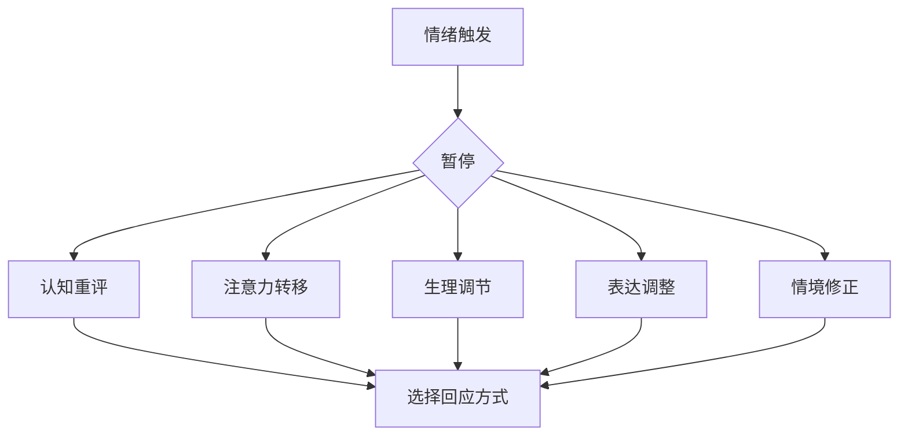
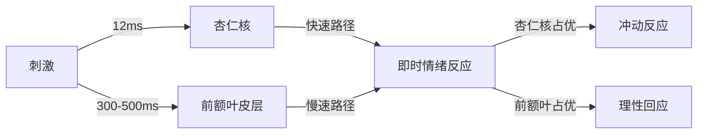

## 三、情绪智力的高级应用

情绪智力（Emotional Intelligence，简称 EI 或 EQ）是沟通能力的底层操作系统。智商决定你能理解什么，情商决定你能影响谁。在高阶沟通中，技术性技巧只是表层，真正拉开差距的是对情绪信号的捕捉、解读和驾驭能力。本章从神经科学基础出发，系统拆解情绪智力的四个维度，并提供可落地的训练方法和应用场景。

### 3.1 情绪智力的四维模型

丹尼尔·戈尔曼（Daniel Goleman）在 1995 年提出的情绪智力框架，将 EQ 划分为四个核心维度。这不是四个独立的能力，而是一个层层递进的系统——自我觉察是基石，自我调节是能力，社会觉察是外延，关系管理是产出。

#### 3.1.1 自我觉察（Self-Awareness）

自我觉察是情绪智力的起点，指能够准确识别自己当下的情绪状态、理解情绪的来源、以及认识到情绪对思维和行为的影响。

**核心能力：**

| 能力层级 | 表现 | 反面表现 |
|---------|------|---------|
| 情绪识别 | 能准确命名当前情绪（如"我现在感到焦虑，因为截止日期临近"） | 只能笼统地说"我不舒服"或"心情不好" |
| 情绪溯源 | 能追溯情绪的触发因素和演变过程 | 不知道情绪从何而来，被情绪牵着走 |
| 自我评估 | 客观认识自身优势和局限，不自大也不自卑 | 过度自信或过度自卑，对反馈产生防御反应 |
| 自信感 | 基于真实能力的稳定自我价值感 | 依赖外部评价来确认自我价值 |

**自我觉察的三个层次：**

1. **生理层**：注意到情绪引发的身体信号——心跳加速、肌肉紧张、呼吸变浅、胃部不适。这些是情绪的"早期预警系统"。
2. **认知层**：识别伴随情绪出现的思维模式——灾难化想法（"完了，全毁了"）、非黑即白思维（"要么完美要么不做"）、读心术（"他一定觉得我很蠢"）。
3. **行为层**：觉察情绪驱动下的行为倾向——愤怒时想攻击、焦虑时想回避、悲伤时想退缩。

**实操工具——情绪日志法：**

每天花 5 分钟记录以下内容，持续 21 天可显著提升自我觉察：

时间：____
情绪事件：发生了什么？
情绪名称：我感到____（尽量精确，用"挫败"而非"不爽"）
情绪强度：1-10 分
身体反应：我的身体____
自动化想法：我脑中出现了____的想法
行为倾向：我想要____

#### 3.1.2 自我调节（Self-Regulation）

自我调节不是压抑情绪，而是选择如何回应情绪。神经科学研究表明，强行压抑情绪反而会增强情绪的强度和持续时间（Wegner 的"白熊效应"）。真正的自我调节是"有觉察的选择"。

**自我调节的五个策略：**

1. **认知重评（Cognitive Reappraisal）**：重新解读事件的意义。同事当众质疑你的方案 → 不是"他故意让我难堪"，而是"他对这个方案有不同看法，这可能帮助我改进"。这是最有效的调节策略，能从根源改变情绪反应。

2. **注意力转移（Attentional Deployment）**：在情绪高峰期，有意识地将注意力转向中性或积极的刺激。不是逃避，而是给自己一个缓冲空间。

3. **生理调节（Physiological Regulation）**：通过呼吸、运动等手段直接调节自主神经系统。4-7-8 呼吸法（吸气 4 秒，屏息 7 秒，呼气 8 秒）能在 90 秒内降低皮质醇水平。

4. **表达调整（Response Modulation）**：在情绪反应已经产生后，调整外在表达方式。不是伪装，而是选择合适的时机、方式和强度来表达。

5. **情境修正（Situation Modification）**：主动改变引发负面情绪的环境因素。如果深夜看手机让你焦虑，就把手机放到另一个房间。

#### 3.1.3 社会觉察（Social Awareness）

社会觉察是将觉察力从自身延伸到他人和群体，核心是共情能力。

**共情的三种类型：**

| 类型 | 定义 | 示例 | 常见误区 |
|------|------|------|---------|
| 认知共情 | 理解他人的想法和视角 | "我能理解你为什么会这样想" | 变成冷冰冰的分析，缺乏温度 |
| 情感共情 | 感受他人的情绪状态 | "我能感受到你现在很沮丧" | 过度卷入他人情绪，失去边界 |
| 共情关怀 | 基于理解产生帮助的意愿 | "我想帮你找到解决办法" | 变成"拯救者情结"，越俎代庖 |

**高效共情的 STAR 模型：**

- **S（Sense 感知）**：通过语言线索（用词、语速、音量）和非语言线索（表情、姿态、呼吸）感知对方的情绪状态。
- **T（Think 思考）**：结合对方的处境、性格和历史，推断情绪的可能原因。避免"读心术"——你的推测需要通过下一步验证。
- **A（Ask 确认）**：用开放性问题验证你的感知。"我注意到你刚才停顿了一下，是不是有什么顾虑？"比"你是不是不高兴了"更精准。
- **R（Respond 回应）**：给出匹配对方需求的回应。有时需要情感支持（"这确实很难"），有时需要实际帮助（"我能做什么"），有时只需要陪伴（"我在听"）。

#### 3.1.4 关系管理（Relationship Management）

关系管理是将前三项能力转化为实际的人际影响力。这是情绪智力的"输出端"。

**关系管理的核心技能：**

1. **影响力**：不是操控，而是基于理解和信任的引导。理解对方的情绪需求 → 用对方能接受的方式传递信息 → 达成共识。
2. **冲突管理**：将冲突视为信息而非威胁。冲突的本质是需求不匹配，管理冲突的关键是识别并回应双方的核心需求。
3. **团队催化**：感知团队的情绪氛围，在低落时提振士气，在紧张时缓解压力，在分歧时促进对话。
4. **发展他人**：通过共情式反馈帮助他人成长。先理解对方的感受，再提供有针对性的建议。

### 3.2 情绪的神经科学基础

理解情绪的生理机制，是高级情绪管理的前提。你无法管理你不理解的东西。

#### 3.2.1 杏仁核——情绪的哨兵

杏仁核（Amygdala）是大脑颞叶深处的杏仁状结构，负责处理情绪信息，尤其是恐惧和威胁相关的信号。

**关键机制——"杏仁核劫持"（Amygdala Hijack）：**

当感知到威胁时，杏仁核能在约 12 毫秒内启动"战斗-逃跑-僵住"反应，这个速度远快于前额叶皮层的认知处理（需要 300-500 毫秒）。在紧急情况下这能救命，但在日常沟通中，这会导致你做出过度反应。

**识别杏仁核劫持的信号：**

- 突然的情绪爆发，强度与情境不成比例
- 事后觉得"我当时怎么了"
- 身体出现强烈反应：脸红、心跳加速、手心出汗、声音发抖
- 思维变窄，只想攻击、逃跑或僵住

**6 秒法则**：杏仁核引发的神经化学物质在体内持续约 6 秒。当你感到被"劫持"时，给自己至少 6 秒的缓冲——深呼吸、数数、喝口水。这 6 秒能让前额叶皮层"上线"，夺回控制权。

#### 3.2.2 前额叶皮层——情绪的指挥官

前额叶皮层（Prefrontal Cortex，PFC）是大脑的"执行控制中心"，负责计划、决策、冲动控制和情绪调节。它与杏仁核形成一种"刹车-油门"关系。

**关键事实：**

- 前额叶皮层到 25 岁左右才完全成熟，这是年轻人情绪调节能力较弱的神经学原因。
- 睡眠不足、压力过大、酒精等会削弱前额叶功能，使人更容易情绪失控。
- 正念冥想等训练可以增强前额叶皮层对杏仁核的调控能力，这种改变可在 8 周的持续训练后通过脑成像观察到。

#### 3.2.3 镜像神经元——共情的硬件基础

1990 年代，意大利帕尔马大学的研究者在猕猴大脑中发现了镜像神经元（Mirror Neurons）：当猴子自己做某个动作和观察别人做同样动作时，同一批神经元都会放电。

**对沟通的启示：**

- **情绪传染**：我们会在无意识中"镜像"他人的情绪状态。和焦虑的人待久了自己也会焦虑，和积极的人在一起会更有动力。
- **模仿与信任**：适度模仿对方的肢体语言和语速能激活镜像神经元系统，促进信任感的建立（"变色龙效应"）。
- **共情的自动性**：共情不是纯粹的认知活动，而是有神经生理基础的自动过程。这解释了为什么看别人受伤时我们自己也会"疼"。

#### 3.2.4 神经可塑性——情绪智力可以训练

一个好消息是：大脑不是固定的硬件。神经可塑性（Neuroplasticity）意味着重复的练习可以改变神经回路的结构和功能。

**有科学依据的训练方法：**

| 方法 | 机制 | 训练周期 | 效果量 |
|------|------|---------|--------|
| 正念冥想 | 增强前额叶对杏仁核的调控 | 8 周（每天 20 分钟） | 杏仁核灰质密度降低，前额叶活动增强 |
| 情绪标注 | 激活前额叶，降低杏仁核活动 | 即时生效 | 情绪强度降低约 30% |
| 认知重评练习 | 建立新的神经通路 | 4-6 周 | 负面情绪持续时间缩短 |
| 社交技能训练 | 强化镜像神经元网络 | 6-12 周 | 共情准确性提升 |

### 3.3 情绪在沟通中的功能

情绪不是沟通的"噪音"，而是核心信号。试图在沟通中"去掉情绪"，就像试图在开车时去掉仪表盘。

#### 3.3.1 四大功能详解

**信息功能**：情绪是关于自身需求和状态的实时报告。愤怒通常意味着边界被侵犯，焦虑意味着对未来的不确定性，悲伤意味着失去或分离。在沟通中，读懂对方的情绪就读懂了对方未说出口的需求。

**动机功能**：情绪是最强大的行动驱动力。恐惧驱动回避，兴奋驱动探索，内疚驱动补偿，自豪驱动重复。说服一个人做事，触动情绪比罗列道理有效 3-5 倍（Damasio 的躯体标记假说）。

**社会功能**：情绪是人际关系的粘合剂。共同的情绪体验（一起笑、一起紧张、一起感动）会促进催产素分泌，增强人际联结。在沟通中，适当地展示真实情绪比完美表演更能赢得信任。

**适应功能**：情绪帮助我们快速评估环境并做出反应。在沟通中，对氛围的敏感度直接影响你的适应能力——什么时候该推进、什么时候该退让、什么时候该换个话题。

#### 3.3.2 情绪颗粒度——区分情绪的能力

情绪颗粒度（Emotional Granularity）是指能够精确区分和命名不同情绪的能力。研究表明，情绪颗粒度越高的人，情绪调节能力越强。

**低颗粒度 vs 高颗粒度：**

| 低颗粒度表达 | 高颗粒度表达 |
|------------|------------|
| "我很不爽" | "我感到被忽视，因为我提的建议没有得到回应" |
| "压力很大" | "我对这个项目的不确定性感到焦虑，同时对截止日期感到紧迫" |
| "他让我很生气" | "他打断我说话的行为让我感到不被尊重，这触发了我的挫败感" |

**提升情绪颗粒度的练习：**

使用"情绪轮盘"（Plutchik's Wheel of Emotions）来扩展你的情绪词汇。Plutchik 将基本情绪定义为 8 种（快乐、信任、恐惧、惊讶、悲伤、厌恶、愤怒、期待），每种情绪有不同强度，且可以组合形成复合情绪。

基础情绪 → 强度变化 → 复合情绪
愤怒：烦躁 → 愤怒 → 暴怒
     + 厌恶 → 轻蔑
恐惧：不安 → 恐惧 → 恐慌
     + 惊讶 → 敬畏
悲伤：忧郁 → 悲伤 → 悲痛
     + 厌恶 → 懊悔

### 3.4 高阶情绪调节技术

#### 3.4.1 RAIN 四步法

RAIN 是由心理学家 Tara Brach 推广的情绪调节框架，特别适用于强烈情绪的当下处理：

- **R（Recognize 识别）**：注意到"有什么情绪出现了"。用一种温和的好奇心，像观察天气变化一样观察自己的情绪。
- **A（Allow 允许）**：允许情绪存在，不试图推开它。"焦虑在这里，我可以和它共处。"这一步打破了"感到焦虑 → 对焦虑感到焦虑"的恶性循环。
- **I（Investigate 探究）**：带着善意探究情绪。"这个情绪想告诉我什么？它在我身体的哪个部位？它有什么样的质感？"
- **N（Non-Identification 不认同）**：认识到"我有焦虑"不等于"我是焦虑的人"。情绪是暂时的心理事件，不是你的身份。

#### 3.4.2 情绪标签法（Affect Labeling）

UCLA 的 Matthew Lieberman 的 fMRI 研究发现：给情绪贴标签（"我现在感到愤怒"）能显著降低杏仁核的活动水平。这被称为"命名即驯服"（Name it to tame it）效应。

**在沟通中的应用：**

- 对自己：在回应前先在心里标注自己的情绪——"我注意到我现在很防御"。
- 对他人：用观察式语言标注对方的情绪——"我感觉到你对这个决定有些担忧"。这会让对方感到被理解，同时帮助对方自己理清情绪。

#### 3.4.3 生理锚定技术

当情绪过于强烈以至于认知策略失效时，从身体入手更有效：

1. **5-4-3-2-1 感官着陆**：看到 5 样东西、触摸 4 样东西、听到 3 种声音、闻到 2 种气味、尝到 1 种味道。这能将注意力从情绪拉回到当下。
2. **交叉按压**：双手交叉放在对侧肩膀上，交替轻拍，节奏约为每秒一次。这激活了双侧刺激，有助于平复强烈情绪（EMDR 原理简化版）。
3. **冷水刺激**：用冷水冲洗手腕或面部。这会触发"潜水反射"，激活副交感神经系统，快速降低心率。

### 3.5 情绪智力在不同沟通场景的应用

#### 3.5.1 高压谈判

在谈判中，情绪智力不是"温柔"，而是战略优势。

- **识别对方的情绪锚点**：对方反复提到的词、音量突然变化的地方、身体前倾的时刻——这些是对方情绪投入最高的议题。
- **管理自己的情绪泄露**：你的非语言信号会暴露你的底牌。练习"扑克脸"不是面无表情，而是保持与当前立场一致的表情。
- **战略性情绪展示**：适度展示愤怒可以传达底线（"最后通牒效应"），适度展示失望可以引导让步。但过度使用会破坏信任。

#### 3.5.2 难以对话（Crucial Conversations）

当话题敏感、意见分歧、情绪激烈时，情绪智力是防止对话崩溃的安全网。

**关键原则：**

1. **从心开始**：进入对话前明确你真正想要什么——不是"赢"，而是"解决问题并维护关系"。
2. **营造安全感**：当对方感到不安全时，大脑会进入防御模式，理性对话不可能发生。安全感 = 相互尊重 + 共同目的。
3. **双路监测**：同时监测对话内容（"我们在讨论什么"）和对话氛围（"我们现在的感受如何"）。当氛围恶化时，先修复氛围再回到内容。

#### 3.5.3 反馈与批评

给出批评和接受批评，是情绪智力的终极考验。

**给批评时的 EASE 模型：**

- **E（Empathy 共情先行）**：先理解对方的处境和感受。"我知道你在这个项目上投入了很多精力。"
- **A（Action 聚焦行为）**：批评具体行为，不评判人格。"这份报告缺少数据分析部分"而非"你做事不认真"。
- **S（Specific 具体明确）**：给出可操作的改进建议。"可以加入 Q1-Q3 的对比数据和用户反馈的定量分析"。
- **E（Encourage 鼓励收尾）**：表达对对方能力的信心。"以你的分析能力，补充这些内容后会是一份很出色的报告"。

**接受批评时的自我调节：**

1. 生理层面：注意防御反应（心跳加速、想打断对方），用呼吸稳住自己。
2. 认知层面：区分"批评内容"和"批评方式"。即使对方方式不好，内容中可能有有价值的信息。
3. 行为层面：先感谢，再询问细节，最后决定是否采纳。"谢谢你告诉我这些，能具体说说哪个部分吗？"

### 3.6 情绪智力的测评与提升路径

#### 3.6.1 主流测评工具

| 工具名称 | 开发者 | 测量方式 | 特点 |
|---------|--------|---------|------|
| EQ-i 2.0 | Reuven Bar-On | 自评问卷，33 题 | 应用最广泛，有职场常模 |
| MSCEIT | Mayer, Salovey, Caruso | 能力测试（正确答案） | 客观性强，不受自我美化影响 |
| ESCI | Daniel Goleman & Richard Boyatzis | 360 度评估 | 包含他人视角，更全面 |
| TEIQue | K.V. Petrides | 自评问卷，153 题 | 基于特质模型，覆盖全面 |

#### 3.6.2 12 周提升计划

第 1-2 周：建立觉察基线
  - 每天记录情绪日志（3 次，每次 2 分钟）
  - 学习 Plutchik 情绪轮盘，扩展情绪词汇
  - 开始每天 10 分钟正念呼吸练习

第 3-4 周：强化自我调节
  - 练习 6 秒法则：每次情绪波动时暂停 6 秒
  - 学习并应用 RAIN 四步法
  - 每周回顾情绪日志，识别情绪模式

第 5-8 周：提升社会觉察
  - 每天至少一次主动练习 STAR 共情模型
  - 在对话中练习情绪标注（标注自己和对方的情绪）
  - 观察并记录 3 个非语言信号及其含义

第 9-12 周：综合应用
  - 在重要对话前制定情绪策略
  - 主动寻求反馈：问信任的人"我在沟通中的情绪表现如何？"
  - 复盘本周最有挑战的一次沟通，分析情绪在其中的作用

### 3.7 常见误区与纠正

**误区一："高情商就是不得罪人"**
纠正：高情商不是做老好人。真正的高情商是在维护关系的同时坚守原则。一味迎合会丧失信任，因为别人会怀疑你的真实想法。关键区别在于：你是"选择不表达"还是"不敢表达"。

**误区二："情绪管理就是控制情绪"**
纠正：控制情绪暗示情绪是敌人，需要被压制。管理情绪是理解情绪、接纳情绪、选择回应方式。压抑情绪不会让它消失，只会让它以更扭曲的方式爆发。

**误区三："共情就是同意对方"**
纠正：共情是理解对方的感受，不等于认同对方的观点。你可以说"我理解你很生气"的同时坚持自己的立场。共情和立场可以并存。

**误区四："情商是天生的，改不了"**
纠正：神经可塑性研究已经证明，情商可以通过系统训练提升。成年后仍然可以通过刻意练习改变情绪反应模式。只是需要时间和耐心——通常 8-12 周才能看到明显变化。

**误区五："读微表情就能看穿人心"**
纠正：微表情研究（Paul Ekman）的生态效度一直存在争议。单一的面部肌肉运动不能可靠地揭示情绪状态。真正的情绪解读需要综合语言内容、语调、身体语言、情境背景等多个信息源。
