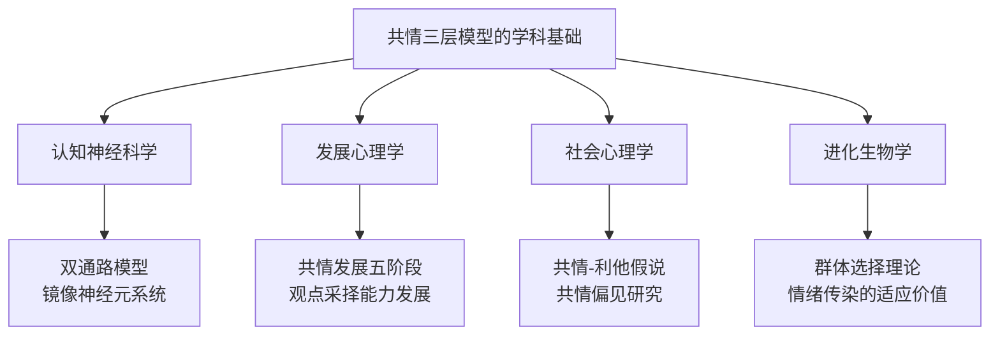

## 四、共情的深度层次

共情不是一种单一的心理能力，而是一个由浅入深的多层次系统。从"我知道你在想什么"到"我感受到你的痛苦"再到"我想为你做些什么"，每一层共情涉及不同的神经回路、认知过程和行为输出。理解共情的深度层次，是掌握高级沟通能力的理论基石——只有知道自己"在哪一层"，才能有意识地向上递进，而不是停留在表面的理解或失控的情绪感染中。

### 4.1 共情层次模型的理论源流

#### 4.1.1 从哲学到心理学：共情概念的演变

"共情"（Empathy）一词源于德语"Einfühlung"（字面意思为"感受进去"），由德国美学家Robert Vischer在1873年首次提出，用来描述人们在欣赏艺术作品时将自身情感投射到对象中的体验。1909年，美国心理学家Edward Titchener将其翻译为英文"empathy"，从此进入心理学研究的核心领域。

20世纪中后期，共情研究经历了三次关键转向：

| 时期 | 代表人物 | 核心观点 | 对层次模型的贡献 |
|------|----------|----------|------------------|
| 1950-60年代 | Carl Rogers | 共情是治疗关系的核心条件 | 定义了"准确共情"的概念——不是简单重复，而是深入对方内心世界 |
| 1980-90年代 | Martin Hoffman | 共情是道德发展的基础 | 提出了共情发展的五阶段模型（新生儿反应→自我中心安慰→准共情→真正共情→抽象共情） |
| 2000年代至今 | Simon Baron-Cohen | 共情是认知与情感的双系统 | 区分了认知共情与情感共情，建立了共情商数（EQ）测量体系 |

#### 4.1.2 三层模型的学术基础

目前被广泛接受的共情三层模型（认知共情—情感共情—共情关怀）并非某一位学者的单一理论，而是整合了多个学科研究成果的综合框架：

- **认知神经科学**提供了"自上而下"与"自下而上"双通路模型（Decety & Jackson, 2004），为区分认知共情和情感共情提供了脑科学证据
- **发展心理学**揭示了共情从简单情绪感染到复杂观点采择的发展序列（Hoffman, 2000）
- **社会心理学**发现了"共情-利他假说"（Batson, 1991），证明共情关怀是亲社会行为的核心驱动力
- **进化生物学**解释了共情从群体生存需要中演化而来的机制（de Waal, 2008）

### 4.2 第一层：认知共情（Cognitive Empathy）

#### 4.2.1 定义与本质

认知共情，又称"观点采择"（Perspective Taking）或"心理理论"（Theory of Mind），是指理解他人观点、信念、意图和感受的能力，但不必然伴随相同的情绪体验。其核心是一种认知操作——"我知道你在想什么，我理解你为什么这样想"。

认知共情的本质是一种**心理模拟**：我们在大脑中构建对方的心理模型，用对方的信息、价值观和经历来推演他们的思维过程。这不是"读心术"，而是一种基于推理和观察的心理建模能力。

#### 4.2.2 神经机制

认知共情主要依赖"自上而下"的神经通路，涉及以下脑区：

| 脑区 | 功能 | 在认知共情中的作用 |
|------|------|-------------------|
| **内侧前额叶皮层（mPFC）** | 自我参照加工、心理状态推断 | 构建他人的心理模型，判断对方的信念和意图 |
| **颞顶联合区（TPJ）** | 区分自我与他人的视角 | 在"我的想法"和"你的想法"之间切换，是观点采择的关键区域 |
| **颞上沟（STS）** | 生物运动感知、意图理解 | 从他人的动作和表情中推断意图 |
| **背内侧前额叶皮层（dmPFC）** | 社会认知、印象形成 | 对他人进行特质推断和行为预测 |

fMRI研究显示，当被试被要求判断他人想法（而非自己的想法）时，TPJ和mPFC的激活显著增强。这些区域的损伤会导致心理理论能力的严重缺陷——自闭症谱系障碍（ASD）患者在这些区域的功能异常，正是其认知共情困难的神经基础。

#### 4.2.3 发展轨迹

认知共情在人类发展中有明确的时间表：

| 年龄 | 发展里程碑 | 具体表现 |
|------|-----------|----------|
| 12-18个月 | 聯合注意（Joint Attention） | 能够跟随他人的视线方向，意识到"他在看什么" |
| 2-3岁 | 简单观点采择 | 能理解"你看到了我看不到的东西" |
| 4-5岁 | 错误信念理解（Sally-Anne测试） | 能理解"他不知道我知道的事情" |
| 6-7岁 | 二级信念理解 | 能理解"他认为她以为……"的嵌套推理 |
| 10-12岁 | 抽象观点采择 | 能理解不同立场的合理性，即使自己不认同 |
| 青春期至成年 | 复杂社会认知 | 能整合多方视角、文化背景和隐含动机进行综合判断 |

#### 4.2.4 认知共情的优势与局限

**优势**：
- 情绪消耗较低，可以长时间维持
- 不会因情绪过载而丧失判断力
- 适合需要客观分析的场景（谈判、调解、领导决策）
- 可以被系统训练和提升

**局限**：
- 缺乏情感温度，对方可能感觉"你理解我，但你不在乎我"
- 过度依赖推理可能导致误判——你构建的"对方心理模型"可能不准确
- 在亲密关系中，纯粹的认知共情可能被视为"冷血"或"理性化"
- 容易滑向"分析对方"而非"理解对方"的陷阱

### 4.3 第二层：情感共情（Emotional Empathy）

#### 4.3.1 定义与本质

情感共情，又称"情感共鸣"（Affective Resonance）或"情绪感染"（Emotional Contagion），是指在情感层面真正"感受到"他人情绪的能力。其核心不是推理，而是一种**情绪的自动激活**——当你看到别人哭泣时，你的眼眶也会湿润；当你看到别人恐惧时，你的心跳也会加速。

情感共情的本质是一种**共享表征**（Shared Representation）：大脑中处理他人情绪的区域与处理自身情绪的区域存在高度重叠。这不是"想象对方的感受"，而是"在自己的身体里体验到类似的感受"。

#### 4.3.2 神经机制

情感共情主要依赖"自下而上"的神经通路，核心脑区包括：

| 脑区 | 功能 | 在情感共情中的作用 |
|------|------|-------------------|
| **前脑岛（Anterior Insula）** | 内感受觉知、情绪意识 | 将身体内部的感受信号转化为有意识的情绪体验，是情感共情的关键枢纽 |
| **前扣带回皮层（ACC）** | 痛苦加工、情感冲突 | 当我们看到他人痛苦时，ACC会被激活——这就是"感同身受"的神经基础 |
| **杏仁核（Amygdala）** | 威胁检测、恐惧加工 | 对他人的情绪信号（尤其是恐惧和愤怒）进行快速、自动化的反应 |
| **镜像神经元系统** | 动作观察与模拟 | 在观察他人情绪表达时自动"镜像"其神经活动 |

关键研究发现：Singer等人（2004）的经典fMRI实验表明，当女性被试看到自己的伴侣接受电击时，她们的前脑岛和ACC激活模式与自己接受电击时高度相似——这为"共享表征"理论提供了直接的神经影像证据。

#### 4.3.3 情感共情的进化起源

情感共情在进化上远早于认知共情。几乎所有社会性哺乳动物都表现出原始形式的情感共情：

- **小鼠的情绪传染**：当一只小鼠反复接受痛苦刺激后，与它同笼的未受刺激小鼠会表现出疼痛敏感性增加（Langford et al., 2006, *Science*）
- **大象的安慰行为**：当一头大象表现出痛苦时，附近的象群成员会用鼻子触碰它、发出低频安慰声（Plotnik & de Waal, 2014）
- **倭黑猩猩的自发帮助**：陌生的倭黑猩猩会主动帮助遇到困难的同类，即使没有回报（Tan & Hare, 2013, *PNAS*）

这些研究表明，情感共情是一种古老的、根植于哺乳动物社会性本能的能力，而认知共情（尤其是高阶心理理论）则是人类在进化后期发展出的更高级能力。

#### 4.3.4 情感共情的优势与风险

**优势**：
- 能够传递真诚的关心和理解，让对方感到"被看到"
- 建立深层次的情感连接，是亲密关系的基础
- 不需要复杂的推理，反应速度快
- 驱动自发的帮助行为

**风险**：
- **共情疲劳**（Compassion Fatigue）：长期暴露于他人痛苦中导致的情绪耗竭，常见于医护人员、心理咨询师、社工
- **共情偏见**（Empathy Bias）：我们更容易对与自己相似的人产生情感共情，导致帮助行为的不公正分配
- **情绪淹没**（Emotional Flooding）：被对方的情绪完全占据，丧失"我vs你"的边界，无法提供有效帮助
- **判断扭曲**：强烈的情感共情可能导致过度保护或不合理妥协

### 4.4 第三层：共情关怀（Empathic Concern）

#### 4.4.1 定义与本质

共情关怀，又称"同情性关怀"（Compassionate Concern）或"利他性共情"，是指在理解和感受的基础上，产生帮助他人的动机和行为的能力。其完整表达是："我理解你的处境，我感受到你的痛苦，而且我想要帮助你。"

共情关怀的本质是一种**从感知到行动的转化**——它不仅是认知和情感的终点，更是亲社会行为的起点。社会心理学家C. Daniel Batson的大量实验证明，共情关怀是真正的利他主义的核心驱动力，而非仅仅是"为了让自己感觉好"的自我服务行为。

#### 4.4.2 神经机制

共情关怀涉及情感共情的脑区之外，还激活了与奖赏加工和养育行为相关的神经回路：

| 脑区 | 功能 | 在共情关怀中的作用 |
|------|------|-------------------|
| **腹侧纹状体（Ventral Striatum）** | 奖赏加工、动机驱动 | 帮助行为本身激活奖赏回路，产生"助人的快乐" |
| **眶额叶皮层（OFC）** | 价值评估、社会决策 | 评估帮助行为的价值和代价，进行社会决策 |
| **中脑导水管周围灰质（PAG）** | 养育行为、疼痛调节 | 与母性关怀行为相关的原始保护本能 |
| **伏隔核（Nucleus Accumbens）** | 积极情绪、社会联结 | 在帮助他人时释放多巴胺，强化亲社会行为 |

重要发现：与情感共情可能导致痛苦不同，共情关怀激活的是积极情绪和奖赏回路。这意味着真正的关怀不仅不会导致共情疲劳，反而能带来"助人者的高潮"（Helper's High）。区分"共情痛苦"（Empathic Distress）和"共情关怀"（Empathic Concern）是预防共情疲劳的关键。

#### 4.4.3 Batson的共情-利他假说

C. Daniel Batson在1991年提出的"共情-利他假说"（Empathy-Altruism Hypothesis）是共情关怀研究的里程碑。其核心主张是：当个体对他人产生共情关怀时，会引发以减轻他人痛苦为目标的利他动机，而非仅仅为了减轻自己的不适（消极状态缓解假说）。

Batson设计了一系列精巧的实验来验证这一假说，其中最著名的是"看到受害者的痛苦"实验：

1. 被试观看一名叫Elaine的女性接受电击的视频
2. 通过指导语操纵被试的共情水平（高共情组 vs 低共情组）
3. 提供两种选择：替Elaine承受电击（高代价帮助），或者离开实验室回避（低成本逃避）

结果：高共情组中75%的人选择替代Elaine承受电击，即使他们可以轻松离开。低共情组中只有33%选择替代。这表明，共情关怀驱动的帮助行为是真正以他人为导向的利他行为。

#### 4.4.4 共情关怀与同情心（Compassion）的区别

共情关怀（Empathic Concern）与日常所说的"同情心"（Compassion）密切相关但不完全等同：

| 维度 | 共情关怀 | 同情心 |
|------|----------|--------|
| **定义** | 因共情而产生的关心和帮助意愿 | 对他人痛苦的觉知，以及希望减轻该痛苦的意愿 |
| **是否需要共情** | 必须以认知共情和情感共情为基础 | 可以独立于情感共情存在（如慈悲冥想中的同情心） |
| **情绪基调** | 温暖、关心、但可能伴随焦虑 | 温暖、平静、较少伴随焦虑 |
| **神经基础** | 共情网络 + 奖赏网络 | 主要激活奖赏网络和积极情绪网络 |
| **训练方法** | 需要先发展认知和情感共情 | 可以通过慈悲冥想（Loving-Kindness Meditation）直接训练 |

神经科学家Tania Singer的研究团队发现了一个重要区分：**共情**（尤其是情感共情）更多激活前脑岛和ACC（与痛苦相关），而**同情心**更多激活内侧眶额叶皮层和腹侧纹状体（与积极情绪相关）。这意味着过度共情会导致痛苦和耗竭，而同情心则是一种更可持续的关怀状态。

### 4.5 三层之间的关系：递进、独立与互动

#### 4.5.1 三层递进的理想路径

在理想的共情过程中，三个层次呈递进关系：

但实际运用中，这三个层次并非严格线性：

- **可以从任意层次进入**：有时你先感受到对方的情绪（情感共情），然后才去理解发生了什么（认知共情）
- **层次可以独立存在**：你可能理解一个人的想法（认知共情），但不产生任何情感共鸣（缺乏情感共情）
- **层次之间可能冲突**：过度的情感共情可能干扰认知共情的准确性（情绪淹没导致无法清晰思考）

#### 4.5.2 层次组合的不同模式

不同的层次组合会导致截然不同的沟通效果：

| 共情组合 | 典型表现 | 对方的感受 | 适用场景 |
|----------|----------|------------|----------|
| 认知强 + 情感弱 | "我理解你的处境，但情绪波动不大" | "他理解我，但似乎不太在乎" | 调解、谈判、客观分析 |
| 情感强 + 认知弱 | "我能感受到你的痛苦，但不太理解为什么" | "他有感受，但好像抓不住重点" | 情感支持、安慰 |
| 认知+情感强 + 关怀弱 | "我理解你也感受到你，但不知道该怎么做" | "他懂我，但帮不了我" | 陪伴、倾听 |
| 三层均衡 | "我理解你，感受到你，并且想帮助你" | "他真的在乎我" | 完整的共情回应 |

#### 4.5.3 不同情境中的最优层次配置

并非所有场景都需要"三层全开"。根据情境选择合适的共情层次，是高级共情能力的体现：

| 情境 | 最优层次 | 原因 |
|------|----------|------|
| 医生告知诊断结果 | 认知共情为主，适度情感共情 | 需要清晰传递信息，过度情感共情可能干扰专业判断 |
| 朋友倾诉失恋 | 情感共情为主，认知共情辅助 | 对方需要的是"被感受到"而非"被分析" |
| 下属工作受挫 | 三层递进 | 先理解处境，再感受情绪，最后提供支持 |
| 危机干预 | 认知共情 + 共情关怀 | 需要快速理解情况并采取行动，过度情感共情可能导致恐慌 |
| 长期照护 | 共情关怀为主，管理情感共情 | 需要持续的关心但不能持续消耗情感资源 |

### 4.6 共情层次的测量与评估

#### 4.6.1 主流测量工具

研究者开发了多种量表来测量不同层次的共情能力：

| 量表 | 测量维度 | 代表性题目 | 适用人群 |
|------|----------|------------|----------|
| **人际反应指数（IRI）**（Davis, 1983） | 观点采择、幻想、共情关怀、个人痛苦 | "我常常从别人的角度看问题"（观点采择） | 最广泛使用的共情量表 |
| **认知与情感共情量表（QCAE）**（Reniers et al., 2011） | 认知共情（观点采择+在线模拟）、情感共情（情感传染+周边导向反应） | "我能很容易地从别人的角度看问题" | 区分认知与情感共情 |
| **共情商数（EQ）**（Baron-Cohen, 2004） | 认知共情为主 | 通过眼神照片判断情绪（RMET任务） | 评估自闭症特质 |
| **慈悲疲劳量表（ProQOL）**（Stamm, 2010） | 共情满意度、倦怠、二次创伤 | "我因为帮助别人而感到满足" | 助人专业人士 |

#### 4.6.2 自我评估框架

在日常沟通中，你可以用以下三个问题快速评估自己当前的共情层次：

1. **认知层**："我是否真正理解了对方的处境和立场？还是我只在听表面的话？"
2. **情感层**："我是否感受到了对方的情绪？这种感受是真实的还是我在'假装'？"
3. **关怀层**："我是否产生了帮助对方的动机？还是我只是在'完成任务'般地回应？"

如果三个问题的答案都是"是"，你正在运用完整的三层共情。如果有任何一层的答案是"否"，那就是你需要有意识地提升的方向。

### 4.7 共情层次的神经可塑性：可以训练吗？

#### 4.7.1 认知共情的可训练性

认知共情是最容易通过训练提升的层次。证据包括：

- **心理剧训练**：参与者在心理剧中扮演不同角色，经过8周训练后，IRI观点采择分数显著提高
- **正念冥想**：8周的正念训练能够增强TPJ和mPFC的功能连接，提升观点采择能力
- **文学阅读**：经常阅读文学小说的人在心理理论测试中表现更好（Kidd & Castano, 2013, *Science*），因为小说阅读本质上是一种"观点采择训练"

#### 4.7.2 情感共情的可塑性

情感共情的可塑性较认知共情更为复杂：

- **可以提升**：慈悲冥想（Compassion Meditation）可以增强前脑岛和ACC对他人痛苦的反应
- **也可以降低**：长期暴露于他人痛苦可能导致情感共情的"钝化"——这是一种自我保护机制，但也意味着需要主动维护
- **需要平衡**：情感共情的目标不是"越强越好"，而是与认知共情和自我保护能力形成平衡

#### 4.7.3 共情关怀的培养

共情关怀的培养可以通过以下经过验证的方法：

1. **慈悲冥想（Loving-Kindness Meditation, LKM）**：系统性地培养对自己和他人的温暖和关心。Hutcherson等人（2008）的研究表明，仅7分钟的LKM就能增加对陌生人的积极情感
2. **共同经历**：与他人一起经历困难或挑战，能够自然地激发共情关怀
3. **群体认同**：扩大"我们"的范围——将更多人纳入自己的内群体，自然会增加对他们的关怀
4. **助人行为的正反馈**：帮助他人的行为本身会激活奖赏回路，强化未来的关怀动机

### 4.8 常见误解与澄清

| 误解 | 事实 |
|------|------|
| "共情是一种天赋，要么有要么没有" | 共情是一种可以通过训练提升的能力，所有三个层次都具有神经可塑性 |
| "共情越强越好" | 过度的情感共情会导致共情疲劳和判断力下降，关键是层次间的平衡 |
| "认知共情不如情感共情真实" | 两者都是共情的有效形式，认知共情在很多场景中更实用、更可持续 |
| "共情等于同意对方" | 共情是理解而非认同，你可以说"我理解你为什么这样想"而不必同意 |
| "共情就是感同身受" | 感同身受只是情感共情的一部分，完整的共情还包括认知理解和关怀行动 |
| "高共情者不会伤害他人" | 高共情者也可能因为共情偏见而优先帮助"像自己的人"，忽视其他人 |

### 4.9 理论小结

共情的三个深度层次构成了一个从知到情到行的完整系统：

| 层次 | 核心能力 | 神经基础 | 关键优势 | 主要风险 |
|------|----------|----------|----------|----------|
| **认知共情** | 理解他人观点和想法 | mPFC、TPJ、STS | 低消耗、可长时间维持 | 缺乏情感温度 |
| **情感共情** | 感受他人的情绪状态 | 前脑岛、ACC、镜像系统 | 传递真诚连接 | 共情疲劳、情绪淹没 |
| **共情关怀** | 产生帮助他人的动机 | 腹侧纹状体、OFC、PAG | 驱动实际行动 | 过度承担责任 |

掌握这三个层次，不是为了成为"完美的共情者"，而是为了在不同的沟通场景中，能够有意识地选择最合适的共情深度——既不过于冷漠，也不过于消耗，在理解与关怀之间找到属于自己的平衡点。

> "共情不是把自己变成别人，而是在自己的内心为别人腾出空间。"——心理治疗师Heinz Kohut
