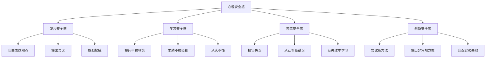

## 五、心理安全感

心理安全感（Psychological Safety）是当代组织行为学和沟通心理学中最具实践价值的概念之一。它决定了一个团队能否真正实现开放对话、持续学习和创新突破。缺乏心理安全感的团队，即使拥有顶尖人才，也会因为信息流通受阻、错误被掩盖、创意被扼杀而表现平庸。本节将从理论根源、核心维度、建设方法、评估工具和常见误区五个层面，系统展开心理安全感的完整知识体系。

### 5.1 理论根基：从勒温到埃德蒙森的演进

#### 5.1.1 概念起源：库尔特·勒温的场域理论

心理安全感的概念并非始于埃德蒙森。早在1940年代，社会心理学家库尔特·勒温（Kurt Lewin）在场域理论（Field Theory）中提出：人的行为是个体与环境交互作用的函数，即 B=f(P,E)。勒温认为，组织变革的阻力往往来自成员对"未知后果"的恐惧——改变行为模式意味着承担人际风险，而当这种风险超出个体承受阈值时，人会本能地退缩到安全但低效的行为模式中。

勒温的变革三阶段模型——解冻（Unfreezing）→变革（Changing）→再冻结（Refreezing）——中的"解冻"阶段，本质上就是降低心理风险、创造安全变革空间的过程。这一思想为后来的心理安全感研究奠定了哲学基础。

#### 5.1.2 埃德蒙森的突破性研究

1999年，哈佛商学院教授艾米·埃德蒙森（Amy Edmondson）在《行政科学季刊》发表里程碑论文《心理安全与学习行为在工作团队中的关系》，正式将心理安全感定义为：

> **团队成员共享的一种信念，即团队是安全的，可以承担人际风险（interpersonal risk-taking）。**

这个定义的关键在于"共享信念"——心理安全感不是个体特质，而是团队层面的集体感知。一个人可能在A团队中感到安全，在B团队中却如履薄冰，这恰恰说明心理安全感是环境属性，而非个人属性。

埃德蒙森的初始研究来自一个意外发现：她在研究医院护理团队的医疗差错率时，发现表现最好的团队反而报告了更多的差错。进一步调查揭示，这些团队并非犯错更多，而是成员更愿意主动报告和讨论错误。这一反直觉的发现指向了心理安全感的核心机制——它不是消除错误，而是创造让错误浮出水面并被转化为学习机会的环境。

#### 5.1.3 谷歌亚里士多德计划的验证

2015年，谷歌启动"亚里士多德计划"（Project Aristotle），对180个内部团队进行大规模实证研究，试图回答"什么让团队高效"。研究发现，影响团队效能的首要因素不是成员的个人能力、学历背景或性格组合，而是**心理安全感**。

亚里士多德计划的核心发现：

| 排名 | 影响因素 | 影响权重 | 说明 |
|------|----------|----------|------|
| 1 | 心理安全感 | 最高 | 成员敢于冒险、不怕犯错 |
| 2 | 可靠性 | 高 | 成员能信赖彼此完成任务 |
| 3 | 结构与清晰度 | 中高 | 角色、计划和目标明确 |
| 4 | 工作意义 | 中 | 工作对个人有重要价值 |
| 5 | 工作影响 | 中低 | 工作成果有实际影响 |

这一研究将心理安全感从学术概念推向了管理实践的前沿，成为全球企业管理者必须理解的核心能力。

### 5.2 心理安全感的四个维度

心理安全感并非单一维度的"感觉好"，而是由四个相互关联但可独立运作的维度构成。

#### 5.2.1 发言安全感（Voice Safety）

发言安全感是最基础的维度，指的是成员感到可以自由表达观点、提出不同意见、挑战现有决策，而不会因此遭受惩罚、排斥或报复。

**具体表现**：
- 在会议中敢于说"我不同意这个方案"
- 能够对上级的决策提出建设性质疑
- 愿意分享与主流不同的观察和判断
- 不担心"枪打出头鸟"的后果

**缺乏发言安全感的信号**：
- 会议中只有领导在说，其他人沉默
- 决策总是"一致通过"，没有任何异议
- 私下里大家有很多意见，公开场合却一片和谐
- 新人很快就学会了"少说多听"的潜规则

**深层机制**：发言安全感缺失的根源在于组织中隐性的"权力距离"（Power Distance）。霍夫斯泰德的文化维度理论指出，高权力距离文化中，下级默认上级的判断更权威，公开挑战被视为不尊重。在中国、日本等东亚文化背景下，建设性地表达异议需要更多的技巧和环境支持。

#### 5.2.2 学习安全感（Learning Safety）

学习安全感指成员感到可以提问、求助、承认自己不懂，而不会被嘲笑、轻视或被认为能力不足。

**具体表现**：
- 新人敢问"这个流程我不太明白，能解释一下吗"
- 资深成员愿意说"这个领域我不熟悉，需要学习"
- 团队中有"不懂就问"的文化，而非"不懂就自己查"
- 失误后复盘的焦点是"学到了什么"而非"谁的责任"

**学习安全感的心理学基础**：卡罗尔·德韦克（Carol Dweck）的成长型思维理论（Growth Mindset）指出，持有成长型思维的人认为能力可以通过努力发展，因此不惧暴露不足；而固定型思维的人认为能力是天生的，承认不懂等于承认"笨"。学习安全感的本质是创造一个让所有人都能以成长型思维运作的环境。

#### 5.2.3 容错安全感（Error Safety）

容错安全感指成员感到可以承认失误、报告错误，而不会因此受到惩罚、指责或职业发展受阻。

**具体表现**：
- 发现问题后第一时间上报，而非掩盖
- 复盘会上坦诚分析自己的判断失误
- 领导者以"我也犯过类似的错"回应下属的错误报告
- 组织有"无责报告"机制，鼓励主动披露问题

**容错安全感与"免责文化"的区别**：这是一个关键区分。心理安全感不等于没有问责。埃德蒙森特别强调：心理安全感和高绩效标准是两个独立的维度。最佳组合是"高心理安全+高绩效标准"——团队成员既敢于暴露问题，又对解决问题有强烈的责任感。反之，"高心理安全+低绩效标准"会滑向懈怠放纵。

| | 低心理安全 | 高心理安全 |
|---|---|---|
| **低绩效标准** | 冷漠区：沉默、躺平 | 舒适区：安逸但无挑战 |
| **高绩效标准** | 焦虑区：高压、掩盖错误 | 学习区：卓越、持续改进 |

#### 5.2.4 创新安全感（Innovation Safety）

创新安全感指成员感到可以尝试新方法、提出非常规方案，即使失败也不会受到过度惩罚。

**具体表现**：
- 允许用20%的工作时间做实验性项目
- 失败的项目也能做正式复盘，提取价值
- 提出"离谱"的想法不会被嘲笑
- 有快速试错、快速迭代的文化和流程支撑

**创新安全感的经济价值**：哈佛商学院的研究显示，在高心理安全感的团队中，成员提出创新建议的概率是低心理安全团队的3.2倍，而这些创新建议被采纳并产生实际价值的比例也显著更高。这直接转化为组织的竞争优势。

### 5.3 心理安全感的测量与评估

#### 5.3.1 埃德蒙森心理安全量表

埃德蒙森开发了7题量表，是学术界和实践界最广泛使用的测量工具：

**量表题目**（1-7分，1=非常不同意，7=非常同意）：

1. 如果你在本团队中犯了错误，它常常会被用来反对你（反向计分）
2. 本团队的成员能够提出难题和敏感话题
3. 本团队中的人有时会因为与众不同而被拒绝（反向计分）
4. 在本团队中冒险是安全的
5. 向本团队的其他成员求助不容易（反向计分）
6. 本团队中没有人会故意破坏我的努力
7. 我与本团队成员合作时，我的独特技能和才能受到重视和利用

**计分方法**：将反向题目反转后，计算7题的平均分。得分越高，心理安全感越强。

**参考基准**：
- 6分以上：高水平心理安全感，团队表现优异
- 4.5-6分：中等水平，有改善空间
- 3-4.5分：偏低，团队可能存在沉默和掩盖问题的现象
- 3分以下：严重缺乏心理安全感，需要立即干预

#### 5.3.2 定性评估方法

除了量化问卷，还可以通过以下定性方法评估团队的心理安全感水平：

**会议观察法**：
记录一次团队会议中的以下指标：
- 发言分布：是否只有少数人主导？
- 异议频率：有没有人提出不同意见？
- 领导反应：领导者如何回应质疑和批评？
- 追问深度：讨论是表面一致还是深入碰撞？

**离职访谈分析**：
离职员工在最后时刻最可能说出真话。分析离职访谈中反复出现的关键词，如"不敢说""压力大""领导不听""多一事不如少一事"，可以识别心理安全感缺失的领域。

**匿名反馈模式分析**：
当团队成员大量使用匿名渠道（而非直接沟通）表达不满或提出建议时，这本身就是心理安全感不足的信号。

### 5.4 心理安全感的建设方法

#### 5.4.1 领导者行为：从"说"到"做"的转变

心理安全感的建设始于领导者的行为示范，而非口号宣传。以下是经过验证的关键行为：

**主动示弱（Leader Vulnerability）**：

领导者率先承认自己的错误、知识盲区和不确定性，是降低团队人际风险最有效的方式。

实操模板：
- 开会时说："关于这个问题，我目前的想法是X，但我可能遗漏了Y方面的考量，大家怎么看？"
- 项目复盘时说："这次延期，我在需求评审阶段的判断有误，我当时低估了技术复杂度。"
- 做决策时说："我倾向于方案A，但这个判断的依据不够充分，需要你们帮我补充反面证据。"

**关键原则**：示弱要真诚、具体、有行动导向。空洞的"我也会犯错"远不如"上周二我在客户会议上对进度的预估过于乐观，导致团队被动加班"来得有效。

**询问而非告知（Inquiry over Advocacy）**：

将沟通模式从"告知-执行"转向"询问-讨论"：

| 告知模式 | 询问模式 |
|----------|----------|
| "我们按方案A执行" | "方案A和方案B各有什么优劣？" |
| "这个需求下周必须完成" | "以目前的资源，这个时间线现实吗？" |
| "客户说的就是这样" | "客户的底层诉求是什么？有没有替代方案？" |
| "我的经验是这样处理" | "你们在这个场景下有什么不同的经验？" |

**对"坏消息"的正向反馈**：

当团队成员带来坏消息（项目延期、客户投诉、技术故障）时，领导者的第一反应决定了后续是否还有人愿意主动报告。

错误反应：
- "怎么现在才说？"（惩罚及时报告）
- "这个上次不是说解决了吗？"（质疑能力）
- 沉默皱眉（非语言惩罚）

正确反应：
- "谢谢你及时告诉我，我们现在知道了就能尽快应对。"（感谢+行动导向）
- "这种情况确实棘手，你觉得我们从哪里入手最好？"（赋权+共同解决）
- "能提前发现问题说明你很关注细节，这比事后才发现好太多了。"（肯定价值）

#### 5.4.2 团队沟通规范设计

心理安全感不能只靠领导者的个人魅力，需要制度化的沟通规范来保障。

**结构化发言机制**：

在会议中引入结构化发言规则，确保每个人都有平等的表达机会：

1. **轮流发言法**：按固定顺序让每位成员发表意见，避免"谁先说谁定调"
2. **先写后说法**：每人先在纸上写下自己的观点，然后轮流分享，避免从众效应
3. **新人优先法**：让资历最浅的成员先发言，避免被权威意见"锚定"
4. **红队机制**：指定专人扮演"反对者"角色，系统性地挑战主流方案

**"失败复盘会"制度**：

定期举行失败复盘会（Blameless Postmortem），规则如下：
- 聚焦于"系统和流程出了什么问题"，而非"谁犯了错"
- 每个人都要分享一个自己近期的失误或教训
- 复盘产出是"改进行动项"而非"追责报告"
- 复盘记录不作为绩效考核的依据

**"傻问题时间"**：

在团队周会或月会中设置专门的"傻问题时间"（Stupid Questions Time），鼓励成员提出那些"不好意思问"的基础问题。谷歌和亚马逊等公司发现，这些"傻问题"往往揭示了流程中的重大漏洞或知识传递的断裂点。

#### 5.4.3 制度保障：从文化到机制

**匿名反馈渠道**：
- 定期匿名问卷（每月或每季度）
- 匿名意见箱（线上工具如腾讯问卷、金数据）
- 第三方介入的焦点小组访谈

**"无责报告"机制**：
借鉴航空业的安全报告制度（NASA的ASRS系统），建立组织内的无责报告通道：
- 报告者不会因主动披露问题而受到惩罚
- 报告内容用于系统改进，不用于个人追责
- 有专人跟进处理并反馈结果

**心理安全纳入管理考核**：
将团队心理安全感评分纳入管理者的绩效考核指标，使"建设安全环境"成为管理者的硬性职责，而非可有可无的"软技能"。

### 5.5 不同场景下的心理安全建设

#### 5.5.1 远程与混合办公场景

远程办公环境下，心理安全感面临特殊挑战：
- 非语言信号缺失，误解概率增加
- 异步沟通中语气容易被误读
- "已读不回"可能被解读为冷漠或不认同
- 新人融入更难，缺乏非正式交流机会

**应对策略**：
- 视频会议时开启摄像头，增加非语言信息
- 重要讨论使用视频而非文字，减少误读
- 为新人指定"伙伴"（Buddy），提供非正式支持
- 定期安排一对一沟通，主动询问"有什么需要支持的"
- 在即时通讯工具中使用表情符号和语气词，软化文字的冰冷感

#### 5.5.2 跨文化团队场景

当团队成员来自不同文化背景时，心理安全感的建设需要考虑文化差异：

- **高权力距离文化**（中国、日本、韩国）的成员可能不习惯直接挑战上级，需要更温和的引导方式
- **低权力距离文化**（北欧、荷兰）的成员可能习惯直接表达，需要注意不要被其他文化成员解读为"无礼"
- **高不确定性规避文化**（德国、日本）的成员可能更需要明确的规则和流程
- **集体主义文化**的成员可能更关注"面子"，需要在私下而非公开场合给予反馈

**跨文化心理安全建设原则**：
- 建立明确的团队沟通规范，让不同文化背景的成员有共同的"游戏规则"
- 提供多种反馈渠道（公开讨论+匿名反馈+一对一），满足不同文化偏好
- 领导者主动示范跨文化的尊重行为
- 定期讨论文化差异，将"不同"视为资源而非障碍

#### 5.5.3 高压力与危机场景

在项目截止日期临近、客户投诉集中、业务遭遇危机等高压场景下，心理安全感最容易被牺牲。领导者倾向于加强控制、减少讨论、加速决策，这些行为恰恰会摧毁心理安全感。

**高压场景的心理安全维护**：
- 即使时间紧迫，也要留出5分钟让团队成员表达顾虑
- 危机复盘要等到情绪平复后进行，避免在恐慌状态下追责
- 领导者在压力下更要刻意控制情绪反应，因为团队会放大领导者的焦虑
- 危机结束后，正式组织复盘会，将教训转化为制度改进

### 5.6 心理安全感的常见误区

#### 误区一：心理安全感 = 一团和气

**真相**：心理安全感恰恰要求团队能够进行坦诚的、有时是不舒服的对话。一团和气往往意味着没人愿意提出真实意见，这是心理安全感低的表现，而非高的表现。真正有心理安全感的团队会有激烈的观点碰撞，但碰撞之后不会产生人际报复。

#### 误区二：心理安全感 = 不问责

**真相**：心理安全感与绩效问责是两个独立维度。有心理安全感的团队对标准要求更高，因为他们敢于面对真实的问题并持续改进。取消问责只会制造"舒适区"，而非"学习区"。

#### 误区三：心理安全感可以通过一次培训建立

**真相**：心理安全感是通过领导者日复一日的行为积累建立的，而非一次团建或培训就能达成。领导者一次当众发怒，可能摧毁几个月的建设成果。

#### 误区四：心理安全感是领导者的责任

**真相**：虽然领导者起关键作用，但心理安全感是每个团队成员共同维护的。当团队成员互相嘲笑他人的"傻问题"、私下议论提出不同意见的人时，心理安全感同样会被破坏。每个成员都是心理安全的"共建者"。

#### 误区五：心理安全感意味着所有人都要喜欢彼此

**真相**：心理安全感不要求人际亲密，只要求人际尊重。团队成员可以有性格差异、工作风格冲突，甚至不需要成为朋友，但必须在专业层面保持尊重和信任。

### 5.7 心理安全感的进阶应用

#### 5.7.1 心理安全感与组织学习

心理安全感是组织学习（Organizational Learning）的基础设施。彼得·圣吉在《第五项修炼》中提出的五项修炼——系统思考、个人精进、心智模式、共同愿景、团队学习——没有一项能在缺乏心理安全感的环境中实现。

- **系统思考**需要成员敢于指出系统中的问题，而非只报告表面现象
- **心智模式**的反思需要成员敢于暴露自己的思维盲区
- **团队学习**的深度对话需要成员敢于表达真实想法

#### 5.7.2 心理安全感与创新管理

克里斯滕森的颠覆性创新理论指出，大公司往往被"好客户"的需求绑架，错失颠覆性机会。其中一个关键机制是：中层管理者不敢向上汇报"坏消息"——那些看起来不赚钱、客户不认可、短期没有回报的创新项目。

在高心理安全感的组织中，创新信息能够更顺畅地从基层传达到决策层，颠覆性创新的存活率更高。

#### 5.7.3 心理安全感与客户沟通

心理安全感的概念不仅适用于团队内部，也适用于与客户的沟通。当客户感到在你面前可以坦诚表达不满、提出需求变化、承认自己的判断失误时，客户关系会更加稳固和深入。

**建设客户心理安全感的方法**：
- 主动说"如果我们的方案有问题，请直接告诉我，我们一起来调整"
- 对客户的批评表示感谢，而非辩解
- 分享自己的行业观察和判断，包括可能让客户不舒服的真实信息
- 建立定期的非正式沟通渠道，降低"正式汇报"的心理门槛

### 5.8 本节要点回顾

1. **心理安全感是团队层面的共享信念**，不是个体特质，而是环境属性
2. **四个维度**：发言安全感、学习安全感、容错安全感、创新安全感，相互关联又可独立运作
3. **心理安全感 ≠ 一团和气 ≠ 不问责**，它与高绩效标准是最佳组合
4. **建设方法**：领导者行为示范 + 沟通规范制度化 + 匿名反馈机制 + 管理考核纳入
5. **文化敏感**：在高权力距离文化中，需要更多技巧和耐心来建立心理安全感
6. **测量工具**：埃德蒙森7题量表 + 会议观察法 + 离职访谈分析

