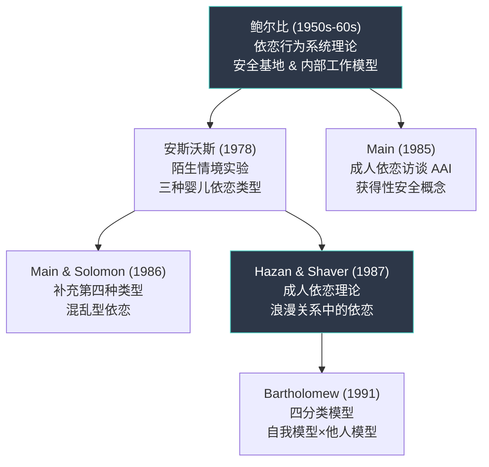
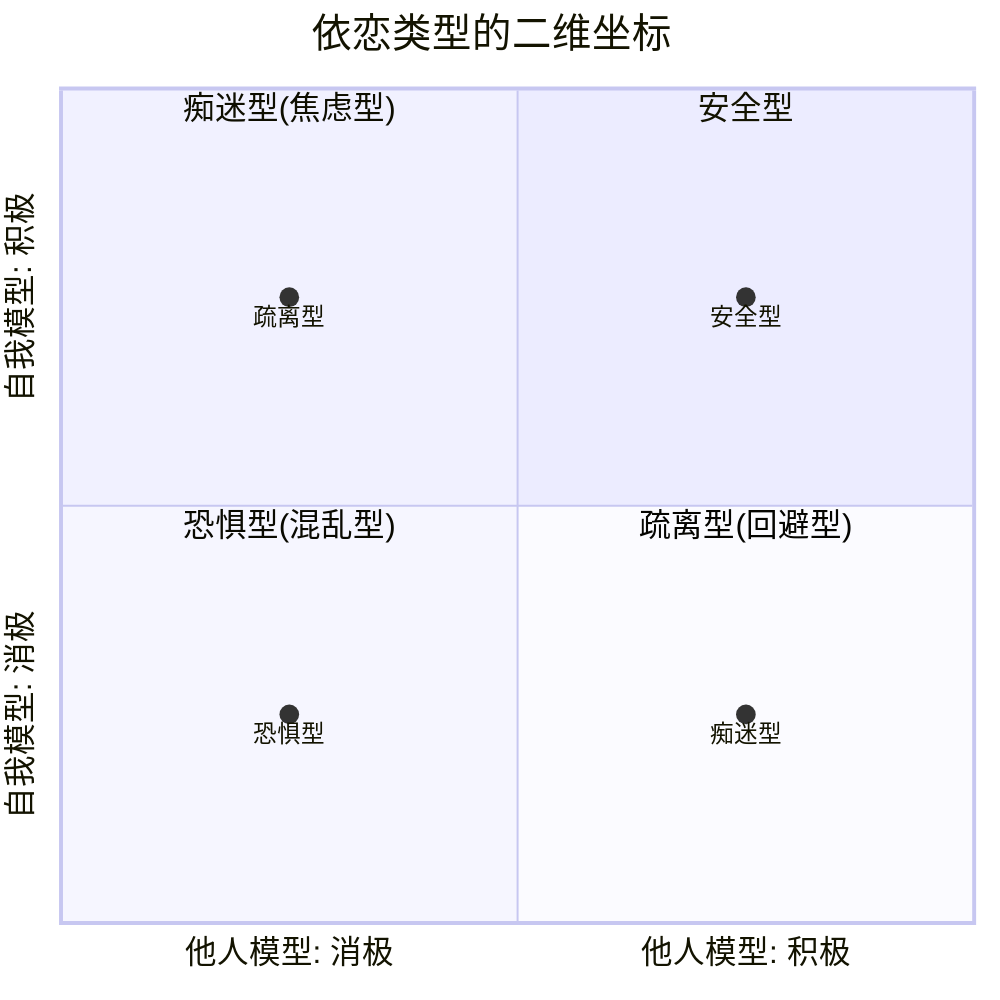
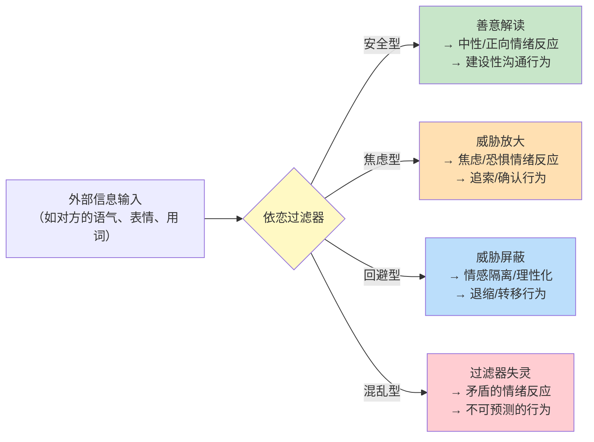

## 六、依恋理论与沟通

依恋理论是理解人际沟通最深刻的心理学框架之一。它回答了一个根本性问题：**为什么同样的沟通行为，在不同人身上会产生截然不同的反应？** 一个人收到伴侣"今晚加班"的消息，有人平静接受，有人焦虑追问，有人冷淡回应——差异的根源不在于消息本身，而在于每个人内心深处对亲密关系的**安全感基线**不同。这个基线，就是依恋模式。

本节从依恋理论的学术源头出发，系统阐述四种依恋类型的形成机制、神经基础、对沟通行为的具体影响，以及依恋模式的可塑性。这是后续"依恋觉察与沟通调整"（第五节）和"亲密关系中的依恋模式冲突"（案例二）的理论根基。

---

### 6.1 依恋理论的学术源流

#### 6.1.1 鲍尔比的奠基：依恋行为系统

约翰·鲍尔比（John Bowlby, 1907-1990）是依恋理论的创始人。他在20世纪50-60年代提出，人类婴儿天生具有一套**依恋行为系统**（Attachment Behavioral System），这套系统是进化选择的产物——在人类漫长的演化历史中，与照顾者保持亲近的婴儿更有可能存活下来。

鲍尔比的核心主张包含三个关键论点：

**第一，依恋是一种基本需求，不是附属品。** 在鲍尔比之前，精神分析学派认为婴儿依恋母亲是因为她提供食物（"二次驱力理论"）。鲍尔比彻底否定了这一观点。他的同事哈里·哈洛（Harry Harlow）在1958年用恒河猴实验证明了这一点：幼猴在有食物的铁丝猴"母亲"和没有食物的绒布猴"母亲"之间，绝大多数时间选择绒布母亲。**接触舒适感比食物更重要**——这一发现颠覆了当时的心理学共识。

**第二，依恋的核心功能是提供"安全基地"。** 鲍尔比用了一个精确的比喻：依恋对象就像一个安全基地（Secure Base），婴儿从这个基地出发去探索世界，遇到威胁时再回来寻求庇护。这个"探索-回归"的循环是健康发展的基础。如果安全基地不稳定——照顾者有时在、有时不在，有时温暖、有时冷漠——婴儿就无法形成稳定的探索模式，进而影响一生的人际互动。

**第三，依恋模式会内化为"内部工作模型"。** 婴儿通过与照顾者的反复互动，形成一套关于两个核心问题的内隐信念：

| 核心问题 | 积极信念 | 消极信念 |
|----------|----------|----------|
| 关于自我：我值得被爱吗？ | "我是有价值的，我值得被关心" | "我不够好，我需要做些什么才能被爱" |
| 关于他人：别人可靠吗？ | "他人是可以信赖的，会在需要时出现" | "他人是不可靠的/不可预测的" |

这套内部工作模型一旦形成，就会像一副"有色眼镜"一样，自动过滤和解读后续所有的人际信息。它不是有意识的信念，而是深深嵌入神经系统的**默认假设**。

#### 6.1.2 安斯沃斯的贡献：依恋类型的实证分类

鲍尔比的同事玛丽·安斯沃斯（Mary Ainsworth）通过一个里程碑式的实验——**陌生情境实验**（Strange Situation Procedure, 1978）——将鲍尔比的理论推进到了可操作的分类体系。

实验设计：让12-18个月的婴儿与母亲一起进入一个陌生房间，经历三个阶段：母亲在场→母亲离开→母亲返回。观察婴儿在母亲离开时的反应和母亲返回时的**重聚行为**（Reunion Behavior）。

安斯沃斯识别出三种基本依恋类型：

**安全型（Secure, 约60-65%的婴儿）：**
- 母亲离开时表现出适度的不安，但能自我调节
- 母亲返回时主动寻求接触，很快平静下来
- 随后能继续探索环境
- 内部工作模型：自我积极 + 他人积极

**焦虑-矛盾型（Anxious-Ambivalent/Resistant, 约10-15%）：**
- 母亲离开时极度痛苦，难以自我安抚
- 母亲返回时表现出矛盾行为：既寻求接触又表现出愤怒和抗拒
- 即使母亲在场也难以安心探索
- 内部工作模型：自我消极 + 他人消极（不确定）

**回避型（Avoidant, 约20-25%）：**
- 母亲离开时表面上不太在意
- 母亲返回时主动回避接触，转向玩具或其他事物
- 但生理指标（心率、皮质醇水平）显示其压力水平与焦虑型相当
- 内部工作模型：自我积极（独立的）+ 他人消极（不可靠的）

后来，梅因和所罗门（Main & Solomon, 1986）补充了第四种类型：

**混乱型/混乱-无组织型（Disorganized/Disoriented, 约5-10%）：**
- 在母亲返回时表现出混乱、矛盾、无方向的行为
- 可能出现"冻结"、原地转圈、靠近母亲时突然倒退等异常行为
- 通常与照顾者的创伤经历或虐待有关
- 内部工作模型：自我消极 + 他人消极（矛盾且不可调和）

#### 6.1.3 从婴儿到成人：成人依恋理论

依恋理论最初仅用于描述婴儿-照顾者关系。1987年，辛迪·哈赞（Cindy Hazan）和菲利普·谢弗（Philip Shaver）发表了一篇开创性论文，证明依恋模式在成人浪漫关系中同样存在。他们发现，成人浪漫关系与婴儿-照顾者关系具有相同的核心特征：

- **感到安全**：在伴侣身边感到舒适和安全
- **分离焦虑**：与伴侣分离时感到不安
- **安全基地效应**：伴侣的支持让自己更有信心面对外部挑战

同年，玛丽·梅因（Mary Main）开发了**成人依恋访谈**（Adult Attachment Interview, AAI），通过分析成人叙述童年经历的方式（而非经历本身）来评估其依恋模式。这个工具的核心洞察是：**不是童年发生了什么决定了依恋类型，而是你如何理解和讲述这些经历。** 一个经历了困难童年但能连贯、反思性地叙述的人，被归为"获得性安全"（Earned Secure）——这证明了依恋模式的可塑性。

#### 6.1.4 巴塞洛缪的四分类模型：二维坐标系

1991年，金·巴塞洛缪（Kim Bartholomew）在哈赞-谢弗框架的基础上，提出了一个更精确的分类模型。她将成人依恋分为四个象限，由两个独立维度构成：

| 维度 | 高 | 低 |
|------|------|------|
| **自我模型**（我值得被爱吗？） | 积极自我意象 | 消极自我意象 |
| **他人模型**（别人可靠吗？） | 积极他人意象 | 消极他人意象 |

四个象限：

| 依恋类型 | 自我模型 | 他人模型 | 核心特征 |
|----------|----------|----------|----------|
| **安全型** | 积极 | 积极 | 对亲密和独立都感到舒适 |
| **痴迷型**（Preoccupied） | 消极 | 积极 | 渴望亲密，过度依赖他人评价 |
| **疏离型**（Dismissing） | 积极 | 消极 | 强调独立，贬低亲密关系的价值 |
| **恐惧型**（Fearful） | 消极 | 消极 | 想要亲密但害怕受伤，行为矛盾 |

这个模型的价值在于：它解释了为什么同为"不安全依恋"，痴迷型和疏离型的行为模式完全相反——**痴迷型把他人看得很高、把自己看得很低，所以拼命追；疏离型把自己看得很高、把他人看得很低，所以轻易逃。** 而恐惧型则是两个维度都消极，既追又逃，行为最为混乱。

> **注意**：在日常语境和本章后续内容中，我们通常使用更简洁的四类命名：安全型、焦虑型、回避型、混乱型。其中"焦虑型"对应巴塞洛缪的"痴迷型"，"回避型"包含"疏离型"和部分"恐惧型"特征。这种简化便于实操应用，但在理论分析时应了解其背后更精确的分类体系。

---

### 6.2 四种依恋类型的深度解析

#### 6.2.1 安全型依恋：沟通的"默认设置"

安全型依恋并非一种"完美状态"，而是一种**灵活的适应能力**。安全型依恋者的核心特征不是"从不焦虑"，而是**在焦虑出现时仍能保持基本的沟通功能**。

**形成条件：**
- 照顾者的回应具有**一致性**和**敏感性**——不是每时每刻都在，而是在婴儿需要时"足够频繁地"出现
- 温尼科特（Winnicott）的"足够好的母亲"（Good Enough Mother）概念：不需要完美，只需要达到一定阈值的回应质量
- 允许婴儿经历适度的挫折，但在挫折后提供修复性体验

**沟通特征：**

安全型依恋者在沟通中表现出四个关键能力：

1. **情感表达的直接性**：能用清晰的语言表达自己的需求和感受，而非通过暗示、指责或沉默来传递信息。"我今天感到有些疲惫，想早点休息"而不是"你从来不在乎我的感受"。

2. **冲突中的建设性**：在意见不合时能够就事论事，不将分歧升级为人身攻击或关系威胁。他们能区分"我们在这个问题上有分歧"和"你这个人有问题"。

3. **对模糊信息的容忍度**：当对方的回应不够明确时，安全型倾向于善意解读（"可能他在忙"），而非自动填充最坏的假设。这种"善意归因偏差"是安全型沟通中最重要的缓冲机制。

4. **修复能力**：冲突后能主动发出修复信号——道歉、自我反思、主动靠近。约翰·戈特曼（John Gottman）的研究表明，**修复尝试的成功率是预测关系稳定性的最强指标**，而安全型依恋者的修复尝试成功率远高于其他类型。

**潜在盲区：**
- 可能高估他人的安全感水平，在与不安全依恋者沟通时低估触发阈值
- 可能对焦虑型的反复确认请求缺乏耐心（"我已经说了我爱你，为什么还要问？"）
- 可能对回避型的沉默反应感到困惑（"我只是想聊聊，为什么要躲？"）

#### 6.2.2 焦虑型依恋：被恐惧驱动的"追"

焦虑型依恋者（巴塞洛缪模型中对应"痴迷型"）的核心动力是**对被抛弃的恐惧**。他们的内部工作模型告诉他们："我是不够好的，随时可能被抛弃，我必须不断确认关系是安全的。"

**形成条件：**
- 照顾者的回应是**不一致的**——有时热情回应，有时漠不关心，有时过度侵入
- 这种不可预测性使婴儿无法形成"照顾者一定会来"的信念，只能通过升级依恋行为（哭得更大声、更频繁地寻求注意）来增加获得回应的概率
- 婴儿学会了"信号强度与被回应的概率成正比"，这个模式会延续到成人关系中

**神经科学基础：**
焦虑型依恋者的**杏仁核对分离信号的敏感度显著高于安全型**。神经影像学研究（Vrtička et al., 2012）显示，当焦虑型依恋者看到伴侣的负面表情时，其杏仁核激活程度是安全型的1.5-2倍。同时，他们的**前额叶皮层对杏仁核的抑制功能较弱**，意味着他们更难通过理性思维来调节情绪反应。

此外，焦虑型依恋者的**催产素系统**（oxytocin system）运作方式也不同。催产素通常被称为"拥抱激素"，在安全型依恋者中促进信任和放松。但在焦虑型中，催产素反而可能增强对社交威胁的警觉性——这被称为"催产素悖论"（Shamay-Tsoory & Abu-Akel, 2016）。

**沟通中的具体表现：**

| 沟通场景 | 安全型反应 | 焦虑型反应 |
|----------|-----------|-----------|
| 伴侣3小时没回消息 | "可能在忙，晚点再联系" | "是不是我说错了什么？"→ 连续发消息 |
| 收到模糊的工作反馈 | "我需要更多信息来理解你的意思" | "他是不是对我不满意？我会不会被辞退？" |
| 伴侣说"我需要独处" | "好的，我去做自己的事" | "他是不是厌倦我了？我要不要做点什么？" |
| 争吵后的沉默期 | 给彼此空间，等待冷静后再谈 | 沉默 = 关系即将结束的信号 → 急于修复 |
| 长期关系中的平淡期 | "激情会减退，这是正常的" | "他是不是不爱我了？我需要做点什么来重新点燃" |

焦虑型依恋者的沟通模式有一个核心矛盾：**他们越是通过追索来确认关系安全，越容易把伴侣推走，从而证实了自己"会被抛弃"的恐惧**。这是一种自我实现的预言。

#### 6.2.3 回避型依恋：用独立筑起的"墙"

回避型依恋者（巴塞洛缪模型中对应"疏离型"）的核心动力是**对被吞噬/失去自主性的恐惧**。他们的内部工作模型告诉他们："他人是不可靠的（或会侵入我的空间），我只能依靠自己。"

**形成条件：**
- 照顾者对婴儿的情感需求表现出**拒绝或不适**——不是虐待，而是对亲密感到不自在
- 常见模式：照顾者自身是回避型，或者文化/家庭规范要求"不要惯孩子"
- 当婴儿哭泣时，照顾者可能会说"别哭了，没什么大不了的"，或者直接忽视
- 婴儿学会了"表达需求不会被回应，反而可能被拒绝"，于是逐渐抑制依恋行为

**神经科学基础：**
回避型依恋者的神经系统采用了一种不同的策略：不是放大威胁信号（如焦虑型），而是**主动抑制情感加工**。fMRI研究（Gillath et al., 2005）显示，当回避型依恋者看到情感性图片时，其**前额叶抑制区域**（prefrontal inhibitory regions）激活程度更高，说明他们在主动压制情感反应。

这种抑制是有代价的。大量研究表明，回避型依恋者虽然在主观报告中表示"不太在意"，但其**生理指标**（心率、皮肤电导、皮质醇水平）与焦虑型相当甚至更高。他们不是没有情感，而是在意识层面切断了与情感的连接。

**沟通中的具体表现：**

| 沟通场景 | 安全型反应 | 回避型反应 |
|----------|-----------|-----------|
| 伴侣表达情感需求 | "我听到了，我们来聊聊" | 感到压力 → "你太敏感了" 或沉默 |
| 争吵升级时 | 继续对话，尝试理解对方 | "我需要冷静一下" → 离开/关闭 |
| 伴侣问"你在想什么" | 分享自己的想法和感受 | "没什么" / "我不知道" |
| 收到亲密表白 | 感到温暖并回应 | 感到不适 → 转移话题或开玩笑 |
| 关系中的冲突 | 面对冲突，寻找解决方案 | 绕行策略：冷处理、转移注意力、沉默 |

回避型依恋者的沟通模式也有一个核心矛盾：**他们越是通过独立来保护自己，越容易让伴侣感到被拒绝，从而推动伴侣升级追索行为，最终证实了"关系会侵入我的空间"的恐惧**。焦虑型和回避型的恐惧恰好互为触发器，这解释了为什么"焦虑-回避配对"是关系治疗中最常见的来访模式。

#### 6.2.4 混乱型依恋：无法解决的矛盾

混乱型依恋（Disorganized Attachment）是最复杂、最具挑战性的依恋类型。它的核心特征是**没有一致的应对策略**——焦虑型追、回避型逃，而混乱型在同一段关系甚至同一段对话中交替使用两种策略，且无法自我预测。

**形成条件：**
- 照顾者同时是**安全的来源和恐惧的来源**——这在虐待或严重忽视的家庭中最常见
- 婴儿面临一个无法解决的矛盾：本能告诉他"去靠近照顾者寻求保护"，但经验告诉他"靠近照顾者会受到伤害"
- 这种"无解的困境"导致依恋行为系统崩溃，婴儿无法形成任何一致的应对策略
- 部分混乱型也与照顾者自身的未处理创伤有关——照顾者可能并非有意伤害，但在应激状态下会表现出令人恐惧的行为（如解离状态下的"冻结"表情）

**沟通中的具体表现：**

混乱型依恋者在沟通中表现出最强烈的矛盾和不可预测性：

- **在同一段对话中交替追和逃**：一会儿强烈索求回应（"你为什么不说话！"），一会儿又推开对方（"算了，我不想说了"）
- **情绪剧烈波动且与事件不成比例**：一个小小的延迟回复可能引发情绪风暴，但同样的延迟在另一天可能完全被忽略
- **自我叙述的不连贯性**：在讨论关系问题时，叙述可能突然中断、跳跃，或出现不合逻辑的转折
- **对亲密的矛盾反应**：既极度渴望亲密又在亲密发生时感到恐惧，可能在接受拥抱的同时身体紧缩

**重要提醒：** 混乱型依恋通常与早期创伤密切相关。如果自我评估或观察到自己/伴侣可能属于混乱型，强烈建议寻求专业心理咨询师的帮助。混乱型依恋的自我调节难度远高于焦虑型和回避型，伴侣的支持虽然重要，但通常不足以替代专业的创伤治疗。

---

### 6.3 依恋模式如何塑造沟通：机制拆解

依恋模式对沟通的影响不是简单的"性格差异"，而是深植于神经系统的**自动化过滤机制**。理解这一机制，才能真正理解为什么"换个说法"有时候比"换个内容"更重要。

#### 6.3.1 信息过滤机制

每个人的依恋系统都像一个**前注意过滤器**，在意识介入之前就已经决定了哪些信息被放大、哪些被忽略：

**具体示例：伴侣说"我觉得你最近不太关心我"**

- **安全型过滤**：这是一个关于感受的分享 → "我听到你觉得被忽略了，能具体说说是什么让你有这种感觉吗？"
- **焦虑型过滤**：这预示着关系即将破裂 → "不是的！我一直在关心你！你是不是想分手？你告诉我我哪里做得不好我改！"
- **回避型过滤**：这是对我空间的侵入 → "你总是这样，给你做了那么多事你看不到吗？"（用指责替代感受）或者 "嗯，我会注意的"（敷衍性回应，快速关闭对话）
- **混乱型过滤**：无法确定这是威胁还是机会 → 可能先追索确认，被回应后又推开，整个回应过程混乱无方向

#### 6.3.2 情绪调节策略的差异

依恋类型的核心差异之一是**情绪调节策略**（Emotion Regulation Strategies）。大卫·舒尔茨（David Schore）的研究表明，依恋模式本质上是一套情绪调节的神经回路。

| 调节维度 | 安全型 | 焦虑型 | 回避型 | 混乱型 |
|----------|--------|--------|--------|--------|
| **主要策略** | 灵活切换：既可自我调节也可寻求支持 | 过度外求：依赖他人来调节情绪 | 过度内控：独自处理，压抑情感表达 | 策略冲突：两种策略交替且都不稳定 |
| **情绪容忍窗口** | 宽：能承受较大的情绪波动 | 窄：情绪快速到达峰值 | 表面宽/实际窄：主观报告低情绪但生理高激活 | 极窄且不稳定 |
| **负面情绪归因** | 情境化："这件事让我难过" | 个人化："我不值得被爱" | 外部化："对方太情绪化" | 矛盾化：无法确定归因 |
| **寻求支持的阈值** | 适中：在需要时主动寻求 | 低：频繁寻求，即使问题可控 | 高：尽量不寻求，视求助为脆弱 | 不稳定：有时极度依赖有时完全封闭 |

#### 6.3.3 冲突沟通模式

冲突是依恋模式最充分暴露的场景。戈特曼（Gottman）的"末日四骑士"——批评、蔑视、防御、石墙——与依恋类型有明确的对应关系：

| 戈特曼的"四骑士" | 典型依恋类型 | 心理机制 | 示例 |
|-----------------|-------------|----------|------|
| **批评**（Criticism） | 焦虑型 | 用攻击掩盖恐惧："你从来不关心我" = "我害怕你不爱我" | "你总是只想着自己！" |
| **蔑视**（Contempt） | 回避型 | 用优越感防御脆弱："你太情绪化了" = "我处理不了你的情绪" | "你又来了，能不能成熟点？" |
| **防御**（Defensiveness） | 焦虑型/回避型 | 拒绝承认任何责任 = 保护自我模型的完整性 | "这不是我的错，是你先开始的" |
| **石墙**（Stonewalling） | 回避型 | 完全关闭情感通道 = 生理上的"情感过载"导致关机 | 沉默、转身、离开房间 |

戈特曼的研究发现，**蔑视是关系破坏力最强的行为**（预测准确率高达93%）。而蔑视通常出现在回避型依恋者对焦虑型伴侣的情感需求长期压抑之后——它不是突然出现的，而是长期积累的结果。

#### 6.3.4 非语言沟通中的依恋印记

依恋模式不仅影响语言内容，还深刻影响非语言沟通：

**身体距离偏好：**
- 安全型：适中的身体距离，在舒适时主动靠近
- 焦虑型：倾向于缩短身体距离，频繁寻找身体接触
- 回避型：倾向于保持或增大身体距离，在被靠近时身体微微后倾
- 混乱型：距离偏好不一致，可能在靠近的同时身体紧缩

**眼神接触模式：**
- 安全型：自然的眼神接触，在说话和倾听时都有
- 焦虑型：过度寻求眼神接触以确认对方在关注自己
- 回避型：减少或回避眼神接触，尤其在讨论情感话题时
- 混乱型：眼神接触模式不一致，可能出现凝视后突然移开

**语调和语速：**
- 安全型：语调平稳，语速适中，在情绪波动时仍能保持基本的语调控制
- 焦虑型：在激活状态下语速加快、音量升高、语调上扬（像在追问）
- 回避型：语调平坦、音量降低、语速放慢或出现明显停顿（情感通道在关闭）
- 混乱型：语调变化剧烈且不可预测

---

### 6.4 依恋模式的形成与可塑性

#### 6.4.1 形成的关键窗口期

依恋模式的主要形成期在**出生后第一年**（0-12个月），但并非一成不变。发展心理学研究（Sroufe et al., 2005）对依恋模式的形成和变化进行了长达30年的纵向追踪，发现：

- **0-3个月**：婴儿尚未形成明确的依恋偏好，对任何照顾者的反应相似
- **3-6个月**：开始出现对特定照顾者的偏好，但尚未形成稳定的依恋模式
- **6-12个月**：依恋模式初步形成，可以通过陌生情境实验进行评估
- **12-24个月**：依恋模式趋于稳定，但仍具有相当的可塑性
- **2岁以后**：依恋模式开始泛化到更广泛的人际关系中

**关键发现：** 依恋模式不是由单一事件决定的，而是由**照顾者与婴儿之间数千次微互动的累积模式**决定的。一次忽视不会形成不安全依恋，但反复出现的模式会。

#### 6.4.2 依恋模式的变化轨迹

Sroufe的纵向研究揭示了依恋模式变化的几个规律：

1. **安全→不安全的变化**通常与以下因素有关：母亲抑郁、家庭重大变故（离婚、丧亲）、照顾者更替、虐待或忽视的出现
2. **不安全→安全的变化**通常与以下因素有关：新的稳定照顾者出现、父母接受心理治疗后改善了养育质量、与安全型伴侣建立长期关系
3. **变化不是一夜之间发生的**：依恋模式的显著转变通常需要1-2年的持续新经验积累

#### 6.4.3 获得性安全依恋（Earned Security）

"获得性安全"是依恋研究中最具希望的发现之一。玛丽·梅因在成人依恋访谈研究中发现，**约30%的成人虽然童年经历了明显不安全的依恋经历，但在成年后被评估为安全型依恋**。

获得性安全的标志是：
- 能够连贯地叙述童年经历，包括负面部分
- 叙述中表现出**反思功能**（Reflective Functioning）：理解自己的行为和感受与早期经历之间的联系
- 不回避也不沉溺于过去的痛苦
- 能够将"过去的恐惧"与"现在的现实"分离

获得性安全的实现路径包括：

| 路径 | 机制 | 典型场景 |
|------|------|----------|
| **安全型伴侣** | 安全型伴侣提供了一种新的依恋体验，反复覆盖旧有的不安全模式 | 焦虑型与安全型伴侣相处5年后，焦虑反应频率显著降低 |
| **心理治疗** | 治疗关系本身提供安全基地，同时帮助来访者理解并重构早期经历 | 通过情绪聚焦疗法（EFT）改善伴侣依恋互动模式 |
| **正念练习** | 正念训练增强前额叶对杏仁核的调节能力，扩大刺激-反应之间的觉察窗口 | 每天10分钟正念冥想，3个月后情绪调节能力显著提升 |
| **有意识的关系练习** | 在日常互动中反复练习"反直觉"的沟通行为 | 焦虑型练习延迟反应，回避型练习情感表达 |

**神经可塑性的证据：** Davidson和Begley（2012）的研究表明，持续的情绪调节练习可以改变大脑的默认反应模式。具体来说，正念练习可以增强左侧前额叶皮层的活动（与积极情绪和情绪调节相关），同时降低杏仁核的基线激活水平。这意味着**获得性安全不仅是心理层面的改变，更是神经系统层面的重塑**。

---

### 6.5 依恋理论的跨文化视角

依恋理论最初基于西方（主要是美国和英国）样本建立，但后续的跨文化研究（van IJzendoorn & Sagi-Schwartz, 2008）在多个国家和文化中验证了其基本框架，同时揭示了重要的文化差异：

**安全型依恋的普遍性：** 安全型依恋在所有被研究的文化中都是最常见的类型（占比40-75%），说明依恋行为系统的进化基础具有跨文化普遍性。

**不安全依恋类型的文化差异：**

| 文化维度 | 对回避型的影响 | 对焦虑型的影响 |
|----------|--------------|--------------|
| **个人主义 vs 集体主义** | 个人主义文化（如德国、北欧）中回避型比例较高——独立性被文化价值观强化 | 集体主义文化（如日本、中国）中焦虑型比例较高——相互依赖被文化鼓励 |
| **情感表达规范** | 情感表达内敛的文化中，回避型行为可能被误认为"正常" | 情感表达开放的文化中，焦虑型行为可能更早被识别 |
| **养育方式** | 鼓励独立的文化中，部分回避型可能是"文化适应型"而非不安全依恋 | 强调家庭联结的文化中，焦虑型行为可能被解读为"孝顺"或"重视关系" |

**对中国读者的启示：** 中国文化强调"以和为贵""不给他人添麻烦"，这些价值观可能使回避型依恋行为更容易被掩盖——"我不表达感受"被解读为"成熟""懂事"而非"情感压抑"。同时，中国文化中的"望子成龙"养育模式可能在无意中制造条件性爱（"你考得好我才高兴"），增加焦虑型依恋的风险。识别这些文化因素，有助于更准确地理解自己和他人的依恋模式。

---

### 6.6 依恋理论在沟通实践中的应用框架

理论的价值在于指导实践。以下框架将依恋理论的核心洞察转化为沟通中的可操作判断：

#### 6.6.1 识别依恋模式的三个维度

不需要进行专业心理测评，通过以下三个维度的日常观察，可以对一个人的依恋模式做出初步判断：

**维度一：面对不确定性的默认反应**
- 伴侣/同事的行为不够明确时，你的第一反应是什么？
- 安全型：暂停，等待更多信息
- 焦虑型：立即寻找确认（发消息、打电话、问别人）
- 回避型：告诉自己"无所谓"，转移注意力到其他事情上
- 混乱型：反应不一致，有时追有时逃

**维度二：对亲密的舒适度**
- 在关系中，什么样的状态让你最舒服？
- 安全型：亲密和独立都能接受，有弹性
- 焦虑型：亲密是好的，但总觉得不够
- 回避型：独立是最好的，过多亲密会感到窒息
- 混乱型：亲密和独立都不舒服，总是有某种不安

**维度三：冲突中的行为模式**
- 当关系出现分歧或争吵时，你倾向于怎么做？
- 安全型：面对问题，表达感受，寻求解决
- 焦虑型：升级情绪，追着要答案，害怕冲突导致分离
- 回避型：关闭对话，沉默或离开，事后可能单方面"和好"但不真正讨论
- 混乱型：行为不可预测，可能在一段对话中反复切换

#### 6.6.2 沟通中的依恋诊断快速清单

在重要沟通前（如绩效面谈、亲密关系对话、冲突调解），花30秒快速评估双方的依恋状态：

【自我评估】
□ 我现在是否感到安全/被接纳？
□ 我的身体信号是什么？（心跳加速=焦虑型信号；肩颈紧缩=回避型信号）
□ 我的自动化反应是什么？（想追/想逃/想攻击/想关闭？）
□ 我真正想要的是什么？（通常是被看见、被尊重、被爱）

【对方评估】
□ 对方的行为是否符合某种依恋模式？（追=焦虑；逃=回避；又追又逃=混乱）
□ 对方的核心恐惧是什么？（被抛弃/被吞噬/被伤害）
□ 什么样的回应最能降低对方的依恋警报？

#### 6.6.3 依恋视角下的沟通策略选择矩阵

| 你的依恋类型 | 对方的依恋类型 | 最容易踩的坑 | 推荐的沟通策略 |
|-------------|-------------|------------|-------------|
| 安全 → 安全 | 无特殊风险 | 可能低估他人的依恋敏感度 | 正常沟通即可，注意对方的非语言信号 |
| 安全 → 焦虑 | 对方可能过度解读你的中性行为 | 主动提供明确信息，减少信息真空 |
| 安全 → 回避 | 对方可能将你的亲密需求视为压力 | 给选择不给命令，用具体事件而非抽象感受 |
| 焦虑 → 安全 | 你可能因对方的稳定而产生"不够在乎"的错觉 | 信任对方的安全信号，练习不追问 |
| 焦虑 → 回避 | 经典的"追逐-回避循环" | 双方同时调整：焦虑型学会不追，回避型学会不逃 |
| 焦虑 → 焦虑 | 双方可能互相放大焦虑 | 需要明确的"谁先冷静"规则，避免互相煽动 |
| 回避 → 安全 | 你可能因对方的靠近而过度退缩 | 利用安全型伴侣作为练习情感表达的安全环境 |
| 回避 → 焦虑 | 同焦虑→回避，经典冲突配对 | 学习发送"最小连接信号"，而非完全关闭 |
| 回避 → 回避 | 双方可能维持表面和平但情感疏离 | 需要一方主动打破"冷和平"，尝试小步情感分享 |

> 更详细的混合配对沟通策略，参见第五节"依恋觉察与沟通调整"中的5.6节。更完整的冲突案例拆解，参见实战案例二"亲密关系中的依恋模式冲突"。

---

### 6.7 依恋理论的局限性与常见误解

任何理论都有其适用边界。将依恋理论应用于沟通实践时，需要警惕以下陷阱：

#### 6.7.1 理论局限

1. **依恋类型不是非此即彼的标签。** 大多数人不是纯粹的某一类型，而是在不同维度上有不同程度的倾向。依恋更像一个**连续光谱**，而非四个离散的类别。一些研究者使用"维度模型"（如ECR量表的焦虑和回避两个维度得分）来替代类型分类，以获得更精确的描述。

2. **情境会改变依恋表达。** 同一个人在不同关系中可能表现出不同的依恋模式——对伴侣是焦虑型，对朋友是安全型，对领导是回避型。这说明依恋模式不是固定的人格特质，而是**关系特异性的**。

3. **文化因素的调节作用。** 如前文所述，文化价值观会强化或弱化某些依恋行为。在解读依恋模式时，必须考虑文化背景，避免将文化规范误读为不安全依恋。

4. **依恋理论不能解释所有的沟通问题。** 依恋只是影响沟通的众多心理因素之一。认知偏差、权力差异、人格特质、文化背景、沟通技巧水平等同样重要。将所有沟通问题都归因于依恋模式是一种过度简化。

#### 6.7.2 常见误解

| 误解 | 为什么是错的 | 正确理解 |
|------|------------|---------|
| "依恋类型是天生的" | 依恋类型主要由早期养育经验决定，不是基因编码 | 先天气质有影响（如高反应性婴儿更容易发展为焦虑型），但养育环境的塑造作用更大 |
| "我是焦虑型，所以我改不了" | 依恋模式具有可塑性，大量研究证据支持"获得性安全" | 依恋类型是起点不是终点，改变需要有意识的持续练习 |
| "回避型就是不爱" | 回避型有情感，只是表达方式不同 | 回避型的爱更常通过行动而非语言表达：帮忙解决问题、默默做事、在关键时刻出现 |
| "焦虑型就是太黏人" | 焦虑型的需求是真实的，问题在于表达方式 | 目标不是压抑需求，而是学会用建设性方式表达需求 |
| "混乱型就是精神问题" | 混乱型依恋与早期创伤相关，但不等于精神疾病 | 混乱型需要专业支持，但不应被污名化 |
| "给伴侣贴上依恋类型就够了" | 知道类型是第一步，改变互动模式才是关键 | 依恋觉察的目的是理解和调整，不是用来给对方"诊断"或"归咎" |
| "安全型就不会有沟通问题" | 安全型也会遇到沟通困难，只是处理方式不同 | 安全型的优势是处理困难的方式更灵活，而非免于困难 |

---

### 6.8 本节小结

依恋理论为理解人际沟通提供了一个深层的解释框架。核心要点回顾：

1. **依恋是人类与生俱来的行为系统**，由鲍尔比提出、安斯沃斯实证、哈赞和谢弗扩展到成人关系。它不是一种"性格标签"，而是一套深植于神经系统的自动化关系策略。

2. **四种依恋类型由两个核心维度决定**：自我模型（我值得被爱吗？）和他人模型（别人可靠吗？）。安全型在两个维度上都积极，焦虑型贬低自己抬高他人，回避型抬高自己贬低他人，混乱型在两个维度上都消极。

3. **依恋模式通过三重机制影响沟通**：信息过滤（放大或屏蔽威胁信号）、情绪调节策略（外求或内控）、冲突行为模式（追、逃或混乱）。这些机制在意识介入之前就已经开始运作。

4. **依恋模式具有可塑性**。获得性安全依恋是真实的——通过安全型伴侣、心理治疗、正念练习或有意识的关系实践，不安全依恋可以向安全方向转变。神经可塑性研究为这一转变提供了生物学基础。

5. **依恋理论是工具，不是牢笼**。它的价值在于帮助你理解沟通行为背后的深层动力，从而做出更灵活的选择——而非用来给自己或他人贴一个不可改变的标签。

在下一节"依恋觉察与沟通调整"中，我们将把本节的理论框架转化为具体的识别方法和调整策略，帮助你在实时沟通中应用这些洞察。

***

**延伸阅读：**
- 《依恋》（Attachment）—— John Bowlby，依恋理论的奠基之作
- 《依恋与亲密关系》（Attached）—— Amir Levine & Rachel Heller，成人依恋的通俗解读
- 《情绪聚焦伴侣治疗》（The Practice of Emotionally Focused Couple Therapy）—— Sue Johnson，依恋理论在伴侣治疗中的系统应用
- 《爱的博弈》（What Makes Love Last?）—— John Gottman，关系稳定性的实证研究
- 《情感纽带的建立》（A Secure Base）—— John Bowlby，依恋理论的后期发展
