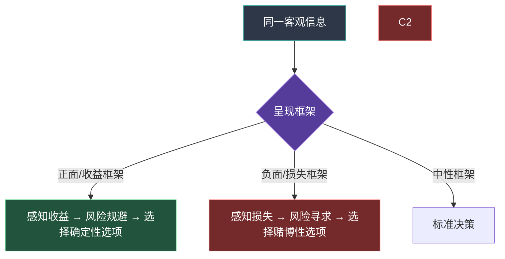
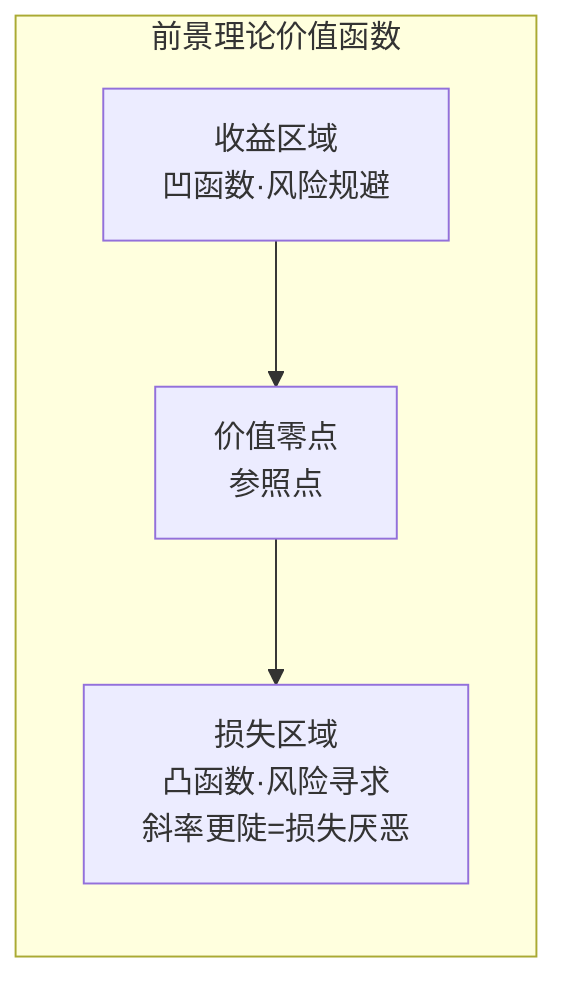
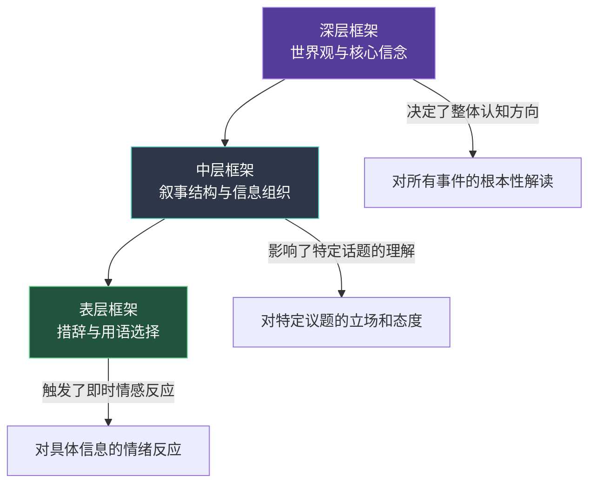
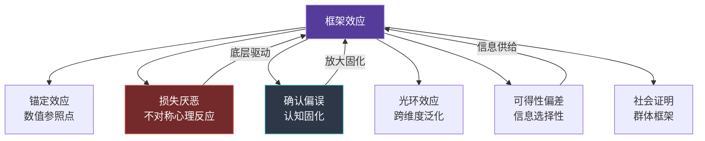

## 七、框架效应

### 7.1 什么是框架效应

框架效应（Framing Effect）是认知心理学和行为经济学中最具影响力的发现之一。它的核心命题是：**同一客观信息，因呈现方式（即"框架"）的不同，会导致接收者做出截然不同的判断和决策**。信息的"实质"没有改变，但信息的"包装"改变了人对它的反应。

这个概念最早由 Daniel Kahneman 和 Amos Tversky 在 1981 年发表的经典论文《The Framing of Decisions and the Psychology of Choice》中系统提出。他们通过"亚洲疾病问题"（Asian Disease Problem）实验，证明了框架效应的强大力量，这一实验至今仍是行为科学领域被引用最多的实验之一。

#### 7.1.1 经典实验：亚洲疾病问题

实验设定如下：假设美国正在准备应对一种罕见的亚洲疾病，预计将导致 600 人死亡。现有两种方案可供选择。参与者被随机分为两组，分别看到不同框架下的方案描述：

| 维度 | 收益框架组 | 损失框架组 |
|------|-----------|-----------|
| 方案A | 200人将被救活 | 400人将会死亡 |
| 方案B | 有1/3概率600人全部被救活，2/3概率无人被救活 | 有1/3概率无人死亡，2/3概率600人全部死亡 |

注意：方案A在两组中的客观结果完全相同（200人存活=400人死亡），方案B的客观结果也完全相同。但实验结果出现了显著差异：

- **收益框架组**：72% 的人选择方案A（确定性收益偏好）
- **损失框架组**：78% 的人选择方案B（风险寻求偏好）

仅仅因为"救活"和"死亡"这两个词的切换，人们的风险偏好就发生了逆转。这一结果无法用传统理性决策理论（期望效用理论）解释——如果人是完全理性的，两种框架下的选择应该一致。

#### 7.1.2 框架效应的普遍性

后续大量研究证实，框架效应并非实验室中的奇观，而是普遍存在于日常决策中的系统性现象：

- **医疗决策**：告知患者手术"90%存活率"时，同意手术的比例显著高于告知"10%死亡率"时。Levin, Schneider 和 Gaeth（1998）的元分析发现，这一效应在不同文化、年龄和教育水平的人群中均稳定存在。
- **消费行为**：牛肉标示"75%瘦肉"比标示"25%肥肉"更受消费者欢迎，尽管两者完全相同。Wansink 和 Park（2002）的研究发现，正面框架可以将购买意愿提升 20-30%。
- **法律判决**：模拟陪审团实验表明，同一证据用"95%准确率"或"5%错误率"呈现，会显著影响有罪判决率（Smith & Levin, 1996）。
- **投资决策**：描述为"管理费每年2%"与"每100元投资每年扣除2元"，虽然信息等价，但后者让投资者对费率的敏感度提高了约40%。
- **公共政策**：支持环保政策的民众比例在"保护环境能带来什么"的框架下，比"不保护环境会失去什么"的框架下高出 15-20 个百分点。

### 7.2 框架效应的理论基础

框架效应之所以成立，是因为人类决策并非纯理性过程，而是依赖于一系列心理机制。理解这些机制，才能理解为什么"换个说法"就能改变人的行为。

#### 7.2.1 前景理论（Prospect Theory）

前景理论是解释框架效应最核心的理论，由 Kahneman 和 Tversky 于 1979 年提出，Kahneman 因此获得 2002 年诺贝尔经济学奖。

前景理论包含三个关键原理：

**原理一：参照点依赖**

人对结果的评估不是基于结果的绝对值，而是基于相对于某个"参照点"的变化。框架的作用本质上就是设定参照点。当你告诉患者"手术成功率90%"，参照点被设定在"存活"这个基线上；当你说"手术死亡率10%"，参照点被设定在"死亡"这个基线上。

**原理二：损失厌恶（Loss Aversion）**

损失带来的心理痛苦约为等量收益带来快乐的 2-2.5 倍。这意味着"失去100元的痛苦"远大于"得到100元的快乐"。损失框架之所以更有冲击力，就是因为它激活了这种不对称的心理反应。

实验数据支撑：在 Tversky 和 Kahneman（1992）的实验中，参与者要求获得约 2.5 倍于赌注的潜在收益才愿意接受 50/50 的赌博。这证实了损失厌恶系数约为 2.25。

**原理三：价值函数的S型曲线**

前景理论的价值函数有两个特征：
- 在收益区域是凹函数（边际递减）：从0到100的快乐感 > 从100到200的快乐感
- 在损失区域是凸函数（边际递减的痛苦）：从0到-100的痛苦感 > 从-100到-200的痛苦感
- 损失区域比收益区域更陡峭（损失厌恶）

这意味着：当信息被框架为收益时，人们倾向于风险规避（"确定得到比赌一把好"）；当信息被框架为损失时，人们倾向于风险寻求（"不如赌一把，说不定能挽回损失"）。

#### 7.2.2 双系统理论（Dual Process Theory）

Kahneman 在《思考，快与慢》（Thinking, Fast and Slow）中提出的双系统理论为框架效应提供了另一层解释：

| 系统 | 特征 | 与框架效应的关系 |
|------|------|----------------|
| 系统1（快思考） | 自动、直觉、无需努力、易受情绪影响 | 直接受框架影响，自动对正面/负面框架产生不同情绪反应 |
| 系统2（慢思考） | 有意识、逻辑分析、需要认知资源 | 能够识别并纠正框架效应，但需要主动启动 |

框架效应之所以强大，是因为它主要通过系统1起作用——人们在没有意识到的情况下就被框架影响了判断。只有当系统2被激活（例如被明确提醒"请注意，这两种说法其实一样"），框架效应才会被削弱。

这也解释了一个重要现象：认知能力和教育水平并不能完全消除框架效应。即使是训练有素的医生，在面对精心设计的框架时，也会表现出框架效应——因为系统1的反应是自动的，系统2不一定总是启动。

#### 7.2.3 注意力与工作记忆限制

人类的工作记忆容量约为 7±2 个信息块（Miller, 1956），注意力资源有限。框架的作用之一是引导注意力分配：

- **收益框架**将注意力引导到"能得到什么"上
- **损失框架**将注意力引导到"会失去什么"上

当注意力被某个方向锁定后，与该方向一致的信息会被优先加工（一致性偏差），不一致的信息会被忽略或弱化。这就是为什么框架一旦设定，就很难被突破——人的认知系统会主动维护当前框架的一致性。

#### 7.2.4 情感启发式（Affect Heuristic）

Slovic 等人提出的"情感启发式"理论补充解释了框架效应的情绪机制：人对事物的判断很大程度上取决于对该事物的即时情感反应，而非客观分析。

框架通过触发不同的情感反应来影响判断：

- "90%成功率" → 触发安全感、信任 → 趋向接受
- "10%死亡率" → 触发恐惧、焦虑 → 趋向回避

这种情感反应是即时的、自动的，发生在理性分析之前，因此框架效应往往是"先入为主"的。

### 7.3 框架效应的分类体系

框架效应不是单一现象，而是包含多种类型的效应家族。理解不同类型有助于在不同场景中精准运用。

#### 7.3.1 按信息类型分类

Levin, Schneider 和 Gaeth（1998）提出了框架效应的三分法分类，这是目前学术界最广泛采用的分类体系：

**风险选择框架效应（Risky Choice Framing）**

同一选项用不同方式描述时，人们的风险偏好发生变化。亚洲疾病问题是典型案例。

机制：前景理论的损失厌恶和价值函数。
特征：收益框架下偏好确定性选项，损失框架下偏好风险性选项。

**属性框架效应（Attribute Framing）**

对同一事物的单一属性进行正面或负面描述，影响对该事物的整体评价。

经典实验：Levin 和 Gaeth（1988）让参与者评价一种牛肉。描述为"75%瘦肉"的牛肉获得的口味评分显著高于描述为"25%肥肉"的牛肉，尽管两者是同一种产品。

机制：单一属性的正面/负面标签激活了相应的情感联想网络，这种情感"污染"了对整体的评价。
特征：影响评价，但不一定改变选择。

**目标框架效应（Goal Framing）**

描述执行某行为的正面后果（收益框架）或不执行该行为的负面后果（损失框架），影响行为意愿。

经典应用——乳腺癌自检宣传（Meyerowitz 和 Chaiken, 1987）：
- 收益框架："进行乳腺自检，你可以及早发现肿块，提高治愈率"
- 损失框架："不进行乳腺自检，你可能错过及早发现肿块的机会，降低治愈率"

结果：损失框架组进行自检的比例显著高于收益框架组。

机制：损失框架通过激发更强的焦虑和行动动机来促进健康行为。

| 分类 | 核心影响 | 典型应用场景 | 心理机制 |
|------|---------|------------|---------|
| 风险选择框架 | 改变风险偏好 | 金融投资、医疗决策、政策选择 | 前景理论·损失厌恶 |
| 属性框架 | 改变评价判断 | 产品营销、绩效评估、新闻报道 | 情感联想·整体评价 |
| 目标框架 | 改变行为意愿 | 健康促进、安全教育、公益宣传 | 动机激活·行动导向 |

#### 7.3.2 按框架作用层次分类

**表层框架：措辞与用语**

在最浅的层次上，框架效应表现为用词选择的差异。同一事物用不同词汇描述，会引发不同反应。

| 负面措辞 | 正面措辞 | 情感差异 |
|---------|---------|---------|
| "裁员" | "组织优化" | 恐惧 vs 中性 |
| "问题" | "挑战" | 焦虑 vs 激励 |
| "失败" | "学习经历" | 羞耻 vs 成长 |
| "成本" | "投资" | 消耗感 vs 增值感 |
| "困难" | "机遇" | 退缩 vs 进取 |

**中层框架：叙事结构**

在更深的层次上，框架体现为信息的组织方式和故事叙述结构。同样的事实，先说坏消息还是先说好消息、强调哪些因素、忽略哪些因素，都会影响接收者的理解。

例如，一份公司季度报告可以被组织为：
- **问题导向框架**：先呈现亏损数据，再分析原因，最后提出对策
- **成就导向框架**：先呈现增长亮点，再承认挑战，最后展望未来
- **平衡框架**：同时呈现成绩和不足，给出全景视图

三种框架使用了相同的底层数据，但叙事结构的不同导致读者获得截然不同的印象。

**深层框架：世界观与认知图式**

在最深的层次上，框架体现为一套完整的世界观和认知图式。例如：

- **竞争框架**："世界是一个零和博弈，资源有限，你多我就少"
- **合作框架**："世界是一个正和博弈，通过协作可以创造更大的蛋糕"
- **成长框架**："能力是可以通过努力发展的，失败是学习的机会"
- **固定框架**："能力是天生的，失败证明了我不行"

深层框架是最持久、最难改变的，因为它嵌入在一个人的核心信念体系中。但它也是影响最大的——决定了一个人如何解读所有具体事件。

### 7.4 影响框架效应强弱的调节因素

框架效应并非在所有情境下都同样强大。研究表明，多种因素会调节框架效应的强度——了解这些调节因素，有助于判断何时框架效应最可能发生，何时可以忽略。

#### 7.4.1 个体因素

**认知需求（Need for Cognition, NFC）**

高认知需求的人倾向于进行深度思考，他们的系统2更活跃，因此对框架效应的抵抗力更强。Petrucci 等人（2016）的研究发现，高NFC个体在风险选择框架效应上的表现差异降低了约30%。

但需要注意：高认知需求并不能完全消除框架效应，尤其是在时间压力大或认知负荷高的情况下。

**情绪状态**

处于积极情绪中的人倾向于使用更直觉化的加工方式（系统1更活跃），因此对框架效应更敏感。相反，适度的消极情绪会促使人进行更审慎的分析（系统2启动），对框架效应的抵抗力增强——这被称为"消极情绪的适应性优势"。

这个发现的实际意义是：如果你想要对方更容易被你的框架影响，选择在对方心情好的时候沟通；如果你想要对方做出更理性的决策，适度的紧迫感或焦虑反而有帮助。

**专业知识**

领域专家在其专业范围内对框架效应的抵抗力更强，因为他们拥有更丰富的知识基础来独立评估信息。但在专业领域之外，专家和普通人一样容易受到框架效应的影响——Kahneman 和 Klein（2009）将这种条件称为"有效性条件"（Validity Conditions）。

**年龄**

研究显示框架效应存在年龄差异。年轻人（18-30岁）在收益框架下更容易表现出风险规避，而老年人（60岁以上）在损失框架下的风险寻求倾向较弱。可能的解释是老年人的情绪调节能力更强，对损失的情感反应有所钝化。

#### 7.4.2 情境因素

**时间压力**

时间压力是最强的框架效应放大器之一。当决策时间被压缩时，人们更依赖系统1的直觉判断，框架效应因此被放大。Svenson 和 Maule（1993）的研究发现，在时间压力下，框架效应的强度提高了约40%。

这解释了为什么高压销售场景（"限时优惠"）中的框架效应特别强烈——时间压力同时激活了损失厌恶（错过优惠的恐惧）和直觉决策（没时间理性分析）。

**信息复杂度**

当信息过于复杂、超出认知负荷时，人们会更依赖框架来简化决策。简单框架在高复杂度情境中的影响力大于低复杂度情境。

**决策重要性**

反直觉的是，决策越重要，框架效应不一定越弱。对于那些难以评估后果的复杂决策（如医疗方案选择），框架效应可能更强，因为人们在不确定中更加依赖外部提供的信息结构。

**社会规范与文化**

集体主义文化（如中国、日本）中的个体比个人主义文化（如美国）中的个体更容易受到社会性框架的影响。在群体决策情境中，如果群体成员普遍接受某种框架，个体对该框架的抵抗力会显著下降（群体框架效应）。

| 调节因素 | 增强框架效应 | 削弱框架效应 |
|---------|------------|------------|
| 时间 | 时间充裕（信息单一）/ 时间紧迫（直觉主导） | 适度压力（系统2启动） |
| 认知负荷 | 高负荷（依赖直觉） | 低负荷（深度分析） |
| 情绪 | 积极情绪（系统1活跃） | 适度消极情绪（系统2启动） |
| 专业知识 | 非专业领域 | 专业领域内 |
| 决策经验 | 首次面对该类决策 | 多次经验后的学习 |
| 社会影响 | 群体一致性高 | 独立决策 |

### 7.5 框架效应在沟通中的核心作用

在人际沟通中，框架效应不是边缘现象，而是贯穿始终的核心机制。每一次开口说话，你都在无形中选择一种框架；每一次倾听，你都在被某种框架所影响。

#### 7.5.1 沟通中的三种框架效应路径

**路径一：词汇选择触发即时情感反应**

语言不是中性的载体，每个词汇都携带着情感色彩。"裁员"和"组织优化"指向同一事件，但触发的情感反应截然不同。这种表层框架的影响是即时的、自动的，往往在对方还没来得及理性分析之前就已经塑造了他的初始态度。

**路径二：叙事结构塑造理解方向**

你先说什么、后说什么、强调什么、省略什么，构成了信息的叙事框架。在汇报工作中，先讲成果再讲问题（成就框架），与先讲问题再讲成果（问题框架），会让听众对同样的工作产出形成完全不同的印象。

**路径三：深层框架决定关系模式**

沟通中的深层框架关乎"我们之间是什么关系"。如果沟通的深层框架是"我对你错"（对抗框架），那么每一次对话都是博弈；如果是"我们一起解决问题"（协作框架），那么每一次对话都是合作。深层框架一旦形成，会持续影响后续所有互动。

#### 7.5.2 框架效应在沟通各环节的体现

| 沟通环节 | 框架效应的表现 | 影响方向 |
|---------|--------------|---------|
| 开场白 | 用正面还是负面方式引入话题 | 设定整场对话的情感基调 |
| 问题描述 | 用"问题/困难"还是"挑战/机会"来描述 | 影响对方的心态和应对方式 |
| 信息呈现 | 先说好消息还是坏消息 | 影响对方对整体情况的判断 |
| 反馈方式 | 指出不足还是肯定进步 | 影响对方的自信心和改进动力 |
| 提出请求 | 强调对方的收益还是不帮的损失 | 影响对方的配合意愿 |
| 冲突处理 | 归因于人还是归因于事 | 影响冲突走向（升级 vs 解决） |
| 结束方式 | 以承诺还是以威胁收尾 | 影响后续行动的驱动力 |

#### 7.5.3 框架效应与说服的关系

框架效应是说服心理学中的底层基础设施。大多数说服技巧——无论是讲故事、制造紧迫感、诉诸权威还是社会证明——都暗含着某种框架选择。

理解框架效应让你看到说服的"底层代码"：

- **故事说服**：本质上是用叙事框架替代数据框架，用具体案例替代抽象概率
- **紧迫感说服**：本质上是用损失框架（"错过就没了"）替代收益框架（"能得到什么"）
- **权威说服**：本质上是用信任框架替代评估框架——"因为是权威说的，所以不用自己判断"

当理解了框架效应，你就能看穿大多数说服技巧的底层逻辑，同时也能更自觉、更有效地构建自己的沟通策略。

### 7.6 框架效应的神经科学基础

近年来的脑成像研究为框架效应提供了神经科学层面的解释，揭示了大脑中哪些区域参与了框架的处理。

#### 7.6.1 关键脑区

**杏仁核（Amygdala）**

杏仁核是情绪处理的核心区域，特别是对威胁和恐惧相关刺激的加工。研究发现，损失框架会显著激活杏仁核，而收益框架的激活程度较弱。这从神经层面解释了为什么损失框架的情感冲击力更强。

De Martino 等人（2006）在《Science》上发表的fMRI研究发现：在风险选择框架任务中，杏仁核激活程度越强的参与者，越容易表现出框架效应。而当腹内侧前额叶皮层（vmPFC）活动增强时，框架效应减弱。

**前额叶皮层（Prefrontal Cortex, PFC）**

前额叶皮层负责执行控制、理性分析和冲动抑制。它相当于"系统2"的神经基础。当前额叶活动增强时（例如在没有时间压力、认知资源充足的情况下），人们更能抵抗框架效应的自动影响。

**脑岛（Insula）**

脑岛参与内感受（对身体内部状态的感知）和负性情感的加工。损失框架会激活脑岛，这与"身体感觉到不舒服"的直觉反应有关。框架效应的一部分是通过身体层面的情感反应传递的——不仅是"想到了"，更是"感觉到了"。

#### 7.6.2 神经科学启示

这些发现有几个实际意义：

1. **框架效应有其生理基础**，不是"不理性"的表现，而是人类认知系统的固有特征
2. **前额叶皮层是抵抗框架效应的关键**——任何增强前额叶活动的手段（充足睡眠、减少压力、正念冥想）都能提高框架抵抗力
3. **情感反应先于理性分析**——在沟通中，框架触发的情感反应往往在对方"想清楚"之前就已经影响了他的立场

### 7.7 如何识别他人对你的框架操控

框架效应是一把双刃剑——它可以被用于促进理解和合作，也可以被用于操控和误导。培养识别框架操控的能力，是自我保护的关键技能。

#### 7.7.1 框架操控的七个信号

**信号一：只呈现一面信息**

当你注意到对方只呈现支持某个结论的数据或案例，而刻意回避相反证据时，这是一种选择性框架操控。健康的信息呈现应该承认反面证据的存在。

**信号二：用极端词汇替代中性词汇**

"巨大"替代"显著"、"灾难"替代"问题"、"革命性"替代"有改进"——当词汇的情感强度远超实际情境时，对方可能在用语言框架放大情绪反应。

**信号三：刻意设定参照点**

"我们的竞品售价是2000元，我们的产品只要1500元"——参照点被设定为2000元，使1500元显得便宜。但如果不提竞品，你可能会觉得1500元本身就不低。

**信号四：时间框架的操纵**

将紧迫问题框架为"长期趋势"来降低警觉性（"全球变暖是几十年的事"），或将长期问题框架为"迫在眉睫"来制造恐慌（"今天不决定就来不及了"）。

**信号五：锚定数字**

在谈判或讨论价格时，先抛出一个极端数字作为"锚点"。Tversky 和 Kahneman 的研究表明，即使是随机数字（如转盘实验中的10和65）也会显著影响后续的数值估计。

**信号六：默认选项的设置**

行为经济学中"助推"（Nudge）理论的核心技术之一就是通过默认选项来利用框架效应。器官捐献的同意率在"默认捐献"的国家（如德国、奥地利）高达90%以上，而在"默认不捐献"的国家仅为10-15%。

**信号七：情感叙事替代数据**

用一个催人泪下的个人故事来替代统计数据——"一个孩子的故事"比"每年100万儿童受到影响"更能影响捐款意愿，尽管后者包含的信息量大得多。这被称为"可辨识受害者效应"（Identifiable Victim Effect），是框架效应的一个子类型。

#### 7.7.2 反框架自检清单

当你面对重要决策或关键信息时，可以通过以下问题来自检是否正在被框架操控：

□ 这个信息是否只呈现了一面？另一面是什么？
□ 如果用相反的框架来描述，结论会不同吗？
□ 对方使用的词汇是否带有不应有的情感色彩？
□ 是否存在刻意设定的参照点或锚定数字？
□ 我的情绪反应是否与信息的客观严重程度匹配？
□ 我是在快速直觉判断还是有时间深度分析？
□ 我是否在这个领域有足够的专业知识来独立评估？

### 7.8 框架效应的边界条件与局限

框架效应虽然强大，但并非无限。了解它的边界条件，有助于合理评估它的影响。

#### 7.8.1 框架效应失效的情境

**极端不一致时**

当框架与接收者的直接经验严重冲突时，框架效应会减弱或失效。如果一个人亲眼目睹了某个事件，你再怎么重新框架也很难改变他的直接感知。框架效应最有效的前提是接收者对信息没有独立的一手经验。

**高卷入度 + 高认知动机时**

当一个人对决策高度投入且有强烈动机进行深度分析时，框架效应的影响会减弱。例如，购房者在决定买房时（高卷入度）比买日用品时（低卷入度）更不容易被框架操控。

**框架被明确标识时**

当研究者明确告知参与者"请注意框架的影响"，或参与者本身受过框架效应的教育时，框架效应显著减弱。这是教育和培训的价值所在——仅仅知道框架效应的存在，就能部分削弱它的影响力。

**双面框架呈现时**

同时呈现正反两面信息（如"90%存活率和10%死亡率"）会抵消单一框架的效果。当接收者同时看到两种框架时，他们更可能进行独立的深度评估。

#### 7.8.2 框架效应的道德边界

在沟通中运用框架效应时，存在一条重要的道德分界线：

**道德使用的标准**：
- 框架所呈现的信息是真实的
- 框架没有刻意隐瞒关键的反面信息
- 框架的目的是促进理解和更好决策，而非误导
- 接收者在了解完整信息后仍会认为框架是合理的

**不道德操控的特征**：
- 选择性呈现信息以制造错误印象
- 利用对方的认知局限来引导不利于他们的决策
- 用情感操纵替代事实沟通
- 刻意阻止对方进行独立评估

判断准则：**如果你的框架在信息完全透明的情况下仍然站得住脚，它是道德的；如果你的框架依赖于信息不对称才能生效，它就是操控。**

### 7.9 框架效应与相关心理现象的关系

框架效应不是孤立存在的，它与多种认知偏差和心理现象密切相关。理解这些关系有助于建立更完整的认知心理学知识网络。

| 相关现象 | 与框架效应的关系 | 区别要点 |
|---------|----------------|---------|
| 锚定效应 | 锚定效应通过设定数值参照点来影响判断，是框架效应的一种数值化形式 | 锚定效应聚焦数值估计，框架效应范围更广（包含情感、叙事等非数值维度） |
| 确认偏误 | 框架效应设定了初始认知方向后，确认偏误会强化这一方向 | 框架效应是"入口"，确认偏误是"固化器" |
| 可得性偏差 | 高可得性信息更容易成为框架的核心要素 | 可得性影响"什么信息进入框架"，框架效应影响"信息如何被呈现" |
| 光环效应 | 正面框架可以在单一维度上制造"光环"，影响对其他维度的评价 | 光环效应是框架效应在属性评价中的特定表现 |
| 损失厌恶 | 损失框架之所以有效，核心驱动力就是损失厌恶 | 损失厌恶是底层心理机制，框架效应是应用层面的现象 |
| 社会证明 | 当框架信息来自社会共识时，框架效应会与社会证明叠加 | 社会证明是"别人怎么看"，框架效应是"信息怎么说" |

### 7.10 本节核心要点

1. 框架效应的核心发现：同一客观信息的不同呈现方式（框架）会导致截然不同的决策和行为，这不是偶然偏差，而是人类认知系统的固有特征
2. 前景理论是解释框架效应的核心理论——参照点依赖、损失厌恶和价值函数的S型曲线共同构成了框架效应的心理学基础
3. 框架效应有三种主要类型：风险选择框架（影响风险偏好）、属性框架（影响评价判断）、目标框架（影响行为意愿），每种类型对应不同的应用场景和心理机制
4. 框架效应存在表层（措辞）、中层（叙事结构）、深层（世界观）三个作用层次，层次越深影响越大但也越难改变
5. 时间压力、认知负荷、情绪状态、专业知识等因素会显著调节框架效应的强度——理解这些调节因素是运用和防御框架效应的关键
6. 框架效应是说服和操控的底层基础设施，学会识别框架操控的七个信号是现代沟通素养的核心组成部分
7. 框架效应并非万能——在信息极端不一致、高卷入度高动机、框架被明确标识、双面信息同时呈现等条件下，框架效应会显著减弱
8. 运用框架效应的道德边界在于：信息真实、不隐瞒关键事实、促进更好决策、在透明条件下仍然成立

***
