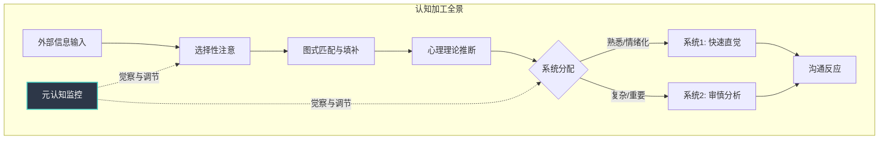
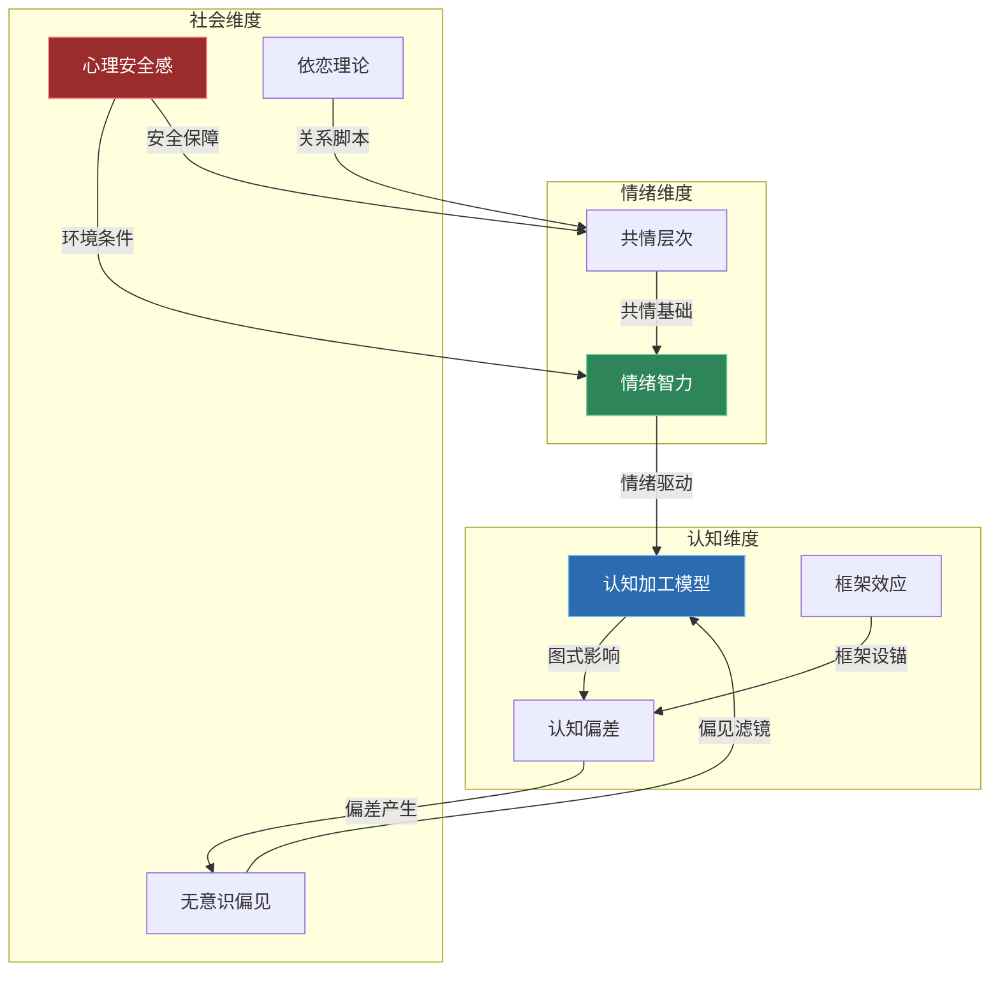

## 本节小结：沟通心理学的理论基础全景

本节从八个维度系统构建了沟通心理学的理论基础。这不是八个孤立的知识点，而是一套环环相扣的"认知-情绪-社会"三维理论体系。下面将逐一提炼每个维度的核心洞见，然后展示它们之间的内在关联，最后提供一套可日常使用的综合自检框架。

---

### 一、核心知识体系回顾

#### 1.1 认知心理学视角：沟通的大脑操作系统

认知心理学揭示了沟通的底层加工机制。人类的沟通不是简单的"发送-接收"，而是一个涉及编码、传递、解码三阶段的复杂信息加工过程，每个阶段都可能发生系统性失真。

**五个关键理论支柱：**

| 理论 | 核心主张 | 对沟通的启示 |
|------|---------|-------------|
| 信息加工模型 | 编码与解码之间永远存在信息损耗 | 不要假设"我说清楚了=对方听明白了" |
| 工作记忆理论 | 有效容量仅4±1个信息块 | 每次沟通的信息量必须控制，分块递进 |
| 图式理论 | 大脑用已有框架填补信息空白 | 你听到的不全是对方说的，有你的"脑补" |
| 心理理论 | 推测他人信念和意图的能力 | 推测不等于事实，必须验证 |
| 双系统思维 | 快思考（直觉）与慢思考（分析）并行 | 关键时刻要从系统1切换到系统2 |

**最核心的实践原则：**

1. **分块传递**——复杂信息拆成不超过4个要点的模块，逐块确认理解后再推进
2. **渐进加载**——先给框架再填细节，不要一开始就倾倒细节
3. **反馈循环**——每传递一个信息块，就获取一次反馈确认
4. **元认知监控**——在对话中持续觉察"我现在在用系统1还是系统2""我的图式是否在扭曲理解"



#### 1.2 核心认知偏差：沟通中的六种系统性陷阱

认知偏差不是随机错误，而是大脑进化形成的"快捷方式"在现代沟通场景中的失配。六种核心偏差构成了一条相互强化的"偏差链"：

| 偏差 | 一句话定义 | 沟通中最危险的表现 |
|------|-----------|------------------|
| 确认偏差 | 只看到支持自己观点的证据 | 选择性倾听——只听进自己想听的 |
| 锚定效应 | 被第一个信息过度束缚 | 第一印象顽固到覆盖后续所有信息 |
| 光环效应 | 以偏概全，一点好/坏推断全面 | 名校背景让你忽视能力缺陷 |
| 基本归因错误 | 对人严厉，对己宽容 | 他迟到=不尊重；我迟到=交通堵 |
| 可得性偏差 | 越容易想到的事越觉得常见 | 一次冲突让你觉得"总是合不来" |
| 达克效应 | 能力差的人不知道自己差 | "我觉得我说得很清楚"综合症 |

**偏差链的运作机制：**

这六种偏差不是孤立发生的。典型链条为：锚定效应形成第一印象 → 光环效应扩散全面评价 → 确认偏差过滤矛盾证据 → 基本归因错误为对方开脱/定罪 → 可得性偏差巩固刻板记忆 → 达克效应阻止自我觉察。这个自我强化的闭环，解释了为什么第一印象可以顽固持续数年。

**最高效的去偏方法——觉察-暂停-校准三步法：**

1. **觉察**：识别偏差信号——"我就知道他是这种人"（确认偏差）、"第一次见面就觉得不靠谱"（锚定效应）
2. **暂停**：深呼吸3-5秒，喝水，说"让我想想"——打断系统1的自动反应
3. **校准**：启动系统2，主动寻找反面证据，考虑情境因素，引入外部视角

**关键实操工具：**

- **五五验证法**：重要判断前列出5条支持证据和5条反对证据
- **情境优先三步法**：先列出3个情境因素，再考虑特质归因
- **十次回忆法**：对某人形成总体印象时，强制回忆10次互动而非最容易想到的那几次

#### 1.3 情绪智力：沟通的底层操作系统

情绪智力不是"温柔"或"不得罪人"，而是一种可以系统训练的神经认知能力。它由四个层层递进的维度构成：


**神经科学基础——理解才能管理：**

- **杏仁核**（情绪哨兵）：12毫秒内启动"战斗-逃跑"反应，远快于前额叶的300-500毫秒。这就是"杏仁核劫持"——你在理性介入之前就已经情绪爆发了
- **前额叶皮层**（情绪指挥官）：负责冲动控制和情绪调节，与杏仁核形成"刹车-油门"关系。睡眠不足、压力、酒精会削弱其功能
- **镜像神经元**（共情硬件）：无意识地"镜像"他人的情绪状态，是情绪传染和共情的神经基础
- **6秒法则**：杏仁核引发的神经化学物质在体内持续约6秒。被"劫持"时，给自己至少6秒缓冲

**最有效的四种情绪调节技术：**

| 技术 | 机制 | 适用场景 | 生效速度 |
|------|------|---------|---------|
| 情绪标签法 | 命名情绪降低杏仁核活动 | 任何情绪波动时 | 即时（降低约30%强度） |
| RAIN四步法 | 识别-允许-探究-不认同 | 强烈情绪的当下处理 | 2-5分钟 |
| 认知重评 | 重新解读事件意义 | 需要长期改变情绪模式 | 即时起效，4-6周巩固 |
| 4-7-8呼吸法 | 激活副交感神经系统 | 生理层面的情绪风暴 | 90秒内降低皮质醇 |

**常见误区纠正：**

- "高情商就是不得罪人" → 错。高情商是在维护关系的同时坚守原则
- "情绪管理就是控制情绪" → 错。压抑不会让情绪消失，只会让它以更扭曲的方式爆发
- "情商是天生的" → 错。神经可塑性研究证明，8-12周系统训练可显著提升

#### 1.4 共情的深度层次：从理解到关怀的递进系统

共情不是一种单一能力，而是一个由浅入深的三层系统。每一层涉及不同的神经回路，适用于不同的沟通场景：

| 层次 | 核心能力 | 神经基础 | 关键优势 | 主要风险 |
|------|---------|---------|---------|---------|
| 认知共情 | 理解他人观点和想法 | mPFC、TPJ | 低消耗、可长时间维持 | 缺乏情感温度 |
| 情感共情 | 感受他人的情绪 | 前脑岛、ACC | 传递真诚连接 | 共情疲劳、情绪淹没 |
| 共情关怀 | 产生帮助动机 | 腹侧纹状体、OFC | 驱动实际行动 | 过度承担责任 |

**三层并非严格线性：**

- 可以从任意层次进入（有时先"感受到"，后才"理解"）
- 层次可以独立存在（理解但不共情，或共情但不理解）
- 层次之间可能冲突（过度情感共情干扰认知判断）

**不同场景的最优共情配置：**

- 医生告知诊断 → 认知共情为主（过度情感共情干扰专业判断）
- 朋友倾诉失恋 → 情感共情为主（对方需要"被感受"而非"被分析"）
- 危机干预 → 认知共情+共情关怀（快速理解+果断行动，过度情感共情导致恐慌）
- 长期照护 → 共情关怀为主，管理情感共情（持续关心但不持续消耗）

**关键区分：共情 vs 同情心**

神经科学家Tania Singer的研究发现：过度的情感共情（前脑岛激活，与痛苦相关）会导致耗竭，而同情心（眶额叶皮层和腹侧纹状体激活，与积极情绪相关）是一种更可持续的关怀状态。培养目标不是"越共情越好"，而是从共情痛苦转向共情关怀。

#### 1.5 心理安全感：沟通环境的基础设施

心理安全感不是"一团和气"，而是团队成员共享的一种信念：在这个团队中，承担人际风险是安全的。它是团队层面的环境属性，不是个体特质。

**四个维度：**

| 维度 | 含义 | 缺失信号 |
|------|------|---------|
| 发言安全感 | 可以表达不同意见 | 会议中只有领导在说 |
| 学习安全感 | 可以提问和承认不懂 | "不懂就自己查"的文化 |
| 容错安全感 | 可以承认失误 | 问题被掩盖而非上报 |
| 创新安全感 | 可以尝试新方法 | "离谱"想法被嘲笑 |

**谷歌亚里士多德计划的核心发现：** 在180个团队中，影响团队效能的首要因素不是个人能力或学历，而是心理安全感。

**关键辨析：心理安全感 ≠ 不问责**

| | 低心理安全 | 高心理安全 |
|---|---|---|
| **低绩效标准** | 冷漠区：沉默、躺平 | 舌适区：安逸但无挑战 |
| **高绩效标准** | 焦虑区：高压、掩盖错误 | **学习区：卓越、持续改进** |

最佳组合是"高心理安全+高绩效标准"——既敢于暴露问题，又对解决问题有强烈责任感。

**领导者建设心理安全感的关键行为：**

1. **主动示弱**——率先承认自己的错误和知识盲区（要真诚、具体、有行动导向）
2. **询问而非告知**——"方案A和B各有什么优劣？"替代"按方案A执行"
3. **对坏消息正向反馈**——"谢谢你及时告诉我"替代"怎么现在才说？"
4. **结构化发言机制**——新人优先发言、先写后说、红队机制

#### 1.6 依恋理论与沟通：关系模式的深层脚本

依恋理论最初由约翰·鲍尔比用于解释婴儿与照顾者的关系，后被扩展到成人关系领域。四种依恋类型构成了人际沟通的"深层脚本"——它们在无意识中决定了你如何表达需求、处理冲突、回应亲密。

| 依恋类型 | 沟通优势 | 沟通挑战 | 在冲突中的典型反应 |
|----------|---------|---------|------------------|
| 安全型 | 开放、直接、建设性 | 可能高估他人的安全感 | 直面问题，寻求双赢 |
| 焦虑型 | 高度关注关系动态 | 过度解读、反复寻求保证 | 情绪升级，害怕被抛弃 |
| 回避型 | 独立、不依赖他人 | 情感疏离、逃避冲突 | 沉默、退缩、"冷战" |
| 混乱型 | 某些时刻非常深入 | 行为不可预测 | 在亲近和推开之间反复 |

**依恋类型对沟通的深层影响：**

- **焦虑型+回避型**是最常见的"痛苦组合"：焦虑者越追，回避者越退；回避者越退，焦虑者越追——形成"追逃循环"
- 依恋模式不是命运：通过心理咨询、安全关系的体验和有意识的自我觉察，依恋模式可以在成年后发生"习得性安全"的转变
- **觉察练习**：识别自己在压力下的依恋反应——"我此刻是在靠近还是在退缩？这个反应是基于当下的现实，还是基于过去的关系模式？"

#### 1.7 框架效应：同一件事的两种说法，两种结果

框架效应是指同一个信息用不同方式呈现，会导致截然不同的决策和行为。这由特沃斯基和卡尼曼在前景理论中系统揭示。

**经典实验：**

> "手术成功率90%" vs "手术死亡率10%"——信息完全相同，但前者让78%的受试者选择手术，后者只有39%。仅仅改变了描述框架，决策就翻了一倍。

**三种核心框架类型：**

| 框架类型 | 特征 | 示例 | 适用场景 |
|----------|------|------|---------|
| 收益框架 | 强调获得什么 | "通过培训你将掌握五项新技能" | 推动行动、激励参与 |
| 损失框架 | 强调失去什么 | "不参加培训你将错过五项关键技能" | 紧急行动、规避风险 |
| 时间框架 | 短期vs长期视角 | "短期投入时间，长期节省大量时间" | 克服拖延、长期决策 |

**框架效应的四重应用：**

1. **设定积极框架**：将挑战框定为成长机会——"这是一个学习的场景"而非"这是一个危机"
2. **避免负面框架**：不要无意识地使用损失框架制造焦虑——"如果你不这样做就会……"的句式需要慎用
3. **灵活切换框架**：对方是风险规避型？用损失框架。对方是收益追求型？用收益框架
4. **觉察他人的框架**：识别对方正在使用的框架，避免被无意识地操控决策

**框架效应与锚定效应的协同：**

框架效应本质上是一种"语言锚定"——你用什么框架描述一个问题，就是在对方的认知中设下了一个锚。"这个项目存在风险"和"这个项目有挑战"是不同的锚，前者让人更谨慎，后者让人更积极。掌握框架效应，就是掌握了语言的杠杆。

#### 1.8 沟通中的无意识偏见：看不见的认知滤镜

无意识偏见是在无意识中形成的对特定群体的刻板印象，它不等于歧视，但会在沟通中制造系统性的不公正。每个人都有无意识偏见——它是大脑分类功能的副产品。

**五种在沟通中最常见的无意识偏见：**

| 偏见类型 | 定义 | 沟通中的表现 |
|----------|------|-------------|
| 相似性偏见 | 倾向于喜欢与自己相似的人 | 给"同类人"更多表达机会和正面解读 |
| 确认偏见 | 寻找支持已有偏见的证据 | 用偏见滤镜筛选对方的言行 |
| 可得性偏见 | 过度依赖容易想起的信息 | 用刻板印象代替对个体的了解 |
| 现状偏见 | 倾向于维持现状 | 排斥不同背景的人带来的新观点 |
| 权威偏见 | 过度信任权威人物的意见 | 领导说的一定对，新人说的不值得听 |

**无意识偏见如何扭曲沟通全过程：**

- **选择对象**：我们更倾向于与"像自己"的人沟通，形成信息茧房
- **解读行为**：同样的自信，对男性被解读为"有领导力"，对女性被解读为"太强势"
- **分配关注**：在会议中，我们给"重要人物"更多注意力，忽略"边缘人物"的发言
- **非语言泄露**：偏见会通过微妙的非语言信号传递——眼神接触的时长、身体朝向、语调变化

**系统性减少偏见的五步法：**

1. **觉察**：通过哈佛内隐联想测试（IAT）了解自己的隐性偏见
2. **暂停**：在重要决策前暂停，检查是否有偏见在起作用
3. **标准化**：建立客观评估标准，减少主观判断空间
4. **多元化**：主动接触不同背景的人，拓宽认知边界
5. **问责**：建立反馈机制，让偏见行为可以被识别和纠正

---

### 二、理论之间的内在关联

这八个理论维度不是并列的知识点，而是一个有机整体。理解它们之间的关联，才能真正将其转化为沟通能力。

#### 2.1 三维关联图谱



#### 2.2 关键关联路径

**路径一：认知→情绪→行为**

认知加工（图式、心理理论）决定了你如何解读对方 → 情绪智力决定了你如何回应这个解读 → 共情层次决定了你的回应深度。一个认知偏差未被觉察的人，情绪智力再高也可能做出错误回应——因为他解读的起点就是错的。

**路径二：环境→个体→互动**

心理安全感（环境层）影响个体的情绪智力发挥空间 → 依恋模式（个体层）影响共情的自然倾向 → 无意识偏见（认知层）在互动中制造隐性障碍。改变沟通质量，有时需要同时在三个层面入手。

**路径三：偏差→框架→决策**

认知偏差（确认偏差、锚定效应）为框架效应提供了"土壤"——你用什么框架描述问题，取决于你的偏差滤镜让你"看到"了什么。反过来，有意识地切换框架可以打破偏差的自动循环。

#### 2.3 整合模型：沟通心理学的"冰山模型"

```mermaid
graph TB
    subgraph 水面之上 —— 可观察的沟通行为
        B1[语言表达]
        B2[非语言信号]
        B3[沟通策略选择]
    end

    subgraph 水面之下 —— 不可观察的心理机制
        direction TB
        S1[表层：认知加工<br/>图式·工作记忆·双系统]
        S2[中层：情绪系统<br/>情绪智力·共情层次·情绪调节]
        S3[深层：关系脚本<br/>依恋模式·心理安全感·无意识偏见]
    end

    S3 -->|塑造| S2
    S2 -->|驱动| S1
    S1 -->|输出| B1
    S1 -->|输出| B2
    S1 -->|输出| B3

    style S1 fill:#2b6cb0,stroke:#63b3ed,color:#fff
    style S2 fill:#2f855a,stroke:#68d391,color:#fff
    style S3 fill:#9b2c2c,stroke:#fc8181,color:#fff
```

水面之上的沟通行为，只是冰山一角。真正决定沟通质量的，是水面之下的三层心理机制：认知加工层（你的大脑如何处理信息）、情绪系统层（你如何感受和调节情绪）、关系脚本层（你的早期经验如何塑造你的沟通模式）。

---

### 三、综合自检框架

将本节全部理论转化为一套日常可用的沟通自检工具。

#### 3.1 对话前——准备检查清单

认知准备：
□ 我对这个话题/对方有什么已有图式？这些图式可能如何扭曲我的理解？
□ 我是否有确认偏差的风险？（已经"知道"结论，只等对方确认？）
□ 我打算用什么框架开启对话？这个框架是最佳选择吗？
□ 当前的认知资源状态如何？（是否疲劳、焦虑、分心？）

情绪准备：
□ 我此刻的情绪状态是什么？强度如何？（1-10分）
□ 这个情绪的来源是什么？是否与当前对话有关？
□ 我是否可能被"杏仁核劫持"？如果是，准备什么缓冲策略？

关系准备：
□ 我和对方的依恋模式互动可能是什么？（如：焦虑+回避？）
□ 对方在当前对话中可能感到心理安全吗？
□ 我是否对对方有无意识偏见？（相似性偏见？权威偏见？光环效应？）

共情准备：
□ 对方可能的立场和处境是什么？（认知共情预热）
□ 对方可能的情绪状态是什么？（情感共情预热）
□ 对方可能需要什么支持？（共情关怀预热）

#### 3.2 对话中——实时监控清单

每5分钟做一次快速自检：

认知层面：
□ 我是否只听到了自己想听的？（确认偏差检查）
□ 我的图式是否在"填补"对方没说的内容？（图式觉察）
□ 信息量是否超过了我的工作记忆容量？需要分块吗？
□ 我现在用的是系统1还是系统2？是否需要切换？

情绪层面：
□ 我的情绪标签是什么？（情绪标签化）
□ 对方的情绪信号是什么？（STAR模型：感知-思考-确认-回应）
□ 我的共情处于哪个层次？是否匹配当前场景需要？
□ 是否出现了情绪传染？我是在感受"我的"还是"他的"情绪？

关系层面：
□ 对方是否感到心理安全？有没有退缩、沉默、防御的信号？
□ 我是否在使用告知模式而非询问模式？
□ 我的非语言信号是否传递了我想要的信息？
□ 是否有无意识偏见在影响我对对方的判断？

#### 3.3 对话后——复盘反思清单

认知复盘：
□ 我的理解和对方的真实意图之间有多大的偏差？
□ 哪些认知偏差可能在起作用？
□ 框架选择是否恰当？是否可以换一种框架重新描述这次对话？

情绪复盘：
□ 我的情绪调节策略是否有效？
□ 我在哪个时刻最接近"杏仁核劫持"？触发因素是什么？
□ 共情层次是否匹配了对方的需求？

关系复盘：
□ 对方在这次对话中的心理安全感如何？
□ 我的依恋模式是否影响了这次对话？（是否过度靠近或过度退缩？）
□ 有哪些改进可以应用于下次类似对话？

元认知复盘：
□ 我的元认知监控是否到位？（对话中是否"觉察到自己在如何对话"？）
□ 我对自己思维过程的评估准确吗？
□ 一句话总结这次对话中学到的最重要的一课：____________

---

### 四、从理论到实践的关键转化原则

理论的价值在于转化。以下是将本节八大理论转化为日常沟通能力的五条核心原则：

**原则一：觉察先于技巧**

所有技巧——无论是认知偏差去偏、情绪调节、共情表达还是心理安全建设——都以觉察为前提。你无法改变你意识不到的东西。本节最重要的练习不是某个具体技巧，而是培养"一边对话，一边观察自己在如何对话"的元认知能力。

**原则二：系统1不是敌人，而是需要管理的盟友**

系统1的快速直觉在日常沟通中高效且准确。沟通高手不是"始终用系统2思考的人"，而是知道何时信任直觉、何时启动分析的人。关键是在高风险时刻（情绪强烈、利益攸关、文化差异）主动切换到系统2。

**原则三：共情需要边界**

共情不是越深越好。情感共情的过度激活会导致共情疲劳和判断力下降。真正的共情高手能够灵活切换共情层次——该认知共情时认知，该情感共情时情感，该关怀时关怀——并且懂得在自我消耗和他人需求之间找到平衡。

**原则四：环境塑造行为**

心理安全感的研究证明：在错误的环境中，即使最优秀的个体也会沉默、掩盖、退缩。改变沟通质量，不能只改变个体，还要改变环境。无论是团队管理还是亲密关系，创造安全的沟通环境是所有技巧发挥作用的基础设施。

**原则五：偏差不可消灭，但可以管理**

认知偏差和无意识偏见是大脑的默认设置，不可能通过"知道"它们就消除。目标不是消灭偏差，而是建立一套系统性的觉察和校准机制——在偏差发生时能够识别它、暂停它、用系统2校准它。这需要持续练习，但从第一次觉察开始，你就已经在改变了。

---

### 五、知识图谱速查表

下表将本节八大理论的核心要素整合为一张速查表，方便在实际沟通中快速回顾：

| 维度 | 理论 | 核心概念 | 一句话总结 | 最佳实践工具 |
|------|------|---------|-----------|-------------|
| 认知 | 信息加工模型 | 编码-传递-解码 | 你说的≠对方听的 | 反馈循环确认理解 |
| 认知 | 工作记忆 | 4±1信息块 | 别一次倒太多 | 分块+渐进加载 |
| 认知 | 图式理论 | 认知滤镜 | 你在"脑补" | 图式觉察+反例积累 |
| 认知 | 心理理论 | 推测≠读心 | 推断必须验证 | "我感觉你……对吗？" |
| 认知 | 双系统思维 | 系统1/系统2 | 关键时刻要切换 | 6秒法则+暂停技术 |
| 认知 | 认知偏差 | 六种系统性陷阱 | 偏差链会自我强化 | 觉察-暂停-校准 |
| 认知 | 框架效应 | 同一信息不同说法 | 框架即杠杆 | 收益/损失/时间框架切换 |
| 情绪 | 情绪智力 | 四维模型 | 情商可以训练 | 情绪标签法+RAIN |
| 情绪 | 共情层次 | 认知-情感-关怀 | 不是越深越好 | 场景匹配最优层次 |
| 社会 | 心理安全感 | 四维安全环境 | 安全≠和气≠不问责 | 主动示弱+询问模式 |
| 社会 | 依恋理论 | 四种依恋模式 | 深层关系脚本 | 识别依恋反应模式 |
| 社会 | 无意识偏见 | 五种隐性偏见 | 每个人都有偏见 | IAT测试+标准化评估 |

> "理解理论不是为了成为心理学家，而是为了在下一次对话中，比上一次多一分觉察、多一分精准、多一分温度。"

下一节，我们将把这些理论转化为**可直接使用的沟通技巧**——从认知偏差的觉察练习到高级共情的实操方法，从心理安全感的构建技术到框架效应的攻防策略。理论是地图，技巧是行路，而真正的沟通能力，只能在行走中获得。
