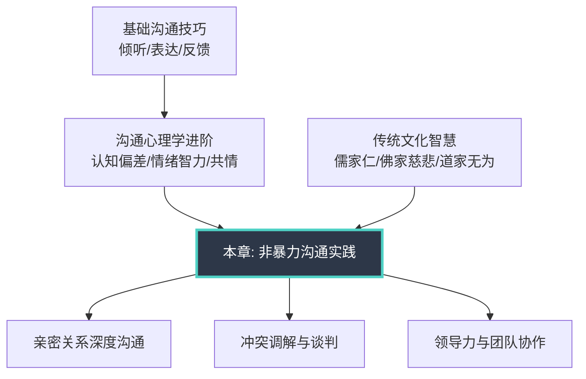
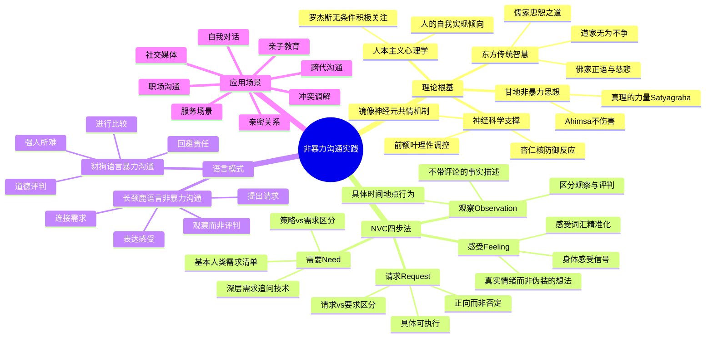

# 第二十六章 非暴力沟通实践

## 章节定位

在前面二十五章中，我们从倾听、表达到反馈，从心理学机制到领导力沟通，系统构建了沟通能力的完整知识体系。但有一类沟通困境，至今仍未被彻底解决——**当情绪激烈、需求冲突、关系紧张时，我们该如何对话？**

非暴力沟通（Nonviolent Communication, NVC）是马歇尔·卢森堡博士用四十年实践打磨出的一套方法论，它不教你"说服别人"，而是教你**如何在保持真诚的同时，让对方也愿意真诚**。这是沟通领域中最接近"道"的方法——它不追求话术的精巧，而是回归人与人之间最本质的连接。

### 本章与其他章节的关系

本章是沟通主题的**实战融合篇**。前面章节中学习的倾听层次（第四章）、情绪管理（第十三章）、共情技巧（第二十五章），在本章中将被整合为一套统一的沟通行动框架。NVC不是独立于其他技巧的新技术，而是**将所有沟通能力串联起来的操作系统**。

如果你跳过了前面的基础章节，建议至少先完成以下前置阅读：
- 第四章「倾听的艺术」——NVC的"倾听"步骤建立在深度倾听之上
- 第十三章「情绪管理」——识别"感受"需要基本的情绪觉察能力
- 第二十五章「沟通心理学进阶」——理解NVC为何有效需要认知心理学基础

---

## 核心主题

本章围绕NVC方法论展开，覆盖从理论到实践的完整链条：

| 维度 | 核心问题 | 理论来源 | 实用价值 |
|------|----------|----------|----------|
| NVC四步法 | 如何表达自己又不伤害对方？ | 卢森堡NVC理论 | 任何需要真诚对话的场景 |
| 需求识别 | 冲突背后的真实需求是什么？ | 马斯洛需求层次 + NVC需求清单 | 从表面争吵进入深层理解 |
| 语言转换 | 如何从"暴力语言"转向"非暴力语言"？ | 豺狗语言与长颈鹿语言模型 | 日常表达习惯的根本性转变 |
| 冲突调解 | 双方都激动时如何恢复对话？ | NVC调解四步法 | 亲密关系、职场、社区冲突 |
| 文化融合 | NVC如何与中国文化语境结合？ | 儒释道沟通智慧 | 避免"水土不服"，增强适用性 |
| 神经科学 | NVC为什么在生理层面有效？ | 镜像神经元、迷走神经理论 | 理解原理，坚定实践信心 |

---

## 学习目标

完成本章学习后，你应该能够：

### 目标一：熟练运用NVC四步法

掌握观察（Observation）、感受（Feeling）、需要（Need）、请求（Request）四个要素的独立运用和组合运用。具体包括：能够在日常对话中自然区分"观察"和"评论"——"你这周有三天晚上十一点后回家"是观察，"你总是这么晚回来"是评论；能够准确命名自己的情绪状态，而不是用"我觉得你不对"这类伪装成感受的想法；能够识别情绪背后的真实需求——愤怒背后可能是对尊重的需求，焦虑背后可能是对安全感的需求；能够提出具体、可执行、正向的请求，而不是模糊的要求或否定式的命令。

### 目标二：识别并转换暴力语言

建立对"豺狗语言"（暴力沟通模式）的敏感度，能够在自己和他人的语言中识别评判、比较、指责、推卸责任四种暴力沟通形式。具体包括：觉察自己使用"你总是""你从来不"这类绝对化表述的频率；识别"我不得不""你让我感到"这类否认个人责任的语言模式；学会将"你太自私了"转化为"当你在会议上打断我时（观察），我感到沮丧（感受），因为我需要被尊重（需要），你愿意在我表达完之后再分享你的想法吗？（请求）"。

### 目标三：深入理解需求层次

理解NVC框架下的需求理论，能够识别自己和他人的深层需求。NVC认为所有人类行为都是为了满足某种需求，冲突不是因为人的"坏"，而是因为需求的表达方式造成了伤害。你需要能够区分"策略"和"需求"——"我要你每天给我打电话"是策略，"我需要连接感和被重视"是需求；理解同一需求可以有多种满足策略，这是解决冲突的关键突破口。

### 目标四：在冲突中运用NVC

掌握在高压、情绪激烈场景中运用NVC的方法。包括：在自己情绪激动时的"自我共情"技巧——先停下来连接自己的需求，再开口说话；在对方情绪激动时的"共情倾听"技巧——不辩解、不反驳、先听见对方的感受和需求；"长颈鹿之耳"训练——即使对方用豺狗语言攻击你，也能听到背后的感受和需求。

### 目标五：将NVC应用于多元场景

能够在亲密关系、亲子教育、职场沟通、跨代对话、服务场景等不同情境中灵活运用NVC。每个场景都有其特殊性：亲密关系中需要处理依恋模式的影响，亲子教育中需要考虑权力不对等，职场中需要兼顾专业性和人情味，跨代沟通中需要理解价值观差异。你需要掌握NVC的核心原则，同时根据场景灵活调整表达方式。

### 目标六：理解NVC的文化适应性

理解NVC的西方个人主义文化背景与中国集体主义文化语境之间的张力，学会将NVC原则与中国传统智慧（儒家的"己所不欲勿施于人"、佛家的慈悲观、道家的"无为"智慧）相融合，形成适合中国文化语境的非暴力沟通方式。

---

## 本章结构

本章采用**理论→技巧→实战→反思→训练→总结**的六段式结构，确保知识从"理解"到"内化"的完整闭环。

### 第一节：理论基础（9个子节）

本节是整章的知识地基。NVC不是一套"话术"，而是一种看待人与人关系的哲学。如果不理解背后的理论，四步法很容易沦为机械套用。

**包含内容：**

- **马歇尔·卢森堡与非暴力沟通的诞生**——卢森堡的生平经历：童年在底特律经历的种族暴力如何塑造了他对沟通的思考；师从人本主义心理学家卡尔·罗杰斯的学术渊源；在以色列-巴勒斯坦冲突、卢旺达种族屠杀后的调解实践中如何验证和完善NVC方法。这些背景不是"名人故事"，而是帮助你理解NVC为什么是这个样子。
- **豺狗语言与长颈鹿语言**——NVC用两种动物隐喻两种沟通模式。豺狗代表评判、指责、比较的语言习惯；长颈鹿是陆地上心脏最大的动物，代表用心连接的沟通方式。本节详细拆解八种常见的豺狗语言形式：道德评判、进行比较、回避责任、强人所难、否定感受、伪装成感受的想法、笼统的请求、有条件的给予。
- **NVC的哲学基础**——NVC建立在人本主义心理学（罗杰斯的无条件积极关注）、甘地的非暴力思想（Ahimsa）、存在主义哲学（人有选择回应方式的自由）三大支柱之上。理解这些哲学基础，能帮助你在实操遇到困难时回到原点重新思考。
- **NVC与传统文化的融合**——将NVC四步法与儒家的"忠恕之道"、佛家的"正语"戒律、道家的"善利万物而不争"进行对照。不是生搬硬套，而是寻找共通的人性智慧。
- **NVC的适用范围**——明确NVC能做什么、不能做什么。NVC不是万能药：它不适合用于紧急安全威胁场景，不能替代专业心理治疗，不能解决结构性权力不平等问题。了解边界才能正确使用。
- **NVC与其他沟通方法的比较**——将NVC与认知行为疗法（CBT）的沟通技术、动机式访谈（MI）、积极倾听、戈特曼的"四骑士"理论进行系统对比，帮助你理解NVC的独特价值和适用场景。
- **NVC的神经科学基础**——从镜像神经元、迷走神经、前额叶皮层与杏仁核的交互机制，解释为什么NVC的四步法在生理层面有效。当你说"你总是迟到"时，对方的杏仁核被激活，进入防御/攻击状态；当你说"我看到会议开始时你还没到"时，对方的前额叶保持活跃，能够进行理性思考。
- **NVC的文化适应性**——在不同文化语境中运用NVC的调整策略。直接表达感受在中国文化中可能被视为"太情绪化"，如何在保持真诚的同时适应文化规范。

### 第二节：核心技巧（10个子节）

本节将NVC理论转化为可操作的沟通技巧。每个技巧都有清晰的使用场景、操作步骤、示例和常见错误。

**包含内容：**

- **NVC四步法概述**——四步法的整体框架、各步骤之间的逻辑关系、使用顺序的灵活性。重点强调：四步法不是公式，而是思维框架；不必每次对话都完整走完四步；顺序可以调整，但"先连接再请求"的原则不可违背。
- **第一步：观察（Observation）**——如何做到"不带评论的观察"。这是四步法中最难的一步，因为人类大脑天生倾向于对感知到的信息进行评判。内容包括：观察vs评论的12组对比示例；"每次""总是""从来"等绝对化词语的识别与替换；视频回放练习法——录下自己的对话，回放时标注哪些是观察、哪些是评论；在愤怒时如何快速提取观察事实。
- **第二步：感受（Feeling）**——如何准确表达真实感受。内容包括：感受vs想法的根本区别（"我觉得你不尊重我"是想法，"我感到沮丧和孤独"是感受）；NVC感受词汇表的分类和使用；身体感受地图——愤怒时胸口发紧、焦虑时胃部收缩，这些身体信号是识别感受的入口；中国文化中表达感受的特殊挑战和应对策略。
- **第三步：需要（Need）**——如何识别和表达深层需求。内容包括：NVC人类基本需求清单（自由、连接、意义、玩耍、和谐、诚实、滋养身体、滋养心灵等）；从表面需求到深层需求的追问技术（"为什么这对我重要？"连续追问三层）；策略vs需求的区分训练；未被满足的需求如何以"豺狗语言"的方式表现出来。
- **第四步：请求（Request）**——如何提出具体、可行、正向的请求。内容包括：请求vs要求的区别（对方说"不"时你的反应决定了这是请求还是要求）；正向请求vs否定请求（"你能不能别玩手机了"→"你愿意在这顿饭的时间里和我聊聊天吗"）；具体化技术（"对我好一点"→"这周六下午你能陪我去散步吗"）；确认对方理解的反馈技巧。
- **NVC的完整应用**——将四步法串联为完整对话的技巧。包括自我表达的完整NVC句式、倾听他人时的NVC回应句式、以及双方都用NVC沟通时的对话结构。
- **NVC在冲突中的应用**——当双方都情绪激动时的NVC策略。包括"按下暂停键"的自我调节技巧、共情倾听的三个层次、"翻译"豺狗语言为长颈鹿语言的实操方法、以及在冲突中寻找共同需求的对话技术。
- **NVC的进阶练习方法**——从初学者到熟练者的系统训练路径。包括每日感受记录、需求识别卡片练习、角色扮演训练、NVC冥想等。
- **NVC应用中的常见误区**——学习NVC最容易掉入的陷阱。这一节放在核心技巧而非独立的"误区"节中，因为这些误区直接与技巧运用相关。
- **本节小结**——核心技巧的系统回顾和要点提炼。

### 第三节：实战案例（11个子节）

通过真实场景展示NVC的具体应用。每个案例遵循**场景还原→问题分析→NVC应用→对话示范→效果反思**的五步结构。

**包含案例：**

- **案例一：亲密关系中的日常冲突**——伴侣之间因家务分工、手机使用、情感表达等日常问题引发的争吵。展示如何从"你怎么又不洗碗"的豺狗语言转向NVC表达。
- **案例二：职场中的上下级冲突**——下属觉得领导不尊重自己的付出，领导觉得下属不够积极主动。展示如何在权力不对等的场景中运用NVC。
- **案例三：亲子教育中的代际冲突**——父母与青春期孩子之间关于学业、手机、社交的冲突。展示NVC在教育场景中的特殊调整。
- **案例四：同事间的误解与和解**——因信息不对称导致的职场误会。展示如何用NVC进行关系修复。
- **案例五：跨代沟通中的价值观冲突**——年轻一代与父母辈在婚恋观、职业选择、生活方式上的分歧。展示NVC如何处理价值观层面的深层冲突。
- **案例六：自我对话中的NVC应用**——当自我批评、内疚、焦虑等内在冲突困扰你时，如何用NVC与自己对话。这是最容易被忽视但最有价值的应用场景。
- **案例七：服务场景中的NVC应用**——客户服务、投诉处理、医患沟通等专业场景中的NVC运用。
- **案例八：社交媒体上的NVC应用**——在匿名、异步、缺乏非语言信号的网络环境中如何实践NVC。
- **案例九：团队会议中的NVC应用**——如何在团队讨论、决策、复盘中引入NVC框架，提升会议质量。
- **NVC自我练习计划**——一份为期四周的NVC实践计划，从观察练习开始，逐步推进到完整的四步法应用。
- **本节小结**——实战案例的共性规律提炼。

### 第四节：常见误区

指出学习和应用NVC时常犯的错误。很多人学了NVC后沟通反而变差了，因为他们掉入了这些陷阱。

**核心误区包括：**
- 将NVC变成新的操控工具——用NVC的句式包装自己的要求，本质还是在控制对方
- 机械套用四步法——每次对话都像念公式一样走完四步，让对方感到不自然
- 忽视文化差异——在中国文化中直白表达感受可能适得其反
- 在不安全的环境中过度暴露——面对有暴力倾向的人，不加保护地暴露感受是危险的
- 忽略自己的需求——只关注对方的感受，变成"讨好型沟通"
- 追求"完美NVC"——不允许自己有情绪，压抑真实反应

### 第五节：练习方法

提供系统的NVC训练方案，不是"多练习"这样的空话，而是具体到每天做什么、怎么记录、如何评估进步的可执行计划。

**训练阶段包括：**
- **第一周：观察力训练**——每天记录3个观察vs评论的实例
- **第二周：感受词汇训练**——使用感受词汇表，每天命名5个当下的感受
- **第三周：需求识别训练**——对自己的每个情绪反应追问"这背后的需求是什么"
- **第四周：完整NVC实践**——在低风险场景中完整运用四步法
- **持续训练：角色扮演、NVC学习小组、沟通日记**

### 第六节：本章小结

回顾本章核心要点，整合各节内容，提供进一步学习的建议。包括NVC的进阶学习资源、推荐阅读书目、NVC工作坊和认证体系介绍。

---

## 关键概念导图

### 概念间的关联

这些概念不是孤立的，它们在实际沟通中相互交织：

| 关联组合 | 互动机制 | 典型场景 |
|----------|----------|----------|
| 观察 + 感受 | 准确的观察是识别真实感受的前提 | 把"你不在乎我"（评判）换成"你这周三次没回我消息"（观察），才能发现自己真实的感受是"失落"而非"愤怒" |
| 感受 + 需要 | 每个感受都指向一个需求 | 感到"焦虑"是因为"安全感"需求未被满足；感到"愤怒"是因为"尊重"需求被侵犯 |
| 请求 + 需要 | 好的请求直接连接需求 | 不说"你能别加班了吗"（策略），说"我需要和你共度时光，这周六晚上我们能一起吃饭吗"（需求+策略） |
| 豺狗语言 + 防御反应 | 评判性语言激活杏仁核 | "你怎么这么不负责任"让对方进入战斗-逃跑模式，对话立即中断 |
| 自我共情 + 他人共情 | 先照顾自己的需求，才能真诚地倾听他人 | 自己精疲力竭时强行共情他人，会导致"耗竭式共情"，最终对沟通产生厌恶 |

---

## NVC的核心理念

非暴力沟通基于一个核心信念：**人类天生具有共情能力，当我们的基本需求得到满足时，我们自然地愿意给予和分享。** 暴力（包括语言暴力）不是人的本性，而是当需求未被满足时的一种习得性反应。

这个信念有三层含义：

1. **没有人是"坏人"**——即使是让你最愤怒的人，他的行为背后也有某种未被满足的需求。理解这一点不等于认同他的行为，而是为对话创造了可能性。
2. **语言暴力是"需求的扭曲表达"**——当一个人说"你真自私"时，他真正想表达的可能是"我需要被关心"。NVC帮助我们听到语言表面之下的真实信号。
3. **每个人都有选择回应方式的自由**——即使在最困难的环境中，我们仍然可以选择如何回应。Viktor Frankl在纳粹集中营中的经历证明了这一点："在刺激和回应之间，有一个空间。在这个空间里，我们有选择回应方式的自由和力量。"

---

## 适用人群

本章适合所有希望改善沟通质量的学习者，但不同背景的读者将获得不同层面的收益：

**直接受益：**
- **经常陷入冲突和争吵的人**——NVC提供了一条从"互相攻击"到"互相理解"的具体路径。如果你发现自己总是和伴侣、家人、同事陷入同样的争吵模式，NVC能帮你打破这个循环。
- **希望改善亲密关系的人**——亲密关系中的沟通问题往往不是"不爱了"，而是"不知道怎么爱"。NVC帮助你学会用对方能接收的方式表达爱。
- **管理者和团队领导者**——NVC能帮助你创造一种团队文化，让人们敢于表达真实想法，而不是在会议上沉默、在背后抱怨。
- **教育工作者和家长**——孩子不会天然地表达感受和需求，他们的"不听话"往往是需求的扭曲表达。NVC帮助你听到孩子真正想说的话。
- **心理咨询师和社会工作者**——NVC是咨询工具箱中的重要补充，特别是在家庭治疗、冲突调解、危机干预等场景中。

**间接受益：**
- **销售人员**——NVC的倾听技术帮助你真正理解客户的需求，而不是急于推销产品。
- **创业者和产品经理**——用户访谈中的NVC技巧帮助你听到用户"说的"背后"想要的"。
- **对和平沟通有追求的个人**——即使没有具体的关系问题，NVC也能帮助你成为一个更有觉察力、更有同理心的人。

### 前置知识要求

阅读本章前，建议你已经具备以下基础：

- 理解积极倾听的基本方法（复述、澄清、总结）
- 了解情绪的基本类型和命名方法
- 有过至少一段时间的人际冲突经历（任何关系都行）

如果以上基础尚有欠缺，建议先阅读本书前面的相关章节。NVC的学习高度依赖个人经验——没有经历过沟通困境的人很难理解NVC的价值。

---

## 阅读建议

### 推荐学习路径

**第一遍（建立框架，约2小时）：**
快速通读理论基础和四步法概述，不必逐字精读。重点理解：豺狗语言vs长颈鹿语言的区别、四步法的基本结构。建议在读完后用自己的话写一段200字的NVC介绍——如果你写不出来，说明还需要再读一遍。

**第二遍（深入学习，约4-6小时）：**
精读四步法的每个子节，结合示例理解每一步的要点。重点做三件事：（1）在感受词汇表中圈出你最常体验但从未命名过的感受；（2）用需求清单对照自己最近一次冲突，识别背后的需求；（3）练习写出3个正向的具体请求。

**第三遍（实践内化，持续4周）：**
按照练习方法部分的建议，从观察练习开始，逐步推进到完整的四步法应用。**关键原则：从低风险场景开始。** 先在和快递员、同事的日常对话中练习观察和感受表达，不要一开始就用在和伴侣的激烈争吵中。

### 学习效果加速器

1. **从最近的一次冲突入手**——用NVC的框架重新分析一次你最近的真实冲突经历，比纯理论阅读有效10倍。写下：当时对方说了什么（观察），你感受到什么（感受），你真正需要什么（需求），你当时实际说了什么（对比你的豺狗语言）。
2. **找一个NVC练习伙伴**——NVC的很多技巧需要在对话中练习。找一个也在学习沟通技巧的朋友，每周做一次15分钟的角色扮演。
3. **建立感受-需求日记**——每天花5分钟记录：今天最强烈的一个感受是什么？这个感受指向什么需求？这个需求今天被满足了吗？如果没有，我可以做什么来满足它？
4. **允许笨拙**——NVC初期使用时一定会觉得不自然、像在"念台词"。这是正常的。任何新技能在初期都会笨拙，坚持4-6周后会逐渐自然化。

---

## 本章核心问题

在阅读过程中，请持续思考以下问题。这些问题不是考试题，而是帮助你将知识与自身经验连接的思考锚点：

1. **你最常使用的"豺狗语言"是哪种形式？** 是道德评判（"他不应该这样"）、进行比较（"别人家的老公/老婆都..."）、回避责任（"我不得不加班"）、还是强人所难（"你必须道歉"）？觉察自己的默认模式是改变的第一步。

2. **你上一次冲突中，对方的真实需求是什么？** 回想最近一次争吵，当时你关注的是对方"说了什么"，还是对方"需要什么"？如果你现在重新分析，你觉得对方当时真正需要的是什么？

3. **你在表达感受时的困难是什么？** 是不知道自己在感受什么？是觉得表达感受"太软弱"？还是担心表达感受后会被评判？这些困难本身就是NVC需要解决的核心问题。

4. **你的"请求"真的是请求吗？** 回想你最近一次向伴侣、同事或孩子提出的要求，如果对方说"不"，你的第一反应是什么？如果会生气或施压，那就不是请求，而是要求。

5. **你有没有用过"伪装成NVC的暴力沟通"？** 比如"我观察到你是一个自私的人，我感到失望，因为我需要一个有责任感的伴侣，所以请你改变"——这看起来像NVC，但"你是一个自私的人"是评判而非观察。你能识别自己是否在用NVC的外壳包装豺狗语言吗？

这些问题将在后续各节中被反复引用和深化。带着问题阅读，你会发现每个知识点都在回答你真实存在的困惑。

---

> **阅读提示：** NVC是一门"知易行难"的学问。四步法看起来简单，但在真实的情绪风暴中运用它，需要反复练习。不要因为一两次的失败就放弃——卢森堡博士自己也说，他练习了几十年仍然会有"掉回豺狗模式"的时候。NVC的目标不是成为"完美的非暴力沟通者"，而是在每次"掉回去"之后，能够更快地觉察、更快地回到连接状态。觉察本身就是进步。
