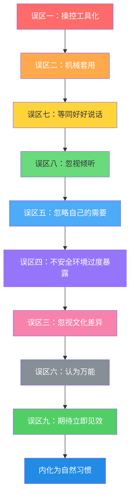
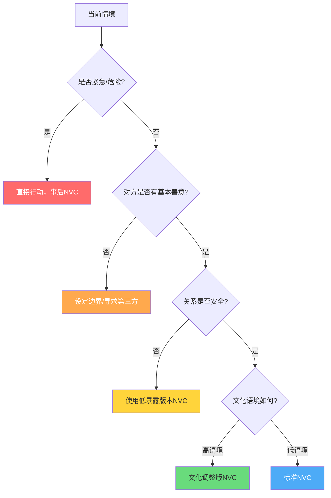
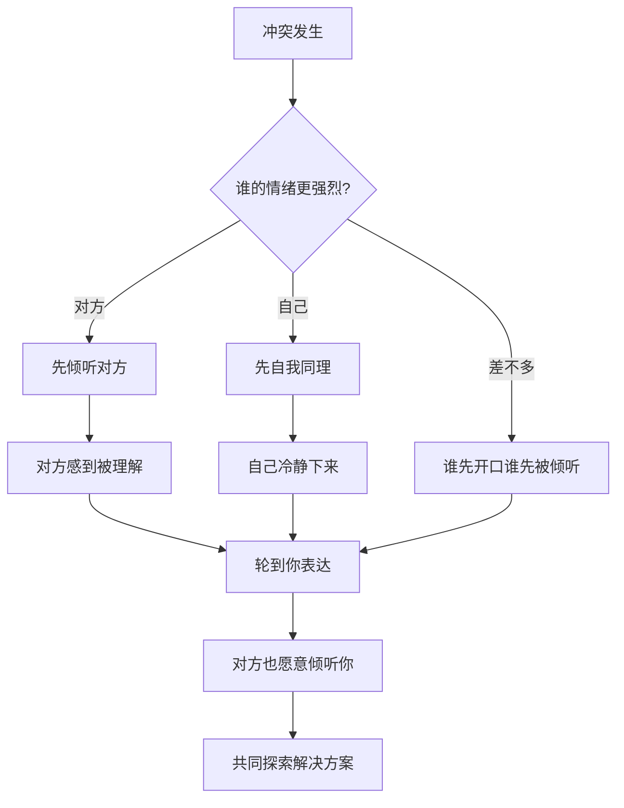
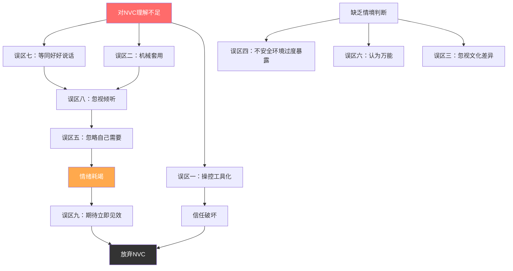

# 第四节 常见误区：从"学了"到"学会"的九道关卡

学习非暴力沟通（NVC）的过程，不是一条从无知到精通的直线，而是一段充满迂回的旅程。几乎每一个NVC学习者都会在某个阶段掉进某个"坑"——有些是因为对NVC的理解停留在表面，有些是因为旧有的沟通惯性太强，还有些是因为忽略了NVC所依赖的关系前提。

本节系统梳理NVC实践中最常见的九个误区，帮助你识别自己正处于哪个阶段，并提供具体的矫正路径。这九个误区不是孤立的，它们之间存在递进关系：



---

## 误区一：将NVC变成新的操控工具

### 这个误区的本质

NVC四步法——观察、感受、需要、请求——本身是一套中性的语言结构。当学习者还没有内化NVC的**连接意图**时，很容易把这套结构当作一种更精致的说服技术。操控的本质不在于你说了什么，而在于你是否真正愿意接受对方说"不"。

### 表现特征

操控型NVC有三个典型标志：

| 标志 | 具体表现 | 内心独白 |
|------|---------|----------|
| 预设结果 | 在开口之前已经决定了对方应该做什么 | "只要我用NVC表达，他就没理由拒绝" |
| 拒绝"不" | 对方拒绝后感到愤怒、失望或委屈 | "我都这样说了，你怎么还不答应？" |
| 选择性观察 | 只挑选支持自己立场的观察事实 | 只说对方的问题，不提自己的责任 |

### 典型案例深度分析

> **场景一：亲密关系中的操控**
>
> 妻子想让丈夫戒烟。
>
> **操控性表达**：
> "当你抽烟时（观察），我感到窒息和恐惧（感受），因为我需要健康和长寿（需要）。你愿意永远不再抽烟吗？（请求）"
>
> **问题诊断**：
> - "永远不再抽烟"不是一个请求，而是一个不可协商的要求
> - "窒息和恐惧"是否真实？还是为了让丈夫愧疚而选择的强烈措辞？
> - 妻子的真正需要可能是"安全感"和"被重视"，但戒烟只是满足这些需要的**一种方式**，不是唯一方式
> - 如果丈夫说"我暂时做不到"，妻子会怎样？——这才是检验真伪的试金石
>
> **NVC式的表达**：
> "我注意到你最近抽烟的频率增加了（观察）。说实话，我有点担心你的健康，也担心我自己吸二手烟（感受，诚实表达）。我希望我们都能健康地在一起很久（需要）。你觉得我们可以聊聊关于抽烟这件事吗？也许我们可以一起想想办法（请求，开放式的）？"
>
> **关键区别**：后者保留了丈夫选择的空间——他可以选择减少频率、选择在户外抽、选择使用替代品，而不是被要求"永远戒掉"。

> **场景二：职场中的操控**
>
> 经理想让下属接受一个额外项目。
>
> **操控性表达**：
> "我注意到你最近的工作量减轻了（观察），我感到有些担忧团队的目标能否达成（感受），因为我需要团队的协作精神（需要）。你愿意接手这个新项目吗？（请求）"
>
> **真相**：下属的工作量并没有减轻，经理只是用"观察"来包装自己的需求。如果下属说"不"，经理可能会在绩效评估中"记上一笔"。
>
> **NVC式的表达**：
> "团队最近接到一个新项目（事实），坦白说，我很需要有人能牵头来做（需要），我觉得你之前在类似项目上表现很好（观察）。我想了解一下你目前的工作安排，看看有没有可能由你来负责（请求）？如果时间上有困难，我们可以一起讨论其他方案（保持开放）。"

### 深层原因

操控倾向的根源通常有三个：

1. **不安全感**：害怕直接表达需要会被拒绝，所以用NVC"包装"来增加接受概率
2. **控制惯性**：长期习惯于通过权力、情绪或逻辑来影响他人，NVC只是换了一件外衣
3. **对NVC的误解**：误以为NVC是一种"更有效的说服术"，而不是一种"建立连接的方式"

### 自我检测

在开口之前，问自己三个问题：

1. 如果对方说"不"，我的第一反应是什么？——如果是否定情绪，说明这更接近要求而非请求
2. 我是否在表达之前就已经"知道"对方应该怎么做？——如果是，你已经预设了结果
3. 我是否愿意探索对方说"不"背后的原因？——如果不愿意，这更接近操控

### 正确做法

1. **区分请求和要求**：请求允许对方说"不"，要求不允许。如果你不能接受"不"，那就诚实地告诉对方"这是一个要求"，而不是伪装成请求
2. **探索需要的多重满足方式**：戒烟是满足"安全感"的一种方式，但还有其他方式——户外抽烟、使用电子烟替代、定期体检等
3. **保持开放的对话**：NVC不是单向的表达，而是邀请对方进入对话
4. **对自己诚实**：承认"我就是希望你这样做"没有错，但要区分这和"我请求你这样做"

---

## 误区二：机械套用四步法

### 这个误区的本质

NVC四步法是学习的脚手架，不是说话的模具。就像学习骑自行车时需要辅助轮，但你最终要学会去掉辅助轮自由骑行。很多初学者把四步法当成了NVC本身，每次说话都像在填写表格，结果沟通变得生硬、做作、不自然。

### 表现特征

机械套用的典型信号：

- 说话前需要"酝酿"很久，思考每一步该怎么说
- 对方能明显感觉到你在"使用一种技术"
- 在轻松的日常对话中突然变得正式和结构化
- 完整说出"当我看到……我感到……因为我需要……你愿意……"这个句式
- 忽略了语境和关系状态，每次都按同一模式输出

### 典型案例深度分析

> **场景一：日常对话中的生硬感**
>
> 朋友问你中午吃什么。
>
> **机械表达**：
> "当我看到现在时间是下午三点（观察），我感到饥饿（感受），因为我需要食物和能量（需要）。你愿意和我一起去吃午饭吗？（请求）"
>
> **问题**：朋友可能会笑出来，或者觉得你在"演"什么。这种表达在亲密关系中会让距离感陡然增加。
>
> **自然表达**：
> "走吧，饿死了，去吃饭！"——这本身就是NVC，只是没有用四步法的外壳。观察（你饿了）、感受（饿得难受）、需要（食物）、请求（一起去吃饭）全部包含在内，只是以自然语言呈现。

> **场景二：冲突中的形式感问题**
>
> 同事抢了你的方案功劳。
>
> **机械表达**：
> "当我看到你在会议上展示的方案是基于我的初稿时（观察），我感到沮丧（感受），因为我需要自己的贡献被认可（需要）。你愿意在下次提到这个方案时说明来源吗？（请求）"
>
> **问题**：这个表达在内容上是准确的，但"四步法"的框架感让对方更容易进入防御模式——他能感觉到你在"使用一种技术"来说服他。
>
> **内化后的表达**：
> "嘿，那个方案的事——我知道我们一起讨论过很多，但初稿确实是我写的。下次如果能在会上提一下，我会很感激。"——更自然，但核心要素（观察、需要、请求）都包含了。

### 学习曲线模型

NVC的掌握有一个清晰的学习阶段模型：


| 阶段 | 特征 | 常见表现 |
|------|------|---------|
| 无意识不胜任 | 不知道自己不会 | "NVC是什么？" |
| 有意识不胜任 | 知道自己不会 | "我知道该用四步法，但总是想不起来" |
| 有意识胜任 | 会用但需要刻意 | "每次冲突我都要提醒自己用NVC" |
| 无意识胜任 | 自然而然地用 | "我不需要想，自然就这样说了" |

**误区二的核心**：很多学习者卡在"有意识胜任"阶段，把刻意练习等同于最终形态，忘记了NVC的最终目标是让意识（而非句式）内化。

### 正确做法

1. **把四步法当作训练工具，而非说话模板**：练习时可以刻意使用四步法，但日常沟通中应该让NVC的意识自然流露
2. **关注要素而非格式**：只要你的表达中包含了清晰的观察、真诚的感受、明确的需要和开放的请求，就是NVC——不管你说不说"当我看到……"
3. **根据场景调整形式化程度**：紧急情况可以简短直接，深度对话可以更结构化，日常交流保持自然
4. **从"做NVC"到"是NVC"**：目标不是每次说话都在执行一个程序，而是让自己成为一个人——自然地关注观察、感受、需要和请求

---

## 误区三：忽视文化差异

### 这个误区的本质

NVC诞生于美国文化语境，马歇尔·卢森堡本人也承认NVC的表达方式在不同文化中需要调整。将NVC的西方表达方式直接套用在东亚、中东、拉美等高语境文化中，往往会引发误解、尴尬甚至冲突。

### 文化维度分析

NVC涉及几个关键的文化维度差异：

```mermaid
graph TD
    A[NVC的文化维度] --> B[个人主义 vs 集体主义]
    A --> C[低语境 vs 高语境]
    A --> D[平等主义 vs 等级制度]
    A --> E[直接表达 vs 间接暗示]

    B --> B1[西方：个人需要优先]
    B --> B2[东亚：关系和谐优先]
    C --> C1[西方：意思在字面里]
    C --> C2[东亚：意思在上下文中]
    D --> D1[西方：可以平等地挑战权威]
    D --> D2[东亚：需要考虑权威关系]
    E --> E1[西方：明确说出感受]
    E --> E2[东亚：让对方"意会"]
```

### 典型案例深度分析

> **场景一：向上级表达不满（中国文化）**
>
> **直接套用NVC**：
> "领导，当您在会议上批评我时（观察），我感到受伤（感受），因为我需要尊重（需要）。您愿意以后私下给我反馈吗？（请求）"
>
> **问题诊断**：
> - 在中国文化中，直接说"我感到受伤"等于在告诉领导"你伤害了我"，这是一种隐性指责
> - "我需要尊重"在中文语境中听起来像是在暗示"你不尊重我"
> - 直接要求领导改变行为方式，忽略了权力不对等的现实
> - 领导可能觉得你在当众"教育"他如何管理
>
> **文化调整后的表达**：
> "领导，关于上次项目的事情，我自己也反思了不少（自我批评先行）。我想请教一下，您觉得在汇报工作方面，我还有哪些可以改进的地方？（请教姿态）我希望能更好地配合团队的目标。（表达共同需要）"
>
> **调整逻辑**：
> - 先自我反思，降低对方防御
> - 用"请教"替代"请求"，尊重等级关系
> - 将个人需要转化为团队目标，符合集体主义文化
> - 不直接提"您的批评让我受伤"，而是转化为"我想改进"

> **场景二：在日本文化中的表达（更极端的高语境）**
>
> **直接套用NVC**：
> "田中部长，当您没有采纳我的提案时，我感到失望，因为我需要被认可。您愿意重新考虑我的提案吗？"
>
> **问题**：在日本文化中，直接表达负面感受给上级是非常不合适的。"失望"这个词在日语语境中带有强烈的情绪色彩，等同于公开批评上级的决定。
>
> **文化调整后的表达**：
> "田中部长，上次的提案给您添麻烦了（自谦）。关于那个方案，我又补充了一些数据和案例（改进先行）。如果您方便的时候，能否再给我一些指导意见？（请求在先）我希望能为部门的目标做出更大的贡献。（表达忠诚和贡献意愿）"

### 文化调整原则对照表

| NVC原则 | 西方表达 | 东亚文化调整 | 中东/拉美文化调整 |
|---------|---------|-------------|-----------------|
| 表达感受 | 直接说"我感到愤怒" | 用"我觉得可能有些不太合适"等委婉方式 | 可以更直接，但需考虑面子和关系 |
| 表达需要 | 直接说"我需要被尊重" | 将需要转化为对团队/关系的贡献 | 强调共同价值和信仰框架 |
| 提出请求 | 直接说"你愿意……吗" | 用"请教""建议""是否方便"等软化 | 先建立情感连接再提请求 |
| 表达观察 | 客观描述事实 | 考虑描述本身是否会让对方丢面子 | 可以更坦率，但需配合适当的赞美 |
| 面对拒绝 | 接受并探索原因 | 可能需要多次"暗示"而非直接追问 | 需要理解拒绝背后的面子考量 |

### 其他文化场景简述

**与阿拉伯文化沟通**：关系和信任是基础，直接进入NVC四步法会显得冷淡和功利。先花时间建立个人连接（喝茶、聊天、关心家庭），再进入正式话题。

**与北欧文化沟通**：相对更接受直接表达，但过度的情感表达会被视为不专业。NVC的"感受"部分可以更克制，用"我认为这个方案有改进空间"替代"我感到沮丧"。

**与美国文化沟通**：NVC的原生环境，但也要注意美国文化中"nice"（表面友善）和"genuine"（真诚）的区别。过度使用NVC句式可能被视为不真诚。

### 正确做法

1. **理解NVC的核心精神而非照搬形式**：连接、同理、真诚——这些是跨文化的，但表达方式需要因地制宜
2. **学习目标文化的沟通规范**：在使用NVC之前，先了解对方文化中"得体的表达"是什么样的
3. **善用"面子"机制**：在高语境文化中，保护对方的面子往往比直接表达感受更有效
4. **调整四步法的显隐程度**：在某些文化中，四步法的四个要素可以完全隐含在对话中，不需要显式说出来
5. **从"翻译NVC"到"用当地语言思考NVC"**：目标不是把英语的NVC翻译成中文，而是在中文的思维方式中找到NVC的对应表达

---

## 误区四：在不安全的环境中过度暴露

### 这个误区的本质

NVC鼓励真诚和开放，但真诚不等于毫无保留。在不信任的关系或不安全的环境中过度暴露自己的感受和需要，可能会被利用来对付你。NVC假设的是一个双方都有善意的对话环境，但现实中并非所有关系都满足这个前提。

### 安全评估框架

在决定暴露程度之前，先评估环境的安全等级：

| 安全等级 | 关系特征 | 适合的NVC深度 | 举例 |
|---------|---------|-------------|------|
| 一级（高危） | 有明确敌意或竞争关系 | 只用观察和请求，不暴露感受和需要 | 职场竞争者、有冲突历史的人 |
| 二级（低信任） | 认识但不了解，缺乏信任基础 | 可以表达轻微感受，谨慎暴露需要 | 不熟悉的同事、新认识的人 |
| 三级（中等信任） | 有一定了解和互动历史 | 可以表达真实感受，适度暴露需要 | 普通朋友、合作较久的同事 |
| 四级（高信任） | 深度了解，有安全的历史 | 可以完全开放地表达感受和需要 | 亲密伴侣、挚友、治疗师 |

### 典型案例深度分析

> **场景一：职场竞争环境中的过度暴露**
>
> **过度暴露**：
> "我感到很焦虑，因为我需要被认可，我害怕被取代。"
>
> **风险分析**：
> - 在竞争关系中，"我害怕被取代"会被解读为"我不自信"，成为对方利用的弱点
> - "我需要被认可"可能被理解为"我缺乏安全感"，影响你在团队中的形象
> - 对方可能在下次竞争中利用你的焦虑来打击你
>
> **安全版本**：
> "我注意到这个项目的时间表有些紧张（观察）。我想讨论一下如何更好地分配资源（请求）。"
>
> **中等信任版本**：
> "说实话，这个项目的进度让我有点压力（轻度感受）。我希望我们能更有效地合作（需要）。你觉得我们可以怎么调整分工？（请求）"

> **场景二：家庭关系中的过度暴露**
>
> **情境**：你和婆婆关系一般，她经常干涉你的育儿方式。
>
> **过度暴露**：
> "妈，当您给孩子喂那些零食时，我感到很愤怒和不被尊重，因为我需要在孩子的教育上有自主权。"
>
> **风险**：在中国家庭关系中，直接对婆婆说"我感到不被尊重"几乎等于宣战。
>
> **安全版本**（通过丈夫中转或在适当时机温和表达）：
> "妈，我知道您特别疼孩子（肯定对方）。关于孩子的饮食，我最近看了一些资料（提供信息而非要求），想和您商量一下（协商姿态）。医生建议孩子三岁之前少吃加工零食（借助权威），我们可以一起找一些健康的小零食替代（共同方案）。"

### 过度暴露的心理机制

为什么有人会在不安全的环境中过度暴露？常见原因：

1. **急于见效**：学习NVC后，希望通过一次深度对话解决所有问题
2. **理想化倾向**：假设所有人都有善意，忽略了现实中的人性复杂性
3. **自我表达的需要**：长期压抑后的矫枉过正，想要"终于说出真话"
4. **错误的信任评估**：高估了关系的安全程度

### 正确做法

1. **评估在先，暴露在后**：在分享深层感受和需要之前，先评估关系的安全程度
2. **渐进式开放**：从低风险的内容开始（观察和请求），逐步测试对方的反应，再决定是否深入
3. **保护核心需要**：有些需要（如安全感、被尊重）是你最脆弱的部分，不要轻易暴露给不信任的人
4. **设定边界**：NVC不是要求你对所有人无条件开放。保护自己也是NVC的一部分——"我选择不分享这个"本身就是一个有效的NVC表达
5. **区分"安全"和"舒适"**：有时候真诚的对话虽然不舒服，但在安全的关系中是必要的；在不安全的关系中，不舒服可能意味着真正的危险

---

## 误区五：忽略自己的需要

### 这个误区的本质

NVC的全称是"非暴力沟通"，其核心是**连接**——与自己连接，也与他人连接。很多学习者在实践中只记住了"倾听他人"这一半，忘记了"倾听自己"同样重要。这种单向的NVC会导致情绪耗竭、关系失衡，最终让人对NVC本身产生反感。

### 表现特征

过度关注他人需要的典型信号：

- 每次冲突都先退让，觉得"这样更符合NVC精神"
- 长期感到疲惫、委屈，但觉得不应该有这些感受
- 在关系中越来越"透明"——别人不再考虑你的感受
- 觉得"如果我用了NVC，对方就应该改变"，但结果没有
- 开始怀疑NVC是否真的有用

### 典型案例深度分析

> **场景一：伴侣关系中的自我消解**
>
> 小美学习NVC后，在和男友的每次冲突中都先倾听、理解、满足对方。三个月后，她感到前所未有的疲惫和委屈。
>
> **小美的内心独白**：
> "我已经这么努力地用NVC了，为什么他还是不改变？我已经照顾了他的所有感受，为什么他不照顾我的？NVC是不是骗人的？"
>
> **问题诊断**：
> - 小美把NVC理解为"先满足对方"，但NVC是"同时关注双方"
> - 她压抑了自己的需要，但压抑不等于消除——需要只是被埋起来了
> - 她期待"我先改变，对方就会改变"，但NVC不保证这个结果
> - 长期的单向付出会导致怨恨，怨恨会破坏关系
>
> **正确的NVC实践**：
> 1. 首先对自己使用NVC：我现在真正的感受是什么？我的需要是什么？
> 2. 诚实表达："我知道你想……，同时我也需要……。我们可以一起想想怎么同时满足我们两个人的需要吗？"
> 3. 接受一个事实：有些需要可能无法在当前关系中得到满足，这是需要面对的真相

> **场景二：职场中的"好好先生/女士"**
>
> 张经理学习NVC后，对下属的所有请求都说"好"，对上级的所有安排都接受，觉得自己在"实践NVC"。
>
> **问题**：六个月后，张经理身心俱疲，团队也开始缺乏边界感——因为"张经理什么都会答应"。
>
> **正确的NVC实践**：
> "我理解这个任务很紧急（同理对方），同时我目前手上有三个项目在推进（诚实表达自己的状态）。如果要接手这个任务，我需要延后A项目的交付时间。你觉得这样可以吗？（提出替代方案并请求对方参与决策）"

### 需要层次的自我检查

定期检查自己在各个层面的需要是否得到满足：

| 需要层面 | 检查问题 | 不满足时的信号 |
|---------|---------|--------------|
| 身体需要 | 我是否得到足够的休息、营养、运动？ | 疲劳、易怒、注意力下降 |
| 安全需要 | 我在关系/工作中是否感到安全？ | 焦虑、失眠、过度警觉 |
| 归属需要 | 我是否感到被接纳和理解？ | 孤独感、社交回避 |
| 尊重需要 | 我的贡献是否被认可？ | 自我怀疑、怨恨 |
| 自主需要 | 我是否有足够的选择权和自主空间？ | 压抑感、失控感 |
| 意义需要 | 我做的事情是否符合我的价值观？ | 空虚感、倦怠 |

### 正确做法

1. **先对自己使用NVC**：在倾听他人之前，先倾听自己的感受和需要。你无法给出你没有的东西
2. **练习说"不"**：拒绝不是暴力，"不"也可以用NVC的方式表达——"我现在没有精力来做这个，因为我需要休息"
3. **设定健康的边界**：边界不是墙，而是门——你决定什么时候打开，什么时候关闭
4. **接受"我也有需要"这个事实**：这不自私，这是健康。你无法从空杯子里倒水
5. **警惕"NVC应该让我无私"的信念**：NVC的目标是连接，不是自我牺牲

---

## 误区六：认为NVC适用于所有情境

### 这个误区的本质

NVC是一种强大的沟通框架，但它不是万能钥匙。在紧急情况、权力严重不对等、对方完全没有善意、或者文化环境完全不支持的情况下，机械地使用NVC可能不仅无效，还会带来危险。

### NVC的适用边界



### 典型案例深度分析

> **场景一：紧急安全情况**
>
> 孩子正在玩火。
>
> **不恰当的NVC**：
> "宝贝，当我看到你在玩火柴时（观察），我感到害怕（感受），因为我需要你的安全（需要）。你愿意把火柴放下吗？（请求）"
>
> **为什么不行**：在紧急情况中，每多说一句话都增加了危险的时间窗口。孩子可能在你"表达感受"的时候烧伤自己。
>
> **正确做法**：直接行动——拿走火柴，确认孩子安全。**然后**，等危险解除后，再用NVC和孩子沟通："刚才你玩火柴的时候，爸爸/妈妈真的很害怕（感受）。火柴很危险，会烧伤你（事实）。我们一起来了解一下火柴的安全知识好吗？（请求）"

> **场景二：面对恶意行为**
>
> 有人在网上持续骚扰你。
>
> **不恰当的NVC**：
> "当你发这些消息时，我感到被侵犯，因为我需要尊重。你愿意停止吗？"
>
> **为什么不行**：对方的目的就是伤害你，NVC的请求在恶意面前无效。继续对话只会给对方更多攻击的机会。
>
> **正确做法**：设定边界，切断联系，必要时报警。NVC可以在安全的环境中使用，但面对恶意行为，保护自己是第一优先级。

> **场景三：制度性问题**
>
> 公司存在系统性的性别歧视。
>
> **不恰当的NVC**：
> 试图用NVC一对一地改变每个歧视者的态度。
>
> **为什么不行**：制度性问题需要制度性解决方案。一对一的NVC对话无法改变系统性的偏见。
>
> **正确做法**：NVC可以帮助你在维权过程中保持清晰的表达，但解决制度性问题需要政策倡导、法律手段、集体行动等更大层面的工具。

### NVC不适用的情境清单

| 情境类型 | 原因 | 替代方案 |
|---------|------|---------|
| 紧急安全威胁 | 时间不允许对话 | 直接行动保护安全 |
| 对方有明确恶意 | NVC假设善意，恶意者会利用你的开放 | 设定边界、切断联系 |
| 严重的权力不对等且无保护 | 被压迫者可能因表达而受到惩罚 | 寻求第三方支持、制度保护 |
| 制度性/结构性问题 | 个人对话无法改变系统 | 政策倡导、集体行动 |
| 对方处于极端情绪状态 | 无法进行理性对话 | 先给空间，等情绪冷却后再沟通 |
| 你自己的情绪过于激烈 | 你无法在极端情绪下保持NVC意识 | 先自我同理，冷静后再沟通 |

### 正确做法

1. **在行动之前评估情境**：这个场景是否满足NVC的基本前提（双方有基本善意、关系有基本安全、有对话空间）？
2. **NVC是工具箱中的一种，不是唯一的工具**：学会判断什么时候该用NVC，什么时候该用其他方法
3. **紧急情况优先保护安全**：行动先于对话，安全先于沟通
4. **面对恶意行为保护自己**：NVC不等于"对所有人都无条件友善"
5. **处理制度性问题需要制度性工具**：NVC可以帮助你在集体行动中保持清晰的表达，但不能替代制度性变革

---

## 误区七：将NVC等同于"好好说话"

### 这个误区的本质

NVC的表面呈现是语言——你用什么词、什么句式、什么语气。但NVC的深层是意识——你如何看待世界、如何理解人性、如何与自己的内在对话。如果只改变了语言而没有改变意识，NVC就会变成一种"高级话术"，别人会感觉到你的"好话"背后藏着未改变的评判和愤怒。

### "好好说话"vs 真正的NVC

| 维度 | "好好说话" | 真正的NVC |
|------|-----------|----------|
| 语言 | 温和、礼貌、委婉 | 清晰、诚实、有同理心 |
| 内心 | 评判、愤怒依然存在 | 觉察评判，转化为需要 |
| 目的 | 避免冲突、让对方接受 | 建立连接、理解彼此 |
| 对方感受 | "你虽然在说好话，但我觉得你心里不这么想" | "我感到被真正理解了" |
| 可持续性 | 累，因为你在压抑真实感受 | 可持续，因为表达和内心一致 |
| 对自身的影响 | 情绪内耗，积累怨恨 | 情绪流动，内心清明 |

### 典型案例深度分析

> **场景：伴侣间的"好好说话"**
>
> **表面改变**：
> 小李学了NVC之后，对妻子说话变温柔了，但内心依然充满评判——"她怎么又这么晚回家""她为什么总是不考虑我的感受"。
>
> **他的NVC表达**：
> "亲爱的，当你晚回家的时候，我感到孤独（用温和的语气），因为我需要陪伴。你愿意早点回来吗？"
>
> **妻子的感受**：虽然语言温和，但能感觉到小李话里有话，语气中有一丝"你做错了"的意味。妻子觉得不舒服，但又说不清为什么——因为"他说的话明明很合理"。
>
> **问题**：小李的语言是NVC的，但他的意识不是。他的内心独白是评判性的（"她怎么又……""她总是……"），这种评判会通过微表情、语气、身体语言泄露出来。
>
> **真正的改变**：
> 1. 首先觉察自己的评判："她怎么又这么晚回家"——这是一个评判，不是观察
> 2. 转化为观察："这周她有三天在晚上9点后回家"——这是事实
> 3. 觉察评判背后的需要："我需要陪伴和亲密感"——这是真正的需要
> 4. 对自己同理："我感到孤独，这很正常，因为我重视和她在一起的时间"
> 5. 从这个内在清明的状态出发，再表达——语言自然会真诚

### 意识转变的路径


### 正确做法

1. **从内在开始**：觉察自己的评判和假设，问自己"这个想法是观察还是评判？"
2. **练习对自己使用NVC**：当你感到愤怒、焦虑、委屈时，先对自己进行同理——"我现在感到……因为我需要……"
3. **接受不完美**：有时候你确实有评判，承认它比压抑它更健康
4. **让NVC成为自然的表达**：目标不是"表演温和"，而是"从内心自然流露出真诚"
5. **注意身体语言**：你的非语言信号（表情、语气、姿态）会泄露你的真实感受。如果内心有评判，再好的措辞也无法完全掩盖

---

## 误区八：忽视倾听的重要性

### 这个误区的本质

NVC不仅是表达的艺术，更是倾听的艺术。马歇尔·卢森堡反复强调，在冲突中，**先倾听对方**往往比先表达自己更有效。很多学习者把全部精力放在"怎么用四步法说话"上，忘记了NVC有一半的内容是关于如何听的。

### 倾听与表达的关系



### 用NVC倾听的方法

NVC倾听不是普通的"听"，而是一种有意识的、结构化的同理过程：

**第一步：全身心在场**
- 放下手机、关闭电脑屏幕、面向对方
- 眼神接触（注意文化差异：某些文化中过度眼神接触是不礼貌的）
- 不在心里准备反驳的话

**第二步：猜测对方的观察**
- "你是在说……这件事吗？"（确认你理解的事实是否正确）
- 这一步帮助你进入对方的视角

**第三步：猜测对方的感受**
- "你是不是感到……？"（愤怒？失望？受伤？焦虑？）
- 注意：猜错了没关系，对方会纠正你。重要的不是猜对，而是表达你在尝试理解

**第四步：猜测对方的需要**
- "你是不是需要……？"（尊重？安全？自主？被认可？）
- 当你触碰到对方真正的需要时，通常会看到对方的明显反应——点头、叹气、眼神变软

**第五步：确认对方是否感到被理解**
- "你现在感觉怎么样？你还有什么想说的吗？"
- 不要急于给出建议或表达自己，直到对方确认感到被理解

### 典型案例深度分析

> **场景：夫妻争吵——只关注表达的陷阱**
>
> **情境**：妻子因为丈夫忘记结婚纪念日而生气。
>
> **丈夫（只关注表达）**：
> "我知道你很生气（在想怎么回应），但是我最近工作真的很忙（准备反驳），我不是故意忘记的（自我辩护）。你能不能不要这么小题大做？（评判）"
>
> **问题**：丈夫全程在想怎么回应，没有真正听妻子在说什么。
>
> **丈夫（使用NVC倾听）**：
> 1. 放下手机，看着妻子："你说。"（全身心在场）
> 2. "你是说我们的纪念日我忘了，你很在意这件事？"（猜测观察）
> 3. "你是不是感到失望？也许还有点伤心？"（猜测感受）
> 4. "你是不是希望我重视我们在一起的时间，重视你对这个家的付出？"（猜测需要）
> 5. 妻子哭了："对，就是这个意思。"（触碰到真正的需要）
> 6. "谢谢你告诉我这些。"（确认连接）
>
> **效果**：当妻子感到被真正理解后，她的情绪开始平复。这时丈夫再表达自己的情况——"最近工作确实压力很大，但这不是借口。我很抱歉"——妻子才有可能听进去。

### 为什么倾听在表达之前

1. **人只有在感到被理解后才能听进去别人的话**：这是心理学的基本发现。当一个人还在强烈的情绪中时，你的任何表达——哪怕是NVC——都会被解读为"你又在找借口"
2. **倾听帮助你获取信息**：你可能以为你知道对方为什么生气，但你猜的可能是错的。先倾听，再表达
3. **倾听本身就有疗愈作用**：很多人需要的不是解决方案，而是被听到、被理解

### 正确做法

1. **先倾听，再表达**：在冲突中，如果对方情绪强烈，先同理对方
2. **用NVC的框架倾听**：猜测对方的观察、感受、需要、请求
3. **确认对方感到被理解**：在表达自己之前，先确认对方觉得"你懂我了"
4. **注意：倾听不等于同意**：你可以理解对方的感受和需要，同时保留自己的立场
5. **当自己的情绪也很强烈时**：先对自己进行同理——"我现在也感到很愤怒，我需要冷静一下"——然后再去倾听对方

---

## 误区九：期待立即见效

### 这个误区的本质

NVC不是速效药，而是慢性调理。改变沟通模式就像改变饮食习惯——不会一天见效，但长期坚持会带来根本性的变化。很多学习者在第一次使用NVC后发现"对方还是不理解我"或者"冲突还是发生了"，就认为NVC没用，这是对NVC学习曲线的误解。

### NVC学习的时间线

| 阶段 | 时间范围 | 典型体验 | 期望管理 |
|------|---------|---------|---------|
| 初始尝试期 | 1-4周 | 感觉awkward，经常"失败" | 正常，这是学习的一部分 |
| 初见成效期 | 1-3个月 | 偶尔成功，有时倒退 | 进步不是线性的，倒退是正常的 |
| 习惯形成期 | 3-12个月 | 越来越自然，但仍需刻意 | 开始内化，但仍有挑战 |
| 深度内化期 | 1-3年 | 自然流露，遇到新挑战能应对 | NVC成为人格的一部分 |
| 持续精进期 | 3年以上 | 在复杂情境中灵活运用 | 学无止境，但已经有了根基 |

### 常见的"失败"体验及其解读

> **体验一："我用了NVC，对方更生气了"**
>
> **可能的原因**：
> - 对方感觉你在"使用技术"而非真诚交流
> - 你的NVC表达可能还有评判的残留
> - 对方习惯于旧的沟通模式，对新模式感到不安
> - 有时候，真诚的表达会先引发对方更深的情绪释放——这其实是好信号
>
> **正确理解**：对方的情绪反应不一定代表NVC失败了。如果你的表达是真诚的，对方的反应是他自己的情绪需要被处理。

> **体验二："我改变了，但他/她不改变"**
>
> **可能的原因**：
> - NVC改变的是你自己的沟通方式，不是控制对方的工具
> - 对方可能需要更长时间来适应新的互动模式
> - 有时候，关系中的一方改变会打破旧的平衡，引发暂时的不稳定
>
> **正确理解**：NVC的目标不是"让对方改变"，而是"建立真诚的连接"。当你改变了，连接的质量就会改变——即使对方表面上没有改变。

> **体验三："我坚持了很久，关系还是没有改善"**
>
> **可能的原因**：
> - 有些关系的问题超出了沟通的范畴（比如价值观的根本冲突）
> - NVC需要双方的参与才能发挥最大效果
> - 你可能在某些方面没有意识到的盲点
>
> **正确理解**：NVC不是万能的（参见误区六）。如果一段关系在你尽了最大努力后仍然痛苦，可能需要接受这个现实，而不是责怪自己"NVC学得不够好"。

### 正确做法

1. **对改变保持耐心**：沟通模式的改变是长期的，给自己和对方时间
2. **关注过程而非结果**：每一次真诚的尝试都有价值，不管结果如何
3. **从简单的场景开始练习**：不要在最困难的关系中首先尝试NVC，先在安全的关系中练习
4. **接受不完美的尝试**：你的NVC表达不会每次都完美，这没关系。不完美的NVC也比没有NVC好
5. **记录你的进步**：有时候你觉得没有进步，但回顾三个月前的自己，会发现变化是巨大的
6. **找到学习伙伴或社区**：NVC的实践需要反馈，找到可以一起练习的人
7. **持续学习和反思**：NVC是一生的实践，不是一周的课程

---

## 如何系统性地避免这些误区

### 误区之间的关联

这九个误区不是独立的，它们之间存在因果和递进关系：



### 五维自我检查框架

每次使用NVC之前和之后，从五个维度进行自我检查：

| 维度 | 检查问题 | 不合格信号 |
|------|---------|-----------|
| **真诚性** | 我是在真诚表达还是在操控？ | 对方说"不"我会愤怒 |
| **情境适配** | 这个场景适合用NVC吗？ | 存在紧急危险或恶意行为 |
| **双向性** | 我是在倾听还是只在表达？ | 我一直在想怎么"说"而没有"听" |
| **自我关怀** | 我照顾了自己的需要吗？ | 长期感到疲惫和委屈 |
| **文化适配** | 我的表达方式适合这个文化语境吗？ | 对方表现出不适或困惑 |

### 从误区到精通的路线图


---

## 本节小结

NVC的学习过程本质上是一场内在意识的变革，而不仅仅是语言技巧的习得。九个常见误区可以归纳为三类根本问题：

1. **理解偏差**（误区一、二、七）：对NVC的精神理解不足，停留在技术层面
2. **情境误判**（误区三、四、六）：忽略了NVC的适用条件和边界
3. **自我失衡**（误区五、八、九）：在关注他人和关注自己之间失去平衡

避免这些误区的核心方法不是记住更多的规则，而是**持续地、诚实地面对自己**——面对自己的评判、自己的恐惧、自己的需要、自己的局限。当你对自己足够诚实的时候，NVC的表达自然会从内心流出，不需要刻意"使用"任何技术。

记住马歇尔·卢森堡的话：**"NVC不是让你变成一个更好的人，而是让你成为你本来就是的那个人。"**
