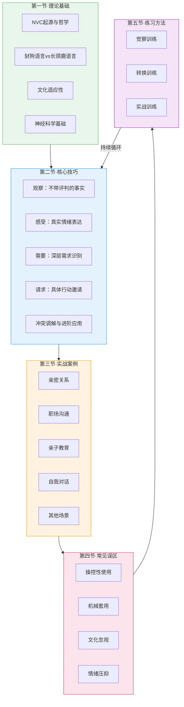

# 第六节 本章小结

本节对第二十六章「非暴力沟通实践」的全部内容进行系统回顾与整合。它不是简单的要点罗列，而是一张知识地图——帮助你将五节内容串联成完整的认知体系，找到自己的学习位置，并规划下一步的成长路径。

***

## 一、NVC四步法核心回顾

非暴力沟通（Nonviolent Communication, NVC）的核心是四步法。马歇尔·卢森堡博士用四十年的实践证明，这四个要素构成了一套完整的表达与倾听框架，能够在冲突、误解和情绪风暴中打开一条通往理解的通道。

### 1.1 四步法详解

**第一步：观察（Observation）**

客观描述你看到、听到、触摸到的具体事实，不加入任何评判、推论或标签。观察要求你像一台摄像机——只记录画面和声音，不添加旁白和解读。

| 评判语言（豺狗） | 观察语言（长颈鹿） |
|---|---|
| "你总是很晚回来" | "这周有三天你在十点后回家" |
| "你根本不在乎我" | "我发的五条消息你只回了一条" |
| "你太自私了" | "上次聚餐你没有问我想吃什么" |
| "你工作态度有问题" | "这个月的三次周报你都迟交了两天" |
| "你从来不帮忙做家务" | "过去两周的碗都是我洗的" |

观察是四步法的基石。如果观察中掺杂了评判，对方的防御机制会被立刻触发，后面的三步就失去了根基。本章第二节详细讲解了评判的七种常见伪装形式：绝对化用语（总是/从来/永远）、心理分析（你就是故意的）、比较（别人家的丈夫/妻子都……）、标签化（你就是个懒人）、夸大其词（你每次都这样）、意图揣测（你就是想气我）、道德审判（你这样做不对）。

**第二步：感受（Feeling）**

表达内心真实的情绪体验，而非对他人行为的想法或判断。感受是内心需要是否被满足的信号灯——当需要被满足时，我们感到愉悦、安心、温暖；当需要未被满足时，我们感到失落、焦虑、愤怒。

| 想法/判断（伪感受） | 真实感受 |
|---|---|
| "我觉得你不爱我" | "我感到孤独和不安" |
| "我觉得被忽视了" | "我感到失落和沮丧" |
| "我觉得这不公平" | "我感到委屈和愤怒" |
| "我觉得你不尊重我" | "我感到受伤和无力" |
| "我觉得自己没用" | "我感到挫败和焦虑" |

区分想法和感受是NVC学习中最关键的转折点之一。当你用"我觉得……"开头时，后面跟的往往是对他人的判断（"我觉得你不关心我"），而不是自己的真实感受（"我感到被冷落"）。本章第二节提供了完整的感受词汇表，包含正面感受42个和负面感受56个，建议反复练习直到这些词汇成为你的第二语言。

**第三步：需要（Need）**

识别感受背后的深层需要。NVC的核心洞见是：**感受源于我们的需要是否被满足，而非他人的行为。** 他人只是触发了我们内心已有的反应模式。

人类共享的基本需要包括：

| 需要类别 | 具体需要 |
|---|---|
| 生存需要 | 食物、水、住所、休息、安全 |
| 连接需要 | 爱、归属、亲密、理解、陪伴、信任 |
| 自主需要 | 选择、自由、独立、空间、自主权 |
| 意义需要 | 目标、成长、贡献、创造力、价值感 |
| 尊重需要 | 平等、认可、尊严、公平、被看见 |
| 身体需要 | 触碰、运动、感官愉悦、健康 |

一个关键区分：**需要是普遍的、抽象的；策略是个人的、具体的。** 例如"被尊重"是需要，"你必须每天说早安"是策略。当对方拒绝了你的策略时，不要执着于那个具体行为——回到需要层面，你往往能找到多种替代方案。

**第四步：请求（Request）**

提出具体、可行、正向的行动邀请。请求的三个核心特征：

- **具体**：不说"对我好一点"，说"每天花十五分钟和我聊聊今天发生的事"
- **正向**：说"你愿意……吗"，而非"你能不能别再……"
- **可协商**：对方可以说"不"，你可以和对方一起寻找满足需要的替代方案

| 模糊请求 | 具体请求 |
|---|---|
| "多关心我" | "下班回来时能先抱我一下吗" |
| "别那么忙" | "每周能留一个晚上我们单独吃饭吗" |
| "认真一点" | "报告提交前能先让我过目一遍吗" |
| "尊重我的感受" | "我说话的时候能先不打断我吗" |

请求与要求的根本区别在于：**当对方说"不"时，你的反应是什么。** 如果你感到愤怒或试图施压，那它本质上是一个要求。NVC的请求是一个真诚的邀请——即使对方拒绝，你也会回到需要层面，和对方一起探索其他满足需要的方式。

**完整公式**：

> 当我[观察]时，我感到[感受]，因为我需要[需要]。你愿意[请求]吗？

**示例**：
> "当我看到你这周有三天在十点后回家（观察），我感到有些孤独和担心（感受），因为我需要亲密连接和安心（需要）。你愿意这周至少两天在八点前回来，我们一起吃晚饭吗？（请求）"

四步法不必每次都完整使用。在实际沟通中，你可以灵活选择——有时只需要说出观察和感受，有时只做同理倾听。机械地背诵公式反而会让人感觉不真诚。重要的是内化NVC的精神，而非背诵格式。

***

## 二、各节核心要点整合

### 2.1 第一节·理论基础要点

**NVC的起源与哲学根基**

马歇尔·卢森堡博士在种族冲突频发的底特律度过童年，这段经历驱使他思考：为什么有些人能在极端暴力面前保持人性？他的答案是——存在一种根植于共情的沟通方式，它能穿透暴力和评判的外壳，触达人心深处的柔软。

NVC的哲学基础融合了三个来源：人本主义心理学（罗杰斯的无条件积极关注）、甘地的非暴力思想（ahimsa）、以及东方灵性传统（正念与慈悲）。这种跨文化的思想根基使NVC在全球不同文化中都能找到共鸣点。

**豺狗语言与长颈鹿语言**

这是NVC中最具辨识度的隐喻。豺狗代表评判、指责、比较、命令——这是我们在生存压力下习得的语言模式。长颈鹿是陆地上心脏最大的动物，象征着从心出发的沟通——观察、感受、需要、请求。

学习NVC的本质是语言习惯的重塑。研究表明，人类每天平均产生约6万个念头，其中约80%是负面的、评判性的。我们对自己和他人的内在语言，大多是豺狗式的。NVC不是让你压抑这些评判，而是帮助你觉察它们，然后选择更有连接性的表达方式。

**NVC的文化适应性**

NVC在中国文化语境中有独特的优势和挑战。优势在于：儒家的"仁"强调人与人的关怀，佛家的慈悲观强调理解众生的苦，道家的"无为"强调顺应而非强迫——这些都与NVC高度契合。挑战在于：中国文化中的含蓄、面子、权威等级等因素会影响NVC的直接表达方式。本章讨论了如何在保持NVC精神的同时，尊重文化差异。

**NVC的神经科学基础**

从脑科学角度看，NVC的有效性有坚实的神经学依据：观察语言不触发杏仁核的威胁反应，共情倾听激活镜像神经元系统，真诚连接促进催产素分泌。NVC本质上是一套经过精心设计的语言模式，目的是最大限度地减少对听者大脑防御系统的刺激，同时激活理性思考和共情功能。

### 2.2 第二节·核心技巧要点

**四步法的深度拆解**

第二节不仅讲解了四步法的表面含义，更深入探讨了每一步的常见陷阱和高级技巧：

- **观察**的陷阱：把"你总是"误认为观察，把心理分析当作事实描述
- **感受**的陷阱：把对他人行为的判断说成感受（"我觉得被抛弃"是想法，"我感到害怕"是感受）
- **需要**的陷阱：把策略当成需要（"我需要你每天打电话给我"是策略，"我需要连接和安心"是需要）
- **请求**的陷阱：把请求变成最后通牒，或提出对方无法满足的请求

**NVC的完整应用与冲突调解**

四步法不是线性公式，而是一个循环系统。在实际对话中，你可能需要在表达和倾听之间反复切换。冲突调解时，NVC提供了"长颈鹿式调解"的框架：先同理倾听双方的需要，再寻找满足双方需要的策略。关键洞见是——冲突永远是策略之争，不是人之争。

**进阶练习方法**

第二节末尾提供了从初学者到精通者的进阶练习路线，包括：每日语言记录、感受签到、需求识别训练、豺狗转长颈鹿练习、NVC冥想、角色扮演等。每个练习都配有具体的操作步骤和评估标准。

### 2.3 第三节·实战案例要点

本节通过九个真实场景展示了NVC的实战应用：

| 案例 | 核心冲突 | NVC关键洞见 |
|---|---|---|
| 亲密关系日常冲突 | 家务分工、情感表达差异 | 需要层面的一致性远比策略层面的妥协重要 |
| 职场上下级冲突 | 工作压力、评价分歧 | 区分"对人评判"和"对事观察"是职场NVC的核心 |
| 亲子教育代际冲突 | 学习态度、价值观差异 | 孩子的行为背后有未被看见的需要 |
| 同事间误解 | 沟通风格、工作边界 | 同理倾听比自我辩解更能化解误解 |
| 跨代沟通价值观冲突 | 生活方式、婚恋观差异 | 尊重不等于认同，理解不等于放弃自我 |
| 自我对话 | 自我批评、完美主义 | NVC不仅用于人际沟通，更用于内心对话 |
| 服务场景 | 客户投诉、服务质量 | 在高压环境下保持NVC需要提前练习和准备 |
| 社交媒体 | 网络争论、言语攻击 | 线上沟通更需要NVC，因为缺乏非语言线索 |
| 团队会议 | 意见分歧、决策冲突 | NVC能提高会议效率，因为它聚焦于需要而非立场 |

所有案例的共同模式是：**暴力语言→情绪升级→冲突加剧** 和 **NVC表达→情绪被看见→需要被理解→合作解决问题** 的对比。当你能在真实场景中识别这个模式，NVC就开始成为你的本能反应。

### 2.4 第四节·常见误区要点

本节梳理了学习和应用NVC时最常犯的八个误区：

| 误区 | 本质问题 | 纠正方法 |
|---|---|---|
| 将NVC变成操控工具 | 用真诚的外壳包裹私心 | 检验：对方说"不"时你能接受吗？ |
| 机械套用四步法 | 形式大于精神 | 灵活运用，内化精神比背诵公式重要 |
| 忽视文化差异 | 生搬硬套西方模式 | 根据场景调整直接程度和表达方式 |
| 在不安全环境中过度暴露 | 缺乏情境判断力 | 评估环境安全性，保护自己优先 |
| 压抑愤怒 | 把NVC当成忍耐术 | 愤怒是信号，需要被倾听而非压制 |
| 期望立竿见影 | 急于求成 | NVC是长期练习，接受反复和挫折 |
| 只对别人用NVC | 忽视自我对话 | 对自己的豺狗语言保持觉察 |
| 忽视身体信号 | 过度理性化 | 身体是感受的载体，注意生理反应 |

其中最危险的误区是第一个——将NVC变成操控工具。如果你用四步法的结构来包装自己的要求，让对方更难以拒绝，那你不是在实践NVC，而是在用NVC的皮做相反的事。NVC的根基是真诚，真诚意味着你真正准备好听到"不"。

### 2.5 第五节·练习方法要点

第五节提供了系统的NVC训练方案，核心理念是：**NVC不是知识，而是技能。技能只能通过练习获得，不能通过阅读获得。**

练习路线分为三个阶段：

**阶段一：觉察训练（第1-2周）**
- 每日语言记录：识别自己语言中的评判成分
- 感受签到：每天三次用精确的词汇描述当下感受
- 内在观察：注意自己头脑中的豺狗语言

**阶段二：转换训练（第3-4周）**
- 豺狗转长颈鹿：将评判性语言改写为NVC四步法
- 需求识别练习：从感受追溯到需要
- 角色扮演：在安全环境中模拟真实对话

**阶段三：实战训练（第5周起）**
- 在真实对话中使用NVC，从低风险场景开始
- NVC日记：记录每天的NVC实践和反思
- 伙伴练习：找一个练习伙伴，定期互相反馈

每个阶段都配有具体的练习模板、评估标准和常见问题解答。

***

## 三、知识体系全景图

将本章五节内容串联起来，形成完整的NVC知识体系：

这张图展示了一个螺旋上升的学习路径：理论→技能→实践→发现问题→修正练习→回到技能层进行更深层次的练习。NVC的学习不是线性的，而是螺旋式的——每次循环你都会在更高的层次上理解同样的概念。

***

## 四、NVC能力自评框架

在制定行动计划之前，先评估你当前的NVC能力水平。这个自评框架基于本章内容设计，帮助你找到最需要加强的领域。

### 4.1 自评量表

对以下每个陈述，用1-5分打分（1=完全不符合，5=完全符合）：

**观察能力**

| # | 陈述 | 分数 |
|---|------|------|
| 1 | 我能区分"我看到的事实"和"我对事实的解读" | /5 |
| 2 | 我在描述他人行为时，能避免使用"总是""从来""永远"等词 | /5 |
| 3 | 当我感到不满时，我能在说话前先想清楚"具体发生了什么" | /5 |

**感受表达**

| # | 陈述 | 分数 |
|---|------|------|
| 4 | 我能用精确的词汇描述自己的情绪（不只是"不开心"） | /5 |
| 5 | 我能区分"我的感受"和"我对别人的判断" | /5 |
| 6 | 我愿意在安全的关系中表达脆弱的感受 | /5 |

**需要识别**

| # | 陈述 | 分数 |
|---|------|------|
| 7 | 我能从感受追溯到背后的需要 | /5 |
| 8 | 我能区分"需要"（普遍的）和"策略"（个人的） | /5 |
| 9 | 当对方拒绝我的策略时，我能回到需要层面寻找替代方案 | /5 |

**请求能力**

| # | 陈述 | 分数 |
|---|------|------|
| 10 | 我的请求具体到对方知道"做什么" | /5 |
| 11 | 我的请求是正向的（说"做什么"而非"别做什么"） | /5 |
| 12 | 当对方说"不"时，我能接受并探索替代方案 | /5 |

**同理倾听**

| # | 陈述 | 分数 |
|---|------|------|
| 13 | 当别人用评判性语言表达时，我能听到背后的需要 | /5 |
| 14 | 我能在不给建议的情况下倾听他人的痛苦 | /5 |
| 15 | 我能在他人的愤怒中看到未被满足的需要 | /5 |

### 4.2 评分解读

- **总分 60-75分**：NVC已内化为你的自然反应，关注进阶应用和帮助他人
- **总分 45-59分**：你有良好的基础，在特定领域需要针对性练习
- **总分 30-44分**：你理解NVC的理念，但实践中经常退回旧习惯，需要系统练习
- **总分 15-29分**：你刚刚开始NVC之旅，建议从觉察训练开始，不要急于实战

**针对性提升建议**：

| 薄弱领域 | 首要行动 |
|---|---|
| 观察能力 < 9分 | 做一周语言记录，每天至少记录3句话并区分观察/评判 |
| 感受表达 < 9分 | 学习感受词汇表，每天做3次感受签到练习 |
| 需要识别 < 9分 | 做"感受→需要"追溯练习，整理个人需要清单 |
| 请求能力 < 9分 | 练习将模糊请求改写为具体、正向的行动邀请 |
| 同理倾听 < 9分 | 找伙伴做倾听练习，目标：10分钟不给建议只做反馈 |

***

## 五、分层行动计划

根据你的NVC能力水平和可用时间，选择适合的行动计划。

### 5.1 入门者行动计划（总分 15-29分）

**第1-2周：建立觉察**

- [ ] 阅读马歇尔·卢森堡《非暴力沟通》前六章，理解四步法基本概念
- [ ] 开始每日语言记录：每天记录至少3句自己说过的话，标注其中的评判成分
- [ ] 学习感受词汇表：打印一份贴在显眼的地方，每天尝试用新词描述感受
- [ ] 做一次"内在豺狗"觉察练习：安静坐下10分钟，注意头脑中出现的评判性想法

**第3-4周：初步练习**

- [ ] 做5次"豺狗转长颈鹿"书面练习，将评判性语言改写为NVC四步法
- [ ] 在低风险场景中尝试使用观察语言（例如描述天气、描述看到的事物）
- [ ] 完成一次NVC自我连接冥想（10分钟）
- [ ] 写NVC日记至少7天，记录每天的觉察和尝试

**第5-8周：建立基础**

- [ ] 在一个安全的关系中，尝试完整的NVC四步法表达至少3次
- [ ] 找一个练习伙伴，完成至少2次角色扮演
- [ ] 回顾一次过去的冲突，用NVC四步法重新描述双方的表达
- [ ] 整理出你最常出现的3个未被满足的需要

### 5.2 进阶者行动计划（总分 30-44分）

**第1-2周：突破瓶颈**

- [ ] 回顾过去一个月的NVC实践，找出最常失败的场景
- [ ] 针对失败场景做专项练习（例如：在愤怒中使用NVC、面对评判性语言时保持同理）
- [ ] 完成四周系统练习计划中的进阶部分
- [ ] 阅读《非暴力沟通实践手册》，完成其中的练习

**第3-4周：扩展应用**

- [ ] 在中等风险场景中使用NVC（例如：与同事讨论工作分歧、与家人讨论敏感话题）
- [ ] 练习"同理倾听"——在他人表达时，先猜测对方的观察、感受、需要、请求
- [ ] 写NVC日记至少14天，重点记录失败和从失败中学到的东西
- [ ] 参加NVC读书小组或线上练习群

**第5-8周：深度内化**

- [ ] 在高风险场景中使用NVC（例如：处理长期矛盾、面对强烈情绪）
- [ ] 练习NVC自我对话：对自己的内疚、羞耻、自责使用NVC
- [ ] 帮助一个朋友或家人理解NVC的基本概念
- [ ] 将NVC与其他沟通技巧（积极倾听、共情回应、关键对话）整合运用

### 5.3 精通者行动计划（总分 45-75分）

**持续深化方向**

- [ ] 学习NVC调解技巧，帮助身边的人化解矛盾
- [ ] 在团队或组织中推广NVC，建立共同的沟通语言
- [ ] 阅读马歇尔·卢森堡的进阶著作（《丰盛生命篇》《冲突调解篇》）
- [ ] 参加NVC认证培训，向专业NVC培训师的方向发展
- [ ] 探索NVC与正念、非暴力行动、系统变革的交叉领域
- [ ] 在家庭中建立NVC练习传统，例如每周一次的家庭分享会

**帮助他人成长**

- [ ] 成为NVC练习伙伴，陪伴初学者走过前两个月
- [ ] 在工作坊或读书会中分享你的NVC实践故事
- [ ] 整理你的NVC实践笔记，形成个人案例库
- [ ] 关注NVC在中国的发展，参与本地NVC社区活动

***

## 六、NVC实践中的常见障碍与应对

### 6.1 障碍一：在情绪风暴中无法使用NVC

**现象**：当你被强烈情绪淹没时，大脑的前额叶皮层（理性脑）被杏仁核（情绪脑）接管，你完全想不起NVC的四步法。

**应对策略**：

1. **暂停技术**：感觉情绪要爆发时，说"我需要一点时间整理自己的感受，我们10分钟后继续"。这不是逃避，而是为有效沟通创造条件。
2. **身体锚定**：情绪风暴中，先关注身体感觉——脚踩地面的感觉、呼吸的节奏、双手的温度。身体觉察能帮助你从情绪漩涡中抽离。
3. **简化使用**：在强烈情绪中，不要试图完整使用四步法。只做一步就够了——先说出你的感受："我现在非常生气"或"我感到很受伤"。
4. **事后复盘**：风暴过后，用NVC日记回顾：当时我观察到什么？我的感受是什么？我需要什么？下次我想如何表达？

### 6.2 障碍二：对方不配合

**现象**：你用NVC表达，但对方继续用暴力语言攻击你，或者根本不理你。

**应对策略**：

1. **坚持同理倾听**：当对方用暴力语言时，不要反击，也不要沉默忍受。尝试听到对方评判背后的需要。例如，当对方说"你从来不关心我"时，你可以在心里翻译："你是不是需要更多的关心和陪伴？"
2. **设定边界**：NVC不是无底线的忍耐。如果对方的语言已经构成侮辱或威胁，你有权说"我理解你很生气，但我无法在被骂的时候继续对话。我们可以冷静后再谈。"
3. **接受局限**：你只能控制自己的表达方式，无法控制对方的反应。NVC的目标不是改变对方，而是改变你自己的沟通方式。有时候，最好的选择是暂时离开。

### 6.3 障碍三：觉得NVC太"假"

**现象**：你觉得用NVC说话不像自己，感觉在演戏或讨好。

**应对策略**：

1. **区分"假"和"新"**：任何新技能在熟练之前都会感觉不自然。学开车时手脚配合也很"假"，但熟练后就成了本能。NVC也是如此。
2. **从内心对话开始**：如果对别人说NVC的话感觉假，先对自己说。用NVC的方式理解自己的愤怒、焦虑和不满。
3. **找到自己的NVC风格**：NVC不要求你变成另一个人。幽默的人可以用幽默的方式表达观察，直接的人可以用简洁的方式说出需要。重要的是精神，不是格式。

### 6.4 障碍四：进步太慢，想放弃

**现象**：你练习了一段时间，但在真实对话中还是会回到旧习惯。

**应对策略**：

1. **降低期待**：NVC的创始人卢森堡博士说他自己也在持续学习。这不是一个有终点的课程，而是一条终身的道路。
2. **庆祝小进步**：从"完全没有觉察"到"说完后意识到自己刚才在评判"，这已经是巨大的进步。觉察是改变的第一步。
3. **找到同伴**：一个人练习NVC很难坚持。加入一个NVC练习群或找一个练习伙伴，定期分享你的实践和困惑。

***

## 七、NVC与其他方法的互补关系

NVC不是孤立存在的，它与多种沟通和心理学方法形成互补。了解这些关系有助于你建立更完整的沟通能力体系。

| 方法 | 与NVC的互补点 | 适用场景 |
|---|---|---|
| **积极倾听** | NVC的同理倾听是积极倾听的深度版本 | 日常沟通中的倾听改善 |
| **关键对话** | 提供高风险对话的结构化框架 | 职场中的重要谈判和决策 |
| **正念冥想** | 培养当下的觉察力，是NVC自我连接的基础 | 情绪调节和内在觉察 |
| **认知行为疗法（CBT）** | 帮助识别和改变思维模式中的评判 | 深层心理模式的改变 |
| **动机式访谈（MI）** | 通过同理倾听促进对方自主改变 | 助人场景（咨询、教练、教育） |
| **系统式家庭治疗** | 从系统视角理解家庭中的沟通模式 | 家庭关系中的深层问题 |
| **阿德勒心理学** | "课题分离"与NVC的"自我负责"理念相通 | 人际边界和个人成长 |

NVC的核心优势在于它的简洁性和普适性——四步法可以在任何场景中使用，不需要专业心理学背景。但当你面对复杂的心理问题或系统性冲突时，结合其他方法会更有效。

***

## 八、延伸阅读与学习资源

### 8.1 核心著作

**《非暴力沟通》**（马歇尔·卢森堡 著）
NVC的经典之作，系统介绍了四步法的理论与实践。中文版由华夏出版社出版，是学习NVC的首选读物。建议至少读两遍——第一遍理解概念，第二遍结合实践体会。

**《非暴力沟通实践手册》**（马歇尔·卢森堡 著）
《非暴力沟通》的配套练习册，包含大量具体场景的练习和案例分析。适合边学边练，每个练习都配有清晰的步骤说明。

### 8.2 进阶阅读

**《非暴力沟通：丰盛生命篇》**（马歇尔·卢森堡 著）
探讨NVC在个人成长、灵性发展和生命意义层面的深层应用。适合已经掌握四步法基础的读者，帮助你将NVC从沟通技巧提升为生活哲学。

**《非暴力沟通：冲突调解篇》**（马歇尔·卢森堡 著）
聚焦NVC在冲突调解中的应用，包含国际冲突、社区矛盾、家庭纠纷等案例。适合希望学习NVC调解技术的读者。

### 8.3 相关推荐

**《关键对话》**（科里·帕特森 等著）
探讨高风险、高情绪对话的应对方法。与NVC形成互补——NVC提供内心框架，《关键对话》提供外部结构。

**《共情的力量》**（亚瑟·乔拉米卡利 著）
深入探讨共情的心理学机制，帮助理解NVC中"同理倾听"的底层原理。

**《正念的奇迹》**（一行禅师 著）
正念与NVC的自我连接练习高度相关。一行禅师用简洁的语言讲解如何培养当下的觉察力——这是使用NVC的前提能力。

**《被讨厌的勇气》**（岸见一郎、古贺史健 著）
阿德勒心理学视角下的人际关系。阿德勒的"课题分离"与NVC的"自我负责"理念高度相通——你无法控制别人的行为，但可以选择自己的回应方式。

**《情绪的语言》**（卡巴金 等著）
基于正念的情绪觉察方法，与NVC的感受识别练习形成深度互补。

### 8.4 线上学习资源

- **NVC Academy**（nvcacademy.com）：提供在线课程和认证培训
- **中国NVC网**（非暴力沟通中文网）：中文NVC社区和学习资源
- **YouTube：Marshall Rosenberg**：卢森堡博士的讲座视频，亲眼看到NVC大师的示范是最佳学习方式之一
- **NVC练习微信群**：搜索"非暴力沟通练习"可以找到中文NVC练习社群

***

## 九、本章结语

非暴力沟通不是一种技巧，而是一种生活方式。

它邀请我们回到人与人之间最本真的连接——当我们放下评判，表达真实，倾听需要时，理解与爱自然涌现。这听起来很理想化，但卢森堡博士用四十年的实践证明：即使在最极端的暴力环境中——种族冲突的社区、战乱中的难民营、充满敌意的谈判桌——NVC也能打开对话的空间。

你不需要完美地使用四步法，也不需要在每次对话中都保持NVC状态。你只需要做一件事：**开始觉察。** 觉察你的语言中有多少评判，觉察你的感受下面藏着什么需要，觉察你的请求到底是邀请还是要求。

觉察本身就是改变的开始。

正如马歇尔·卢森堡所说：

> "当我们真正倾听彼此的需要，冲突就不再是问题，而是通向更深理解的桥梁。"

从今天开始，选择一个练习，迈出第一步。NVC的旅程不需要完美，只需要真诚。

***

## 十、快速参考卡

将以下内容保存到手机或打印出来，在需要时快速查阅。

**NVC四步法速查**

观察 → 感受 → 需要 → 请求

公式：当我[观察]时，我感到[感受]，
      因为我需要[需要]。你愿意[请求]吗？

**评判→观察转换速查**

"你总是…" → "我注意到这周有X次…"
"你从来不…" → "在过去X天里，我没有看到…"
"你应该…" → "我需要…，你愿意…吗？"
"你太X了" → "当你做[具体行为]时，我感到…"

**情绪急救三步**

1. 暂停：深呼吸，脚踩地面
2. 觉察：我现在感受到什么？（命名情绪）
3. 连接：这个感受在告诉我什么需要没有被满足？

**同理倾听四问**

对方说了什么 → 他/她观察到了什么？
            → 他/她感受到了什么？
            → 他/她需要什么？
            → 他/她想要什么？
