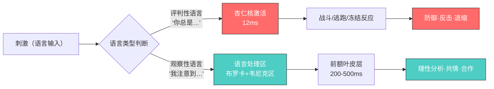
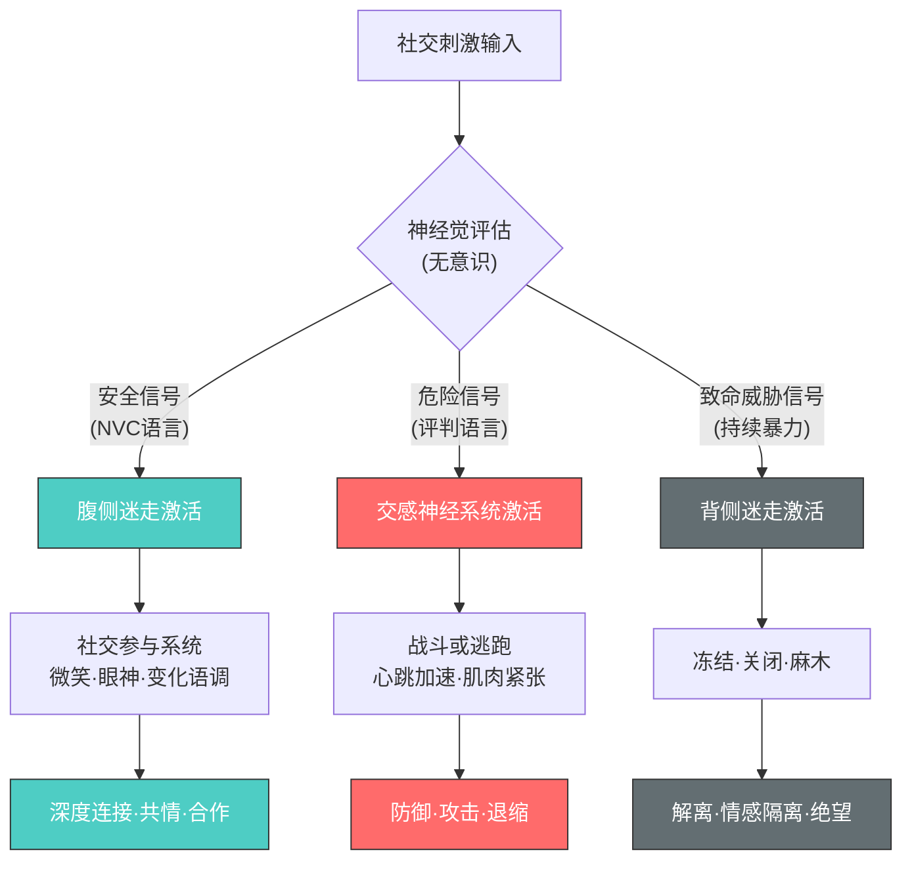
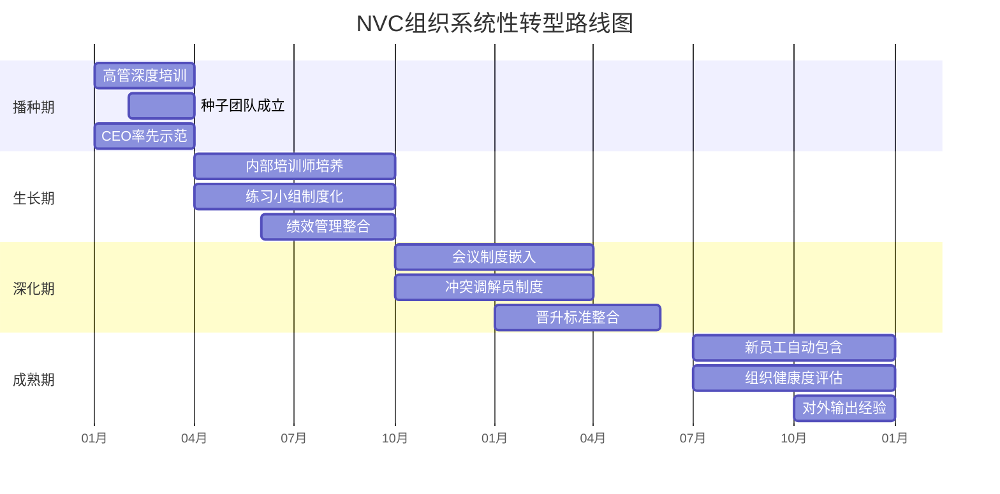
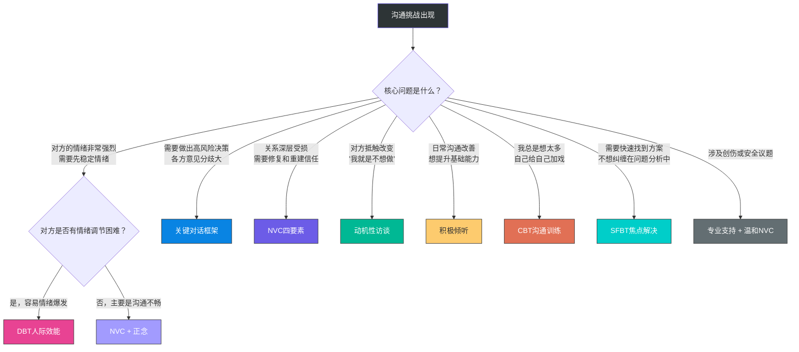
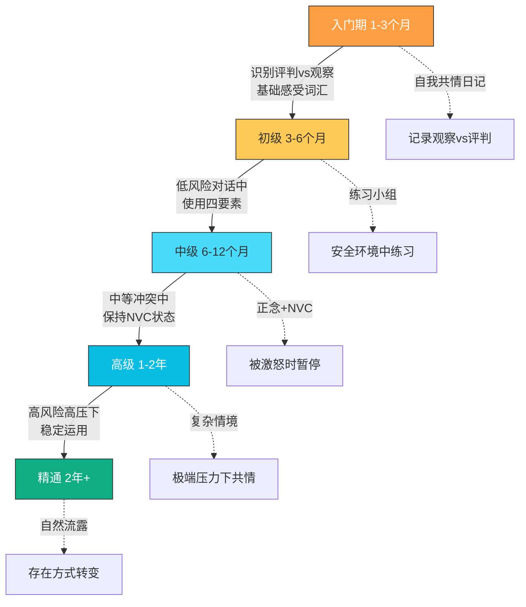

# 第二十六章 非暴力沟通实践 · 深度拓展

> **本章定位**：本章是第二十六章的终极进阶篇。在掌握了NVC四要素（观察、感受、需要、请求）和基本练习方法之后，本章将带你深入理解NVC背后的科学原理、组织级应用策略、跨文化适应技巧、数字时代的实践方法，以及从"刻意使用"走向"自然流露"的完整进阶路径。无论你是NVC的初学者想要理解"为什么有效"，还是资深实践者想要突破瓶颈，本章都提供了从理论到实操的完整深度内容。
>
> **学习目标**：
> 1. 理解NVC的神经科学机制——知道"为什么有效"能显著提升练习动力和精度
> 2. 掌握NVC在组织中的系统性应用——从绩效反馈到文化转型
> 3. 学会将正念与NVC结合——从"刻意使用"走向"自然流露"
> 4. 了解NVC的跨文化适应策略——在不同文化语境中灵活运用
> 5. 基于研究证据理性看待NVC——知道它的优势、局限和适用边界
> 6. 掌握数字沟通中的NVC实践——文字、邮件、群聊、远程协作
> 7. 理解NVC与创伤知情实践的关系——在敏感场景中安全运用
> 8. 学会引导和教授NVC——从个人实践者成长为引导者
> 9. 建立长期进阶路径——从入门到精通的能力发展路线图

**本章知识地图**：

```mermaid
flowchart TD
    A["深度拓展"] --> B["神经科学基础"]
    A --> C["组织应用"]
    A --> D["正念结合"]
    A --> E["跨文化适应"]
    A --> F["研究证据"]
    A --> G["方法对比"]
    A --> H["数字沟通"]
    A --> I["进阶练习"]
    A --> J["躯体实践"]
    A --> K["引导与教学"]

    B --> B1["杏仁核劫持"]
    B --> B2["镜像神经元"]
    B --> B3["催产素/皮质醇"]
    B --> B4["前额叶可塑性"]
    B --> B5["多迷走神经理论"]
    B --> B6["肠脑轴"]

    C --> C1["绩效反馈"]
    C --> C2["冲突调解"]
    C --> C3["领导力"]
    C --> C4["系统转型"]

    D --> D1["身体觉察"]
    D --> D2["观察者视角"]
    D --> D3["慈悲冥想"]
    D --> D4["日常练习方案"]

    H --> H1["文字消息NVC"]
    H --> H2["邮件NVC"]
    H --> H3["中国协作平台"]
    H --> H4["远程团队"]
    H --> H5["AI时代NVC"]

    I --> I1["自我共情"]
    I --> I2["复杂情境"]
    I --> I3["高级练习"]
    I --> I4["发展路线图"]

    J --> J1["身体扫描"]
    J --> J2["呼吸调节"]
    J --> J3["动作释放"]

    K --> K1["引导技术"]
    K --> K2["教学设计"]
    K --> K3["社群建设"]

    style A fill:#2d3436,stroke:#6c5ce7,color:#fff
    style B fill:#6c5ce7,stroke:#333,color:#fff
    style C fill:#00b894,stroke:#333,color:#fff
    style D fill:#fdcb6e,stroke:#333,color:#333
    style E fill:#e17055,stroke:#333,color:#fff
    style F fill:#0984e3,stroke:#333,color:#fff
    style G fill:#636e72,stroke:#333,color:#fff
    style H fill:#e84393,stroke:#333,color:#fff
    style I fill:#00cec9,stroke:#333,color:#fff
    style J fill:#a29bfe,stroke:#333,color:#fff
    style K fill:#fd79a8,stroke:#333,color:#fff
```

---

## 一、NVC的神经科学基础

非暴力沟通（Nonviolent Communication，简称NVC）不仅是一种沟通方法论，更有坚实的神经科学基础支撑其有效性。近年来，脑科学研究为我们理解NVC为何能够深刻改变人际互动提供了全新的视角。理解这些机制不是学术游戏——当你知道"为什么有效"时，练习的动力和精度都会显著提升。

### 1.1 杏仁核与情绪劫持

人类大脑中的杏仁核（Amygdala）是情绪处理的核心区域，尤其在感知威胁时会迅速激活"战斗-逃跑-冻结"（Fight-Flight-Freeze）反应。当我们在沟通中听到批评性、指责性或评判性语言时，杏仁核会在极短时间内被激活——这一过程仅需约12毫秒。这种原始的神经反应远快于前额叶皮层的理性分析（需要约200-500毫秒），因此我们常常在理智介入之前就已经产生了防御性反应。

心理学家丹尼尔·戈尔曼（Daniel Goleman）将这种现象称为"杏仁核劫持"（Amygdala Hijack）——情绪中枢绕过理性中枢直接控制行为。在日常沟通中，这表现为：你明明知道不该发火，但话已经说出口了；对方明明在讲道理，但你听到的全是攻击。

NVC的核心理念——区分观察与评判——正是在这一神经机制上发挥作用。当我们用"我注意到你这周有三次会议迟到了15分钟"替代"你总是不守时、不尊重别人"，前一种表达方式不会触发对方杏仁核的威胁反应。神经影像学研究显示，中性的观察性语言主要激活大脑的语言处理区域（如布罗卡区和韦尼克区），而非情绪性区域，这使得信息接收者能够保持理性思考的状态。

具体而言，评判性语言和观察性语言在大脑中的处理路径完全不同：

| 语言类型 | 激活区域 | 处理时间 | 行为结果 |
|---------|---------|---------|---------|
| 评判性语言（"你总是……"） | 杏仁核 → 杏仁核劫持 | 12ms 情绪启动 | 防御、反击、退缩 |
| 观察性语言（"我注意到……"） | 布罗卡区 → 韦尼克区 → 前额叶 | 200-500ms 理性处理 | 倾听、理解、合作 |

> **图示说明**：NVC的核心神经科学原理——语言输入经过不同路径产生截然不同的结果。观察性语言绕过杏仁核的情绪捷径，直达前额叶的理性处理区域，从而为建设性对话创造生理条件。

马歇尔·卢森堡博士提出的NVC四要素——观察、感受、需要、请求——本质上是一套经过精心设计的语言模式，其目的是最大限度地减少对听者杏仁核的刺激，同时激活前额叶皮层的共情和理性分析功能。

**"12毫秒窗口"的实践意义**：理解杏仁核劫持的12毫秒时间窗口，对NVC实践有一个重要的启示——你无法"控制"对方的杏仁核反应，但你可以通过选择自己的语言来决定给对方的大脑发送什么信号。每一个词汇选择都是一次"神经信号设计"。"你总是迟到"发送的是威胁信号，"我注意到这周有三次迟到"发送的是信息信号。两者描述的是同一件事，但它们在对方大脑中激活的是完全不同的神经回路。

### 1.2 镜像神经元与共情的生物学机制

1990年代，意大利帕尔马大学的贾科莫·里佐拉蒂（Giacomo Rizzolatti）研究团队在研究恒河猴运动皮层时意外发现了镜像神经元（Mirror Neurons）。这些神经元在猴子自己执行某个动作和观察其他个体执行同样动作时都会放电。这一发现彻底改变了我们对共情、语言进化和社会认知的理解。

镜像神经元在人类大脑中的分布远比猴子广泛，主要集中在额下回（布罗卡区附近）、顶下小叶和颞上沟。它们构成了一个"动作-理解"系统——当我们观察他人时，我们的大脑会自动模拟对方的状态，仿佛我们自己正在经历同样的体验。

NVC中的"共情倾听"环节正是利用了镜像神经元的工作机制。当我们全身心地倾听对方，试图理解对方的感受和需要时，我们大脑中的镜像神经元系统被深度激活，帮助我们真正"感受到"对方的内心状态。反过来，当我们用NVC的方式表达自己的感受和需要时，对方的镜像神经元也会被激活，从而产生真正的理解和共鸣。

这一机制解释了为什么NVC强调"先共情理解对方，再表达自己"——当你先激活了对方的镜像神经元系统（通过真诚地倾听和反映），对方的大脑已经处于"模拟你的状态"的准备中，此时你的表达更容易被接收和理解。

研究还发现，经过长期共情训练的人，其大脑中与共情相关的区域（包括前脑岛和前扣带皮层）会出现结构性变化，灰质密度增加。一项由马克斯·普朗克研究所发布的研究表明，仅仅8周的慈悲冥想训练就能使这些区域的灰质密度显著增加。这意味着NVC练习不仅能改善当下的沟通质量，还能从根本上增强大脑的共情能力——共情是可以训练的肌肉，不是天赋。

**镜像神经元与"传染性情绪"**：镜像神经元系统也解释了为什么情绪具有"传染性"——当一个人在你面前焦虑时，你的大脑会自动模拟焦虑状态。这对NVC实践有双向启示：一方面，当你保持平静和开放时，你的状态会"传染"给对方（共调效应）；另一方面，当你面对一个强烈情绪化的人时，你需要意识到自己的情绪反应可能部分来自镜像神经元的"模拟"，而非你自己的真实感受。区分"这是我自己的感受"和"这是我从对方那里镜像过来的感受"，是NVC进阶练习的重要能力。

### 1.3 催产素、皮质醇与信任神经化学

催产素（Oxytocin）被称为"信任荷尔蒙"或"连接荷尔蒙"，它在人际信任和亲密关系中扮演着关键角色。催产素由下丘脑合成、垂体后叶释放，其作用远超人们熟知的母婴联结——它调节着所有类型的社会信任和合作行为。

研究表明，当人们感受到被理解、被接纳和被尊重时，大脑会释放更多的催产素。具体来说，以下NVC行为已被证明能显著提升催产素水平：

- **脆弱的自我表露**：当你说出"我感到害怕，因为我需要安全"，而不是用愤怒掩盖恐惧，你的脆弱性会触发双方的催产素释放
- **非评判性倾听**：当对方感受到你没有在内心给TA"打分"，防御系统会自动降低
- **积极的情感回应**：当对方表达痛苦时，你的共情回应（而非建议或评判）创造了一个催产素富集的互动场

相反，评判、指责和批评性的沟通方式会触发皮质醇（Cortisol，压力荷尔蒙）的释放。加州大学洛杉矶分校的史蒂夫·科尔（Steve Cole）教授的研究显示，长期处于高皮质醇状态不仅损害免疫系统和心血管健康，还会改变基因表达模式——与炎症相关的基因被上调，与抗病毒相关的基因被下调。在沟通层面，高皮质醇状态会抑制前额叶皮层的功能，使理性思考和创造性问题解决变得更加困难。

这意味着，每一次充满评判的沟通不仅在当下造成了伤害，还在生理层面积累了长期的健康成本。反之，NVC式的沟通不仅改善关系，还在为双方的生理健康投资。

**催产素的"信任螺旋"效应**：苏黎世大学的恩斯特·费尔（Ernst Fehr）团队的研究发现，催产素的释放具有"正反馈循环"特征——当你用NVC建立信任时，对方的催产素升高，对方更愿意信任你并以善意回应，这又进一步提升了你的催产素水平。这种"信任螺旋"解释了为什么NVC的效果往往是累积性的：前几次对话可能感觉很刻意，但随着信任螺旋的建立，对话会变得越来越自然和深入。

### 1.4 前额叶皮层与情绪调节的可塑性

前额叶皮层（Prefrontal Cortex，PFC）是大脑的"执行控制中心"，负责情绪调节、冲动控制、计划和决策。它分为三个功能子区域：

- **背外侧前额叶（dlPFC）**：逻辑推理、工作记忆、计划制定
- **腹内侧前额叶（vmPFC）**：情绪评估、价值判断、社会认知
- **眶额皮层（OFC）**：冲动控制、奖励评估、决策调整

NVC中的"自我共情"和"暂停"练习，本质上是在训练前额叶皮层对情绪反应的调节能力。神经科学研究表明，正念冥想和情绪调节练习能够显著增强前额叶皮层的功能连接性，使其更好地抑制杏仁核的过度反应。

NVC中的"停下来，深呼吸，连接自己的需要"这一简单步骤，实际上是在利用神经可塑性（Neuroplasticity）原理。每一次你成功地从情绪反应切换到有意识选择，前额叶皮层到杏仁核的抑制通路就被强化一次。就像锻炼肌肉一样，反复练习会建立越来越强的"情绪刹车"系统。

哈佛大学萨拉·拉扎尔（Sara Lazar）博士的研究团队发现，8周的正念训练就能使前额叶皮层的皮质厚度增加，同时杏仁核的灰质密度降低。这意味着练习者不仅获得了更好的情绪控制能力，连大脑的物理结构都发生了变化。NVC练习者报告的"越来越不容易被激怒"并非主观感受，而是有神经生物学基础的真实改变。

**"情绪刹车"的练习阶梯**：前额叶皮层对杏仁核的抑制能力可以通过渐进式练习来增强——

| 练习层级 | 具体操作 | 训练的神经通路 | 预期时间 |
|---------|---------|-------------|---------|
| 第一层 | 事后复盘——冲突后用NVC分析自己的反应 | 元认知觉察 | 1-4周 |
| 第二层 | 暂停觉察——情绪升起时注意到并暂停 | 前额叶-杏仁核抑制 | 4-12周 |
| 第三层 | 实时选择——在对话中选择NVC回应 | 自动化情绪调节 | 3-6个月 |
| 第四层 | 自然流露——NVC成为默认反应模式 | 神经通路重塑 | 6-24个月 |

### 1.5 迷走神经与多迷走神经理论

斯蒂芬·波吉斯（Stephen Porges）提出的多迷走神经理论（Polyvagal Theory）为我们理解NVC的深层机制提供了关键补充。迷走神经是人体最长的脑神经，从脑干延伸到心脏、肺部、肠道等几乎所有内脏器官，是"脑-身"双向通信的核心通道。

波吉斯发现迷走神经有两个分支，功能截然不同：

| 分支 | 解剖名称 | 功能 | 对应状态 | NVC关联 |
|------|---------|------|---------|---------|
| 腹侧迷走神经 | 腹侧迷走复合体 | 社交参与、安全感、平静 | "安全与连接" | NVC对话的理想状态 |
| 背侧迷走神经 | 背侧迷走复合体 | 关闭、麻木、冻结 | "崩溃与关闭" | NVC无法有效工作的状态 |
| 交感神经系统 | — | 战斗、逃跑、激活 | "防御与对抗" | 评判性语言触发的状态 |

**三重防御层级**：波吉斯描述了人类对社交威胁的三层自动反应——

1. **腹侧迷走参与**（安全）：当环境被感知为安全时，腹侧迷走神经激活，我们能够微笑、进行眼神接触、用变化的语调说话、真正倾听。这正是NVC对话的最佳生理状态。
2. **交感激活**（危险）：当安全感受损，身体切换到"战斗-逃跑"模式——心率加速、肌肉紧张、注意力窄化。评判性语言正是触发这种切换的社交信号。
3. **背侧迷走关闭**（致命威胁）：当威胁过大且无法逃跑时，身体进入"冻结"状态——情感麻木、解离、"灵魂出窍"感。长期遭受语言暴力的人可能长期处于这种状态。

**NVC与腹侧迷走神经的协同**：NVC的核心四要素——温和的观察性语言、真实但非攻击性的感受表达、对需要的清晰识别、非强制性的请求——这些正是激活对方腹侧迷走神经的社交安全信号。波吉斯将这些信号称为"神经觉"（Neuroception）——大脑在意识层面之下持续评估环境是否安全。NVC的每一个要素都在向对方的神经觉系统发送"安全"信号。

**"共调"现象**：多迷走神经理论解释了"共调"（Co-regulation）——当一个人处于腹侧迷走安全状态时，他能够帮助另一个人从交感激活或背侧迷走关闭状态中回到安全状态。这正是NVC中"先共情对方"的神经生理基础：当你通过真诚倾听保持自己的腹侧迷走激活状态时，你的平静语调、开放身体语言和稳定存在本身就在帮助对方的神经系统恢复安全。这不是心理暗示，而是迷走神经的生理共振。

> **实践启示**：如果你在对话中注意到对方出现背侧迷走关闭的迹象（眼神呆滞、情感平淡、身体僵住），不要继续"共情倾听"——对方已经不在社交参与状态了。此时需要用温和的身体接触（如果关系允许）、放慢语调、降低音量、创造安全环境来帮助对方的神经系统回到腹侧迷走状态。NVC不是一个"对话技巧"，它需要对对方神经系统状态的实时觉察。

**识别神经系统状态的实用信号**：

| 观察维度 | 腹侧迷走（安全） | 交感激活（危险） | 背侧迷走（关闭） |
|---------|---------------|---------------|----------------|
| 眼神 | 自然接触，灵活移动 | 瞪大，快速扫视或回避 | 呆滞，空洞，失去焦点 |
| 语调 | 有变化，有起伏，温暖 | 高亢、急促或低沉威胁 | 单调、平淡、低音量 |
| 身体 | 放松，开放姿态 | 紧绷，前倾或后退 | 僵住，蜷缩，无力 |
| 呼吸 | 深而均匀 | 浅而快 | 微弱，几乎看不到 |
| 回应速度 | 自然节奏 | 急于回应或完全沉默 | 明显延迟，像"卡住了" |

### 1.6 肠脑轴与"直觉"的生物学基础

近年来的研究揭示了肠道神经系统（ENS）与大脑之间的双向通信——"肠脑轴"（Gut-Brain Axis）。肠道中约有5亿个神经元，被称为"第二大脑"，它们通过迷走神经和免疫系统与大脑持续对话。

这一发现与NVC中"身体感受"的识别直接相关。当你在一次对话中感到"胃部收紧""胸口发闷"或"心里不安"时，这些不是隐喻，而是肠道神经系统的实际信号。NVC强调"关注身体感受"来识别情绪和需要，而肠脑轴的研究为这一实践提供了神经科学支撑。

NVC实践者报告的"直觉"——某种"说不清但就是知道"的感觉——很可能是肠道神经系统接收到的社交信号经过潜意识加工后的结果。当你说"这个人让我感觉不太对"时，你的肠道可能已经识别出了对方微妙的不一致信号（语言与非语言的矛盾），而你的意识大脑还没有来得及处理。

**肠脑轴对NVC实践的三个启示**：

1. **信任身体信号**：当你的身体在对话中出现不适反应（胃部收紧、肩膀紧绷），不要急于用理性去"说服"自己忽略它。这个信号可能包含了你的意识尚未处理的重要信息。用NVC的方式觉察它："我注意到我的胃在收紧，这背后可能是什么需要？"

2. **饮食影响沟通质量**：肠道微生物群的状态会影响情绪调节能力。研究表明，高糖、高加工食品的饮食与更高的焦虑和更差的情绪调节相关。这意味着，你在重要对话前的饮食选择，间接影响了你运用NVC的能力。在重要的NVC对话前，保持规律饮食、避免过量咖啡因，是对自己沟通能力的实际支持。

3. **身体是需要的"仪表盘"**：长期忽视身体信号的人，往往也是难以识别自己需要的人。NVC练习应该从身体觉察开始——不是先想"我的需要是什么"，而是先感受"我的身体在告诉我什么"。

***

## 二、NVC在组织中的应用

### 2.1 组织沟通的系统性挑战

现代组织面临着复杂的沟通挑战：

- **层级结构造成的权力不对等**：下属对上级的反馈天然带有"地位过滤"，真实信息在向上传递过程中被系统性扭曲。哈佛商学院的研究发现，层级每增加一层，信息失真率增加约15%
- **部门之间的信息孤岛**：不同部门使用不同的专业语言和激励机制，跨部门沟通成本极高。麦肯锡的研究显示，知识工作者平均花费28%的工作时间在邮件沟通上，其中大量时间用于澄清误解
- **远程工作带来的沟通障碍**：缺乏非语言线索、异步沟通导致的误解、"文字即语气"的投射效应。GitLab的全远程工作实践显示，异步沟通中的误解率是面对面沟通的3-4倍
- **多元文化团队中的理解差异**：同一句话在不同文化背景中可能有完全不同的含义
- **绩效压力下的零和思维**：当资源有限时，"你的成功就是我的失败"的心态会毒化整个沟通生态

传统的企业沟通培训往往侧重于技巧层面——如何做PPT、如何写邮件、如何开会，而忽略了深层的关系动态和系统性因素。NVC为组织沟通提供了一个根本性的转变——从"如何说服别人"转向"如何理解彼此的需要并找到满足所有人的解决方案"。

### 2.2 NVC在绩效管理中的应用

传统的绩效反馈往往充满评判性语言，如"你的报告质量不够好""你需要提高沟通能力"。这类反馈不仅容易触发防御反应，还缺乏具体的行动指引。更糟糕的是，员工会把"你的报告质量不够好"解读为"我不够好"——评判从行为滑向了身份认同，这正是杏仁核劫持的典型触发条件。

**运用NVC的绩效反馈框架：**

**观察（不带评判的事实描述）**：
- ✗ "你的报告总是不及时"
- ✓ "我注意到上个月提交的三份报告中，有两份超过了截止日期三天以上"

**感受（表达对组织/团队的影响，而非对个人的评判）**：
- ✗ "你让我很失望"
- ✓ "这导致客户对我们的交付能力产生了疑虑，团队士气也受到了影响"

**需要（明确组织和团队的核心需要）**：
- ✗ "你应该更负责"
- ✓ "我们需要确保项目交付的可靠性，维护客户信任"

**请求（具体、可行、可协商）**：
- ✗ "以后不准再迟到了"
- ✓ "你愿意我们一起探讨一下，看看有哪些资源或支持能帮助你更好地管理时间进度吗？"

**完整的NVC绩效反馈对话脚本：**

> 管理者：小王，我想和你聊聊最近项目交付的情况。（停顿，确认对方准备好）
>
> 我注意到上个月提交的三份报告中，有两份超过了截止日期三天以上，其中A客户的报告还出现了两处数据错误。（观察）
>
> 说实话，我有些担心。（感受）因为我们团队的核心价值之一就是交付可靠性，而连续的延误让客户开始质疑我们的专业度。（需要）
>
> 我想了解，是什么因素导致了这些延误？是工作量太大、资源不够，还是有其他我没看到的障碍？（共情倾听，而非直接下结论）
>
> 你愿意我们一起梳理一下当前的工作流程，看看哪些地方可以调整，让你既能保证质量又能按时交付？（请求）

**关键技巧**：在给出观察后，停顿一下，给对方消化的空间。如果对方立刻开始辩解，用"我听到你说……，你愿意多说说吗？"来转向共情倾听，而不是急于完成你的反馈流程。

**绩效反馈中的"三明治陷阱"与NVC替代方案**：传统的"表扬-批评-表扬"三明治反馈法已经广受诟病——员工很快学会"好消息后面必有坏消息"，导致对表扬的信任崩塌。NVC提供了更真诚的替代：直接使用观察-感受-需要-请求的结构，不需要用表扬来"软化"批评。当你用观察性语言描述事实时，对方的杏仁核不会被触发，你不需要用表扬来做"缓冲"。

### 2.3 NVC在冲突调解中的角色

组织中的冲突是不可避免的——不同部门有不同的KPI，不同角色有不同的视角，有限的资源必然产生竞争。冲突本身并非问题——问题在于我们如何处理冲突。回避冲突导致问题积累，对抗式冲突导致关系破裂，NVC提供了第三条路：将冲突视为"尚未被理解的需要"的信号。

**NVC冲突调解的四步流程：**

**第一步：建立安全容器（Safety Container）**
明确双方都有被倾听和理解的权利，设定对话规则——不打断、不评判、可以随时要求暂停。调解者需要确保双方都知道"这次对话的目标不是分出对错，而是理解彼此的需要"。

**第二步：双向表达（Mutual Expression）**
帮助每一方用NVC四要素清晰地表达——不是"你抢了我的资源"，而是"当项目预算被调整时，我感到焦虑，因为我需要确信我的项目能够得到足够的支持"。

**第三步：挖掘共同需要（Shared Needs Discovery）**
引导双方识别共同的需要和价值观。通常，表面冲突的背后是高度重叠的需要——比如双方都需要"被尊重""项目成功""团队认可"。调解者的关键技能是帮助双方看到"我们其实在乎同样的东西，只是策略不同"。

**第四步：共创解决方案（Collaborative Solution）**
不是折中妥协（各让一步双方都不满意），而是创造性地寻找满足双方核心需要的方案。关键提问："有没有一种方案，既能满足你对X的需要，也能满足他对Y的需要？"

**实践数据**：一家跨国科技公司（员工规模约5000人）在引入NVC冲突调解机制后的18个月追踪数据显示：内部投诉率下降了42%（从月均47起降至27起），员工满意度提升了28%（NPS从32提升到41），跨部门协作效率提高了35%（项目交付周期平均缩短11天）。

**冲突调解中的"需要地图"工具**：在复杂的多方冲突中，调解者可以使用"需要地图"——将每一方的核心需要写在白板上，用圆圈标注，然后寻找重叠区域。这个可视化过程本身就有强大的转化力量——当双方看到"我们的需要重叠了70%"时，对抗心态会自然软化。需要地图的操作步骤：

1. 每方独立列出自己的3-5个核心需要
2. 调解者将需要写在白板上的圆圈中
3. 用不同颜色标注重叠的需要
4. 从重叠需要出发，讨论可能的解决方案
5. 检验方案是否满足了每一方至少2个核心需要

### 2.4 NVC与领导力发展

越来越多的组织认识到，领导力的核心不是控制和命令，而是激发和赋能。NVC为领导者提供了一套系统化的赋能框架：

**连接型领导（Connected Leadership）**：通过共情倾听和真诚表达，领导者能够与团队成员建立深层的信任关系。传统领导力强调"权威"，连接型领导强调"信任"。当员工感到被真正理解和尊重时，他们的内在动力和创造力会被充分激发。盖洛普的研究数据持续显示，员工离职的首要原因不是薪资，而是"感觉不被直属上级理解"——NVC直接解决了这个核心痛点。

**需要导向的决策（Need-Based Decision Making）**：NVC帮助领导者超越表面的立场之争，深入理解各方的核心需要。当市场部说"我们要加大广告投放"而财务部说"必须削减预算"时，NVC训练的领导者会问："你们各自最核心的需要是什么？"市场部的需要可能是"提升品牌认知度"，财务部的需要可能是"确保资金安全"——这两个需要完全不矛盾，解决方案空间瞬间打开。

**反馈文化（Feedback Culture）**：当NVC成为团队的共同语言时，反馈不再是令人恐惧的年度事件，而是日常的、建设性的对话。"我注意到这个方案在用户调研环节的数据支撑不足"比"你的方案缺乏数据支撑"更能促进学习和改进。

**领导者自我觉察**：NVC帮助领导者觉察自己的"自动化反应模式"。当你发现自己在会议中想说"这个方案不行"时，NVC训练让你暂停，问自己："我此刻的需要是什么？我的评判背后是什么需要没有被满足？"这种自我觉察是领导力成熟度的核心指标。

**NVC领导力的"三个转变"**：

| 维度 | 传统领导力 | NVC领导力 | 转变的关键 |
|------|----------|----------|----------|
| 决策方式 | "我来决定，你们执行" | "我理解各方需要，共创方案" | 从命令到共创 |
| 反馈方式 | 年度考核，评判性语言 | 日常对话，观察性语言 | 从评判到观察 |
| 冲突处理 | 回避或强制裁决 | 引导双方理解需要 | 从控制到连接 |
| 激励方式 | 奖惩驱动（外在动机） | 需要满足驱动（内在动机） | 从外在到内在 |
| 失败态度 | 追责 | 好奇——"我们从中学到什么" | 从追责到学习 |

### 2.5 组织层面的NVC系统性转型

将NVC融入组织文化不是一次培训能完成的——它是一个需要18-36个月的系统性变革过程。以下是经过实践验证的转型路线图：

**阶段一：播种期（1-3个月）——高层承诺与种子团队**
- CEO及核心高管团队接受深度NVC培训（至少40小时），亲自体验NVC的价值
- 高管在日常会议中率先使用NVC语言，以身作则
- 成立"NVC实践小组"，由各部门志愿者组成，作为种子力量
- 预算承诺：明确将NVC培训纳入年度培训预算

**阶段二：生长期（4-9个月）——内部培训师培养与制度整合**
- 选拔并培养8-12名内部NVC培训师（需要至少120小时的系统培训+督导）
- 建立"NVC练习小组"制度——每组6-8人，每周聚会1小时，练习真实工作场景
- 将NVC原则融入绩效管理流程——重新设计绩效反馈表单，增加观察-感受-需要-请求的结构
- 将NVC原则融入招聘流程——在面试中评估候选人的共情沟通能力

**阶段三：深化期（10-18个月）——文化传播与系统嵌入**
- 将NVC原则嵌入会议制度——每个会议开始前3分钟"连接需要"的check-in
- 建立"冲突调解员"制度——每部门至少1名经过认证的NVC调解员
- 开展"NVC故事分享"——定期收集和传播NVC改变沟通的真实案例
- 将NVC原则融入晋升标准——沟通能力、共情能力成为晋升评估的正式维度

**阶段四：成熟期（19-36个月）——自我维持与持续优化**
- NVC成为组织的"默认语言"，新员工入职培训自动包含NVC模块
- 建立定期评估机制——每半年进行一次组织沟通健康度调查
- 内部培训师能够独立设计和交付培训，对外输出NVC实践经验
- 领导层更替时，NVC文化能够自我维持而不依赖个别领导者

**常见失败模式及应对**：
- **只培训不实践**：培训结束后没有持续的练习机制，三个月后回到原点。应对：将NVC练习小组制度化，与绩效管理挂钩
- **高层不参与**：只有HR在推动，业务领导不重视。应对：CEO必须亲自参加至少20小时的培训，并在公开场合使用NVC
- **急于求成**：期望3个月看到文化改变。应对：设定合理的18-36个月预期，每季度庆祝小进步
- **NVC被工具化**：员工把NVC当成"更高级的说服术"来操控他人。应对：强调NVC的核心是真诚连接，而非技巧包装；建立督导机制及时纠正偏差
- **忽视系统性因素**：只改变沟通方式，不改变激励机制。如果KPI仍然是零和竞争，NVC无法在冲突中存活。应对：同步调整激励结构，确保合作行为被奖励

***

## 三、NVC与正念的结合

### 3.1 正念的核心概念

正念（Mindfulness）源于佛教传统的"正念"（Sati）概念，经由乔恩·卡巴金（Jon Kabat-Zinn）于1979年在马萨诸塞大学开发的"正念减压课程"（MBSR）科学化发展，已成为当代心理学和医学的重要实践方法。卡巴金对正念的经典定义是"有意识地、不加评判地关注当下"。

正念的三个核心要素与NVC高度契合：

- **觉察（Awareness）**：对当下体验的清晰认知——NVC中观察的能力基础
- **接纳（Acceptance）**：对当下体验的非评判性态度——NVC中区分观察与评判的心理前提
- **临在（Presence）**：全然地存在于当下时刻——NVC中共情倾听的存在条件

正念不是"什么都不想"，而是"觉察到自己在想什么"。这个区别至关重要——NVC要求我们觉察到评判的升起而不被它控制，这正是正念训练的核心能力。

### 3.2 正念如何增强NVC实践

NVC的实践要求我们在刺激与反应之间创造一个"暂停"的空间——维克多·弗兰克尔的名言"在刺激与反应之间有一个空间，那个空间里有我们选择的自由"正是NVC的神经科学基础。正念训练正是培养这种能力的最佳途径。

**提升身体觉察**：正念练习增强了我们对身体信号的敏感度。情绪在被意识到之前，首先在身体中呈现——紧绷的肩膀、加速的心跳、收紧的胃部、发凉的手掌。当我们能够注意到这些信号时，我们就能更早地觉察到情绪的升起，在反应模式启动之前做出有意识的选择。

**培养观察者视角**：正念帮助我们学会"观察"自己的想法和感受，而不是与之融合。这在心理学中被称为"去中心化"（Decentering）或"认知解离"（Cognitive Defusion）。当我们能够说"我注意到我正在产生愤怒的感受"而不是"我很愤怒"时，我们已经在NVC的实践中迈出了关键一步。前者你是情绪的观察者，后者你是情绪的囚徒。

**增强情绪容纳能力**：长期的正念练习能够扩大我们的"情绪窗口"（Window of Tolerance），这是丹尼尔·西格尔提出的概念。情绪窗口越大，我们在面对强烈刺激时保持理性思考的能力就越强。窗口过窄的人容易被情绪淹没（过度激活，hyperarousal）或情感关闭（低度激活，hypoarousal）。

**削弱"默认模式网络"的控制**：大脑的默认模式网络（DMN）在我们不专注于外部任务时会自动激活——它负责反刍过去和担忧未来。DMN过度活跃与焦虑、抑郁高度相关。正念训练已被证明能减弱DMN的活动，使我们更多地活在当下而非思维的自动循环中。

### 3.3 NVC正念练习的具体方法

**三分钟呼吸空间**：在任何NVC对话之前或之中，花三分钟进行简短的正念练习。

第一分钟：关注呼吸——感受气息进出鼻腔的温度变化，不需要控制呼吸，只是觉察
第二分钟：扩展到全身感受——注意身体哪里紧张、哪里放松、有没有情绪的体感信号
第三分钟：扩展到对整个环境的觉察——声音、光线、空间感，让自己完全回到当下

这个简单的练习能够帮助我们从"自动驾驶模式"切换到"有意识选择模式"。

**感受身体扫描**：在尝试识别自己的感受时，闭上眼睛，从头顶到脚趾进行一次快速的身体扫描，注意任何紧张、温暖、沉重或轻盈的感觉。身体往往是比思维更诚实的感受指南。

身体扫描的NVC专用版：

| 身体区域 | 常见信号 | 可能对应的感受 |
|---------|---------|-------------|
| 头部/前额 | 紧绷、发热 | 思虑过度、压力 |
| 喉咙/胸口 | 堵塞感、沉重 | 悲伤、未表达的真实 |
| 肩膀/颈部 | 紧张、僵硬 | 承担过重、责任感过强 |
| 腹部/胃 | 收紧、翻搅 | 恐惧、不安、焦虑 |
| 手臂/手 | 发凉、发抖 | 愤怒、想要行动 |
| 腿部/脚 | 不安、想要移动 | 想要逃离、不安全 |

**正念倾听**：在倾听对方时，放下内心的评判声音和准备回应的冲动，全然地关注对方的话语、语调、表情和身体语言。具体操作：

1. 对方说话时，注意到自己内心出现了评判（"这不对""TA在推卸责任"）
2. 不压制这个评判，也不跟随它——只是注意到"我正在产生一个评判"
3. 将注意力温柔地带回到对方的声音和表情上
4. 如果发现自己在准备回应（"等TA说完我要说……"），再次注意到，然后放下
5. 当对方说完后，先停顿2-3秒，确认自己真的听完了，再开始回应

**慈悲冥想（Loving-Kindness Meditation）**：定期进行慈悲冥想，培养对自己和他人的善意。标准的慈悲冥想按照这个顺序发送善意祝福：

对自己：愿我平安，愿我健康，愿我快乐，愿我自在
对亲近的人：愿你平安，愿你健康，愿你快乐，愿你自在
对中性的人：愿你平安，愿你健康，愿你快乐，愿你自在
对困难的人：愿你平安，愿你健康，愿你快乐，愿你自在
对所有众生：愿一切众生平安，愿一切众生健康，愿一切众生快乐，愿一切众生自在

研究表明，慈悲冥想能够显著提升共情能力和亲社会行为（Fredrickson et al., 2008），同时降低自我批评和焦虑水平（Shahar et al., 2015），这些都是NVC实践的核心能力。

### 3.4 整合NVC与正念的日常练习方案

**晨间意图设定（5分钟）**：每天早晨花五分钟，用正念的方式连接自己的需要。具体做法：

1. 坐直，三次深呼吸
2. 问自己："今天，我最核心的需要是什么？"（安全感？连接？创造力？休息？）
3. 设定一个NVC意图："今天在沟通中，我想要练习的是……"（如"在对方说话时放下准备回应的冲动"）
4. 感受这个意图在身体中的感觉，让它从概念变成体验

**日间微暂停（30秒/次，每天5-8次）**：在每次重要对话、会议或觉察到情绪波动时，花30秒进行三次深呼吸，问自己三个问题：

1. 我现在的身体感受是什么？
2. 我现在的感受是什么？
3. 我现在的需要是什么？

**晚间反思（10分钟）**：每天结束时，用正念和自我共情的态度回顾今天的沟通：

1. 今天哪些时刻我保持了觉察？（肯定自己）
2. 今天哪些时刻我被情绪带走了？（不评判自己，只是觉察）
3. 在那个被情绪带走的时刻，我背后的需要是什么？
4. 下一次类似情境，我可以怎样做得不同？
5. 给自己一个慈悲的祝福："我正在学习，这已经足够好了"

**进阶：一周正念NVC主题练习**：

| 日期 | 练习主题 | 具体内容 |
|-----|---------|---------|
| 周一 | 身体觉察 | 全天注意身体信号，记录3次情绪的身体前兆 |
| 周二 | 观察vs评判 | 全天觉察自己的评判念头，练习转化为观察 |
| 周三 | 感受词汇 | 每隔2小时，用精确词汇标注当前感受 |
| 周四 | 需要连接 | 每次有情绪波动时，问"这个感受指向什么需要" |
| 周五 | 正念倾听 | 在所有对话中练习"放下准备回应的冲动" |
| 周六 | 自我共情 | 对当天的困难时刻进行NVC自我对话 |
| 周日 | 慈悲冥想 | 15分钟慈悲冥想，回顾本周的成长 |

***

## 四、NVC的跨文化适用性

### 4.1 文化维度与沟通模式

不同文化背景下的沟通模式存在显著差异，这些差异可以通过吉尔特·霍夫斯泰德（Geert Hofstede）的文化维度理论和爱德华·霍尔（Edward T. Hall）的语境理论来理解。NVC不是一种"放之四海而皆准"的方法——它的核心原则具有普适性，但表达方式必须因地制宜。

**个人主义 vs. 集体主义**：在个人主义文化中（如美国、澳大利亚、西欧），NVC中直接表达个人感受和需要的方式较为自然——"我感到失望，因为我需要被认可"是一种被社会接受的表达。但在集体主义文化中（如中国、日本、韩国），直接表达个人需要可能被视为自私或不顾他人面子。在这些文化中，NVC的实践需要更多地关注群体和谐和集体需要，将"我需要"转化为"我们如何能够共同……"。

**高语境 vs. 低语境**：爱德华·霍尔提出的这一维度对NVC实践有重大影响。在低语境文化中（如德国、北欧、美国），信息主要通过语言本身传递，直接、明确的沟通是常态，NVC的四要素结构非常契合这种沟通习惯。而在高语境文化中（如中国、日本、阿拉伯文化），大量信息通过上下文、关系、非语言渠道和"沉默"本身传递。在这些文化中，NVC实践者需要学会"听出弦外之音"，也需要学会通过间接方式表达NVC的核心信息。

**权力距离**：霍夫斯泰德定义的"权力距离"指数反映了一个社会对权力不平等的接受程度。在高权力距离文化中（如马来西亚、菲律宾、墨西哥），下属直接向上级表达不满或需要可能被视为不敬甚至冒犯。在这些文化中运用NVC，需要更加注重场合选择、间接表达和第三方调解机制。

**不确定性规避**：在高不确定性规避文化中（如日本、希腊、葡萄牙），人们倾向于通过规则和程序来减少不确定性。NVC中"创造性地寻找解决方案"的开放性可能让这类文化的人感到不安。应对策略是将NVC实践嵌入已有的制度框架中，让它看起来是"流程优化"而非"革命性改变"。

**长期导向 vs. 短期导向**：在长期导向文化中（如中国、日本、韩国），人们更重视关系的长期投资和耐心积累。NVC在这些文化中的优势在于：它强调关系质量的长期改善，而非短期的问题解决。利用这一文化特质，可以将NVC框架为"关系投资"而非"沟通技巧"。

### 4.2 NVC在不同文化中的适应性调整

**东亚文化（中国、日本、韩国）**：

在东亚文化中，NVC的实践可以更多地通过"关系性表达"来进行。核心调整原则：

- 将"我需要"转化为"我们如何能够……"——从个人需要转向关系需要
- 善用"面子保护"——在表达前先肯定对方的善意和贡献，让对方感到被尊重
- 利用"间接表达"——通过故事、比喻或引用第三方经验来传达不便直说的感受
- 重视"关系投资"——在日常互动中积累信任资本，为困难对话创造安全空间

具体对话对比：

直接NVC（西方风格）：
"当你在会上否定了我的提案时，我感到沮丧，因为我需要我的专业判断被尊重。"

东亚适应版：
"张总，我一直在思考您在昨天会议上给的反馈，收获很大。（先肯定）
我想请教一下，关于方案中数据模型的部分，您觉得具体哪些方面需要加强？
（用请教的姿态表达"我想理解你的需要"）
我花了两周时间做这个模型，也很希望能把它做到最好。（间接表达需要）
您看我们能不能找个时间详细讨论一下？（请求以请教的形式呈现）"

**日本文化的特殊考量**：日本的"建前"（表面立场）与"本音"（真实感受）的区分，对NVC实践提出了独特挑战。在日本文化中，直接表达"本音"需要极高的信任基础。NVC的适应策略：
- 通过"空気を読む"（读懂氛围）来理解对方未表达的需要
- 使用"ちょっと…"（稍微……）等委婉表达来传达不便直说的话
- 在建立充分信任后再逐步引入更直接的NVC表达
- 利用"報連相"（报告-联络-商量）的既有框架来嵌入NVC结构

**韩国文化的特殊考量**：韩国的"눈치"（察言观色）文化与NVC的"观察"能力高度契合，但"빨리빨리"（快快快）的效率导向可能与NVC的"慢下来感受"产生张力。适应策略：
- 将NVC定位为"高效沟通的底层方法"而非"慢速沟通的技巧"
- 利用韩国文化中对"情"（정, jeong）的重视来引入"连接需要"的概念
- 在"회식"（聚餐）等非正式场合自然引入NVC对话

**中东文化（阿拉伯、波斯、土耳其）**：

在阿拉伯和波斯文化中，修辞和诗意的表达方式受到高度重视。直接说出"我感到愤怒"可能被视为粗鲁。NVC的实践可以借助隐喻、故事和诗歌的形式来传达感受和需要：

直接NVC：
"我需要被尊重。"

中东适应版：
"我记得我的祖父曾说过：'一棵树的高度不取决于它的枝叶有多繁茂，
而取决于它的根有多深。'我想我们团队的根，就是彼此之间的信任和尊重。
（通过谚语和隐喻传达需要）"

**阿拉伯文化的"待客之道"（كرم الضيافة）**：在阿拉伯文化中，待客之道是核心价值观。NVC实践者可以利用这一文化资源——当对方感受到你以"待客之道"来对待对话时（提供茶点、选择舒适的环境、给予充分的时间），防御门槛会自然降低。

**拉丁美洲文化**：

拉丁文化中情感表达的范围更广、强度更高，身体接触和热情的语气是正常交流的一部分。NVC在这种文化中：

- 不需要像在北欧文化中那样刻意"压低"情感强度
- 需要更多地关注关系建设和情感连接——"闲聊"不是浪费时间，而是建立信任的必要过程
- "感受词汇"的选择可以更加丰富和强烈
- 身体语言和声音语调是NVC表达的重要组成部分，不能忽视
- 利用拉丁文化中的"个人魅力"（personalismo）——NVC对话应该有人情味，不能过于"公式化"

**北欧/日耳曼文化**：

这些文化本身就有较强的直接沟通传统，NVC的"观察vs评判"区分与当地文化有天然的亲和力。但需要注意：

- 情感表达的强度可能需要"降调"——过于热情可能被视为不真诚
- "感受词汇"的精确使用非常重要——"有点不高兴"和"很生气"在这些文化中的区别比在拉丁文化中更被重视
- 逻辑清晰度高于情感丰富度——需要确保NVC表达的结构性
- 利用北欧文化中的"共识决策"传统——NVC的"共创解决方案"与这一传统高度契合

**南亚文化（印度、巴基斯坦、孟加拉）**：

南亚文化具有独特的"关系网络"（Jajmani系统和家族联结）特征，沟通中极度重视长幼尊卑和关系纽带。NVC在南亚文化中的适应策略：

- **尊重辈分结构**：在印度文化中，年龄和地位差异是沟通的核心变量。向年长者表达不同意见时，先用"您的智慧一直指导着我"等尊称建立敬意基础，再以"我有一个小小的想法想请教"引入NVC表达
- **利用"家庭叙事"**：南亚文化中家庭故事具有极高的说服力。用"我的父亲曾经遇到类似的情况……"来间接传达感受和需要，比直接表达更容易被接受
- **关注"Dharma"（责任/义务）框架**：将需要表达嵌入责任语境——"为了我们团队的dharma（使命），我需要分享一个观察"比"我需要被尊重"更契合文化框架
- **节日和仪式的社交功能**：利用Diwali、Eid等节日的团聚氛围作为NVC对话的自然切入点，节日期间的善意氛围降低了防御门槛

**非洲文化（撒哈拉以南）**：

非洲大陆文化多样性极高，但许多撒哈拉以南文化共享一些沟通特征：重视口述传统、社区共识和"Ubuntu"（我因我们而存在）哲学。NVC在非洲文化中的适应策略：

- **Ubuntu哲学与NVC的天然亲和力**：Ubuntu强调"我的人性与你的人性紧密相连"，这与NVC的"连接需要"理念高度一致。将NVC框架嵌入Ubuntu语境——"因为我们是相互连接的，我想分享我的观察"
- **利用"圆圈对话"（Circle Dialogue）传统**：许多非洲文化有围坐讨论的传统，这种形式天然支持NVC的平等倾听。在组织中引入"圆圈会议"，每人轮流发言，不打断，这与NVC的精神完全吻合
- **长老调解机制**：在传统非洲社会中，长老和社区领袖在冲突调解中扮演核心角色。NVC调解者可以借鉴这一传统——由德高望重的第三方引导对话，而非直接对抗
- **故事和谚语的力量**：非洲文化中谚语（如Swahili的"Haraka haraka haina baraka"——欲速则不达）承载着深厚的智慧。用当地谚语引入NVC概念，比直接教授"观察vs评判"更有效
- **集体决策优先**：在Ubuntu文化中，个人需要通常通过集体利益来表达。"我注意到我们的团队协作效率在下降"比"我需要更多支持"更符合文化规范

### 4.3 跨文化NVC的通用实践原则

1. **文化谦逊**：承认自己对其他文化的理解有限，保持学习和好奇的态度。不要假设你的方式是"正确的"，对方的方式是"需要被修正的"
2. **灵活适应**：在坚持NVC核心原则（真诚、尊重、关注需要）的同时，灵活调整表达方式以适应文化语境。NVC的灵魂是不变的，语言外壳是可以调整的
3. **关系先行**：在许多非西方文化中，建立信任关系先于解决问题。不要急于进入"解决问题"模式，先花时间建立人际连接
4. **集体需要**：在集体主义文化中，关注群体和谐与集体需要。将个人需要的表达嵌入到集体需要的框架中
5. **非语言敏感**：在高语境文化中，更多关注非语言信号和上下文信息。沉默、停顿、眼神接触的回避可能都有特定含义
6. **第三方调解**：在高权力距离文化中，通过受信任的第三方来传递敏感信息可能比直接对话更有效
7. **耐心投资**：跨文化NVC的回报周期比同文化环境更长，需要更多的时间和耐心来建立信任
8. **学习当地"感受表达方式"**：每种文化都有自己的情感表达传统——可能是诗歌、音乐、手势或仪式。学习这些传统并将NVC的感受表达融入其中

***

## 五、NVC的研究证据与局限性

### 5.1 学术研究综述

尽管NVC的学术研究规模远不及认知行为疗法（CBT）等主流心理治疗方法，但现有研究提供了令人鼓舞的证据，覆盖了亲密关系、教育、职场和心理健康四大领域。

**亲密关系领域**：一项发表在《Journal of Marital and Family Therapy》上的随机对照试验发现，接受NVC训练的夫妻在冲突中的攻击性语言减少了50%以上，而建设性沟通增加了65%（Wacker & Roberto, 2018）。另一项发表在《Family Process》上的纵向研究追踪了86对参与NVC工作坊的夫妻，发现12个月后关系满意度的改善仍然显著维持。

**教育领域**：在以色列多所学校实施的NVC对照研究表明，引入NVC课程后，校园欺凌事件减少了30%，学生的自我调节能力和学业成绩也有显著提升（Rosenberg, 2003）。美国一所高中的NVC实验项目显示，参与NVC课程的学生在情绪识别准确率上提升了45%，课堂参与度提升了32%。

**职场领域**：一家拥有320名护理人员的医疗中心研究显示，在护理团队中引入NVC培训后，团队协作满意度提高了40%，患者投诉率下降了25%，员工倦怠水平（以Maslach倦怠量表测量）显著降低。德国一项对中小企业的研究发现，NVC培训后6个月，员工主动离职率降低了18%。

**心理健康领域**：NVC已被证明对抑郁症、焦虑症和创伤后应激障碍（PTSD）有辅助治疗效果。一项发表在《Clinical Psychology & Psychotherapy》上的研究发现，将NVC整合进常规心理治疗后，患者的治疗依从性提高了35%，人际问题量表（IIP）得分显著改善。NVC帮助患者识别和表达深层需要，建立更健康的人际关系，这对那些长期压抑真实感受的来访者尤为有效。

### 5.2 研究方法论的诚实评估

必须承认，现有NVC研究面临显著的方法论挑战：

**已有的局限**：
- 多数研究样本量较小（通常50-200人），统计效力不足
- 真正的随机对照试验（RCT）数量有限，许多研究采用的是前后对比设计
- 长期效果追踪不足——多数研究只追踪了3-12个月
- 缺乏"剂量-效应"关系的研究——多少小时的训练才能达到什么效果？
- 几乎所有研究都是在西方文化背景下进行的，跨文化有效性证据不足
- 很难实现"双盲"设计——参与者知道自己在接受NVC训练
- 发表偏倚问题——不成功的研究可能没有发表

**未来研究需要**：
- 大样本、多中心的随机对照试验
- 2-5年的长期追踪研究
- 跨文化比较研究——特别是东亚、中东、非洲背景
- NVC的"活性成分"研究——四要素中哪个最关键？
- NVC与CBT、DBT、动机性访谈的头对头比较研究
- 神经影像学研究——NVC训练前后的大脑变化
- NVC的"剂量-效应"关系——最低有效训练量是多少？

### 5.3 NVC与其他方法的整合研究

研究表明，NVC与其他治疗方法的整合可能产生协同效应：

**NVC + 正念减压（MBSR）**：在压力管理和情绪调节方面效果显著。MBSR提供了正念的基础技能，NVC将其应用到人际沟通场景中。整合方案的参与者在感知压力量表（PSS）上的改善比单独使用任一方法提高了约25%。

**NVC + 认知行为疗法（CBT）**：CBT帮助识别和挑战自动化负性思维，NVC将其延伸到人际互动中。"我总是搞砸"是CBT的认知扭曲，"当你批评我时我感到害怕"是NVC的健康表达——整合方案帮助来访者同时改善内在思维和外在沟通。

**NVC + 动机性访谈（MI）**：两者都强调共情、自主性和对当事人经验的尊重。整合在行为改变和治疗依从性方面展现出潜力，特别适用于成瘾治疗、慢性病管理等需要长期行为改变的场景。

**NVC + 情绪聚焦疗法（EFT）**：EFT关注情绪的觉察、调节和转化，NVC提供了一套将情绪洞察转化为沟通行动的桥梁。两者整合在夫妻治疗中效果尤为突出。

**NVC + 内部家庭系统（IFS）**：IFS认为人的内心由多个"部分"组成，每个部分都有自己的需要和动机。NVC与IFS的整合特别适用于自我共情——当你内心出现自我批评的声音时，可以用NVC的方式与这个"部分"对话："我注意到你在批评我，你是不是在害怕什么？你需要什么？"

### 5.4 NVC的适用边界与已知局限

诚实的方法论要求我们承认NVC不是万能的：

**不适用于**：
- **严重的心理健康危机**：当对方处于精神病性状态、急性自杀风险或严重解离时，需要专业危机干预而非NVC对话
- **单方面权力严重不对等**：在家庭暴力、职场霸凌等情境中，要求受害者用NVC与施害者沟通是危险的，可能延长虐待循环
- **急性创伤反应**：创伤触发时，大脑的理性功能被关闭，NVC的四要素结构无法被有效处理，需要先进行创伤稳定化

**效果有限的情况**：
- **对方没有改变意愿**：NVC是双向的——如果对方坚决拒绝任何形式的理解和连接，单方面的NVC实践虽然可以改善自己的内在状态，但无法改变关系动态
- **文化极度不匹配**：在某些文化语境中，NVC的直接感受表达可能造成更大的隔阂而非连接
- **认知功能受限**：某些神经发育障碍可能影响NVC所需的心智化能力

**常见误区**：
- 把NVC当成"操控术"——用NVC的格式包装自己的需要来"说服"对方，这违背了NVC的核心精神
- 把NVC当成"忍让术"——无限地共情对方而不表达自己的需要，这不是NVC而是自我牺牲
- 把NVC当成"正确答案"——NVC是探索和连接的过程，不是找到唯一正确解决方案的公式
- 把NVC当成"万能钥匙"——在所有场景中强制使用NVC四要素结构，在紧急情况或高度非正式场合可能适得其反
- 把NVC当成"完美主义标准"——用NVC的标准评判自己和他人的每一次沟通，这本身就是评判

### 5.5 关键研究文献索引

以下列出NVC领域最具影响力的研究文献，供希望深入了解的读者参考：

| 研究者 | 年份 | 研究领域 | 核心发现 | 发表期刊 |
|--------|------|---------|---------|---------|
| Wacker & Roberto | 2018 | 亲密关系 | NVC训练后攻击性语言减少50%，建设性沟通增加65% | J. Marital & Family Therapy |
| Marlow et al. | 2012 | 护理教育 | NVC培训后护理学生共情能力显著提升，患者满意度提高 | Nurse Education Today |
| Rakel et al. | 2011 | 医患沟通 | 医生共情训练后患者免疫功能指标改善 | Patient Education & Counseling |
| Croucher et al. | 2017 | 跨文化 | NVC在法国、德国、美国文化中效果显著但表达策略需调整 | Communication Research Reports |
| Fredrickson et al. | 2008 | 慈悲冥想 | 慈悲冥想提升共情能力和亲社会行为 | J. Personality & Social Psychology |
| Shahar et al. | 2015 | 心理健康 | 慈悲冥想降低自我批评和焦虑水平 | Clinical Psychology & Psychotherapy |
| Juncadella et al. | 2013 | 心理治疗 | NVC框架在治疗中改善人际冲突和愤怒管理 | 博士论文 |
| Trzeciak & Mazzarelli | 2019 | 元分析综述 | 共情沟通干预效应量Cohen's d = 0.4-0.8 | Compassionomics |
| Porges | 2011 | 神经科学 | 多迷走神经理论：社交安全信号的生理基础 | The Polyvagal Theory |
| Goleman | 1995 | 情绪智力 | 杏仁核劫持：情绪如何绕过理性控制 | Emotional Intelligence |

**元分析趋势**：虽然目前尚无专门针对NVC的大规模元分析，但相关的"共情沟通训练"和"情绪聚焦干预"的元分析（如Trzeciak & Mazzarelli, 2019的"Compassionomics"综述）表明：基于共情的沟通干预在医疗、教育和职场环境中均有中等到较大的效应量（Cohen's d = 0.4-0.8），且效果具有持续性。

### 5.6 NVC与神经科学的前沿交叉

**fMRI研究**：利用功能性磁共振成像（fMRI）的研究发现，当被试接受NVC式的共情倾听时，其大脑中与社会认知相关的网络（包括内侧前额叶皮层、颞顶联合区和后扣带皮层）显著激活，而与自我防御相关的杏仁核活动降低。这一"社交脑网络"的激活模式与信任建立和合作行为高度相关。

**心率变异性（HRV）研究**：HRV是衡量迷走神经功能的重要指标，也是情绪调节能力的生理标志。研究发现，经过NVC训练的人在压力情境下保持更高的HRV，说明其自主神经系统具有更好的灵活性——能够快速从压力状态恢复到平静状态。HRV越高的人，在冲突对话中越能保持共情能力。

**催产素与信任经济学**：苏黎世大学的研究团队发现，催产素水平的提升不仅增加了人际信任，还增加了"信任的回报"——被信任方更容易回报以信任。这意味着NVC创造的信任循环具有自我强化的特性：你用NVC建立信任 → 对方催产素升高 → 对方更愿意信任你 → 关系质量持续提升。

***

## 六、NVC与其他沟通方法的系统对比

非暴力沟通并非沟通改善领域的唯一选择。在心理学、管理学和冲突解决领域，存在多种经过验证的沟通方法论。理解NVC在沟通方法谱系中的位置——它的独特优势、适用边界和与其他方法的互补关系——有助于我们根据具体情境精准选择和组合工具，而非盲目信仰某一种方法。

本节将对七种主流沟通方法进行深度解析，然后通过多维对比表、选择决策树和真实场景案例，帮助你建立"方法工具箱"思维——不同场景需要不同工具，高手的关键能力是知道何时用什么。

### 6.1 七种主流沟通方法深度解析

#### 6.1.1 非暴力沟通（NVC）

**创始人与背景**：马歇尔·卢森堡（Marshall Rosenberg）博士于1960年代创立，受甘地非暴力哲学和卡尔·罗杰斯人本主义心理学影响。卢森堡在种族冲突和社区调解中发展出这套方法，后在全球60多个国家推广。

**核心理论框架**：NVC建立在"所有人类行为都是为了满足需要"这一核心假设之上。它区分了"需要"（universal human needs，如安全、尊重、连接、自主）和"策略"（满足需要的具体方式）。冲突不是源于需要本身，而是源于满足需要的策略之间的碰撞。

**四要素结构**：
- **观察**（Observation）：不带评判地描述具体发生的行为和事件
- **感受**（Feeling）：识别并表达由事件触发的情绪状态
- **需要**（Need）：连接感受背后的普世人类需要
- **请求**（Request）：提出具体的、可执行的、可被拒绝的行动邀请

**独特优势**：
- 深层关系转化：不仅解决表面冲突，还能改变关系中的底层互动模式
- 内外统一：同时处理外在沟通和内在自我关系
- 适用范围极广：从亲子关系到国际冲突调解均有效果
- 有神经科学支撑：观察性语言确实能绕过杏仁核劫持

**主要局限**：
- 学习曲线陡峭：需要6-12个月持续练习才能内化
- 对情绪调节能力有前置要求：高度情绪化时难以运用
- 在权力严重不对等时可能被滥用（要求受害者"共情"施害者）

#### 6.1.2 认知行为沟通训练（CBT-Based Communication）

**创始人与背景**：基于阿伦·贝克（Aaron Beck）1960年代创立的认知行为疗法（CBT），其沟通训练模块由多位研究者发展，特别是克里斯汀·帕德斯基（Christine Padesky）和杰西·赖特（Jesse Wright）。

**核心理论框架**：CBT的核心假设是"情绪和行为由认知（想法）决定，而非事件本身"。在沟通领域，这意味着我们的沟通困难往往源于对他人行为的自动化负性解读（认知扭曲），如"读心术"（"TA一定是故意的"）、"灾难化"（"这下完了"）、"非黑即白"（"TA要么完全支持我要么就是反对我"）。

**核心技术**：
- **认知重构**：识别沟通中的自动化负性想法，用证据挑战其准确性
- **行为实验**：在真实对话中测试新的沟通方式，收集反馈数据
- **苏格拉底式提问**：用提问而非说教来帮助对方审视自己的思维模式
- **思维记录表**：系统记录事件→自动化想法→情绪→替代想法→新情绪的过程

**独特优势**：
- 结构化程度高：有清晰的步骤和工具（思维记录表、行为实验表）
- 研究证据最充分：CBT是心理治疗领域证据最扎实的方法
- 对思维模式的改变持久：一旦学会识别认知扭曲，终身受益
- 可量化：可以通过思维记录表追踪进步

**主要局限**：
- 偏重认知层面，对情感和身体感受的关注不足
- 可能让使用者过度"分析"自己的想法，忽视直觉和身体智慧
- 在亲密关系中可能显得"过于理性"——伴侣需要的是被感受到，不是被分析

#### 6.1.3 DBT人际关系效能（Interpersonal Effectiveness）

**创始人与背景**：玛莎·莱恩汉（Marsha Linehan）于1990年代创立辩证行为疗法（DBT），其人际关系效能模块最初是为边缘型人格障碍（BPD）患者设计的，后被广泛应用于一般人群的情绪管理和人际沟通。

**核心理论框架**：DBT的核心理念是"辩证"——同时接受看似矛盾的两个真理。在人际关系中，这意味着同时追求三个目标：**效能**（Effectiveness，达成目标）、**关系**（Relationship，维护关系）和**自尊**（Self-respect，保持自我尊重）。大多数沟通困境源于过度偏重其中一个目标而忽视其他两个。

**核心技术——DEAR MAN**：
- **D**escribe（描述事实）：客观描述情境
- **E**xpress（表达感受）：说出你的情绪
- **A**ssert（明确提出请求）：直接说出你想要什么
- **R**einforce（强化）：说明对方配合的好处
- **M**indful（保持觉察）：不被对方的转移话题带偏
- **A**ppear confident（表现自信）：即使紧张也要保持自信的姿态
- **N**egotiate（协商）：愿意妥协，寻找双赢方案

**独特优势**：
- 对情绪调节能力的系统训练：DBT的情绪调节技能是所有方法中最全面的
- 适合情绪调节困难者：为"一开口就情绪失控"的人提供了系统的技能阶梯
- 辩证思维避免极端：既不攻击也不退缩，找到中间路径
- 有团体技能训练模式：标准化的12-24周技能小组

**主要局限**：
- 技术性较强，学习时需要较高的认知投入
- 对深层关系转化的效果不如NVC——更侧重"功能性"的沟通改善
- DEAR MAN框架在高度情绪化的亲密关系冲突中可能显得"太像做任务"

#### 6.1.4 关键对话（Crucial Conversations）

**创始人与背景**：由科里·帕特森（Kerry Patterson）等四人团队于2002年出版《关键对话》一书后广泛传播。该方法源自对高绩效团队沟通模式的实证研究——他们发现，决定团队成败的不是日常沟通，而是少数高风险、高情绪、高分歧的"关键对话"。

**核心理论框架**：关键对话的核心概念是"共享信息池"（Shared Pool of Meaning）——当所有参与者都安全地将自己掌握的信息放入共享池中时，集体决策质量最高。关键对话之所以失败，要么是因为"沉默"（有人选择不分享信息），要么是因为"暴力"（有人用攻击性方式强迫他人接受自己的观点）。

**核心技术**：
- **从心开始**：在对话前明确自己的真正目的（"我希望为自己/对方/关系达成什么"）
- **安全氛围**：当对方出现沉默或暴力信号时，暂停内容讨论，先恢复安全感
- **STATE方法**：Share your facts（分享事实）→ Tell your story（讲述你的解读）→ Ask for others' paths（邀请对方分享）→ Talk tentatively（试探性表达）→ Encourage testing（鼓励反驳）
- **综合陈述法**：用"事实→故事→询问"的结构替代断言

**独特优势**：
- 框架清晰、易于在企业中推广：2-3天工作坊即可传授核心技能
- 专注于高风险场景：直接对标管理者的痛点（绩效面谈、战略分歧、跨部门冲突）
- 有丰富的商业案例：大量来自企业实践的真实场景
- "安全氛围"概念非常实用：是其他方法较少强调的关键洞察

**主要局限**：
- 偏重"对话技巧"，对内在转化关注不足——可能变成"高级说服术"
- 对深层关系修复的效果有限——更擅长"功能性地处理分歧"
- "从心开始"需要较高的自我觉察能力，而这恰恰是最难的部分

#### 6.1.5 积极倾听（Active Listening）

**创始人与背景**：卡尔·罗杰斯（Carl Rogers）于1950年代在人本主义心理咨询中提出"反映式倾听"概念，后由托马斯·戈登（Thomas Gordon）在1970年代发展为"积极倾听"的系统方法，广泛应用于教育（教师效能训练）和管理（领导力效能训练）。

**核心理论框架**：积极倾听建立在罗杰斯的"无条件积极关注"理念之上——当一个人感到被真正倾听和理解时，他自然会朝向建设性的方向发展。倾听不是被动的"等待对方说完"，而是主动的"努力理解对方的完整意思，包括语言、情感和需要"。

**核心技术**：
- **反映**（Reflecting）：用自己的话复述对方说的内容，确认理解
- **澄清**（Clarifying）：当不确定对方意思时，请求具体说明
- **总结**（Summarizing）：将对方的核心观点和情感浓缩复述
- **非语言同步**：通过眼神接触、点头、开放身体语言传达关注
- **不打断**：克制自己准备回应的冲动，让对方充分表达

**独特优势**：
- 入门门槛最低：核心技能可以在1-2天内学会
- 即时见效：在任何对话中都能立刻应用
- 与其他方法高度兼容：是NVC、关键对话等方法的基础能力
- 风险极低：倾听几乎不会让情况变得更糟

**主要局限**：
- 仅解决"理解"问题，不解决"表达"问题——你可能完美理解了对方，但不知道如何表达自己
- 缺乏处理冲突的结构性工具
- 可能变成"被动接受"——只倾听不表达，导致自己的需要被长期忽视

#### 6.1.6 动机性访谈（Motivational Interviewing, MI）

**创始人与背景**：威廉·米勒（William Miller）和斯蒂芬·罗尔尼克（Stephen Rollnick）于1980年代在成瘾治疗领域创立，后被广泛应用于健康行为改变、教育和管理。

**核心理论框架**：MI的核心假设是"改变的动力来自当事人自身，而非外部说服"。MI不是告诉对方"你应该改变"，而是通过共情式探索帮助对方发现自己的改变动力。它基于一个辩证张力：**共情接纳**（接受对方的现状）与**激发改变**（引导对方看到改变的理由）同时存在。

**核心技术**：
- **OARS**：Open questions（开放式问题）→ Affirmations（肯定）→ Reflective listening（反映式倾听）→ Summaries（总结）
- **发展性话语**（Change Talk）：通过提问引导对方自己说出改变的理由
- **应对式话语**（Sustain Talk）：当对方表达不想改变时，用共情而非对抗来回应
- **双椅技术**：帮助对方在"想改变"和"不想改变"两个声音之间对话

**独特优势**：
- 在对方有抵触情绪时特别有效——比NVC更适合"说服"场景
- 对行为改变有强大的推动作用（戒烟、减重、服药依从性）
- 避免了"咨询师比当事人更知道什么对他好"的权力陷阱
- 大量RCT研究支持其有效性

**主要局限**：
- 主要设计用于"引导改变"，不适用于一般性的关系维护和冲突解决
- 需要较高的倾听和提问技巧
- 在需要快速决策的紧急场景中效果有限

#### 6.1.7 焦点解决短期治疗沟通法（SFBT-Informed Communication）

**创始人与背景**：史蒂夫·德沙泽尔（Steve de Shazer）和茵素·金·伯格（Insoo Kim Berg）于1980年代在威斯密尔沃基创立，强调"不分析问题，直接构建解决方案"。

**核心理论框架**：SFBT的核心假设是"解决方案与问题的分析无关"——你不需要理解问题的全部原因就能找到解决方案。它关注三个核心问题：**奇迹问句**（"如果明天醒来问题消失了，你会注意到什么不同？"）、**例外问句**（"有没有什么时候这个问题没那么严重？当时发生了什么？"）和**量尺问句**（"从1到10，你现在在几分？要从5分到6分，你需要做什么？"）。

**独特优势**：
- 速度快：不需要长期的分析过程，直接聚焦可行方案
- 正向导向：关注"什么有效"而非"什么出了问题"
- 非常适合团体和组织场景——团队复盘时用"什么做得好？如何更多地做？"比"谁的错？"更有效

**主要局限**：
- 可能忽视深层的情感需要和关系模式
- 对严重创伤或深层关系问题效果有限
- "不分析问题"的理念在需要深度理解的场景中可能过于简化

### 6.2 多维度系统对比表

理解每种方法的特征后，以下对比表帮助你从多个维度快速比较：

| 维度 | NVC | CBT沟通 | DBT人际效能 | 关键对话 | 积极倾听 | 动机性访谈 | SFBT |
|------|-----|---------|------------|---------|---------|-----------|------|
| **核心理念** | 关注需要，超越立场 | 挑战认知扭曲 | 平衡接受与改变 | 安全氛围下坦诚对话 | 理解对方的完整意思 | 激发内在改变动力 | 聚焦解决方案 |
| **情绪处理** | 感受是需要的信使 | 情绪源于思维 | 情绪调节先行 | 控制情绪以保持对话 | 接纳对方的情绪 | 共情接纳情绪 | 不聚焦情绪 |
| **冲突观** | 冲突=未满足的需要 | 冲突=认知不一致 | 冲突=调节技能不足 | 冲突=不安全的对话 | 冲突=沟通不足 | 冲突=改变动力不足 | 冲突=聚焦问题 |
| **适用场景** | 深层关系修复、文化改变 | 思维模式重塑 | 情绪调节困难者 | 高风险决策对话 | 一般性沟通改善 | 行为改变、抵触者 | 快速解决方案 |
| **训练周期** | 6-12个月持续练习 | 12-20次结构化课程 | 6-12个月DBT项目 | 2-3天工作坊 | 1-2天工作坊 | 2-4天培训+督导 | 1-2天工作坊 |
| **难度** | 高——需要内在转化 | 中——结构化可操作 | 中高——情绪耐受力 | 中——框架清晰 | 低——入门容易 | 中——需提问技巧 | 低——框架简单 |
| **长期效果** | 深层改变人格和关系模式 | 改变思维习惯 | 增强情绪调节力 | 改善关键对话能力 | 提升基础沟通质量 | 增强改变动力 | 建立解决导向思维 |
| **研究证据** | 中等（RCT数量有限） | 强（元分析支持） | 强（RCT支持） | 中等（企业研究） | 强（罗杰斯传统） | 强（大量RCT） | 中等 |
| **文化适应性** | 需调整表达方式 | 偏西方理性文化 | 偏西方个人主义 | 偏商业文化 | 高度文化兼容 | 高度文化兼容 | 高度文化兼容 |
| **创伤知情** | 需谨慎——可能被滥用 | 有创伤适应版 | 原生创伤知情 | 未特别涉及 | 安全但被动 | 有创伤适应版 | 未特别涉及 |

### 6.3 方法选择决策树

面对具体的沟通情境时，如何选择最适合的方法？以下决策树帮助你快速定位：

> **图示说明**：选择沟通方法的核心依据是"当前最大的障碍是什么"。不是NVC不好，也不是关键对话更好——关键是匹配。就像医生不会对所有病人开同一种药一样，沟通方法的选择也需要"对症下药"。

### 6.4 真实场景中的方法选择

以下四个真实场景展示了如何根据情境特征选择和组合方法。

**场景一：新任经理的绩效面谈**

> 张明刚从技术骨干晋升为团队经理，需要对下属小李进行第一次绩效面谈。小李最近三个月的交付质量明显下滑，团队其他成员有抱怨。

**情境分析**：
- 这是高风险对话（涉及绩效评估）——适用关键对话
- 张明是新经理，需要建立信任——适用NVC
- 小李可能有抵触情绪——需要先了解原因

**方法选择**：关键对话（框架） + NVC（表达结构） + 积极倾听（了解原因）

**具体操作**：
1. 面谈前用关键对话的"从心开始"——明确目的："我希望帮助小李提升，同时维护我们的信任关系"
2. 开场用NVC观察："我注意到最近三份交付中有两份出现了质量返工"
3. 切换到积极倾听："我想了解一下，最近是不是有什么因素影响了你的状态？"
4. 根据小李的回应选择下一步——如果小李有抵触，用MI探索；如果小李有情绪，用NVC共情

**场景二：夫妻之间的"老问题"**

> 王芳和丈夫陈浩结婚五年，反复因为家务分工争吵。每次争吵的模式几乎一模一样：王芳抱怨→陈浩沉默→王芳更愤怒→陈浩走开→冷战三天。

**情境分析**：
- 这是深层关系模式问题——需要NVC
- 双方有依恋系统激活（追索-回避模式）——需要理解依恋理论
- 日常冲突可以简化处理——NVC精简版
- 需要打断代际模式——可能需要专业支持

**方法选择**：NVC（核心框架） + 依恋理论（理解模式） + DBT情绪调节（处理强烈情绪）

**具体操作**：
1. 在非冲突时间启动对话："我注意到我们经常在家务分工上产生分歧，我想和你聊聊，不是要争对错，是想理解彼此"
2. 王芳用NVC表达："当家务主要由我来承担时（观察），我感到疲惫和不被重视（感受），因为我需要公平和被支持（需要）"
3. 陈浩如果沉默（回避型反应），王芳用NVC共情："我注意到你有些沉默，你是不是感到有压力？你愿意说说你的感受吗？"
4. 共同建立"安全协议"：在平静时期约定家务分工和冲突暂停机制

**场景三：产品经理与工程师的跨部门冲突**

> 产品经理刘洋要求本周上线一个新功能，但工程师赵峰认为技术方案不成熟，强行上线会导致线上故障。两人在群聊中已经产生了火药味。

**情境分析**：
- 高风险决策对话——适用关键对话
- 双方都有合理的需要（交付速度 vs 技术质量）
- 群聊环境增加了面子压力——应转入私聊
- 需要快速达成共识——SFBT可以帮助

**方法选择**：关键对话（安全氛围恢复） + NVC（表达需要） + SFBT（快速找方案）

**具体操作**：
1. 先私聊赵峰："我注意到你对上线时间有顾虑，我想先听听你的判断"（积极倾听）
2. 再私聊刘洋："我理解业务的压力，你最核心的需要是按时交付还是功能完整？"（NVC需要层面）
3. 三人会议中用SFBT提问："假设我们既要按时上线又要保证质量，历史上有没有成功做到的时候？那次是怎么做的？"
4. 用关键对话的STATE方法综合表达：事实（技术风险评估数据）→ 故事（我担心如果现在上线可能导致线上事故）→ 询问（你觉得呢？）

**场景四：初中班主任处理学生之间的冲突**

> 两个初中男生因为篮球场上的碰撞发生了肢体冲突。一个学生的父亲打电话来质问老师"为什么不保护好我的孩子"。

**情境分析**：
- 学生冲突——需要NVC引导双方表达
- 家长质问——家长有强烈的保护需要和愤怒
- 学校场景需要快速处理——SFBT适用
- 家长可能有抵触——MI可能有用

**方法选择**：NVC（学生冲突调解） + MI（处理家长抵触） + 积极倾听（家长质问时先倾听）

**具体操作**：
1. 对家长：先积极倾听完整听完质问，不打断。然后NVC回应："我听到您非常担心孩子的安全（反映感受），作为家长，保护孩子是最重要的需要（连接需要）。我也有同样的需要。"
2. 对学生：分别用NVC引导表达——"你能告诉我当时发生了什么吗？你感到什么？你需要什么？"
3. 用SFBT引导和解："以后在篮球场上遇到类似情况，你们希望怎么处理？"

### 6.5 方法组合策略与进阶建议

**基础层组合**：积极倾听 + NVC观察技能。这是所有沟通改善的起点——先学会听，再学会区分观察与评判。投入小、风险低、即时见效。适合所有人。

**职场层组合**：关键对话 + NVC + SFBT。处理高风险决策对话时，关键对话提供安全氛围框架，NVC提供表达结构，SFBT提供快速找方案的能力。适合管理者和专业人士。

**深度成长组合**：NVC + CBT + 正念 + EFT。同时改善内在思维模式（CBT）、外在沟通方式（NVC）、情绪觉察能力（正念）和情绪处理深度（EFT）。适合心理咨询师、教练和深度自我成长者。

**团队层面组合**：NVC + 关键对话 + 敏捷回顾。在科技团队的日常迭代中，用NVC处理人际反馈，用关键对话处理高风险决策，用敏捷回顾持续改进团队沟通习惯。

**方法整合的核心原则**：

1. **从一种方法开始，精通后再引入第二种**。同时学三种方法等于一种都没学会。建议先花3-6个月深度练习NVC或积极倾听，建立基础后再引入其他方法。

2. **理解每种方法的"最佳使用场景"**。NVC适合深层关系修复，关键对话适合高风险决策，MI适合对方有抵触时，SFBT适合需要快速方案时。不要用锤子去拧螺丝。

3. **保持一致性**。如果团队已经选择了NVC作为共同沟通语言，就不要在同一次对话中混用太多不同方法的术语。一致性比多样性更重要。

4. **方法是手段，不是目的**。所有沟通方法的终极目标都是帮助人们更好地理解彼此、满足需要、建立连接。如果你发现自己在"执行方法"而不是"与人连接"，停下来反思——方法应该服务于关系，而不是取代关系。

***

## 七、NVC在数字沟通中的应用

### 7.1 数字沟通的独特挑战

在当今高度数字化的工作环境中，大量沟通发生在文字渠道——即时消息、邮件、文档评论、项目管理工具。这些渠道的特征使NVC面临特殊挑战：

**缺乏非语言线索**：研究表明，面对面沟通中约55%的信息通过身体语言传递，38%通过语调传递，只有7%通过语言本身传递（Mehrabian, 1971）。在纯文字沟通中，93%的信息通道被关闭，读者只能根据自己的情绪状态来"投射"对方的语气。

**异步性带来的误解放大**：当对方没有立即回复时，等待者的大脑会自动填充"对方为什么没有回复"的故事——而这些故事几乎总是负面的。"TA一定是生气了""TA不重视这件事"等猜测会不断升级焦虑。

**"文字即语气"的投射效应**：当一个人心情不好时，一封中性的邮件也会被解读为"语气不好"。情绪越强烈，投射越严重。

**公共性带来的面子压力**：在群聊或公共频道中的沟通，天然带有"被围观"的压力，人们更倾向于表现得"正确"而非"真实"。

**信息过载导致的耐心衰减**：当一个人每天接收数百条消息时，阅读耐心会显著下降。长消息被跳读，nuance被忽略，"TL;DR"（太长不看）成为常态。NVC的完整四要素结构在高频消息环境中可能显得冗长。

### 7.2 数字NVC的具体策略

**文字消息中的NVC框架**：

结构化模板：
[观察] 我注意到/我看到/我收到了……
[感受] 我感到（困惑/担心/期待……）
[需要] 因为我需要（清晰/确定性/协作……）
[请求] 你方便……吗？/我们能不能……？

实例对比：
✗ "这个需求又变了？到底什么时候能定下来？"（评判+指责）
✓ "我注意到这是本周第三次需求调整（观察），说实话我有点焦虑（感受），
   因为我需要一定的确定性来做排期（请求的背景）。你方便我们今天花
   15分钟对齐一下最终需求吗？（具体可执行的请求）"

**数字NVC的"精简版"——两要素快速表达**：在高频聊天环境中，完整的四要素可能显得冗长。以下"精简版"保留了NVC的核心精神，同时适应了即时消息的节奏：

完整版（适合邮件、正式场合）：
"我注意到这周有三次需求调整（观察），我有些焦虑（感受），
因为我需要确定性来做排期（需要）。你方便今天对齐一下吗？（请求）"

精简版（适合即时消息）：
"需求又调了，有点焦虑——今天能对齐一下排期吗？"
（观察+感受+请求，省略需要——但需要在心中清楚）

极简版（适合高度信任的关系）：
"排期卡住了，今天聊聊？"
（信任关系中，观察、感受、需要都可以省略——对方知道你的风格）

**邮件中的NVC实践**：

邮件的优势是有更多时间组织语言，劣势是无法即时反馈和调整。NVC邮件的关键原则：
1. **标题具体化**：不要写"有个问题"，写"关于X项目排期的沟通——需要你的输入"
2. **先连接再传达**：开头用一两句话建立连接——"感谢你上周提供的数据，帮助很大"
3. **观察放在前面**：先描述客观事实，让对方在看到你的感受之前先理解情境
4. **感受点到为止**：邮件中过度表达感受可能被误读，一两个感受词足够
5. **请求要具体**：不要写"希望尽快处理"，写"你方便在周三下午3点前回复我吗？"
6. **提供选择权**："如果周三有困难，告诉我你方便的时间"
7. **控制长度**：理想的工作邮件在150-300字之间。超过500字的邮件应该拆分或改为会议

**NVC邮件模板**：

主题：[具体议题] —— 需要你的输入

[名字]你好，

[连接语：1-2句肯定或感谢]

[观察：用2-3句描述具体事实，不加评判]
[感受：用1句表达你的感受——点到为止]
[需要：用1句说明你的核心需要]
[请求：具体的、有时间节点的行动邀请]
[选择权：如果时间不合适，提供替代方案]

[结束语：表达感谢或期待]

[签名]

**群聊/会议消息中的NVC**：

在公共频道中使用NVC需要更多技巧——你的表达会被多人看到，需要同时考虑接收方和旁观者的感受：

- 使用"我"开头的表达而非"你"开头——"我想确认一下"而非"你是不是忘了"
- 先私聊再公聊——如果有敏感话题，先一对一沟通，达成共识后再在群里同步
- 用提问代替断言——"我理解的是……，对吗？"而非"你说的就是……"
- 避免在情绪激动时发消息——写完后等10分钟再发送，用这10分钟做一次NVC自我对话

**代码审查中的NVC**：技术团队的代码审查（Code Review）是数字NVC的重要应用场景。评审意见的质量直接影响团队士气和代码质量：

✗ 评判性评审：
"这段代码写得不好，逻辑混乱，需要重写。"

✓ NVC式评审：
"我注意到这个函数有三种不同的错误处理模式（try-catch、返回null、抛异常），
我在理解设计意图时有些困惑（感受），
因为我需要代码保持一致的错误处理策略（需要）。
你方便帮我理解一下这三种模式各自的使用场景吗？（请求）"

### 7.3 中国主流协作平台的NVC实践

在中国的数字化工作环境中，企业微信、钉钉和飞书是三大主流协作平台，每个平台都有其独特的沟通文化特征，NVC的实践需要针对这些特征进行适配。

**企业微信/微信**：

微信生态的独特之处在于"工作与生活的模糊边界"——同事可能同时也是朋友圈好友。这种混合关系对NVC提出了特殊要求：

场景：同事在工作群发了一个有问题的方案

✗ 错误示范：
"这个方案逻辑不通啊，数据也有问题，重新做吧。"
（评判性语言，公开场合，触发防御+面子威胁）

✗ 不够好的示范：
"方案收到了，有些地方需要改一下。"
（模糊，缺乏具体观察，对方不知道改什么）

✓ NVC适配版：
"@小李 方案收到了，花时间看了一下。（建立连接）
我注意到第三部分的用户数据用的是Q1的，但Q3已经有新数据了（观察），
另外转化率的计算口径和上次我们对齐的不太一致（观察）。
我有点担心直接用这个版本给客户会引发质疑（感受），
因为我们需要确保数据的一致性和时效性（需要）。
你方便今天下午更新一下这两个点吗？（具体请求）
如果Q3数据还没整理好，我们可以一起看看怎么快速拉出来。（提供支持）"

**钉钉**：

钉钉的"已读"功能和"DING一下"机制创造了一种独特的"透明压力"——对方知道你看到了消息，你也能看到对方是否已读。这种机制对NVC的影响是双面的：一方面增加了回应的紧迫感，另一方面也减少了"TA有没有看到"的猜测焦虑。

场景：跨部门协作，对方一直未回复

✗ 错误示范：
（DING一下）"这个需求已经催了三次了，到底什么时候能排？"
（评判+施压，触发防御反应）

✓ NVC适配版：
"王经理你好，关于XX项目的接口对接需求，我周三发了一条消息，
看到已读了但没有收到回复。（观察，不做动机揣测）
我理解你那边可能正忙其他优先级更高的事情。（先共情）
不过我们这边的开发排期卡在这里了，有些焦虑（感受），
因为需要确保月底的上线节点（需要）。
你方便今天下班前给我一个大致的时间预期吗？（具体请求）
如果有困难我们可以一起看看怎么调整优先量。（提供支持）"

**飞书**：

飞书的"话题群"和"多维表格"功能使得异步协作更加结构化。飞书的沟通文化通常更扁平、更注重效率，这与NVC的"观察-感受-需要-请求"结构有天然的亲和力。

场景：在飞书话题群中进行项目复盘

✗ 错误示范：
"这次上线延期，主要是后端的问题。"
（归因评判，触发防御）

✓ NVC适配版：
"关于这次上线延期的情况，我做了一个时间线梳理：（观察）
- 需求确认：原定12/5，实际12/8完成
- 接口联调：原定12/10，实际12/14完成
- 测试环境：原定12/12，实际12/15才就绪

我有些遗憾这次没能按计划上线（感受），
因为按时交付是我们在客户面前建立信任的关键（需要）。
我想邀请大家一起聊聊：（请求）
1. 每个环节延迟的根本原因是什么？
2. 下次我们可以提前做什么来避免类似情况？
3. 需要我在资源协调上做什么支持？"

**各平台NVC实践要点速查**：

| 平台 | 核心特征 | NVC适配要点 | 特别注意 |
|------|---------|------------|---------|
| 微信/企业微信 | 生活工作混合，语音常用 | 私聊优先，避免群聊敏感话题 | 语音消息容易被误读语气，敏感话题用文字 |
| 钉钉 | 已读可见，DING施压 | 避免用DING功能催促敏感事项 | 已读≠同意，不要因已读未回复而揣测 |
| 飞书 | 扁平高效，话题群结构化 | 善用多维表格做客观观察数据 | 文档评论比群消息更适合深度反馈 |
| Slack/Teams | 频道结构化，线程回复 | 利用线程保持话题聚焦 | Emoji反应可以传达支持，但不能替代对话 |
| GitHub/GitLab | 代码审查+Issue讨论 | 评审意见用观察而非评判 | 公开评论有永久记录，措辞需要更加谨慎 |
| 通用IM | 即时性强，上下文碎片化 | 重要NVC对话转移到语音/视频 | 文字永远无法完全传达语气 |

### 7.4 远程团队的NVC实践

远程团队面临更深层的信任建立挑战。以下是经过验证的远程NVC实践：

**视频会议中的NVC Check-in**：每次团队会议开始时，用2-3分钟进行NVC式check-in——每人用一句话分享"我现在在哪里"（感受）和"我今天需要什么"（需要）。这不是浪费时间，而是为高效协作创造心理安全基础。

**异步NVC反馈**：在代码审查、文档评审等异步场景中使用NVC结构。将"这段代码写得不好"转化为"我在review这段代码时有些困惑（感受），因为我看到这里有三种不同的错误处理模式（观察）。你方便帮我理解一下设计意图吗？（请求）"

**虚拟"水冷却器"**：定期安排无议程的视频闲聊时间——远程团队缺少偶遇和闲聊的机会，而这些非正式互动恰恰是信任关系的基础。具体做法：
- 每周15分钟的"虚拟咖啡时间"——不聊工作，只聊生活
- 每月一次的"线上团建"——游戏、分享、闲聊
- 新员工入职第一周安排与每位团队成员的15分钟一对一闲聊

**远程团队的"NVC协议"**：在团队成立初期共同制定沟通协议，明确：
- 消息回复的合理时间预期（工作时间内4小时，非工作时间不要求回复）
- 敏感话题的沟通渠道选择（优先视频，其次语音，最后文字）
- 冲突升级路径（先一对一，再请第三方协调）
- "暂停"信号——任何人可以说"我需要暂停这个话题，明天再聊"

### 7.5 AI时代的NVC：人机对话中的沟通素养

随着大语言模型（LLM）和AI助手的普及，人机交互已成为日常沟通的重要组成部分。一个意想不到的现象正在浮现：人们与AI的沟通方式，往往会反映甚至强化他们与人沟通的习惯模式。

**AI交互中的"语言投射"**：当一个人习惯性地对AI使用命令式语言（"给我写一个""你必须做到"），这种模式会无意识地迁移到人际沟通中。相反，习惯用NVC式语言与AI交互的人（"我需要一个能够帮助我……的方案，你有什么建议？"）正在强化自己的共情表达习惯。AI成为了一个无风险的"沟通练兵场"。

**NVC视角下的AI提示工程**：提示工程（Prompt Engineering）的核心原则与NVC惊人地相似——

| NVC四要素 | 提示工程对应 | 核心逻辑 |
|-----------|------------|---------|
| 观察（具体事实） | 上下文/背景信息 | 给出清晰、具体的输入，而非模糊的期望 |
| 感受（真实状态） | 明确目标/期望结果 | 说清楚"我想要什么效果"而非"你做得不好" |
| 需要（底层动机） | 约束条件/评估标准 | 告诉AI"为什么需要这个"比"给我什么"更有效 |
| 请求（具体行动） | 输出格式/执行指令 | 具体、可执行的请求比模糊的期望更好 |

**用NVC框架优化AI提示词的实例**：

低效提示（评判+模糊）：
"你写的这个邮件太生硬了，重新写一个更好的。"

NVC框架提示（观察+感受+需要+请求）：
"我注意到这封邮件的语气比较正式和直接（观察），
我担心收件人会觉得缺乏温度（感受），
因为我需要在专业性和亲和力之间保持平衡（需要）。
请在保持核心内容不变的前提下，调整语气，使其更温暖一些，
加入一两句个性化的连接语（具体请求）。"

**警惕"数字冷漠"的扩散**：AI的"永远耐心、永远顺从"特性可能创造一种危险的沟通预期——当人们习惯了AI的无条件配合后，可能对真实人类的"不配合"更加不耐烦。NVC提醒我们：真正的沟通是双向的、需要协商的、尊重双方需要的。与AI的交互可以是练习NVC结构的场所，但永远不能替代与真实人类的连接。

**AI作为NVC练习伙伴的具体方法**：

1. **感受识别练习**：将一段情绪化文字输入AI，要求它帮你识别其中的感受和需要——"请帮我分析这段话中可能包含的感受和需要：'你从来不听我说话，我在这个家里就是个透明人'"
2. **NVC转换练习**：让AI将评判性语言转换为NVC式表达，然后对比学习——"请将'你总是迟到，太不尊重人了'改写为NVC四要素格式"
3. **角色扮演**：让AI扮演一个"正在愤怒的同事"或"正在伤心的朋友"，练习你的共情倾听和NVC回应
4. **复盘助手**：将一次真实对话的记录交给AI，让它帮你分析"哪些时刻你使用了NVC，哪些时刻回到了旧模式"
5. **NVC脚本生成**：在重要对话前，让AI帮你生成NVC脚本草稿——"我需要和老板谈加薪，请帮我用NVC四要素结构准备一段话"
6. **文化适配**：让AI帮你将NVC表达适配到特定文化语境——"请将这段NVC表达调整为适合日本职场文化的形式"

> **重要提醒**：AI辅助练习是NVC学习的补充工具，而非替代品。AI无法提供真实的人际反馈、身体感受的共振和关系的修复体验。最终，NVC的精进只能在真实的人际关系中完成。

***

## 八、NVC的躯体实践：从头脑到身体

NVC不仅是一种语言方法，更是一种身心整合的实践。传统NVC培训往往偏重"四要素"的认知学习，而忽略了身体在沟通中的核心角色。本节将NVC与躯体心理学（Somatic Psychology）整合，帮助你从"头脑中的NVC"走向"身体中的NVC"。

### 8.1 为什么身体如此重要

**情绪首先在身体中呈现**：神经科学研究表明，情绪体验首先在身体中被激活（心跳加速、肌肉紧张、呼吸变化），然后才被大脑"解读"为特定情绪。达马西奥（Antonio Damasio）的"躯体标记假说"（Somatic Marker Hypothesis）指出，身体感受为决策和情绪提供了关键的"标记"信号。

**身体储存着未表达的需要**：长期压抑需要的人，身体中往往积累了大量的紧张——紧咬的下颌（未表达的愤怒）、紧缩的喉咙（未说出的真话）、僵硬的肩膀（承担过多的责任）。躯体工作帮助释放这些储存的紧张，从而为NVC的感受识别和需要连接创造空间。

**创伤储存在身体中**：贝塞尔·范德科尔克（Bessel van der Kolk）在《身体从不说谎》（The Body Keeps the Score）中指出，创伤记忆不仅储存在大脑中，更储存在身体中。对于有创伤经历的人，纯粹的认知层面NVC练习可能不够——需要通过身体工作来释放储存的紧张。

### 8.2 NVC躯体练习方法

**练习一：身体锚定呼吸（3分钟）**

1. 坐直，双脚平放在地面上，感受脚底与地面的接触
2. 将一只手放在胸口，另一只手放在腹部
3. 用鼻子缓慢吸气4秒，感受腹部隆起（不是胸口）
4. 屏住2秒
5. 用嘴缓慢呼气6秒，感受腹部回落
6. 重复6-8次
7. 注意：呼气时间长于吸气，能激活副交感神经系统，帮助从交感激活回到腹侧迷走安全状态

**练习二：NVC身体扫描（10分钟）**

从脚到头，逐一关注每个身体区域，问自己：
1. 这个区域有什么感觉？（紧、松、热、冷、麻、痛、空？）
2. 如果这个感觉有颜色/形状/温度，它是什么样的？
3. 这个感觉背后可能是什么情绪？
4. 这个情绪指向什么需要？

扫描顺序：
脚底 → 小腿 → 大腿 → 骨盆 → 腹部 → 胸口 → 肩膀 → 双臂 → 双手
→ 喉咙 → 下颌 → 面部 → 前额 → 头顶

**练习三：动作释放（适合强烈情绪）**

当情绪过于强烈，无法用语言处理时，通过身体动作来释放：

愤怒：握紧双拳，用力推墙或挤压枕头，同时发出低沉的声音（"嗯——"）
恐惧：抱紧自己，轻轻摇晃，像安慰一个受惊的孩子
悲伤：蜷缩起来，允许自己哭泣，双手环抱自己
无力：站直，双脚踩地，双手用力向下推桌面，感受"接地"的力量

**练习四："需要"的身体定位**

1. 想象一个你当前最强烈的需要（比如"被理解"）
2. 注意这个需要在身体的哪个位置有感觉
3. 用手轻轻放在那个位置
4. 对那个感觉说："我看到你了"
5. 深呼吸，感受那个位置的变化
6. 不试图改变任何东西，只是陪伴

### 8.3 创伤知情的NVC实践

对于有创伤经历的NVC实践者，以下原则至关重要：

**安全第一**：在任何NVC练习之前，先确认自己的"情绪窗口"（Window of Tolerance）是否足够宽。如果感到过于焦虑或过于麻木，先进行稳定化练习（深呼吸、接地、身体锚定），再进入NVC。

**选择权**：永远保留说"我需要暂停"的权利。NVC练习不应该是强制性的——特别是在涉及创伤记忆的领域，练习者有权选择何时深入、何时暂停。

**从外围开始**：不要一开始就处理最痛苦的话题。从低风险的感受和需要开始练习，逐步扩展到更敏感的领域。

**专业支持**：如果NVC练习持续触发创伤反应（闪回、解离、强烈恐惧），这不是NVC技术问题，而是需要专业创伤治疗支持的信号。NVC是沟通方法，不是创伤治疗方法。

***

## 九、NVC的引导与教学

### 9.1 从个人实践者到引导者

当你在NVC实践中积累了足够经验后，你可能会想要引导他人学习NVC——无论是作为团队领导、培训师、还是社群组织者。从个人实践者到引导者的转变，需要一套不同的能力。

**引导者的核心能力**：
- **示范而非说教**：引导者最重要的教学工具是自己的行为。当你在引导过程中使用NVC处理参与者的情绪和冲突时，你在"示范"NVC，而不是"讲解"NVC
- **觉察群体动态**：在团体中，引导者需要同时关注多个个体的状态——谁在沉默？谁的情绪在升温？谁需要被邀请发言？
- **管理自己的触发**：参与者的某些言行可能会触发引导者的情绪反应。引导者需要能够在被触发时保持腹侧迷走状态，先进行内在NVC，再回应
- **创造安全容器**：引导者需要在练习开始前建立明确的规则和预期，让参与者知道这是一个安全的空间

### 9.2 NVC练习小组的组织方法

**练习小组的基本结构**：

规模：4-8人（太少缺乏多样性，太多难以深入）
频率：每周1次，每次90-120分钟
周期：8-12周为一期
场地：安静、私密、舒适的空间

**单次练习的流程模板（90分钟）**：

1. 开场签到（10分钟）
   - 每人用1-2句话分享"我现在在哪里"和"我今天带了什么来"
   - 建立临在和连接

2. 技能学习（20分钟）
   - 引导者介绍一个NVC概念或技能
   - 用具体案例说明，避免抽象理论

3. 配对练习（25分钟）
   - 两人一组，轮流练习
   - 练习内容与当周学习的技能对应
   - 每轮练习后，双方分享感受和观察

4. 大组分享（20分钟）
   - 邀请2-3组分享练习中的发现和困难
   - 引导者用NVC回应和引导讨论

5. 自我共情练习（10分钟）
   - 独立完成，记录在日记中
   - 回顾本周一个困难时刻，用NVC四要素分析

6. 结束圈（5分钟）
   - 每人用一个词或一句话总结今天的收获
   - 以集体深呼吸结束

**练习小组的"安全协议"**：

1. **保密原则**：在小组中分享的内容不向组外任何人透露
2. **自愿原则**：没有人被强迫分享或练习——可以随时选择"旁观"
3. **不评判原则**：不对他人的练习进行评判或"纠正"
4. **平等原则**：引导者不是"老师"，而是"学习伙伴"——引导者同样可以分享自己的困难
5. **暂停权利**：任何人可以在任何时候说"我需要暂停"

### 9.3 教学中的常见挑战与应对

**挑战一：参与者觉得NVC"太假"**
应对：承认这个感受是正常的，解释NVC的"假"感来自于"不习惯"而非"不真诚"。邀请参与者先从最真实的部分开始——如果内心愤怒，就从"我很愤怒"开始，不需要假装温和。

**挑战二：参与者之间的冲突**
应对：将冲突转化为学习机会——用NVC引导双方表达，让整个小组看到NVC在真实冲突中的应用。引导者的关键是保持中立和安全容器。

**挑战三：参与者在小组中哭泣**
应对：允许和支持情绪的表达。递给纸巾，给予空间，轻轻说"你的感受被看到了"。不要急于安慰或停止对方的哭泣——哭泣本身就是情绪释放和需要被看见的方式。

**挑战四：参与者质疑NVC的有效性**
应对：不要急于辩护。用好奇代替说服——"你对NVC有什么顾虑？你之前的经历中有什么让你对这种方法持保留态度？"用NVC的方式回应质疑本身就是最好的教学。

***

## 十、NVC在亲密关系与家庭中的深度应用

亲密关系和家庭是NVC最深刻也最具挑战性的应用场景。在这些关系中，情感强度最高、历史包袱最重、防御机制最根深蒂固，但同时也是NVC转化力量最显著的领域。

### 10.1 亲密关系中的沟通陷阱

亲密关系中的沟通之所以困难，是因为伴侣之间存在一种独特的神经机制——"依恋系统激活"。当依恋关系感到不安全时（比如感到被忽视、被拒绝），大脑会自动启动原始的生存策略：抗议（哭闹、指责、追问）或回避（沉默、冷漠、退缩）。这些策略在婴儿时期是生存必需的，但在成人关系中却成为亲密的障碍。

约翰·戈特曼（John Gottman）数十年的婚姻研究发现了"末日四骑士"——批评（Criticism）、蔑视（Contempt）、防御（Defensiveness）和石墙（Stonewalling）——这四种沟通模式能以93%的准确率预测关系破裂。NVC直接对抗这四种模式：

| 末日四骑士 | 表现 | NVC替代方案 |
|-----------|------|------------|
| 批评 | "你从来都不关心我" | 观察+感受："这周你三次加班到很晚（观察），我感到孤独（感受）" |
| 蔑视 | 翻白眼、嘲讽、冷笑话 | 需要连接："我需要感到被重视和尊重" |
| 防御 | "这不是我的错，都是因为……" | 自我共情→承担责任："我听到你说的了，我愿意看看我能做什么" |
| 石墙 | 沉默、转身离开、拒绝回应 | 请求暂停："我现在情绪太强烈了，我需要20分钟冷静一下，然后我们继续谈" |

### 10.2 依恋类型与NVC的关系

约翰·鲍尔比（John Bowlby）的依恋理论为我们理解亲密关系中的沟通模式提供了深层框架。成人依恋类型大致分为四种，每种类型在NVC实践中有不同的挑战和策略：

| 依恋类型 | 核心特征 | 在冲突中的典型反应 | NVC实践的挑战 | 适应性策略 |
|---------|---------|------------------|-------------|-----------|
| 安全型 | 信任自己和他人，能健康地表达需要 | 愿意对话，能承受冲突 | 挑战较小，需防止"过度NVC" | 保持真诚，不必过度结构化 |
| 焦虑型 | 害怕被抛弃，需要持续确认 | 追问、指责、情绪升级、"你到底爱不爱我" | 感受过于强烈，难以保持NVC框架 | 先自我共情平复情绪，再进入对话 |
| 回避型 | 重视独立，压抑需要，回避亲密 | 沉默、退缩、"没什么""随便你" | 难以识别和表达感受与需要 | 从身体感受入手，从小的安全表达开始 |
| 混乱型 | 渴望亲密又害怕受伤，模式不稳定 | 在追索和回避间反复切换 | 情绪波动过大，难以稳定运用NVC | 可能需要专业心理支持配合NVC练习 |

**焦虑型伴侣的NVC练习重点**：

焦虑型伴侣的核心恐惧是"不被需要"和"被抛弃"。他们的沟通模式往往是：通过强烈的情绪表达来寻求连接。NVC为焦虑型伴侣提供了关键工具——将"追索式"表达（"你为什么总是不回我消息？你是不是不爱我了？"）转化为"需要式"表达（"你没有回我消息时，我感到焦虑，因为我需要确认我们之间的连接。你方便告诉我什么时候方便回复吗？"）。

**回避型伴侣的NVC练习重点**：

回避型伴侣的核心困难是：长期习惯压抑需要，以至于自己也不知道自己的感受和需要是什么。NVC练习的第一步不是"表达感受"，而是"感受身体"——"当你听到我说'我们需要谈谈'时，你身体有什么感觉？"从身体信号入手，逐步建立感受觉察。回避型伴侣需要理解：表达需要不是"麻烦别人"，而是给予对方了解和爱你的机会。

**"追索-回避"模式的NVC破解**：

亲密关系中最常见的恶性循环是"焦虑追索 → 回避退缩 → 焦虑更追索 → 回避更退缩"。NVC提供了打破这个循环的方法：

1. **追索方练习**：暂停追索，先进行自我共情——"我此刻感到害怕，我需要安全感和连接"。然后用NVC表达——"当你需要空间时，我理解那是你照顾自己的方式（观察+共情）。同时我感到不安（感受），因为我需要知道你还会回来（需要）。你愿意告诉我你需要多久的独处时间，然后我们可以聊聊吗？（具体请求）"

2. **回避方练习**：暂停退缩，先进行自我共情——"我感到被压得喘不过气，我需要空间和自主"。然后用NVC表达——"我注意到我有想要退缩的冲动（观察）。我需要一些安静的时间来整理自己的感受（需要）。我大概需要两个小时，之后我很愿意和你好好聊聊（具体请求+给予保证）。"

3. **共同约定**：在平静时期（而非冲突期间）共同建立"安全协议"——当追索方说"我需要连接"时，回避方承诺在约定时间内回应；当回避方说"我需要空间"时，追索方承诺尊重且不追问。这个协议就是双方需要的"翻译器"。

### 10.3 亲密关系中的NVC对话实操

**场景一：长期积怨的清理**

许多伴侣积累了数月甚至数年的未表达感受。NVC提供了一个安全的框架来清理这些积怨：

第一步：各自准备（独立完成）
- 列出3-5件让你感到受伤的事件
- 对每件事写出：观察（事实）→ 感受 → 需要 → 请求
- 区分"故事"和"事实"——"你不在乎我"是故事，"你忘了我的生日"是事实

第二步：轮流表达（面对面，各15分钟）
- 表达方使用NVC四要素
- 倾听方只做共情倾听——反映对方的感受和需要，不辩解、不解释
- 关键规则：倾听方的唯一任务是让对方感到被理解

第三步：确认理解
- 倾听方用自己的话复述："我听到你说的是……，你感到……，因为你需要……，对吗？"
- 表达方确认或纠正

第四步：共同探索
- 双方都表达完毕后，共同寻找满足双方核心需要的方案
- 不是"谁对谁错"，而是"我们如何一起满足彼此的需要"

**场景二：日常冲突的快速处理**

并非每次冲突都需要完整的四要素对话。在日常小事中，NVC可以极度精简：

传统方式：
"你又把袜子扔在地上！你到底有没有长记性？"

NVC精简版：
"亲爱的，地上有袜子（观察），我需要整洁的环境（需要），
你能放到洗衣篮里吗？（请求）"

更进阶——加入感受：
"我看到地上有袜子时有点烦躁，因为我很在意家里的整洁，
你方便放洗衣篮里吗？"

**场景三：性与亲密需求的沟通**

这是伴侣最难开口但最需要NVC的领域。性方面的沟通之所以困难，是因为涉及深层的脆弱感、羞耻感和被拒绝的恐惧。

传统方式（指责/暗示）：
"你对我不感兴趣了" / "我们好久没有……了"

NVC方式：
"我们上次亲密接触是三周前了（观察）。
说实话，我有些不安和想念（感受），
因为亲密的肢体接触让我感到被爱和被需要（需要）。
你愿意聊聊你最近在这方面的感受吗？（请求）"

### 10.4 亲子关系中的NVC

**儿童发展的神经科学视角**：儿童的前额叶皮层直到25岁左右才完全成熟。这意味着他们的情绪调节能力在生理上就是有限的。当一个3岁的孩子因为饼干碎了而大哭时，他的杏仁核在真实地感受"灾难"——这不是"无理取闹"，而是大脑发育阶段的正常表现。NVC要求父母首先理解这个神经发育事实。

**NVC亲子沟通的三层结构**：

**第一层：共情先行（先连接，再纠正）**

场景：孩子不想做作业，在发脾气

传统方式：
"快去做作业！不许发脾气！再不听话就没收你的iPad！"

NVC方式：
1. 蹲下来，与孩子平视（身体层面的安全信号）
2. "你现在很不想做作业，对吗？"（共情确认）
3. "作业太多了让你觉得很烦，你更想玩一会儿？"（反映感受和需要）
4. 等孩子点头或平静下来（等待情绪被接纳后的自然回落）
5. "我理解你想玩。我们一起来看看，先做哪一科会让你觉得没那么难？"
   （共同探索，给予选择权）

**第二层：用"我信息"替代"你信息"**

"你信息"（触发防御）：
"你怎么又把牛奶洒了！你总是这么不小心！"

"我信息"（NVC观察+感受+需要）：
"我看到牛奶洒了一桌子（观察），我有点着急（感受），
因为我需要在出门前把厨房收拾好（需要）。
你帮我拿块抹布好吗？（请求）"

**第三层：赋予孩子NVC能力**

教孩子使用感受词汇和需要词汇，是最有价值的人生礼物之一：

- 在家里贴一张"感受轮盘"海报，让孩子指着说出自己的感受
- 每天晚餐时玩"今天我感到……因为……"的游戏
- 当孩子之间发生冲突时，引导他们用"我感到……因为我需要……"来表达，而不是充当裁判
- 用绘本和故事来教NVC概念——"你觉得故事里的小兔子现在感到什么？它需要什么？"

### 10.5 家庭系统中的NVC

家庭不是两个人的简单关系，而是一个复杂的系统。将NVC引入家庭系统时，需要考虑以下层面：

**代际创伤的打断**：许多家庭中存在代际传递的沟通模式——父母从祖父母那里学来的评判、控制和情感忽视，又传递给了下一代。NVC提供了一个有意识地打断这种传递的工具。当你发现自己正要对孩子说出和当年父母一样的话时，那个"暂停"的瞬间就是代际创伤被打断的瞬间。

**家庭会议制度**：每周一次的家庭会议（30-60分钟），使用NVC结构进行：

家庭会议模板：
1. 感恩圈（5分钟）：每人说一件本周感谢家人的事
2. 议题讨论（20-30分钟）：
   - 提出议题（用观察+感受+需要+请求的格式）
   - 每人表达自己的感受和需要
   - 共同头脑风暴解决方案
   - 达成全家同意的方案
3. 娱乐时间（10-15分钟）：一起玩游戏或吃零食

**"需要墙"实践**：在家中显眼位置放一面"需要墙"（白板或软木板），每位家庭成员可以随时在上面贴出自己的需要。这将需要的表达从"特殊事件"变成"日常习惯"，大大降低了开口表达需要的心理门槛。

**共同成长型关系**：NVC不仅适用于修复受损关系，更适用于构建"共同成长型"关系。在共同成长型关系中，伴侣双方将关系视为一个"活的系统"——它需要持续的投资、定期的维护和有意识的成长。具体做法：

1. **每月关系回顾**：每月花30分钟，双方轮流分享"这个月我最感激的是什么""我最需要的是什么""下个月我希望我们一起做什么"
2. **年度关系愿景**：每年年初，共同讨论"我们希望这一年关系往什么方向发展"
3. **冲突复盘协议**：每次冲突后，等情绪平复了，共同复盘——"在哪个时刻我们失去了连接？触发点是什么？下次我们可以怎样更早觉察？"
4. **独立成长空间**：共同成长不意味着"黏在一起"——支持彼此的独立需要和个人成长，同样需要NVC的清晰表达

### 10.6 家庭NVC实践的常见挑战与应对

**挑战一：只有一方在学NVC**

这是最常见的困境。当你开始用NVC说话，伴侣或家人可能觉得你"突然变得很奇怪"，甚至怀疑你在"用话术对付我"。应对策略：

- 不要试图"教"家人NVC——用你的行动示范，而非用理论说服
- 降低NVC的"形式感"——不要在家庭对话中说出"我观察到……我感到……因为我需要……"这种结构化语言，而是将NVC精神融入自然表达
- 耐心等待——当家人发现你的沟通方式让对话变得更顺畅时，他们自然会好奇并效仿
- 承认不完美——在亲密关系中偶尔"崩盘"是正常的，重要的是事后复盘和修复

**挑战二：孩子用NVC"反将一军"**

有些聪明的孩子学会NVC后，会用它来和父母"谈判"——"妈妈，当你不让我玩游戏时，我感到很沮丧，因为我需要自主权。你愿意让我玩两个小时吗？"应对策略：

- 首先肯定孩子使用NVC的能力——这说明你的教育正在起效
- NVC不等于"有求必应"——父母仍然可以说"我听到你需要自主权，我也需要确保你的健康和学业。我们来一起看看怎样既能满足你的玩耍需要，又不影响休息和学习"
- 区分"需要"和"策略"——孩子需要的是"自主权"和"乐趣"，"玩两个小时游戏"只是策略，可以一起探索其他满足需要的方式

**挑战三：老人的沟通模式难以改变**

代际差异是家庭NVC实践中最大的挑战之一。祖辈的沟通模式已经固化数十年，要求他们改变既不现实也不尊重。应对策略：

- 不要求老人改变——将NVC的练习重点放在自己身上
- 用"翻译"思维——在心里将老人的评判性语言"翻译"为NVC的观察-感受-需要："你这么大了还不结婚"→ "TA在担心我的幸福，TA需要确认我过得好"
- 理解代际创伤——老人的控制和评判行为往往来自他们自己的成长经历和未被满足的需要
- 设立温和边界——"妈，我知道你关心我。同时我需要你相信我能为自己的生活做决定"

***

## 十一、NVC核心工具速查表

在日常实践中，以下速查表可以帮助你快速回忆NVC的核心工具和关键提醒。

### 11.1 NVC四要素速查卡

| 要素 | 核心问题 | 常用句式 | 常见陷阱 |
|------|---------|---------|---------|
| **观察** | 发生了什么具体事实？ | "我注意到……""在X时间段内，发生了Y次Z" | 把评判当观察："你总是/从来不/又……" |
| **感受** | 我的情绪是什么？ | "我感到（焦虑/沮丧/期待/欣慰）……" | 把想法当感受："我觉得你不尊重我"（这是想法） |
| **需要** | 什么需要被满足/未满足？ | "因为我需要（安全/尊重/协作/确定性）……" | 把策略当需要："我需要你每天汇报"（这是策略） |
| **请求** | 我想要什么具体行动？ | "你愿意……吗？""我们能不能……？" | 把命令当请求：不给对方说"不"的空间 |

### 11.2 常见场景NVC转换速查

| 场景 | 评判性表达 | NVC表达 |
|------|----------|--------|
| 对方迟到 | "你怎么又迟到了？一点都不尊重我的时间" | "我注意到我们约的3点，现在3:20了。我有些焦虑，因为我今天后面还有安排。你方便下次提前告诉我如果会晚到吗？" |
| 方案被否定 | "你根本没看懂我的方案" | "我有些困惑和失落，因为我很看重你的反馈。你方便具体说说哪些部分需要调整吗？" |
| 孩子不听话 | "你怎么这么不听话？" | "我注意到玩具还在地上。我有些疲惫，因为我需要整洁。你愿意花5分钟收好吗？" |
| 伴侣冷战 | "你又不说话了" | "我注意到你晚饭后一直在看手机。我有些孤独，因为我需要和你有连接。你愿意聊聊吗？" |
| 同事甩锅 | "这个明明是你的问题" | "我注意到需求文档是我写的，但实现决策是一起做的。我有些困扰，因为我们需要客观复盘。你方便一起看看会议记录吗？" |
| 被忽视 | "你从来不听我说话" | "我注意到刚才我说完后没有得到回应。我有些受伤，因为我需要被倾听。你方便告诉我你刚才在想什么吗？" |
| 工作过载 | "这活儿太多了根本做不完" | "我注意到本周同时有5个紧急任务。我有些焦虑，因为我需要合理的工作节奏。你方便一起看看优先级排序吗？" |

### 11.3 感受词汇速查

**当需要未被满足时的感受**：

| 类别 | 具体感受词 |
|------|----------|
| 恐惧类 | 害怕、焦虑、紧张、不安、恐慌、担忧、心虚 |
| 悲伤类 | 悲伤、沮丧、失落、绝望、心痛、孤独、空虚 |
| 愤怒类 | 愤怒、恼火、烦躁、不满、怨恨、暴躁 |
| 羞耻类 | 羞耻、尴尬、内疚、后悔、惭愧、不自在 |
| 困惑类 | 困惑、迷茫、矛盾、纠结、不确定 |
| 疲惫类 | 疲惫、倦怠、耗竭、无力、麻木、厌倦 |

**当需要被满足时的感受**：

| 类别 | 具体感受词 |
|------|----------|
| 喜悦类 | 开心、快乐、兴奋、欣喜、满足、幸福 |
| 感动类 | 感动、温暖、感恩、珍惜、触动 |
| 放松类 | 放松、平静、安心、踏实、舒适 |
| 自豪类 | 自豪、自信、有力量、充实、满意 |
| 连接类 | 亲近、信任、亲密、归属、被理解 |
| 好奇类 | 好奇、期待、振奋、受启发、充满可能性 |

### 11.4 核心需要速查

| 需要类别 | 具体需要 |
|---------|---------|
| **生存与安全** | 身体安全、健康、住所、经济保障、稳定、秩序 |
| **连接与归属** | 亲密关系、友谊、社区、被理解、被看见、陪伴、爱 |
| **自主与自由** | 选择权、独立、自我决定、空间、灵活性、自主性 |
| **尊重与认可** | 被尊重、被认可、公平、平等、被重视、贡献感 |
| **意义与成长** | 学习、创造、贡献、目标感、挑战、能力感、进步 |
| **玩耍与快乐** | 乐趣、放松、审美、冒险、幽默、自然、灵感 |
| **诚信与真实** | 真实、诚实、一致性、可靠性、信任、透明 |

### 11.5 "暂停话术"速查卡

当对话升温、你感到快要失去NVC状态时，以下话术可以帮助你按下暂停键：

| 情境 | 暂停话术 | 要点 |
|------|---------|------|
| 情绪快要爆发 | "我现在情绪有些强烈，我需要几分钟冷静一下，然后我们继续聊。" | 说明暂停原因+承诺回来 |
| 对方情绪爆发 | "我看到你现在很激动，你的感受很重要。我在这里，你愿意慢慢说吗？" | 确认在场+邀请而非压制 |
| 对话陷入僵局 | "我感觉我们都在各自的立场上了，我有些沮丧。我们能不能暂停一下，各自想想背后最核心的需要是什么？" | 承认僵局+转向需要 |
| 群聊中火药味渐浓 | "我注意到讨论的气氛有些紧张。要不我们找个时间面对面聊聊？" | 转移渠道+降低公共性压力 |
| 被对方的话伤到了 | "你刚才说的话让我有些受伤。我需要一点时间来整理自己的感受，然后我想和你好好聊聊。" | 表达影响+需要时间 |
| 身体信号亮红灯 | "我注意到我的心跳很快/我的胃在收紧，我需要先关注一下自己的身体。给我几分钟好吗？" | 用身体信号作为暂停理由 |

### 11.6 NVC急救短语

当你来不及组织完整的四要素表达时，以下"急救短语"可以暂时维护对话的安全氛围：

"我听到了。"
"你的感受对我很重要。"
"我想理解你，你愿意多说一些吗？"
"我需要一点时间来消化你说的。"
"我们都在乎这件事，我想找到一个对我们都好的方式。"
"我现在不知道该说什么，但我想让你知道我在这里。"
"我理解你感到____，这对你是很重要的。"
"谢谢你的坦诚。"

### 11.7 NVC常见误区与纠正

在长期的NVC教学和实践中，以下误区反复出现。识别并纠正这些误区，是从"形式化使用"走向"真正内化"的关键一步。

**误区一：把"我感到"后面跟的都当感受**

✗ "我感到你不尊重我" → 这不是感受，这是对对方行为的评判（"你不尊重我"）
✓ "我感到受伤和沮丧" → 这才是感受

✗ "我觉得被忽视了" → "被忽视"是对情境的解读，不是感受
✓ "我感到孤独和不安" → 这才是感受

判断标准：去掉"我感到"三个字，剩下的部分是否描述了一种情绪状态？
如果是对对方行为的评判（"你不尊重我""你不在乎我"），就不是感受。

**误区二：把策略当需要**

✗ "我需要你每天给我发消息" → 这是策略（具体行为），不是需要
✓ "我需要连接和安全感" → 这是需要

✗ "我需要你准时" → 这是策略
✓ "我需要尊重和可靠性" → 这是需要

区分方法：问自己"如果对方用另一种方式满足了这个需要，我能接受吗？"
如果能→这是需要；如果不能→这是策略。

**误区三：用NVC做"高级说服术"**

有些人在学了NVC之后，用观察-感受-需要-请求的结构来包装自己的立场，本质上还是在"说服"对方接受自己的方案。这不是NVC，而是更精致的操控。

识别信号：如果你在说NVC四要素时内心想的是"这样说了对方就没办法拒绝了"，你已经在操控了。真正的NVC请求是可以被拒绝的——"你方便……吗？"后面真的允许对方说"不方便"。

**误区四：无限共情，不表达自己**

有些人误解了"先共情对方"的含义，变成了无限地倾听和理解对方，自己的需要永远排在最后。这不是NVC，这是自我牺牲。NVC的完整性要求：先共情对方，然后清晰地表达自己的感受和需要。如果你总是在共情对方却从不表达自己，问问自己："我是否在用'共情'来回避表达自己的脆弱？"

**误区五：在所有场景中强制使用四要素结构**

NVC的四要素结构是学习工具，不是说话模板。在日常对话中，没有人会说"我观察到……我感到……因为我需要……你愿意……吗？"——这会让对方觉得你在念稿子。四要素的价值在于帮你理清内在过程，外在表达应该是自然的、个性化的、符合场景的。紧急情况下一句"左撤三步！"就包含了NVC的核心——观察（火势蔓延）、需要（安全）、请求（移动），只是省略了语言外壳。

**误区六：认为NVC意味着"永远不能生气"**

NVC不压制任何感受，包括愤怒。愤怒是一个重要信号——它告诉你某个核心需要被严重侵犯了。NVC区分的是"表达愤怒"和"带着愤怒表达"：

"带着愤怒表达"（攻击）：
"你太过分了！你从来不考虑我的感受！"

"表达愤怒"（NVC）：
"我现在非常愤怒！因为你连续三次在团队面前否定我的方案（观察），
我需要被当作专业伙伴来对待（需要）。
我希望以后如果有不同意见，先私下和我沟通（请求）。"

注意：NVC版本的愤怒表达同样有力量、同样直接——它只是不包含人身攻击。

**误区七：用NVC标准评判自己和他人**

学了NVC之后，有些人开始用NVC标准给自己和身边的人"打分"——"TA又在评判了""我刚才没有做到观察性语言"。这种"评判评判"本身就是评判。NVC的目标不是"完美沟通"，而是"更真诚的连接"。当你发现自己在用NVC标准评判时，觉察它，然后放下。

***

## 十二、NVC的进阶练习与自我评估

### 12.1 从自我共情到自我慈悲

NVC的进阶练习始于深度的自我共情。很多NVC学习者在初期过于关注外在的沟通技巧，而忽略了与自己的内在连接。这就像学习武术只练招式不练内功——外表看起来像NVC，内在仍然是旧的反应模式。

**需要冥想（15分钟/天）**：每天花15分钟，静坐并逐一审视自己的核心需要。人类的需要可以归纳为几个大类：

- **生存与安全**：身体安全、健康、住所、经济保障
- **连接与归属**：亲密关系、友谊、社区、被理解
- **自主与自由**：选择权、独立、自我决定、空间
- **意义与成长**：学习、创造、贡献、目标感
- **玩耍与快乐**：乐趣、放松、审美、冒险

感受每个需要在身体中的位置和质感——不需要试图满足或改变什么，只是纯粹地觉察。"我注意到'被理解'这个需要此刻很强烈，它在我的胸口有一个微微收紧的感觉。"

**自我共情日记（每天10分钟）**：每天记录一个困难的时刻，用NVC四要素分析自己的内在过程：

日期：____
情境：发生了什么？（观察，只描述事实）
感受：我有什么感受？（列出2-3个感受词，区分感受和想法）
需要：这些感受指向什么需要？（找到底层1-2个核心需要）
自我请求：我可以给自己什么？（一个今天就能执行的具体行动）

示例：
日期：周三
情境：同事在群里公开质疑了我的方案，没有提前和我私下沟通
感受：受伤、愤怒、羞耻（注意："被攻击"不是感受，是想法）
需要：尊重、被当作合作伙伴对待、事先知情
自我请求：明天早上花10分钟给同事发一条私信，了解TA的真实想法

**内在对话**：当我们内心出现自我批评的声音时（"你又搞砸了""你不够好"），用NVC的方式与这个声音对话——不是压制它，而是倾听它背后的需要。自我批评的声音通常是在试图保护你——它需要安全、需要被认可、需要确定性。用慈悲的方式回应："我听到你了，你在害怕失败。我理解你需要安全感。我会照顾好自己的。"

**NVC自我批评对话的完整脚本**：

场景：你在一次重要会议上说错了话，回到家后内心不断自我批评。

第一步：觉察自我批评的声音
内心声音："你又搞砸了！在老板面前说那种话，你是不是傻？"

第二步：不压制，不跟随——用NVC觉察
"我注意到我内心出现了一个批评的声音。"

第三步：倾听这个声音背后的需要
"这个声音在害怕什么？→ 它害怕我不被认可，害怕我在团队中失去地位。
它需要什么？→ 它需要安全感、被尊重和能力感。"

第四步：用慈悲回应这个声音
"我听到你了。你在保护我，你害怕我被否定。
我理解你需要安全感和被认可。
我会照顾好自己的。
今天的失误是一个学习机会，不是对我的价值的否定。"

第五步：转向自我共情
"我现在感到羞耻和焦虑（感受），
因为我需要被认可和被尊重（需要）。
我可以给自己什么？→ 我可以明天找老板单独聊一下，
澄清我的想法，同时展示我的反思能力（自我请求）。"

**自我批评的三种常见声音及其NVC回应**：

| 自我批评的声音 | 表面含义 | 背后的需要 | NVC慈悲回应 |
|--------------|---------|----------|-----------|
| "你不够好" | 对能力的否定 | 安全感、能力感、被认可 | "你在害怕我不被接受。我理解你需要安全感。我的价值不取决于这一次表现。" |
| "你又搞砸了" | 对行为的否定 | 完美、控制、确定性 | "你在试图通过批评来预防下次犯错。我理解你需要确定性。我可以从中学习，不需要完美。" |
| "别人都比你强" | 比较和自卑 | 归属感、平等、被重视 | "你在害怕被落下。我理解你需要归属感。每个人都有自己的节奏，我不需要和别人一样。" |
| "你不应该有这种感受" | 对感受的否定 | 正常感、被接纳 | "你在试图让我'正常'。我理解你需要被接纳。所有感受都是正常的，我不需要为感受道歉。" |

### 12.2 复杂情境的NVC应用

**面对无法对话的人**：有些情况下，对方可能不愿意或无法参与NVC对话——可能因为权力差异、文化障碍或个人原因。在这种情况下，NVC仍然是有价值的，但应用对象转向自己：

- 通过自我共情处理自己的情绪——"我感到沮丧，因为我需要公平"
- 通过理解对方行为背后的需要来培养慈悲心——"TA的行为背后可能是什么需要？"
- 寻找替代的满足路径——"如果我无法从TA那里获得尊重，我还可以从哪里获得这种满足？"
- 设置健康边界——NVC不等于无条件接受，保护自己的需要同样是NVC的核心

**系统性不公正**：NVC不仅适用于个人互动，也适用于面对系统性不公正。罗莎·帕克斯拒绝在公交车上让座的行为，就是一种将NVC原则应用于社会变革的典范——既坚持自己的尊严和需要（自主性、平等），又不将对方非人化。NVC的社会应用强调：用坚定而非暴力的方式说"不"，用邀请而非羞辱的方式推动改变。

马歇尔·卢森堡曾在种族冲突严重的地区进行调解工作，他的核心方法是帮助双方看到"压迫者也是人，他们的行为背后也有未被满足的需要"——这不是为压迫行为辩护，而是理解行为的根源，从而找到更有效的改变路径。

**紧急情况与高压环境**：在危机或紧急情况下，NVC的四要素可能需要极度精简。消防队长不会在火场中说"我观察到火势在蔓延，我感到焦虑，因为我需要大家的安全，你愿意往左撤退三步吗？"但核心原则仍然适用——"左撤三步！"这个命令背后的逻辑依然是"观察+需要+请求"，只是省略了中间步骤。

高压环境中的NVC精简版：
1. 命令必须基于观察（事实），而非评判
2. 命令必须服务于明确的需要（安全、效率）
3. 危机结束后，回到完整的NVC对话——解释刚才的紧急决定背后的需要

### 12.3 NVC的高级练习形式

**沉默中的NVC**：学会在沉默中保持连接。有时最深刻的NVC实践不是说什么，而是在对方痛苦时全然地临在，用存在本身传达"我在这里，我与你同在"。当朋友告诉你TA被诊断出重病时，最好的回应往往不是安慰的话，而是握住TA的手，安静地陪伴。沉默中的NVC需要你放下"我必须做点什么"的焦虑，信任"存在本身就是最大的礼物"。

**集体NVC实践**：在团体中运用NVC需要更高超的引导技能。团体中的核心挑战是：每个人都带着自己的需要进入空间，需要之间可能互相冲突。集体NVC的引导者需要：

1. 帮助团体识别共同的需要（"我听到了，我们都在乎团队的公平性"）
2. 将"立场之争"转化为"需要之探"（"让我们看看，你的需要和他的需要是否真的矛盾"）
3. 促进集体决策（"基于我们共同的需要，有哪些可能的方案？"）
4. 处理群体冲突（当两个人在群体中发生冲突时，帮助其他人成为共情的见证者而非评判者）

**NVC与身体实践的结合**：某些进阶NVC教练将身体工作（如生物能分析、躯体体验疗法）整合进NVC练习中。身体储存着未表达的情绪和未满足的需要——有时你需要先释放身体中的紧张，才能真正连接到自己的感受和需要。（详见第八节"躯体实践"）

### 12.4 NVC能力发展路线图

| 阶段 | 时间框架 | 核心能力 | 标志性表现 |
|------|---------|---------|-----------|
| 入门 | 1-3个月 | 识别评判vs观察；基础感受词汇 | 能在事后复盘中使用NVC分析 |
| 初级 | 3-6个月 | 在低风险对话中使用NVC四要素 | 能在安全环境中主动使用NVC |
| 中级 | 6-12个月 | 在中等冲突中保持NVC状态 | 能在被激怒时暂停并转向NVC |
| 高级 | 1-2年 | 在高风险/高冲突中稳定运用NVC | 能在极端压力下保持共情 |
| 精通 | 2年+ | NVC成为自然的存在方式 | 不需要刻意使用，自然流露 |

**评估自己当前水平的自测问题**：

1. 当有人批评你时，你的第一反应是什么？（防御=入门，好奇=中级，感谢=高级）
2. 你能否在30秒内准确命名自己当前的感受？（不能=入门，偶尔=初级，通常可以=中级）
3. 你是否能在冲突中同时关注双方的需要？（不能=初级，偶尔=中级，通常可以=高级）
4. 你最近一次用NVC处理困难对话是什么时候？（想不起来=需要更多实践）
5. 你能否在沉默中舒适地与痛苦中的朋友共处？（不能=需要练习）
6. 当你内心出现自我批评时，你能否用慈悲回应？（不能=需要练习自我共情）
7. 你能否在文字沟通中保持NVC结构？（不能=需要练习数字NVC）

### 12.5 常见练习障碍与突破策略

**障碍一："我在用NVC，但对方不配合"**
突破：NVC的核心目标不是改变对方，而是改变互动的质量。即使对方仍然使用评判性语言，你的NVC回应方式已经在改变互动的化学反应。坚持3-6个月后，很多关系动态会发生根本性改变。

**障碍二："NVC让我觉得自己很假"**
突破：这是因为你还在"执行技巧"而非"表达真实"。如果你内心真的感到愤怒却说"我有些遗憾"，这不是NVC，这是压抑。真正的NVC是表达你的真实感受——"我很愤怒，因为我需要被尊重"。NVC从来不要求你隐藏真实感受。

**障碍三："我一紧张就忘了NVC"**
突破：这是正常的神经反应——压力下大脑回到最熟练的模式（通常是旧模式）。解决方案是大量练习，直到NVC成为比旧模式更熟练的"默认程序"。从低风险场景开始练习，逐步提高难度。

**障碍四："NVC太慢了，现实世界没有时间"**
突破：初学者确实会觉得NVC很慢，因为需要思考四个要素。但随着练习，NVC会变成自动化的快速模式——就像学开车，初学者需要想每个步骤，熟练后完全是自动化操作。进阶练习者能在1-2秒内完成内在的NVC过程。

**障碍五："我周围的人觉得我突然变得很奇怪"**
突破：当你开始改变沟通方式而周围的人没有改变时，这种不协调感是正常的。你可以选择：（1）温和地向亲近的人解释你正在学习的沟通方式；（2）不需要每次都完美运用NVC；（3）找到一个NVC练习小组作为支持系统。

**障碍六："我可以在工作场合用NVC，但在亲密关系中完全做不到"**
突破：这是NVC实践中最常见的悖论——关系越亲密，情绪越强烈，NVC越难运用。原因很简单：你对亲密的人有更高的期待，依恋系统更容易被激活，情绪调节的难度更大。解决方案是：（1）承认亲密关系中的NVC难度是正常的；（2）从"事后NVC"开始——冲突发生后，等情绪平复了再用NVC复盘；（3）和伴侣一起学习NVC，建立共同语言；（4）在亲密关系中降低对"完美NVC"的要求，接受"比昨天好一点"。

**障碍七："我在用NVC，但总被领导或权威人物打压"**
突破：NVC在权力不对等的关系中面临特殊挑战。当领导说"别跟我来这套"时，你可能需要调整策略：（1）减少NVC的"形式感"——不用说出"我观察到……我感到……"这种结构化语言，而是将NVC的精神融入自然表达中；（2）先确保你的观察有数据支撑——"上个月的数据显示……"比"我注意到……"在权威关系中更有效；（3）选择合适的时机——在一对一、非正式场合表达比在公开会议上更安全；（4）如果权威人物持续使用语言暴力，这不是你的NVC技术问题，而是关系环境问题——你需要考虑是否值得继续投入。

**障碍八："我觉得NVC让我失去了锋芒和个性"**
突破：这是一个常见的误解——NVC不是让人变得温和到没有立场。NVC的核心是"用坚定而非暴力的方式说不"。真正的NVC包含了非常清晰的边界表达："我不会接受这种对待，因为我需要被尊重"。NVC不是削弱你的力量，而是将力量从"攻击性"转化为"坚定性"——前者需要对方的服从，后者只需要对方的倾听。

**障碍九："我学了NVC之后，开始评判身边所有'不NVC'的人"**
突破：这种"NVC优越感"本身就是评判——你现在评判的是"评判"。NVC的目标不是让所有人变成NVC使用者，而是增进理解和连接。当你发现自己在内心评判别人的沟通方式时，用NVC觉察这个评判——"我注意到我正在评判TA的沟通方式，这背后是我对和谐沟通环境的需要。"放下"教化者"的身份，回到"学习者"的位置。

**障碍十："练习了很久，但在真正的大冲突中还是崩盘了"**
突破：大冲突中的"崩盘"不意味着你的练习无效。NVC能力发展遵循"渐进暴露"原则——你需要在越来越高的难度中逐步训练。就像健身一样，你不会因为举不起最大重量就否定之前的训练成果。每一次崩盘后的复盘都是宝贵的——"在哪个时刻我失去了NVC状态？触发点是什么？身体给了什么信号我没有注意到？下一次我可以怎样更早觉察？"把崩盘视为学习数据，而不是失败证据。

***

## 十三、总结与行动指南

### 本章核心要点回顾

本章从十三个维度深化了NVC的实践理解——从神经科学到组织应用，从正念修炼到跨文化适应，从数字沟通到亲密关系，从躯体实践到引导教学，每一个维度都指向同一个核心：NVC不是一种需要刻意执行的"技巧"，而是一种基于深刻理解人类本性的"存在方式"。

| 维度 | 核心洞察 | 实践意义 |
|------|---------|---------|
| **神经科学** | 评判性语言触发杏仁核劫持（12ms），观察性语言激活前额叶理性处理（200-500ms） | 理解"为什么有效"能提升练习动力——你在重塑大脑 |
| **多迷走神经** | NVC语言激活腹侧迷走神经的"社交参与系统"，创造神经层面的安全感 | NVC不是心理暗示，而是真实的生理共振 |
| **肠脑轴** | 身体感受是需要的"仪表盘"，肠道神经系统提供直觉信号 | 信任身体信号，从身体觉察开始NVC练习 |
| **组织应用** | NVC的系统性转型需要18-36个月，从高管示范到制度嵌入 | 不要期望一次培训改变文化，需要系统性投入 |
| **正念结合** | 正念训练增强前额叶皮层功能，扩大情绪窗口 | 每天5分钟正念练习是NVC进步的加速器 |
| **跨文化** | NVC的核心原则具有普适性，表达方式必须因地制宜 | 在东亚文化中，"关系性表达"比"个人感受表达"更有效 |
| **研究证据** | 现有研究支持NVC的有效性，元分析显示中到大效应量 | 理性看待NVC——它有效，但不是万能的 |
| **方法对比** | 7种沟通方法各有最佳使用场景，"匹配"比"正确"更重要 | 建立"方法工具箱"思维，知道何时用什么 |
| **数字沟通** | 纯文字沟通丢失93%的信息通道，需要更刻意的NVC策略 | 敏感话题永远优先选择语音或视频 |
| **AI时代** | NVC四要素与提示工程高度同构，AI可作为NVC练习的辅助工具 | 警惕"数字冷漠"，AI不能替代真实人际连接 |
| **躯体实践** | 情绪首先在身体中呈现，创伤储存在身体中 | 从身体觉察开始NVC练习，释放储存的紧张 |
| **引导教学** | 从个人实践者到引导者需要示范、觉察和安全容器的能力 | 组织练习小组，创造支持性的学习环境 |
| **亲密关系** | 依恋系统激活时，大脑自动启动原始生存策略；依恋类型决定NVC练习策略 | 先共情再纠正，先连接再解决问题；追索-回避循环可被NVC打破 |
| **亲子关系** | 儿童前额叶25岁才成熟，情绪调节能力有限 | 蹲下来平视，用"我信息"替代"你信息" |
| **进阶练习** | NVC能力发展需要2年+的持续练习，10大常见障碍各有突破策略 | 不要急于求成，每天进步一点点 |

### 立即行动清单

**今天就可以开始的3件事**：

1. **做一次"三分钟呼吸空间"**——在下次重要对话前，花3分钟关注呼吸、身体感受和环境觉察
2. **记录一次"评判→观察"的转换**——今天注意到一个评判性表达，用观察性语言重新描述
3. **做一次自我共情日记**——用10分钟记录今天一个困难时刻的观察、感受、需要和自我请求

**本周可以开始的3件事**：

1. **在一次真实对话中尝试完整的NVC四要素**——从低风险场景开始
2. **在工作群中使用一次NVC结构的消息**——用"观察-感受-需要-请求"的结构
3. **进行一次15分钟的慈悲冥想**——从对自己开始，逐步扩展

**本月可以建立的3个习惯**：

1. **晨间意图设定**——每天早上花2分钟连接今天的NVC练习意图
2. **日间微暂停**——每天至少3次，在对话前做30秒的觉察暂停
3. **晚间反思**——每天睡前花5分钟回顾今天的沟通

**本季度可以实现的3个目标**：

1. **加入或组建一个NVC练习小组**——找到4-8人的练习伙伴，每周练习
2. **完成一次NVC正念周练习**——按照一周主题表完整练习一轮
3. **在一次真正困难的对话中使用NVC**——从中等难度开始，记录过程和结果

### 推荐学习资源

**必读书籍**：

| 书名 | 作者 | 适用阶段 | 核心价值 |
|------|------|---------|---------|
| 《非暴力沟通》 | 马歇尔·卢森堡 | 入门-精通 | NVC的"圣经"，四要素的完整阐述 |
| 《非暴力沟通实践手册》 | 马歇尔·卢森堡 | 初级-中级 | 大量练习和案例，适合配合主书使用 |
| 《身体从不说谎》 | 贝塞尔·范德科尔克 | 中级-高级 | 理解创伤如何储存在身体中，NVC躯体实践的理论基础 |
| 《情绪聚焦疗法》 | 苏·约翰逊 | 中级-高级 | 理解亲密关系中的依恋和情绪，NVC在夫妻治疗中的整合 |
| 《关键对话》 | 科里·帕特森等 | 初级-中级 | 高风险决策对话的框架，与NVC互补 |
| 《正念减压》 | 乔恩·卡巴金 | 入门-高级 | 正念的科学基础和系统练习方法 |
| 《多迷走神经理论》 | 斯蒂芬·波吉斯 | 高级 | 理解NVC的神经生理基础 |
| 《幸福的婚姻》 | 约翰·戈特曼 | 中级 | 用数据理解婚姻中的沟通模式 |

**在线资源**：

- **NVC Academy**（nvcacademy.com）：全球最大的NVC在线学习平台，提供从入门到高级认证的系统课程
- **CNVC**（cnvc.org）：国际非暴力沟通中心，卢森堡博士创立的官方组织，提供培训师认证和全球NVC社群目录
- **YouTube: Marshall Rosenberg**：卢森堡博士的大量免费讲座视频，观看大师示范NVC是最好的学习方式之一

**中文资源**：

- 《非暴力沟通》中文版（华夏出版社）：阮胤华翻译，语言流畅
- 各地NVC读书会和练习小组：可在微信搜索"非暴力沟通+城市名"查找本地社群
- 简书/知乎"非暴力沟通"话题：大量中文实践者的经验分享

### 写在最后

> 非暴力沟通的创始人马歇尔·卢森堡曾说："NVC不是一个终点，而是一段旅程。它不是让你变成一个'更好的人'，而是让你回到你本来的样子——一个渴望与他人真诚连接的人。"
>
> 这条路上会有挫折——你会在愤怒中忘记NVC，你会在压力下回到旧模式，你会觉得"我怎么又没做到"。这些都是正常的。每一次"失败"都是一个学习机会，每一次觉察都是一次进步。共情是可以训练的肌肉，正念是可以培养的习惯，真诚是可以练习的勇气。
>
> 从今天开始，从一次呼吸、一次暂停、一次真诚的表达开始。你不需要完美，你只需要开始。

***
