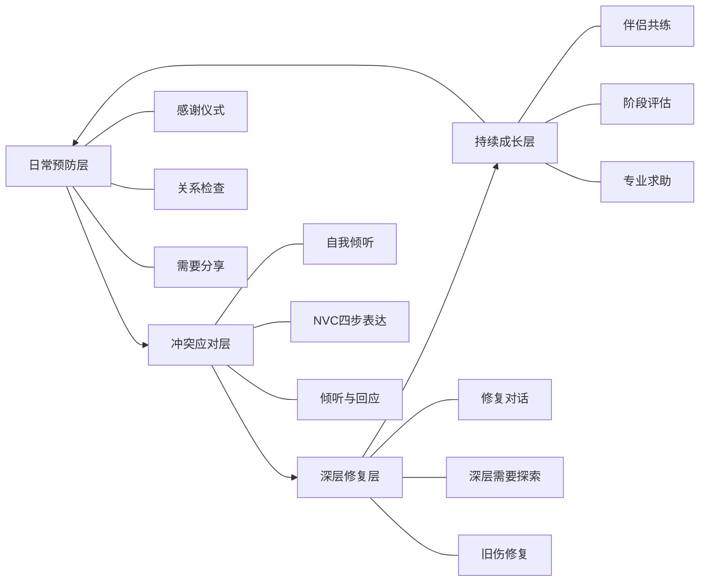
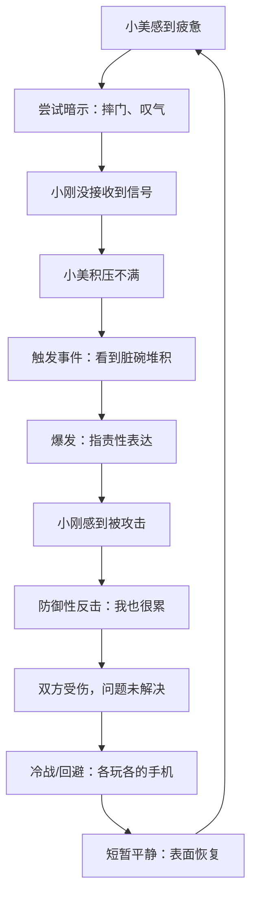
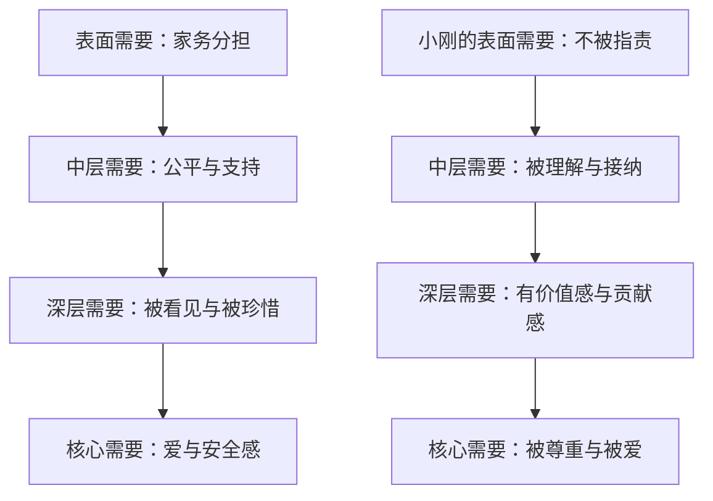
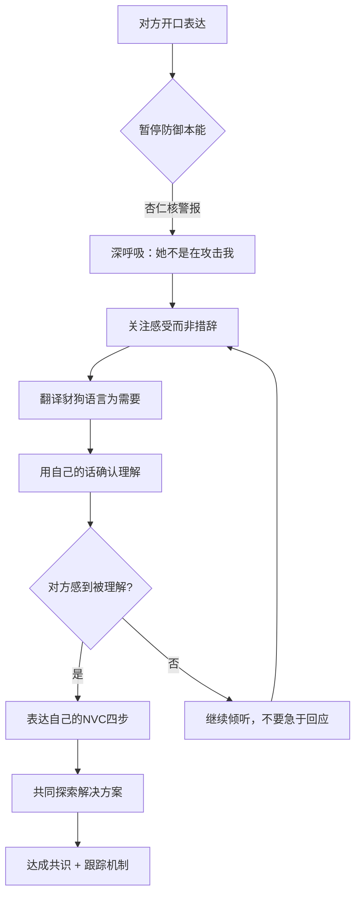
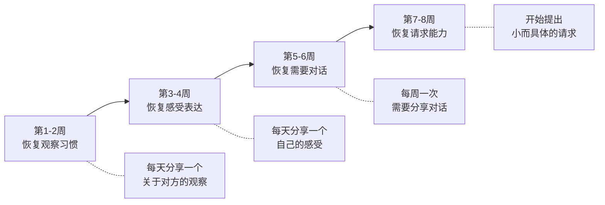
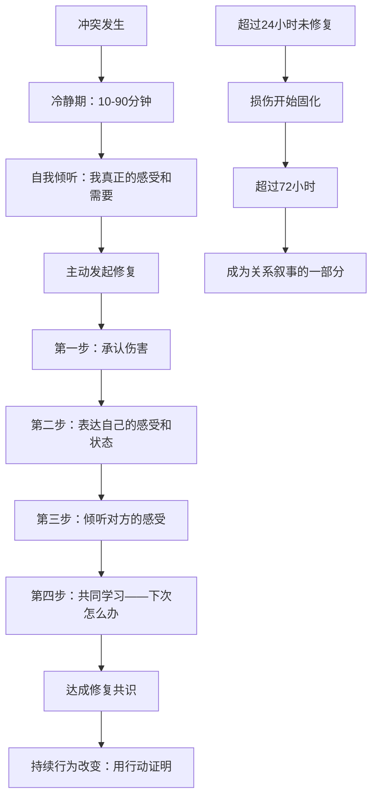

## 亲密关系中的日常冲突

亲密关系是NVC最具挑战性也最具回报的应用场景。两个人共享生活空间、财务、情感和未来规划，日常琐事往往成为深层需要碰撞的战场。为什么将亲密关系作为第一个案例？原因有三：第一，亲密关系中的冲突频率最高、情绪强度最大，是检验NVC功力的"终极考场"；第二，大多数人学习沟通技巧的最初动力来自亲密关系——你可能不会为同事关系读一本沟通书，但你可能为了一段关系辗转反侧；第三，亲密关系中学会的NVC能力可以无缝迁移到职场、亲子、社交等所有场景。

本案例通过一对夫妻的家务冲突为切入点，展示NVC如何将"谁洗碗"的表面争执转化为关系深化的契机，并进一步扩展到育儿分歧、婆媳关系、经济压力、数字时代冲突、婚姻倦怠期等中国夫妻高频面对的真实场景。

### NVC亲密关系应用全景

在深入案例之前，先了解NVC在亲密关系中的完整应用框架。这张图展示了从日常预防到深度修复的全链路：

**阅读指引**：如果你正处于冲突中，直接跳到"NVC四步法转换详解"；如果你想预防冲突，重点看"伴侣共练"和"日常预防性NVC"；如果关系已经严重受损，看"何时需要专业帮助"和"冲突后的修复对话"。

### 背景设定

#### 人物档案

| 维度 | 小美 | 小刚 |
|------|------|------|
| 年龄 | 28岁 | 30岁 |
| 职业 | 互联网产品经理 | 金融行业分析师 |
| 工作时间 | 朝九晚六，偶尔加班 | 早十晚九，频繁加班 |
| 性格特点 | 细致敏感，重视秩序，善于觉察情绪但习惯用间接方式表达 | 理性直接，不善表达情感，习惯用行动而非语言表达关心 |
| 爱的语言 | 服务行动、高质量陪伴（你为我做事=你爱我） | 肯定言辞、身体接触（你说我好=你爱我） |
| 家务偏好 | 喜欢整洁，有固定标准，清洁是"呼吸的条件" | 能住就行，标准较低，认为"干净是锦上添花" |
| 原生家庭 | 母亲承担所有家务并常抱怨，父亲沉默回避 | 父亲主外母亲主内，家庭分工明确但缺乏情感交流 |
| 依恋风格 | 偏焦虑型——需要频繁确认"你爱我" | 偏回避型——压力下沉默，需要独处空间 |

**冲突触发点**：结婚三年，激情期消退，生活进入"室友模式"。小美承担了约80%的家务（做饭、洗衣、清洁、采购），小刚负责偶尔的维修和周末采购。最近一个月，小刚因项目冲刺连续加班到晚上十点，家务分担比例进一步失衡。两人上次约会是两个月前，上一次性亲密是三周前，每天对话不超过十句且多为事务性沟通（"快递到了""水电费交了"）。

#### 冲突升级过程

这个循环是亲密关系冲突的典型模式，心理学上称为**"追-逃"循环**（demand-withdraw pattern）。研究显示，67%的婚姻冲突属于"永久性问题"——不是因为缺乏解决方案，而是因为双方被困在了这个循环里无法触达真实需要。每循环一次，双方的信任和亲密感都会受损，触发阈值越来越低——从最初需要"碗堆三天"才会生气，到最后"看到一只碗没洗"就爆发。

**循环的四个阶段**：

| 阶段 | 小美的内心 | 小刚的内心 | 关系损伤 |
|------|-----------|-----------|---------|
| 第1-3次循环 | "他可能太忙了，我再忍忍" | "她应该理解我" | 轻微——双方还有善意假设 |
| 第4-6次循环 | "他根本不重视我" | "她总是在抱怨" | 中等——善意假设开始瓦解 |
| 第7-10次循环 | "这段婚姻让我窒息" | "回家比上班还累" | 严重——逃避开始出现 |
| 10次以上 | "我是不是嫁错了人" | "无论我做什么都不对" | 危险——情感账户透支 |

#### 中国文化语境下的特殊背景

这个案例放在中国语境中，还有几层特殊的张力需要理解：

- **家务劳动的价值隐形化**："男主外女主内"的传统观念虽然在城市年轻夫妻中已大幅弱化，但仍然潜移默化地影响着双方的期待。小刚可能不自觉地认为"我赚钱多所以少做家务是合理的"，小美则可能在"要独立"和"期待被照顾"之间撕裂。中国妇联2023年调查显示，双职工家庭中女性平均每天承担家务时间为2.5小时，男性为0.8小时——这个差距在有孩家庭中更大。
- **面子与直接表达的冲突**：中国文化强调"含蓄""体贴"，小美觉得"我应该不用说出来他就该懂"，这种期待本身就让直接表达变得困难。"说出来才得到的爱不算数"——这个隐含信念是NVC在中国落地的最大文化障碍。
- **原生家庭的代际影响**：小美看到母亲一辈子在家务中牺牲，既害怕重蹈覆辙，又学到了"抱怨是表达需要的方式"。小刚的父亲用沉默应对一切冲突，他学到了"不回应就是不升级"。
- **经济压力的放大效应**：一线城市的房贷、育儿成本让"工作忙"获得了极高的道德权重——"我加班赚钱还不是为了这个家"让情感需要变得难以启齿。
- **"别人家"的比较压力**：社交媒体上精心经营的"完美家庭"形象加剧了不满——"你看人家老公天天接送""人家老婆从来不抱怨"。这种比较是暴力沟通的催化剂。

### 暴力沟通模式深度分析

#### 两种对话的完整对比

为了直观感受NVC带来的改变，我们将同一个冲突场景用两种模式完整展开。

**暴力沟通完整对话**：

> **小美**：你从来不做家务！你心里根本没有这个家！我就像个免费保姆！
> **小刚**：我每天工作那么辛苦，不就是为了这个家吗？你太不理解我了！
> **小美**：你辛苦？我在家就不辛苦？做饭洗衣打扫哪样不是我干的？
> **小刚**：那你让我怎么办？辞职回来做家务？
> **小美**：你就知道抬杠！跟你说话真没意思！
> **小刚**：……（沉默，拿起手机）
> **小美**：（摔门进卧室）

**结果**：问题未解决，双方情感账户各扣一笔，信任感下降，下次冲突更容易升级。

**NVC对话完整版**：

> **小美**：（深呼吸后）这周我做了六天的晚饭和清洁，洗了三次衣服，你有四天在晚上十点后回家（观察）。我感到疲惫和委屈，也有些孤独（感受），因为我需要分担和支持，也需要感受到我们是一个团队（需要）。你愿意每周承担三天的晚饭任务吗？或者我们一起想想其他分工方式？（请求）
> **小刚**：我听到你这周做了很多家务，感到疲惫和委屈，你需要分担和被看见，对吗？（确认理解）
> **小美**：对，就是这样。（感到被听见，情绪软化）
> **小刚**：我最近确实加班很多，回到家已经很累了。我感到压力大，也有些内疚——我知道你很辛苦，但我好像总做不到你期望的那样（感受+需要）。让我想想……也许我们可以请个钟点工帮忙？或者我负责周末的全部家务？（回应请求）
> **小美**：钟点工的主意不错，周末你也做饭，这样我平时轻松很多。
> **小刚**：好，那我们周末一起看看哪家靠谱？顺便我也可以学几道新菜。
> **小美**：（笑）你上次那个番茄炒蛋还挺好吃的。

**结果**：问题初步解决，双方感到被理解，情感账户增加，为下次沟通建立正向预期。

#### 两种模式的系统对比

| 维度 | 暴力沟通 | NVC对话 |
|------|---------|---------|
| 时长 | 3分钟，以摔门结束 | 8分钟，以微笑结束 |
| 情绪状态 | 双方愤怒→冷战 | 委屈→被理解→轻松 |
| 问题解决 | 未解决，加深矛盾 | 达成初步方案，建立追踪机制 |
| 关系影响 | 情感账户-1，信任-1 | 情感账户+1，信任+1 |
| 下次预期 | 更容易爆发、更难开口 | 更愿意表达、更愿意倾听 |
| 大脑状态 | 杏仁核激活，前额叶关闭 | 催产素释放，前额叶活跃 |
| 身体反应 | 心跳加速、肌肉紧绷、血压升高 | 呼吸平缓、肩膀放松、面部肌肉松开 |

#### 逐句拆解：暴力沟通的四重伤害

**小美的表达包含四层暴力**：

| 暴力类型 | 原文 | 伤害机制 | NVC替代 |
|----------|------|----------|---------|
| 绝对化概括 | "你从来不做家务" | 否定对方所有努力，触发防御。"从来"这个词一出口，对方只能忙着翻旧账证明"我也做过"，完全无暇倾听你的需要 | "这周你有四天没有参与晚餐准备" |
| 动机揣测 | "你心里根本没有这个家" | 替对方定义内心世界，剥夺解释权。你无法看到对方的"心里"，这句话等于在说"我比你更了解你自己" | "我需要感受到我们是一个团队" |
| 自我物化 | "我就像个免费保姆" | 用比喻暗示被利用，制造内疚感。但内疚感不是爱的动力，它是防御的催化剂——对方会想"我不是在利用你"而无法共情你的疲惫 | "我感到疲惫和不被珍惜" |
| 情绪绑架 | 整体语气和时机 | 用愤怒掩盖脆弱，让对方无法靠近。愤怒是最"安全"的情绪——它让你显得强大，但代价是让对方只能防御，无法心疼你 | 先表达愤怒下面的委屈和害怕 |

**小刚的反应同样包含暴力**：

| 暴力类型 | 原文 | 伤害机制 | NVC替代 |
|----------|------|----------|---------|
| 否定感受 | "你太不理解我了" | 反过来指责对方不理解，把"被攻击感"转化为攻击 | "听到你这样说，我感到被指责" |
| 付出勒索 | "我工作那么辛苦" | 用经济贡献抵消情感需要，暗示"我已经在付出，你没有资格再要" | "我最近工作压力很大，回到家也很疲惫" |
| 转移焦点 | "不就是为了这个家吗" | 将具体问题上升为道德评判，让对方无法继续讨论具体家务分工 | "我需要你知道我的辛苦也被看见了" |
| 沉默与手机 | 最后的反应 | 石墙（Stonewalling）——拒绝回应是最暴力的暴力，因为它传递的信息是"你不值得我回应" | "我现在情绪上来了，需要15分钟冷静，之后我们再聊" |

#### 暴力沟通的心理根源

**小美的深层心理图谱**：

- **未被看见的恐惧**：害怕自己的付出被视为理所当然。这种恐惧可能源于童年——如果她从小就学会了"做好事要被看见才有价值"，那么丈夫的"忽视"就触发了深层的存在焦虑。
- **控制感丧失**：无法影响小刚的行为，感到无力。在亲密关系中，"我的需要不能影响你"这种无力感比家务本身更让人崩溃。
- **价值感危机**：怀疑自己在关系中的位置。"如果我付出这么多他都看不见，那我在他心里到底算什么？"
- **童年印记**：母亲也是这样抱怨父亲的，习得了"抱怨是表达需要的方式"。家庭治疗中称之为"代际传递"——我们在无意识中复制了父母的沟通模式。

**小刚的深层心理图谱**：

- **能力焦虑**：经济压力大，害怕无法养家。在"男性养家"的文化期待下，"赚得不够多"比"不做家务"更让他焦虑。
- **情感表达障碍**：从小被教育"男人要坚强""哭什么哭"，不擅长表达脆弱。他可能内心很心疼小美，但不知道怎么说——"我爱你"三个字比加班到十点还难。
- **被否定的创伤**：每次沟通都感觉被攻击，本能防御。大脑已经建立了条件反射："她开口=我要被骂了"。
- **回避冲突**：父亲用沉默应对母亲的抱怨，习得了"回避是保护关系的方式"。在他看来，"不说话"已经是最大的让步。

### 自我倾听：NVC之前最关键的一步

大多数人学NVC时直接跳到"怎么对别人说"，忽略了最关键的前置步骤——**自我倾听**。在你能用NVC表达之前，你必须先用NVC倾听自己。

#### 小美的自我倾听过程

**第一步：觉察身体信号**

周五晚上，小美在沙发上等小刚回家。她注意到自己的身体反应：
- 肩膀紧绷，像背了一块石头
- 胃里翻搅，吃不下东西
- 手指无意识地刷手机，停不下来
- 呼吸浅而快，胸口发闷

**身体是情绪的第一信使**。很多人习惯了"忽略身体信号"——肩膀紧了就扛着，胃不舒服就忍着。但身体不会撒谎：当你嘴上说"我没事"时，你的肩膀和胃在替你说真话。

**第二步：命名感受（而非想法）**

| 脑中浮现的 | 转化为感受 | 转化方法 |
|-----------|-----------|---------|
| "他怎么还不回来" | → 焦虑、不安 | 把对他行为的疑问转化为自己的情绪状态 |
| "他又不在乎我" | → 孤独、失落 | 把对他的判断转化为自己的体验 |
| "我受够了" | → 疲惫、委屈 | 把模糊的爆发转化为精确的情绪词 |
| "他是不是故意的" | → （这个是想法，不是感受，先放下） | 涉及动机揣测的想法暂时搁置 |
| "这段婚姻有什么意义" | → 绝望、迷茫 | 把存在性困惑转化为当下的情绪感受 |

**第三步：触碰需要**

问自己："我此刻最渴望的是什么？"

- 表层：我渴望他回来帮忙做家务（策略）
- 中层：我渴望被看见、被认可（需要）
- 深层：我渴望确认他爱我、我在他心中重要（核心需要）
- 最深层：我渴望安全感——确认这段关系是靠得住的（存在性需要）

**逐层剥离的方法**：对每一层回答"这满足了我什么？"——"做家务"满足了"被看见"，"被看见"满足了"确认被爱"，"确认被爱"满足了"安全感"。当你触碰到最底层的需要时，你会发现策略可以多种多样，但需要是共通的。

**第四步：选择策略**

意识到"他不做家务=他不爱我"是一个等式，而不是事实。他不做家务可能有很多原因（太累、不知道你很在意、不知道怎么做），而"不爱我"只是其中一种可能。选择先用NVC表达，而非直接爆发。

#### 自我倾听为什么是前置条件

不做自我倾听就直接用NVC四步法，你大概率会：
- **观察**说得像评判（"你这周又没做家务"——"又"字暴露了评判）
- **感受**说的是想法（"我觉得你不爱我"——这是判断，不是感受）
- **需要**其实是策略（"我需要你每周做三天饭"——这是你的方案，不是你的渴望）
- **请求**其实是命令（你心里已经预设了"正确答案"，对方只能说"好"）

自我倾听让你在开口之前就和自己的内心对齐，这样你的NVC表达才是从心底发出的真实声音，而非"背课文"式的四步公式。

**自我倾听的日常练习——"三分钟日记"**：

每天睡前花三分钟，写下：
1. 今天最强烈的一个情绪是什么？（命名感受）
2. 这个情绪在身体哪里有反应？（身体觉察）
3. 这个情绪背后，我真正需要的是什么？（触碰需要）

这个练习不需要给任何人看，它是你和自己的对话。坚持两周后，你会发现自己在冲突中命名感受的速度明显加快——从"事后才意识到我生气了"变成"生气的那一刻我就知道自己在生气"。

### NVC四步法转换详解

#### 第一步：观察（Observation）——区分事实与评判

**常见陷阱**：

| 评判（豺狗语言） | 观察（长颈鹿语言） | 为什么后者更好 |
|------------------|-------------------|---------------|
| "你从来不做家务" | "这周你有四天在晚上十点后回家，没有参与晚餐准备" | 对方无法反驳"四天"这个事实，但会本能地反驳"从来" |
| "你总是玩手机" | "昨晚你在沙发上看了两个小时手机" | "两个小时"是一个可以讨论的数据点，"总是"是一杆打死所有可能性的棒子 |
| "你不在乎这个家" | "这周我们没有一起吃过一顿饭" | 前者攻击动机，后者描述事实——你可以补充吃饭，但你无法证明你在乎 |
| "你对孩子不上心" | "这个月的四次家长会都是我参加的" | 具体事件让对方有机会解释（也许他不知道日期），而"不上心"直接定了罪 |
| "你太自私了" | "你买游戏机之前没有和我商量" | "自私"是人格定性，"没有商量"是可以补救的行为 |

**观察的具体化技巧**：

1. **时间锚定**：用具体日期替代"从来""总是""又"。"这周三和周五"比"你最近总是"精确100倍。
2. **行为描述**：描述可观察的动作，而非动机。"你回家后直接去了书房"而非"你不想理我"。
3. **数据量化**：用数字增强客观性。"六天""三次""四天"——数字是中性的，它不会让对方觉得自己在被攻击。
4. **摄像头视角**：如果摄像机拍下来，会记录到什么？这个练习帮你剥离主观解读。
5. **频率校准**：在说"总是"之前，先回忆真实的频率。你可能因为情绪放大了记忆——心理学称之为"负面偏差"（negativity bias），大脑对负面事件的记忆权重是正面事件的3-5倍。
6. **对比校验**：问问自己"有没有反例？"——如果他上周三确实洗了碗，那"从来不做"就不成立。承认反例不会削弱你的需要，反而增加你的可信度。

**小美的观察重构**：

> "这周我做了六天的晚饭，洗了三次衣服，清洁了两次卫生间。你有四天在晚上十点后回家，回家后直接去书房继续工作。"

#### 第二步：感受（Feeling）——区分感受与想法

**感受与想法的混淆是NVC最常见的错误**：

| 想法（伪装成感受） | 真实感受 | 区分方法 |
|-------------------|----------|---------|
| "我觉得你不爱我了" | "我感到孤独和害怕" | "你不爱我"是对你的判断，不是对自己的感受。感受是：当我认为你不爱我时，我感到什么？ |
| "我觉得被忽视了" | "我感到失落和不安" | "被忽视"包含了一个因果判断（你在忽视我），失落才是感受 |
| "我觉得不公平" | "我感到沮丧和委屈" | "不公平"是一个道德评价，沮丧和委屈才是身体里真实涌动的东西 |
| "我觉得像个保姆" | "我感到疲惫和不被珍惜" | "像个保姆"是比喻，疲惫才是你能真正感受到的 |
| "我觉得你在控制我" | "我感到窒息和不自由" | "控制"是对对方意图的判断，窒息才是你体内的感受 |
| "我觉得你不在乎" | "我感到害怕和孤独" | "不在乎"是对他内心的猜测，害怕才是你自己的体验 |

**判断是否为感受的万能公式**：在"我觉得"后面加上"……是因为你……"——如果句子变成了对对方的描述，那它就不是感受。"我觉得不被珍惜"→"我觉得不被珍惜是因为你……"——后半句指向对方，所以"不被珍惜"包含了判断。改为"我感到疲惫和孤独"→"我感到疲惫和孤独是因为你……"——"因为"接不上，说明这确实是你自己的感受。

**感受的身体信号地图**：

| 身体区域 | 感受信号 | 对应的核心感受 |
|----------|---------|---------------|
| 胸口 | 发紧、沉重、像压了石头 | 悲伤、委屈、心痛 |
| 喉咙 | 堵塞、发酸、想哭哭不出来 | 压抑的悲伤、未表达的需要 |
| 肩膀/后背 | 紧绷、酸痛、沉重 | 压力、超负荷、"扛不住了" |
| 胃部 | 翻搅、紧缩、食欲下降 | 焦虑、不安、恐惧 |
| 心跳 | 加速、不规则 | 紧张、兴奋、愤怒的前兆 |
| 拳头/下巴 | 握紧、绷紧、咬牙 | 愤怒、受挫、想反抗 |
| 全身 | 发冷、无力、想蜷缩 | 绝望、无助、被抛弃感 |
| 太阳穴/头部 | 胀痛、发紧 | 思虑过重、精神疲劳 |

**小美的感受重构**：

> "我感到疲惫，也感到委屈和孤独。有时候还感到害怕——害怕我们的关系会变得越来越疏远。"

**感受词汇的精度很重要**：说"我很难过"不如说"我感到失落和被遗忘"。感受词汇越精确，对方越容易理解你、共情你。模糊的感受表达就像打了一束宽光，对方知道你不开心，但不知道怎么回应。

**高精度感受词汇库**（亲密关系常用）：

| 类别 | 低精度（模糊） | 高精度（精确） | 使用场景 |
|------|-------------|-------------|---------|
| 负面-悲伤类 | 难过 | 失落、被遗忘、心酸、怅然 | 感觉被忽视、关系降温时 |
| 负面-愤怒类 | 生气 | 沮丧、受挫、不甘、恼火 | 反复沟通无效、需要被拒绝时 |
| 负面-恐惧类 | 害怕 | 不安、焦虑、恐慌、心虚 | 关系不确定、信任被动摇时 |
| 负面-羞耻类 | 不好意思 | 尴尬、羞愧、窘迫、无地自容 | 被当众指出错误、隐私被侵犯时 |
| 正面-温暖类 | 开心 | 感动、温暖、安心、踏实 | 被理解、被照顾、被肯定时 |
| 正面-活力类 | 高兴 | 振奋、兴奋、满足、充实 | 共同完成目标、得到支持时 |
| 正面-亲密类 | 幸福 | 被珍惜、被宠爱、亲密、归属 | 深度连接、被主动关心时 |

#### 第三步：需要（Need）——揭示感受背后的渴望

**需要的层次结构**：

**需要与策略的关键区分**：

这是一个极其重要却常被忽略的区分。**需要**是普遍的人类渴望——每个人都需要支持、尊重、安全感、归属感。**策略**是满足需要的具体方式——"你必须每周做三天饭"是一个策略。

当我们执着于策略时，对方的拒绝就是对我们的否定。"你不愿意做三天饭=你不爱我。"当我们回到需要时，对方的拒绝只是对一种方案的否定，我们可以一起寻找其他方案。

| 执着策略（死路） | 回到需要（活路） |
|----------------|----------------|
| "你必须每周做三天饭" | "我需要分担和支持" |
| "你不能再加班了" | "我需要陪伴和亲密连接" |
| "你要把工资卡给我管" | "我需要经济上的安全感和信任" |
| "你必须每天说晚安" | "我需要感受到你的在乎" |
| "你不能跟她来往" | "我需要在关系中感到安全和独特" |

**人类的普遍需要清单**（NVC框架）：

| 需要类别 | 具体需要 | 在亲密关系中的表现 |
|----------|---------|-------------------|
| 身体需要 | 休息、食物、安全、健康 | "我需要你帮我分担家务让我能休息" |
| 情感需要 | 被爱、被看见、归属、亲密 | "我需要感受到你心里有我" |
| 自主需要 | 自由、选择、空间、独立 | "我需要自己的时间做喜欢的事" |
| 价值需要 | 尊重、认可、贡献、意义 | "我需要知道我的付出有价值" |
| 诚信需要 | 真实、一致、信任、坦诚 | "我需要你对我说实话" |
| 连接需要 | 理解、共情、陪伴、安全 | "我需要你听我说，而不是给建议" |
| 秩序需要 | 稳定、可预测、结构、整洁 | "我需要生活有一定的规律和秩序" |
| 成长需要 | 学习、挑战、创造力、新体验 | "我需要我们一起成长，而不只是过日子" |

**小美的需要重构**：

> "我需要分担和支持，也需要被看见和认可。更深层地说，我需要感受到我们是一个团队，而不是我一个人在扛。"

#### 第四步：请求（Request）——区分请求与命令

**请求与命令的本质区别**：如果你预设了"对方只能说好"，那无论措辞多礼貌，它都是命令。真正的请求允许对方说"不"，并且说"不"之后不会遭到惩罚（冷战、翻脸、秋后算账）。

| 命令（包装成请求） | 真正的请求 |
|------------------|-----------|
| "你必须每周做三天饭" | "你愿意每周承担三天的晚饭任务吗？" |
| "以后不许加班这么晚" | "你能不能和领导商量一下，每周有两天早点回家？" |
| "你要多关心我" | "这周末我们能一起去逛个超市、做顿饭吗？" |
| "把手机放下！" | "晚饭后我们把手机放卧室，一起在客厅待一会儿？" |
| "你能不能认真听我说话？"（语气暗含"你一直不认真"） | "我现在有些感受想分享，你能给我五分钟专注的时间吗？" |

**好的请求的四特征**：

1. **具体**：明确做什么、何时做、做多少。"你帮我分担家务"不如"你愿意周二和周四负责做晚饭吗？"
2. **可行**：对方有能力做到。"你以后永远不加班"不可行，"每周有两天七点前回来"更现实。
3. **正向**：说"做什么"而非"不做什么"。"不要玩手机"无法执行（不玩手机那干嘛？），"我们一起看个剧"有明确方向。
4. **开放**：允许对方提出替代方案。加一句"或者你有别的想法？"给对方参与的空间。

**小美的请求重构**：

> "你愿意每周承担三天的晚饭任务吗？或者我们一起想想其他分工方式？我也想听听你的想法。"

#### 完整的NVC表达

**小美的完整NVC表达**：

> "这周我做了六天的晚饭和清洁，洗了三次衣服，你有四天在晚上十点后回家（观察）。我感到疲惫、委屈，也有些孤独（感受），因为我需要分担和支持，也需要被看见和认可，我需要感受到我们是一个团队（需要）。你愿意每周承担三天的晚饭任务吗？或者我们一起想想其他分工方式？（请求）"

**表达的时机与方式同样重要**：

| 维度 | 不建议 | 建议 |
|------|--------|------|
| 时机 | 对方刚进门、正在气头上、公共场合 | 双方都相对平静、有充足时间、私密空间 |
| 语气 | 机械背诵、阴阳怪气、带着怒气说"我感到愤怒" | 真诚、温和、允许情绪流露但不被情绪控制 |
| 肢体语言 | 双臂交叉、背对对方、站在门口 | 面对面、适当眼神接触、身体微微前倾 |
| 开场白 | "我需要跟你谈谈"（听起来像审判通知） | "我有些感受想和你分享，你现在方便吗？" |
| 环境 | 嘈杂、有孩子在场、刚吵完架 | 安静、私密、双方都有余力 |

### NVC不是万能的：真实案例中的挫折与调整

NVC是强大的沟通工具，但它不是魔法。真实的亲密关系中，即便使用了NVC，仍可能遭遇各种挫折。了解这些挫折场景，比掌握完美话术更重要。

#### 挫折一：对方拒绝倾听

**场景**：小美鼓起勇气用NVC表达，小刚却说"你又开始了"，然后戴上耳机。

**原因分析**：小刚可能正处于情绪过载状态，或者长期的暴力沟通已经在两人之间建立了"谈=吵"的条件反射。他的防御不是针对NVC，而是针对所有"谈话"的信号——在他的经验里，"我们需要谈谈"等于"你又要被骂了"。

**应对策略**：

1. **不要在此刻坚持"但我这次用的是NVC"**——这本身就是一种命令，而且会让对方觉得你在用一种"高级话术"来包装同样的指责。
2. **先退一步，用书面形式表达**：把NVC写在纸上或微信里——"我把想说的话写下来，你方便的时候看就好。不用马上回复。"书面形式给了对方消化的空间。
3. **等对方情绪平复后再尝试**：但不要超过48小时，否则问题会被遗忘或被对方解读为"其实没那么重要"。
4. **如果对方持续拒绝任何形式的沟通**，这已经不是NVC能解决的问题。长期回避沟通可能源于更深层的议题（回避型依恋、未处理的创伤、关系中的权力失衡），需要考虑专业婚姻咨询。

**书面NVC的格式建议**：

亲爱的（名字）：

我想和你分享一些感受，但我怕当面说的时候情绪会
影响表达，所以写下来给你。你方便的时候看就好，
不用马上回复。

这周我做了……（观察）
我感到……（感受）
因为我需要……（需要）
你愿意……吗？（请求）

不管怎样，我爱你。

#### 挫折二：NVC表达后对方依然防御

**场景**：小美用了标准的四步法，小刚听完后说："所以你觉得我不好呗。"

**原因分析**：NVC的"观察"部分如果仍然携带隐含评判（比如语气、表情、时机），对方会捕捉到非语言信号。研究表明，人际沟通中只有7%的信息来自语言内容，38%来自语调，55%来自肢体动作。如果你说着"我感到疲惫"但语气是"你很过分"，对方接收的是后者。

此外，长期形成的互动模式不会因为一次NVC表达就改变——大脑需要多次正向体验才能重建信任。心理学中的"确认偏差"（confirmation bias）让人倾向于解读出符合预期的信息——如果小刚预期"她又在指责我"，他会自动过滤掉NVC中的善意信号。

**应对策略**：

1. **先确认对方的感受**："你听到我说的，感觉像是在被批评？"
2. **承认旧模式的存在**："我知道我以前经常用指责的方式说话，你有这样的反应我能理解。"
3. **降低期望**：第一次尝试NVC，目标不是"解决问题"，而是"比上次好一点"。可能只做到了"没有用'从来'"就是进步。
4. **坚持3-5次后，对方的防御阈值会明显降低**。神经可塑性研究显示，重复的新体验可以在6-8周内改变大脑的默认反应模式。

#### 挫折三：自己用着用着变成暴力沟通

**场景**：小美开头用了观察，但说到感受时越来越激动，最后变成"你就是不在乎我！"

**原因分析**：NVC要求在情绪激动时保持觉察，这对前额叶皮层的执行功能要求很高。当积压的情绪太多时，理性通道会被情绪淹没——这不是"没学好"，而是正常的大脑工作机制。情绪和理性在大脑中是"跷跷板"关系：一个升高，另一个就被压下去。

**应对策略**：

1. **事前准备**：把NVC四步写在纸上或手机备忘录里，情绪激动时看着念。这不是作弊，这是在情绪高涨时给前额叶皮层一个"外部支架"。
2. **设置安全词**：和伴侣约定，当任何一方说"暂停"（或一个你们约好的暗号），双方各自冷静15分钟。15分钟是基于"情绪化学物质消退需要10-20分钟"的神经科学研究。
3. **接受不完美**：即便只做到了"观察"这一步，也比直接爆发好得多。NVC不是满分或零分的考试，是渐进式的练习。
4. **事后复盘**：冷静后回顾"哪个环节开始失控的"，下次在那个环节之前主动暂停。记录下来——"每次说到需要时我会开始激动，因为我太委屈了"——这种觉察本身就是进步。

#### 挫折四：问题解决了但关系没有变好

**场景**：家务问题通过NVC解决了，但两人之间仍然感觉疏远。

**原因分析**：家务只是表面冲突（presenting issue），背后可能有更深层的关系议题——亲密感缺失、性生活不协调、价值观分歧、原生家庭创伤、信任裂痕等。NVC解决了"事"，但没有触及"人"。有时候，人们反复争论家务，是因为"家务"是一个安全的话题——比起说"我怀疑你不爱我了"，说"你为什么不洗碗"容易得多。

**应对策略**：

1. **区分"问题导向"和"关系导向"**：除了用NVC解决问题，还要用NVC建立连接。定期进行不围绕任何具体问题的"需要分享"。
2. **定期做"需要探索"**：不围绕具体问题，而是分享"最近什么让你开心/不安/期待"。用"你最近还好吗？"替代"这周的饭谁做？"
3. **如果多轮NVC后关系仍然冷淡**，考虑引入专业伴侣治疗师。NVC是沟通工具，不是关系治疗——当关系中存在深层创伤或长期失衡时，专业帮助是必要的。

#### 挫折五：双方水平差距大

**场景**：小美学了NVC，小刚没学。小美用四步法表达，小刚的回应还是老一套——"你想多了""有什么好说的"。

**原因分析**：NVC的学习不同步是常见情况。一方已经开始用新的方式沟通，另一方还在旧模式里。这种差距会造成新的不对称——"我在这里认真表达感受，你却一副无所谓的样子"。

**应对策略**：

1. **不要求对方"也学NVC"**：强迫本身就是暴力。你的改变会自然影响互动模式——当小美不再用"你从来"开头，小刚的防御本能就不需要启动。
2. **用NVC倾听对方的"非NVC表达"**：即使小刚说"你想多了"，你也可以在心里翻译——"他感到压力大，需要空间"。你在练习倾听，不需要他配合。
3. **关注行为变化而非语言变化**：小刚可能永远不会说"我感到内疚"，但他可能会在周六早上默默做一顿早餐。那就是他的NVC——用行动说的NVC。
4. **降低标准，庆祝微小进步**：从"他完全不理我"到"他虽然没说什么但没有走开"——这就是进步。不要用"理想的NVC对话"来衡量现实中的每一步。

#### 挫折六：NVC在"旧伤"面前失效

**场景**：两人用NVC解决了当下的问题，但小美突然说"那你上次呢？""你去年过年的时候……"

**原因分析**：未修复的旧伤会在新冲突中自动涌出。这些旧伤就像关系中的"未爆弹"——平时看不见，一旦有冲突就连锁引爆。NVC处理的是当下的感受和需要，但旧伤积累的不信任需要专门的修复过程。

**应对策略**：

1. **承认旧伤的存在**："我知道那次的事情还在你心里，它对你很重要。"
2. **单独安排时间处理旧伤**：不要在当前冲突中叠加旧账。"那次的事情我们可以单独找个时间聊，我愿意听你的感受。今天我想先解决眼下的问题。"
3. **对于反复出现的旧伤**，可能需要更深层的修复——包括真诚的道歉、具体的行为改变承诺、以及定期的"关系复盘"。如果旧伤涉及背叛（出轨、欺骗），建议寻求专业伴侣治疗师的协助。

### NVC倾听与回应

#### 小刚的NVC倾听过程

当小美用NVC表达后，小刚的倾听过程同样需要练习。很多NVC学习者只关注"怎么说"，忽略了"怎么听"——但倾听才是NVC的核心技能。

**NVC倾听-回应全流程**：

**倾听的三个层次**：

| 层次 | 描述 | 小刚的内在过程 | 小美的感受 |
|------|------|---------------|-----------|
| 内容倾听 | 听到事实 | "她说做了六天饭，洗了三次衣服" | "他在听" |
| 情感倾听 | 听到感受 | "她感到疲惫、委屈、孤独" | "他懂我" |
| 需要倾听 | 听到需要 | "她需要支持、被看见、团队感" | "他心疼我" |

**小刚的内在倾听四步**：

1. **暂停防御本能**：深呼吸，提醒自己"她不是在攻击我，她是在表达需要"。这一步最难，因为大脑的杏仁核已经拉响了警报——"危险！有人在批评你！"。但你可以选择不跟杏仁核走。
2. **关注感受而非措辞**：即使她的表达有评判成分，也先关注背后的情感。"她语气不好"→"她很痛苦"。
3. **翻译豺狗语言**：把"你从来不做家务"翻译成"她感到不公平"。在心里默默翻译，不要说出来纠正对方——"你应该说'我感到'不是'你从来'"，这种纠正只会让对方觉得你在挑刺。
4. **确认自己的理解**：用自己的话复述，确保理解正确。不是鹦鹉学舌式地重复，而是用自己的语言重新表达对方的感受和需要。

**小刚的NVC倾听回应**：

> "我听到你这周做了很多家务，感到疲惫和委屈，你需要分担和支持，也需要被看见（确认理解）。"

这一步被称为**"反映式倾听"**（reflective listening），它是NVC中最具治愈力的动作。当小刚准确说出小美的感受和需要时，小美会感到"他真的听到了"——这种被理解的体验本身就是一种满足，甚至比"他真的去洗碗了"更能修复关系。

#### 小刚的NVC回应

确认理解后，小刚用自己的NVC四步回应：

> "我最近确实加班很多，回到家已经很累了（观察）。我感到压力很大，也有些内疚——我知道你很辛苦，但我好像总做不到你期望的那样（感受）。我需要休息，也需要你的理解，我需要知道我的努力也被看见了（需要）。让我想想……也许我们可以请个钟点工帮忙？或者我负责周末的全部家务？（回应请求）"

**回应中的三个关键技巧**：

1. **确认理解的魔力**：当小刚复述小美的需要时，小美会感到"他真的听到了"。这是NVC最具治愈力的时刻——被理解本身就是一种满足。心理学家卡尔·罗杰斯说："一旦被真正理解，人就无法继续保持敌意。"
2. **表达自己的脆弱**：小刚没有用"我也很累"来反击，而是用"我感到内疚"来表达自己的脆弱。"我也很累"是防御性反击，"我感到内疚"是脆弱的坦诚。这种坦诚会软化小美的心，让她也愿意倾听。
3. **提供替代方案**：小刚没有简单地说"好"或"不行"，而是提出了具体方案。这表明他在认真对待请求，并愿意共同解决问题——"我们一起想办法"比"好吧"更有力量。

#### 回应中常见的倾听陷阱

| 陷阱 | 表现 | 纠正 |
|------|------|------|
| 给建议 | "你应该早点跟我说嘛" | 先确认感受，给建议前问"你想听我的想法吗？" |
| 比惨 | "我比你还累呢" | 这不是竞赛，先接住对方的感受 |
| 解释/辩护 | "我是因为开会才晚回来的" | 先理解对方的需要，解释可以放在后面 |
| 最小化 | "这有什么大不了的" | 对你的"小事"可能是对方的"大山" |
| 转移话题 | "别说这个了，来吃水果" | 回避不等于和谐，问题会在下一次更猛烈地回来 |
| 翻旧账 | "那你上次还不是……" | 当下就是当下，旧账另找时间处理 |
| 讲道理 | "从逻辑上来说，你应该……" | 情感问题用情感回应，不是辩论赛 |
| 嘲笑 | "你学了NVC就这？" | 否定对方的努力会彻底摧毁尝试的意愿 |

### 深层对话：超越家务的连接

#### 探索共同需要

当双方都完成NVC表达后，进入"共同探索"阶段。这个阶段的目标不是解决问题，而是找到双方需要的交集。

**需要映射**：

| 小美的需要 | 小刚的需要 | 交集 |
|-----------|-----------|------|
| 公平 | 理解 | 相互看见——"你的辛苦我都看在眼里" |
| 被看见 | 被认可 | 相互肯定——"你的付出有价值" |
| 支持 | 休息 | 相互支持——"我们一起分担，谁也不用硬扛" |
| 亲密连接 | 贡献感 | 共同目标——"一起把这个家经营好" |
| 秩序感 | 自由度 | 灵活框架——"有规则但不僵化" |

**共同需要的深层发现**：

- **和谐**：双方都不想要冲突——但"没有冲突"不等于"和谐"，沉默的冷漠比争吵更伤害关系。
- **相互支持**：双方都希望对方过得好——只是"支持"的定义不同（小美认为"帮我做家务"是支持，小刚认为"努力赚钱"是支持）。
- **亲密连接**：双方都怀念恋爱时的默契——但生活变了，亲密也需要新的形式。
- **公平**：双方都希望付出被看见——但"公平"不是50/50的精确分割，而是双方都觉得"我被看见了"。

#### 创造性解决方案

基于共同需要，双方头脑风暴：

**方案评估矩阵**：

| 方案 | 满足小美的需要 | 满足小刚的需要 | 可行性 | 成本 |
|------|---------------|---------------|--------|------|
| 请钟点工每周两次 | ✅分担 ✅支持 | ✅休息 ✅理解 | 高 | 约800元/月 |
| 小刚负责周末全部烹饪 | ✅分担 ✅团队感 | ✅被认可 ✅贡献感 | 中 | 时间 |
| 每周日晚一起做下周计划 | ✅秩序 ✅连接 | ✅参与感 ✅可预测 | 高 | 1小时/周 |
| 建立"感谢仪式" | ✅被看见 ✅亲密 | ✅被认可 ✅连接 | 高 | 5分钟/天 |
| 小美适当降低清洁标准 | ✅减少负担 | ✅降低压力 | 中 | 心理调整 |
| 使用家务分配APP | ✅公平 ✅透明 | ✅简单 ✅可追踪 | 中 | 学习成本 |
| 周末轮流"全权负责日" | ✅休息 ✅被照顾 | ✅自主 ✅贡献感 | 中 | 需磨合 |
| 设立"家务基金"，未完成方投入基金 | ✅公平感 ✅趣味 | ✅简单 ✅无情绪消耗 | 中 | 基金金额 |

**最终方案组合**：

1. **请钟点工**：每周两次，负责深度清洁（解决80%的清洁负担）
2. **周末烹饪**：小刚负责周六、周日的全部三餐（他其实喜欢做饭，只是平时没时间）
3. **周日规划**：每周日晚花30分钟一起做下周的菜单和采购清单
4. **感谢仪式**：每天睡前分享一件感谢对方的事，不超过一分钟
5. **灵活调整**：每月第一个周日回顾方案执行情况，根据实际情况调整。如果某周小刚特别忙，小美可以多承担一些，但需要小刚事后表达感谢——"上周你帮我扛了，谢谢你"这种认可比均分家务更能滋养关系

**方案执行的跟踪机制**：

| 时间点 | 内容 | 目的 |
|--------|------|------|
| 每天 | 感谢仪式（1分钟） | 维持情感连接 |
| 每周日 | 菜单规划+下周分工（30分钟） | 确保方案落地 |
| 每月第一个周日 | 方案回顾（20分钟） | 及时调整优化 |
| 每季度 | 深度关系对话（1小时） | 探索更深层需要的变化 |

### 中国家庭的高频冲突场景NVC处理

家务冲突只是亲密关系中的一个缩影。以下是中国夫妻高频面对的其他冲突场景，展示NVC如何灵活运用。

#### 场景一：育儿分歧

**暴力沟通**：
> 小美："你就知道惯着他！孩子不能这样养！你看看别人家孩子多有礼貌！"
> 小刚："你管得太多了！孩子都快被你逼疯了！"

**NVC表达**：
> 小美："我看到今天儿子在餐桌上发脾气摔碗，你没有制止他（观察）。我感到担心和焦虑（感受），因为我需要孩子学会尊重和自律，我担心如果现在不建立规则，以后会更难（需要）。你能不能和我一起商量一下，在孩子发脾气的时候我们统一怎么回应？（请求）"
> 小刚："我听到你担心孩子缺乏规则意识，你希望我们有一致的教育方式（确认理解）。我今天没制止他，是因为我看到他摔碗之前你已经批评了他三次，我觉得他已经很紧张了（观察）。我感到纠结——我也希望他有礼貌，但我担心过多批评会让他丧失自信（感受）。也许我们可以分一下工：你负责规则的制定，我负责在他情绪激烈的时候先安抚再教育？（请求）"

**育儿场景的NVC四步拆解**：

| 步骤 | 小美的表达 | 技巧要点 |
|------|-----------|---------|
| 观察 | "儿子在餐桌上发脾气摔碗，你没有制止他" | 描述具体行为事件，不加评判 |
| 感受 | "我感到担心和焦虑" | 区分感受（担心）与想法（你不管孩子） |
| 需要 | "我需要孩子学会尊重和自律" | 将需要从"你应该怎么做"转化为"我渴望什么" |
| 请求 | "你能不能和我一起商量统一回应方式？" | 用"一起"强调合作而非命令 |

**小刚的回应同样体现了NVC精神**：先确认理解→表达自己的观察（"你已经批评了他三次"）→说出自己的纠结感受→提出分工方案。这种"确认+自我表达+合作提议"的三段式回应，是NVC倾听后最自然的接续方式。

**育儿NVC的核心原则**：不在孩子面前争论教育方式（那会让孩子学会"利用父母的分歧"），先私下达成共识，再统一执行。研究显示，父母教育方式不一致家庭中的孩子，行为问题发生率是一致家庭的2.3倍。

#### 场景二：婆媳关系中的边界冲突

**暴力沟通**：
> 小美："你妈又不敲门就进我们卧室了！你就不能说说她！"
> 小刚："那是我妈！你怎么这么不尊重老人！"

**NVC表达**：
> 小美："这周你妈有三次没敲门就进我们卧室（观察）。我感到不舒服和有些委屈（感受），因为我需要在自己家里有隐私和被尊重的空间（需要）。我不是不欢迎她，我希望她来之前能敲一下门。你能不能找个温和的方式和她沟通一下？（请求）"
> 小刚："我听到你觉得隐私被侵犯了，你感到不舒服（确认理解）。我理解你的需要，确实每个人都需要自己的空间。不过我妈不是故意的，她在老家习惯了，觉得进儿子房间天经地义（解释背景）。我来和她说，就说是我的习惯需要——这样她不会觉得是你在排斥她（提出方案）。"

**婆媳场景的NVC四步拆解**：

| 步骤 | 小美的表达 | 技巧要点 |
|------|-----------|---------|
| 观察 | "这周你妈有三次没敲门就进我们卧室" | 用频率数据替代"又""总是"，降低攻击性 |
| 感受 | "我感到不舒服和有些委屈" | 承认感受而非指责对方母亲 |
| 需要 | "我需要在家里有隐私和被尊重的空间" | 将需要与"反对婆婆"区分——你要的是隐私，不是赶走婆婆 |
| 请求 | "你能不能找个温和的方式和她沟通？" | 让"谁的父母谁去沟通"成为默认策略 |

**小刚的回应亮点**：提出"就说是我的习惯需要"——这是婆媳NVC中的黄金技巧。将需要包装成自己的需要而非配偶的需要，既保护了妻子，又给了母亲台阶下。

**婆媳NVC的核心原则**：谁的父母谁去沟通。小刚去跟自己妈妈说，比小美直接说效果好10倍。措辞上把"需要"包装成自己的需要而非配偶的需要，避免老人觉得"儿媳妇在嫌弃我"。

**婆媳冲突的三种常见场景及NVC要点**：

| 场景 | 暴力沟通（内） | 暴力沟通（对婆婆） | NVC要点 |
|------|--------------|-----------------|---------|
| 育儿方式冲突 | "你妈那套老思想早过时了" | "妈，现在不兴那样了" | 用"我需要孩子接受科学养育"替代对婆婆方法的否定 |
| 消费观念冲突 | "你妈总嫌我乱花钱" | "妈，现在物价不一样了" | 用"我需要在消费上有自主权"替代对婆婆标准的反驳 |
| 生活习惯冲突 | "你妈做的饭太油了" | "妈，少放点油" | 用"我需要健康饮食"替代对婆婆厨艺的批评 |

**核心原则**：所有婆媳NVC的表达方应是配偶本人，而非媳妇/女婿直接面对对方父母。配偶是"翻译官"——把一方的需要翻译成另一方能接受的语言。

#### 场景三：经济分歧与彩礼/房贷话题

**暴力沟通**：
> 小美："你每个月就给家里这么点钱，你自己倒是买游戏买鞋不少花！"
> 小刚："我赚的钱我自己还不能花了？房贷不都是我在还？"

**NVC表达**：
> 小美："我看了这个月的账单，你在游戏和运动鞋上花了2800元，给家里的日常开销是5000元（观察）。我感到有些不安（感受），因为我需要在经济上有安全感和共同规划的感觉（需要）。你愿意这周末我们一起做个家庭预算吗？我想听听你的想法（请求）。"
> 小刚："你觉得花钱没有计划让你不安，你需要安全感（确认理解）。我也觉得应该有个预算——说实话我自己也不知道钱花哪去了（自嘲）。我们一起看看？"

**经济场景的NVC四步拆解**：

| 步骤 | 小美的表达 | 技巧要点 |
|------|-----------|---------|
| 观察 | "你在游戏和运动鞋上花了2800元，日常开销5000元" | 用具体数字说话，不说"你乱花钱" |
| 感受 | "我感到有些不安" | 用"不安"而非"愤怒"——不安邀请合作，愤怒触发防御 |
| 需要 | "我需要经济上有安全感和共同规划的感觉" | 将需要从"你不能花钱"转化为"我需要安全感" |
| 请求 | "你愿意这周末一起做个家庭预算吗？" | 用"一起"将控制转化为合作 |

**经济NVC的核心原则**：不评判对方的消费选择（"买游戏就是浪费"是评判），只谈论数据和自己的感受。用"我们一起做个计划"替代"你应该少花钱"——前者是合作，后者是控制。

**中国家庭常见的经济冲突NVC模板**：

| 冲突类型 | 观察 | 感受 | 需要 | 请求 |
|---------|------|------|------|------|
| 彩礼/嫁妆争议 | "双方父母对金额的期望差了8万" | "我感到为难和焦虑" | "我需要双方家庭都感到被尊重" | "我们能不能一起想一个双方父母都能接受的方案？" |
| 房贷压力 | "我们的月供占了收入的60%" | "我感到压力大和不安" | "我需要经济上的安全缓冲" | "你愿意一起看看有没有降低压力的办法？" |
| 给父母钱 | "你每个月给你妈3000，没和我商量" | "我感到不被尊重" | "我需要在家庭财务上有参与感" | "以后给双方父母钱之前，我们先一起商量一下？" |
| 消费观差异 | "你想买一个3万的包" | "我有些紧张" | "我需要在大额消费上有共识" | "我们能不能定一个标准：超过X元的消费一起决定？" |

#### 场景四：社交边界与异性朋友

**暴力沟通**：
> "你跟她单独吃饭什么意思？你把我当什么了？"
> "我交什么朋友还要你批准？你控制欲也太强了吧！"

**NVC表达**：
> "我听说你昨天和小花单独吃了午饭（观察）。我承认我有些不安和嫉妒（感受），因为我需要在关系中感到独特和被优先选择（需要）。你能不能帮我理解一下你们的交往？我不是要限制你的社交，只是想让自己安心（请求）。"
> "你感到不安，需要安心（确认理解）。小花是我的同事，我们讨论的是一个项目问题，以后有这种需要我提前跟你说一声好不好？（回应）"

**社交场景的NVC四步拆解**：

| 步骤 | 表达方 | 技巧要点 |
|------|--------|---------|
| 观察 | "你昨天和小花单独吃了午饭" | 陈述事实，不加"偷偷""瞒着我"等修饰 |
| 感受 | "我有些不安和嫉妒" | 直接承认嫉妒——这需要勇气，但比指责有力100倍 |
| 需要 | "我需要在关系中感到独特和被优先选择" | 将嫉妒转化为正面需要，让对方理解你的渴望而非你的攻击 |
| 请求 | "你能不能帮我理解一下你们的交往？" | 表达好奇而非审问，给对方解释空间 |

**回应方的NVC要点**：先确认感受（"你感到不安，需要安心"）→澄清事实（"我们讨论的是项目问题"）→主动提出预防措施（"以后我提前跟你说"）。这种"确认+澄清+预防"的回应模式，既尊重了对方的感受，又维护了自己的社交自由。

**社交NVC的核心原则**：承认自己的嫉妒是正常的——嫉妒不是"小心眼"，它是对关系安全感的需要。用"我需要安心"替代"你不能跟她来往"——前者表达需要，后者试图控制。

### 婚姻倦怠期的NVC特殊处理

婚姻倦怠（marital burnout）不同于一般的冲突——它没有明确的触发事件，而是日积月累的疏远感。倦怠期的特征是：双方不吵架了，但也不亲密了。生活像一潭死水，没有冲突也没有火花。

#### 倦怠期的识别信号

| 信号 | 具体表现 | 危险等级 |
|------|---------|---------|
| 对话功能化 | 每天对话只有"吃什么""快递到了""孩子作业" | ⚠️ 黄灯 |
| 身体距离增大 | 不再有自然的肢体接触，各睡各的被子 | ⚠️ 黄灯 |
| 情感麻木 | 对方做了好事/坏事都不太有感觉 | 🔴 红灯 |
| 幻想替代 | 开始幻想"如果当初和另一个人结婚" | 🔴 红灯 |
| 独处偏好 | 宁愿一个人待着也不想和对方在一起 | 🔴 红灯 |
| 放弃沟通 | "说了也没用""算了吧"成为口头禅 | 🚨 紧急 |

#### 倦怠期的NVC策略

倦怠期不适合直接用"四步法"讨论问题——因为双方已经没有足够的"情感燃料"来驱动对话。此时需要的是**渐进式情感重建**：

**第一阶段：恢复观察习惯（第1-2周）**

每天睡前，和伴侣分享一个"今天我观察到的关于你的小事"。不带评判，只做观察：
- "今天你接电话时笑了，很久没看到你笑了"
- "你今天换了件新衣服"
- "你晚饭后主动去洗了碗"

这个练习的目的是重新"看见"对方——倦怠期最大的问题是双方变成了"透明人"。

**第二阶段：恢复感受表达（第3-4周）**

每天分享一个"今天我感受到的事"，可以和对方无关：
- "今天工作上被表扬了，我挺开心的"
- "今天下午突然觉得很累"
- "今天看到一个视频，想起我们刚认识那会儿"

这个练习的目的是恢复"分享感受"的肌肉记忆——在倦怠期，我们已经忘记了如何表达脆弱。

**第三阶段：恢复需要对话（第5-6周）**

每周进行一次"需要分享"——不是围绕问题，而是围绕渴望：
- "最近我需要一些被肯定的感觉"
- "我需要一些属于我们两个人的时间"
- "我需要知道你还喜欢和我在一起"

**第四阶段：恢复请求能力（第7-8周）**

开始提出小而具体的请求：
- "你愿意这周六下午和我一起去散步吗？"
- "你能每天出门前抱我一下吗？"
- "这周末我们能一起做顿饭吗？"

**关键提醒**：倦怠期的恢复需要时间，不要急于"回到从前"——"从前"已经回不去了，目标是创造一种新的亲密。专业伴侣治疗在倦怠期的介入效果最好——当双方都还没到"恨"的程度时，修复的可能性最高。

### NVC实战速查卡

在真实冲突中，你没有时间回忆完整的理论框架。以下速查卡设计为"吵架时能想起来的最少知识"——打印出来贴在冰箱上，或者存成手机壁纸。

#### 表达前的三秒自检

在开口之前，用三秒钟问自己三个问题：

| 问题 | 如果答案是"是" | 如果答案是"否" |
|------|-------------|-------------|
| 我要说的话里有"从来""总是""又"吗？ | 先换成具体时间和次数 | 继续 |
| 我是在说他的行为，还是在定义他的人？ | 先只说行为 | 继续 |
| 我知道我此刻真正的感受和需要吗？ | 可以开口 | 先自我倾听 |

#### 万能句式模板

当脑子一片空白时，直接套用以下模板：

**表达不满时**：
> "当____（具体事件）的时候，我感到____（感受），因为我需要____（需要）。你愿意____（具体请求）吗？"

**确认对方时**：
> "你听到____（复述），感到____（对方的感受），你需要____（对方的需要），对吗？"

**请求暂停时**：
> "我现在情绪上来了，说不清楚。给我____分钟冷静一下，之后我们再聊。"

**修复关系时**：
> "我刚才说的____伤害了你，我很抱歉。我当时感到____，所以才那样说。你现在感觉怎么样？"

**开启深度对话时**：
> "我有些感受想和你分享，你现在方便吗？我想____分钟就好。"

**表达感谢时**：
> "谢谢你今天____（具体行为），这让我感到____（感受），因为我需要____（需要）。"

#### 感受词汇速查

| 类别 | 需要被满足时 | 需要未被满足时 |
|------|------------|-------------|
| 身体 | 精力充沛、放松、温暖 | 疲惫、紧绷、不舒服 |
| 情感 | 喜悦、感动、安心、亲密 | 悲伤、孤独、害怕、委屈 |
| 认知 | 受启发、好奇、清晰 | 困惑、不确定、无力 |
| 社交 | 被接纳、被信任、归属感 | 被排斥、被误解、疏离 |

#### NVC对话的"能做"与"不能做"

| 能做 | 不能做 |
|------|--------|
| 说"这周你有四天没做晚饭" | 说"你从来不做饭" |
| 说"我感到孤独" | 说"我觉得你不爱我" |
| 说"我需要支持" | 说"你应该帮我" |
| 说"你愿意吗？" | 说"你必须……" |
| 情绪激动时说"暂停15分钟" | 情绪激动时继续"讲道理" |
| 对方说完后先确认理解 | 对方说完后立刻反驳 |
| 承认"我现在做不到NVC" | 强迫自己和对方"用NVC说话" |
| 用书面形式表达感受 | 用微信语音吼过去 |

### 伴侣共练：两个人一起成长

NVC最有效的学习方式不是一个人看书，而是两个人一起练习。以下是为伴侣设计的共练方案。

#### 每周关系检查（20分钟）

| 环节 | 时间 | 内容 | 注意事项 |
|------|------|------|---------|
| 感恩时刻 | 5分钟 | 每人分享一件感谢对方的事 | 要具体有画面感，不是泛泛的"谢谢你" |
| 需要表达 | 5分钟 | 每人表达一个当前需要 | 不一定是未被满足的，也可以说"我需要更多这样的" |
| 请求交流 | 5分钟 | 每人提出一个小请求 | 请求越小越好，对方可以接受、拒绝或提替代方案 |
| 下周期待 | 5分钟 | 每人说一件期待一起做的事 | 创造正向预期，让下周有盼头 |

**执行要点**：选择固定时间（如周日晚饭后），准备好零食和饮品让氛围轻松。如果一方不在状态，可以跳过，但要在24小时内补上。不要把"关系检查"变成"批斗会"——如果有大问题需要讨论，另约时间，关系检查只做正向和建设性内容。

#### NVC角色扮演练习

每周花15分钟，用一个虚构场景练习NVC四步法：

1. **选择场景**：从日常生活选一个微小摩擦（比如"你洗完澡没关灯"）
2. **先暴力沟通版本**：双方各说一句暴力沟通的话——感受一下那种感觉
3. **再NVC版本**：用四步法重新说一遍——感受一下不同的效果
4. **互换角色**：刚才表达的人变成倾听的人，反过来练习
5. **复盘**：两个版本有什么不同？哪个版本让你更想回应？

这个练习的关键是"在安全环境下练习"——用小摩擦练熟了，大冲突时才用得出来。就像消防演习——平时练的是假火，但真正着火时你知道该往哪跑。

#### "感谢仪式"的深化版

基础版是每天睡前分享一件感谢的事。深化版增加一个环节——**感谢背后的感受和需要**：

- 基础版："谢谢你今天做了晚饭"
- 深化版："谢谢你今天做了晚饭，我回来的时候看到桌上摆好了，感到很温暖，因为这让我觉得自己被照顾了"

这种"感谢+感受+需要"的结构让对方不仅知道你感谢什么，还知道这件事对你的情感意义——下次他做饭时，不仅是在完成任务，而是在"照顾你"。

### NVC带来的长期改变

#### 认知层面的转变

| 旧认知 | 新认知 | 转变机制 |
|--------|--------|---------|
| "他不做家务就是不爱我" | "他有他的困难，我们可以一起想办法" | 从等式思维到因果思维 |
| "她总是抱怨" | "她在表达需要，我可以倾听" | 从评判到好奇 |
| "家务是小事，不值得吵" | "小事背后是大需要，值得认真对待" | 从表面到深层 |
| "我付出多就该被看见" | "我可以直接表达需要，而非等待被发现" | 从被动到主动 |
| "好伴侣应该不用我说就懂" | "没有人是读心者，表达需要是爱的能力" | 从幻想回到现实 |
| "吵架说明不合适" | "冲突是发现需要差异的机会" | 从回避到面对 |

#### 行为层面的改变

**小美的改变**：
- 学会了直接表达需要，而非用指责包装——"我需要你"比"你怎么这样"有用100倍
- 学会了区分"需要"和"策略"，不再执着于特定方案——"你必须做三天饭"变成了"我们一起想想怎么分担"
- 学会了在情绪激动时先暂停，等冷静后再沟通——"我现在说不清楚，给我15分钟"
- 学会了看见小刚的付出，而非只看见他的缺席——"你今天修了水龙头"也是贡献
- 学会了自我倾听——在开口之前先问自己"我真正需要的是什么"

**小刚的改变**：
- 学会了倾听感受，而非只关注事实和逻辑——"她很委屈"比"她说了什么"更重要
- 学会了表达脆弱，而非用沉默或反击保护自己——"我感到内疚"比"你太不理解我了"更能修复关系
- 学会了主动询问小美的需要，而非等待她爆发——"你最近还好吗？"是最简单也最有力的NVC
- 学会了用行动表达爱，而非只用语言——做一顿饭可能比说100句"我爱你"更有力量（但也要说）

#### 关系层面的改变

**NVC练习的阶段性变化**（基于大量亲密关系NVC实践者的经验总结）：

| 阶段 | 时间 | 典型表现 | 关键挑战 |
|------|------|---------|---------|
| 笨拙期 | 第1-2周 | 说话像"背课文"，四步法生硬不自然 | "很假""不自在"的感觉，对方可能嘲笑你 |
| 摸索期 | 第3-4周 | 开始能区分观察与评判，偶尔做到 | 情绪激动时仍然会退回到旧模式 |
| 磨合期 | 第2-3月 | 对方开始适应新的沟通方式，防御降低 | 遇到"挫折"场景时容易放弃 |
| 内化期 | 第3-6月 | NVC开始成为自然反应，不需要刻意回忆 | 可能出现"NVC疲劳"——觉得每次都这样太累 |
| 自由期 | 6个月以后 | 不再执着于"标准四步"，精神内化 | 需要警惕"熟练后的傲慢"——用NVC评判不NVC的人 |

**各阶段里程碑自检**：

不要只是模糊地感受"我在哪个阶段"，用以下具体行为来判断自己的进度：

**笨拙期（第1-2周）里程碑**：
- [ ] 能在开口前想到"我要用四步法"
- [ ] 至少成功用了一次"我感到……"而非"你让我……"
- [ ] 写下了至少一份完整的NVC四步草稿（哪怕是事后补写的）
- [ ] 接受了"用NVC说话很别扭"这个感觉，并决定继续
- [ ] 和伴侣至少进行了一次"角色扮演"练习

**摸索期（第3-4周）里程碑**：
- [ ] 能在50%以上的冲突中区分"观察"和"评判"
- [ ] 成功在情绪激动时使用了一次"暂停"机制
- [ ] 伴侣至少有一次"你这样说话我觉得好多了"的正面反馈
- [ ] 能识别自己的"感受"而非只说"我觉得"
- [ ] 完成了至少3次完整的NVC四步表达

**磨合期（第2-3月）里程碑**：
- [ ] 伴侣开始主动使用"你是不是需要……"来回应你
- [ ] 冲突的平均持续时间缩短了（从以前的2小时冷战变成30分钟内解决）
- [ ] 遇到挫折（对方防御、自己退步）后能在24小时内恢复，而非放弃
- [ ] 开始能"听出"对方话语背后的需要，即使对方没有用NVC
- [ ] "感谢仪式"已经成为日常习惯而非刻意行为

**内化期（第3-6月）里程碑**：
- [ ] 在一次高情绪冲突中自然地使用了NVC，事后才意识到
- [ ] 伴侣在冲突中主动说"我现在需要暂停"（学会使用你的工具）
- [ ] 能在婆媳/育儿/经济等复杂场景中灵活运用NVC
- [ ] 冲突后修复的速度明显加快（从几天变成几小时）
- [ ] 开始觉得自己"说不出来NVC"的时候更少了

**自由期（6个月以后）里程碑**：
- [ ] NVC不再是"一套话术"，而是你看待关系的思维框架
- [ ] 能在没有冲突的日常中自然表达感受和需要
- [ ] 伴侣说"和你在一起感觉可以放心说真话"
- [ ] 能用NVC倾听朋友、同事、家人的需要，不限于亲密关系
- [ ] 偶尔退步时不会自责，而是好奇"这次是什么触发了我"

**冲突频率降低**：从每周2-3次争吵减少到每月1-2次小摩擦。

**冲突质量提升**：即使有分歧，也能在30分钟内达成共识——因为双方学会了"先理解再被理解"。

**亲密感增强**：感谢仪式让双方每天都有正面互动。戈特曼的研究表明，维持健康关系需要5:1的正负互动比例——每天一句感谢就是最简单的"存款"方式。

**信任感增加**：知道对方会倾听自己的需要，不再害怕表达。"我可以说真话而不会被惩罚"是关系安全感的基石。

**NVC效果自评量表**（每月评估一次）：

| 指标 | 1分（从不） | 3分（偶尔） | 5分（经常） |
|------|-----------|-----------|-----------|
| 冲突时我能先倾听再回应 | | | |
| 表达不满时我能说感受而非指责 | | | |
| 我能区分"需要"和"策略" | | | |
| 冲突后我能主动修复 | | | |
| 我能主动表达感谢 | | | |
| 我能在情绪激动时暂停 | | | |
| 我感到被伴侣理解和看见 | | | |
| 冲突后问题得到了解决 | | | |

每月打分后，和伴侣一起看——不比较谁分高分低，而是看哪些维度在进步、哪些需要继续练习。

### 常见陷阱与应对策略

#### 陷阱一：NVC变成新武器

**表现**：
- "你没有用NVC的方式跟我说话！"
- "你的观察不客观！"
- "你这是在评判我！"
- "按照NVC你应该先确认我的感受！"

**本质**：你在用NVC的术语来指责对方，NVC从工具变成了武器。这就像学了武术用来打人——技术没问题，用法有问题。

**应对**：NVC是工具，不是法律。如果发现自己在用NVC指责对方，先停下来反思自己的需要——"我此刻真正需要的是什么？是'他按NVC说'还是'被理解'？"

#### 陷阱二：强制对方使用NVC

**表现**：
- "你应该学学NVC"
- "你这样说不对，应该这样表达"
- "你刚才的观察带着评判"

**应对**：NVC从自己开始。当我们自己改变了，对方往往会自然地调整回应方式——不是因为他"学会了"，而是因为新的互动模式让他发现"原来不防御也可以"。强迫对方学NVC本身就是一种暴力。

#### 陷阱三：忽视情绪的时机

**表现**：
- 对方刚下班很累，立刻开始"我需要谈谈"
- 对方正在气头上，坚持要"用NVC沟通"
- 在公共场合或孩子面前发起深层对话

**应对**：选择双方都相对平静的时刻。可以说："我有些事想和你聊，你现在方便吗？还是我们晚饭后聊？"这句话本身就是一个NVC请求——你给了对方选择权。

#### 陷阱四：期待完美执行

**表现**：
- 第一次尝试NVC没效果就放弃
- 期待一次对话解决所有问题
- 觉得"用NVC说话很假、不自然"

**应对**：NVC是技能，需要练习。第一次可能很笨拙——就像第一次用筷子、第一次骑自行车。"很假"的感觉会随着练习消失。给自己至少一个月的练习期，每次进步一点就够了。

#### 陷阱五：忘记自我倾听

**表现**：
- 一直关注对方的反应，忽视自己的感受
- 为了"和谐"压抑自己的需要
- 觉得"我应该更大度""我不应该计较"

**应对**：NVC首先是与自己的连接。在表达之前，先问自己："我现在真正的感受是什么？我真正的需要是什么？"如果你连自己的需要都不清楚，你的NVC表达就是空洞的公式。

#### 陷阱六：只在冲突时使用NVC

**表现**：平时不用NVC，只在吵架时"搬出"NVC。结果对方一听到"NVC模式"的语气就警觉——"又要开始了"。

**应对**：把NVC融入日常。每天用观察+感谢替代"你怎么又……"。"谢谢你今天倒了垃圾"比"你怎么老是忘记倒垃圾"更容易让对方愿意继续倒垃圾。NVC最好的训练场是平静时刻，不是冲突时刻。

### 何时需要专业帮助

NVC是强大的沟通工具，但它有边界。以下情况表明问题已经超出NVC自助的范围，需要引入专业伴侣治疗师或心理咨询师。

#### 必须寻求专业帮助的信号

| 信号 | 具体表现 | 为什么NVC不够 |
|------|---------|-------------|
| **一方存在心理虐待** | 控制社交、贬低人格、威胁恐吓、经济控制 | NVC预设双方地位平等，心理虐待中权力失衡，弱势方的NVC表达可能招致更严重的报复 |
| **肢体暴力** | 推搡、摔东西、打人 | 安全是第一位的。任何沟通技巧都不能替代人身安全保护。请拨打110或全国妇女维权热线12338 |
| **成瘾问题** | 酗酒、赌博、药物依赖 | 成瘾是医学问题，不是沟通问题。需要专业的成瘾治疗，NVC可以在康复期辅助关系修复 |
| **长期单方努力** | 超过6个月只有一方在尝试NVC，另一方完全拒绝任何改变 | 健康关系需要双方参与。单方努力超过半年，继续投入可能造成更大的心理损耗 |
| **重复的信任背叛** | 多次出轨、反复欺骗 | 信任的基础已被破坏，需要专业引导下的系统修复过程 |
| **严重的心理健康问题** | 一方有抑郁症、焦虑症、人格障碍等 | 个体心理健康是关系健康的前提。建议先进行个体治疗，稳定后再进行伴侣治疗 |
| **离婚边缘** | 已经在讨论离婚、分居，或一方已咨询律师 | 此时需要专业第三方帮助双方理清是"想修复"还是"想离开"，NVC无法替代这个决策过程 |

#### 如何选择伴侣治疗师

| 治疗流派 | 核心方法 | 适合场景 | 在中国的可及性 |
|---------|---------|---------|-------------|
| **情绪聚焦疗法（EFT）** | 识别并改变关系中的负面互动循环，建立安全的情感连接 | 依恋问题、情感疏离、追-逃模式 | 一线城市较多认证治疗师，可通过ICEEFT官网查询 |
| **戈特曼方法** | 基于研究的关系评估和技能训练，包括"梦想中的冲突"对话 | 沟通问题、冲突升级、信任修复 | 部分心理咨询机构提供，可搜索"戈特曼认证" |
| **认知行为伴侣治疗（CBCT）** | 识别并改变关系中的不合理认知和行为模式 | 认知扭曲、期望不匹配 | 较易获得，大多数心理咨询师受过CBT训练 |
| **叙事疗法** | 帮助伴侣重新讲述关系故事，发现问题之外的可能性 | 感觉关系"无望"、被问题定义 | 部分咨询师提供 |
| **系统式家庭治疗** | 从家庭系统角度理解关系动力 | 原生家庭影响、婆媳问题、育儿分歧 | 中国家庭治疗发展较好，资源相对丰富 |

**选择治疗师的实用建议**：

1. **先确认资质**：查看是否有国家心理咨询师资格证（二级/三级）或海外认证（如ICEEFT认证EFT治疗师）。"婚姻家庭咨询师"证书已于2017年取消国家认证，需注意辨别培训机构的含金量。
2. **初次咨询是双向选择**：第一次咨询（通常50-90分钟）也是你评估治疗师是否适合你的机会。好的治疗师会让你感到被理解且安全，而不是被评判或说教。
3. **文化敏感性**：选择了解中国文化语境的治疗师——有些问题（如婆媳关系、彩礼争议）在西方治疗框架中可能被简化。可以直接问治疗师是否有处理类似文化议题的经验。
4. **费用与频率**：伴侣治疗通常每周一次，每次50-90分钟，费用在500-1500元/次不等。一个完整的治疗周期通常需要12-20次。部分城市的心理援助热线（如北京：010-82951332）可提供免费初步评估。
5. **线上选项**：简单心理、壹心理等平台提供线上伴侣咨询，适合小城市或时间不便的夫妻。但首次咨询建议面对面，因为非语言信息（肢体动作、空间距离）对伴侣治疗很重要。

#### NVC与专业治疗的关系

NVC不是专业治疗的替代品，而是互补工具。在伴侣治疗中，治疗师可能会教你NVC技巧作为"家庭作业"——此时NVC是在专业指导下使用的，效果远好于自学。治疗师还可以帮助你识别NVC自助中的盲点——比如你以为自己在用NVC，但语气和表情仍然携带攻击性；或者你在NVC表达中无意间回避了真正的问题。

**一个务实的路径**：先自学NVC基础（本案例+原著），实践3-6个月。如果关系有改善，继续自主练习；如果停滞不前或反复退步，引入专业帮助。不要等到关系濒临破裂才求助——早期介入的效果远好于危机干预。

### 高风险冲突的NVC紧急处理

上述案例都是日常冲突，但亲密关系中也会遇到"核弹级"的高风险场景——出轨发现、一方宣布想离婚、重大财务危机、一方心理健康崩溃。这些场景中，NVC不是"先想好四步再说"，而是"先活下来再修复"。

#### 场景一：发现伴侣出轨

**这不是一个适合用四步法的场景**。发现出轨时，你的情绪会像海啸一样涌来——愤怒、背叛感、自我怀疑、恐惧、悲伤同时出现。此刻你的前额叶皮层基本处于"离线"状态，任何理性的表达框架都不现实。

**NVC的紧急调整——三阶段处理**：

**第一阶段：自我保护（发现后的0-72小时）**
- 允许自己有任何情绪。愤怒、想摔东西、大哭、什么都不想做——这些反应都是正常的。
- 不要做任何重大决定（离婚、告诉双方父母、发朋友圈）。72小时内做的决定，90%会被后悔。
- 如果可以，找一个信任的朋友或家人倾诉。不是为了让他们评判你的伴侣，而是为了让自己不独自承受。
- 唯一可以做的NVC练习：对自己进行自我倾听——"我现在最强烈的感受是什么？我最需要的是什么？"答案可能是"我需要知道真相""我需要安全感""我需要时间"——这些都是合理的需要。

**第二阶段：信息确认（第3-7天）**
- 在相对平静的状态下，和伴侣进行一次对话。目标不是"用NVC表达感受"，而是获取关键信息：发生了什么、持续多久、对方现在的态度。
- 一个可用的NVC框架："我需要了解发生了什么（需要），这样我才能决定我接下来怎么做。你愿意告诉我实情吗？（请求）"——这不是在原谅，而是在收集信息。
- 明确你的底线：什么是可以谈判的（比如"一次失误，愿意修复"），什么是不可谈判的（比如"还在继续""不肯断联"）。

**第三阶段：决策对话（第2-4周）**
- 此时你已经有了足够的情绪消化和信息收集，可以开始真正的NVC对话。
- 如果决定修复："我选择留在这个关系里（观察），但我的信任受到了严重伤害（感受）。我需要看到你持续的改变和透明（需要）。你愿意参加伴侣治疗，并在接下来的六个月里保持完全透明吗？（请求）"
- 如果决定离开："我认真考虑过了（观察），我感到无法再信任这段关系（感受）。我需要为自己的安全和尊严负责（需要）。我们能不能平静地商量分开的方式？（请求）"

**关键提醒**：出轨修复是可能的，但需要两个前提——出轨方完全停止婚外关系并承担修复责任，被出轨方有意愿（而非仅仅是"为了孩子"的义务）修复。缺少任何一个前提，强行使用NVC只会延长痛苦。

#### 场景二：一方突然提出想离婚

**你听到"我想离婚"时的NVC紧急回应**：

不要立刻反驳"你怎么能这样"，也不要立刻同意"那就离吧"。此刻最重要的是：**理解对方的需要**。

> "我听到你说你想离婚（复述），我感到震惊和害怕（感受）。在我们做任何决定之前，你愿意告诉我是什么让你走到了这一步吗？（请求——而非质问）"

这句话的力量在于：它没有否定对方的感受（"你怎么能想离婚"），也没有自我放弃（"好吧那就离"），而是邀请对方展开。

**常见误区**：
- "你不爱我了吗？"——这是质问，不是倾听
- "孩子怎么办？"——用孩子绑架对方，会让对方更想逃
- "我做错了什么你说我改"——乞求式的改变不是真正的改变
- "你是不是有别人了？"——猜测动机，回避真正的问题

**正确的做法**：先倾听，再感受，再决定。很多时候，"我想离婚"的真正含义是"我受不了现在这样的相处方式"——它是一个需要信号，不一定是终审判决。

#### 场景三：一方出现心理健康危机

当伴侣出现抑郁、焦虑症发作或情绪崩溃时，NVC需要做两个重要调整：

1. **降低对对方的表达期望**。此刻对方没有能力倾听你的感受和需要——他们的内在资源已经被自己的心理痛苦耗尽。此时的NVC主要用于你自己：觉察自己的感受（"我很担心""我很无力"），识别自己的需要（"我需要知道怎么帮助他/她""我也需要支持"）。
2. **用行动而非语言表达关怀**。陪伴、做一顿饭、帮他预约心理咨询——这些"服务行动"在危机时刻比任何话语都有力。

> **适用的NVC表达**："我看到你最近吃不下饭、也睡不好（观察）。我很担心你（感受），因为我需要你健康、安全（需要）。你愿意让我陪你去看一次心理咨询吗？不是说你有问题，是我想帮你找到一些支持（请求）。"

**当你是需要支持的一方**：照顾心理健康出问题的伴侣本身会消耗大量心理能量。你不需要做对方的治疗师——你需要的是自己的支持系统（朋友、家人、你自己的心理咨询师）。"我也需要被照顾"不是自私，是可持续照顾伴侣的前提。

### 进阶应用：深化亲密关系中的NVC

#### 日常预防性NVC

不要等到冲突爆发才使用NVC。在日常生活中，可以定期进行"关系检查"——这是NVC的"预防医学"。

**日常NVC微习惯**：

| 场景 | 暴力沟通版本 | NVC微习惯版本 |
|------|------------|-------------|
| 伴侣做饭 | "怎么又是这个菜" | "谢谢你今天做饭，下次可以试试放点辣椒？" |
| 伴侣回家 | "你终于知道回来了" | "看到你回来我很开心" |
| 伴侣帮忙 | "你怎么现在才帮忙" | "谢谢你帮忙，我正需要" |
| 伴侣分享 | （看手机不抬头）"嗯" | （放下手机）"你说什么？我在听" |
| 伴侣疲惫 | "你累我不累？" | "看起来你很累，需要我做什么吗？" |

这些微习惯就像"情感零钱"——每次金额不大，但日积月累变成巨额存款。

#### 性亲密中的NVC

性亲密是亲密关系中最脆弱、最容易受伤的领域，也是最需要NVC的领域。很多伴侣在性方面的不满无法开口，最终以"冷淡""不配合"等评判形式爆发。

**常见暴力沟通**：
- "你从来不想和我亲近"（绝对化概括）
- "你是不是对我没感觉了"（动机揣测）
- "别的夫妻都……"（比较式暴力）
- "你就知道看手机不理我"（转移焦点）

**NVC转换**：

| 观察 | 感受 | 需要 | 请求 |
|------|------|------|------|
| "我们上次亲密接触是三周前" | "我感到有些失落和不安" | "我需要身体上的连接和被渴望的感觉" | "你愿意这周安排一个只属于我们的晚上吗？不一定非要发生什么，只是想和你靠近" |
| "最近几次你似乎心不在焉" | "我感到有些受伤" | "我需要感受到你也在享受这个过程" | "你能告诉我什么样的方式让你觉得舒服？我想了解你的感受" |
| "我主动靠近你时你推开了我" | "我感到被拒绝和困惑" | "我需要被接纳，也需要理解你的状态" | "你愿意告诉我，什么样的时候你比较有心情？我不想给你压力" |

**关键原则**：性领域的NVC请求必须是真正的请求而非命令。"你愿意"和"你应该"在性语境中的伤害力差距比任何领域都大——性涉及最深层的自我认同和脆弱感。如果对方说"不"，你的反应决定了你们关系的安全度：是"好吧，那我们换个方式靠近"还是"你果然不爱我了"。

**性亲密NVC的额外注意事项**：
- **选择非性爱时刻讨论**：不要在被拒绝后立刻发起对话，那时情绪太强烈。
- **用"我"而非"我们"描述感受**："我感到被拒绝"比"我们的性生活有问题"更不容易引发防御。
- **承认性需求的合理性**：无论需求频率高低，都是正常的——不存在"正确"的频率标准。
- **探索而非要求**："你愿意和我聊聊什么样的亲密方式让你感到舒服？"——这是一个探索邀请，不是考核。

#### 数字时代的特殊冲突场景

手机和社交媒体为亲密关系引入了全新的冲突维度。

**场景一：伴侣沉迷手机**

暴力沟通："你就知道刷手机！手机比我重要是吧！"

NVC表达："这周我们在一起的时间，有三个晚上你大部分时间在看手机（观察）。我感到被忽略和孤独（感受），因为在一起时我需要你的注意力和陪伴，我需要感觉到你和我在一起而不是和屏幕在一起（需要）。你愿意我们在晚饭后把手机放到另一个房间，一起聊聊天或者看个剧吗？（请求）"

**回应方的NVC要点**：不要说"我刷手机是因为不想和你说话"——即便这是事实，也不是NVC的表达方式。可以说："我刷手机是因为下班后脑子很累，需要一些'不用动脑'的时间（观察+感受）。也许我们可以先各自放松30分钟，然后再一起做点什么？（请求）"

**场景二：社交媒体引发的嫉妒**

暴力沟通："你又给她点赞了？你跟她什么关系！"

NVC表达："我看到你这周给小花的自拍点了三次赞（观察）。我感到有些不安和嫉妒（感受），因为我需要在关系中感到独特和被优先选择（需要）。你能不能帮我理解一下你们的关系？或者你愿意在我感到不安的时候给我一些确认？（请求）"

**回应方的NVC要点**：先确认感受（"你感到不安，需要安心"）→澄清事实（"她是我同事，朋友圈互动很常见"）→主动给确认（"你对我来说是独一无二的，如果这让你不舒服，我以后注意"）。关键不是"谁对谁错"，而是"你需要安心，我来给你安心"。

**场景三：前任相关话题**

暴力沟通："你留着前任的东西就是放不下！"

NVC表达："我注意到你书架上还放着前任送的那本相册（观察）。我看到的时候心里有些不舒服（感受），因为我在关系中需要安全感和'我是你唯一选择'的确认（需要）。你愿意和我聊聊那本相册对你意味着什么吗？我也想说说我的感受（请求）"

**回应方的NVC要点**：不要说"你太小心眼了"。相册对你的意义和对对方的意义完全不同。可以说："你感到不舒服，需要安全感（确认理解）。这本相册对我更多是那段人生的记忆，不是对那个人的留恋（解释）。如果你介意，我们可以一起决定它的去处（回应请求）。"

**场景四：手机隐私边界**

暴力沟通："你手机有什么不能给我看的？你是不是有秘密？"

NVC表达："你接到电话时会走到另一个房间，看手机时屏幕朝下放（观察）。我感到有些不安（感受），因为我需要在关系中感到透明和信任（需要）。我不是要检查你的手机——你愿意和我聊聊你的隐私边界是什么样的？我也说说我的想法，我们一起找到一个双方都舒服的方式？（请求）"

**数字时代NVC的核心原则**：手机问题的本质不是手机——是注意力、信任和亲密感。当你想说"放下手机"时，先问自己"我真正需要的是什么"——答案通常是"你的关注"或"你的坦诚"。从需要出发，解决方案远比"不许看手机"丰富得多。

**手机隐私边界的NVC四步拆解**：

| 步骤 | 表达方 | 技巧要点 |
|------|--------|---------|
| 观察 | "你接到电话时会走到另一个房间，看手机时屏幕朝下放" | 描述可观察的行为模式，不说"你有秘密" |
| 感受 | "我感到有些不安" | 承认不安而非指责隐瞒——不安是你的感受，隐瞒是你的猜测 |
| 需要 | "我需要在关系中感到透明和信任" | 将需要从"我要看你的手机"转化为"我需要信任" |
| 请求 | "你愿意和我聊聊你的隐私边界是什么样的？" | 用好奇替代审问，用"一起找方案"替代"你必须给我看" |

**手机隐私NVC的核心原则**：隐私和信任不是对立的——每个人都有隐私需要，这不等于有秘密。NVC的请求部分要允许对方有自己的边界，同时表达自己的不安。"我需要透明"和"你需要隐私"可以通过协商找到平衡点——比如"不用给我看手机，但有人找你吃饭时提前告诉我"。

### 冲突后的修复对话

当冲突已经发生，NVC可以帮助修复。修复不是"翻篇"——不带修复的翻篇是把问题扫到地毯下面，迟早会绊倒。

**修复对话全流程**：

**修复对话四步**：

1. **承认伤害**："我刚才的话伤害了你，我很抱歉。"——不是"如果你觉得被伤害了，我很抱歉"（条件式道歉不是道歉）。
2. **表达自己的感受**："我当时感到很委屈/很害怕，所以才说了那些话。"——解释不是为了开脱，而是让对方理解你的状态。
3. **倾听对方的感受**："你现在感觉怎么样？"——给对方空间表达受伤。
4. **共同学习**："下次遇到类似情况，我们怎样可以更好地沟通？"——把冲突变成学习机会。

**修复的时间窗口**：心理学研究表明，冲突后24小时内修复，关系的损伤最小。超过72小时，未修复的冲突开始在记忆中"固化"，成为关系叙事的一部分——"你上次就是这样的"。

**修复的常见错误**：

| 错误修复 | 正确修复 |
|---------|---------|
| "好了好了，我道歉行了吧" | "我知道我刚才说的话让你很受伤，我真的很抱歉" |
| "我不是那个意思" | "不管我的本意是什么，我的话确实伤害了你" |
| "你也说了过分的话" | "我们各自为自己的话负责" |
| "别再提了，翻篇吧" | "这件事对你很重要，我想听你说" |
|| 立刻买礼物弥补 | 先道歉和倾听，礼物可以在关系修复后再给 |

#### NVC道歉：从"对不起"到真正的修复

在亲密关系中，道歉是一个被严重低估的技能。大多数人的道歉停留在表面，甚至适得其反。NVC提供了一种深层道歉框架，让道歉真正触及伤害，而非只是"灭火"。

**无效道歉的五种形式**：

| 无效道歉类型 | 典型说法 | 为什么无效 |
|------------|---------|-----------|
| 条件式道歉 | "如果你觉得受伤了，我道歉" | "如果"暗示对方可能不应该受伤，把责任推给了对方的感受 |
| 辩解式道歉 | "对不起，但我当时是因为……" | "但是"后面的内容会抵消前面的道歉，对方听到的是辩解 |
| 轻描淡写式 | "好了好了，对不起嘛" | 语气传递的信息是"你在小题大做" |
| 转移责任式 | "对不起，但你也有问题" | 在道歉的同时指控对方，这不是道歉而是反击 |
| 交易式道歉 | "我都道歉了你还想怎样" | 把道歉当作交易筹码，期望立刻获得原谅 |

**NVC深层道歉的四要素**：

1. **具体承认行为**：不是泛泛的"对不起"，而是明确说出你做了什么。"我昨天在你分享工作烦恼时，不耐烦地说'这有什么好烦的'——这句话忽视了你的感受。"
2. **承认对对方的影响**：不猜测对方的感受（"你一定很伤心"），而是表达你理解自己行为可能造成的影响。"我知道当我这样说时，你会感到不被理解和不被重视。"
3. **表达自己的真实状态**（非辩解）：分享你当时的状态，不是为了开脱，而是为了帮助对方理解。"我当时自己压力很大，但这不是我忽视你感受的理由。"
4. **表达意愿**：说明你愿意做什么来修复。"以后当你分享感受时，我会放下手里的事，认真听你说。如果我当下没有精力，我会诚实告诉你'我现在状态不好，能晚一点再聊吗？'而不是用冷漠回应你。"

**NVC道歉示例**：

> "昨天你说工作压力大想聊聊，我说了'这有什么好烦的，谁不累啊'（具体承认行为）。我想这句话让你觉得你的感受不重要，你在向我求助时被推开了（承认影响）。我当时自己工作上被领导批评了，心里很烦，所以没有耐心听你说（表达状态，非辩解）。但这不是我不关心你的理由。以后你跟我分享感受时，我会认真听。如果我当时没有状态，我会直接告诉你，而不是用那种方式回应（表达意愿）。"

**关于原谅的NVC视角**：

NVC不主张"强迫原谅"。原谅不是一个决定，而是一个自然发生的过程——当伤害被充分看见、感受被充分表达、需要被充分回应后，原谅会自然发生。

| 阶段 | 内心状态 | NVC建议 |
|------|---------|--------|
| 伤害发生 | 愤怒、委屈、心痛 | 允许自己感受这些情绪，不要急于"翻篇" |
| 需要表达 | "我需要你知道你伤害了我" | 用NVC四步表达你的感受和需要 |
| 对方回应 | 对方是否真正理解了你的痛苦 | 关注对方是否确认了你的感受，而非是否说了"对不起" |
| 需要被满足 | 对方用行动而非语言修复 | 行动改变比语言道歉更能促进原谅 |
| 原谅发生 | 内心的紧绷感自然松开 | 不要设定时间表——"你应该原谅我了"本身就是暴力 |

**原谅不是**：忘记（"当这件事没发生过"）、合理化（"他也不容易"）、和解（"我们回到从前"）。原谅是：你选择不再让这件事控制你的情绪和行为——但这需要对方的真诚改变作为前提。

**当你是需要原谅的一方**：
- 不要催促对方原谅你——"我都道歉了你怎么还这样"会延长而不是缩短原谅过程
- 用持续的行为改变证明你的诚意——一次道歉不够，需要3-6个月的稳定改变
- 接受"原谅不等于恢复信任"——信任需要重新积累，可能比原谅花更长时间
- 如果对方长期无法原谅（超过一年，且你已做出实质性改变），可能需要专业帮助——未被处理的深层创伤可能在阻碍原谅

### 深层需要的探索

当同一个冲突反复出现，说明有更深层的需要未被满足。可以通过以下问题探索——这些问题不适合在冲突时问，适合在平静时刻的深度对话中使用：

- "这个需要对你来说为什么这么重要？"
- "这个需要最早是什么时候出现在你的生命中？"
- "满足这个需要对你意味着什么？"
- "如果这个需要永远不被满足，你最害怕的是什么？"
- "在你成长的家庭里，这个需要是怎样被对待的？"

这些问题的答案往往指向原生家庭——我们在亲密关系中反复寻找的，往往是童年没有得到的东西。理解这一点，不是为了让"原生家庭"成为借口，而是为了更深地理解自己和伴侣。

**深层探索的对话示例**：

> 小美："我发现我特别在意你有没有看见我做的家务，这好像不只是家务的问题。"
> 小刚："这个需要对你来说为什么这么重要？"
> 小美："我想了想……可能跟我小时候有关。我妈做了一辈子家务，我爸从来不夸她。我从小就觉得，如果不被看见，我的付出就没有意义。"
> 小刚："所以你需要确认你的付出是有价值的。"
> 小美："对……这让我害怕——害怕自己变成我妈那样，一辈子付出，一辈子不被看见。"

这种对话不是在解决问题，而是在理解彼此。当小刚听到小美童年的故事，他理解的就不再只是"她想让我洗碗"，而是"她害怕自己的一生不被珍视"——这种理解会从根本上改变他回应的方式。

### 冲突复盘：把每次冲突变成学习机会

大多数伴侣在冲突后选择"翻篇"——但未经复盘的冲突就像未经复盘的比赛，同样的错误会反复发生。冲突复盘不是"秋后算账"，而是双方共同回顾"刚才发生了什么，下次我们怎么做得更好"。

#### 复盘的时机

- **太早**（刚结束就复盘）：情绪还没平复，复盘会变成"续吵"
- **太晚**（超过一周）：细节已经模糊，失去了学习的价值
- **最佳窗口**：冲突后24-48小时，双方情绪平复、但记忆清晰

开始复盘前的开场白很重要："我不是要重新讨论那个问题，我想和你一起看看刚才的沟通过程中，哪些地方我们可以做得更好。你方便吗？"

#### 冲突复盘模板

以下模板可以在每次冲突后使用，建议打印出来或存在手机备忘录里：

**第一步：回顾事实（2分钟，各说各的）**
- 冲突的触发事件是什么？（只说事实）
- 我说了什么让对方受伤的话？
- 对方说了什么让我受伤的话？

**第二步：识别感受（3分钟，各说各的）**
- 在冲突中，我最强烈的感受是什么？
- 这个感受是什么时候开始的？在哪个瞬间达到顶峰？
- 在我爆发之前，有没有更早的感受信号被我忽略了？

**第三步：探索需要（3分钟，各说各的）**
- 我当时真正需要的是什么？
- 对方的行为触碰了我的哪个核心需要（或核心恐惧）？
- 有没有更早的未被满足的需要在"搭便车"？

**第四步：总结学习（2分钟，一起讨论）**
- 下次遇到类似情况，我们可以怎么做？
- 有没有一个"早期预警信号"可以让我们在升级前暂停？
- 我们需要调整任何共同约定吗（比如暂停暗号、感谢仪式的频率）？

**复盘的红线**：
- 不要在复盘中说"你看，你又……"——这不是追责
- 不要用"你当时应该……"——这是教练，不是伴侣
- 如果复盘过程中情绪再次升温，立刻暂停，回到"暂停机制"
- 复盘的目的是"下次更好"，不是"证明谁对谁错"

#### 家庭生命周期重大决策的NVC框架

除了日常冲突和危机处理，亲密关系中还有一类特殊冲突——**重大决策分歧**。买房、生育、职业变动、异地、养老规划……这些决策没有"正确答案"，但有"共同需要"。

**买房决策分歧**：

> **暴力沟通**："不买房怎么结婚？你是不是根本不想跟我过日子？"
> **NVC表达**："我们现在租房住，房租占了收入的25%（观察）。我感到有些焦虑（感受），因为我需要一个稳定的、属于我们自己的空间，我需要对未来有规划感（需要）。你愿意聊聊你对住房的想法吗？我们可以一起看看我们的实际情况（请求）。"
>
> **关键**：买房不是一个"必须"的策略，而是一种"安全感和归属感"的需要。如果买不起房，有没有其他方式满足这些需要？——长租合同、装修自己的小窝、规划未来购房时间表。回到需要，策略会丰富很多。

**生育决策分歧**：

> **暴力沟通**："我都30了，你到底什么时候才肯生？再不生就来不及了！"
> **NVC表达**："我今年30岁，如果我们想要孩子，时间窗口确实在缩小（观察）。我感到焦虑和着急（感受），因为我需要成为母亲，我需要感受到我们在朝同一个方向前进（需要）。你对生育这件事的真实想法是什么？我想听听，不做任何评判（请求）。"
>
> **关键**：生育分歧的核心往往不是"生不生"，而是"什么时候"和"我准备好了没有"。如果一方坚决不要孩子，这是一个需要正视的价值观分歧——NVC可以帮助双方诚实地面对这个分歧，但无法让分歧消失。

**一方想辞职创业**：

> **暴力沟通**："你疯了？辞职创业？房贷谁还？你能不能现实点？"
> **NVC表达**："你说想辞职去做自己的项目（观察）。我感到担心和不安（感受），因为我需要经济上的安全感，我需要知道我们的生活不会因此受到太大冲击（需要）。你能和我分享一下你的计划吗？我们一起看看最坏的情况会怎样，有没有一个让双方都安心的方式？（请求）"

**核心原则**：重大决策的NVC不追求"说服对方"，而是确保双方的需要都被看见。当两个需要冲突时（比如一方需要安全感，另一方需要自主），解决方案不是"谁的需要更重要"，而是"有没有一个方案能同时满足两个需要"——哪怕满足的程度打个折。

### 理论支撑：为什么NVC对亲密关系有效

#### 依恋理论视角

NVC的"确认理解"步骤直接回应了依恋理论中的核心概念——**安全基地**。当伴侣能够准确回应我们的情感需要时，我们感到安全，敢于表达脆弱，关系进入良性循环。

依恋理论将成人依恋风格分为四种，不同风格在冲突中有截然不同的反应模式，NVC的使用策略也需要相应调整：

| 依恋风格 | 冲突中的典型表现 | NVC调整策略 |
|---------|---------------|------------|
| **安全型**（约56%） | 能直接表达需要，也能倾听对方 | 标准NVC流程即可，双方都有能力"暂停-反思-表达" |
| **焦虑型**（约20%） | 情绪放大、反复确认、害怕被抛弃、"你是不是不爱我了" | 先做大量情感确认（"我在，我不会走"），再进入问题解决；请求部分要给出明确的时间承诺；对方需要知道"你会回来" |
| **回避型**（约25%） | 沉默、转移话题、"没什么""你想多了" | 给足空间，用书面形式代替面对面；观察部分要非常温和，避免任何"追逼感"；请求要小而具体，允许对方"需要时间想一想" |
| **混乱型**（约5%） | 忽冷忽热、既想靠近又推开 | 需要更多耐心和稳定性；如果一方是混乱型，建议先进行个体心理咨询，再学习NVC |

**关键洞察——焦虑型与回避型的"追-逃"陷阱**：焦虑型和回避型常常互相吸引——焦虑方觉得回避方"稳定可靠"，回避方觉得焦虑方"热情温暖"。但进入关系后，焦虑方的"我需要确认"变成反复追问，回避方的"我需要空间"变成沉默逃避。焦虑方越追问，回避方越退缩；回避方越退缩，焦虑方越追问——形成经典的"追-逃"循环。

NVC在这个组合中的核心任务是**打断追逃循环**：
- 焦虑方要学会用"我现在需要一些确认，你方便的时候给我一个拥抱就好"替代"你去哪了？你为什么不回我消息？你是不是不爱我了？"
- 回避方要学会用"我现在需要一些时间消化，但我20分钟后回来找你"替代沉默——关键是要给出"我会回来"的承诺。

#### 四种依恋风格组合的NVC实战对话

不同依恋风格组合在冲突中的互动模式截然不同，NVC的使用方式也需要因人而异。以下为四种常见组合的完整对话示例。

**组合一：焦虑型 + 回避型（最常见也最困难的组合）**

> **场景**：小美（焦虑型）发了五条微信，小刚（回避型）三个小时没回。
>
> **焦虑方的暴力表达**："你为什么不回我消息？你在干什么？你是不是不想理我了？你到底还爱不爱我？"
>
> **回避方的暴力回应**："我在开会啊，你能不能别这样？你太粘人了。"（沉默离开）
>
> **焦虑方的NVC表达**："我发了五条消息三小时没有收到回复（观察）。我感到不安和害怕（感受），因为我需要确认我们的连接还在，我需要知道你没事（需要）。你方便的时候给我一个简短回复就好，哪怕只是一个'在忙'，我也能安心（请求）。"
>
> **回避方的NVC回应**："你感到不安，需要确认我们的连接还在（确认理解）。我确实在开会，手机放抽屉了没看到。我感到有些压力——当我忙的时候没及时回复，不代表我不在乎你（感受+需要）。以后忙的时候我尽量抽空发个'在忙'，如果没来得及，你能先假设我是安全的吗？（请求）"

**关键**：焦虑方的请求要小而具体（"一个'在忙'就好"），回避方的回应要给出"我会回来"的承诺。焦虑方最害怕的是"被遗忘"，回避方最害怕的是"被追逼"——NVC要同时照顾到两个恐惧。

**组合二：焦虑型 + 安全型**

> **场景**：焦虑方因为伴侣和异性同事聚餐感到不安。
>
> **焦虑方的NVC表达**："你昨晚和三个同事聚餐到十一点才回来，其中有小花（观察）。我承认我感到嫉妒和不安（感受），因为我需要在关系中感到安全和被优先选择（需要）。你愿意回来后给我一个拥抱，和我聊聊你们聊了什么吗？这样我会安心很多（请求）。"
>
> **安全方的回应**："你感到嫉妒和不安，需要安全感（确认理解）。我能理解你的感受——换做是我可能也会有点不舒服。昨晚就是普通的工作聚餐，庆祝项目上线。以后有这种活动我提前告诉你，回来后跟你说说情况。你对我很重要，这一点不会变（确认+行动+情感确认）。"

**关键**：安全型伴侣天然具备"先确认感受再解决问题"的能力。焦虑方需要学习的是：在表达之前先给自己一个"最可能的解释"——"他可能只是在忙"——而不是自动跳到"他不爱我了"。

**组合三：回避型 + 回避型**

> **场景**：双方对长期关系方向感到不确定，但都不愿意主动开口。
>
> **回避型组合的困境**：两人都在"等对方先说"。关系不是在冲突中破裂，而是在沉默中慢慢冷却。回避型+回避型的婚姻离婚率并不高——但满意度可能很低，因为双方都习惯了"算了"。
>
> **NVC突破口**：一方需要用书面形式开启对话。"我写这封信是因为有些感受在我心里很久了，但我一直不知道怎么说。你方便的时候看就好。最近我感到有些迷茫（感受），因为我需要知道我们的关系方向——不是要你现在给答案，只是想让你知道我在想这个（需要）。你愿意找个时间，我们聊聊各自对未来的想象吗？（请求）"

**关键**：回避型+回避型组合最难的不是"怎么说"，而是"开口"。书面形式降低了面对面的压力。NVC在这里的作用不是"解决冲突"，而是"打破沉默"。

**组合四：安全型 + 安全型**

> **场景**：关于搬家到另一个城市的分歧。
>
> **安全方A**："我收到了深圳的一个offer，薪资涨40%（观察）。我感到兴奋但也纠结（感受），因为这满足了我职业发展的需要，但我也有陪伴家人的需要（需要）。你怎么看？你愿意一起分析一下利弊吗？（请求）"
>
> **安全方B**："你感到兴奋又纠结——职业发展很重要，家人陪伴也很重要（确认理解）。说实话，我听到这个消息有点意外，也有些担心（感受）。我需要知道如果我们搬过去，我的工作怎么安排，孩子的学校怎么办（需要）。要不我们这周末花一小时，把两边的优缺点列出来？（回应请求）"

**关键**：安全型组合的NVC使用最自然，但也容易陷入"理性分析"而忽视情感层面。提醒自己：在分析利弊之前，先确认彼此的感受。

**依恋风格自测与NVC策略速查**：

了解自己和伴侣的依恋风格，是精准使用NVC的前提。以下速查表帮助你快速定位自己的核心恐惧和NVC使用要点。如果你不确定自己的依恋风格，可以回忆自己在亲密关系冲突中的第一反应：想追问对方 = 偏焦虑型，想回避沉默 = 偏回避型，能既表达又倾听 = 偏安全型。

| 如果你是…… | 你的核心恐惧 | NVC中你需要特别注意的 | 你的伴侣需要知道的 |
|-----------|------------|-------------------|-----------------|
| 焦虑型 | 被抛弃、不被爱 | 请求部分不要太小（会不满足）也不要太大（对方做不到） | 你需要频繁的情感确认，这不是"粘人"，是你的依恋需求 |
| 回避型 | 被控制、失去自由 | 观察部分要温和，避免任何"追逼感"；允许自己说"我需要时间想" | 你需要独处空间不代表你不爱对方，这是你处理情绪的方式 |
| 安全型 | （相对较少） | 不要觉得"对方怎么这么难沟通"——依恋风格不是性格缺陷 | 你的稳定感对伴侣是最好的礼物，但也要表达自己的需要 |
| 混乱型 | 既怕被抛弃又怕太近 | 如果发现自己忽冷忽热，先暂停，识别"此刻是哪个恐惧在驱动我" | 建议先做个体心理咨询，理解自己的依恋模式后再学NVC |

#### 神经科学视角

当我们感到被攻击时，大脑的杏仁核会被激活，触发"战或逃"反应。此时前额叶皮层（负责理性思考、共情、自我控制）的功能被抑制——通俗地说，"一朝被蛇咬"的大脑在警报响起时关闭了"好好说话"的能力。

**镜像神经元与情感传染**：人类大脑中的镜像神经元系统会自动"映射"对方的情绪状态。当小美带着愤怒说话时，小刚的大脑会自动激活类似的愤怒回路——即便他"理智上"知道不应该生气。这就是为什么NVC强调在表达前先调节自己的情绪状态：你的情绪会通过镜像神经元"传染"给对方。如果你带着平静和脆弱开口，对方更容易被"传染"为平静和开放。

**催产素与信任回路**：当伴侣之间发生温暖的互动（拥抱、被倾听、被理解），大脑会释放催产素——一种促进信任和亲密感的神经肽。NVC的"确认理解"步骤之所以有效，就是因为它触发了催产素的释放，让双方从"战斗模式"切换到"连接模式"。神经科学研究表明，持续的正面互动会在大脑中建立"默认信任回路"，使得后续冲突中杏仁核的激活阈值提高——换言之，经过长期NVC练习的伴侣，面对冲突时不容易"炸"。

**情绪劫持的90秒规则**：神经科学家吉尔·泰勒（Jill Bolte Taylor）发现，一个情绪的化学过程在体内持续约90秒。如果我们能在情绪触发后暂停90秒——比如深呼吸、数数、喝口水——就能在情绪劫持前额叶皮层之前夺回控制权。NVC中"暂停"的建议有明确的神经科学依据。

#### 积极心理学视角

"感谢仪式"基于积极心理学的研究：**正向互动与负向互动的比例至少要达到5:1，关系才能健康维持**（约翰·戈特曼的研究）。每天的感谢时刻帮助积累正向互动的"存款"。

**戈特曼的"末日四骑士"理论**：华盛顿大学的约翰·戈特曼通过长达40年、追踪700对夫妻的婚姻研究，识别出四种最具破坏力的沟通模式：

| 骑士 | 表现 | 预测离婚准确率 | NVC中的对应修复 |
|------|------|-------------|---------------|
| **批评** | 攻击对方人格而非行为。"你总是这么自私"而非"你这次没考虑到我" | 中等 | 观察步骤：只描述具体行为，不做人格评判 |
| **蔑视** | 翻白眼、嘲讽、冷笑、"你可真行""就你？" | 最高（最强预测因子） | 需要步骤：回到自己的需要，而非贬低对方的需要 |
| **防御** | "不是我的错""你才那样""你也有问题" | 中等 | 倾听步骤：先确认理解对方，再表达自己 |
| **石墙** | 沉默、离开、拒绝回应、"随便你" | 高 | 请求步骤：给小而具体的请求，降低对方的回应压力 |

戈特曼的研究发现，**蔑视是离婚的最强预测因子**——比吵架、冷战都可怕。NVC的整个框架——用需要替代评判——本质上就是对抗蔑视的解药。当我们能说出"我需要被尊重"而非"你算什么"，蔑视就被转化为脆弱的表达，而脆弱恰恰是亲密感的入口。

#### 家庭系统理论视角

家庭治疗大师默里·鲍文（Murray Bowen）提出的家庭系统理论，为理解NVC在亲密关系中的作用提供了另一个重要视角。

**核心概念——三角化（Triangulation）**：当两个人之间的关系紧张时，他们常常会引入第三方来缓解压力。在亲密关系中，最常见的三角化模式是：夫妻冲突→把孩子拉入→"你去跟你爸/妈说"。NVC的作用是让两个人直接面对彼此的需要，而不是通过第三方转移压力。

**核心概念——自我分化（Differentiation of Self）**：自我分化程度高的人，能在亲密关系中保持"我是我，你是你"的边界——我能理解你的感受，但不会被你的情绪吞没。NVC的"自我倾听"步骤本质上就是在提升自我分化能力：先觉察自己的感受和需要，再与对方连接。自我分化低的人在冲突中要么"融合"（完全被对方情绪带走，忘记自己的需要），要么"隔离"（关闭所有情感，退回到理性的堡垒）。

**核心概念——代际传递**：鲍文发现，未解决的关系模式会代代相传。小美从母亲那里学到"抱怨是表达需要的方式"，小刚从父亲那里学到"沉默是应对冲突的方式"——这些都是代际传递。NVC的价值之一是**打断代际传递**：当你学会用"我需要"替代"你从来"，你不仅在改变自己的关系，也在为下一代示范一种新的沟通方式。

**NVC与家庭系统理论的交汇点**：

| 家庭系统概念 | 在亲密关系中的表现 | NVC如何应对 |
|------------|-----------------|-----------|
| 三角化 | 夫妻冲突时拉孩子/父母/朋友"站队" | 用NVC在两人之间直接对话，不引入第三方评判 |
| 自我分化不足 | 被伴侣的情绪完全吞没，或完全关闭情感 | 自我倾听提升分化能力：先觉察自己，再连接对方 |
| 情感隔断 | 长期回避导致关系名存实亡 | NVC的"需要表达"打破沉默，恢复情感流通 |
| 代际传递 | 重复父母的沟通模式而不自知 | NVC的觉察步骤让你"看见"自己的自动化反应来自哪里 |
| 多代传递过程 | 焦虑在家庭系统中层层传导 | NVC的"需要-策略"区分降低焦虑，从"你必须"回到"我需要" |

#### 认知行为视角

认知行为疗法（CBT）的核心洞见是：**不是事件本身让我们痛苦，而是我们对事件的解读**。NVC的"观察"步骤本质上就是一种认知重评技术——把"你从来不做家务"（带有认知扭曲的解读）替换为"这周你有四天没有参与晚餐准备"（事实描述）。

**亲密关系中常见的认知扭曲**：

| 认知扭曲 | 在关系中的表现 | NVC如何纠正 |
|---------|-------------|-----------|
| **非黑即白** | "你要么爱我要么不爱我，没有中间地带" | 需要层次：爱不是一个开关，是一组需要的连续光谱 |
| **读心术** | "我知道你是怎么想的" | 观察步骤：只描述行为，不揣测动机 |
| **灾难化** | "如果你不改，我们迟早要离" | 请求步骤：聚焦当下的具体行动，而非灾难性的未来 |
| **过度概括** | "你从来/总是/每次" | 时间锚定：用具体日期和次数替代绝对化词汇 |
| **情绪推理** | "我感觉你不爱我了，所以你就是不爱我了" | 感受-需要区分：感受是真实的，但不等于事实判断 |
| **个人化** | "你加班就是不想回家面对我" | 观察步骤：描述行为，不为对方的行为赋予关于自己的含义 |
| **应该思维** | "你应该知道我需要什么" | 主动表达需要：没有人是读心者，表达需要是能力而非弱点 |

**CBT与NVC的互补关系**：CBT帮助你识别和改变扭曲的认知模式（"认知重构"），NVC帮助你在改变认知之后用新的方式表达。两者结合使用，效果远好于单独使用任何一个。实践中，可以在自我倾听阶段加入CBT的认知检查："我的观察有没有认知扭曲？我的感受是基于事实还是基于解读？"

### 从本案例到你的关系

#### 自我检测清单

阅读完本案例后，诚实地问自己：

- 你是否经常用"你从来""你总是""你又"开头说话？（超过1次/周为警戒）
- 你是否在表达不满时，说的其实是想法（"我觉得你不爱我"）而非感受（"我感到害怕"）？
- 你是否期待对方"应该知道"你的需要——如果你不说，对方就不知道？
- 你是否在冲突中更想赢，而非更想理解？
- 你是否在冲突后选择回避（冷战、翻篇），而非修复（承认伤害、倾听感受）？
- 你是否只在冲突时才关注沟通，平时忽略了情感维护？
- 你是否了解伴侣的依恋风格，以及它如何影响你们的互动模式？
- 你是否在用NVC的术语来指责对方？

如果以上有两项以上为"是"，NVC可能会对你的关系有显著帮助。但请注意：NVC不是一方的"责任"——健康的沟通需要双方的参与。如果只有一方在努力，这不是NVC的问题，是关系平衡的问题。

#### 本周行动建议

从最小的行动开始，不要试图"全面改造"你们的沟通方式：

| 天数 | 练习内容 | 所需时间 | 具体怎么做 | 预期效果 |
|------|---------|---------|-----------|---------|
| 第1天 | 觉察评判语言 | 5分钟 | 今天注意自己对伴侣的内心独白。当出现"你总是/从来/又"时，在手机备忘录里记下来，旁边写一个客观观察版本 | 开始觉察自己的语言模式 |
| 第2天 | 三分钟日记 | 3分钟 | 睡前写下：①今天最强烈的情绪是什么？②身体哪里有反应？③这个情绪背后我需要什么？ | 建立感受觉察习惯 |
| 第3天 | 需要翻译练习 | 3分钟 | 选一个今天的不满，问自己"我真正需要的是什么？"写下三个层次的答案：策略→中层需要→核心需要 | 开始自我倾听 |
| 第4天 | 提出一个小请求 | 2分钟 | 向伴侣提一个具体的、正向的、容易做到的请求（"今晚你能帮我倒杯水吗？"），练习"你愿意……吗？"的句式 | 练习请求的表达 |
| 第5天 | 感谢+感受+需要 | 1分钟 | 对伴侣说一句具体的感谢，包含三个要素："谢谢你今天XX，这让我感到XX，因为我需要XX" | 积累正向互动 |
| 第6天 | 关系温度检查 | 10分钟 | 和伴侣做一个简短对话："最近你开心的事是什么？最近你需要我做什么？下周你期待什么？" | 建立定期沟通习惯 |
| 第7天 | 回顾与调整 | 10分钟 | 回顾本周：哪个练习最自然？哪个最困难？写下下周想继续练习的一个重点 | 自我反馈与持续改进 |

#### NVC实用工具推荐

**日常练习工具**：
- **NVC四步便签**：在手机备忘录中建一个模板"观察：___ 感受：___ 需要：___ 请求：___"，冲突时打开填写。填的过程就是自我倾听的过程。
- **感受轮盘**：在网上搜索"Feelings Wheel 中文版"打印出来贴在冰箱上。当你觉得自己"不开心"但说不清具体什么感受时，看着轮盘逐步精确定位。
- **感谢仪式记录**：在手机日历中设一个每晚10点的提醒"今天的感谢"。坚持21天后，它会成为习惯。
- **暂停暗号卡**：和伴侣一起选一个有趣的暂停暗号（比如"菠萝""蓝屏"），写在卡片上放在客厅。当任何一方说出暗号，双方各自冷静15分钟。

**适合伴侣共读的内容**：
- **《非暴力沟通》马歇尔·卢森堡**——NVC经典原著，前四章是核心，后面的章节按需选读
- **B站/YouTube搜索"NVC角色扮演"**——看别人练习NVC的实际对话比看理论更有感觉
- **"亲密关系中的NVC"播客/音频**——适合在通勤路上听，每天一个15分钟的小案例

**数字化伴侣沟通工具**：
- **关系检查APP**（如Lasting、Gottman Card Decks）——基于戈特曼研究设计的伴侣互动工具，包含对话启动器和关系评估
- **共享备忘录**——和伴侣共建一个共享文档，记录"感谢清单""需要表达""本周请求"，适合不善口头表达的伴侣
- **定时提醒**——在手机设三个定时提醒：早上"今天对ta说一句感谢"、中午"今天我感受到什么"、晚上"今天的感谢仪式"

#### 推荐阅读

- **《非暴力沟通》马歇尔·卢森堡**——NVC的经典原著，理论与实践的完整框架
- **《亲密关系》克里斯多福·孟**——理解亲密关系的动力学，特别是"幻灭期"的本质
- **《依恋的力量》阿米尔·莱文**——依恋理论在亲密关系中的应用，帮你理解"为什么他总是逃""为什么她总是追"
- **《爱的五种语言》盖瑞·查普曼**——理解伴侣表达和接收爱的不同方式
- **《幸福的婚姻》约翰·戈特曼**——基于40年研究的婚姻科学，包含"5:1法则""末日四骑士"等核心发现
- **《关系的重建》约翰·戈特曼**——更实操的关系修复指南
- **《感受的力量》马克·布拉克特**——情绪识别与表达的系统训练
- **《亲密关系中的沟通》苏·约翰逊**——情绪聚焦疗法（EFT）在伴侣沟通中的应用

---

> **本案例的核心启示**：亲密关系中的冲突不是"你对我错"的战争，而是"我们的需要如何同时被满足"的合作探索。NVC提供了从对抗走向合作的语言桥梁。当小美学会说"我需要支持"而非"你从来不做家务"，当小刚学会说"我需要理解"而非"你太不理解我了"——碗碟还在水槽里，但两个人已经站到了同一边。
