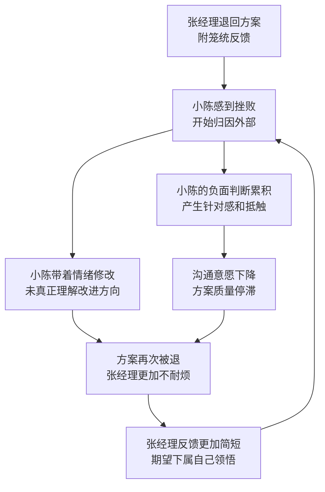
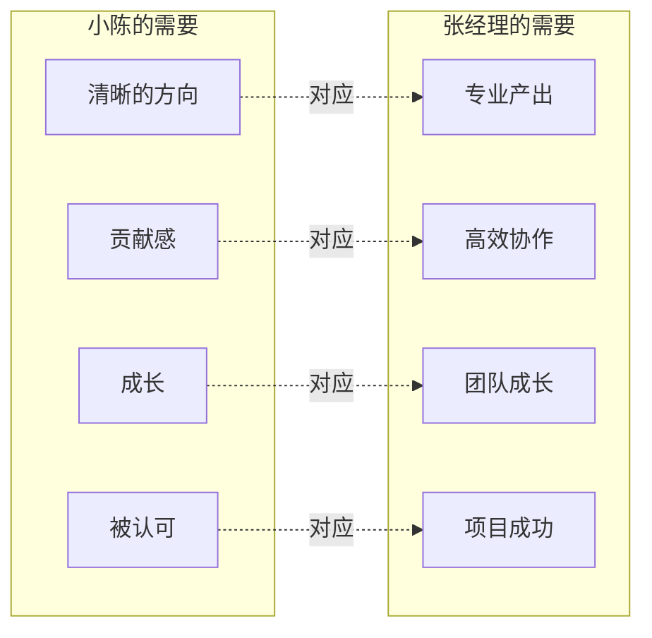

## 案例二：职场中的上下级冲突

### 背景与场景设定

张经理是某科技公司市场部经理，负责带领六人团队。下属小陈是入职一年的营销专员，工作积极但经验尚浅。近期公司启动了一个重要产品推广项目，小陈连续三次提交的营销方案都被张经理退回修改，且每次退回时只附了一句"方向不对，重新想想"。

小陈的挫败感逐渐累积：第一次被退，他觉得是自己准备不够充分；第二次被退，他开始怀疑自己的专业能力；第三次被退，他已经认定张经理在故意针对自己。与此同时，张经理也感到不耐烦——他觉得小陈不理解公司的战略方向，反复犯同样的错误，浪费了团队的时间。

这个场景在职场中极为普遍。根据盖洛普（Gallup）2023年全球职场状况报告，**70%的员工敬业度差异直接取决于其直接上级的管理方式**。上下级之间的沟通障碍，往往不是能力问题，而是沟通模式问题。NVC（非暴力沟通）为这种权力不对等关系提供了一个既能维护尊严又能有效解决问题的沟通框架。

### 职场上下级关系的特殊性

#### 权力不对等带来的沟通障碍

上下级关系与亲密关系、朋友关系的根本区别在于**权力结构的不对等**。这种不对等会产生以下沟通障碍：

| 障碍类型 | 上级的表现 | 下级的表现 |
|---------|----------|----------|
| 信息过滤 | 习惯性地给出结论而非过程，期望下属"自己领悟" | 不敢追问细节，害怕被认为能力不足 |
| 情绪压制 | 认为表达情绪是"不专业"的表现 | 压抑不满情绪，转为消极抵抗或背后抱怨 |
| 反馈失真 | 批评过于笼统（"方向不对"），缺乏具体指导 | 回避负面反馈，只报喜不报忧 |
| 归因偏差 | 将下属失误归因于态度或能力 | 将领导批评归因于针对个人 |
| 沟通中断 | 觉得"我已经说清楚了"就不再解释 | 觉得"说了也没用"就不再表达 |

#### 下属面临的NVC应用难点

在上下级关系中，下属使用NVC比在亲密关系中面临更多挑战：

**第一，"感受"的表达受限。** 职场文化通常不鼓励下级向上级表达负面感受。"我感到沮丧"在伴侣之间是正常的情绪分享，在职场中可能被解读为"抗压能力差"或"情绪化"。因此，下属需要学会在专业框架内表达感受——比如用"我感到困惑"替代"我很生气"，用"我需要更多明确的方向"替代"你的要求不合理"。

**第二，"需要"的表达需要策略。** 在亲密关系中，"我需要被认可"可以直接说出来。在职场中，同样的话可能被误解为"你是在要求我表扬你吗"。下属需要将个人需要转化为与工作目标相关的需求——比如将"我需要被认可"转化为"我需要理解这个方案的改进方向，这样我才能更高效地调整"。

**第三，"请求"的权力边界。** 下属向上级提出请求时，需要考虑上级的时间和权威。请求应该是"可协商的选项"而非"最后通牒"。比如"您愿意花十分钟和我讨论一下方案的改进方向吗"比"您必须告诉我哪里不对"更合适。

#### 上级面临的NVC应用难点

上级使用NVC同样有其特殊挑战：

**第一，习惯性的"评判模式"。** 管理者通常经过训练，擅长评估和判断。这导致他们在沟通中容易滑入评判语言——"这个方案逻辑不通""你的分析太浅了"。这些评判虽然可能准确，但会触发下属的防御反应，阻碍真正的学习和改进。

**第二，"效率优先"的误区。** 许多管理者认为直接指出问题比详细解释更高效。但实际上，笼统的批评（"方向不对"）往往导致更多的反复修改，总的时间成本远高于一开始就给出具体反馈。

**第三，权威与脆弱性的平衡。** 管理者使用NVC表达自己的感受和需要时，可能会担心"示弱"会影响权威。但实际上，适当表达"我对这个项目很重视，担心时间进度"比"你怎么还没做好"更能建立信任和责任感。

### 暴力沟通模式的深层分析

#### 小陈的内心独白（豺狗语言）

> "张经理就是针对我！别人提交的方案他一次就过，我的改了三次还不满意。他根本不懂市场！"

这段内心独白中包含了多个典型的暴力沟通元素：

- **以偏概全**："就是针对我"——将单一事件扩大为人格攻击
- **对比思维**："别人一次就过"——选择性地将自己与他人比较
- **否定能力**："他根本不懂市场"——用否定对方来保护自己的自尊
- **归因外化**：所有问题都归因于对方，自己完全无辜

这种思维模式的心理机制是**自我保护**。当一个人反复经历挫败时，大脑的杏仁核会将"方案被退"这一事件与"自我价值被否定"联系起来，触发"战斗或逃跑"反应。将责任归因于外部（"他在针对我"）是一种心理防御机制，可以暂时缓解自我价值感的下降，但长期来看会阻碍真正的成长和问题解决。

#### 小陈可能的暴力表达

> "张经理，我不知道您到底想要什么！每次修改您都不满意，是不是对我有意见？"

这段话的问题在于：

- **"不知道您到底想要什么"**：暗示对方的需求不合理或表达不清，是一种隐性指责
- **"每次修改都不满意"**：以偏概全，忽略了前三次修改中的进步
- **"是不是对我有意见"**：直接将工作反馈上升为人际冲突，迫使对方在"承认针对你"和"否认但无法解释"之间选择

#### 张经理的暴力回应

> "小陈，我对事不对人。你的方案确实有问题，你应该多学习。"

这段话的问题在于：

- **"对事不对人"**：这句话本身就是一种防御，用来避免讨论沟通方式问题
- **"确实有问题"**：仍然没有说明具体是什么问题，只是换了一种说法重复"方向不对"
- **"你应该多学习"**：将责任完全推给下属，回避了自己作为管理者提供指导的责任

#### 暴力沟通的恶性循环



这个循环的核心问题是：双方都在使用"豺狗语言"（评判、指责、防御），没有人真正触及底层的**需要**。小陈需要的是"清晰的指导方向"和"努力被看见"，张经理需要的是"专业的方案产出"和"高效的团队协作"——这些需要本身并不冲突，但在暴力沟通模式下，双方都看不到这些共同点。

### NVC转换：分步拆解

#### 第一步：观察（Observation）

**NVC的观察要求：只描述客观事实，不添加评判。**

小陈的暴力沟通版本中，"张经理就是针对我"是评判，不是观察。NVC要求小陈回到事实层面：

| 暴力表述（评判） | NVC表述（观察） |
|----------------|----------------|
| "他就是针对我" | "我的方案已经修改了三次" |
| "别人一次就过" | "我注意到其他同事的方案审批周期通常较短" |
| "他根本不懂市场" | "张经理在退回方案时没有附上具体的修改意见" |

张经理同样需要练习观察语言：

| 暴力表述（评判） | NVC表述（观察） |
|----------------|----------------|
| "你的方案确实有问题" | "方案中目标客户的定义范围过宽，预算分配没有突出重点渠道" |
| "你应该多学习" | "我注意到方案中缺少竞品分析和效果衡量指标" |

**关键原则：摄像头测试。** 如果把你说的话放给一个摄像头看，摄像头能"看到"吗？"张经理针对我"——摄像头看不到"针对"，只能看到"方案被退回三次"。这就是观察与评判的区别。

#### 第二步：感受（Feeling）

在职场中表达感受需要更多的策略性。以下是小陈可以使用的感受词汇：

| 不建议使用 | 建议使用 | 说明 |
|-----------|---------|------|
| "我很生气" | "我感到困惑" | 困惑更聚焦于问题本身，而非情绪宣泄 |
| "我觉得不公平" | "我感到有些沮丧" | 沮丧表达的是对结果的失望，而非对他人的指控 |
| "我很委屈" | "我感到挫败" | 挫败聚焦于自身努力与结果的落差 |
| "我受不了了" | "我感到压力较大" | 压力是职场中可被理解的感受 |

张经理也可以适当表达感受：

| 不建议使用 | 建议使用 |
|-----------|---------|
| "我很失望" | "我有些担心项目进度" |
| "你怎么还不明白" | "我感到有些着急" |

**关键原则：感受是自己的，不是对方造成的。** "我感到困惑"和"你让我困惑"有本质区别——前者是表达自己的状态，后者是隐性指责。

#### 第三步：需要（Need）

需要是NVC四步法中最关键也最容易被忽略的一步。在职场上下级冲突中，双方的需要往往是互补而非对立的：



**识别需要的技巧：**

- **向下追问法**：当你说"我需要他给我明确的反馈"时，问自己"明确的反馈能满足我什么更深层的需要"——答案可能是"被尊重"或"高效完成工作"。
- **去掉人名法**：将"我需要张经理认可我"改为"我需要自己的努力被看见"——去掉具体人名后，你看到的是更普遍的人类需要。
- **需要vs策略区分**："我需要张经理直接告诉我哪里不对"是一个策略，不是需要。真正的需要是"清晰的理解"——满足这个需要的方式可以是面对面讨论、书面反馈、参考案例等多种策略。

#### 第四步：请求（Request）

请求与要求的区别：**请求允许对方说"不"，要求不允许。** 在上下级关系中，这个区别尤为重要——下属的"请求"不应让上级感到被命令，上级的"请求"不应让下属感到被胁迫。

**好的请求的三个特征：**

1. **具体**："花十分钟讨论方案的改进方向"比"给我更明确的指导"更具体
2. **可行**：在对方的时间和能力范围内
3. **正向**：说"你愿意做什么"而非"你不要再做什么"

### NVC完整转换示例

#### 小陈的NVC表达

> "张经理，我的方案已经修改了三次（观察）。我感到困惑和有些沮丧（感受），因为我需要理解具体的改进方向，也希望自己的努力能得到认可（需要）。您愿意花十分钟和我详细说明一下，您希望这个方案重点突出什么吗？（请求）"

**逐句分析：**

- "我的方案已经修改了三次"——客观事实，不带评判，双方都能确认
- "我感到困惑和有些沮丧"——两个职场中可接受的感受词，不攻击对方
- "因为我需要理解具体的改进方向"——将个人需要转化为与工作目标相关的需求
- "也希望自己的努力能得到认可"——适度的自我关怀，不卑不亢
- "您愿意花十分钟和我详细说明一下"——具体的时间请求，尊重对方的时间
- "您希望这个方案重点突出什么"——正向的、聚焦于解决方案的请求

#### 张经理的NVC倾听和回应

> "小陈，我理解你的困惑（确认感受）。你确实在这个方案上投入了很多时间（观察）。让我分享一下我的考虑：我关注的是三个点——目标客户更精准、预算分配更合理、效果衡量更清晰（具体反馈）。你愿意今天下午我们一起过一遍，把这些点具体化吗？（回应请求）"

**逐句分析：**

- "我理解你的困惑"——确认对方的感受，建立情感连接
- "你确实在这个方案上投入了很多时间"——用观察确认对方的努力，满足对方"被看见"的需要
- "我关注的是三个点"——将笼统的"方向不对"转化为具体的、可操作的反馈
- "目标客户更精准、预算分配更合理、效果衡量更清晰"——每个点都是可以立即着手改进的方向
- "你愿意今天下午我们一起过一遍"——回应对方的请求，并提供更进一步的支持

### 多种情境下的变体应用

#### 情境一：绩效考核中的负面反馈

**暴力版本：**
> 张经理："小陈，你这个季度的KPI完成率只有60%，低于团队平均水平。你需要加把劲。"

**NVC版本：**
> 张经理："小陈，这个季度你的KPI完成率是60%，团队平均是85%（观察）。我有些担心（感受），因为我看重你的成长，也希望团队整体能保持好的节奏（需要）。你愿意我们一起分析一下哪些任务占用了较多时间，看看有没有可以优化的地方吗？（请求）"

#### 情境二：下属对加班要求的回应

**暴力版本：**
> 小陈："又加班？我已经连续两周每天工作十小时了，公司是不是把我们当机器用？"

**NVC版本：**
> 小陈："张经理，我已经连续两周每天工作十小时（观察）。我感到疲惫，也有些担心长期这样会影响工作质量（感受），因为我需要适当的休息来保持持续的高效产出（需要）。这个任务的优先级和截止时间是怎样的？我们能否一起看看哪些部分可以调整时间安排？（请求）"

#### 情境三：跨部门协作中的上级越权

**暴力版本：**
> 小陈："张经理，您直接找技术部的老王改了方案的技术细节，事先没有跟我沟通，这让我的工作很被动。"

**NVC版本：**
> 小陈："张经理，我注意到方案的技术细节部分已经由技术部的老王调整过了，这个调整是在我没有参与的情况下完成的（观察）。我感到有些被动和困惑（感受），因为我需要了解项目的整体进展，也希望能在自己负责的部分保持连贯性（需要）。以后遇到类似情况，您能否在调整前先和我沟通一下？或者我们一起建立一个方案变更的通知机制？（请求）"

#### 情境四：公开场合的批评

**暴力版本：**
> 张经理（在周会上）："小陈的方案又被客户退回来了，大家要引以为戒，做方案要用心。"
> 小陈（内心）："他在所有人面前羞辱我！"

**NVC版本（小陈会后私下沟通）：**
> 小陈："张经理，今天周会上您提到了我方案被退回的事（观察）。我感到有些尴尬和不安（感受），因为我需要在团队中保持专业的形象，也希望有问题时能先私下沟通（需要）。以后如果我的工作需要在团队中讨论，您能否先和我打个招呼？（请求）"

### 深层对话：双方的需要探索

#### 小陈的需要探索

| 层级 | 内容 |
|------|------|
| 表层需要 | 方案通过、不被退回 |
| 中层需要 | 清晰的改进方向、自己的努力被看见 |
| 深层需要 | 专业成长、归属感、自我价值感 |
| 核心需要 | 被尊重、被当作有能力的人对待 |

小陈过去使用的策略是"希望领导直接给答案"，但这会让领导觉得下属缺乏主动性。NVC启发他转换策略：**主动寻求具体反馈**，把"您告诉我该怎么做"变成"我们一起讨论改进方向"——这既满足了自己对清晰方向的需要，也满足了领导对团队成员主动性的期望。

#### 张经理的需要探索

| 层级 | 内容 |
|------|------|
| 表层需要 | 一份合格的营销方案 |
| 中层需要 | 团队的专业能力提升、项目的成功 |
| 深层需要 | 作为管理者的胜任感、团队的信任 |
| 核心需要 | 有效沟通、事情按预期推进 |

张经理过去使用的策略是"退回修改，期望下属自己领悟"，这种策略隐含的假设是"如果我解释太多，会显得我事无巨细，降低效率"。NVC启发他认识到：**提供具体反馈不是效率的敌人，而是效率的保障**——笼统的"方向不对"导致三次返工，而一开始就给出具体方向，可能一次就能到位。

### 共同改进方案

双方在NVC对话的基础上，可以建立以下制度性改进：

**1. 方案反馈模板**

张经理在退回方案时，使用以下模板提供反馈：

```markdown
## 方案反馈

### 整体评价
[一句话概括方案的可用程度]

### 具体修改要点（按优先级排序）
1. **[问题一]**：[具体描述] → [期望改进方向]
2. **[问题二]**：[具体描述] → [期望改进方向]
3. **[问题三]**：[具体描述] → [期望改进方向]

### 做得好的部分
- [值得保留的优点一]
- [值得保留的优点二]

### 参考资源
- [参考案例/竞品/文章链接]
```

**2. 小陈的提交前自检清单**

```markdown
## 方案提交自检

- [ ] 目标客户画像是否明确且有数据支撑？
- [ ] 预算分配是否合理，有优先级区分？
- [ ] 是否包含效果衡量指标（KPI）？
- [ ] 是否参考了上一次的反馈要点？
- [ ] 是否有竞品分析作为对比参照？
- [ ] 执行时间线是否清晰可行？
```

**3. 方案讨论会制度**

在正式提交方案之前，安排一次15-20分钟的非正式讨论：

- **时间**：方案初稿完成后、正式提交前
- **形式**：一对一或小范围讨论
- **目的**：提前对齐方向，避免提交后的大规模返工
- **记录**：简要记录讨论要点和确认的方向

**4. 定期一对一沟通**

每周或每两周安排30分钟的一对一沟通，不只讨论具体方案，也讨论：

- 工作进展和遇到的困难
- 需要的支持和资源
- 职业发展方向和学习计划
- 双方的沟通方式是否需要调整

### NVC应用中的常见陷阱

#### 陷阱一：把NVC当成"话术模板"

有些人在学习NVC后，机械地套用"当……我感到……因为我需要……你愿意……吗？"的句式，但语气和表情仍然是指责和不满。NVC的核心不是句式，而是**真诚地连接自己的感受和需要，并带着同理心去倾听对方**。如果内心充满愤怒，嘴上却说"我感到困惑"，对方能感受到这种不一致，反而会加剧不信任。

#### 陷阱二：只在下级身上使用NVC

有些管理者认为NVC只是"让下属好好说话"的工具。实际上，管理者更需要学习NVC——因为权力不对等意味着管理者的每一句话都有更大的影响力。一句笼统的"方向不对"可能让下属困惑一整天，而一句具体的"我关注目标客户的精准度"可能直接推动方案的改进。

#### 陷阱三：用NVC回避必要的冲突

NVC不是为了让所有人"和和气气"而回避真正的问题。如果下属确实存在能力不足或态度问题，管理者需要用NVC的方式直接指出——比如"我注意到你连续三个方案都没有包含竞品分析（观察），我有些担心（感受），因为我看重团队的专业标准（需要）。你愿意我们一起制定一个方案写作的检查清单吗？（请求）"——这比含糊的"你应该多学习"更有建设性。

#### 陷阱四：忽视文化背景的影响

在中国职场中，直接表达感受和需要可能与"含蓄""顾全大局"的文化习惯冲突。使用NVC时需要考虑文化适应性：可以将"我感到沮丧"调整为"这个情况让我有些为难"，将"我需要被认可"调整为"希望也能看到方案中的积极部分"——核心的NVC精神不变，但表达方式更符合文化语境。

### 进阶技巧：权力动态中的NVC策略

#### 作为下属的NVC进阶

**技巧一：预设正面意图。** 在表达之前，先在内心假设上级的批评是出于对工作质量的重视，而非针对个人。这个假设不一定是事实，但它能帮助你以更开放的心态进入对话，而开放的心态往往能带来更好的结果。

**技巧二：将"我需要"转化为"为了更好地完成工作"。** 在职场中，将个人需要与团队/公司目标挂钩，更容易获得上级的回应。"为了能更高效地推进这个项目，我需要理解您对方案的核心期望"比"我需要你给我更明确的指导"更有说服力。

**技巧三：使用"升级请求"策略。** 如果口头沟通无效，可以考虑将沟通升级为书面形式——比如发一封邮件，用NVC结构整理自己的观察、感受、需要和请求。书面形式既给了对方思考的空间，也留下了沟通记录。

**技巧四：寻找盟友和第三方。** 如果直接与上级的NVC沟通反复受阻，可以考虑寻求HR、其他管理者或信任的同事作为沟通的桥梁。这不是"告状"，而是借助第三方的视角来打破沟通僵局。

#### 作为上级的NVC进阶

**技巧一：先倾听，后表达。** 当下属提交的工作不达标时，先用NVC倾听下属的考虑和困难，再表达自己的期望和反馈。这不仅能获得更完整的信息，也能让下属感到被尊重，从而更愿意接受反馈。

**技巧二：将批评转化为学习机会。** "这个方案的目标客户定义不够精准"是批评。"我们一起看看目标客户定义的标准是什么，以及如何用数据来支撑"是学习机会。两者的区别在于：前者让下属感到被评判，后者让下属感到被培养。

**技巧三：公开表扬，私下反馈。** 在团队面前表扬具体的好做法，在私下一对一中指出需要改进的地方。这既保护了下属的面子，也给了有效的反馈。

**技巧四：定期进行"沟通方式检查"。** 在一对一沟通中，主动问下属："我平时的反馈方式对你有帮助吗？有没有什么我可以调整的？"这种开放的姿态本身就是NVC精神的体现。

### 理论支撑：为什么NVC在职场中有效

#### 心理安全与团队绩效

谷歌的"亚里士多德项目"（Project Aristotle）研究发现，**心理安全（Psychological Safety）是高绩效团队最重要的特征**。心理安全指的是团队成员相信自己可以自由表达想法、提出问题、承认错误，而不会受到惩罚或嘲笑。

NVC直接促进心理安全的建立：当上级使用观察而非评判时，下属不用担心被贴标签；当上级确认下属的感受时，下属感到被理解而非被忽视；当上级提供具体的反馈和请求时，下属知道如何改进而不必猜测。

#### 自我决定理论（Self-Determination Theory）

心理学家Deci和Ryan提出的自我决定理论认为，人类有三种基本心理需要：**自主性（Autonomy）、胜任感（Competence）、归属感（Relatedness）**。当这三种需要得到满足时，个体会表现出更高的内在动机和更好的绩效。

NVC通过以下方式满足这三种需要：

- **自主性**：请求而非要求，给予对方选择的空间
- **胜任感**：具体而非笼统的反馈，帮助对方知道如何改进
- **归属感**：确认感受和需要，建立情感连接

#### 镜像神经元与情绪传染

神经科学研究表明，人类大脑中的镜像神经元（Mirror Neuron）会使我们在观察他人情绪时不自觉地模仿和体验相同的情绪。这意味着，如果上级在反馈时表现出不耐烦或失望，下属的大脑会"镜像"这些情绪，导致防御反应。反过来，如果上级在反馈时表现出理解和关心，下属也会感受到这些积极情绪，从而更开放地接受反馈。

这解释了为什么NVC强调**先连接感受和需要，再解决问题**——它利用了镜像神经元的工作机制，通过表达理解来创造安全的心理环境。

### 案例的长期效果

张经理和小陈在引入NVC沟通方式后的三个月内，观察到了以下变化：

| 指标 | 改进前 | 改进后 |
|------|--------|--------|
| 方案平均修改次数 | 3-4次 | 1-2次 |
| 方案提交到通过的平均周期 | 5-7天 | 2-3天 |
| 一对一沟通频率 | 偶尔（出了问题才沟通） | 每周固定30分钟 |
| 小陈的工作满意度 | 低（考虑换岗） | 显著提升 |
| 张经理的管理效率 | 低（花大量时间在反复修改上） | 提升（更多时间用于策略性工作） |

这些变化不是因为NVC是一种"神奇的话术"，而是因为它帮助双方**看见了彼此的需要，找到了共同的解决方案**。小陈需要清晰的方向——张经理提供了反馈模板；张经理需要高效的协作——小陈建立了自检清单。当需要被看见和满足，行为自然会改变。

***

