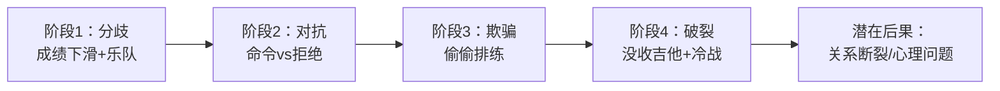
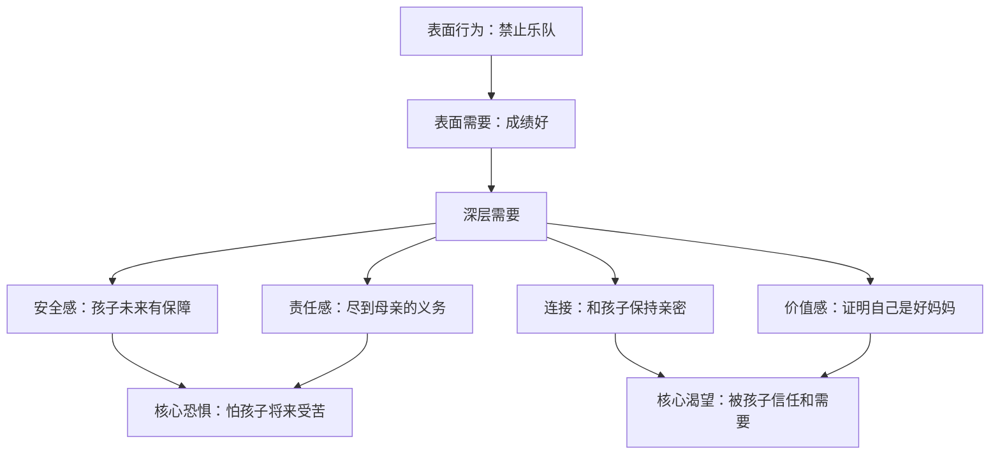
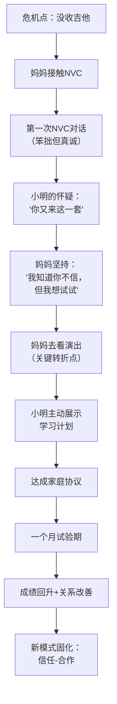

## 案例三：亲子教育中的代际冲突

亲子之间的代际冲突是家庭中最常见、最持久的沟通难题之一。它不只是"说不通"那么简单——背后牵涉发展心理学、家庭系统动力、文化价值观传递、权力博弈等多重因素。本案例以一个典型的青春期亲子冲突为切入点，层层拆解暴力沟通的形成机制，演示非暴力沟通（NVC）如何打破"控制—反抗"的恶性循环，并提供可落地的工具、模板和进阶策略。

---

### 一、代际冲突的心理学根源

#### 1.1 青春期大脑发育的科学事实

青春期（12-25 岁）是人类大脑第二个关键发育期。前额叶皮层（负责计划、冲动控制、后果评估）要到 25 岁左右才完全成熟，而边缘系统（负责情绪、奖赏、冒险）在 12-15 岁就高度活跃。这意味着：

| 发育维度 | 青少年特点 | 家长常见误读 |
|---------|----------|------------|
| 情绪调节 | 杏仁核活跃，情绪反应强烈且快速 | "这孩子脾气太大了" |
| 风险评估 | 前额叶未成熟，低估长期后果 | "他就是不懂事" |
| 同伴依赖 | 社交脑区高度敏感，同伴认可优先于家长认可 | "他只听朋友的" |
| 自主需求 | 自我意识觉醒，强烈需要独立决策空间 | "翅膀硬了想飞了" |
| 抽象思维 | 开始质疑权威和既有规则 | "越来越叛逆" |

**关键认知**：青少年的"叛逆"不是故意对抗，而是大脑发育驱动的正常发展任务——心理学家埃里克森称之为"自我同一性 vs 角色混乱"的核心冲突。

#### 1.2 家长的情绪触发机制

当家长说"不许去"时，表面上是在管控孩子，实际上往往被自己的恐惧驱动：

```mermaid
graph TD
    A[孩子提出需求] --> B[家长感知到威胁]
    B --> C{威胁类型}
    C -->|安全感威胁| D["万一成绩下滑怎么办"]
    C -->|控制感威胁| E["我管不住他了"]
    C -->|价值观威胁| F["音乐不是正经事"]
    C -->|社会评价威胁| G["别人会怎么看我这个妈"]
    D --> H[焦虑/恐惧]
    E --> H
    F --> H
    G --> H
    H --> I[用命令/批评/威胁来"保护"]
    I --> J[孩子感受到被控制]
    J --> K[反抗/隐瞒/对抗]
    K --> L[家长更加焦虑]
    L --> I
```

这个循环一旦启动，双方都在为自己的需要而战，却没有人在真正倾听对方。

#### 1.3 中国文化语境下的特殊张力

在中国家庭中，代际冲突还叠加了独特的文化因素：

- **孝道文化**："听话"被等同于"好孩子"，质疑被视为不孝
- **教育焦虑**：高考独木桥、学区房、补习班——整个社会都在放大"学业失败"的恐惧
- **补偿心理**：家长将自己未实现的愿望投射到孩子身上
- **面子文化**：孩子的表现直接关联家长的社会评价
- **集体主义传统**：家庭利益优先于个体需求的文化惯性

这些因素让中国家长在面对孩子"不务正业"时，焦虑程度远超西方家长，也更难接受"尊重孩子选择"的理念。

---

### 二、案例全景：小明的乐队梦

#### 2.1 背景还原

15 岁的小明就读于某市重点中学初三。从小学钢琴，初二时和三个同学组建了一支摇滚乐队，担任吉他手。乐队在学校文艺汇演中获得一等奖，小明在音乐中体验到强烈的成就感和归属感。

然而，进入初三后，期中考试排名从班级第 18 名滑落到第 32 名。妈妈王女士（42 岁，公司财务主管）将成绩下滑完全归因于乐队活动，要求小明立即退出乐队，全身心投入备考。

小明拒绝。双方爆发激烈争吵，此后两周内冷战，小明开始偷偷去排练，甚至有一次谎称去图书馆实际去了排练室。王女士发现后更加愤怒，没收了吉他，亲子关系降至冰点。

#### 2.2 暴力沟通模式解析

**妈妈的表达**（豺狗语言）：

> "你现在最重要的任务是学习！乐队能当饭吃吗？你看你上次考试成绩下滑了多少！不许去！"

逐句拆解：

| 语言层次 | 妈妈说了什么 | 实际传递的信息 | 孩子接收到的 |
|---------|------------|-------------|------------|
| 评判 | "最重要的任务是学习" | 我来定义你的人生优先级 | 你不尊重我的想法 |
| 嘲讽 | "乐队能当饭吃吗" | 你的爱好毫无价值 | 我的热爱不被认可 |
| 归咎 | "成绩下滑了多少" | 都是乐队的错 | 你只看到我的错 |
| 命令 | "不许去" | 你没有选择权 | 我不被信任 |

**小明的反应**：

> "你们只关心成绩！根本不理解我！我就是要去！"

| 语言层次 | 小明说了什么 | 实际需要 | 妈妈接收到的 |
|---------|------------|---------|------------|
| 概括化 | "只关心成绩" | 渴望被全面地看见 | 这孩子不领情 |
| 控诉 | "不理解我" | 渴望被倾听和共情 | 他在怪我 |
| 对抗 | "就是要去" | 渴望自主权 | 他在挑战我的权威 |

**结果**：小明偷偷去排练，妈妈发现后没收吉他，亲子关系恶化。小明开始在日记里写"这个家让人窒息"，成绩进一步下滑。

#### 2.3 冲突升级的四个阶段



每个阶段都比上一个更难修复。如果在阶段 1 就介入 NVC，成本最低、效果最好。

---

### 三、NVC 四步转换实操

#### 3.1 第一步：观察（Observation）——区分事实与评判

**常见错误**：
- ❌ "你最近一直在玩乐队"（"一直"是夸大，不是观察）
- ❌ "你成绩下降了"（笼统，没有具体数据）
- ❌ "你都不学习了"（极端化概括）

**正确示范**：

> "小明，我看了你最近三次考试的成绩单：数学从 92 分降到了 78 分，英语从 88 分降到了 81 分，物理从 85 分降到了 76 分。"

**观察的三个标准**：
1. **具体**：有时间、有数字、有事实
2. **中性**：不含道德判断和归因
3. **可验证**：两个人看到的是同一个事实

**练习工具——观察日记**：

| 日期 | 我看到/听到的事实 | 我当时的评判 | 修正后的纯观察 |
|-----|----------------|------------|-------------|
| 3/15 | 小明周六下午不在家 | 又去玩乐队了 | 小明周六 14:00-18:00 不在家 |
| 3/20 | 数学卷子发下来了 | 考得真差 | 数学成绩 78 分，比上次低 14 分 |
| 3/22 | 小明在房间弹吉他 | 不务正业 | 小明 21:00 在弹吉他，作业已写完 |

#### 3.2 第二步：感受（Feeling）——说出真实情绪而非伪装

**家长常犯的"伪感受"错误**：

| 伪感受（实际是评判） | 真实感受 | 未被满足的需要 |
|-------------------|---------|-------------|
| "我觉得你不尊重我" | 我感到失落、受伤 | 需要尊重和连接 |
| "我觉得你在浪费时间" | 我感到焦虑、恐惧 | 需要安全感和掌控感 |
| "我觉得你不在乎学习" | 我感到担忧、无力 | 需要确定性和希望 |
| "我觉得你被带坏了" | 我感到害怕、孤立 | 需要信任和参与感 |

**正确的感受表达**：

> "我感到担心和焦虑。"

而不是："我觉得你太不像话了。"

**家长感受词汇表**（常用）：

| 需要未满足时的感受 | 需要得到满足时的感受 |
|----------------|----------------|
| 担心、焦虑、恐惧 | 安心、踏实、平静 |
| 失望、沮丧、无力 | 欣慰、骄傲、满足 |
| 受伤、失落、孤独 | 温暖、连接、亲近 |
| 困惑、迷茫、不知所措 | 清晰、确定、有信心 |
| 愤怒、烦躁、不耐烦 | 释然、轻松、平和 |

#### 3.3 第三步：需要（Need）——穿透行为看到深层渴望

**妈妈的深层需要分析**：



**小明的深层需要分析**：

| 行为表现 | 表面需要 | 深层需要 | 核心渴望 |
|---------|---------|---------|---------|
| 坚持参加乐队 | 玩音乐 | 自主选择的权利 | 被当作独立的人对待 |
| 和乐队成员关系好 | 有朋友 | 归属感、被接纳 | 在群体中有位置 |
| 在演出中表现出色 | 炫耀 | 成就感、胜任感 | 在某个领域被认可 |
| 拒绝和妈妈沟通 | 赌气 | 被理解、被倾听 | 父母看到完整的自己 |

**NVC 中的需要表达示范**：

> "我需要确信你能平衡好学习和兴趣爱好，也担心如果成绩继续下滑，你初三升高中的选择面会变窄。"

**注意**：需要是普世的、不属于任何一方的。安全感、自主、归属、成就——这些都是人类共有的需要，不存在谁对谁错。

#### 3.4 第四步：请求（Request）——具体、可行、可拒绝

**无效请求 vs 有效请求**：

| 无效请求 | 问题 | 有效请求 |
|---------|------|---------|
| "你以后要好好学习" | 模糊，不可执行 | "你愿意每天先完成作业再练琴吗？" |
| "别再搞乐队了" | 命令，不可拒绝 | "你愿意和我一起看看怎么安排时间吗？" |
| "你要懂事一点" | 抽象，没有行为指向 | "你愿意每周日晚上和我聊聊这周的情况吗？" |
| "你自己看着办" | 表面给自由，实际是放弃 | "你来提一个方案，我们一起评估？" |

**请求的三个标准**：
1. **具体**：明确说出希望对方做什么（而不是不做什么）
2. **当下**：聚焦这一次、这一步，不要求长期承诺
3. **开放**：对方可以说"不"或提出替代方案

**完整 NVC 表达示范——妈妈版**：

> "小明，我注意到你最近三次考试成绩都有所下滑，数学降了 14 分，英语降了 7 分，物理降了 9 分（观察）。我感到担心和焦虑（感受），因为我需要确信你能平衡好学习和兴趣，也担心你中考时选择面会变窄（需要）。你愿意和我一起看看，有没有什么方法既能继续参加乐队排练，又能把成绩稳住？（请求）"

**完整 NVC 表达示范——小明版**：

> "妈，我听到你担心我的成绩下滑，你希望我能平衡好学习和乐队（确认理解）。乐队排练对我来说很重要，上周的校庆演出我们拿了第一名（观察），我在台上表演时感到特别快乐和有成就感（感受），因为我需要创造、表达，也需要和乐队的朋友在一起（需要）。我保证会安排好学习时间。你愿意看看我制定的一个时间安排方案吗？（请求）"

---

### 四、深层对话：从对抗到合作

#### 4.1 倾听练习：妈妈站在小明的位置

**指导语**：妈妈尝试用 NVC 倾听小明，复述小明的感受和需要。

**示范**：

> 妈妈："我听你说，乐队对你很重要，你在音乐中感到快乐和成就感，你需要创造和归属。你是不是也希望我能理解音乐对你的意义，而不只是看到它占用的时间？"
>
> 小明（眼眶微红）："对……你终于明白了。"

**倾听的三个层次**：

| 层次 | 表现 | 效果 |
|------|------|------|
| 表面倾听 | 听到了话，但心里在准备反驳 | 无效，对方感到被敷衍 |
| 事实倾听 | 听到了事实，但没有感受到情绪 | 部分有效，对方觉得"你理解了一半" |
| 共情倾听 | 听到了事实、感受和需要，回应对方的内心世界 | 深度有效，对方感到被真正理解 |

#### 4.2 倾听练习：小明站在妈妈的位置

**示范**：

> 小明："妈，我听到你说你担心我的成绩，你希望我未来有更多选择。你是不是也觉得如果我不听你的，就好像我不在乎你的感受？"
>
> 妈妈（沉默了一下）："是的……我怕你将来后悔，也怕你觉得妈妈不重要。"

#### 4.3 创造性解决方案的生成

当双方都感到被倾听后，才能进入真正的问题解决阶段。以下是基于本案例的协商过程：

**第一步：各自列出需求清单**

| 妈妈的需求 | 小明的需求 |
|-----------|-----------|
| 成绩不继续下滑 | 继续参加乐队排练 |
| 有可衡量的保障 | 不被过度管控 |
| 了解孩子的学习状况 | 被信任和尊重 |
| 参与感（不是被排除在外） | 有自主安排时间的权利 |

**第二步：头脑风暴（不评判任何方案）**

1. 制定"学习—乐队平衡协议"
2. 妈妈去观看一次乐队演出
3. 小明每周日晚上和妈妈分享本周的学习和乐队情况
4. 设定一个月的试验期，到期后共同评估
5. 如果成绩回升，乐队活动不受限制
6. 小明自己制定学习计划，妈妈提供资源支持但不监督细节
7. 邀请爸爸作为"中立观察员"参与评估

**第三步：评估并选定方案**

最终达成的"家庭合作协议"：

━━━━━━━━━━━━━━━━━━━━━━━━━━━━━━━━━━
         学习—乐队平衡协议
━━━━━━━━━━━━━━━━━━━━━━━━━━━━━━━━━━

甲方（妈妈）：王 XX
乙方（小明）：张小明
日期：2024 年 X 月 X 日

一、乐队活动安排
  • 排练时间：周六下午 14:00-17:00
  • 演出活动：提前 3 天告知妈妈，获得同意
  • 日常练琴：作业完成后，不超过 30 分钟

二、学业保障
  • 月考成绩：各科不低于班级平均分
  • 作业完成：每天 21:00 前完成，妈妈可查看
  • 如果连续两次月考低于标准，暂停乐队两周，
    调整学习方法后恢复

三、沟通机制
  • 每周日晚 20:00-20:30，"家庭分享时间"
  • 小明分享本周学习和乐队情况
  • 妈妈分享自己的感受和观察（不用批评语气）

四、信任建设
  • 妈妈本月观看一次乐队排练/演出
  • 小明自主制定学习计划，妈妈提供建议但不强制
  • 双方互不翻旧账

五、试验期
  • 一个月后共同评估，双方都有权提出修改
  • 评估时用数据说话，不用情绪说话

签名：________________  ________________
━━━━━━━━━━━━━━━━━━━━━━━━━━━━━━━━━━

---

### 五、常见陷阱与纠错指南

#### 5.1 家长在使用 NVC 时的 8 个典型错误

| 错误 | 具体表现 | 后果 | 纠正方法 |
|------|---------|------|---------|
| 1. 把 NVC 当武器 | "我观察到你总是不听话" | 孩子感到更加被攻击 | 观察必须是摄像机能拍到的事实 |
| 2. 假装感受 | "我感到你很不尊重我"（这是评判） | 孩子识破后更加不信任 | 用"我感到受伤/失落"代替 |
| 3. 附加条件的需要 | "我需要你考前十名" | 这不是需要，是策略 | 需要是"安全感""确定性" |
| 4. 请求变命令 | "你愿意好好学习吗？不行也得行" | 孩子感到被操控 | 请求必须允许对方说"不" |
| 5. 一次说太多 | 4 个步骤一口气说完 5 分钟 | 孩子早就走神了 | 每次聚焦一个核心需要 |
| 6. 只在冲突时用 | 平时不管，吵架了才"我观察到……" | 孩子觉得这是套路 | 日常就用 NVC 语言交流 |
| 7. 期待立刻见效 | "我都 NVC 了你怎么还不改" | 产生新的失望和愤怒 | NVC 是长期关系投资 |
| 8. 忽略自身情绪 | 强压怒火"理性"沟通 | 情绪会以更猛烈的方式反弹 | 先处理自己的情绪，再沟通 |

#### 5.2 孩子可能出现的反应及应对

| 孩子的反应 | 可能的原因 | 应对策略 |
|-----------|-----------|---------|
| "你又来这一套" | 过去有不好的经验 | "我理解你的怀疑，我这次是真心想听你说" |
| 沉默不语 | 不信任、害怕被评判 | 给空间，不追问，"你准备好了随时告诉我" |
| "随便，你说什么就是什么" | 习得性无助 | "这不是我要你说什么，我想知道你怎么想" |
| 情绪爆发、哭喊 | 长期压抑后的释放 | 保持平静，陪伴，"我在这里，你可以哭" |
| 讲道理、辩论 | 用理性防御情绪 | "你说的有道理，我更想知道你的感受" |

#### 5.3 当 NVC 似乎"不管用"时

NVC 不是万能药。以下情况需要额外处理：

**情况一：孩子拒绝沟通**
- 不要强迫，退一步说："我尊重你现在不想谈，等你想说的时候我随时都在。"
- 用行动而非语言重建信任：做他爱吃的菜，在他生日时送他吉他弦
- 考虑通过书信或微信消息表达，给双方缓冲空间

**情况二：家长自己情绪失控**
- 觉察到愤怒时，先喊暂停："我现在情绪很大，我需要冷静一下，我们 20 分钟后再谈。"
- 深呼吸 5 次，或者离开房间走一走
- 在情绪高峰期绝不做任何决定

**情况三：涉及安全底线**
- NVC 不意味着无条件妥协。涉及人身安全、法律、健康的底线问题，家长有责任坚守
- 区分"需要坚守的底线"和"可以协商的偏好"

| 底线（必须坚守） | 偏好（可以协商） |
|----------------|----------------|
| 不能逃课去排练 | 排练的具体时间安排 |
| 不能影响睡眠健康 | 练琴的时长和频次 |
| 不能接触危险物品/人 | 参加哪些类型的活动 |
| 必须完成义务教育 | 课外学习的优先级排序 |

---

### 六、进阶策略

#### 6.1 家庭会议制度

将 NVC 从"冲突时的应急工具"升级为"家庭日常沟通机制"：

**家庭会议模板**：

━━━━━━━━━━━━━━━━━━━━━━━━━━━━━━━━━━
        第 X 次家庭会议
━━━━━━━━━━━━━━━━━━━━━━━━━━━━━━━━━━
时间：每周日 20:00-20:45
参加人：爸爸、妈妈、小明
主持人：轮流担任（本周：小明）

议程：
1. 感恩时刻（每人说一件感谢其他人的事）  5 分钟
2. 成功分享（本周做得好的一件事）        10 分钟
3. 需求表达（用 NVC 表达一个需要）        15 分钟
4. 解决方案（共同讨论一个家庭议题）       10 分钟
5. 下周约定（各自的一个小承诺）           5 分钟

规则：
• 不打断、不评判、不翻旧账
• 每人发言时其他人放下手机
• 用"我"开头，不用"你"开头
• 可以说"我需要暂停"，但要约定继续时间
━━━━━━━━━━━━━━━━━━━━━━━━━━━━━━━━━━

#### 6.2 "情感账户"模型

心理学家约翰·戈特曼提出"情感账户"概念：每一次正面互动是存款，每一次负面互动是取款。研究显示，稳定的关系需要至少 5:1 的正负比。

**亲子情感账户操作指南**：

| 存款行为 | 取款行为 |
|---------|---------|
| 认真听孩子说完一件事 | 孩子说话时看手机 |
| 记住孩子提过的小事并跟进 | 忘记对孩子的重要承诺 |
| 在别人面前肯定孩子 | 在别人面前批评孩子 |
| 尊重孩子的隐私 | 偷看孩子日记/手机 |
| 对孩子的兴趣表示好奇 | 嘲笑或贬低孩子的爱好 |
| 道歉（家长犯错时） | 死不认错，"我是为你好" |
| 给孩子选择权 | 所有事情都替孩子决定 |

**本案例中的"存款"操作**：
- 妈妈去看乐队排练（+50）
- 妈妈承认自己之前太严厉（+30）
- 小明主动展示学习计划（+40）
- 每周分享时间双方认真参与（每次+10）

#### 6.3 不同年龄段的 NVC 调整策略

| 年龄段 | 沟通特点 | NVC 调整要点 |
|--------|---------|-------------|
| 3-6 岁 | 语言能力有限，情绪直接 | 用简单词汇帮孩子命名感受；用游戏和绘本辅助 |
| 7-12 岁 | 开始讲道理，但逻辑不成熟 | 给选择而非命令；用"我"句式示范；重视公平感 |
| 12-15 岁 | 强烈自主需求，情绪波动大 | 尊重隐私；用提问代替告知；给决策参与权 |
| 15-18 岁 | 接近成人思维，价值观独立 | 用平等对话；协商而非管控；接受价值观差异 |
| 18 岁以上 | 成人关系模式 | 尊重为前提；只在被邀请时给建议；接纳不同选择 |

#### 6.4 代际创伤的觉察与打断

很多时候，家长对孩子的控制模式来自自己的成长经历：

> "我小时候就是被逼着学钢琴，现在我不是挺好的吗？所以孩子也应该听我的。"

**觉察练习**——代际模式追溯：

问自己三个问题：
1. 我的父母是怎么对待我的类似需求的？
2. 当时我的感受是什么？
3. 我现在对孩子做的，是不是在重复我父母的模式？

如果答案是"是"，这不是你的错——
这是未被处理的代际创伤在自动运转。
觉察到它，就是打断它的第一步。

**打断代际创伤的 NVC 句式**：

> "我注意到我想禁止你做 X，这让我想起我小时候被禁止做 Y 时的感受。我现在意识到，我当时的需要没有被看见。我不想让你也有同样的感受。我们能谈谈你的需要吗？"

---

### 七、案例的长期效果追踪

#### 7.1 一个月后的变化

| 维度 | 冲突前 | 协议执行一个月后 |
|------|-------|----------------|
| 小明成绩 | 班级第 32 名 | 回升到第 24 名 |
| 乐队活动 | 偷偷进行 | 按协议公开进行 |
| 亲子对话频率 | 几乎为零 | 每周一次正式 + 日常自然交流 |
| 妈妈的焦虑水平 | 极高（失眠） | 明显降低（"至少我知道情况了"） |
| 小明的信任感 | "他们不理解我" | "妈妈在试着理解我" |

#### 7.2 一年后的状态

- 小明以班级第 15 名的成绩考入理想高中，乐队仍在继续
- 妈妈成了乐队的"后勤部长"，帮忙联系演出场地
- 亲子关系从"控制—反抗"转变为"信任—合作"
- 小明在高中主动和妈妈讨论选科问题（信任的延伸）
- 家庭会议制度持续运行，成为全家最期待的周末活动

#### 7.3 关键转折点回顾



---

### 八、给不同角色的行动清单

#### 8.1 给家长的 10 条建议

1. **先连接，后纠正**——在提要求之前，先让孩子感到被看见
2. **用"我"开头**——"我担心"而不是"你总是"
3. **区分观察和评判**——"数学 78 分"是观察，"考得真差"是评判
4. **说出感受，不要表演感受**——真正的脆弱比假装的愤怒更有力量
5. **承认自己的恐惧**——"我害怕你将来受苦"比"我这是为你好"更真实
6. **给选择，不给命令**——"你愿意 A 还是 B？"比"你必须 A"有效
7. **学会暂停**——情绪上来时说"我需要冷静一下"，而不是继续输出
8. **看见孩子的努力**——进步 1 分和退步 10 分，哪个更值得被提及？
9. **信任是逐步建立的**——先给小的信任，观察结果，再逐步扩大
10. **你不需要完美**——NVC 说错了也没关系，真诚比技巧重要

#### 8.2 给青少年的 10 条建议

1. **父母的唠叨背后是恐惧**——理解这一点，你就不会只听到控制
2. **用"我需要"代替"你不让我"**——"我需要自主权"比"你什么都不让我做"更有建设性
3. **拿出你的计划**——空口承诺不如一份具体的时间安排表
4. **让父母看到你的世界**——邀请他们来看一次排练，比说一百遍"你不懂"有效
5. **成绩是谈判筹码**——这不是功利，是让父母安心的实际行动
6. **给父母适应的时间**——他们从"管控"到"信任"需要练习，就像你学吉他一样
7. **不要用沉默惩罚**——"不想说"和"故意不理"是两回事，告诉他们你需要空间
8. **学会说"谢谢你的担心"**——承认父母的善意，即使你不同意他们的方法
9. **底线要有但别太多**——挑出最重要的 1-2 件事坚守，其他的事可以协商
10. **你有权寻求帮助**——如果家庭冲突严重影响你的心理状态，找学校心理老师或信任的成年人

---

### 九、延伸阅读与工具推荐

#### 9.1 核心书目

| 书名 | 作者 | 核心价值 |
|------|------|---------|
| 《非暴力沟通》 | 马歇尔·卢森堡 | NVC 原始理论框架 |
| 《如何说孩子才会听》 | 阿黛尔·法伯 | 亲子沟通的实操手册 |
| 《正面管教》 | 简·尼尔森 | 不惩罚不骄纵的教养方法 |
| 《你的 N 岁孩子》系列 | 格塞尔研究所 | 各年龄段发展特点 |
| 《由内而外的教养》 | 丹尼尔·西格尔 | 理解代际创伤和大脑科学 |
| 《解码青春期》 | 乔希·西普 | 理解青少年的内心世界 |

#### 9.2 实用工具

- **感受/需要卡片**：NVC 配套的情绪和需要识别工具，适合亲子一起使用
- **家庭会议计时器**：确保每人发言时间平等
- **冲突暂停手势**：全家约定一个手势，表示"我需要暂停，稍后再谈"
- **NVC 日记本**：每天记录一次成功的 NVC 表达和一次失败的尝试

---

### 十、本案例的核心启示

代际冲突的本质不是"谁对谁错"，而是两代人有不同但同样正当的需要，只是用了一种互相伤害的方式来争取。NVC 的价值不在于让孩子听话，也不在于让家长放手，而在于提供了一种双方都能被看见、被尊重的对话方式。

当妈妈说出"我害怕你将来受苦"而不是"不许去"时，小明听到的不再是控制，而是爱。当小明说出"我需要被信任"而不是"你管不着"时，妈妈看到的不再是叛逆，而是一个正在长大的、需要空间的灵魂。

> **NVC 不是让家长放弃权威，而是让权威建立在信任而非恐惧之上。**
>
> **NVC 不是让孩子为所欲为，而是让选择伴随着理解和责任。**

这，就是非暴力沟通在亲子关系中最深刻的力量。
