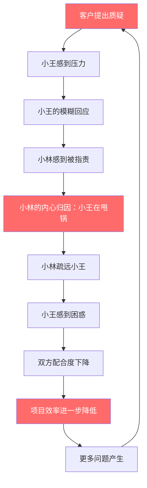
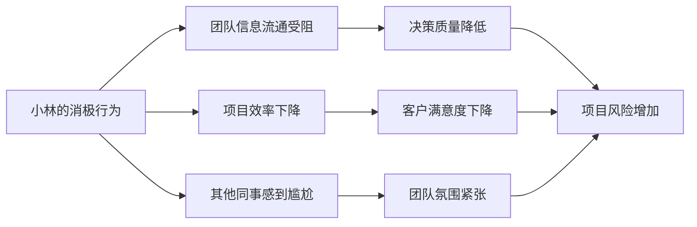
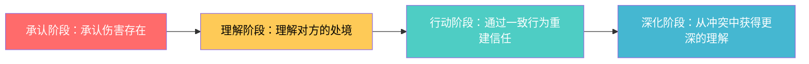

## 案例四：同事间的误解与和解

同事关系是现代人最常面对的人际场景之一。不同于亲密关系的情感纽带，也不同于上下级关系的权力结构，同事关系建立在**共同完成任务**的基础上，既有合作的需要，又有利益的交织。当误解产生时，处理不当不仅影响个人情绪，更可能破坏团队协作效率，甚至影响职业发展。

本案例通过小林与小王的真实职场冲突，展示NVC四步法在同事关系中的完整应用，并深入探讨同事间沟通的特殊挑战与应对策略。

### 场景还原

#### 人物画像

| 角色 | 职责 | 性格特点 | 沟通风格 |
|------|------|----------|----------|
| 小林 | 技术开发工程师 | 内向、注重细节、做事踏实 | 倾向于用数据和事实说话，不善于表达情感 |
| 小王 | 客户对接项目经理 | 外向、善于社交、注重关系 | 倾向于维护关系，面对压力时容易妥协 |

#### 冲突背景

小林和小王是同一个项目组的同事，合作已有八个月。项目进入关键阶段时，客户对交付时间表示不满。在一次客户会议中，当客户追问项目延期原因时，小王说了一句：

> "技术实现上确实遇到了一些挑战，这也是我们没有预料到的。"

这句话在小林听来，等于把责任推给了技术团队。

#### 冲突升级过程

这个循环在职场中极其常见。一个看似微小的沟通失误，如果不及时处理，会像滚雪球一样越滚越大。

### 暴力沟通模式分析

#### 小林的内心独白（豺狗语言）

小林听到小王的话后，内心产生了强烈的愤怒和委屈：

> "小王太不地道了！明明是他的需求没搞清楚，现在甩锅给我！以后再也不跟他合作了！"

让我们用NVC的框架来拆解这段内心独白：

| 豺狗语言成分 | 原文 | 潜在问题 |
|-------------|------|----------|
| 评判 | "太不地道了" | 对小王人品的负面判断 |
| 归因 | "明明是他的需求没搞清楚" | 单方面认定责任归属 |
| 报复性决定 | "以后再也不跟他合作了" | 用回避代替沟通 |
| 放大 | "甩锅给我" | 将行为解读为故意陷害 |

#### 小林可能的暴力行为

当愤怒没有被觉察和转化时，往往会外化为以下行为：

- **被动攻击**：在团队中疏远小王，不主动分享技术进展
- **背后议论**：向其他同事暗示小王"不靠谱"
- **消极配合**：对小王的需求响应变慢，不再主动提供建议
- **拒绝沟通**：小王找他讨论问题时敷衍了事

这些行为的危害不仅限于两人关系，更会波及整个团队：

#### 小王的视角（被忽视的一方）

在这个冲突中，我们往往只关注"受害者"小林的感受，却忽略了小王的真实处境。小王当时可能面临的压力：

1. **客户施压**：客户对项目延期表示强烈不满，甚至暗示要追究违约责任
2. **领导期望**：上级要求小王"搞定"客户关系
3. **能力焦虑**：小王缺乏技术背景，无法准确判断问题根源
4. **即时反应**：在高压环境下，大脑进入应激状态，难以做出最优回应

心理学研究表明，人在压力下会本能地采取"自我保护"策略，包括模糊责任归属、转移话题焦点等。小王的行为虽然不妥，但并非出于恶意。

### NVC四步法完整应用

#### 第一步：观察（Observation）

小林需要将"事实"和"解读"分开。这是NVC中最难也最关键的一步。

**区分观察与评论：**

| 类型 | 内容 | 性质 |
|------|------|------|
| 评论（豺狗） | "小王在甩锅给我" | 包含意图判断 |
| 评论（豺狗） | "小王太不地道了" | 对人品的评价 |
| 观察（长颈鹿） | "在上周三的客户会议上，当客户问到项目延期原因时，小王提到了技术实现遇到了挑战" | 客观描述具体事件 |

**观察的要素提取：**

- **时间**：上周三
- **场景**：客户会议
- **触发**：客户问到项目延期原因
- **行为**：小王提到了技术实现遇到挑战
- **关键点**：不添加"甩锅""推卸"等意图性词汇

#### 第二步：感受（Feeling）

小林需要识别并命名自己的真实感受，而不是用评判替代感受。

**感受辨析练习：**

| 伪感受（评判） | 真实感受 | 深层感受 |
|---------------|----------|----------|
| "我觉得小王在针对我" | 感到被误解 | 感到不被重视 |
| "我觉得这不公平" | 感到委屈 | 感到自己的付出被忽视 |
| "我觉得被背叛了" | 感到受伤 | 感到信任被打破 |
| "我觉得很愤怒" | 感到愤怒 | 感到无力和恐惧 |

在职场中，常见的感受包括：

- **受伤**：感到自己的专业能力被质疑
- **愤怒**：感到被不公平对待
- **失望**：对同事的信任被动摇
- **焦虑**：担心影响自己在团队中的形象
- **孤独**：感到不被理解和支持

#### 第三步：需要（Need）

NVC的核心洞见是：**所有负面感受背后都有未被满足的需要**。小林的愤怒背后，是哪些需要没有被满足？

**需要层次分析：**

| 层次 | 未被满足的需要 | 具体表现 |
|------|---------------|----------|
| 尊重 | 被公平对待的需要 | 希望自己的技术贡献被正确归因 |
| 信任 | 团队互信的需要 | 期待同事不会在关键时刻推卸责任 |
| 归属 | 被团队认可的需要 | 不希望成为"背锅侠" |
| 安全 | 职业安全的需要 | 担心客户和领导对技术能力产生误解 |
| 意义 | 工作价值感的需要 | 希望自己的努力被看见和尊重 |

#### 第四步：请求（Request）

请求是NVC中最具操作性的一步。好的请求应该是：

- **具体的**：不模糊，不笼统
- **可执行的**：对方能立即行动
- **正向的**：说想要什么，而非不想要什么
- **可协商的**：给对方拒绝的空间

**不好的请求 vs 好的请求：**

| 类型 | 示例 | 问题 |
|------|------|------|
| 模糊请求 | "你以后注意点" | 不知道具体要做什么 |
| 负向请求 | "你别再甩锅了" | 带有指责，对方会防御 |
| 报复性请求 | "你在客户面前道歉" | 目的是惩罚，不是解决 |
| 好的请求 | "你愿意和我聊聊当时的情况吗？我想了解你的想法" | 开放、具体、表达真实需要 |

### 完整对话示范

#### 小林主动找小王谈话

**开场铺垫**（建立安全氛围）：

> "小王，最近忙吗？我有些事想和你聊聊，方便的话我们找个会议室？"

这一步很重要。直接切入正题会让对方感到突兀，甚至产生防御心理。

**NVC四步表达**：

> "小王，我想和你聊聊上周三客户会议的事。我注意到当客户问到项目延期原因时，你提到了技术实现遇到挑战（观察）。说实话，听到那句话的时候，我感到挺受伤的，也有些愤怒（感受）。因为我需要被公平对待，也需要团队之间的信任（需要）。你愿意和我聊聊当时的情况吗？我想了解你的想法（请求）。"

**表达的结构分析**：

#### 小王的回应

小王听到小林的表达后，可能的回应模式：

**理想回应**（NVC式）：

> "小林，谢谢你直接和我谈这个，而不是在背后生闷气（肯定对方的勇气）。我回想了一下当时的情况，客户一直在追问，我感到压力很大，脑子有点乱（观察+感受）。我需要在客户面前维护专业形象，但我不确定我当时的表达是否准确（需要+觉察）。我不是想推卸责任，但我意识到我的措辞可能让你感到被指责了（同理心）。我向你道歉。你愿意我们一起复盘一下这个项目，看看问题到底出在哪里吗？（请求）"

**现实回应**（防御式）——以及如何应对：

| 小王的防御性回应 | 小林的NVC式应对 |
|-----------------|----------------|
| "我也没办法啊，客户逼得紧" | "我能理解你当时压力很大。我的需要是被公平对待，我们可以一起想想以后遇到这种情况怎么处理吗？" |
| "我说的也没错啊，技术确实有问题" | "你说得对，技术上确实有挑战。我感到受伤的是，在客户面前只提技术问题，会让人觉得责任在技术这边。我们能不能讨论一下，以后在客户面前怎么更好地呈现整个情况？" |
| "你想太多了，我没那个意思" | "我理解你可能不是故意的。对我来说，这件事确实影响到了我的感受。我需要的是我们之间能有更清晰的沟通，你愿意和我一起想想办法吗？" |
| "你怎么这么敏感" | "我听到你说我敏感，这让我有点不舒服。对我来说，这件事很重要，因为它关系到我们之间的信任。你愿意花点时间听我说说我的想法吗？" |

### 深层分析：同事间沟通的特殊挑战

#### 同事关系的独特性

与亲密关系和上下级关系相比，同事关系有其独特的沟通挑战：

| 维度 | 亲密关系 | 上下级关系 | 同事关系 |
|------|----------|-----------|----------|
| 情感深度 | 深 | 中等 | 浅到中等 |
| 权力结构 | 相对平等 | 明确不平等 | 形式平等，实际微妙 |
| 退出成本 | 高 | 中等 | 低 |
| 冲突容忍度 | 较高 | 需谨慎 | 较低 |
| 沟通频率 | 高 | 中等 | 中到高 |
| 利益交织 | 深 | 直接 | 间接 |

同事关系的特殊挑战：

1. **有限的情感账户**：不像亲密关系有深厚的情感积累，同事间的"情感存款"往往有限，一次冲突就可能"透支"
2. **角色边界模糊**：既是合作者，又可能是竞争者；既要保持专业距离，又需要深度协作
3. **第三方存在**：冲突往往不只是两个人的事，还涉及团队其他成员、领导、客户等
4. **退出成本低**：一旦关系恶化，最简单的选择是"换组"或"跳槽"，而非修复关系

#### 职场中的"观察陷阱"

在同事关系中使用NVC时，观察这一步特别容易踩坑：

**常见错误**：

| 错误类型 | 示例 | 问题所在 |
|---------|------|----------|
| 推测意图 | "你故意在客户面前贬低我" | 把猜测当事实 |
| 使用绝对化词汇 | "你总是这样" | 以偏概全 |
| 混入评判 | "你不负责任的发言" | "不负责任"是评判 |
| 忽略背景 | 只说结果，不说触发因素 | 信息不完整 |

**正确的观察公式**：

在 [时间/场景]，当 [触发事件] 发生时，[具体行为/语言]，[具体影响]

示例：
> "在上周三的客户会议上，当客户问到项目延期原因时，你提到了技术实现遇到挑战，这让我感到自己的技术贡献被单一归因。"

#### 职场NVC的"度"的把握

在职场中使用NVC，需要把握好以下几个"度"：

1. **情感表达的度**：职场中过度暴露情感可能被视为"不专业"，但完全压抑情感又无法建立真实连接
   - 建议：表达感受时使用中性词汇（如"感到压力""感到困扰"），而非过于强烈的情感词汇（如"崩溃""绝望"）
   
2. **需要表达的度**：职场中有些需要（如"被爱""被呵护"）可能不太适合直接表达
   - 建议：聚焦于与工作相关的需要（如"被尊重""被公平对待""有清晰的沟通"）

3. **请求的度**：请求不能超出同事关系的边界
   - 建议：请求应聚焦于工作层面的行为改变，而非人格层面的改变

### 复盘与系统性改进

#### 共同复盘会议

小林和小王在NVC对话后，决定进行一次项目复盘。复盘应聚焦于系统性改进，而非追究个人责任。

**复盘框架**：

| 复盘维度 | 具体内容 | 产出 |
|---------|----------|------|
| 问题识别 | 项目延期的根本原因是什么？ | 问题清单 |
| 责任分析 | 各环节的责任和改进点 | 改进建议 |
| 流程优化 | 如何避免类似问题再次发生？ | 新流程 |
| 关系修复 | 如何重建团队信任？ | 具体行动 |

**复盘发现**：

1. **需求管理问题**：小王的需求文档不够详细，缺少技术可行性评估
2. **技术同步问题**小林的技术风险没有及时通报，等到问题暴露才沟通
3. **沟通机制问题**：双方缺乏固定的同步机制，信息传递依赖偶发对话
4. **对外口径问题**：面对客户时，没有统一的信息发布流程

#### 新的合作协议

基于复盘结果，双方制定了以下合作协议：

**沟通机制升级**：

| 机制 | 具体内容 | 频率 | 负责人 |
|------|----------|------|--------|
| 项目同步会 | 讨论进展、风险、计划 | 每周三下午 | 双方轮流主持 |
| 需求评审会 | 技术可行性评估 | 每次需求变更时 | 小王提出，小林评审 |
| 风险通报 | 技术风险及时同步 | 发现后24小时内 | 小林 |
| 客户沟通准备 | 统一对客户的信息发布口径 | 重要客户会议前 | 双方共同准备 |

**文档规范升级**：

- 需求文档必须包含：背景、目标、详细功能描述、验收标准、优先级
- 技术文档必须包含：实现方案、技术风险、备选方案、时间评估
- 变更记录必须包含：变更内容、变更原因、影响范围、确认签字

**冲突处理协议**：

当类似情况再次发生时：

1. **24小时冷却期**：感到被伤害后，给自己24小时冷静期
2. **直接对话**：如果24小时后仍然在意，直接找对方沟通
3. **NVC表达**：使用"观察-感受-需要-请求"四步法
4. **寻求支持**：如果双方无法解决，可以请第三方（如直属领导）协助

### 关系修复的深度路径

#### 信任重建的四个阶段

信任一旦受损，重建需要时间和持续的行动：

**每个阶段的具体行动**：

**承认阶段**：
- 小林："我之前疏远你，是因为我感到受伤。"
- 小王："我在客户面前的表达确实考虑不周。"

**理解阶段**：
- 小林理解小王当时的处境：客户压力、缺乏技术背景、即时反应
- 小王理解小林的感受：被误解、被不公平对待

**行动阶段**：
- 小王：在后续会议中更加注意措辞，主动为技术团队正名
- 小林：更主动地分享技术进展，帮助小王理解技术挑战

**深化阶段**：
- 双方从这次冲突中学会了更好地理解彼此的工作压力
- 建立了更稳固的合作基础

#### 从冲突到成长

这次冲突最终带来了以下成长：

| 维度 | 冲突前 | 冲突后 |
|------|--------|--------|
| 沟通频率 | 偶尔交流 | 固定机制 |
| 信息透明度 | 各自为政 | 主动共享 |
| 冲突处理 | 回避或爆发 | NVC对话 |
| 关系深度 | 表面合作 | 相互理解 |
| 团队效能 | 中等 | 显著提升 |

### 常见误区与应对

#### 误区一：在愤怒时直接使用NVC

**问题**：情绪过于强烈时，很难做到真正的"观察"而非"评论"，"请求"而非"要求"。

**应对**：
- 先给自己时间冷静（建议24小时）
- 用书写的方式先梳理自己的观察、感受、需要
- 找信任的朋友或教练练习一遍
- 确认自己的情绪强度降到可以理性表达的程度

#### 误区二：把NVC变成"软弱的请求"

**问题**：过度强调"请求"，变成"无论你怎么回应我都接受"，失去了立场。

**应对**：
- NVC的请求是"可协商的"，但不是"无底线的"
- 清楚表达自己的需要，同时也准备好倾听对方的需要
- 如果对方持续无视你的需要，可以考虑设定边界或寻求第三方支持

#### 误区三：期待对方也用NVC回应

**问题**：练习NVC的一方常常期待对方也能用同样的方式回应，否则感到失望。

**应对**：
- NVC的核心是"我"的表达，不是控制对方的回应
- 即使对方用防御性方式回应，你仍然可以选择用NVC方式继续对话
- 改变往往是一个过程，不要期待一次对话就解决所有问题

#### 误区四：把NVC当成"话术"

**问题**：机械地套用四步法，变成"我观察到...我感到...我需要...我请求..."的公式化表达。

**应对**：
- NVC的核心是内在的觉察和连接，不是外在的话术
- 四步法只是帮助组织思路的工具，不必每次都说全
- 真诚和同理心比完美的措辞更重要

#### 误区五：在公开场合使用NVC处理私人冲突

**问题**：在团队会议上当众指出同事的问题，即使使用NVC措辞也会让对方尴尬。

**应对**：
- 私人冲突应私下解决
- 公开场合的NVC更适合处理团队层面的问题
- 如果必须在公开场合提及，聚焦于"我们"而非"你"

### 进阶技巧

#### 预防性NVC

不要等到冲突发生才使用NVC。在日常工作中建立NVC式的沟通习惯：

1. **定期检查**：每周花5分钟和同事确认"我们的合作顺畅吗？有什么需要调整的吗？"
2. **即时反馈**：发现小问题时立即沟通，而非等到积累成大问题
3. **表达欣赏**：定期表达对同事贡献的认可和感谢
4. **需求前置**：在项目开始前就沟通各自的工作方式和需要

#### 团队层面的NVC应用

将NVC从个人技能升级为团队文化：

| 实践 | 具体做法 | 效果 |
|------|----------|------|
| 团队感受检查 | 会议开始时用一个词描述当前状态 | 建立情感连接 |
| 需求透明化 | 项目启动时明确各方的需要 | 减少误解 |
| 冲突调解机制 | 指定NVC训练过的调解人 | 快速解决冲突 |
| 复盘文化 | 项目结束后进行NVC式复盘 | 持续改进 |

#### 跨文化场景中的同事NVC

在外企或跨文化团队中，NVC的应用需要考虑文化差异：

- **高语境文化**（如中国、日本）：观察的表达需要更含蓄，可能需要更多铺垫
- **低语境文化**（如美国、德国）：可以直接进入NVC四步法
- **权力距离大的文化**：向上级表达时需要更多的尊重措辞
- **个人主义文化**：更强调个人需要的表达
- **集体主义文化**：更强调团队和谐的需要

### 本案例的NVC要义总结

1. **观察先行**：把事实和解读分开，是解决同事间误解的第一步
2. **感受诚实**：在职场中表达感受不是软弱，而是建立真实连接的桥梁
3. **需要清晰**：明确自己的需要，也好奇对方的需要，找到双方都能满足的方案
4. **请求具体**：好的请求不是要求，而是邀请对方一起解决问题
5. **系统思维**：个人冲突往往反映系统性问题，修复关系的同时也要优化流程
6. **持续实践**：NVC不是一次性的工具，而是需要持续练习的沟通方式

同事关系的质量直接影响我们的工作体验和职业发展。通过NVC，我们不仅能化解冲突，更能将冲突转化为深化理解和提升合作的契机。

***
