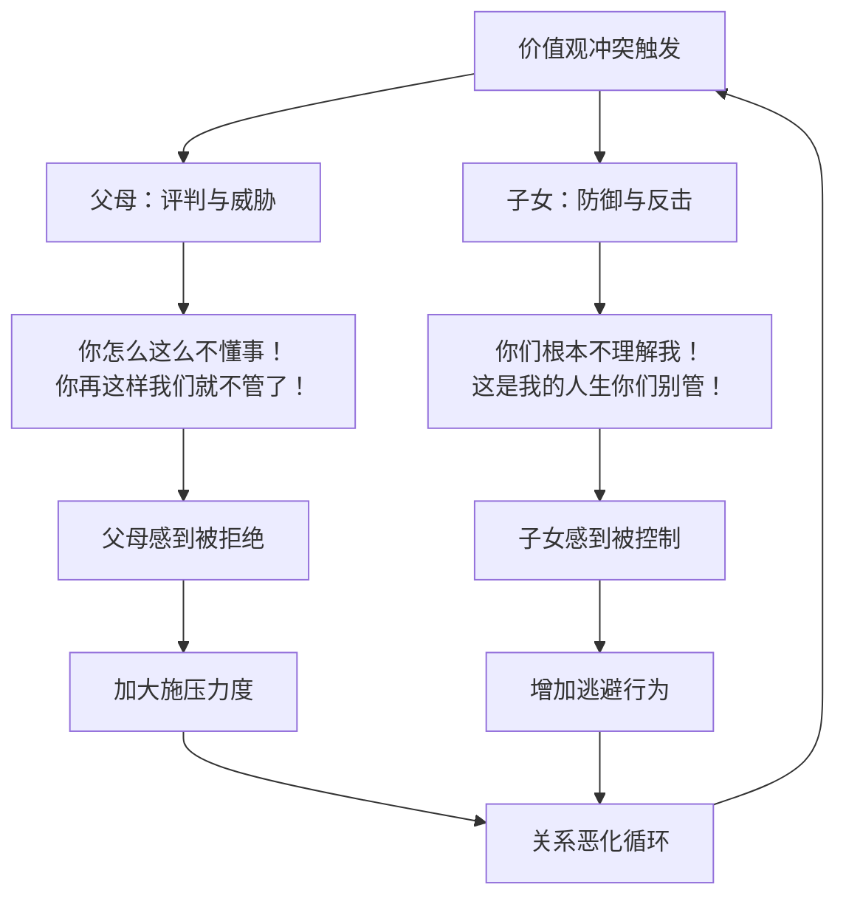
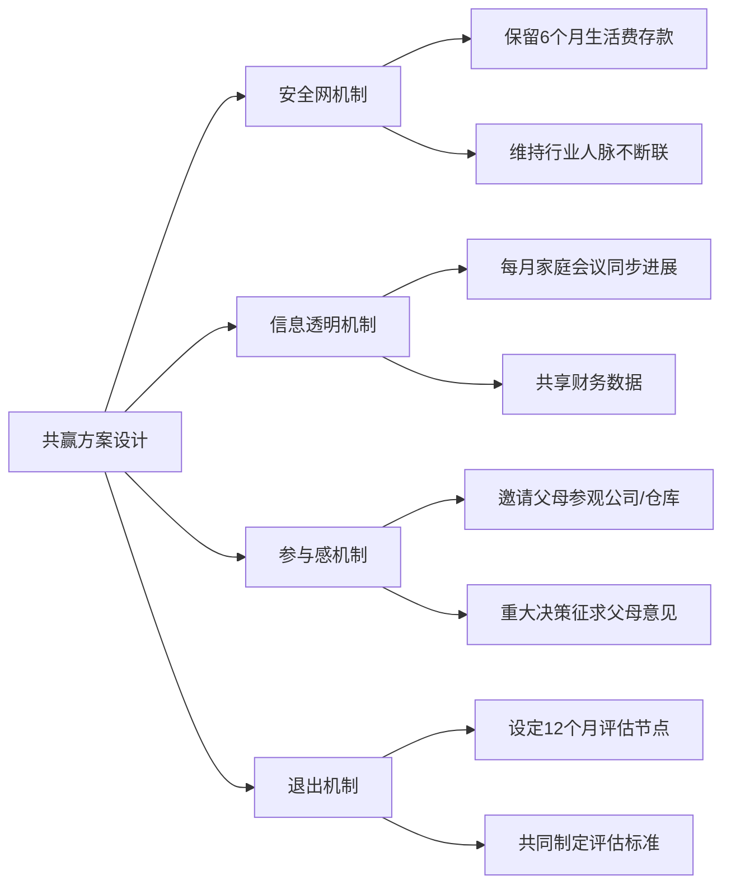

## 案例五：跨代沟通中的价值观冲突

### 案例背景

30岁的小李在一家国企工作了五年，收入稳定但缺乏成长空间。经过半年的市场调研和商业计划准备，他决定辞职创业做跨境电商。然而，当他在家庭聚餐中提出这个想法时，父亲当场变了脸色："放着好好的铁饭碗不要，你是不是疯了？"母亲则红了眼眶："我们辛辛苦苦供你上大学，不是让你去冒险的。"

此后三个月，每次回家都会爆发争吵。小李从每周回家变成了一个月一次，电话也越打越短。父亲托亲戚朋友轮番劝说，小李则在朋友圈屏蔽了所有家人。一个创业的决定，正在撕裂一个原本和睦的家庭。

这个案例的典型性在于：它不是简单的意见分歧，而是两代人基于不同历史经验、社会环境和人生哲学形成的**价值观系统性冲突**。

### 跨代价值观冲突的深层机制

#### 代际价值观差异的根源

不同世代成长于截然不同的社会环境，形成了不同的核心信念系统：

| 维度 | 父母一代（60-70后） | 子女一代（90-00后） |
|------|---------------------|---------------------|
| 核心驱动力 | 生存安全、稳定可预期 | 自我实现、意义感 |
| 对风险的态度 | 风险=危险，必须规避 | 风险=机会，可以管理 |
| 成功标准 | 有房有车、体制内稳定 | 做热爱的事、财务自由路径 |
| 信息来源 | 个人经历、熟人经验 | 互联网、多元信息渠道 |
| 对"好工作"的定义 | 国企/公务员/大厂 | 有成长性、匹配兴趣 |
| 面对不确定性的策略 | 选择确定性最高的选项 | 提升应对不确定性的能力 |

这些差异不是谁对谁错的问题，而是**不同历史条件下的适应性策略**。父母一代经历过物质匮乏、下岗潮、社会剧烈变动，"稳定"对他们来说是用血泪换来的生存智慧。子女一代成长在经济高速增长期，互联网降低了信息不对称，创业基础设施日趋完善，"冒险"的含义已经完全不同。

#### 沟通中的暴力模式分析

当价值观冲突发生时，双方很容易滑入暴力沟通模式：

**父母常见的暴力沟通模式：**

1. **道德评判**："你太自私了，只想着自己" — 将选择等同于品格缺陷
2. **威胁**："你要是辞职，以后别找我们要钱" — 用恐惧驱动服从
3. **比较**："你看看人家小王，在银行多稳定" — 否定个体独特性
4. **过度泛化**："你们这代人就是不知天高地厚" — 以偏概全的标签化

**子女常见的暴力沟通模式：**

1. **反击评判**："你们就是思想落后" — 反向标签化
2. **情感撤回**："跟你们说不通，不说了" — 关闭沟通渠道
3. **对抗性声明**："这是我的人生" — 虽然是事实，但以对抗姿态表达会激化冲突
4. **隐性攻击**：屏蔽朋友圈、减少回家、冷处理 — 被动攻击性行为

#### 核心误解：双方其实在说不同的语言

父母说"稳定"，真正表达的是：我害怕你受苦、我需要确认你安全、我担心自己老了没保障。小李说"自由"，真正表达的是：我需要被信任、我想证明自己的价值、我对现状感到窒息。

冲突的本质不是"要不要创业"，而是**安全感与自主性的需要同时被触发，双方都在用自己的方式表达爱和关心，却感受不到对方的爱**。

### NVC四步调解全流程

#### 第一步：小李的自我准备（调解前的关键步骤）

在开口沟通之前，小李需要先完成内在工作：

**识别自己的需要清单：**

- 自主性：能够自主做出人生重大决定
- 被信任：希望父母相信自己有能力判断
- 成就感：渴望在事业上有所突破
- 家庭联结：不想因为创业失去亲情
- 理解：希望被真正倾听而不是被教育

**猜测父母的需要清单：**

- 安全感：确信孩子不会陷入困境
- 被尊重：自己的经验和意见被认真对待
- 确定性：了解孩子有具体可行的计划
- 联结：不希望与孩子的关系疏远
- 责任感：作为父母有引导孩子的义务

这个预判非常重要。NVC不是单方面输出，而是**带着对对方需要的好奇和理解进入对话**。

#### 第二步：用观察启动对话

**错误示范：**
> "爸、妈，你们总是反对我，从来不支持我。"

这句话里有三个暴力元素："总是"（绝对化）、"反对"（评判）、"从来不"（过度泛化）。

**NVC观察式表达：**
> "爸、妈，上次吃饭我提到想辞职创业，你们说'放着铁饭碗不要是疯了'，之后三次电话里也都提到了让我别冲动。我想就这件事好好和你们聊聊。"

观察的核心是：**描述具体发生的行为和话语，不加评判，不推断动机**。

#### 第三步：表达感受和需要

**小李的完整NVC表达：**

> "当我听到你们说创业就是冒险、就是不务正业的时候（观察），我感到委屈和压抑（感受）。一方面，我理解你们是出于关心和担心；另一方面，我也需要被信任，需要你们能看到我这半年做的准备工作和思考（需要）。我不是一时冲动，我花了六个月调研市场、写了商业计划书、存了一年的生活费作为安全垫。我能理解你们的担心，同时我也需要在人生选择上有自主权。"

这段表达的结构拆解：

| NVC要素 | 具体内容 | 技巧说明 |
|---------|---------|---------|
| 观察 | "说创业就是冒险、就是不务正业" | 引用原话，避免概括 |
| 感受 | "委屈和压抑" | 具体命名情绪，不模糊 |
| 需要 | "被信任、被看到准备、有自主权" | 清晰表达三个层次的需要 |
| 理解 | "理解你们是出于关心" | 先共情再表达，降低防御 |

#### 第四步：引导父母表达

**引导性提问：**

> "爸，我知道你经历过那个年代的很多变化，你愿意跟我说说你最担心的是什么吗？是怕我资金不够、还是怕市场不好、还是有其他担心？"

这个提问的设计要点：
- 承认父亲的经验有价值（"经历过那个年代"）
- 用选择题而非开放式问题降低表达门槛
- 将笼统的"反对"拆解成具体的担忧点

**父亲可能的回应（NVC引导下）：**

> "儿子，我确实是担心。我93年下岗那会儿，你才三岁，你妈抱着你在家哭。我们那个年代见过太多人创业失败，妻离子散的都有。我不是不信任你的能力，是我经历过那些事，心里有阴影。我需要知道你有退路，万一不行还能回头。"

**母亲可能的回应：**

> "我主要是担心你的身体。创业哪有不熬夜的？你现在还没成家，万一累出毛病来谁照顾你？我需要知道你会好好照顾自己。"

#### 第五步：回应与确认

**小李对父亲的回应：**

> "爸，谢谢你告诉我这些。我现在理解了，你不是不相信我的能力，你是经历过那些事，害怕我也遭遇同样的困境。你需要知道我有安全网。我确实准备了：一年的生活费存款、如果创业失败回原来行业还能找到工作、每个月跟你们同步财务状况。你觉得这些能让你安心一些吗？"

**小李对母亲的回应：**

> "妈，我听到你说的了，你最担心的是我的身体。我跟你保证，我会注意作息，而且我的合伙人以前做过这行，不是我一个人扛。我每周给你打视频电话，你看看我的状态，要是觉得我太累了，我们一起想办法。"

### 创造性解决方案：满足双方需要的共赢方案

经过深度对话后，双方可以共同制定一个兼顾各方需要的方案：

**具体方案清单：**

1. **试用期制度**：给自己一年时间，第6个月和第12个月各做一次正式评估，评估标准由小李和父母共同商定（如月收入达到多少、客户数量等）
2. **安全网展示**：将存款证明、行业人脉资源、备选就业方案整理成文档给父母看
3. **定期同步**：每月最后一个周末做一次20分钟的视频通话，专门聊创业进展，用数据说话
4. **父母参与**：邀请父母参观创业项目的仓库或办公室，让他们看到真实的运营状态
5. **身体保障**：每季度做一次体检，体检报告分享给母亲
6. **情绪出口**：约定如果父母感到特别焦虑，可以直接说"我现在很担心"，而不是用批评的方式表达

### 常见误区与纠正

#### 误区一：用"独立"对抗"控制"

**错误做法**："我已经30岁了，我的事不用你们管！"

**问题**：这句话满足了自主性需要，但完全忽视了父母的联结需要和安全感需要。父母听到的是"我不需要你了"，这会激发更强烈的控制行为。

**纠正**："我理解你们想帮我把关，这说明你们在乎我。我也需要你们的支持，只是方式可以调整一下——不是帮我做决定，而是在我做决定后给我反馈和建议。"

#### 误区二：一次性说服的幻想

**错误期待**：一次深谈就彻底解决问题。

**现实**：价值观是几十年形成的，不可能一次对话就改变。NVC的目标不是让父母立刻同意，而是**建立一个可以持续对话的通道**。通常需要5-8次深度对话才能达成实质性共识。

#### 误区三：只关注"创业"本身

**错误焦点**：反复论证创业的好处、展示商业计划、用数据说服。

**问题**：父母的反对表面上是对创业的质疑，深层是对孩子安全的焦虑。如果只在"创业好不好"这个层面打转，永远无法触及真正的问题。

**纠正**：将对话焦点从"要不要创业"转移到"你的担心是什么、我能做什么让你安心"。

#### 误区四：寻求第三方"主持公道"

**错误做法**：找亲戚、朋友、甚至心理咨询师来"评理"，证明自己是对的。

**问题**：这会把对话变成辩论赛，强化"谁对谁错"的框架，而NVC的核心是"双方的需要都合理"。

**纠正**：如果需要第三方帮助，选择中立的调解人，其角色是帮助双方表达需要，而不是判断谁对谁错。

#### 误区五：用沉默表达抗议

**错误做法**：减少联系、不接电话、冷处理。

**问题**：沉默是暴力沟通的一种形式（撤回联结），它传递的信息是"你让我不高兴，所以我惩罚你"。父母会感到被抛弃和无助，可能采取更极端的干预手段。

**纠正**：如果当前情绪不适合对话，可以明确告知："我现在情绪不太好，需要冷静一下，我们周六再聊好吗？"这是暂停而非撤回。

### 进阶技巧：处理深层代际创伤

有些跨代冲突的根源不仅是价值观差异，还可能涉及代际创伤的传递：

**识别代际创伤的信号：**

- 父母的反应强度与事件本身不成比例（极度恐惧、情绪崩溃）
- 父母反复提起自己年轻时的痛苦经历
- 家族中有多次类似的冲突模式（如当年父母自己的职业选择也受到祖父母强烈反对）
- 父母的担忧超越了理性范围（如"你创业我们就不活了"）

**处理策略：**

1. **不试图"治愈"父母的创伤** — 你不是他们的治疗师
2. **承认创伤的真实性**："爸，我能感受到那件事对你影响很深"
3. **区分"过去的恐惧"和"现在的情况"**："我理解那段经历让你特别担心，我现在的环境和条件跟那时候不太一样，你愿意看看吗？"
4. **建议专业帮助**：如果创伤严重影响了家庭关系，可以温和建议家庭咨询

### 不同场景的NVC话术模板

#### 场景一：父母发动亲戚轮番劝说

> "三叔，谢谢你关心我的事。我知道你和我爸是为我好。我现在想先和我爸直接沟通，了解他具体的担心，这样对解决问题更有帮助。你能帮我跟爸说，我想找个时间和他单独好好聊聊吗？"

#### 场景二：父母以断绝关系相威胁

> "爸，我听到你说如果你辞职就不认我这个儿子。我感到很难过，因为我非常重视和你的关系。我知道你不是真的想断绝关系，你是因为太担心了才这么说的。我们能不能先不谈辞职的事，聊聊你最担心的是什么？"

#### 场景三：已经创业失败，父母说"早告诉你了"

> "爸、妈，你们说的没错，这次确实没成功。我现在需要你们的支持。我知道你们想说当初的建议是对的，但此刻我更需要的是'没关系，我们相信你能站起来'。你们能给我这个支持吗？"

### 案例后续：小李一家的转变

经过五次家庭对话后，小李和父母达成了共识。小李按计划辞职创业，第一个月就带着父亲去参观了仓库。父亲虽然嘴上还是说"小心点"，但开始主动问"生意怎么样"。母亲每周和小李视频，看到他精神状态不错，也逐渐放下了心。

一年后，小李的跨境电商项目月营收突破了5万元。在家庭聚餐上，父亲端起酒杯说了一句话："儿子，爸以前是怕你受苦。现在看来，你比我想的能干。"

小李说，那一刻他流泪了——不是因为被认可，而是因为他终于听到父亲说出了藏在"反对"背后的那句话：**我只是怕你受苦**。

这就是NVC的力量：它不改变冲突的事实，但它让冲突双方听到彼此的心声。

***

> **本案例核心要点**：跨代价值观冲突的本质不是"谁对谁错"，而是不同时代背景下的需要差异。NVC的关键不在于说服对方接受你的选择，而在于创造一个双方都能安全表达真实需要的空间。当你听到父母的"反对"背后的"我怕你受苦"，当你表达的"我要自由"背后的"我需要被信任"——对话才真正开始。
