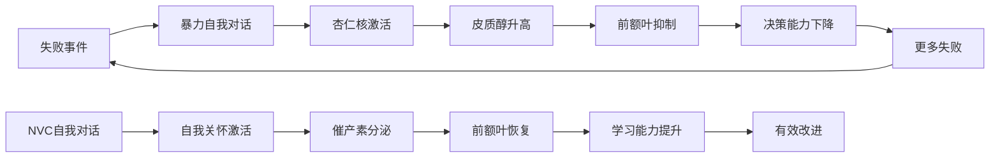
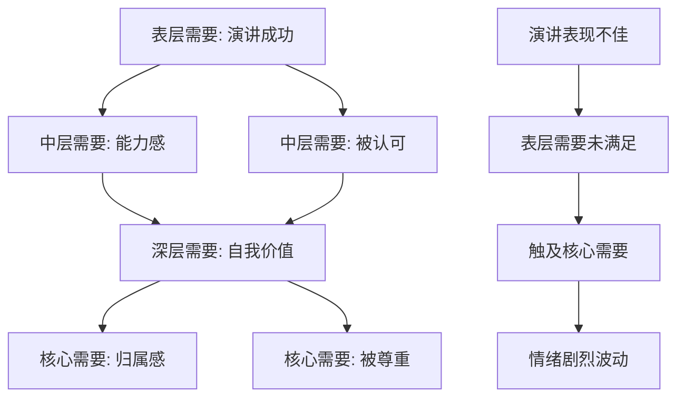

## 案例六：自我对话中的NVC应用

> "对别人说狠话，你会道歉；对自己说狠话，你却觉得是'实话'。"
> —— 大多数人对待自己的方式，远比对待陌生人残忍。

非暴力沟通最被忽视的应用场景，恰恰是最日常、最持久、最难以觉察的——**与自己的对话**。我们每天与自己产生的内心独白，比与任何人的对话都多。当这些独白充满暴力，伤害是 24 小时不间断的。

### 一、为什么自我对话是NVC的核心战场

#### 1.1 自我对话的规模与影响

心理学研究表明，人类每天大约产生 **6,000-70,000 个念头**，其中约 **80% 是消极的**（National Science Foundation, 2005）。这意味着我们每天可能在内心对自己说 5,000-56,000 句负面的话——远超我们对任何外部人说过的暴力语言。

| 维度 | 对外暴力沟通 | 对内暴力沟通 |
|------|-------------|-------------|
| 频率 | 偶发，可回避 | 持续，无处可逃 |
| 觉察度 | 容易觉察 | 极难觉察（已成习惯） |
| 伤害深度 | 外部评价，可质疑 | 自我评价，深信不疑 |
| 反弹机会 | 对方可以反驳 | 没有"另一个声音"平衡 |
| 长期后果 | 关系破裂 | 自我价值感崩塌 |

#### 1.2 暴力自我对话的神经科学基础

当我们对自己说"我太差了""我是个失败者"时，大脑的**杏仁核**会像面对真实威胁一样被激活，触发**战斗-逃跑-冻结**反应。皮质醇（压力激素）水平上升，而**前额叶皮层**（负责理性思考和规划）的功能被抑制。

换句话说：**自我批评不仅不能让你"更努力"，反而会让你的大脑进入生存模式，降低学习和改进的能力。**



#### 1.3 暴力自我对话的常见模式

识别模式是改变的第一步。以下是六种最典型的暴力自我对话模式：

**模式一：全盘否定型**
- 内心独白："我就是个废物。""我什么都做不好。"
- 逻辑缺陷：用单一事件推翻整个人格
- 真相：一次表现不佳 ≠ 你这个人的价值

**模式二：灾难化型**
- 内心独白："这次搞砸了，我的人生完了。""所有人都会看不起我。"
- 逻辑缺陷：把单一事件的后果无限放大
- 真相：大多数"灾难"在一周后就不再是灾难

**模式三：应该型**
- 内心独白："我应该做得更好。""我不应该犯这种错误。"
- 逻辑缺陷：用完美主义标准审判自己
- 真相："应该"是对现实的否认，而非推动进步

**模式四：读心术型**
- 内心独白："他们一定觉得我很蠢。""老板肯定对我失望了。"
- 逻辑缺陷：未经验证就假定他人的负面评价
- 真相：你不是读心者，别人的内心你无法确定

**模式五：情绪等同事实型**
- 内心独白："我觉得自己很差，所以我一定很差。"
- 逻辑缺陷：把暂时的情绪状态当作永恒的事实
- 真相：情绪是信号，不是判决

**模式六：自我诅咒型**
- 内心独白："我永远都学不会。""我这辈子就这样了。"
- 逻辑缺陷：用永久性语言锁定未来
- 真相：你无法预测未来，也不应该用现在否定未来

### 二、案例重现：一场演讲后的自我风暴

#### 2.1 场景设定

小张，28岁，技术部门工程师。在公司季度汇报会上做了 15 分钟的技术方案演讲。这是他第一次在 50 人以上的场合做正式汇报。

演讲后的情况：
- 有三次忘词，最长一次停顿约 8 秒
- 两次语速过快，部分技术细节讲得不清楚
- 超时了 3 分钟，最后三个要点没有展开
- 会后收到的反馈：有人说"挺好的"，有人说"内容有点赶"
- 领导没有特别评论

#### 2.2 暴力自我对话（原版）

> "我太差了！这么简单的演讲都做不好！我就是个失败者！以后再也不要在公众面前讲话了！"

这段自我对话包含了至少四种暴力模式：

| 暴力模式 | 对应语句 | 问题 |
|---------|---------|------|
| 全盘否定 | "我太差了""我就是个失败者" | 用一次表现否定全部自我 |
| 灾难化 | 暗示这是不可接受的灾难 | 夸大了实际后果 |
| 情绪等事实 | "做不好"作为确定结论 | 混淆了感受和客观评价 |
| 自我诅咒 | "以后再也不要在公众面前讲话了" | 用永久性决定封闭成长路径 |

#### 2.3 NVC四要素自我对话（转化版）

**第一步：观察——只描述事实，不加评判**

> "今天演讲时，我有三次忘词，两次语速过快，结束时还有三分钟的内容没有讲完。"

关键技巧：
- ✅ "三次忘词"（具体数量）而非"总是忘词"（泛化）
- ✅ "语速过快"（可观察行为）而非"讲得很烂"（主观评价）
- ✅ "三分钟没讲完"（客观事实）而非"完全超时"（情绪化夸张）

训练方法：想象自己是一台摄像机，只记录画面，不加旁白。

**第二步：感受——诚实面对内心体验**

> "我感到失望、尴尬和沮丧。"

区分感受与想法：

| 感受（NVC允许） | 伪装成感受的想法（NVC识别） |
|----------------|--------------------------|
| 失望 | 我觉得自己很差 |
| 尴尬 | 我觉得别人在嘲笑我 |
| 沮丧 | 我觉得自己不配做演讲 |
| 紧张 | 我觉得这次搞砸了 |
| 羞愧 | 我是个不合格的工程师 |

> **判断标准：** 如果这句话可以加上"我觉得……"前缀而不改变含义，那它很可能是一个想法而非感受。真正的感受是身体可以直接体验的——心率加快、胃部收紧、肩膀绷紧、手心出汗。

**第三步：需要——找到感受背后的根源**

> "我需要成长、被认可和自信。"

这是最核心也最容易被跳过的一步。暴力自我对话之所以有破坏力，是因为它**切断了你与自身需要的连接**——你只顾着骂自己，却不知道自己真正想要什么。

深入挖掘小张的需要层次：



| 层级 | 需要 | 是否被满足 | 说明 |
|------|------|-----------|------|
| 表层 | 流畅完成演讲 | 部分满足 | 60%内容讲完，有三次中断 |
| 中层 | 展示专业能力 | 大部分满足 | 技术内容本身是扎实的 |
| 深层 | 被同事和领导认可 | 不确定 | 反馈模糊，领导未表态 |
| 核心 | 感到自己有价值 | 被威胁 | 被自我批评全面否定 |

**第四步：自我请求——具体的、可行的、积极的行动**

> "我愿意接受这次不完美的表现，把它当作学习机会。我愿意在下次演讲前做更充分的准备和练习。我愿意对自己更温柔一些。"

NVC 请求与命令的区别同样适用于自我对话：

| 自我命令（暴力） | 自我请求（NVC） |
|-----------------|----------------|
| "你必须下次做到完美" | "我愿意在下次多练习几遍" |
| "不准再犯这种错误" | "我愿意找到具体的改进点" |
| "你要更努力" | "我愿意为这个技能投入更多时间" |
| "你永远都不许再演讲了" | "我愿意在小场合先练练手" |

请求的关键特征：
- **具体**：不是"做得更好"，而是"在镜子前完整练习三遍"
- **可行**：不是"从此不再紧张"，而是"学习三个缓解紧张的技巧"
- **积极**：不是"不要忘词"，而是"用提词卡辅助关键段落"
- **可选**：允许自己做不到，不是对自己的又一个枷锁

### 三、完整的自我对话转化流程

#### 3.1 第一觉察：识别暴力信号

当内心出现以下信号时，暂停，觉察暴力自我对话正在发生：

| 信号类型 | 具体表现 |
|---------|---------|
| 语言信号 | "总是""从不""永远""就是""根本" |
| 情绪信号 | 强烈的羞耻感、无价值感、绝望感 |
| 身体信号 | 胸口发紧、胃部下沉、肩膀僵硬 |
| 行为信号 | 回避社交、拖延、过度补偿 |

#### 3.2 第二暂停：切断自动反应

觉察到暴力信号后，不要急于"想开"或"积极思考"。先暂停：

**STOP 技术：**
- **S**（Stop）：在内心喊"停"
- **T**（Take a breath）：深呼吸三次，注意力放在呼吸上
- **O**（Observe）：观察此刻的身体感受和情绪
- **P**（Proceed）：带着觉察继续，选择用NVC方式回应自己

#### 3.3 第三转化：四要素逐一对话

以小张的完整转化过程为例：

【原始声音】"我太差了！这么简单的演讲都做不好！"

【观察层转化】
→ 等一下，我具体做得"不好"的地方是什么？
→ 三次忘词，两次语速过快，超时三分钟。
→ "太差了"和"做不好"——这些是事实还是评判？

【感受层转化】
→ 我现在的真实感受是什么？
→ 失望——因为对自己有期望
→ 尴尬——因为在同事面前表现不佳
→ 恐惧——害怕领导和同事的评价
→ 羞耻——觉得暴露了能力不足

【需要层转化】
→ 这些感受指向我什么样的需要？
→ 失望 → 需要能力感、成长
→ 尴尬 → 需要尊严、被尊重
→ 恐惧 → 需要安全感、被接纳
→ 羞耻 → 需要被认可、归属感

→ 这些需要本身有什么问题吗？
→ 没有。需要成长、尊严、安全感，都是正当的人类需要。
→ 需要没有被满足，不代表需要本身不合理。

【请求层转化】
→ 我现在可以为自己做什么？
→ 短期：接受这次不完美的表现，不反复回放尴尬瞬间
→ 中期：列出具体的改进点，制定下次演讲的准备清单
→ 长期：加入演讲练习社群，系统提升公众表达能力
→ 此刻：对自己说一句温柔的话，就像对一位同样遭遇的朋友说的那样

#### 3.4 第四自我宽慰：用朋友视角取代审判者视角

> "每个人都会有表现不好的时候。这次经历让我知道了需要改进的地方。我的价值不是由一次演讲决定的。我正在学习和成长的路上。"

**"好朋友测试"：** 如果你最好的朋友经历了同样的事情，你会对 TA 说什么？

| 你对自己说的话 | 你会对好朋友说的话 |
|--------------|-----------------|
| "你太差了" | "这次确实不太顺利，没关系" |
| "你就是个失败者" | "你已经很勇敢了，第一次做这种演讲" |
| "以后别再讲了" | "这次经验很宝贵，下次会更好" |
| "所有人都在笑你" | "大多数人其实根本没注意到" |

如果你不会对好朋友说这些话，为什么要对自己说？

#### 3.5 第五整合：从自责到学习

NVC自我对话不是"自我安慰"或"自我欺骗"。它的目标不是让你觉得"其实挺好的"，而是**从自责中解放出认知资源，用于真正的学习和改进**。

转化后的小张制定了具体的改进计划：

| 具体问题 | 根本原因 | 改进行动 | 时间线 |
|---------|---------|---------|--------|
| 三次忘词 | 内容记忆不牢靠 | 制作结构化提词卡，每张不超过5个关键词 | 下次演讲前 |
| 语速过快 | 紧张导致的无意识行为 | 在提词卡上标注"慢""停顿""深呼吸" | 下次演讲前 |
| 超时三分钟 | 内容过多，未精简 | 严格按时间排练，砍掉30%的内容 | 准备阶段 |
| 整体紧张 | 缺乏大型场合经验 | 先在10人以下的会议中多发言 | 持续3个月 |

### 四、进阶：自我对话中的NVC高级技巧

#### 4.1 "内在批评者"对话法

你的"内在批评者"不是敌人。它是一个**用错误方式保护你的部分**。它说"你太差了"，其实想表达的是"我很害怕你再次受伤"。

与内在批评者的对话流程：

你：我注意到你在说我"太差了"。
批评者：因为你就是做得不好！
你：我听到你了。你这么严厉，是因为你在担心什么？
批评者：我担心别人看不起你，担心你失去机会。
你：所以你其实是想保护我？
批评者：……是的。我不想你再受伤。
你：谢谢你想保护我。你的担心我收到了。
    但现在，你的批评让我更受伤了。
    我们能换个方式吗？比如帮我找到具体可以改进的地方？
批评者：……好。你忘词是因为准备不够。
你：谢谢你。这个建议很有用。我会在下次多练习几遍。

这种对话的核心是：**不消灭内在批评者，而是把它从"审判者"转化为"顾问"。**

#### 4.2 自我同情的三个组成部分（Kristin Neff 理论）

心理学家 Kristin Neff 的研究表明，自我同情包含三个相互关联的要素：

**（1）自我友善（Self-kindness）**
- 对待自己像对待正在受苦的朋友
- 用温暖和理解回应自己的失败
- 替代自我批评和自我惩罚

**（2）共同人性感（Common Humanity）**
- 认识到不完美是人类的共同体验
- 你的失败不是"证明你与众不同"的证据
- 与全人类连接，而非孤立自己的痛苦

**（3）正念（Mindfulness）**
- 觉察到痛苦，但不被它吞噬
- 既不否认感受，也不过度认同
- 保持平衡的觉察视角

将这三个要素融入NVC自我对话：

自我友善 → 对应NVC的"感受"和"需要"步骤（允许感受存在，肯定需要正当性）
共同人性 → 融入每个步骤的背景认知（"每个人都会经历这个"）
正念 → 贯穿全程的觉察能力（"我注意到我在批评自己"）

#### 4.3 书写练习：自我对话NVC日记

当内心的声音太过嘈杂，口头上难以理清时，书写是更有效的方法。

**模板：**

```markdown
## 日期：____
## 触发事件：____

### 第一部分：原始自我对话（不加过滤，全部写下来）
"____"

### 第二部分：NVC四要素转化

**观察（摄像机视角）：**
发生了什么？只写可以被第三方观察到的事实。
"____"

**感受（身体信号清单）：**
此刻我的身体感受到什么？
- [ ] 失望  [ ] 尴尬  [ ] 焦虑  [ ] 恐惧
- [ ] 羞耻  [ ] 沮丧  [ ] 愤怒  [ ] 悲伤
- [ ] 其他：____

**需要（深层挖掘）：**
这些感受指向什么需要？
- 表层需要：____
- 深层需要：____
- 核心需要：____

**自我请求（具体行动）：**
我现在可以为自己做什么？
- 短期（今天）：____
- 中期（本周）：____
- 长期（本月）：____

### 第三部分：自我宽慰
如果最好的朋友经历了同样的事，我会对TA说什么？
"____"

### 第四部分：学习与成长
这次经历教会了我什么？下次我可以怎样做得不同？
"____"
```

#### 4.4 日常自我对话的NVC微型练习

不需要等到"重大事件"才使用NVC。日常小事是最好的练习场：

| 场景 | 暴力自我对话 | NVC自我对话微型版 |
|------|------------|-----------------|
| 闹钟响了不想起 | "你怎么这么懒" | "我需要休息。今天我能给自己多10分钟吗？" |
| 忘记回消息 | "你太不负责任了" | "我需要把事情处理好。现在回复还来得及。" |
| 做饭烧焦了 | "你连饭都做不好" | "我需要学习火候控制。下次我试试定时器。" |
| 工作中犯错 | "你就是不行" | "我需要能力感。这个错误教了我什么？" |
| 和人起冲突 | "都是你的错" | "我需要被理解。我刚才的感受是什么？" |
| 体重秤上数字 | "你太胖了太丑了" | "我需要健康和自我接纳。今天我能为自己做一件善事吗？" |

### 五、常见误区与纠正

#### 误区一："NVC自我对话就是自我安慰、阿Q精神"

**纠正：** NVC不是让你"想开点"或"觉得一切都没问题"。它是让你**更准确地理解发生了什么、感受了什么、需要什么，然后采取有效行动**。阿Q精神是逃避现实；NVC是直面现实，但用不伤害自己的方式。

| 阿Q精神 | NVC自我对话 |
|--------|-----------|
| "其实也没什么" | "这次确实做得不够好，我承认" |
| "是别人的问题" | "我对自己负责，但不等于要惩罚自己" |
| "想多了" | "我的感受是真实的，值得被倾听" |

#### 误区二："对自己严厉才能进步"

**纠正：** 研究明确表明，自我同情比自我批评更能促进持久的改变（Breines & Chen, 2012）。自我批评制造羞耻感，羞耻感让人逃避和退缩；自我同情创造安全感，安全感让人敢于面对不足并寻求改进。

#### 误区三："我在做NVC了，为什么还是难受？"

**纠正：** NVC不是情绪开关。转化后的感受不会立刻消失——失望还是会失望，尴尬还是会尴尬。区别在于：你不再为"感到失望"而再叠加一层"我不应该失望"的自我批评。感受的层次变少了，强度自然降低。

#### 误区四："自我对话不用练习，想一想就行了"

**纠正：** 暴力自我对话模式是几十年形成的神经通路。改变它需要刻意练习，就像健身一样。没有人看了一本健身书就长出肌肉——你也不会做了一次NVC自我对话就改变了思维模式。建议每天至少做一次微型练习，持续 21 天形成初步习惯。

#### 误区五："NVC只在事后反思时有用"

**纠正：** 初期确实适合在事后用书写方式做转化。但随着练习深入，你会发展出**实时觉察**能力——在暴力自我对话刚发生时就识别并转化。最终目标是让NVC成为默认的自我对话方式。

### 六、NVC自我对话的长期实践路径

| 阶段 | 时间 | 目标 | 方法 |
|------|------|------|------|
| 觉察期 | 第1-2周 | 只识别，不改变 | 每天记录3次暴力自我对话，不做任何转化 |
| 转化期 | 第3-6周 | 学习并练习四要素 | 选1次暴力自我对话做完整的NVC书写转化 |
| 内化期 | 第7-12周 | 口头实时转化 | 事件发生后30分钟内完成内心NVC对话 |
| 自动期 | 第13周起 | 默认模式切换 | 暴力自我对话频率显著下降，NVC成为自然反应 |

### 七、本案例的核心启示

1. **自我对话是NVC最重要的应用场景**——你与自己的关系是一切关系的基础
2. **暴力自我对话不是"真实"**——它是扭曲的、以偏概全的、不符合NVC原则的
3. **NVC自我对话不是自我安慰**——它是更准确的自我认知和更有效的行动路径
4. **内在批评者不是敌人**——它是用错误方式保护你的部分，可以被转化为顾问
5. **改变需要练习**——21天形成初步习惯，3个月形成稳定模式
6. **小处练习，大处受益**——日常小事是最好的训练场
