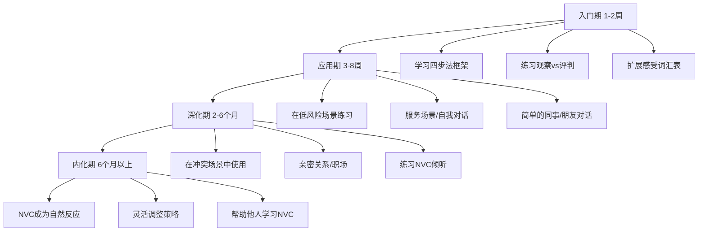

## 实战案例总结与模式提炼

九个案例横跨亲密关系、职场上下级、亲子教育、同事协作、跨代沟通、自我对话、服务场景、社交媒体和团队会议，几乎覆盖了普通人日常生活中会遇到的全部沟通场景。本节不是简单地罗列要点，而是从这些案例中提炼出可复用的模式、规律和方法论，帮助读者在遇到新场景时能够自主分析和应对。

---

### 一、九类场景的全景对照

将所有案例的核心要素汇总，可以清晰地看到NVC在不同场景中的适用方式和调整策略：

| 场景 | 核心冲突类型 | 权力关系 | NVC切入点 | 最大难点 |
|------|------------|---------|----------|---------|
| 亲密关系 | 日常积累的不满 | 平等 | 观察+感受的直接表达 | 情绪积累导致"翻旧账" |
| 职场上下级 | 反馈失真与归因偏差 | 不对等 | 在专业框架内表达感受和需要 | 下属表达受限，上级习惯性评判 |
| 亲子教育 | 控制与自主的博弈 | 不对等（逐渐转变） | 理解发展需要，区分关心与控制 | 家长的恐惧驱动和文化惯性 |
| 同事协作 | 信任破裂与责任推诿 | 平等（但有竞争） | 先修复关系再解决问题 | "面子"文化阻碍直接对话 |
| 跨代沟通 | 价值观差异与代际期望 | 不对等（子女视角） | 找到共同需要（幸福、安全） | 根深蒂固的信念体系 |
| 自我对话 | 自我批评与完美主义 | —— | 将NVC四步法转向内在 | 习惯性自我否定的自动化模式 |
| 服务场景 | 服务期望落差 | 平等（消费者视角） | 简洁的观察+请求 | 对方可能情绪化或防御 |
| 社交媒体 | 公开场域的攻击与误解 | 弱关系 | 转私域+猜测善意 | 文字缺乏语气，容易误读 |
| 团队会议 | 观点分歧与话语权不均 | 平等（但有隐性等级） | 从评判转向好奇和探索 | 群体压力导致沉默或攻击 |

---

### 二、跨场景的六大核心规律

#### 规律一：暴力沟通的底层结构惊人一致

无论场景如何变化，暴力沟通都遵循同一个模式：

这个循环的**断裂点**始终在B——评判性解读。NVC的观察步骤本质上就是训练我们跳过B，直接从A到感受和需要，从而避免整个恶性循环的启动。

在案例一（亲密关系）中，小美从"你从来不做家务"（评判）转换为"这周我做了六天的晚饭和清洁"（观察），循环就被打断了。在案例四（同事）中，小林从"小王太不地道了"（评判）转换为"我注意到你在客户会议上提到了技术实现的问题"（观察），对话方向就完全不同了。

#### 规律二：感受是连接事件与需要的桥梁，不可省略

九个案例中，每一个有效的NVC表达都包含感受环节。这不是形式主义——感受是将客观事件与主观需要连接起来的关键节点。

省略感受的后果：
- **只说观察+需要**："这周我做了六天家务，我需要分担"——听起来像任务分配，缺乏情感连接
- **只说观察+请求**："这周我做了六天家务，你愿意分担吗"——对方可能不知道你的真实感受，响应动力不足
- **完整表达**："这周我做了六天家务，我感到疲惫和委屈，因为我需要分担和支持"——对方既了解事实，又感受到你的情绪状态，同时理解了深层原因

感受词汇的选择也有讲究。在职场场景（案例二）中，用"困惑""关切"比用"愤怒""委屈"更容易被接受；在亲密关系中（案例一），直接表达"疲惫""委屈"反而更真诚，有助于建立情感连接。

#### 规律三：需要是所有冲突的共同地基

这是九个案例中反复验证的最重要发现。表面上对立的双方，在需要层面往往高度重合：

| 案例 | 表面冲突 | 共同需要 |
|------|---------|---------|
| 亲密关系 | 家务分配不公平 | 和谐、相互支持、亲密连接 |
| 职场上下级 | 方案反复被退 | 项目成功、专业成长、被尊重 |
| 亲子教育 | 孩子要去乐队排练 | 安全、成长、被信任、快乐 |
| 同事协作 | 甩锅推责 | 公平、信任、团队成功 |
| 跨代沟通 | 辞职创业 | 幸福、安全、成就感、被理解 |
| 自我对话 | 演讲表现不佳 | 成长、被认可、自信 |

当对话停留在策略层面（"你应该多做家务""你应该好好学习"），冲突是零和博弈。当对话下沉到需要层面，双方会发现自己其实在追求同样的东西，只是实现路径不同。

#### 规律四：请求的质量决定NVC的成败

请求是NVC四步法的收尾，也是最容易出错的环节。从案例中可以总结出好请求的四个特征：

1. **具体**："你愿意每周承担三天的晚饭任务吗"比"你能多帮帮我吗"更容易执行
2. **正向**：说"我希望你能提前告诉我变更"比"你不要再临时改需求"更容易被接受
3. **可选择**：用"你愿意……吗"而非"你必须"，保留对方的自主权
4. **有弹性**：提供备选方案，如"或者我们一起想想其他分工方式"

常见的请求误区：

| 误区 | 示例 | 问题所在 |
|------|------|---------|
| 模糊请求 | "你能不能对我好一点" | 对方不知道具体该做什么 |
| 否定式请求 | "你不要再迟到" | 没有说明希望什么行为替代 |
| 伪装的要求 | "你最好道歉" | 用请求的语气包装命令 |
| 一次性大请求 | "从今天起你负责所有家务" | 幅度过大，对方难以接受 |
| 附加条件的请求 | "你道歉我就原谅你" | 变成了交换条件而非真诚请求 |

#### 规律五：NVC倾听与NVC表达同等重要

案例一中小刚的NVC倾听、案例五中父亲的NVC回应、案例九中小马的回应，都展示了倾听的力量。NVC倾听不是被动地听，而是主动地确认和反馈：

NVC倾听的三层结构：
┌─────────────────────────────────────┐
│ 第一层：听到事实（观察）              │
│ → "我听到你说这周做了六天家务"        │
├─────────────────────────────────────┤
│ 第二层：听到情感（感受确认）          │
│ → "你感到疲惫和委屈"                 │
├─────────────────────────────────────┤
│ 第三层：听到渴望（需要反馈）          │
│ → "你需要分担和支持"                 │
└─────────────────────────────────────┘

当对方感受到自己被真正听见时，防御心理会显著降低，对话就从对抗转向了合作。

#### 规律六：自我对话是NVC的基础训练场

案例六揭示了一个常被忽视的事实：我们与自己的对话模式决定了我们与他人对话的上限。一个习惯对自己说"我太差了"的人，很难对他人做到真正的非暴力。

NVC自我对话的特殊价值在于：
- **零社交风险**：练习不需要对方配合，随时随地可以进行
- **即时反馈**：你能直接感受到自我对话对自己情绪状态的影响
- **培养觉察力**：观察自己的内心独白，是一切NVC能力的基础
- **打破自动化模式**：大多数暴力自我对话是无意识的，觉察本身就是改变

---

### 三、场景转换的关键调整策略

NVC四步法（观察-感受-需要-请求）是通用框架，但在不同场景中需要灵活调整。以下是每个场景的关键调整点：

#### 3.1 权力不对等场景（职场、亲子、跨代）

当你是权力关系中的弱势方时：
- **观察**要更精确，用数据和事实而非感受性描述
- **感受**用职业化/中性词汇："困惑""关切"优于"愤怒""委屈"
- **需要**与对方的需要挂钩："为了项目按时交付，我需要更明确的方向"
- **请求**更具体、更小步："你愿意花10分钟和我确认一下优先级吗"

当你是权力关系中的强势方时：
- **主动创造安全空间**："我想听听你的真实想法，不会因为不同意见而影响对你的评价"
- **先倾听再表达**：让对方先说完，用NVC倾听确认理解
- **展示脆弱**："我也有不确定的时候"比"我已经决定了"更能激发真诚对话

#### 3.2 平等关系场景（同事、朋友、伴侣）

- **直接表达感受**是被允许的，甚至是最有效的
- **双向NVC**：不要只自己说，也邀请对方用同样的方式表达
- **共同探索解决方案**：不是一方说服另一方，而是一起找到满足双方需要的策略

#### 3.3 公共/弱关系场景（服务、社交媒体、陌生人）

- **保持简洁**：四步法可以压缩为两步——观察+请求
- **控制情绪表达的分寸**：太多感受表达在弱关系中反而显得突兀
- **猜测善意**：在不确定对方意图时，选择善意的解读
- **选择私域沟通**：公开场合的NVC容易被围观者影响，转为私下对话更有效

---

### 四、从案例中提炼的常见陷阱

#### 陷阱一：机械套用四步法

NVC不是填空题。"我观察到……我感到……因为我需要……你愿意……"这个句式只是入门支架，不是最终形态。真实的NVC对话是流动的——你可能在表达需要时先听对方说了一段，也可能在请求环节发现需要回溯到观察重新澄清。

案例中小刚的回应就展示了这种灵活性：他先确认理解小美的表达，再分享自己的观察和感受，最后提出创造性方案。整个过程自然流畅，没有机械地按四步走。

#### 陷阱二：把NVC当成说服工具

NVC的目的不是让对方按照你的意愿行事，而是建立真诚的连接，在此基础上找到满足双方需要的方案。如果你用NVC的句式包装自己的要求，对方会感觉到操控，效果反而比直接说更差。

检验标准：你提出请求时，是否真心接受对方说"不"？如果你内心认为对方"必须"同意，那就不是真正的请求，而是要求。

#### 陷阱三：忽视文化语境

案例五（跨代沟通）和案例八（社交媒体）都暗示了一个问题：NVC诞生于西方个人主义文化背景，在中国的关系型、面子文化中有特殊的适用挑战。

具体表现：
- 直接表达感受在某些关系中被视为"不懂事"或"矫情"
- "需要"的概念在集体主义文化中可能被解读为"自私"
- 对长辈使用NVC需要更多的尊重框架和间接表达
- 在职场中，下级对上级的NVC需要更加策略性的包装

解决方案不是放弃NVC，而是将NVC的精神（真诚、尊重、需要导向）融入本土的表达习惯中。

#### 陷阱四：期待即时效果

NVC是一种沟通能力，不是一次性的技巧。就像学习一门外语，初期会感到生硬和不自然，甚至可能因为"半生不熟"而产生新的误解。这是正常的。从暴力语言转向非暴力语言，需要至少3-6个月的持续练习才能形成新的自动化反应。

案例中展示的都是"成功"的NVC应用，但现实中的练习过程远比这复杂——你可能会在愤怒时忘记使用NVC，可能会在使用NVC时被对方误解，可能会在关键时刻退回到旧模式。这些都是学习曲线的一部分。

#### 陷阱五：只对他人使用NVC，不对自己

案例六（自我对话）揭示的这个陷阱非常普遍。很多人学会了用NVC对待伴侣、同事、孩子，却继续用暴力语言对待自己。这不仅造成内在痛苦，还会削弱你对他人使用NVC的能力——因为你无法真诚地给予自己没有的东西。

---

### 五、从入门到精通的成长路径

根据九个案例的难度和所需技能，可以规划出清晰的成长路径：

| 阶段 | 时间跨度 | 核心能力 | 对应案例难度 | 常见挑战 |
|------|---------|---------|------------|---------|
| 入门期 | 1-2周 | 区分观察与评判，识别基本感受和需要 | 案例六、案例八 | 觉得NVC"太刻意""不自然" |
| 应用期 | 3-8周 | 在低风险场景中完整使用四步法 | 案例七、案例九 | 有时忘记使用，退回到旧模式 |
| 深化期 | 2-6个月 | 在情绪激烈的冲突中保持NVC | 案例一、案例四、案例五 | 被情绪淹没时无法冷静表达 |
| 内化期 | 6个月以上 | NVC成为默认反应，灵活应变 | 案例二、案例三 | 能够帮助他人，但偶尔仍会"失手" |

---

### 六、核心启示：NVC改变的不只是沟通方式

回顾全部案例，最深层的启示是：NVC改变的不仅仅是"怎么说"，而是"怎么看世界"。

当我们学会区分观察与评判，我们开始看到真实发生的事情，而非自己编造的故事。当我们学会识别感受，我们开始与自己的情绪和平共处，而非被情绪控制。当我们学会追溯需要，我们开始理解所有人——包括那些让我们愤怒的人——都在试图满足某些合理的需要。当我们学会提出真正的请求，我们开始尊重他人的自主权，同时也更清晰地表达自己。

这种转变的效果是连锁的：
- **自我关系改善**：从自我攻击转向自我关怀
- **亲密关系深化**：从表面和谐转向真诚连接
- **职场效能提升**：从低效冲突转向建设性对话
- **社会关系扩展**：从防御性社交转向开放性连接

NVC不是万能药。它无法解决所有冲突，无法改变不愿改变的人，无法替代专业心理治疗。但它提供了一套可靠的框架，让我们在面对沟通困境时有了清晰的方向——回到事实、回到感受、回到需要、回到请求。

这九个案例是起点，不是终点。真正的NVC实践，从你走出这些文字、回到真实生活的那一刻开始。

***

