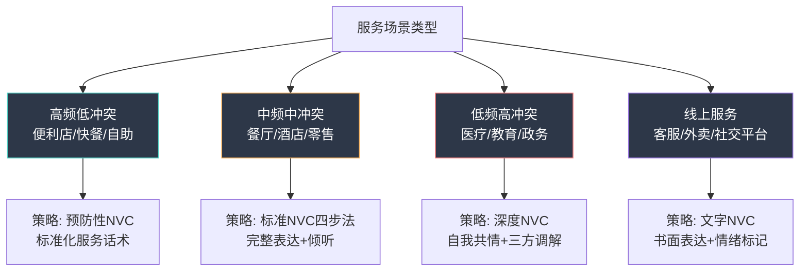
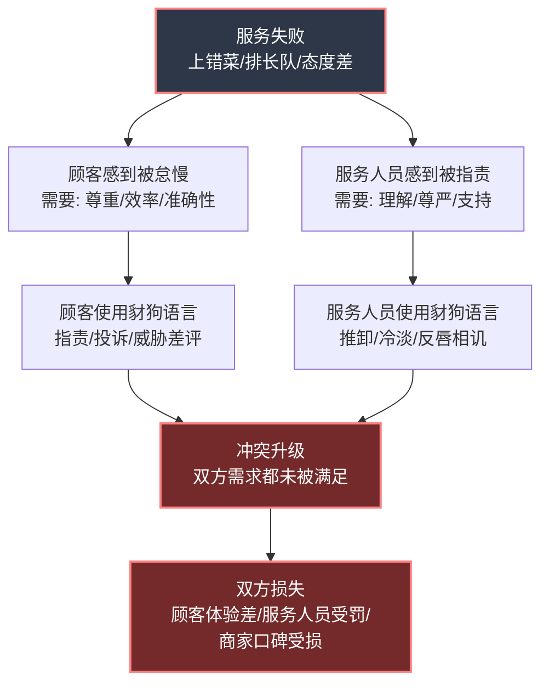
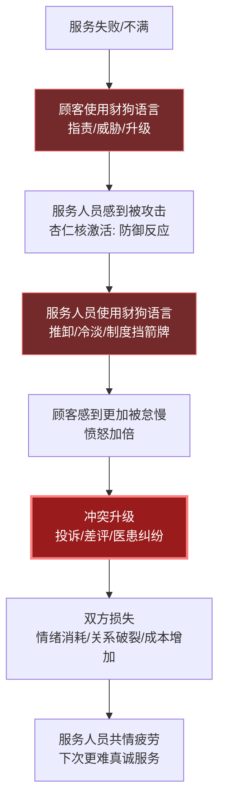
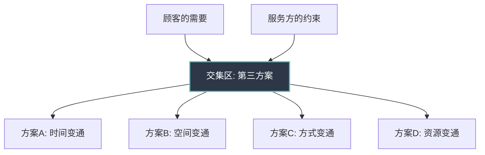

## 案例七：服务场景中的NVC应用

### 背景与场景设定

小周在一家中档餐厅用餐，点了清蒸鲈鱼。等了二十分钟后，服务员端上来一盘红烧鲈鱼。小周向服务员指出上错菜，服务员看了一眼单子，态度生硬地说"你点的就是这个"。小周确认自己点的是清蒸，服务员却不耐烦地把盘子往桌上一放，转身走了。

小周感到被怠慢和不被尊重。他的第一反应是想找经理投诉，甚至想在大众点评上给这家店写一篇差评。

这个场景看似琐碎，却折射出服务场景中一个根本性的沟通难题：**服务提供者与服务接受者之间存在微妙的权力博弈和角色期待冲突**。顾客期待被尊重和被满足，服务人员期待被理解和不被刁难——这两种需要本身并不矛盾，但在实际互动中常常演变为对立。

根据中国消费者协会2023年度报告，**服务态度问题是消费者投诉的第一大类，占总投诉量的32.7%**，其中超过60%的投诉可以通过改善沟通方式避免升级。而在医疗领域，中华医院管理学会的调查显示，**85%的医患纠纷源于沟通不畅，而非医疗事故**。服务场景中的沟通质量，直接影响着商业效率、公共健康和社会信任。

### 服务场景的特殊性

#### 为什么服务场景是NVC应用的独特战场

服务场景与亲密关系、职场沟通有本质区别，这些区别决定了NVC在服务场景中需要特殊调整：

**第一，陌生人之间的高密度互动。** 服务场景中的双方通常互不认识，没有关系基础可以缓冲冲突。在亲密关系中，一次争吵可以靠长期的感情积淀来修复；在职场中，双方有共同目标来引导对话。但在餐厅、医院、银行网点这些场景中，顾客和服务人员可能一生只见这一次面，第一印象就是全部印象。

**第二，角色期待的刚性约束。** 顾客被社会赋予"被服务者"的角色，期待获得周到、及时、态度良好的服务；服务人员被赋予"服务者"的角色，被期待微笑、耐心、专业。当一方没有满足另一方的角色期待时，冲突就会迅速升级——"我是顾客，你怎么能这样跟我说话"和"我也是人，你凭什么对我发火"是两种角色期待的碰撞。

**第三，时间和空间的紧迫性。** 服务场景通常有时间压力——餐厅高峰期、医院候诊长队、客服电话排队。这种紧迫感压缩了双方的耐心，也让NVC的四步法难以从容展开。你不可能在服务员催促翻台的背景下进行一场深度的需求探索对话。

**第四，情绪的即时爆发性。** 服务失败（上错菜、排长队、态度差）引发的情绪反应通常是即时的、强烈的，而且在公共场合容易被放大——周围人的目光会让当事人觉得"不能丢面子"，从而采取更强硬的态度。

**第五，不对称的信息和权力。** 顾客通常不了解服务流程的内部运作，服务人员通常不了解顾客的完整经历。这种信息不对称容易导致误解：顾客觉得"你就是故意怠慢我"，服务人员觉得"你就是在无理取闹"。

**第六，文化语境的隐性影响。** 中国服务文化中存在独特的权力脚本——"花钱就是大爷"的消费心理与"服务就是受气"的从业心态相互强化。这种文化叙事使得顾客倾向于将服务关系理解为权力关系（"我付钱了你就得伺候我"），服务人员则在隐忍与爆发之间摇摆。NVC的价值在于帮助双方跳出这种文化脚本，回归人与人之间平等的需要协商。

**第七，代际差异的加剧。** 不同年龄段的服务期望存在显著差异。中老年顾客更看重"态度"和"人情味"，年轻顾客更看重"效率"和"专业性"。服务人员同样存在代际差异——年长的服务人员可能习惯了"忍气吞声"，年轻一代则更倾向于"凭什么受你的气"。这种代际期望错位增加了沟通的复杂性。

#### 服务场景的类型学分析

不同服务场景的沟通特征差异显著，需要针对性的NVC策略：



#### 服务场景中的典型冲突结构



#### 服务场景中的NVC挑战矩阵

| 挑战维度 | 具体表现 | NVC应对难点 | 调整策略 |
|---------|---------|------------|---------|
| 时间紧迫 | 高峰期排队、等候时间长 | 没有时间走完完整四步法 | 精简表达，聚焦核心需要 |
| 情绪即时爆发 | 服务失败立即触发愤怒 | 观察和感受步骤来不及完成 | 先用身体深呼吸打断自动反应 |
| 陌生人关系 | 双方无信任基础 | "感受"和"需要"的表达缺乏信任支撑 | 适度表达，不过度暴露 |
| 公共场合 | 周围有其他顾客或旁观者 | 面子压力导致态度更强硬 | 降低音量，私下沟通 |
| 角色刚性 | 服务者vs被服务者的身份定位 | "服务人员怎么能跟我顶嘴" | 放下角色，回到人与人的对话 |
| 信息不对称 | 顾客不了解内部流程 | 观察容易变成猜疑 | 以好奇心替代评判 |
| 重复疲劳 | 服务人员每天面对大量类似抱怨 | 共情疲劳，难以真诚倾听 | 服务人员需要自我共情和恢复 |
| 线上文字 | 缺乏语气和表情 | 文字容易被误读为冷漠或攻击 | 添加情绪标记词，缩短回复间隔 |
| 旁观者效应 | 其他顾客/围观者施加社会压力 | 当事人为了面子更难退让 | 主动引导到私密空间沟通 |
| 语言障碍 | 方言/外语/专业术语 | 观察描述不清导致误解 | 放慢语速，用简单词汇复述确认 |

### 暴力沟通模式的深层分析

#### 场景一：餐厅上错菜

**小周的内心独白（豺狗语言）：**

> "这什么破餐厅？连个菜都能上错，还态度这么差！收钱的时候笑得比谁都灿烂，出了问题就甩脸子。我要投诉到底！"

这段内心独白中的暴力沟通元素：

- **以偏概全**："这什么破餐厅"——将一次上错菜扩大为对整个餐厅的全面否定
- **动机揣测**："收钱的时候笑得比谁都灿烂"——假设对方的服务态度是出于功利动机
- **绝对化表达**："出了问题就甩脸子"——用"就"字暗示对方一贯如此
- **报复意图**："我要投诉到底"——将沟通目的从解决问题转变为惩罚对方

**小周可能的暴力表达：**

> "你什么态度啊！明明是你们上错了，还说我点的就是这个？你们经理呢？叫你们经理来！"

这段话的问题在于：

- **"你什么态度啊"**：直接攻击对方人格，触发对方防御反应
- **"明明是你们上错了"**：使用"明明"一词暗示对方明知故犯，属于动机揣测
- **"叫你们经理来"**：以权力压制替代沟通，跳过了解决问题的可能性

**服务员的暴力回应：**

> "单子上写的清清楚楚就是红烧鲈鱼，你自己点的什么自己不知道吗？"

这段话的问题在于：

- **"单子上写的清清楚楚"**：暗示错误在对方，推卸核实责任
- **"你自己点的什么自己不知道吗"**：反问句式具有攻击性，质疑对方的记忆力和判断力

#### 场景二：客服电话投诉

**顾客的暴力表达：**

> "你们这个产品买了才三天就坏了，质量也太差了吧！你们是不是专门卖残次品的？我要退货退款，今天不解决我就去12315投诉！"

**客服的暴力回应（或伪装专业但冰冷的回应）：**

> "您好，根据我们的售后政策，产品需要先送检确认故障原因，检测周期为7-15个工作日。请您保留好购买凭证。"

这段话表面上"专业"，但问题是：

- **回避情感连接**：对顾客的愤怒和失望没有任何回应，直接进入流程说明
- **制度挡箭牌**：用"根据我们的售后政策"来回避顾客的真实感受
- **信息过载**：在顾客情绪激动时抛出大量流程信息，效果适得其反

#### 场景三：医患沟通

**患者的暴力表达：**

> "我都疼了三天了，你们就让我排队排了两个小时，然后看了两分钟就让我去做检查？你到底有没有认真看？你是不是觉得我们普通人的命不值钱？"

**医生的暴力回应：**

> "你这个情况需要先做检查才能确诊，不做检查我怎么知道你是什么病？外面还有几十个病人等着呢，你也要理解一下。"

#### 场景四：线上服务冲突——数字时代的特殊挑战

**顾客的暴力表达（在线客服聊天窗口）：**

> "你们到底有没有人在处理？！已经转了三个客服了！每次都要重新说一遍！你们这是故意拖延吧？再不解决我就发小红书曝光你们！"

**客服的暴力回应（看似标准化但冷漠的回复）：**

> "非常抱歉给您带来不便，我这边已经记录了您的问题，会在24小时内回复您，请您耐心等待。"

线上服务场景的暴力沟通有其特殊性：

- **文字缺乏语气信息**：同样的文字，读者会根据自己的情绪状态赋予不同的语气——愤怒的顾客会把"请稍等"读成"懒得理你"
- **重复转接的信任损耗**：每次转接都是信任的断裂，顾客感到"被踢皮球"
- **异步沟通的焦虑放大**：等待回复的时间越长，焦虑越被放大，每分钟都在猜测"是不是被忽略了"
- **社交威胁的工具化**："发小红书/微博曝光"成为顾客的谈判筹码，但这种威胁往往适得其反，让客服进入防御模式

#### 场景五：旁观者介入——服务冲突的第三方动态

**场景：** 在一家奶茶店，一位女顾客因为等待时间过长与店员发生争执，旁边排队的一位男士插话："算了算了，人家小姑娘也不容易，你至于吗？"

这种旁观者介入看似在"劝和"，实际上加剧了冲突：

- 对顾客而言：旁观者的"劝和"被解读为"你不对"，进一步激发了委屈和愤怒
- 对店员而言：有人"帮自己说话"可能让她觉得更委屈（"你看连别人都觉得你过分"）
- 对旁观者而言：自以为在做好事，实际上选了站队而非调解

旁观者的暴力元素：

- **"算了算了"**：否定顾客的合理诉求
- **"人家小姑娘也不容易"**：用年龄和性别进行道德绑架
- **"你至于吗"**：贬低顾客感受的合理性

#### 暴力沟通的恶性循环



这个循环的核心问题：双方都在各自的角色牢笼中，没有人先放下角色回到"人与人"的对话。顾客认为"我是顾客，我有权要求"，服务人员认为"我也是人，你不能这样对我"。NVC的价值在于：**它帮助双方穿透角色外壳，看见彼此作为人的感受和需要。**

### NVC转换：分步拆解

#### 第一步：观察（Observation）——回到事实

在服务场景中，观察步骤的关键是**将"服务评价"还原为"具体事实"**。

**顾客视角的观察练习：**

| 暴力表述（评判） | NVC表述（观察） |
|----------------|----------------|
| "你们服务态度太差了" | "我指出上错菜后，服务员说'你点的就是这个'并转身离开了" |
| "你们就是故意怠慢我" | "我已经等了四十分钟，期间没有服务员来告知等待时间" |
| "你们根本不在乎顾客" | "我反映问题后，服务员没有查看点菜单就否认了上错菜" |
| "这个医生不负责任" | "整个问诊过程大约两分钟，医生没有触诊就开了检查单" |
| "客服就是在敷衍我" | "客服在三分钟内重复了四次'请稍等'，没有给出任何具体答复" |
| "快递员太不靠谱了" | "物流显示已签收，但我检查了门口和信箱都没有找到包裹" |
| "你们的APP太烂了" | "我在提交订单时页面闪退了三次，第三次尝试后显示扣款成功但订单列表里没有记录" |

**服务人员视角的观察练习：**

| 暴力表述（评判） | NVC表述（观察） |
|----------------|----------------|
| "这个顾客不讲理" | "顾客提高了音量，说'叫你们经理来'" |
| "他就是在找茬" | "顾客连续三次强调自己点的是清蒸鲈鱼" |
| "她太挑剔了" | "顾客对等待时间表示了三次不满" |
| "这人就是来碰瓷的" | "顾客要求查看后厨监控录像，并表示要拨打12315" |

**关键原则：摄像头测试。** 如果摄像头记录了整个过程，它能看到什么？它能看到服务员转身离开、能看到顾客提高音量、能看到等待时间四十分钟——但它看不到"态度差""故意""不在乎"这些评判。观察就是只说摄像头能记录的内容。

**服务场景中观察的特殊难点：**

服务场景中，观察步骤面临一个独特挑战——**服务本身就是一种主观体验**。"上错菜"是客观事实，但"态度好不好"在很大程度上是主观判断。NVC要求我们将主观体验部分尽可能还原为可观察的行为细节：

- "态度差" → "服务员说话时没有看我，声音较大，将盘子放在桌上时力度较重"
- "不耐烦" → "服务员叹了口气，说'我再去确认一下'时语气较重"
- "冷漠" → "我提出问题后，服务员沉默了大约五秒才回应"

**线上场景的观察特殊性：**

文字沟通中，观察步骤需要额外关注"可截图的事实"：

- "客服不理我" → "我在在线聊天窗口发送消息后，等待了15分钟没有收到回复"
- "回复都是机器人" → "我连续收到的三条回复内容完全相同，都是'感谢您的反馈，我们已记录'"
- "故意拖延" → "我在48小时前提交了退款申请，目前状态仍显示'处理中'，没有收到任何进展通知"

#### 第二步：感受（Feeling）——穿越角色表达真实情绪

服务场景中表达感受的最大障碍是**角色期待**。作为"顾客"，你可能觉得表达愤怒和不满是"正当的"，而表达委屈、失望或无助是"丢面子的"。作为"服务人员"，你可能觉得表达疲惫和委屈是"不专业的"。

**顾客可以使用的感受词汇：**

| 不建议使用 | 建议使用 | 说明 |
|-----------|---------|------|
| "我很生气"（虽真实但容易激化） | "我感到有些失望" | 失望更聚焦于对服务的期待落差 |
| "你们让我很不舒服"（"你让我"是指责） | "我感到被忽视了" | 表达自己的体验，不归因于对方 |
| "我真是受够了"（情绪宣泄） | "我感到有些沮丧" | 沮丧表达的是对现状的无力感 |
| "你们太过分了"（道德评判） | "我感到意外和困惑" | 困惑给对方解释的空间 |
| "你们太欺负人了"（受害者心态） | "我感到有些委屈" | 委屈表达的是公平感被触碰 |

**服务人员可以使用的感受词汇：**

| 不建议使用 | 建议使用 | 说明 |
|-----------|---------|------|
| "你对我发火也没用"（对抗） | "我感到有些紧张" | 紧张是双方都能理解的感受 |
| "我也是按规矩办事"（防御） | "我希望能帮到您，但有些为难" | 为难表达了自己的困境 |
| "你别冲我喊"（指责对方行为） | "我感到有些压力" | 压力是诚实且不攻击对方的表达 |
| "我已经够耐心了"（暗示对方无理） | "我想帮您解决，但有点不知道从哪里入手" | 表达困惑而非评判对方 |

**服务场景中感受表达的进阶技巧——"感受+需要"的自然融合：**

在时间紧迫的服务场景中，不必严格分步，可以将感受和需要自然融合：

- "我等了这么久，有点着急了，想赶紧确认一下情况"——着急（感受）+ 想确认（需要）
- "出了这个情况，我有点失望，希望能解决好"——失望（感受）+ 希望解决（需要）
- "反复转接让我有点疲惫，希望能一次性说清楚"——疲惫（感受）+ 效率（需要）

**线上文字场景的感受表达特殊技巧：**

文字沟通中缺少语音语调和面部表情，感受表达需要额外的"情绪标记"来弥补：

- 使用括号标注情绪状态："等了两天没有回复，说实话有点着急了（不是生气，是真的着急）"
- 使用简短的语气词增加温度："嗯，我理解你们流程需要时间，但确实有点急，麻烦帮忙催一下哈"
- 避免全用感叹号和问号——连续的"!!!"和"???"在文字中等同于在吼叫

#### 第三步：需要（Need）——穿透表面诉求看见深层需求

在服务场景中，顾客的表面诉求（退菜、退款、道歉）背后，往往有更深层的人类需要。理解这一点是NVC在服务场景中产生质变的关键。

**服务场景中的需求层次分析：**

| 表面诉求 | 中层需要 | 深层需要 | 核心需要 |
|---------|---------|---------|---------|
| "把菜换了" | 吃到自己点的菜 | 事情按预期进行 | 控制感/确定性 |
| "你们给我道歉" | 对方承认错误 | 自己的感受被看见 | 尊重/被重视 |
| "叫你们经理来" | 问题得到更高层关注 | 自己不是在白费力气 | 影响力/有效性 |
| "我要退款" | 经济损失得到补偿 | 自己没有吃亏 | 公平感/安全感 |
| "我要写差评" | 表达不满的渠道 | 自己的声音被听见 | 发声权/影响力 |
| "换一个医生" | 得到更认真的诊疗 | 自己的健康被重视 | 安全感/被关怀 |
| "曝光你们" | 引起社会关注 | 自己不是孤立无援的 | 社会支持/力量感 |
| "投诉到12315" | 借助公权力维权 | 有公正的第三方保障 | 公正/制度信任 |

**服务人员的需要同样重要：**

| 表面行为 | 深层需要 |
|---------|---------|
| 态度冷淡 | 不被当作"下人"对待——尊严需要 |
| 推卸责任 | 不承担超出自己职责的指责——公平需要 |
| 消极应对 | 不被顾客的情绪淹没——自我保护需要 |
| 过度解释 | 自己的工作被理解——被认可需要 |
| 机械回复 | 在高压下保持胜任感——能力需要 |
| 频繁请假 | 情绪劳动的恢复时间——休息/自我照顾需要 |

**识别需要的关键技巧——"去掉角色法"：**

当你感到不满时，试着问自己："如果对方不是服务员（或不是顾客），而是一个普通人，我还在意这件事吗？"这个练习帮助你区分"因为角色期待未被满足而产生的不满"和"作为人被真正伤害时的不满"。

如果答案是"不在意了"——说明你的不满主要来自角色期待，可以适当降低反应强度。
如果答案是"仍然在意"——说明你的需要确实被侵犯了，值得用NVC清晰表达。

**识别需要的另一个技巧——"连续追问法"：**

当你发现自己的需要时，继续追问"这个需要背后还有什么需要"，直到触达最核心的人类需要。例如：

- "我想退款" → 为什么？→ "因为我觉得不值这个价" → 为什么这件事重要？→ "因为我辛苦挣的钱不应该被浪费" → 为什么？→ "因为我需要感觉自己对自己的生活有掌控感"

这个追问过程帮助你理解：你真正需要的往往不是那笔退款，而是掌控感和公平感。理解了这一点，你就有了更多满足需要的途径——不一定要通过退款，也可以通过换货、补偿、道歉等方式满足深层需要。

#### 第四步：请求（Request）——具体、可行、正向

服务场景中的请求面临一个独特挑战：**你通常不知道对方能做什么**。你不知道服务员有多大权限、不知道客服的处理流程、不知道医生的时间安排。因此，服务场景中的请求需要更多的**探索性**。

**好的请求 vs 不好的请求：**

| 不好的请求 | 好的请求 | 原因分析 |
|-----------|----------|---------|
| "你给我一个说法" | "你能帮我确认一下这道菜的下单记录吗" | 具体 vs 模糊 |
| "你们必须给我免单" | "这种情况你们通常怎么处理？我想看看有没有双方都能接受的方案" | 要求 vs 协商 |
| "你别再让我等了" | "我还需要等多久？如果时间较长，能不能帮我安排一个更方便的等候方式" | 否定 vs 正向 |
| "叫一个能做主的人来" | "这个问题你有权限处理吗？如果没有，你能帮我联系有权限的同事吗" | 尊重对方 vs 跳过对方 |
| "你必须给我换一个医生" | "我对目前的诊疗方案有些疑虑，您能多花几分钟解释一下检查的必要性吗" | 直接升级 vs 先尝试沟通 |
| "赶紧给我处理" | "这个问题大概什么时候能有结果？中间我需要做什么配合吗" | 命令 vs 合作 |

**请求的"三层递进"策略：**

在服务场景中，可以采用三层递进的方式来提出请求：

1. **第一层：直接解决**——"您能帮我确认一下点菜单，然后把菜换成清蒸鲈鱼吗？"
2. **第二层：替代方案**——"如果清蒸鲈鱼需要等比较久，这道红烧鲈鱼能不能按清蒸的价格结算？"
3. **第三层：合理预期**——"如果以上都不方便，您能告诉我以后怎么避免这种情况吗？"

这种递进策略的好处是：它给对方多个选择，降低了对方的决策压力，也让顾客自己保持了问题解决的主动性。

**线上服务场景的请求技巧：**

线上客服沟通中，请求需要更加结构化：

- **明确时间节点**："希望在24小时内得到回复"比"尽快处理"更有效
- **提供完整信息**：一次性给出订单号、截图、时间线，减少来回确认的次数
- **预设对方善意**："我知道你们每天处理很多工单，但我这个情况确实比较紧急"——这种表达既说明了紧迫性，又表达了理解，客服更愿意优先处理

### NVC完整转换示例

#### 示例一：餐厅上错菜——完整NVC对话

**场景：** 小周在餐厅点了清蒸鲈鱼，服务员端上来红烧鲈鱼，且在小周指出后态度生硬。

**暴力版本：**

> 小周："你什么态度！明明是你们上错了，还怪我！叫你们经理来！"
> 服务员："单子上写的就是红烧，你自己看！"
> 结果：双方争执，小周饭也没吃好，服务员被投诉扣奖金，餐厅口碑受损。

**NVC版本：**

> 小周（深吸一口气，放低声音）："服务员，我看了一下菜单，我点的确实是清蒸鲈鱼（观察）。现在上的是红烧鲈鱼，我有点困惑，也有点失望（感受），因为我特意想吃清淡的做法，而且已经等了一段时间了（需要）。你能帮我核对一下点菜单吗？如果确认是上错了，能不能帮我换一下？（请求）"

> 服务员（态度缓和）："我看一下……确实是我们这边弄混了，不好意思。清蒸鲈鱼大概还要等八分钟，您看可以吗？"

> 小周："可以的，谢谢你的理解。"

**逐句分析：**

- "我看了一下菜单，我点的确实是清蒸鲈鱼"——**观察**。不带评判地陈述事实，避免了"你上错了"这种直接归责。用"我看了一下"表明自己做过核实，增强可信度。
- "现在上的是红烧鲈鱼"——**观察补充**。继续陈述事实，让双方对现状有共同认知。
- "我有点困惑，也有点失望"——**感受**。困惑（对上错菜的不解）和失望（对用餐体验的期待落差）都是真实且不具攻击性的情绪。
- "因为我特意想吃清淡的做法"——**需要的第一层**。解释了选择清蒸的个人偏好，让服务员理解这不是"找茬"而是有具体原因。
- "而且已经等了一段时间了"——**需要的第二层**。暗示时间成本，但不以指责的方式表达。
- "你能帮我核对一下点菜单吗"——**请求**。具体的、可执行的行动请求，而非模糊的"给我一个说法"。
- "如果确认是上错了，能不能帮我换一下"——**请求的条件化**。将请求分两步，让服务员有台阶下——即使错了，也是"核对后发现错误"而非"被当场抓到错误"。

**NVC版本的效果分析：**

为什么NVC版本更有效？从神经科学角度看，暴力版本中的"你什么态度"直接激活了服务员的杏仁核防御反应，使其进入"战斗或逃跑"模式——此时服务员的前额叶（负责理性思考和共情）被抑制，自然会反驳和推卸。而NVC版本中的观察陈述保持在前额叶可以处理的信息范围内，服务员能够理性地核对事实，共情区域也保持活跃，更可能主动承认错误并提供解决方案。

#### 示例二：客服电话投诉——NVC对话

**场景：** 小李购买的无线耳机在使用三天后出现左耳无声问题，拨打客服电话投诉。

**暴力版本：**

> 小李："你们这个耳机质量也太差了吧！买了三天就坏了！你们是不是专门卖残次品的？退货退款，今天不解决我就去12315投诉！"
> 客服（机械化）："您好，根据售后政策，需要7-15个工作日检测……"
> 结果：小李情绪激动，客服机械应对，问题解决周期长，双方体验都很差。

**NVC版本：**

> 小李："你好，我三天前购买的无线耳机，今天左耳突然没有声音了（观察）。我挺着急的（感受），因为我工作需要每天用耳机开会，现在没有备用耳机（需要）。你们这边最快的处理方式是什么？如果可以的话，我希望今天能有一个临时的解决方案。（请求）"

> 客服："理解您的着急，工作要用耳机确实不能等。我这边可以帮您两个方向：一是今天安排同城闪送一副备用耳机给您，二是在您方便的时候到最近的门店直接换新。您看哪个方式更合适？"

> 小李："门店换新更方便，最近的门店在哪里？"

**逐句分析：**

- "三天前购买的无线耳机，今天左耳突然没有声音了"——**观察**。具体的时间线和故障描述，不带评判，为客服提供了处理所需的关键信息。
- "我挺着急的"——**感受**。简洁真诚，不夸大不宣泄。
- "因为我工作需要每天用耳机开会，现在没有备用耳机"——**需要**。解释了着急的具体原因，让客服理解这不是普通的"抱怨"而是有紧急性的需要。
- "你们这边最快的处理方式是什么"——**请求**。将"我要求"转化为"你有什么选项"，给客服展示专业能力的空间。
- "如果可以的话，我希望今天能有一个临时的解决方案"——**请求的具体化**。明确了时间预期（今天），但也用了"如果可以"表达了灵活性。

#### 示例三：医患沟通——NVC对话

**场景：** 王阿姨因为膝盖疼痛到医院就诊，在候诊区等了一个半小时，终于见到医生后，医生看了两分钟就开了CT检查单。

**暴力版本：**

> 王阿姨："我等了一个半小时，你就看了两分钟？你到底有没有认真看？你们是不是只管开检查收钱？"
> 医生："不做检查我怎么知道你是什么病？外面还有几十个人等着呢。"
> 结果：王阿姨带着不满去做检查，对医生的信任度大幅下降，后续配合度低。

**NVC版本：**

> 王阿姨："医生，我从早上八点就来挂号了，到现在等了一个半小时（观察）。我的膝盖从上个月开始越来越疼，走楼梯特别困难（补充观察）。我有点着急，也有点不安（感受），因为我想弄清楚到底是什么问题，也好有个明确的治疗方案（需要）。您能不能多跟我解释一下，为什么需要做CT？CT能查出什么？（请求）"

> 医生："王阿姨，您的膝盖疼痛加上活动受限，可能是半月板的问题，也可能是骨关节炎。CT能帮我看清楚骨头和软骨的情况，这样才能确定是保守治疗还是需要进一步处理（解释）。我理解您等了很久，确实辛苦了。做完CT后您不用再排号，直接拿着结果来找我，我优先给您看（回应感受和需要）。"

**NVC在医患场景中的特殊价值：**

医患关系中的NVC应用有其独特挑战。一方面，患者处于身体不适和信息不对称的弱势地位，情绪更容易激动；另一方面，医生面对大量患者，时间和精力有限，难以对每位患者都进行深度共情。NVC在这两个极端之间提供了一个平衡点：患者用观察而非评判来描述问题，减少了医生的防御反应；医生用确认感受和解释需要来回应，提升了患者的信任度和配合度。

这个案例中，王阿姨的NVC表达做了三个关键调整：

1. **用具体时间线替代笼统抱怨**——"从早上八点挂号到现在"比"等了好久"更有说服力
2. **补充症状观察，强化就诊的合理性**——"走楼梯特别困难"让医生理解这不是轻症
3. **将质疑转化为学习请求**——"为什么需要做CT"比"你们只管开检查"更可能获得真正的解释

#### 示例四：快递服务——NVC对话

**场景：** 小张网购的商品显示"已签收"，但他并没有收到快递。联系快递员后，快递员说"放在你家门口了"。

**暴力版本：**

> 小张："包裹根本没收到！你是不是随便放的？丢了你赔吗？"
> 快递员："我放你门口了，谁让你不在家的？每天送那么多件，我哪知道哪个是你家的。"

**NVC版本：**

> 小张："快递员你好，我看到物流显示今天下午已签收，但我检查了门口和信箱都没有找到包裹（观察）。我有点着急（感受），因为里面是明天急用的东西（需要）。你方便回忆一下具体放在哪个位置了吗？或者我们能不能约一个时间，你帮我确认一下？（请求）"

> 快递员："哦，那我回忆一下……可能是放在隔壁单元了。我现在手头还有几个件，送完了大概四十分钟后过去帮你看一下，行吗？"

> 小张："好的，四十分钟后可以。如果找到了我给我发个消息确认，谢谢你。"

#### 示例五：线上客服——NVC文字沟通

**场景：** 小林在某电商平台购买的蓝牙音箱有杂音，在线联系客服，被转接了三次，每次都要求重新描述问题。

**暴力版本（文字）：**

> 小林：到底有没有人在处理？转了三个人了！每次都要重新说！你们是故意的吧？再不解决我就申请平台介入+发差评！

**NVC版本（文字）：**

> 小林：你好，我想反映一下我的售后问题。我购买的蓝牙音箱（订单号XXX）在音量超过50%时有明显杂音（观察）。这个问题已经通过在线客服反馈了两次，今天是第三次被转接（补充观察）。说实话有点疲惫了（感受），因为每次转接都要重新描述问题，我希望这个工单能被一个人完整跟进直到解决（需要）。能不能请你把这个case完整记录下来，告诉我一个明确的处理时间和进展通知方式？（请求）

**线上NVC的关键差异：**

- **工单号/订单号前置**：线上沟通的核心是让对方快速定位你的问题，减少重复劳动
- **描述"过程"而非只描述"结果"**：不仅说了产品问题，还说了被转接三次的经历，让客服理解你的疲惫来自重复而非产品本身
- **请求"通知方式"而非"马上解决"**：线上售后往往无法实时解决，请求一个明确的通知方式（短信、APP推送、电话）是更现实的请求
- **避免威胁性关键词**：在文字中，"投诉""差评""曝光"这些词会直接触发客服系统的升级流程，导致你被转入更机械化但效率更低的处理通道

### 多种情境下的变体应用

#### 情境一：银行窗口服务

**场景：** 赵先生到银行办理业务，取号后等了四十分钟，到窗口后被告知需要的材料少带了一份。

**NVC版本：**

> 赵先生："您好，我等了四十分钟到了窗口才知道少带了一份收入证明（观察）。我有点沮丧（感受），因为今天专门请假出来办这个事，再来一次又要耽误工作（需要）。您看有没有什么办法今天能先处理一部分？或者这个证明我能不能后补？（请求）"

**银行柜员的NVC回应：**

> 柜员："确实让白跑一趟很不方便。我看看您的材料，主表和身份证明都齐全了，只差收入证明这一项。我可以先帮您把其他材料录入系统，您在三个工作日内把收入证明补交到任何一个网点就行。这样您今天就算正式受理了，您看可以吗？"

#### 情境二：酒店入住

**场景：** 李女士预定了带浴缸的房间，到店后被安排到了没有浴缸的标准间，前台说"系统显示没有浴缸房型的预定"。

**NVC版本：**

> 李女士："我预定确认邮件上写的是豪华浴缸房型（观察）。现在被告知没有这个房型，我有些失望（感受），因为我特意为这次旅行选了这个房型，想要一个放松的泡澡体验（需要）。你们能不能帮我查一下预定记录？如果有同等级别的替代房型也可以。（请求）"

#### 情境三：外卖配送问题

**场景：** 小林点的外卖超时二十分钟还没到，联系骑手后骑手说"快了快了"又等了十分钟。

**NVC版本：**

> 小林（电话联系骑手）："你好，我看了一下订单，已经超时半小时了（观察）。我有点着急，也有点为难（感受），因为下午两点有一个会议，我需要在开会前吃上午饭（需要）。你现在大概还有多远？如果确实赶不上，你能不能帮我跟商家确认一下，能不能取消或者部分退款？（请求）"

#### 情境四：售后服务维修

**场景：** 刘先生的空调在保修期内出现故障，售后师傅上门检测后说"这个故障不在保修范围"，需要自费维修。

**NVC版本：**

> 刘先生："师傅，我理解保修条款有具体规定（表示理解）。但空调买了不到一年就出现压缩机问题，我确实有些意外和担忧（感受），因为我花了比较高的价格选了这个品牌，看重的就是质量保障（需要）。您能不能帮我详细解释一下，这个故障具体为什么不属于保修范围？如果需要的话，我也可以联系厂家客服确认一下。（请求）"

**售后师傅的NVC回应：**

> 师傅："理解您的感受，不到一年就出问题确实不应该。具体是这样的——保修条款里'压缩机'本身是保修的，但您这次的故障是电路板导致的压缩机保护性停机，电路板属于'电控部件'，保修期是六个月。我帮您打个电话给厂家客服，看能不能申请一个特殊保修处理，毕竟还在一年以内，您看行吗？"

#### 情境五：就医续方

**场景：** 陈先生需要续开慢性病药物，到医院后发现主治医生今天不出诊，其他医生表示"不了解你的情况，不方便开药"。

**NVC版本：**

> 陈先生："医生您好，我理解您对不了解的患者开药需要谨慎（表示理解）。我吃这个药已经半年了，药量和方案都是张医生定的（观察）。我有些焦虑（感受），因为药只剩三天的量了，断药的话血压可能会有波动（需要）。您看我能不能提供之前的病历和处方记录？或者有没有其他方式能让您放心开药？（请求）"

#### 情境六：政务窗口——制度性不满的NVC表达

**场景：** 孙女士到政务中心办理营业执照变更，被告知需要先到另一个部门盖章，而那个部门说需要先拿到变更后的营业执照才能盖章——典型的"循环证明"困境。

**暴力版本：**

> 孙女士："你们这不就是踢皮球吗？那边说要你们的章，你们说要那边的证明，那到底谁先谁后？你们是不是就是不想给办？"

**NVC版本：**

> 孙女士："工作人员您好，我遇到一个情况需要您帮忙看看。我去税务部门盖章，他们说需要先有变更后的营业执照；但办理变更又需要税务部门的章（观察——陈述事实，不归责任何一方）。我现在有点困惑，也有点着急（感受），因为我下周一需要用新执照签合同，时间比较紧（需要）。您看这个问题在咱们这边通常怎么协调？有没有一个先后顺序的标准流程？（请求——探索性请求而非指责）"

这类制度性困境的NVC表达关键在于：**将问题定义为"流程不清晰"而非"工作人员刁难"**。工作人员也是制度的执行者，NVC帮助你把他们变成解决问题的盟友，而不是问题本身。

#### 情境七：公共设施投诉——多方利益的NVC协调

**场景：** 刘先生所在小区的电梯经常故障，物业回复"已经在维修了"但三个月内故障了五次。业主群里怨声载道，有人提议集体拒缴物业费。

**NVC版本（书面投诉）：**

> 尊敬的物业管理处：
>
> 我是X栋X单元的业主刘先生。本栋电梯在过去三个月内故障了五次，分别发生在3月5日、3月18日、4月2日、4月22日和5月10日（观察）。最近一次故障时，一位住在12楼的70岁老人被困在电梯里二十分钟。
>
> 我们作为业主感到担忧和焦虑（感受），因为电梯安全直接关系到家人的人身安全，尤其是老人和小孩（需要）。同时我们理解电梯维修可能涉及多方协调，不是物业单方面能解决的。
>
> 我们希望了解（请求）：
> 1. 这五次故障的根本原因是什么？是同一个问题反复出现，还是不同的问题？
> 2. 目前的维修方案是什么？有没有一个彻底解决的时间表？
> 3. 在彻底修好之前，有没有应急措施保障安全（比如增加巡检频率、张贴安全提示）？
>
> 我们希望能和物业坐下来一起商量，找到一个对业主安全和物业运营都合理的方案。
>
> 联系电话：XXX

#### 情境八：旁观者如何用NVC介入

**场景：** 回到之前提到的奶茶店场景——一位女顾客因等待时间过长与店员争执，旁观者想介入调解。

**暴力介入（常见但有害）：**

> "算了算了，人家小姑娘也不容易，你至于吗？"

**NVC介入：**

> "看起来你们两位都有点着急了（观察双方状态）。这位女士等了很久应该挺着急的（共情顾客），做饮料的姑娘手上也排了不少单（共情店员）。要不这样——这位女士，你的单大概还需要多久？（问店员）要不先拿个号，坐着等一下？我这杯刚拿到的先给你，我不着急（提供实际帮助）。"

NVC式介入的关键区别：

- **不选站队**：同时看到双方的处境，而非偏袒一方
- **不否定感受**：不说"你至于吗"，而是承认"等了很久确实着急"
- **提供实际帮助**：不只是口头劝和，而是提出可行的方案
- **降低社交压力**：将冲突从"对抗"转化为"协调"

### 服务人员视角：用NVC保护自己

#### 当你是被攻击的服务人员

服务场景中NVC的讨论通常聚焦于"顾客如何更好地表达"，但同样重要甚至更重要的是：**服务人员如何在被攻击时保护自己的心理健康，同时仍然有效解决问题。**

**第一步：自我共情——在回应之前先连接自己**

当顾客用豺狗语言攻击你时，你的第一反应可能是愤怒、委屈或自我防御。在开口之前，给自己三秒钟做以下内在练习：

- **身体觉察**：感受自己此刻的身体反应——心跳加速、拳头攥紧、呼吸变浅。这些是杏仁核激活的信号。
- **内在对话**："我现在感到紧张/委屈/愤怒。这是因为我需要被尊重和被公平对待。"
- **选择回应**：不是被迫反应，而是选择如何回应。

**服务人员的三秒自我调节法——S.T.O.P技术：**

| 步骤 | 动作 | 内在对话示例 | 耗时 |
|------|------|------------|------|
| S - Stop（停） | 暂停，不立即回应 | "我先不说话" | 0.5秒 |
| T - Take a breath（呼吸） | 做一次深呼吸 | 感受空气进入和离开 | 2秒 |
| O - Observe（觉察） | 觉察身体和情绪 | "我肩膀很紧，我在紧张" | 0.5秒 |
| P - Proceed（继续） | 有意识地选择回应方式 | "我选择先确认他的感受" | — |

这个方法的科学依据：深呼吸激活副交感神经系统，将心率从战斗/逃跑模式的120+次/分钟降低到90次以下，前额叶皮层重新上线，恢复理性思考能力。整个过程不超过三秒，但足以打破"刺激→自动反应"的暴力循环。

**第二步：翻译豺狗语言——听到顾客攻击背后的感受和需要**

| 顾客的豺狗语言 | 翻译为感受和需要 |
|--------------|----------------|
| "你们什么破服务！" | 感受：失望、愤怒；需要：效率、尊重 |
| "你是不是故意的？" | 感受：被怠慢、无力；需要：被重视、公平 |
| "叫你们领导来！" | 感受：无力、不信任；需要：影响力、问题解决 |
| "我要投诉你！" | 感受：愤怒、受伤；需要：发声权、公正 |
| "你们就是店大欺客！" | 感受：被忽视、无力；需要：平等对待、被尊重 |
| "再也不来了！" | 感受：失望透顶；需要：体验与期待匹配 |

这种翻译不是为了"原谅"对方的攻击，而是为了**帮助你自己从情绪漩涡中走出来**。当你听到的不再是"你这个废物"而是"这个人需要被尊重"时，你的防御反应会降低，你的大脑可以重新进入解决问题的模式。

**第三步：NVC回应模板**

面对攻击性顾客时，以下模板可以既保护自己又有效解决问题：

**模板一：确认感受+澄清事实+提供方案**

> "我听出来您现在很着急/不满意（确认感受）。我来帮您核对一下情况（澄清事实）。我们可以这样处理……您看行吗？（提供方案）"

**模板二：表达理解+说明困境+寻找替代**

> "我理解这件事给您带来了不便（表达理解）。按照规定我能做到的是……（说明边界），但我也想看看有没有其他办法帮到您（开放态度）。"

**模板三：温和设立边界**

> "我非常愿意帮您解决这个问题（积极态度），同时也希望我们的对话能保持互相尊重（设立边界），这样我才能更好地帮到您。"

**模板四：当顾客越界时——坚定而温和的边界设定**

当顾客的攻击从针对事情升级到针对人身（辱骂、歧视、威胁）时，服务人员有权也有必要设立清晰的边界：

> "先生/女士，我理解您现在很不满，我也真心想帮您解决问题。同时，如果对话中有辱骂/威胁，我可能无法继续为您提供服务。我们能回到解决问题上来吗？"

这个模板的结构是：**共情 → 边界 → 回到正题**。它不攻击顾客，不以牙还牙，但清晰地传达了一个信息：解决问题是双方共同的目标，人身攻击不是达成目标的路径。

**模板五：能量耗尽时的"最低限度NVC"**

有些时候，服务人员已经被消耗到无法共情的边缘。这时不必强迫自己使用完整NVC，而是用最低限度的"不伤害+行动导向"回应：

> "让我来帮您看看怎么解决这个问题。"

这句话没有虚假的共情（不说"我理解您的感受"），没有防御（不说"这不是我的错"），但保持了解决问题的积极态度。有时候，这就是你能做到的最好状态——**不伤害，就是进步。**

#### 服务团队的NVC训练方案

**训练一：角色扮演——"难缠顾客"模拟**

每周安排30分钟，两位服务人员分别扮演"愤怒的顾客"和"服务人员"，在真实场景中练习NVC回应。角色扮演后互相反馈：

- 顾客角色：哪些回应让你的情绪降下来了？哪些让情绪更激动了？
- 服务人员角色：你在哪个瞬间最难保持冷静？用了什么技巧帮助自己？

**训练二："翻译练习"——将顾客投诉转化为需求清单**

收集真实的顾客投诉记录，团队一起练习"翻译"——将每条投诉从豺狗语言翻译为"感受+需要"。这个练习帮助服务人员在面对真实投诉时更快地穿透语言表面，看到背后的需求。

**训练三：自我共情日志**

每天工作结束后，花五分钟记录：

- 今天让我最不舒服的一次互动是什么？
- 当时我的感受是什么？
- 这个感受背后有什么需要没有被满足？
- 我可以做什么来照顾这个需要？

**训练四：团队"能量账户"管理**

将团队的情绪能量视为一个"账户"——每次被攻击是"取款"，每次被认可是"存款"。团队定期盘点：

| 项目 | 取款（消耗能量） | 存款（恢复能量） |
|------|----------------|----------------|
| 顾客方面 | 被辱骂、被威胁、被无理投诉 | 收到感谢、获得好评、问题成功解决 |
| 管理方面 | 被扣奖金、被批评、缺少支持 | 获得认可、有培训机会、被授权处理问题 |
| 个人方面 | 睡眠不足、家庭压力、健康问题 | 充足休息、运动、社交支持 |

当"能量账户"余额过低时，团队需要主动"充值"——可以是一次团建、一个下午的调休、或者仅仅是主管的一句"辛苦了"。情绪劳动不是无限的，服务人员需要被当作人来照顾，而不是被当作"服务机器"来使用。

#### 服务人员的心理边界建设

**区分"角色"和"人格"：**

当顾客说"你服务态度太差了"时，这句话攻击的是你的**角色表现**，不是你的人格价值。一个关键的认知转换：

- 被攻击时的自动思维："他说我不好 → 我不好"
- NVC式的认知重构："他对我的服务不满意 → 他的某个需要没有被满足 → 这是需要解决的问题，不是对我人格的审判"

**建立"情绪缓冲区"：**

每次接待完一位情绪激动的顾客后，给自己30秒的"缓冲时间"——可以是去后台喝口水、做三次深呼吸、或者在心里对自己说"刚才那段对话已经结束了，接下来是新的开始"。这个缓冲区防止上一次互动的负面情绪"泄漏"到下一次互动中。

### 自动化冲突升级预警系统

在高频服务场景中，可以通过识别语言信号来预判冲突升级，在它发生之前介入：

```mermaid
graph TD
    A[正常服务交互] -->|信号1: 声调升高/语速加快| B[黄色预警]
    A -->|信号2: 出现"总是/从来/每次"| B
    A -->|信号3: 开始质疑动机"你是不是故意"| B
    
    B --> C[介入策略: 确认感受+主动提供方案]
    C --> D[冲突降级]
    
    B -->|未及时介入| E[红色预警]
    E -->|信号4: "叫经理/投诉/差评"| F[紧急介入: 模板三+管理层到场]
    E -->|信号5: 人身攻击/辱骂| G[边界设定: 模板四]
    
    D --> H[正常服务继续]
    F --> H
    G -->|顾客愿意回到正题| H
    G -->|持续攻击| I[按流程处理: 记录/上报/必要时终止服务]
    
    style B fill:#744210,stroke:#f6ad55,color:#fff
    style E fill:#742a2a,stroke:#fc8181,color:#fff
    style G fill:#742a2a,stroke:#fc8181,stroke-width:2px,color:#fff
```

**黄色预警信号清单：**

| 信号类型 | 具体表现 | 干预策略 |
|---------|---------|---------|
| 语调变化 | 声音变大、语速变快、音调升高 | 降低自己的语速和音量（镜像效应的逆向使用） |
| 绝对化语言 | "总是""从来""每次""每次都是" | 用观察回应："我看到这次的情况是……" |
| 动机揣测 | "你是不是故意的""你们就是不想给办" | 不辩解动机，回到事实："让我来确认一下情况" |
| 旧账叠加 | "上次也是这样""你们每次都……" | 聚焦当下："这次的问题我一定帮您解决" |
| 威胁信号 | "我要投诉""我要发到网上" | 不恐惧不对抗："您的反馈对我们很重要，我来帮您处理" |

**红色预警信号清单：**

| 信号类型 | 具体表现 | 干预策略 |
|---------|---------|---------|
| 人身攻击 | 骂人、侮辱性语言 | 设立边界（模板四） |
| 威胁升级 | "我知道你叫什么""我记住你了" | 记录并上报，必要时请保安介入 |
| 物理威胁 | 摔东西、拍桌子 | 保持距离，启动安全预案 |
| 持续不退 | 设立边界后仍不停止 | 按流程终止服务，记录留证 |

### 服务场景NVC应用的理论支撑

#### 情绪劳动理论（Emotional Labor）

社会学家Arlie Hochschild在《被管理的心》（The Managed Heart）中提出了"情绪劳动"的概念：服务人员不仅付出体力和脑力劳动，还必须管理自己的情绪表达——微笑、耐心、热情。这种情绪劳动是有成本的，长期的情绪劳动会导致"情绪耗竭"（Emotional Exhaustion），这是职业倦怠的核心维度之一。

Hochschild将情绪劳动分为两种策略：

| 策略 | 定义 | 对服务人员的影响 | NVC的对应价值 |
|------|------|----------------|-------------|
| 表层扮演（Surface Acting） | 压抑真实情绪，外在表演预期情绪 | 情绪失调加重，耗竭更快 | NVC帮助真实表达而非压抑 |
| 深层扮演（Deep Acting） | 通过认知调整，真正体验到预期情绪 | 与内在一致，耗竭较慢 | NVC的"翻译豺狗语言"就是一种深层扮演技术 |

NVC对服务人员的价值在于：**它不是要求你"假装开心"，而是帮助你真实地处理自己的情绪**。通过自我共情，你不需要压抑愤怒，而是理解愤怒背后的需要（被尊重、被公平对待），并找到满足这些需要的方式。这比单纯的"微笑服务"要求更可持续。

#### 服务利润链理论（Service-Profit Chain）

哈佛商学院的研究表明，员工满意度直接影响服务质量，进而影响顾客满意度和企业利润。这就是著名的"服务利润链"（Service-Profit Chain）：


NVC同时作用于链条的两端：对服务人员，它提供情绪管理和自我保护的工具，提升工作满意度；对顾客，它提供有效表达需求的框架，提升服务体验。当双方都能用NVC沟通时，服务利润链上的每个环节都会受益。

**具体数据支撑：**

- 美国运通的研究发现，**86%的顾客愿意为更好的服务体验支付更高价格**
- 贝恩咨询的研究表明，**顾客留存率提高5%，利润可增加25%-95%**
- Gallup的研究显示，**员工敬业度高的团队，顾客满意度高出10%，利润高出21%**

这些数据说明，投资于服务人员的沟通能力培训（包括NVC），不是"软投入"，而是直接的商业回报。

#### 镜像神经元与服务场景中的情绪传染

神经科学研究表明，人类大脑中的镜像神经元系统使我们不自觉地模仿和体验他人的情绪状态。在服务场景中，这意味着：

- 当顾客愤怒时，服务人员的大脑会"镜像"这种愤怒，引发防御或攻击反应
- 当服务人员平静而真诚时，顾客的大脑也会"镜像"这种平静，情绪逐渐回落

这解释了为什么在NVC对话中，**先回应感受、再解决问题**的顺序如此重要——它利用了镜像神经元的工作机制，通过确认和理解来"校准"双方的情绪状态，为理性对话创造条件。

**实践启示——"情绪温度计"技术：**

服务人员可以在回应前快速"测量"对方的情绪温度：

| 情绪温度 | 顾客表现 | 回应策略 |
|---------|---------|---------|
| 常温（1-3分） | 正常语调，表达诉求 | 标准服务流程，正常NVC |
| 升温（4-6分） | 语调升高，出现不满词汇 | 先确认感受，再解决问题 |
| 高温（7-8分） | 声音变大，威胁性语言 | 深呼吸+确认感受+快速提供方案 |
| 沸腾（9-10分） | 辱骂、人身攻击、失控 | 设立边界+管理层介入+安全预案 |

关键原则：**你不需要将对方的温度降到零，只需要降到可以对话的水平（4分以下）。**

#### 恢复性正义（Restorative Justice）在服务场景中的应用

恢复性正义理论（源于刑事司法领域）的核心思想是：当伤害发生时，重点不是惩罚过错方，而是修复伤害、满足所有受影响者的需要。将这个理念引入服务场景：

| 传统模式（惩罚性） | 恢复性模式（NVC式） |
|----------------|----------------|
| 服务员上错菜 → 扣奖金 | 服务员上错菜 → 反馈具体发生了什么，探索如何避免再次发生 |
| 顾客投诉 → 给免单堵嘴 | 顾客投诉 → 理解顾客的需要，找到真正满足需要的方案 |
| 冲突发生 → 追究是谁的错 | 冲突发生 → 所有人的需要是什么，如何同时满足 |

这种模式的转变不是"不追究责任"，而是**将追究责任的能量用于解决问题**。研究表明，恢复性模式下的服务人员更愿意主动承认错误（因为不会被惩罚性对待），顾客更满意处理结果（因为需要被真正听见和满足）。

### 常见陷阱与纠偏

#### 陷阱一：将NVC变成"顾客至上"的工具

有些顾客学了NVC后，用"我感到很失望，因为我需要被尊重"来包装不合理的要求——本质上还是在用NVC的句式进行道德绑架。NVC的前提是**双方的需要都同等重要**。如果你的"需要"建立在牺牲服务人员的尊严之上，那就不是NVC，而是操控。

**纠偏方法：** 在表达之前问自己——"我的请求是否也考虑了对方的需要？如果对方说'不'，我能接受吗？"

**判断是否在"操控性使用NVC"的三个标准：**

1. **互惠性**：你是否考虑了对方的需要，还是只关注自己的？
2. **灵活性**：如果对方说"不"，你能接受并探索替代方案，还是会升级施压？
3. **真诚性**：你的感受表达是真实的，还是为了获得某种结果而"表演"的？

如果三个标准中有两个答案是否定的，你可能在操控性使用NVC。

#### 陷阱二：服务人员"假NVC"——形式正确但情感虚假

有些服务人员经过NVC培训后，学会了说"我理解您的感受"，但语气机械、表情敷衍。这种"假NVC"比不说更糟糕——它让顾客感到被戏弄，信任度进一步下降。

**纠偏方法：** 如果你此刻确实无法真诚地共情，那就不要强行使用"我理解您的感受"。可以用更真实但不具攻击性的表达，比如"让我来帮您看看怎么解决这个问题"——没有虚假的共情，但仍然保持了积极解决问题的态度。

**"真诚光谱"——选择你此刻能做到的最好状态：**

| 状态 | 你可以做到的 | 示例表达 |
|------|------------|---------|
| 能真诚共情 | 完整NVC | "我能感受到您现在很失望，我来帮您解决" |
| 理解但情绪中性 | 行动导向 | "让我来帮您看看怎么解决这个问题" |
| 感到压力 | 专注事实 | "我来核对一下具体情况" |
| 接近耗尽 | 最简回应 | "您稍等，我去找同事帮忙" |

不需要每次都做到100分——**60分的真实好过100分的虚假。**

#### 陷阱三：过度解释需要

在服务场景中，顾客有时会过度解释自己的需要，变成了"诉苦"——"我从早上五点就起床了，坐了两个小时的公交车，本来膝盖就不好，还等了这么久……"。这种过度解释会让服务人员感到压力，也偏离了解决问题的核心。

**纠偏方法：** 在服务场景中，需要的表达应该是**简短且与解决方案相关的**。"我需要在两点前赶回去上班"是有效的需要表达；"我为了来看病请假扣了两百块工资"虽然真实，但与解决问题的关联度较低，容易让对话偏离方向。

**"相关性测试"——你说的需要是否与解决方案直接相关？**

| 表达 | 是否相关 | 原因 |
|------|---------|------|
| "我两点有会" | 相关 | 直接说明了时间约束 |
| "我扣了两百工资" | 弱相关 | 与当前问题的解决无直接关系 |
| "我妈还在家等我做饭" | 中等相关 | 说明了时间约束，但信息量过大 |
| "这个东西明天急用" | 强相关 | 直接说明了紧迫性 |

#### 陷阱四：忽视服务人员的边界

NVC不意味着服务人员必须满足顾客的所有要求。每个服务人员都有权限范围和制度约束，NVC帮助的是在这些约束内找到最优解，而不是突破约束。

**纠偏方法：** 当服务人员说"这个超出了我的权限"时，这本身就是一种NVC式的观察陈述。顾客可以在此基础上继续探索："那谁能帮我处理这个问题？"而不是坚持"你必须给我解决"。

#### 陷阱五：将NVC视为"万能解药"

NVC在服务场景中非常有效，但它有明确的适用边界。以下情况不适合或不完全适合NVC：

| 情况 | 为什么NVC有限 | 更好的应对方式 |
|------|-------------|-------------|
| 顾客处于精神失控状态 | 理性沟通的前提不存在 | 安全第一，呼叫安保/报警 |
| 涉及违法行为 | 沟通不能替代法律保护 | 记录证据，走法律程序 |
| 系统性服务缺陷 | 个人沟通无法解决系统问题 | 向管理层/监管部门反馈 |
| 文化/语言严重障碍 | NVC的前提是互相理解 | 寻找翻译/文化中介 |

NVC是工具，不是信仰。知道什么时候该用、什么时候该用别的工具，才是真正掌握了NVC。

#### 陷阱六：只在冲突时使用NVC

很多服务人员和顾客只在冲突已经爆发时才想到NVC，但NVC的最大价值恰恰在于**预防冲突**。只在冲突时使用NVC，就像只在着火时才安装烟雾报警器——亡羊补牢，效果有限。

**纠偏方法：** 将NVC融入日常服务的每一个触点——问候时确认预期、服务中主动告知、结束时确认满意。预防性NVC的成本远低于冲突修复的成本。

### 进阶技巧：服务场景中的NVC策略

#### 技巧一：NVC"快闪版"——30秒内完成四步

在时间紧迫的服务场景中，完整走完四步法可能不现实。这时可以使用"快闪版"——在一句话中融合四步：

> "等了半小时了（观察），有点着急（感受），赶时间（需要），能帮我加急处理吗（请求）？"

这四个要素可以在十秒内表达完毕，既保持了NVC的精神，又适应了服务场景的时间约束。

**更多"快闪版"示例：**

| 场景 | 快闪版NVC |
|------|---------|
| 餐厅催菜 | "等了二十分钟了（观察），饿得有点着急（感受），下午还有事（需要），能帮我催一下吗（请求）？" |
| 医院候诊 | "从早上排到现在（观察），身体不太舒服（感受），想早点看完回去休息（需要），大概还要多久呢（请求）？" |
| 银行排队 | "前面还有十几个人（观察），有点着急（感受），三点前要赶到公司（需要），能不能帮我看看有没有快一点的窗口（请求）？" |
| 外卖超时 | "超时二十分钟了（观察），有点饿了（感受），一会要开会（需要），大概还有多远呢（请求）？" |

#### 技巧二：书面NVC——当口头沟通陷入僵局

如果口头沟通无法解决问题，可以使用书面形式（投诉信、反馈表、在线客服）来表达NVC：

```markdown
尊敬的[客服/经理]：

我在[时间]到贵[餐厅/门店/医院]进行了[具体服务]。
在此过程中，我遇到了以下情况：[观察——具体事实描述]。

这让我感到[感受]，因为[需要]。

我希望了解：
1. [具体请求一]
2. [具体请求二]

我相信这个问题可以通过双方沟通得到妥善解决。

[联系方式]
```

书面NVC的优势：给双方冷静的时间、留下沟通记录、避免情绪干扰导致的升级。

**书面NVC的进阶技巧——"证据+感受+请求"三段式：**

书面投诉最怕的是"说了半天没说清楚"。以下结构确保你的书面NVC既清晰又有说服力：

1. **证据段**（3-5行）：时间、地点、事件经过，附上截图/照片/录音等佐证
2. **感受段**（1-2行）：简短说明这件事对你的影响
3. **请求段**（2-3行）：明确的、可执行的请求，附上期望的时间节点

#### 技巧三：寻找"第三方案"

当顾客的需要和服务人员的约束存在冲突时，NVC鼓励寻找"第三方案"——不是"你要vs我要"的零和博弈，而是"我们共同能找到什么方案"。

**示例：**

- 顾客需要：今天得到维修服务
- 约束：维修师傅今天排满了
- 第三方案：客服帮顾客联系附近的合作维修点，或提供临时替代设备

**"第三方案"的思维模型：**



- **时间变通**：今天不行，明天最早可以 → 顾客能接受吗？
- **空间变通**：这个门店不行，附近另一家可以 → 顾客方便吗？
- **方式变通**：上门维修不行，远程指导可以 → 能解决问题吗？
- **资源变通**：这个产品没库存，升级版的可以替代 → 顾客愿意吗？

#### 技巧四：服务场景中的"预防性NVC"

最高级的NVC应用不是在冲突发生后修复，而是在冲突发生前预防。服务人员可以在服务过程中主动使用NVC来降低冲突发生的概率：

- **主动告知等待时间**——满足顾客的"确定性"需要："今天比较忙，大概还需要等二十分钟，我先给您倒杯水。"
- **主动解释流程**——满足顾客的"知情权"需要："这个检查大概需要半小时出结果，拿到结果后您直接来这个诊室找我。"
- **主动确认预期**——避免信息不对称导致的误解："您今天主要是来处理这个问题对吗？我先帮您梳理一下需要的材料。"
- **主动致歉偏差**——在问题发生前管理预期："今天厨师比较忙，上菜可能比平时慢十分钟，给您先上点小菜垫垫。"

**预防性NVC的经济学视角：**

| 阶段 | 投入 | 回报 |
|------|------|------|
| 预防阶段 | 主动告知、确认预期（10秒/次） | 避免80%的潜在冲突 |
| 早期介入 | 确认感受、提供方案（1分钟/次） | 将冲突化解在萌芽阶段 |
| 冲突修复 | 完整NVC对话、管理层介入（10-30分钟/次） | 挽回关系，但成本最高 |
| 事后补救 | 投诉处理、差评应对、法律纠纷（数小时-数天） | 成本最高，效果最差 |

预防性NVC的投入产出比是冲突修复的**50倍以上**。这不是夸张——一次10秒的主动告知，可以避免一次30分钟的投诉处理。

#### 技巧五：服务场景中的"NVC升级阶梯"

当一级NVC策略无效时，如何有策略地升级，而非直接"跳级"到投诉/对抗：

| 阶级 | 策略 | 示例 | 适用条件 |
|------|------|------|---------|
| 第一级 | NVC直接沟通 | "我观察到……我感到……我需要……你能否……" | 常规问题，对方有处理意愿 |
| 第二级 | NVC+探索性请求 | "这个问题你有权限处理吗？我们需要找谁？" | 一线人员权限不足 |
| 第三级 | 书面NVC | 按模板撰写正式投诉信/邮件 | 口头沟通无效，需要留痕 |
| 第四级 | 第三方介入 | "我希望有一个中立方帮我们一起看看这个问题" | 双方信任破裂 |
| 第五级 | 制度渠道 | 消费者协会、行业监管部门、法律途径 | 其他方式均无效 |

关键原则：**每一级都要给对方"体面退让"的机会**。跳级太快（比如直接从第一级跳到第五级）会让对方觉得"你根本没想解决问题，就是在威胁我"。

#### 技巧六：AI客服时代的NVC适应

随着越来越多的服务场景由AI客服（聊天机器人）处理，NVC面临新的挑战和机遇：

**与AI客服的NVC沟通策略：**

| 挑战 | 应对策略 |
|------|---------|
| AI无法感受情绪 | 将感受转化为具体问题描述，而非情绪表达 |
| AI按脚本回复 | 使用关键词触发AI的升级流程（如"人工客服""投诉"） |
| AI无法灵活变通 | 将请求具体化为AI能理解的选项 |
| 重复转接AI | 在第一句就提供完整信息，减少AI需要追问的次数 |

**实用技巧：**

- 用"我需要人工客服处理以下情况"开头，让系统优先转接
- 在描述问题时使用关键词：订单号、时间、具体故障描述——这些是AI系统识别和分类的依据
- 如果AI反复给出不相关的回复，用"以上回答没有解决我的问题"触发重新分类

**但更重要的是：** 当你最终连接到人工客服时，请记住对方可能刚处理完大量AI无法解决的复杂case，正处于高压状态。这时一句"谢谢你接过来，我知道刚才的AI可能让你也挺烦的"——这种对服务人员处境的觉察，就是NVC精神在AI时代最温暖的体现。

### 案例的长期效果与推广价值

#### 小周的后续

小周最终没有找经理投诉，也没有写差评。让他意外的是，服务员后来不仅换了菜，还主动送了一盘水果道歉。小周在大众点评上写了这样一段评价：

> "上菜上错了，但处理得很好。服务员态度一开始不太好，但沟通之后很快解决了问题，还送了水果。人与人之间多一些理解，事情就简单多了。"

这个结果比任何一方"赢了"的结局都好——小周吃到了想吃的菜，服务员避免了投诉，餐厅获得了一条正面评价。

**从一条好评到一个良性循环：**

小周的这条好评产生了涟漪效应：

- **对餐厅**：一条真实的正面评价（"会处理问题"）比十条模板化的好评更有说服力
- **对服务员**：被投诉的压力变成了被认可的体验，下次面对类似情况更有信心用好方式处理
- **对其他顾客**：看到这条评价后，对这家餐厅的"容错能力"有了正面预期
- **对小周自己**：发现"好好说话"不仅解决了问题，还让自己心情更好

#### 服务场景NVC应用的推广价值

将NVC引入服务行业不仅仅是"让顾客好好说话"或"让服务员更有耐心"，而是一种服务文化的系统性升级：

| 维度 | 暴力沟通模式 | NVC沟通模式 | 长期效果 |
|------|------------|------------|---------|
| 问题解决效率 | 反复争执、升级到管理层 | 直接在第一线解决 | 减少管理层介入，降低运营成本 |
| 员工心理健康 | 情绪耗竭、高离职率 | 情绪管理能力提升、职业满意度提高 | 降低招聘和培训成本 |
| 顾客忠诚度 | 差评、不再光顾 | 问题解决后反而更信任 | 提升复购率和口碑传播 |
| 品牌形象 | "这家店服务差" | "这家店会处理问题" | 差异化竞争优势 |
| 社会信任 | 服务关系中的敌意累积 | 建立人与人之间的基本信任 | 更和谐的消费环境 |

当服务人员和顾客都具备NVC意识时，服务场景将从"权力博弈"转变为"需要协商"——不再是"谁压过谁"，而是"我们如何一起满足各自的需求"。这种转变的最大受益者，不是某一方，而是整个社会的信任生态。

#### 从个人实践到社会影响

每一次在服务场景中成功运用NVC的对话，都是对社会信任的一次微小但真实的贡献。当一个顾客学会了好好说话，他影响的是当天遇到的服务人员；当一个服务团队学会了NVC回应，他们影响的是每天遇到的数百位顾客。当这种沟通方式从个人扩展到团队、从团队扩展到企业、从企业扩展到行业——

服务场景中的人际信任，就不再是稀缺品。

***

> **本章小结：** 服务场景是NVC应用中最具挑战性也最有价值的领域之一。它的挑战在于：陌生人关系、角色刚性、时间紧迫、情绪即时爆发——这些因素共同压缩了沟通空间。它的价值在于：每一次成功的服务沟通都在为社会信任"充值"。掌握服务场景中的NVC，不仅是一种沟通技能，更是一种在陌生人社会中重建人与人之间温暖连接的生活方式。
