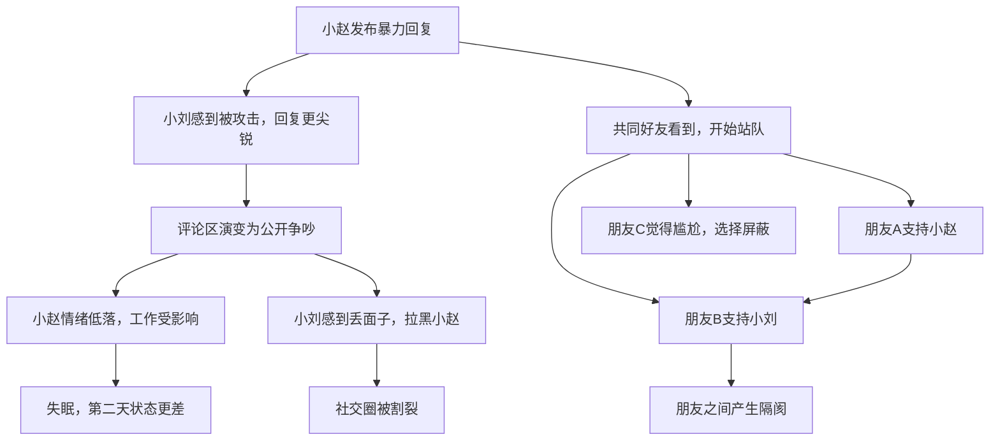

## 案例八：社交媒体上的NVC应用

社交媒体已成为现代人表达观点、维系关系、获取信息的核心场域。然而，文字的单向性、匿名感和公开性，使得暴力沟通在这个场域中被急剧放大——一句无心之言可能引发千人围观的"网络审判"，一个表情包可能摧毁多年友谊。非暴力沟通在社交媒体场景中的应用，不仅是个人修养的体现，更是数字时代的基本生存技能。

### 一、社交媒体沟通的独特挑战

#### 1.1 为什么社交媒体特别容易引发冲突

面对面沟通中，信息传递包含语言内容（约7%）、语音语调（约38%）和肢体语言（约55%）三个维度（Albert Mehrabian的沟通模型）。社交媒体剥离了后两个维度，只留下冰冷的文字。这意味着：

| 沟通维度 | 面对面 | 社交媒体 | 影响 |
|---------|--------|---------|------|
| 语言内容 | ✅ 完整 | ✅ 完整 | 信息基本保留 |
| 语音语调 | ✅ 丰富 | ❌ 缺失 | 无法判断对方是调侃还是讽刺 |
| 肢体语言 | ✅ 直观 | ❌ 缺失 | 无法感知对方的情绪状态 |
| 即时反馈 | ✅ 实时 | ⚠️ 延迟 | 等待中的焦虑会扭曲解读 |
| 上下文 | ✅ 充足 | ⚠️ 片段 | 断章取义的概率大幅上升 |
| 公开性 | 私密 | 公开 | 旁观者效应放大冲突 |
| 可撤回性 | 不可记录 | 永久记录 | 一时冲动可能留下永久痕迹 |

更关键的是，社交媒体的设计逻辑本身就在激化冲突——算法优先推送引发强烈情绪的内容（愤怒内容的互动率是正面内容的2-3倍），通知机制制造紧迫感，点赞和转发系统强化群体极化。在这个环境中，NVC的四要素需要进行针对性的适配。

#### 1.2 社交媒体暴力沟通的典型模式

**模式一：断章取义型攻击**

用户A发了一条长文，用户B截取其中一句话断章取义，配以"震惊！某某居然说这种话！"的标题进行传播。这种模式利用了社交媒体信息碎片化的特点。

**模式二：群体围攻型暴力**

当某人发表了一个有争议的观点，大量用户涌入评论区进行人身攻击。每个参与者都认为自己在"伸张正义"，但集体行为已经构成网络暴力。

**模式三：阴阳怪气型暗讽**

不直接攻击，而是通过反讽、影射、"高级黑"等方式表达不满。例如："哇，你好厉害哦，能把工作做得这么累也是本事呢。"这种表达比直接辱骂更难应对，因为它留有否认的空间。

**模式四：公开施压型道德绑架**

在朋友圈或群聊中公开@某人，要求对方表态或道歉，利用公众压力迫使对方就范。例如："你居然不转发这条，你是不是不关心XX？"

**模式五：截图传播型背刺**

将私聊截图公开传播，有时还经过选择性裁剪，导致信息严重失真。这种行为直接破坏了人际信任的基础。

### 二、核心案例：朋友圈评论风波

#### 2.1 场景还原

小赵是一家互联网公司的产品经理，连续加班两周后在朋友圈发了一条感慨："又是一个凌晨两点下班的夜晚，有时候真的很怀疑这一切是否值得。"

几分钟后，一位不太熟的前同事小刘在评论区留言："你这么累还不是因为自己能力不行？真正厉害的人早就搞定了。"

小赵看到这条评论的瞬间，心跳加速，脸发烫，手指已经打出了反击的字句。

#### 2.2 暴力沟通路径及其连锁反应

**如果小赵选择暴力反击：**

> "你懂什么？你自己不也一样吗？就知道在键盘后面说风凉话！有本事你来试试？"

这条评论发出后的连锁反应：

暴力沟通的代价不仅是关系的破坏，还有社会能量的巨大消耗——所有卷入的人都为此付出了情绪成本，而问题本身（小赵的工作压力）却完全没有被解决。

#### 2.3 NVC四步转换：完整示范

**第一步：观察（Observation）——区分事实与评判**

在社交媒体上，观察的挑战在于文字的模糊性。小赵需要做的是：只描述对方说了什么，而不去解读对方"是什么人"。

- ❌ 评判式解读："你在攻击我"、"你就是看不起人"
- ✅ 客观观察："我看到你的评论说'能力不行'"

**第二步：感受（Feeling）——识别真实情绪**

在社交媒体环境中，人们倾向于把感受包装成攻击性语言。小赵需要先识别自己的真实感受：

- 表层感受：愤怒（"你怎么敢这么说！"）
- 深层感受：受伤（"我明明很努力了"）、委屈（"我需要被理解"）、疲惫（"我确实撑不住了"）

**第三步：需要（Need）——挖掘核心需求**

小赵的核心需要不是"赢过对方"，而是：
- 被理解：自己的辛苦被看见
- 被支持：在疲惫时获得鼓励
- 被尊重：不被随意评判

**第四步：请求（Request）——提出可操作的具体请求**

在社交媒体场景中，请求的关键是将公开对话转为私密对话，将抽象诉求转为具体行动。

#### 2.4 NVC回复的具体话术

**首选方案：私信沟通**

不回复评论，而是发私信：

> "小刘，我看到了你的评论。说实话，看到'能力不行'这几个字，我挺受伤的，因为我最近确实在努力调整工作节奏。我知道你可能没有恶意，但这个表达让我有点难受。你愿意聊聊你的真实想法吗？"

**备选方案：评论区温和回应（适合关系较近的情况）**

> "谢谢你的关注。最近确实挺累的，你有什么好的建议吗？（微笑表情）"

这种回应的策略是：
- 不接"能力不行"的评判框架，不自我辩护
- 用"谢谢关注"先肯定对方的善意
- 用提问把对话引向建设性方向
- 用表情符号弥补文字缺乏语调的缺陷

**进阶方案：当对方持续攻击时**

如果对方继续不依不饶："说的就是事实啊，你看看别人怎么不加班？"

> "我能感觉到你对工作效率这件事有自己的看法。对我来说，加班背后有很多我不方便在朋友圈展开说的因素。如果你有兴趣深聊，我们可以私信交流。评论区聊这些不太方便。"

这段回应的NVC结构：
- 观察："你对工作效率有自己的看法"
- 感受：隐含的"不太舒服"
- 需要：保护隐私、避免公开争论
- 请求：转到私信

#### 2.5 对方的可能回应及后续处理

NVC不是万能钥匙，但能显著提高建设性对话的概率。以下是几种可能的后续走向：

| 对方回应类型 | 典型表现 | NVC应对策略 |
|------------|---------|------------|
| 意识到不当 | "抱歉，我说话太冲了" | 表达感谢，肯定对方的反思："谢谢你这么说，我很珍惜我们的交流" |
| 辩解但软化 | "我没恶意，就是觉得你应该提升效率" | 接纳善意，明确边界："我知道你是好意，下次可以换个方式说，我会更容易接受" |
| 继续攻击 | "玻璃心，说都不让说" | 终止对话："我理解你的看法，我们在这个问题上可能很难达成一致，先到这里吧" |
| 完全无视 | 不回复 | 无需追问，保护自己的情绪状态，必要时限制对方可见权限 |

### 三、社交媒体NVC的核心原则体系

#### 3.1 原则一：延迟反应，给自己一个冷静窗口

社交媒体的即时性是暴力沟通的催化剂。看到攻击性评论时，人的应激反应（杏仁核激活）通常在0.5秒内触发，而理性思考（前额叶皮层参与）需要至少6秒才能介入。

**"6秒法则"的具体操作：**

1. 看到让你不舒服的评论时，先不要打字
2. 把手机放下，做三次深呼吸（每次约2秒，共6秒）
3. 问自己三个问题：
   - 对方可能的善意是什么？
   - 我真正的感受和需要是什么？
   - 我现在回应能达到我想要的结果吗？
4. 如果仍然决定回应，采用NVC四步法

**"24小时法则"（针对高强度冲突）：**

如果涉及重大分歧或强烈情绪，给自己24小时再回应。你会发现，很多当时觉得"必须立刻反驳"的评论，第二天再看时已经不那么重要了。

#### 3.2 原则二：转私密，降维度

公开场合的沟通天然带有"表演"性质——当旁观者在场时，人们更容易为了"面子"而坚持立场、拒绝妥协。将对话从评论区转到私信，能有效降低双方的防御心理。

**转场话术模板：**

- "这个问题挺复杂的，评论区说不清楚，方便私聊吗？"
- "你提到的这个点很有意思，我想深入了解一下你的想法，私信聊聊？"
- "我觉得我们可能有些误解，私下沟通可能更有效，你觉得呢？"

#### 3.3 原则三：猜测善意，而非恶意

在信息不完整的情况下（社交媒体上几乎总是如此），人脑倾向于"负面偏差"——将模糊信息往最坏的方向解读。NVC鼓励我们主动选择一种更善意的解读框架。

**善意推测的心理机制：**

当你假设对方"可能是好意但表达不好"时，你的回应会更温和；对方感受到你的温和后，更可能展现出真正的善意。这就形成了一个正向循环——你选择的解读框架，实际上在塑造对方的回应。

**实用话术：**

- ❌ "你这话什么意思？"（质问，暗示恶意）
- ✅ "我理解你可能没有恶意，但这个表达让我有点不舒服"（肯定善意，表达感受）

#### 3.4 原则四：区分"表达"和"说服"

社交媒体上最常见的暴力沟通模式是"我必须说服你接受我的观点"。NVC的立场是：我有权表达我的感受和需要，但我无权强迫别人改变想法。

**自我检测清单：**

在发送任何回复前，问自己：
- 我是在表达自己的感受，还是在评判对方的行为？
- 我是在邀请对话，还是在强迫对方认错？
- 我能接受对方"不同意"的可能性吗？
- 如果对方不改变立场，我还能保持平和吗？

如果最后两个问题的答案是"不能"，那么你可能还没有准备好进行NVC对话，建议先给自己更多时间处理情绪。

#### 3.5 原则五：设置边界，而非筑起高墙

NVC不意味着无限度地包容。当对方持续攻击、侮辱或骚扰时，设置清晰的边界是健康的做法。

**边界设置的NVC表达：**

- "我理解你有不同看法，但人身攻击不是我能接受的沟通方式。如果你愿意换个方式交流，我很乐意继续。"
- "我可以接受批评，但不接受侮辱。我们下次再聊吧。"
- "这个问题我们可能永远无法达成一致，我选择不再继续这个对话。"

### 四、不同社交媒体平台的NVC策略

#### 4.1 微信朋友圈与群聊

**场景特点：** 强关系网络，社交压力大，公开性强。

**NVC要点：**

| 场景 | 暴力沟通示例 | NVC转换 |
|------|------------|--------|
| 朋友圈被评论攻击 | 直接回怼，拉黑 | 私信沟通，表达感受 |
| 群聊中被@要求表态 | 被迫站队，或沉默忍受 | "这个问题我需要更多时间思考，暂时不发表意见" |
| 被朋友截图传播 | 公开指责，撕破脸 | "我的分享是基于信任，截图传播让我感到不安全。希望以后能事先沟通" |
| 朋友圈观点被误解 | 长篇解释，越描越黑 | 简短澄清 + 私信补充："我说的可能不太清楚，私下跟你解释一下" |

**微信特有的技巧：**

- 善用"仅聊天"权限：对经常引发冲突的人设置朋友圈权限，减少触发机会
- 群聊中的"拍一拍"功能：用轻松的方式回应，避免严肃对抗
- 善用"引用回复"：在群聊中明确你在回应哪句话，减少误解

#### 4.2 微博与公开社交媒体

**场景特点：** 弱关系网络，信息传播快，情绪极化严重。

**NVC要点：**

- **不在热评区进行深度对话：** 评论区不适合NVC，它天然鼓励简短、情绪化的表达
- **使用私信功能：** 如果真的想与某人深入交流，直接私信
- **不参与"挂人"文化：** 即使你是受害者，公开"挂人"也会引发更大的暴力循环
- **学会"不回应"：** 不是所有攻击都值得回应，有时候沉默是最有力的NVC

#### 4.3 工作群与职场社交

**场景特点：** 权力关系明确，专业形象重要，后果直接影响职业发展。

**NVC要点：**

- 在工作群中被批评时，先私信沟通再公开回应
- 使用"感谢+感受+请求"结构："感谢指出问题。我有些担心这个方案的进度。能否约个时间详细讨论？"
- 避免在工作群中使用讽刺或隐晦表达

### 五、进阶：当NVC遇到网络暴力

#### 5.1 区分"争论"与"网暴"

并非所有激烈的网络争论都是网络暴力。两者的区别在于：

| 维度 | 普通争论 | 网络暴力 |
|------|---------|---------|
| 针对对象 | 观点 | 人格/身份 |
| 持续时间 | 单次或短期 | 持续、反复 |
| 参与人数 | 少数人 | 大规模群体 |
| 行为目的 | 表达不同意见 | 伤害、羞辱、摧毁 |
| 后果 | 观点碰撞 | 心理创伤、社会性死亡 |

#### 5.2 面对网络暴力的NVC策略

**对施暴者：** 通常不建议直接与大规模网暴的施暴者进行NVC对话。原因有二：
1. 对方的人数太多，你无法与每个人对话
2. 对方的目标不是沟通，而是发泄或攻击

**对自己：** 运用"自我共情"——这是NVC最容易被忽略的应用。

自我共情的步骤：
1. **承认痛苦：** "我现在很痛苦，这是正常的反应"
2. **识别感受：** "我感到愤怒、恐惧、羞耻、无力"
3. **识别需要：** "我需要安全、尊严、被公正对待"
4. **自我关怀：** "我可以先保护自己，不必回应所有人"

**对旁观者：** 如果你需要发声，面向旁观者而非施暴者。

示例："我理解大家对这个话题有很多情绪。我想分享一下真实的情况是……如果你愿意了解完整的故事，欢迎私信我。"

#### 5.3 法律与心理支持资源

当网络暴力升级到以下程度时，NVC已经不够用，需要外部支持：

- **涉及人身威胁：** 立即报警，保留证据截图
- **涉及诽谤造谣：** 可依据《民法典》第1024条主张名誉权保护
- **涉及人肉搜索：** 可依据《个人信息保护法》维权
- **造成严重心理影响：** 寻求专业心理咨询支持

**证据保留清单：**
- 截图要包含完整对话上下文（不是单独一条）
- 记录发布者ID、发布时间、平台
- 使用可信时间戳工具（如公证云、时间戳服务中心）
- 保留原始链接，不要只保存截图

### 六、常见误区与纠正

#### 误区一："NVC就是忍气吞声"

**纠正：** NVC的核心是"诚实地表达自己"，而不是"压抑自己去迎合别人"。如果一条评论真的伤害了你，NVC鼓励你说出来——但用"我感到受伤"而不是"你是个混蛋"。

**关键区别：**
- 忍气吞声："算了，不跟他一般见识"（压抑，内心仍愤怒）
- NVC："我选择不在此刻回应，因为我需要先处理自己的情绪"（有意识的选择，内心平和）

#### 误区二："每条攻击性评论都必须回应"

**纠正：** NVC包含"选择不沟通"的智慧。面对明显的恶意挑衅、网络喷子或职业黑粉，不回应往往是最明智的选择。你的时间和情绪能量是有限的资源，不必浪费在不值得的对话上。

#### 误区三："NVC能改变所有人"

**纠正：** NVC是一种沟通方式，不是思想改造术。有些人就是不会改变他们的看法，有些冲突就是无法调和。NVC的价值在于：即使对方不改变，你也能保持自己的心理完整性和人格尊严。

#### 误区四："在网络上保持NVC太难了，不现实"

**纠正：** 难度恰恰说明了练习的必要性。社交媒体是最高难度的NVC练习场——如果你能在匿名、公开、信息不完整的环境中保持NVC，那么在面对面的沟通中就会更加自如。从小事练起：先在不那么激烈的评论区练习温和回应，逐步挑战更高难度的场景。

### 七、实操练习

#### 练习一：暴力语言翻译器

将以下社交媒体常见暴力语言转换为NVC表达：

| 暴力语言 | NVC转换思路 | NVC表达示例 |
|---------|-----------|-----------|
| "你就不能长点脑子吗？" | 观察行为 → 表达感受 → 说出需要 → 提出请求 | "我注意到这个方案有几个漏洞（观察），我有些担心（感受），因为我希望我们的工作质量能达标（需要）。你能再检查一下这几个点吗？（请求）" |
| "呵呵，又在凡尔赛" | 猜测善意 → 表达感受 → 邀请对话 | "我理解你可能觉得我在炫耀，其实我分享的时候是想表达感恩。如果让你不舒服了，我很抱歉。" |
| "你这种人就是社会的毒瘤" | 不接框架 → 表达感受 → 设置边界 | "这个表达让我很不舒服。如果你对某个具体问题有看法，我很愿意就事论事地讨论。" |

#### 练习二：回复前的"五秒检查清单"

在社交媒体上按下"发送"之前，用五秒钟检查：

1. **这条消息是出于爱还是出于恐惧？**（如果出于恐惧——害怕被误解、害怕丢面子——先停下来）
2. **我能接受对方不改变立场吗？**（如果不能，说明你正在试图控制对方）
3. **如果我的老板/父母/伴侣看到这条回复，我会觉得尴尬吗？**（公众可见性检验）
4. **24小时后我还会想发这条消息吗？**（延迟检验）
5. **这条消息是在建设关系还是在破坏关系？**（关系影响检验）

如果五项中有两项以上触发"是"或"不确定"，请暂停，等情绪平复后再决定。

#### 练习三：建立个人社交媒体NVC公约

为自己制定一份社交媒体沟通公约，贴在手机备忘录中。示例：

> **我的社交媒体NVC公约**
>
> 1. 我不在愤怒时回复任何评论
> 2. 我不参与对任何人的群体攻击
> 3. 我不在公开场合讨论需要深入沟通的话题
> 4. 我每天检查一次社交媒体的情绪消耗，超过阈值就退出
> 5. 我对他人的表达给予善意推测
> 6. 我有权选择不回应，这不代表我认输
> 7. 我用"我感到"而非"你就是"来表达情绪
> 8. 我尊重与我观点不同的人的表达权

### 八、从线上到线下：NVC的全场景贯通

社交媒体上的NVC实践不是孤立的技能，它与线下沟通的NVC能力相互促进。在社交媒体上练习的"延迟反应"习惯，会帮助你在面对面争吵中更冷静；在线下面对面中培养的"共情倾听"能力，会让你在网络上更容易猜测他人的善意。

最终目标不是成为一个"完美的网络沟通者"，而是通过持续的练习，让NVC成为你的默认沟通模式——无论线上还是线下，无论面对朋友还是陌生人，无论文字还是语言。

当小赵在朋友圈遭遇那条刺眼的评论时，他面临的不只是一个社交媒体的小冲突，而是一个选择：是让愤怒主导自己的行为，还是用共情和诚实来回应这个世界？每一次这样的选择，都在塑造你的人际关系品质和心理健康水平。

***

**本案例核心要点回顾：**

- 社交媒体剥离了语调和肢体语言，使得暴力沟通更容易发生
- NVC四要素（观察-感受-需要-请求）在社交媒体上需要针对性适配
- 五大核心原则：延迟反应、转私密、猜测善意、区分表达与说服、设置边界
- 不同平台（微信、微博、职场社交）有不同的NVC策略
- 面对网络暴力时，优先保护自己，必要时寻求法律和心理支持
- NVC不等于忍气吞声，而是有意识地选择更建设性的回应方式
