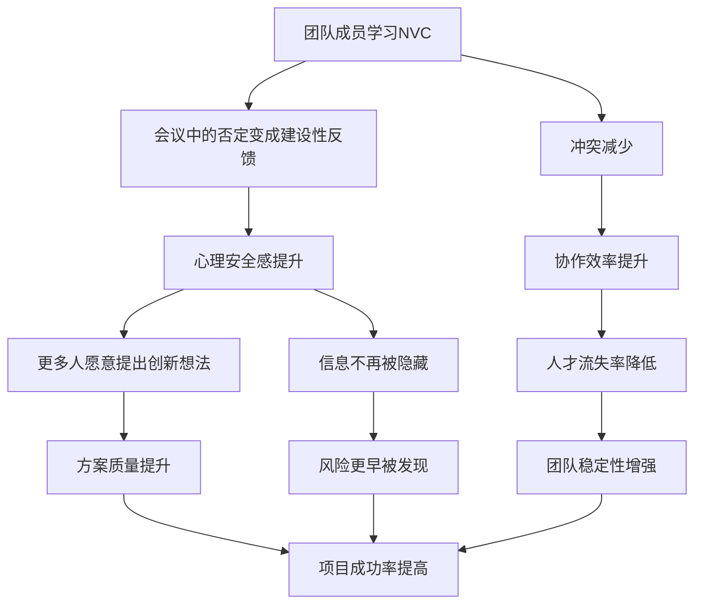

## 案例九：团队会议中的NVC应用

### 背景与场景设定

小刘是某互联网公司产品团队的交互设计师，入职两年，工作认真但性格偏内向。团队正在召开周度方案评审会，参会者包括产品经理小刘、后端开发小马、前端开发小赵、测试工程师小孙，以及项目负责人王总监。

会议议题是即将上线的新功能模块交互方案。小刘在会前花了三天时间准备了一套基于用户调研数据的全新交互流程，包括原型图和竞品分析。他在周报中提前分发了文档，但会议当天只有王总监提前看过。

小刘刚展示完方案的核心思路，后端开发小马就直接打断："这个想法太不切实际了。我们的技术架构根本支撑不了这种交互模式，做出来就是给自己挖坑。"

会议室瞬间安静了三秒。

小刘的脸涨红了，低下头不再说话。小赵看了看小马，又看了看小刘，选择沉默。小孙在笔记本上无意识地画着圈。王总监皱了皱眉，但也没有立即介入——他习惯让团队自己"磨合"。

接下来的二十分钟，小马主导了讨论方向，提出了一个"技术上可行"的替代方案。小刘全程没有再发言。会议结束后，小刘回到工位，打开微信给朋友发了一条消息："又白干了，这破公司不值得。"

这个场景在技术团队中极为常见。根据哈佛商学院Amy Edmondson的研究，**团队心理安全感（Psychological Safety）是高效团队的第一要素**，而在缺乏NVC框架的会议中，心理安全感往往在第一句否定性发言中就被摧毁。

### 团队会议沟通的特殊性

#### 会议环境为何容易引发暴力沟通

会议与一对一沟通有本质区别，这些区别使得暴力沟通更容易发生，且破坏力更大：

| 维度 | 一对一沟通 | 团队会议 |
|------|-----------|---------|
| 观众效应 | 无旁观者，表达更真实 | 多人在场，面子压力倍增 |
| 情绪传导 | 情绪影响仅限双方 | 负面情绪感染整个团队 |
| 沉默成本 | 沉默只影响一人 | 一人沉默，团队失去多元视角 |
| 权力动态 | 相对简单 | 多层权力关系交织 |
| 时间压力 | 可以慢慢展开 | 议程紧凑，容易粗暴打断 |
| 归因机制 | 可以澄清和修正 | 公开否定容易固化为"定性" |

#### 会议中暴力沟通的六种典型模式

通过对上百场技术团队会议的观察，暴力沟通通常以以下六种模式出现：

**模式一：公开否定型**

> "这个方案不可行。"
> "你有没有考虑过技术实现？"
> "这跟上次被毙掉的那个方案有什么区别？"

这种模式直接否定发言者的工作成果，没有任何建设性内容。发言者通常自认为在"高效决策"，但实际上是在用权威压制讨论。

**模式二：隐性轻视型**

> "嗯……想法是好的，但是……（然后长篇论证为什么不行）"
> "这个方向我们去年就试过了。"
> "你可能不太了解后端的情况。"

表面客气，实质否定。"但是"前面的肯定只是铺垫，真正的信息在"但是"后面。

**模式三：沉默对抗型**

不发言、不回应、低头看手机、会后在小群里吐槽。这种模式看似"没有冲突"，实际上是最具腐蚀性的暴力沟通——它让问题潜伏，让被孤立者感到被集体抛弃。

**模式四：技术权威压制型**

> "从架构角度看，你这个方案存在根本性问题。"
> "我觉得你可能需要先了解一下微服务的基本原则。"

用专业壁垒作为武器，将讨论从"方案可行性"偷换为"你够不够专业"。

**模式五：群体思维裹挟型**

> "大家都觉得这个方案有问题吧？"（环顾四周）
> "我觉得小马说得对，技术上确实不现实。"

利用从众压力孤立异见者，让不同意见没有生存空间。

**模式六：会议主持人失职型**

主持人没有设定沟通规则，没有保护发言者，没有平衡发言机会，甚至自己也参与否定。在本案例中，王总监的沉默就属于这种模式——他的不作为本身就是一种对暴力沟通的默许。

### 暴力沟通循环的深层分析

#### 小刘的内心独白（豺狗语言）

> "小马就是看不起我！他每次都是这样，别人提方案他就挑毛病，自己提的方案就没人敢反对。王总监也不管，这个团队根本没有人尊重设计师的工作。我辛辛苦苦做了三天的方案，他一句话就否定了，他看过我的文档吗？这种破公司不值得待。"

这段内心独白包含了多个典型的暴力沟通元素：

- **读心术**："小马就是看不起我"——将行为解读为动机，且是负面动机
- **以偏概全**："每次都是这样"——将单次事件扩大为永久模式
- **对比思维**："自己提的方案就没人敢反对"——选择性记忆支持自己的叙事
- **归因外化**："这个团队根本没有人尊重设计师"——将个人遭遇上升为群体迫害
- **灾难化**："这种破公司不值得待"——将沟通问题升级为职业决策

这种思维模式的心理机制是**威胁反应**。当一个人在公开场合被否定时，大脑的杏仁核会将"公开否定"与"社会性死亡"联系起来——在进化心理学的框架中，被群体排斥曾意味着生存威胁。因此，小刘的反应虽然看似过度，但在神经层面是完全正常的应激反应。

#### 小马的内心独白

> "小刘又搞了一套花里胡哨的东西。他根本不懂技术实现的复杂度，每次提的方案都要后端加班加点去适配。上次那个方案上线后出了多少bug？我得在会上说清楚，不能让团队浪费时间。"

小马的暴力沟通同样有其内在逻辑：

- **职业责任感驱动**：作为后端开发，他的核心职责是系统稳定性和可维护性，他确实有合理的担忧
- **经验固化**：过去的负面经验（上次方案导致大量bug）让他形成了"设计师的方案=技术灾难"的刻板印象
- **沟通效率偏好**：技术文化中，"直接指出问题"被视为高效和专业的表现
- **表达方式的局限**：他没有学会在否定方案的同时肯定人的价值

**关键洞察**：小马不是一个"坏人"，小刘也不是一个"玻璃心"。两个人都有合理的需要——小刘需要被尊重和认真对待，小马需要技术可行性和工作效率。问题不在于需要本身，而在于满足需要的**方式**。

### NVC四要素在会议场景中的应用

#### 第一步：观察——区分事实与评判

在会议场景中，观察是最难的一步，因为会议的公开性和时间压力让人更容易滑入评判。

| 暴力表达（评判） | NVC表达（观察） |
|----------------|----------------|
| "你直接否定了我的方案" | "我刚展示完方案的第一部分，你说了一句'这个想法太不切实际了'" |
| "你总是这样" | "在最近三次方案评审中，有两次你在第一个问题时就表达了否定意见" |
| "你根本没看我的文档" | "我在周报中分享了文档链接，但我注意到你提到的技术可行性问题在文档第五节有回应" |
| "你针对我" | "我在会议上提出了三个方案，都被否定了，而其他同事的方案通过率更高" |

**会议场景中观察的难点**：在多人在场的情况下，精确描述观察需要更大的心理勇气，因为你在"公开陈述事实"，对方可能会感到被"当众指控"。解决方案是使用**第一人称观察**——"我注意到""我听到"——而非第二人称指控——"你做了""你说过"。

#### 第二步：感受——在专业框架内表达情感

会议场景中表达感受的最大挑战是：**如何在不显得"情绪化"的前提下，真实地表达情感**。

**不推荐的表达方式**（容易被误解为不专业）：

> "我很伤心。"
> "我觉得被背叛了。"
> "我真的很生气。"

**推荐的表达方式**（在专业框架内表达感受）：

> "我感到有些沮丧，因为我投入了三天时间准备这个方案，但讨论在第一个反馈后就转向了。"
> "我感到困惑，因为我需要理解你判断'不切实际'的具体依据是什么。"
> "我感到不安，因为团队似乎在没有充分讨论的情况下就做出了决定。"

**会议场景中的"可接受感受"清单**：

| 高接受度感受 | 中等接受度感受 | 低接受度感受（需要策略性表达） |
|------------|--------------|---------------------------|
| 困惑、不确定 | 沮丧、失望 | 受伤、被忽视 |
| 担忧、关切 | 疲惫、压力大 | 愤怒、不被尊重 |
| 好奇、想了解更多 | 有些意外 | 害怕、不安全 |

**策略性表达的核心原则**：将感受与具体的、可验证的事件联系起来，而非与对方的"意图"联系起来。"我感到困惑，因为讨论时间很短"比"我感到被忽视"更安全，因为前者描述的是可观察的事实，后者是对他人心态的推测。

#### 第三步：需要——将个人需要转化为团队需要

在会议场景中，将个人需要转化为团队共同需要是NVC应用的高阶技巧。

**个人需要 → 团队需要的转化**：

| 个人需要 | 转化后的团队需要 |
|---------|----------------|
| "我需要被尊重" | "我需要确保每个方案都有充分的讨论时间，这样团队才能做出最优决策" |
| "我需要被认可" | "我需要理解方案被否定的具体原因，这样我才能做出有效的改进" |
| "我需要安全感" | "我需要团队建立一个规则：在否决一个方案之前，先充分讨论其优势和风险" |
| "我需要平等参与" | "我需要确保会议中每个角色的技术视角和用户体验视角都被纳入考量" |

**转化的心理机制**：当你说"我需要被尊重"时，对方听到的是"你在不尊重我"（指控）。当你说"我需要确保每个方案都有充分讨论"时，对方听到的是"你在提出一个团队改进建议"（建设性）。两者表达的是同一个需要，但接收效果完全不同。

#### 第四步：请求——会议场景中的具体、可执行请求

会议中的请求需要特别注意两点：**时间可行性**和**权力边界**。

**模糊请求 vs. 具体请求**：

| 模糊请求（不推荐） | 具体请求（推荐） |
|-----------------|----------------|
| "你能不能好好说话？" | "我能否用两分钟解释一下方案中已经考虑了技术可行性的部分？" |
| "你们要尊重我的方案" | "我们能否先用五分钟讨论方案的优势，再用五分钟讨论技术风险？" |
| "别这么快下结论" | "我提议在否决任何方案之前，至少收集三位同事的具体反馈意见" |
| "你要公平对待每个人" | "王总监，能否在每次方案评审中，给每个方案分配同等的讨论时间？" |

### 完整的NVC对话示范

#### 场景一：小刘的即时NVC回应

**原始暴力回应**（小刘内心想说但忍住了的）：

> "你连我的文档都没看，凭什么说不切实际？你懂用户体验吗？"

**NVC回应**：

> "小马，我听到你说这个方案'太不切实际了'（观察）。说实话，我有些沮丧（感受），因为我在方案中用了第五节专门回应技术可行性的问题，我需要确认你是否看到了那部分内容，以及你的'不切实际'具体指的是架构层面、性能层面还是开发周期层面的顾虑（需要）。你愿意先指出你认为最有风险的三个点吗？这样我们可以逐个讨论可行性（请求）。"

**这段NVC回应的精妙之处**：

- **观察部分**：直接引用小马的原话，不添加任何解读
- **感受部分**：用"沮丧"这个中等强度的感受词，既真实又不失专业
- **需要部分**：做了三件事——(1)指出自己已经做了准备工作，(2)要求具体化批评，(3)给出讨论框架（架构/性能/周期三个维度）
- **请求部分**：把模糊的否定转化为具体的、可讨论的技术问题清单

#### 场景二：小马的NVC反思与回应

假设小刘使用了上述NVC回应，小马可能会经历以下内心过程：

> "嗯……他确实提到了技术可行性。我可能确实没有仔细看第五节。我的反应太快了。"

**小马的NVC回应**：

> "小刘，我需要承认，我刚才的表达确实太笼统了（观察）。我说'不切实际'的时候，脑子里想的是我们在微服务架构下的数据一致性问题——上周我们刚修了类似的bug（观察）。但我不应该用一句话否定整个方案（反思）。我现在认真看一下你文档的第五节（具体行动），然后我们讨论一下数据一致性这块有没有你还没考虑到的风险点，好吗？（请求）"

**这段回应的示范价值**：

- **承认不足**：直接承认自己表达方式有问题，不找借口
- **提供背景**：解释自己为什么会有那样的反应（上周修了类似bug），让对方理解自己的担忧来源
- **具体行动**：不是空洞的"我会改进"，而是"我现在认真看第五节"
- **合作框架**：把讨论从"你对我错"转化为"我们一起评估风险"

#### 场景三：会议主持人王总监的NVC介入

在实际会议中，最理想的情况是**主持人主动介入**。如果王总监是一位NVC实践者，他可能在小马说完"太不切实际"之后就这样介入：

> "小马，我注意到你对方案的技术可行性有顾虑（观察）。同时，我看到小刘准备了三天的方案文档，其中第五节专门讨论了技术可行性（观察）。我的考虑是（感受+需要）：如果我们在没有充分了解方案全貌的情况下就做出判断，可能会错过一些有价值的设计思路，同时也会影响团队成员提出创新想法的积极性（需要：决策质量和心理安全感）。

> 我建议这样进行（请求）：先给小刘五分钟解释方案中技术可行性的考量，然后小马提出你最关心的三个技术风险点，我们逐个讨论。如果最后发现确实不可行，我们再一起看替代方案。大家同意吗？"

**主持人介入的关键原则**：

- **双向描述**：同时承认两方的立场和贡献
- **提出框架**：不是裁决谁对谁错，而是给出一个公平的讨论流程
- **征得同意**：用"大家同意吗"而非"就这样定了"，保持团队自主性

### 会议中的NVC沟通协议设计

为了从根本上改善团队会议质量，建议在团队中建立一套书面的**会议沟通协议**。以下是一个经过实践验证的协议模板：

```markdown
# 团队会议沟通协议 v1.0

## 基本原则
1. 对事不对人：讨论方案，不评价提出方案的人
2. 先理解后回应：在表达反对之前，先用自己的话复述对方的观点
3. 具体化：不用"不切实际""不太好"等笼统词汇，必须指出具体问题
4. 平等发言：每个方案至少有5分钟不受打断的展示时间

## 反馈流程（三步反馈法）
1. **确认理解**："我听到你说的是……我理解对了吗？"
2. **表达关切**："我有一个顾虑是……（具体的技术/业务/用户风险）"
3. **提出建议**："我的建议是……你觉得这个方向是否可行？"

## 否决规则
- 否决一个方案需要至少两人提出具体的技术/业务风险
- 被否决的方案记录在案，包含否决原因，供后续复盘
- 方案提出者有权要求"上诉"——用一周时间完善后再讨论

## 主持人职责
- 保护每个发言者的完整表达权
- 在出现人身攻击或笼统否定时立即介入
- 确保技术、产品、设计、测试每个角色都有发言机会
- 会议结束前用2分钟做"情感温度检查"
```

### 会议场景中的NVC进阶技巧

#### 技巧一：预防性NVC——在会议开始前设定基调

在会议开场时用2分钟设定沟通基调，可以显著降低暴力沟通发生的概率：

> "今天的讨论可能会有一些分歧，这是好事——说明我们在认真思考。我想提醒大家三个原则：第一，如果你不同意一个方案，请指出具体的风险点，而不仅仅是'我觉得不行'；第二，方案提出者有权完整表达后再接受反馈；第三，我们的目标是找到最优方案，而不是证明谁对谁错。"

#### 技巧二：翻译器模式——为他人的暴力语言做NVC翻译

当团队成员使用暴力语言时，NVC实践者可以充当"翻译器"，将暴力语言转化为建设性讨论：

> 小马："这个方案技术上根本不可行。"
>
> 小赵（翻译器）："小马，我理解你对技术实现有顾虑。你能不能具体说说，是架构层面的问题，还是开发周期的问题？这样我们可以有针对性地讨论。"

翻译器模式的价值在于：它既保护了被否定者的尊严，又给了否定者一个台阶——你不是在批评小马的表达方式，而是在帮助他更好地表达自己的观点。

#### 技巧三：暂停按钮——在情绪升温时按下暂停

当会议气氛变得紧张时，任何人都可以使用"暂停按钮"：

> "我注意到讨论变得有些紧张了。我们能不能暂停两分钟？我想先确认一下：我们讨论的核心分歧到底是什么？是方案的用户体验目标，还是技术实现路径？"

暂停按钮的作用不是逃避冲突，而是**重新定义冲突**。很多会议冲突之所以升级，是因为双方在不同的维度上争论——一个在谈用户体验，一个在谈技术架构，两人都觉得对方不理解自己。

#### 技巧四：会后一对一修复

如果会议中的暴力沟通已经造成了伤害，会后的一对一修复比在会议上公开道歉更有效：

> 小马（会后找小刘）："小刘，今天会上我的表达方式确实有问题。我说'不切实际'的时候，其实是在表达我对技术风险的担忧，但那个说法对你的工作不够尊重。我看了你文档的第五节，数据一致性那块你确实考虑得很周全。我愿意在下次会上重新讨论这个方案。"

### 常见误区与纠正

#### 误区一：NVC就是"委婉说话"

**错误理解**：把NVC当成一种"话术"，学习如何用更温柔的方式说出同样的话。

**正确理解**：NVC的核心不是改变语言，而是改变思维方式。当你真正理解小马的技术担忧并尊重他的专业判断时，你自然会说出NVC式的语言。如果你内心依然觉得"小马在针对我"，再精巧的话术也掩盖不了敌意。

#### 误区二：NVC意味着永远不直接否定

**错误理解**：使用NVC后就不能直接说"这个方案不可行"，必须绕弯子。

**正确理解**：NVC不反对直接表达，反对的是**没有事实依据和建设性内容的直接否定**。"这个方案在高并发场景下的数据库读写比例是1:3，按照我们的QPS要求，数据库会在上线第三天崩溃"——这是直接的、有力的、NVC式的否定。"这个方案不行"——这是懒惰的、暴力的否定。

#### 误区三：NVC是"软弱"的表现

**错误理解**：在技术团队中使用NVC会被视为"不够硬核""婆婆妈妈"。

**正确理解**：NVC需要的勇气远大于暴力沟通。暴力沟通是本能反应——在受到威胁时攻击或逃避。NVC需要你**暂停本能反应**，去理解对方的需要，同时清晰地表达自己的需要。这需要极强的情绪管理能力和沟通技巧。在技术团队中，能够做到"不同意但尊重，否定但建设性"的人，才是真正令人信服的技术领导者。

#### 误区四：NVC会让会议变慢

**错误理解**：每句话都要按照四要素来说，会议效率会大幅下降。

**正确理解**：NVC确实会让单次讨论多花几分钟，但它能显著减少**后续的返工、误解和消极怠工**。盖洛普的研究显示，因沟通不良导致的返工和人才流失，平均每年给每个员工造成约$12,500的隐性成本。花10分钟用NVC方式讨论一个方案，远比花3天返工、再花一周重新招聘划算。

### 不同角色的NVC行动指南

#### 方案提出者（如小刘）的NVC清单

| 阶段 | 行动 | 示例 |
|------|------|------|
| 会前 | 发送文档时标注需要反馈的具体问题 | "文档第三节是技术可行性分析，请各位重点关注" |
| 会中-被否定时 | 请求具体化 | "你提到'不切实际'，能具体说说你看到的风险点吗？" |
| 会中-被忽视时 | 主动争取发言权 | "我能否用两分钟补充一下技术可行性部分的考量？" |
| 会后-受伤时 | 一对一表达感受和需要 | "今天的讨论方式让我有些沮丧，我希望下次能有更充分的讨论时间" |

#### 技术质疑者（如小马）的NVC清单

| 阶段 | 行动 | 示例 |
|------|------|------|
| 会前 | 阅读方案文档，标注具体问题 | "文档第三节的数据一致性假设与我们的架构不匹配" |
| 会中-表达质疑时 | 使用"三明治反馈法" | "方案的用户场景分析很全面（肯定）。数据一致性这块有一个风险（关切）。我们能不能一起看看有没有折中方案？（合作）" |
| 会中-被挑战时 | 承认局限性 | "你说得对，我可能没有考虑到用户体验层面的需求" |
| 会后 | 主动修复关系 | "今天我的表达方式不太好，我实际想表达的是技术风险，不是否定你的工作" |

#### 会议主持人（如王总监）的NVC清单

| 阶段 | 行动 | 示例 |
|------|------|------|
| 会前 | 设定沟通规则 | "今天的讨论遵循三步反馈法：确认理解→表达关切→提出建议" |
| 会中-出现否定时 | 介入翻译 | "小马，你的技术顾虑很重要。能否具体说明是哪个技术点不可行？" |
| 会中-出现沉默时 | 邀请发言 | "小赵，你作为前端实现者，对这个交互方案有什么看法？" |
| 会中-情绪升温时 | 按下暂停键 | "我们暂停两分钟，重新梳理一下核心分歧是什么" |
| 会后 | 做情感温度检查 | "今天的讨论很有成效。大家对讨论过程有什么感受或建议吗？" |

### NVC对团队效能的长期影响

当NVC成为团队的沟通常态后，会产生以下连锁效应：



根据Google的Project Aristotle研究，在心理安全感最高的团队中：
- 创新想法的提出频率提高了 **47%**
- 跨职能协作的效率提升了 **35%**
- 员工主动离职率降低了 **28%**
- 项目按时交付率提高了 **31%**

这些数据背后的逻辑很简单：当人们不用担心自己的想法被公开否定时，他们会更愿意分享信息、承担风险、提出异议。而这些行为恰恰是高效团队的核心竞争力。

### 延伸思考：远程会议中的NVC挑战

在远程会议（视频会议、文字协作）中，NVC的应用面临额外挑战：

| 挑战 | 原因 | NVC应对策略 |
|------|------|------------|
| 非语言信号丢失 | 无法看到对方的面部表情和肢体语言 | 主动用语言表达感受："我注意到讨论变得有些激烈了" |
| 打断更容易发生 | 会议延迟和多人同时发言 | 使用"举手"功能，主持人维护发言顺序 |
| 沉默更难察觉 | 无法判断对方是在思考还是在生气 | 主动邀请："小刘，你对这个方案有什么补充？" |
| 文字沟通的冷感 | 文字缺乏语气，容易被误读 | 在文字反馈中加入情感标记："这个方案的用户场景分析很赞👍。技术可行性这块我有一个担忧……" |
| 多任务分心 | 参会者在做其他事情 | 开场设定："今天的讨论很重要，希望大家关闭其他应用，专注参与" |

远程会议中NVC的黄金法则：**如果这段话在面对面时需要用温和的语气说，那在文字中就需要加更多的上下文和情感标记**。因为文字无法传递语气，所以你需要用更多的文字来弥补语气的缺失。

### 本案例的核心启示

1. **会议暴力沟通的根源不是"坏人"，而是缺乏沟通框架**。小马不是故意针对小刘，小刘也不是玻璃心——他们只是不知道如何在压力下进行建设性对话。

2. **主持人的角色至关重要**。一个沉默的主持人等于是在默许暴力沟通。会议主持人需要学习主动介入的技巧，这不是"多管闲事"，而是核心职责。

3. **NVC不等于"好好说话"，而是一种思维方式的转变**。当你真正理解每个人的需要——小刘需要被尊重，小马需要技术可靠性，王总监需要团队效能——你自然会找到满足所有人需要的沟通方式。

4. **预防胜于治疗**。与其在暴力沟通发生后修复关系，不如在会议开始前设定沟通规则。一份简单的会议沟通协议，可以避免80%的会议冲突。

5. **NVC是团队的基础设施，不是个人的修饰品**。一个团队中只有一个人会NVC是不够的——它需要成为团队的共同语言。这也是为什么建议将NVC培训纳入新员工入职流程的原因。
