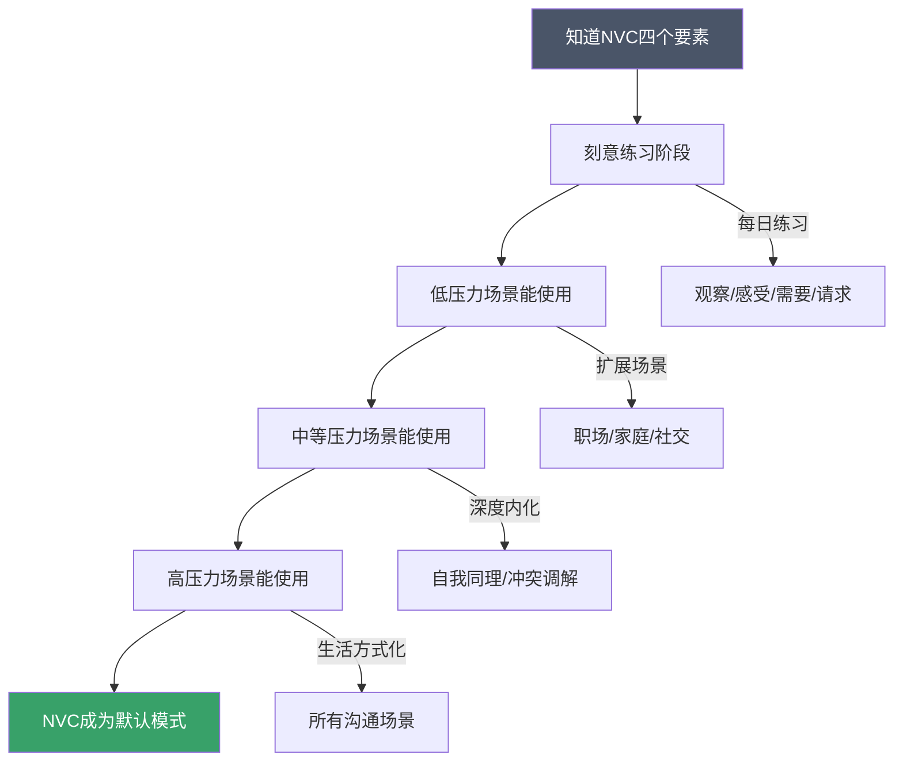
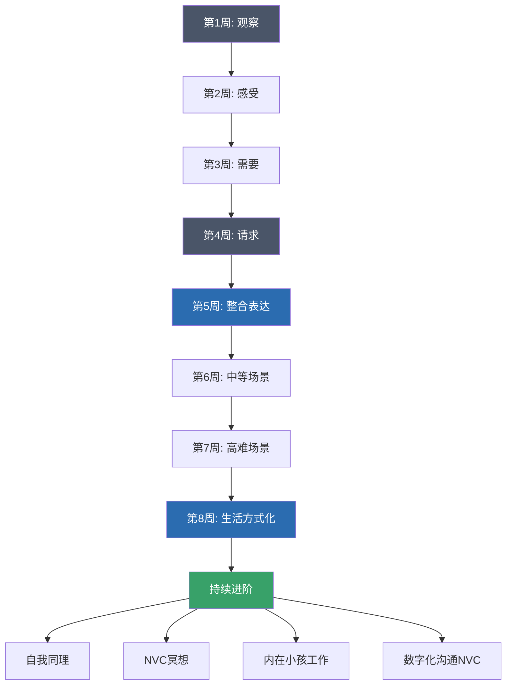

# NVC自我练习计划：从新手到高手的系统训练路径

## 为什么需要系统的自我练习计划

非暴力沟通（NVC）不是读完一本书就能掌握的技能。它是一种全新的语言习惯和思维方式，而习惯的改变需要刻意练习。伦敦大学学院Phillippa Lally教授（2009）的研究表明，一个新习惯的形成平均需要66天，而语言习惯的改变比行为习惯更难——因为它涉及自动化的情绪反应模式和根深蒂固的神经通路。

很多NVC学习者会陷入一个困境：理解了四个要素（观察、感受、需要、请求），但在真实对话中完全用不出来。这不是理解力的问题，而是练习量的问题。正如马歇尔·卢森堡所说："NVC不是一个需要'记住'的概念，而是一种需要'活出来'的语言。"

**系统练习的核心价值：**

- **建立新的神经通路**：反复练习让NVC表达从"刻意输出"变成"自动输出"。神经科学研究表明，重复的思维模式会强化特定的突触连接（Hebb定律："一起放电的神经元会连接在一起"）
- **降低认知负荷**：当四个要素内化后，你不需要在对话中同时思考结构，就像熟练司机不需要思考离合器和油门的配合
- **培养觉察力**：从无意识反应到有意识选择，这是质变的关键。觉察力是NVC所有技能的元能力
- **积累信心**：每一次成功练习都在强化"我能做到"的信念，形成正向循环

## 练习前的准备工作

### 心态准备：理解学习曲线

在开始任何练习之前，先校准你的期待。NVC学习有三个阶段，每个阶段都有其独特的挑战和突破点：

| 阶段 | 特征 | 常见感受 | 持续时间 | 关键突破 |
|------|------|----------|----------|----------|
| 笨拙期 | 刻意组织语言，表达不自然，经常"卡壳" | 尴尬、挫败、"这太假了"、"我说不出口" | 2-4周 | 接受不完美，完成比完美重要 |
| 平稳期 | 能在低压力场景中使用，但高压场景仍会退化 | 逐渐自然，偶尔有"灵光一现"的时刻 | 4-8周 | 从"用对了"到"用得自然" |
| 内化期 | NVC成为默认表达模式，不需要刻意回忆 | 自然而然，甚至能在冲突中保持冷静 | 8周+ | 从"使用技术"到"活出品质" |

**关键心态：** 在笨拙期感到不自然是完全正常的。就像学开车，一开始要记住每个步骤，手忙脚乱，但最终这些操作会变成身体记忆。研究刻意练习的心理学家安德斯·埃里克森指出：如果你在练习中感到轻松，说明你没有在进步。笨拙感恰恰是成长的信号。

**需要警惕的三个心态陷阱：**

1. **"我应该很快就能学会"**——NVC改变的是几十年形成的语言习惯，给自己至少8周的耐心
2. **"我又失败了"**——NVC练习没有失败，只有反馈。每次"搞砸"都是宝贵的学习数据
3. **"别人不用NVC，我学了也没用"**——你无法控制别人，但你可以改变自己的回应方式，这本身就会影响整个互动的质量

### 工具准备

你需要以下材料来支持练习：

- **NVC练习日志**：纸质笔记本或电子文档均可，建议专用。推荐使用"晨间日记"格式——每天早上花5分钟写下昨天的NVC练习收获和今天的练习意图
- **感受词汇表**：打印一份贴在显眼处（如冰箱门、浴室镜子），方便随时查阅
- **需要词汇表**：同上，这是你最常用到的参考工具
- **录音设备**（可选）：手机录音功能，用于回顾自己的表达。回听自己的对话录音是提升最快的方式之一，虽然过程可能不太舒服
- **练习伙伴**（可选）：配偶、朋友、或NVC学习小组成员。有伙伴的练习效果是独自练习的2-3倍
- **计时器**：用于正念练习和自我连接练习的计时

### 感受词汇表（精简版）

**身体感受：** 放松、紧张、疲惫、精力充沛、沉重、轻盈、温暖、冰冷、疼痛、舒适、发麻、心跳加速、呼吸急促、肌肉僵硬、胃部不适

**积极情绪：** 喜悦、感激、感动、安心、满足、兴奋、自豪、好奇、信任、亲密、平静、充实、被鼓舞、充满希望、轻松、自在、温暖、被接纳、充满力量

**消极情绪：** 焦虑、恐惧、愤怒、悲伤、失望、沮丧、孤独、羞耻、内疚、嫉妒、困惑、无力、厌烦、受伤、烦躁、委屈、心寒、憋屈、窒息、麻木

**需要未满足时的感受：** 不安、烦躁、紧张、担忧、挫败、无助、被忽视、被排斥、心寒、憋屈、被误解、不被尊重、不被看见、不被理解

**区分"感受"和"伪感受"：** 有些看起来像感受的词，实际上包含了对他人的判断。例如"被抛弃"（实际是"孤独、害怕"）、"被利用"（实际是"愤怒、不被尊重"）、"被忽视"（实际是"难过、不被重视"）。真正的感受不指向任何人的行为。

### 核心需要清单（九类）

| 需要类别 | 具体需要 | 典型表现 |
|----------|----------|----------|
| 生理需要 | 食物、水、睡眠、休息、运动、健康、安全、住所 | 身体不适时情绪容易波动 |
| 关系需要 | 爱、亲密、信任、尊重、理解、支持、陪伴、归属感 | 渴望与他人建立深层连接 |
| 自主需要 | 自由、选择、独立、空间、灵活性、自主权 | 被控制时感到窒息 |
| 意义需要 | 目标、贡献、价值感、成长、学习、创造力 | 感到生活空虚时可能缺乏意义感 |
| 欣赏需要 | 认可、感激、肯定、庆祝、被看见 | 付出不被认可时感到委屈 |
| 秩序需要 | 稳定、可预测性、一致性、结构、清晰 | 环境混乱时感到焦虑 |
| 娱乐需要 | 乐趣、放松、玩耍、幽默、新鲜感 | 长期高压后渴望放松 |
| 精神需要 | 和平、美、和谐、灵性、与自然连接 | 在自然中感到平静 |
| 诚信需要 | 真实、诚实、正直、一致性、责任 | 说谎或伪装时感到内耗 |

## 第一阶段：单一要素专项训练（第1-4周）

### 第一周：观察练习——学会像摄像机一样看世界

**核心目标：** 将观察和评判分离。这是NVC最基础也最难的第一步，因为我们从小被训练用评判的方式理解世界——父母说"你真乖"或"你不听话"，老师说"好学生"或"差生"，这些评判语言已经深深嵌入我们的思维模式。

**为什么观察是第一步：** 如果你带着评判开始对话，对方的防御机制会立即启动，后续的所有NVC技术都无法生效。观察是打开对方耳朵的钥匙。神经科学研究表明，当人接收到评判性语言时，大脑的杏仁核会激活"战斗或逃跑"反应，此时前额叶皮层（负责理性思考）的活动会显著降低。

#### 每日练习任务

**任务一：观察日记（每天3条）**

每天记录3个观察，要求：像摄像机一样，只记录能被录音/录像捕捉到的信息。

练习模板：
日期：____
观察描述：__________________________
✅ 这是观察吗？录音机能录下来吗？
❌ 是否混入了评判？把评判词圈出来
改写后的纯观察：__________________________

**评判 vs 观察对照表：**

| 评判（不要这样说） | 观察（应该这样说） | 为什么前者是评判 |
|---|---|---|
| 他总是迟到 | 这周三次会议，他分别晚到了5分钟、12分钟、3分钟 | "总是"是绝对化概括，不精确 |
| 她很懒 | 上周我请她帮忙打扫，她说"下次吧"，这已经是第三次了 | "懒"是人格标签，不是行为描述 |
| 孩子不好好学习 | 孩子昨天写了30分钟作业，中间看了4次手机 | "不好好"是价值判断 |
| 他不关心我 | 上周我提到工作压力大，他说"大家都这样"就继续看手机了 | "不关心"是对动机的推测 |
| 她说话很伤人 | 她昨天说"你什么都做不好" | "伤人"是主观感受混入观察 |
| 他是个控制狂 | 他每天问我三遍"今天做了什么" | "控制狂"是人格标签 |
| 这个人很自私 | 分享零食时，他拿了最大的一块，没有问其他人要不要 | "自私"是道德评判 |
| 她总是抱怨 | 这周她提了三次"工作太累"，两次"工资太低" | "总是"和"抱怨"都是评判 |

**任务二：摄像机测试（每天1次）**

选一个今天发生的事情，想象你是监控摄像头，写下摄像头能捕捉到的所有信息：
- 谁在什么时间说了什么话（原话）
- 谁做了什么动作
- 发生了什么事件
- 不包含任何内心推测、动机分析、价值判断

示例：
摄像头记录：下午3:15，会议室。李明站起来，用手指敲桌子，
说"这个方案不行"。张华低下了头，没有说话。沉默持续了约
10秒后，李明坐下说"你们再想想"。

❌ 包含评判的版本：李明在会议上发脾气，态度很差，用权威
压制张华，让人很不舒服。

❌ 包含推测的版本：李明对方案不满意，张华感到被打击。

✅ 纯观察版本：下午3:15，会议室。李明站起来，用手指敲
桌子，说"这个方案不行"。张华低下了头，没有说话。沉默
持续了约10秒后，李明坐下说"你们再想想"。

**任务三：觉察评判念头（全天）**

全天保持觉察，每次发现自己内心产生评判时，在日志中记录：
时间：____
场景：____
我的评判念头：____
换成观察语言：____

注意：这里只是觉察和记录，不需要改变想法。觉察本身就是进步。正念大师乔·卡巴金说："你无法改变你没有觉察到的东西。"

#### 第一周常见困难

**困难1："不带评判太难了，感觉像机器人"**
解决：刚开始确实会觉得生硬，这很正常。目标不是消除评判，而是先学会区分。评判是人类的本能反应，NVC不是要消灭它，而是让你在评判出现时能觉察到，然后选择是否要把它带入对话。就像学游泳，刚开始每个动作都很僵硬，但随着练习会变得自然。

**困难2："我分不清观察和评判"**
解决：问自己一个问题——"这句话，对方会同意这是事实还是会觉得我在攻击他？"如果对方可能觉得被攻击，那大概率是评判。另一个测试：这句话能被摄像机记录下来吗？如果不能，那就是评判或推测。

**困难3："有些事情确实很过分，不评判怎么行"**
解决：观察不等于纵容。"你这周打了孩子三次"是观察，"你是坏父母"是评判。前者更有可能推动改变，后者只会让对方辩护。事实上，精确的观察比模糊的评判更有力量——它让对方无法否认事实。

**困难4："我发现自己一整天都在评判"**
解决：这恰恰说明你的觉察力在提升。很多人一天产生上千个评判念头而不自知。你现在能觉察到，这就是巨大的进步。不要因为评判太多而沮丧，每个觉察到的评判都是一次练习机会。

### 第二周：感受练习——从头脑回到身体

**核心目标：** 准确识别和表达自己的感受，区分感受和想法。

**为什么感受这么重要：** 感受是连接需要的桥梁。很多人习惯性地压抑感受或用想法替代感受，导致无法触及真正的需要。心理学研究表明，仅仅是"命名"情绪这一动作，就能降低杏仁核的活跃度（UCLA的Matthew Lieberman研究团队，2007），这就是所谓的"命名即驯服"效应。

#### 每日练习任务

**任务一：感受日记（每天3条）**

每天选择3个时刻，记录你的感受：
时间：____
发生了什么（纯观察）：____
我的感受：____
身体感受（可选）：____
这个感受背后的需要：____（第3周再重点练习，现在可以先尝试）

**感受 vs 想法对照表：**

| 你可能说的 | 这是想法 | 真正的感受是 |
|---|---|---|
| 我觉得他不在乎我 | "他不在乎我"是对他的判断 | 孤独、受伤、失望 |
| 我觉得自己很失败 | "我很失败"是自我评价 | 沮丧、无助、羞愧 |
| 我觉得不公平 | "不公平"是对事件的评判 | 愤怒、委屈、挫败 |
| 我觉得被忽视了 | "被忽视"包含被动语态的判断 | 孤独、难过、不被重视 |
| 我觉得他应该道歉 | "应该道歉"是对他人的要求 | 受伤、愤怒、不被尊重 |
| 我感觉自己在浪费时间 | "浪费时间"是价值判断 | 焦虑、不安、无力 |
| 我觉得没人理解我 | "没人理解"是对他人的判断 | 孤独、沮丧、不被看见 |
| 我觉得这件事没意义 | "没意义"是价值评估 | 空虚、迷茫、不满足 |

**区分技巧：** 在"我觉得"后面加上"的是"三个字。如果能加，大概率是想法。"我觉得的是他不在乎我"→想法。而"我感到孤独"→感受。另一个技巧：感受通常可以用一个词表达（如"焦虑"），而想法往往是一个完整的句子（如"我觉得这件事会搞砸"）。

**任务二：身体感受扫描（每天1次，5分钟）**

闭上眼睛，从头顶到脚趾逐一扫描身体各部位，注意：
- 哪里紧绷？哪里放松？
- 哪里有温度变化？
- 哪里有疼痛或不适？
- 心跳节奏如何？呼吸深浅如何？

将感受与情绪对应：

| 情绪 | 常见身体信号 | 位置 |
|------|------------|------|
| 焦虑 | 胸口发紧、心跳加速、手心出汗、胃部翻搅 | 胸腔、手心、胃部 |
| 愤怒 | 太阳穴跳动、拳头握紧、下巴咬紧、体温升高 | 头部、手部、下巴 |
| 悲伤 | 喉咙发堵、胸口沉重、眼眶发热、肩膀下沉 | 喉咙、胸腔、眼部 |
| 恐惧 | 脊背发凉、肌肉僵硬、呼吸变浅、手脚冰凉 | 脊背、四肢 |
| 安全 | 肩膀放松、呼吸平稳、腹部温暖、肌肉柔软 | 全身 |
| 喜悦 | 胸口舒展、嘴角上扬、身体轻盈、精力充沛 | 胸腔、面部 |

**任务三：扩展感受词汇（持续进行）**

每天学习2-3个新的感受词汇，并造一个句子。目标是在两周结束时能区分50个以上的感受词汇。

**进阶练习：感受的强度梯度**
同一类感受有不同的强度等级，学会精确区分：

| 感受类别 | 轻度 | 中度 | 强烈 |
|----------|------|------|------|
| 不安 | 有点不安 | 不安 | 极度不安 |
| 愤怒 | 不满 | 生气 | 愤怒/暴怒 |
| 悲伤 | 难过 | 悲伤 | 绝望 |
| 恐惧 | 担心 | 害怕 | 恐惧/恐慌 |
| 喜悦 | 愉快 | 开心 | 狂喜 |

#### 第二周常见困难

**困难1："我不知道自己有什么感受"**
解决：从身体信号入手。如果你不知道自己"感受"到了什么，先问自己"身体哪里不舒服？"身体是感受的忠实记录者。很多人长期压抑感受，导致与身体信号断开连接，这需要时间恢复。

**困难2："男人不应该有这些感受"**
解决：感受没有性别之分。允许自己感受悲伤、恐惧、脆弱，不是软弱的表现，而是情感智慧的体现。研究表明，能够识别和表达感受的人，心理健康水平更高，人际关系质量也更好。

**困难3："我一表达感受就觉得很矫情"**
解决：这可能源于童年经历——当你表达感受时被否定或嘲笑。NVC中的感受表达不是"矫情"，而是诚实。它是邀请对方了解你的内心世界，而不是向对方索取什么。

### 第三周：需要练习——找到感受背后的根源

**核心目标：** 学会从感受追溯到需要，建立"感受→需要"的直觉连接。

**为什么需要是核心：** 需要是NVC的心脏。所有的冲突，本质上都是需要的冲突。当你能识别自己和他人的需要时，你就掌握了化解冲突的钥匙。马歇尔·卢森堡说："每一个感受都是一个信使，告诉我们某个需要正在被满足或未被满足。"

#### 每日练习任务

**任务一：感受→需要追溯（每天3条）**

今天我感到：____
这是因为我的____需要（没）被满足
具体来说：____
如果这个需要被满足了，我会感到：____

**感受→需要对应速查表：**

| 感受 | 可能的未满足需要 | 可能的已满足需要 |
|---|---|---|
| 愤怒 | 尊重、公平、自主、被倾听 | — |
| 悲伤 | 连接、陪伴、理解、归属 | — |
| 恐惧 | 安全、稳定、可预测、保护 | — |
| 焦虑 | 确定性、控制感、秩序、准备 | — |
| 孤独 | 连接、亲密、理解、陪伴 | — |
| 沮丧 | 意义、进展、能力感、认可 | — |
| 委屈 | 公平、尊重、被看见、理解 | — |
| 嫉妒 | 平等、认可、安全感、自信 | — |
| 羞耻 | 接纳、尊严、价值感、被爱 | — |
| 无力 | 自主、能力感、效能、选择 | — |
| 喜悦 | — | 连接、创造力、贡献、成长 |
| 感激 | — | 被看见、支持、理解、爱 |
| 平静 | — | 安全、秩序、自主、和谐 |

**任务二：个人需要地图（本周完成）**

画一张你个人的需要地图，将九类需要按重要性排列：
1. 对你来说最重要的3个需要是什么？（核心需要——这些是你做决策的深层驱动力）
2. 哪些需要经常被满足？哪些经常不被满足？（需要满足度分析）
3. 当某个需要不被满足时，你通常的反应模式是什么？（习惯性策略识别）
4. 你有哪些"替代性满足"行为？（比如用刷手机替代真正的人际连接，用暴饮暴食替代安全感）
5. 你的核心需要之间有没有冲突？（比如自主需要和关系需要的拉锯）

**任务三："为什么我在意"练习（每天1次）**

选一个今天让你情绪波动的事件，连续问5次"为什么我在意这个"，直到触及最深层的需要。

示例：
事件：同事没回复我的邮件
我在意，因为→我希望工作能顺利推进（效率需要）
我在意，因为→我想知道他是否认可我的方案（认可需要）
我在意，因为→我担心自己做的不够好（能力感需要）
我在意，因为→我需要感觉自己是有价值的（价值感需要）
我在意，因为→我渴望被尊重和重视（尊重需要）

→ 核心需要浮出水面：尊重、价值感

#### 第三周常见困难

**困难1："需要有这么多，我怎么知道是哪一个"**
解决：不需要精确到唯一一个。通常一个感受背后有2-3个需要共同作用。选最强烈的那个开始就好。随着练习，你会越来越精确地识别核心需要。

**困难2："承认自己有需要让我觉得脆弱"**
解决：需要是人类共同的。承认需要不是软弱，恰恰是力量的来源。只有知道自己需要什么的人，才有可能真正得到满足。马歇尔·卢森堡说："需要是生命的能量，否认需要就是否认生命本身。"

**困难3："我的需要总是和别人的需要冲突"**
解决：需要本身不会冲突，只有满足需要的策略才会冲突。比如你和伴侣都需要"陪伴"，但你的策略是"一起看电影"，他的策略是"各自做自己的事然后一起吃饭"——需要相同，策略不同。区分需要和策略是NVC的核心技能之一。

### 第四周：请求练习——把需要转化为行动

**核心目标：** 学会提出具体、正向、可操作的请求，区分请求和要求。

**为什么请求是最后一步：** 没有前三步的铺垫，请求会变成命令。当对方感受到你在观察事实、表达感受、分享需要之后，他们更愿意回应你的请求。请求是NVC四要素中唯一涉及"对方行动"的环节，前三步都是在为自己做准备。

#### 每日练习任务

**任务一：请求改写练习（每天3条）**

将日常的模糊请求改写为NVC式请求：

| 模糊请求（无效） | NVC式请求（有效） | 为什么后者更有效 |
|---|---|---|
| 你能不能尊重我？ | 你愿意在我说话时看着我，不打断我吗？ | "尊重"太抽象，具体行为才能执行 |
| 别再这样了！ | 你愿意告诉我，下次类似情况你打算怎么做吗？ | "别这样"没有给出替代方案 |
| 帮我做点家务 | 你今晚愿意洗碗和倒垃圾吗？ | 明确说出具体任务 |
| 你能不能上点心？ | 你愿意把重要日期写进日历提醒吗？ | "上心"无法验证，日历可以 |
| 别总是玩手机 | 你愿意每天晚饭后和我聊15分钟吗？ | 正向表达+具体时间 |
| 对我好一点 | 你愿意每天睡前跟我说晚安吗？ | "好"因人而异，具体行为才能做到 |
| 你能不能认真点？ | 你愿意在检查报告时用这个清单逐项核对吗？ | 提供了"认真"的具体操作方式 |
| 别迟到 | 你愿意把出发时间提前15分钟吗？ | 给出了具体的解决方案 |

**NVC请求的四个标准：**
1. **具体**：明确说出你要什么，而不是不要什么。"每天聊15分钟"比"多陪陪我"具体
2. **正向**：说你想要的，而不是你不要的。"每天聊15分钟"比"别总是玩手机"正向
3. **当下可行**：对方现在就能做到的。"以后对我好一点"没有时间锚点
4. **可验证**：双方都能判断是否做到了。"每天睡前说晚安"可以被观察到

**任务二：请求 vs 要求鉴别（每天1次）**

我的请求：____
这是请求还是要求？检查清单：
□ 如果对方说"不"，我是否会批评、惩罚或施压？
□ 如果对方说"不"，我是否愿意倾听他的感受和需要？
□ 我是否给对方真正的选择权？
□ 我的语气是邀请还是命令？
□ 我是否在心里预设了唯一正确的答案？

**请求 vs 要求的本质区别：**

| 维度 | 请求 | 要求 |
|---|---|---|
| 对方说"不"时 | 倾听对方的感受和需要 | 批评、惩罚、施压 |
| 目的 | 满足双方的需要 | 只满足自己的需要 |
| 语气 | 邀请、开放 | 命令、封闭 |
| 对方的感受 | 被尊重、有选择 | 被强迫、有压力 |
| 长期效果 | 增进关系 | 损害关系 |
| 内在状态 | 好奇对方的回应 | 预期对方必须同意 |

**任务三：接受"不"的练习（每天1次）**

当对方对你的请求说"不"时，练习以下回应：
对方说"不"
→ 内心默念："他的'不'是对他的需要的'是'"
→ 回应："我理解。你愿意告诉我，是什么让你觉得现在不方便吗？"
→ 倾听对方的感受和需要
→ 寻找能满足双方需要的其他方案

示例：
你：你愿意这周末一起去看望我父母吗？
伴侣：不，我这周太累了。
❌ 错误回应：你从来都不愿意去，你根本不在乎我的家人！
✅ NVC回应：我理解你这周很累（倾听）。你愿意告诉我，
是身体上的疲惫还是需要一些独处的时间来恢复？（探索需要）
我们可以找一个你不那么累的时间去。（寻找替代方案）

#### 第四周常见困难

**困难1："我提了请求，但对方做不到"**
解决：检查请求是否足够具体。"对我好一点"和"每天睡前跟我说晚安"，后者更容易被回应。同时也要考虑，对方可能有自己的需要与你的请求冲突。请求的本质是邀请，不是保证。

**困难2："我分不清请求和要求"**
解决：做一个内心测试——如果对方拒绝，你的第一反应是什么？如果想批评、生气、施压，那是要求。如果想理解对方为什么拒绝，那是请求。

**困难3："我怕提请求会被拒绝"**
解决：被拒绝不等于被否定。对方拒绝的是你的具体方案，不是你这个人。NVC的请求是基于需要的，当对方说"不"时，正是探索双方需要的机会。

## 第二阶段：整合与进阶（第5-8周）

### 第五周：完整NVC表达练习

**核心目标：** 将四个要素整合为流畅的完整表达。

#### 每日练习任务

**任务一：NVC标准句式练习（每天2次）**

使用以下句式结构化表达：

当（我看到/听到）[观察]时，
我感到[感受]，
因为我需要[需要]。
你是否愿意[请求]？

示例：
当这周三次约会你都晚到了15分钟以上时（观察），
我感到有些失望和不安（感受），
因为我很看重守时和被重视的感觉（需要）。
你愿意下次如果有变化提前告诉我吗？（请求）

**NVC表达的灵活变体：**

不必每次都说完整的四要素，根据场景灵活调整：

| 场景 | 推荐表达方式 |
|------|------------|
| 日常小事 | 感受 + 请求（"我有点累，你愿意帮忙洗碗吗？"） |
| 中等冲突 | 观察 + 感受 + 请求（"这周你三次晚归，我有些担心，你愿意提前告诉我吗？"） |
| 重大冲突 | 完整四要素（观察+感受+需要+请求） |
| 倾听他人 | 感受 + 需要（猜测）（"你是不是感到委屈，因为需要被理解？"） |
| 自我对话 | 感受 + 需要（"我感到焦虑，我需要一些确定性"） |

**任务二：NVC倾听练习（每天1次）**

当对方向你抱怨或表达不满时，用NVC方式倾听：

对方表达的内容
→ 翻译观察：他看到了什么？
→ 识别感受：他可能感到什么？
→ 猜测需要：他什么需要没被满足？
→ 确认请求：他可能想要什么？

你的回应：
"你是不是感到[感受]，因为[需要]？"

示例：
伴侣说："你根本不关心这个家！"
NVC倾听回应："你是不是感到很累和委屈，因为你需要
支持和分担？"

同事说："这个项目简直一团糟！"
NVC倾听回应："你是不是感到很沮丧，因为你需要清晰
的方向和进展？"

朋友说："我再也不想跟他们来往了！"
NVC倾听回应："你是不是感到受伤和愤怒，因为你需要
被尊重？"

**NVC倾听的三个层次：**
1. **复述**：用自己的话重复对方说的内容（"你刚才说……"）
2. **感受猜测**：猜测对方的感受（"你是不是感到……"）
3. **需要猜测**：猜测对方感受背后的需要（"因为你需要……"）

第三个层次是最有力量的——当对方感到自己的需要被看见时，情绪会自然缓和。

**任务三：练习效果日志（每天睡前5分钟）**

今天使用NVC的场景：____
表达效果（1-10分）：____
哪里做得好：____
哪里可以改进：____
对方的反应：____
明天想尝试的：____

#### 第五周常见困难

**困难1："说完整四要素太长了，对方会不耐烦"**
解决：NVC不是念台词，不需要每次都按"当……我感到……因为我需要……你愿意……"的格式。核心是内在的觉察过程——外在表达可以自然简化。随着练习，四要素会变成你思考的方式，而不仅仅是说话的模板。

**困难2："我用了NVC，但对方不买账"**
解决：NVC的目的是建立连接，不是说服对方。如果对方不接受，可能是因为：(1) 你的表达中还混有评判；(2) 对方情绪太强烈，无法接收；(3) 对方有自己的需要未被看见。先倾听对方，再表达自己。

**困难3："我用了NVC但感觉很假"**
解决：如果你觉得假，可能是因为你只是在"说"NVC的语言，而没有真正连接到自己的感受和需要。NVC的核心不是语言模板，而是内在的诚实和同理。先回到身体感受，真正感受到自己的情绪，再开口表达。

### 第六周：中等难度场景练习

**核心目标：** 在有一定情绪张力的场景中使用NVC。

#### 场景练习清单

**场景一：职场反馈**
同事/下属的工作表现不达标
观察：这份报告里有5处数据错误（不是"你太粗心了"）
感受：我有些担心（不是"你让我很失望"）
需要：我需要准确性和专业性
请求：你愿意在提交前再检查一遍吗？我们可以一起制定一个自检清单

**场景二：亲密关系中的不满**
伴侣经常加班到很晚
观察：这周你有四天是晚上10点后才回来的
感受：我感到孤独和有些担心
需要：我需要陪伴和连接
请求：你愿意每周至少两个晚上在7点前回来一起吃饭吗？

**场景三：亲子冲突**
孩子不想做作业
观察：你从放学回来已经玩了两个小时游戏，作业还没开始
感受：我有些着急
需要：我希望你能养成好的学习习惯，也能有时间玩耍
请求：你愿意先做30分钟作业，然后再继续玩吗？

**场景四：与父母的边界**
父母过度干涉你的生活
观察：妈，这周你打了5次电话问我有没有找对象
感受：我感到有些压力和不自在
需要：我需要被信任和尊重我的选择
请求：你愿意把这件事交给我自己来处理吗？我们可以聊聊别的

**场景五：朋友间的金钱往来**
朋友借了钱一直没还
观察：你上次借钱是三个月前，说好一个月还的
感受：我有些为难和不安
需要：我需要信任和承诺被遵守
请求：你愿意告诉我你现在的情况，我们一起商量一个还款计划吗？

**场景六：邻居噪音**
邻居经常深夜制造噪音
观察：这周有三天晚上11点后你家有比较大的音乐声
感受：我有些疲惫和烦躁
需要：我需要安静的休息环境
请求：你愿意在晚上10点后把音量调低一些吗？或者我们可以商量一个双方都能接受的时间？

#### 第六周常见困难

**困难1："在情绪上来的时候根本想不起NVC"**
解决：这不是记不住的问题，而是还没有建立"情绪→暂停→NVC"的条件反射。练习"暂停按钮"技巧：每次感到情绪升起时，先深呼吸3次，再说任何话。这个3秒的暂停就是你切换到NVC模式的"缓冲区"。

**困难2："对方说话很冲，我没法用NVC"**
解决：当对方用攻击性语言时，先倾听。对方的攻击性语言背后是未被满足的需要。你可以先回应："你是不是感到很生气/沮丧？你愿意告诉我发生了什么吗？"先建立连接，再表达自己。

**困难3："我用了NVC但对方更生气了"**
解决：可能是因为你在对方情绪最激烈的时候试图"教"他NVC，或者你的"观察"对他来说仍然是"评判"。此时最有效的NVC是纯粹的倾听——不解释、不反驳、不建议，只是听到对方的痛苦。

### 第七周：高难度场景练习

**核心目标：** 在情绪强烈、冲突明显的场景中保持NVC。

#### 关键技巧：自我连接

当情绪太强烈无法使用NVC时，先做自我连接：

第一步：暂停（深呼吸3次，或说"我需要一点时间整理一下"）
第二步：觉察身体感受（哪里紧绷？心跳多快？）
第三步：命名情绪（我感到愤怒/恐惧/悲伤）
第四步：追溯需要（我需要什么？）
第五步：自我同理（"我有这个感受是完全可以理解的"）
第六步：选择回应（我现在想怎么回应？）

#### 高难度场景练习

**场景一：被公开批评时**
领导在会议上当众批评你的方案
自我连接：（暂停）我感到羞耻和愤怒，我需要尊重和认可
NVC回应："我听到你对方案有具体的担忧（观察），
我感到有些压力（感受），因为我很希望这个项目能做好（需要）。
你愿意告诉我具体哪些地方需要修改吗？（请求）"

**场景二：被误解时**
朋友误传了你说的话
NVC回应："我注意到我们之间对那件事的理解可能不太一样（观察），
我有些困惑和担心（感受），因为我看重我们之间的信任（需要）。
你愿意我们一起回忆一下当时的情况吗？（请求）"

**场景三：旧伤被触发时**
伴侣的一句话触发了你的童年创伤
自我连接：（暂停，深呼吸）我现在的反应不只是因为当下这件事，
还有过去的伤痛被激活了
NVC表达："当你刚才说那句话时（观察），我感到很深的恐惧（感受），
这和我过去的经历有关，我需要安全感和被理解（需要）。
你能先抱我一下吗？等我平静下来我们再聊（请求）"

**场景四：面对不公正对待**
你在排队时有人插队
自我连接：我感到愤怒，我需要公平和尊重
NVC回应：（如果选择开口）"我注意到你站到了我前面（观察），
我有些不满（感受），因为我已经排了20分钟了，我很看重公平（需要）。
你愿意到后面排队吗？（请求）"
（如果对方拒绝：你可以选择继续等待，也可以寻求工作人员帮助——
NVC不意味着你必须接受所有不公正）

**场景五：亲人病重时的艰难对话**
需要和家人讨论父母的治疗方案，但意见不一
观察：目前关于妈妈的治疗方案，我们三个人有三种不同的想法
感受：我感到焦虑和无力
需要：我需要为妈妈做出最好的决定，也需要家庭的团结
请求：我们能不能先各自写下自己最担心的和最希望的，
然后一起讨论？这样我们能更好地理解彼此的考虑

#### 第七周常见困难

**困难1："情绪太强烈，自我连接根本做不到"**
解决：当情绪强度超过7分（1-10分），你的大脑处于"劫持"状态，前额叶皮层无法正常工作。此时最有效的做法是：(1) 离开现场；(2) 做剧烈运动（如快走、俯卧撑）释放肾上腺素；(3) 用冷水洗脸激活"潜水反射"降低心率。等情绪降到5分以下再做自我连接。

**困难2："对方根本不愿意听我说"**
解决：NVC的前提是双方都有沟通意愿。如果对方完全拒绝沟通，你可以：(1) 写一封NVC格式的信；(2) 请一个双方都信任的第三方协助；(3) 给对方时间，等情绪平复后再尝试。你无法强迫任何人沟通，但你可以始终为连接敞开大门。

**困难3："我在冲突中用了NVC，但觉得自己在讨好对方"**
解决：NVC不是讨好。如果你感到自己在讨好，可能是你在压抑自己的需要去迎合对方。真正的NVC是同时照顾双方的需要。如果你发现自己总是牺牲自己的需要，这是需要练习"自我同理"的信号。

### 第八周：NVC生活方式化

**核心目标：** 将NVC从"技术"变成"习惯"，融入日常。

#### 每日微练习

**晨起NVC意图设定（2分钟）：**
今天我想要带着什么品质度过？
今天我最想满足的需要是什么？
如果遇到挑战，我打算怎么回应？
今天我要练习NVC的哪个要素？

**日间NVC觉察（每次对话后30秒）：**
刚才的对话中，我是在评判还是在观察？
我表达了自己的感受和需要吗？
我提出的是请求还是要求？
对方的感受和需要是什么？

**睡前NVC复盘（5分钟）：**
今天最成功的一次NVC表达是什么？
今天最有挑战的时刻是什么？我怎么回应的？
今天我觉察到了哪些新的感受或需要？
明天我想在哪个方面做得更好？

**周复盘（每周日15分钟）：**
这周我在NVC练习中的进步是什么？
这周最大的挑战是什么？我从中学到了什么？
我的核心需要满足度如何？（1-10分）
下周我想重点练习什么？

#### NVC在数字化沟通中的应用

在微信、短信、邮件等文字沟通中，NVC面临独特的挑战：没有语气、表情、肢体语言的辅助，文字更容易被误解。

**文字NVC的原则：**

| 原则 | 说明 | 示例 |
|------|------|------|
| 多用"我"少用"你" | "你"开头的句子容易像指责 | ❌"你怎么又不回消息" ✅"我发了消息没收到回复，有些担心" |
| 表情符号辅助语气 | 文字缺乏情感线索，适当使用emoji | "我有点失落😢，你能回个消息吗？" |
| 长内容分段发 | 大段文字有压迫感 | 分3-4条短消息，每条一个要点 |
| 避免反问句 | 反问句在文字中特别刺眼 | ❌"你难道不知道这很重要吗" ✅"这件事对我很重要，你愿意了解一下吗？" |
| 重要对话用语音或见面 | 文字不适合处理复杂情绪 | 当对话涉及强烈情绪时，说"这个话题我们语音聊好吗？" |
| 发送前自我检查 | 文字可以编辑再发送，这是优势 | 发送前问自己：这条消息的意图是连接还是控制？ |

**微信沟通NVC模板：**
[称呼]，我想跟你说一件事。
[观察] 我注意到/我看到……
[感受] 我感到……
[需要] 因为我很看重……
[请求] 你愿意……吗？

示例：
小王，我想跟你说一件事。
这周的周报你有两次没有按时提交（周三和周五），
我感到有些担心，因为我很看重团队的协作效率。
你愿意告诉我是不是遇到了什么困难吗？我们一起看看怎么解决。

#### 第八周常见困难

**困难1："NVC变成了一种机械的套路"**
解决：如果你觉得NVC变成套路，说明你可能过度关注"形式"而忽略了"本质"。NVC的核心不是四要素的句式，而是内在的品质——对自己的诚实、对他人的同理、对连接的渴望。试着忘掉句式，从内心出发表达。

**困难2："我在工作中用NVC，但同事觉得我怪怪的"**
解决：NVC不需要"宣布"你在使用它。在职场中，你可以自然地使用NVC的表达方式，而不必说出"我观察到……我感到……"这样的句式。重点是内容的精准和态度的真诚，而不是形式的完整。

**困难3："我用NVC很好，但一回到父母家就退化"**
解决：这是最正常不过的现象。原生家庭的互动模式是最根深蒂固的，因为它们在你生命的最初几十年里被反复强化。在原生家庭场景中，给自己额外的耐心和同情。每次"退化"后复盘，都是在为下一次"不退化"做准备。

## 第三阶段：高级进阶（第9周及以后）

### 自我同理：NVC最重要的应用场景

很多人学NVC是为了和别人沟通，但最重要的应用场景其实是自我对话。你对自己说的话，决定了你的内在状态。研究发现，人每天会产生约6万个念头，其中80%是消极的，95%是重复的。这意味着你内心的"自我批评"可能比任何外在的批评者都更严厉。

**自我同理四步练习：**

第一步：觉察自我评判
  内心的声音："我真没用"、"我又搞砸了"、"我不够好"

第二步：翻译评判为需要
  "我真没用" → 我需要能力感和成就感
  "我又搞砸了" → 我需要进步和学习
  "我不够好" → 我需要自我接纳和价值感

第三步：自我同理
  "我现在感到[沮丧]，是因为我很需要[能力感]，
  这个需要是可以理解的，也是重要的。"

第四步：自我请求
  "我现在可以做一件什么小事来满足这个需要？"

**自我同理的进阶练习——哀悼与庆祝：**

当需要未被满足时，允许自己哀悼：
"我感到[悲伤]，因为我需要[连接]，而这个需要在那段关系中没有
被满足。这个需要是美好的、重要的。我对这段失去的连接感到哀伤，
这是完全可以理解的。"

当需要被满足时，充分庆祝：
"我感到[感激和喜悦]，因为我需要[被理解]，而今天[朋友认真听了
我的心事]。这个需要被满足的时刻是珍贵的，我想要好好感受它。"

### NVC冥想练习（每天10分钟）

这是一个结合正念和NVC的冥想练习：

1. 找一个安静的地方坐下，闭上眼睛（2分钟）
   - 关注呼吸，让身体放松
   - 不试图改变呼吸，只是观察

2. 身体扫描（2分钟）
   - 从头顶到脚趾，注意身体各部位的感受
   - 不评判，只是观察
   - 注意哪里紧绷，哪里放松

3. 感受觉察（2分钟）
   - 问自己："我现在感到什么？"
   - 允许任何感受出现，不压抑不逃避
   - 给感受命名："这是焦虑"、"这是平静"

4. 需要连接（2分钟）
   - 问自己："这个感受告诉我什么需要？"
   - 静静地与这个需要同在
   - 不急于满足它，只是承认它

5. 自我同理（2分钟）
   - 对自己说："我有这个感受和需要是完全可以理解的"
   - 给自己内在的拥抱
   - 带着这份理解，缓缓睁开眼睛

**NVC行走冥想：**
每天散步时，练习对周围环境进行纯观察描述，不加评判。
- ❌"那棵树真好看"（评判）
- ✅"那棵树的叶子是绿色的，有三根主要枝干"（观察）
- ❌"今天天气糟透了"（评判）
- ✅"现在在下雨，气温大概15度"（观察）

这个练习能显著提升你的观察能力，而且不需要额外的时间——散步时顺带练习。

### NVC与内在小孩工作

很多人在NVC练习中会发现，某些情绪反应的强度远超当下情境应有的程度。这通常是因为"内在小孩"——童年时期未被处理的情绪记忆——被触发了。

**内在小孩NVC练习：**
第一步：觉察触发
  当我听到/看到____时，我的反应特别强烈（超出情境正常范围）

第二步：追溯记忆
  这让我想起了小时候____的经历

第三步：连接内在小孩
  想象小时候的自己在那个场景中
  他/她当时感到：____
  他/她需要：____

第四步：给予内在小孩NVC回应
  对内在小孩说："我看到你了。你当时感到[恐惧/孤独/被抛弃]，
  你需要[安全/被爱/被保护]。这些感受和需要都是完全可以理解的。
  现在我在这里，我会照顾你的需要。"

第五步：回到当下
  现在，作为一个成年人，我可以选择：
  我的需要是：____
  我可以做____来满足这个需要

### 常见误区与纠正

**误区一："NVC就是好好说话"**
纠正：NVC不是要你变得温柔或讨好。它是一种基于诚实和同理的沟通方式。NVC可以说非常直接的话，关键是你的意图是连接还是控制。马歇尔·卢森堡本人说话就很直接，有时甚至犀利，但他始终保持对对方需要的关注。

**误区二："NVC不能表达愤怒"**
纠正：NVC鼓励表达愤怒，但方式不同。不是压抑愤怒，也不是发泄愤怒，而是将愤怒转化为清晰的观察、感受、需要和请求。愤怒本身是好的信号，它告诉你有重要的需要没被满足。压抑愤怒和发泄愤怒都是对愤怒的不尊重——前者是否认它的信息，后者是被它控制。

**误区三："使用NVC就一定能解决问题"**
纠正：NVC提高了解决问题的概率，但不能保证。如果对方没有沟通意愿，NVC也无法强迫。NVC的目的是建立连接，而不是操纵结果。有时候，NVC带来的最大改变不是对方的态度，而是你自己内心的平静——你不再因为冲突而内耗。

**误区四："NVC只适合亲密关系"**
纠正：NVC适用于所有场景——职场、商业谈判、国际冲突、甚至自我对话。马歇尔·卢森堡曾在以色列和巴勒斯坦的冲突中使用NVC，在学校系统中用NVC减少了80%的暴力事件，在企业中用NVC化解了无数劳资纠纷。

**误区五："学了NVC就不能说真话了"**
纠正：恰恰相反。NVC鼓励最大程度的诚实，但诚实不等于残忍。"你做的饭真难吃"和"这道菜的咸度不太适合我的口味，你愿意下次少放点盐吗"——后者更诚实，因为它包含了你的完整真实体验，包括你的感受和需要。

**误区六："我必须时刻保持NVC状态"**
纠正：没有人能做到24小时NVC。当你情绪太强烈时，先做自我同理，等平静下来再沟通。"我现在情绪不太好，需要一些时间整理，我们稍后再聊好吗"本身就是NVC表达。

**误区七："NVC是一种操控手段"**
纠正：如果用NVC的句式来操控对方，那不是NVC——那是"长颈鹿语言的豺狗"。真正的NVC有一个试金石：当对方说"不"时，你是想理解还是想施压？NVC的力量来自于真诚的连接意图，而不是语言技巧。

**误区八："我需要对方也学NVC才能沟通"**
纠正：NVC是单方面就能使用的。你不需要对方懂NVC，你只需要自己做到观察、感受、需要、请求。当你的沟通方式改变时，对方的回应方式通常也会随之改变——这不是魔法，而是人际互动的自然规律。

### 练习效果评估表

每两周做一次自我评估，1-10分打分：

| 评估维度 | 第1-2周 | 第3-4周 | 第5-6周 | 第7-8周 | 第9-12周 |
|---|---|---|---|---|---|
| 能区分观察和评判 | | | | | |
| 能识别和表达感受 | | | | | |
| 能从感受追溯需要 | | | | | |
| 能提出具体请求 | | | | | |
| 能在低压力场景使用NVC | | | | | |
| 能在中等压力场景使用NVC | | | | | |
| 能在高压力场景使用NVC | | | | | |
| 自我同理的能力 | | | | | |
| 倾听他人的能力 | | | | | |
| 在文字沟通中使用NVC | | | | | |
| 处理冲突的整体能力 | | | | | |
| 整体沟通满意度 | | | | | |

**评估后的行动指南：**
- 某项得分低于4：回到该要素的专项训练（第一阶段）
- 某项得分4-6：在日常场景中有意识地练习该要素
- 某项得分7-9：在更高难度的场景中练习
- 某项得分10：教给别人——教学是最好的学习

### 长期维护：NVC练习的可持续策略

#### 应对退步和挫折

NVC学习不是线性进步的，而是螺旋上升的。你会经历"进步→退步→更大的进步"的循环。退步是正常的，甚至是必要的——每次退步都暴露了你需要进一步练习的领域。

**退步应对流程：**
1. 接受退步（"我又在冲突中发火了，这是正常的"）
2. 复盘（"当时是什么触发了我？我的什么需要没被满足？"）
3. 提取教训（"下次遇到类似情况，我可以先做自我连接"）
4. 自我同理（"我在学习新东西，对自己多一些耐心"）
5. 重新开始（"明天是新的一天"）

**常见退步触发因素：**
- 压力增大时（工作deadline、经济压力）
- 身体不适时（生病、睡眠不足、经期）
- 原生家庭场景
- 长期未练习后重新开始
- 遇到特别"难搞"的人

识别你的退步触发因素，提前制定应对策略，是长期维护的关键。

#### 保持动力的策略

**策略一：从小胜利开始**
不要一开始就挑战最难的场景。从日常小事开始，比如"今天我对服务员说一句NVC式的感谢"。每一个小胜利都在建立信心和动力。

**策略二：庆祝进步而非追求完美**
每一次觉察到自己的评判，每一次成功表达感受，都值得庆祝。完美不是目标，进步才是。建议准备一个"成功日记"，专门记录NVC练习的成功时刻。

**策略三：记录你的NVC故事**
当NVC帮助你化解了一次冲突、改善了一段关系时，把它记录下来。这些真实的故事是你继续练习的最佳动力。在困难时刻，翻看这些故事能提醒你：NVC确实有效。

**策略四：记住你的"为什么"**
你为什么学NVC？是为了更好的亲密关系？更有效的职场沟通？还是内心的平静？在困难时刻，回到你的初心。把你的"为什么"写在卡片上，放在经常能看到的地方。

**策略五：建立练习仪式**
将NVC练习嵌入已有的日常习惯中：
- 早起刷牙时：设定今天的NVC意图
- 通勤路上：练习观察（纯描述周围环境）
- 午饭后：回顾上午的沟通
- 晚饭时：和家人做一次NVC对话
- 睡前：5分钟NVC复盘

**策略六：找到你的"NVC榜样"**
在你的生活中或通过书籍、视频找到一个NVC实践得很好的人，观察他/她的沟通方式。可以是马歇尔·卢森堡的讲座视频，也可以是身边某个沟通高手。榜样的力量是巨大的。

#### 寻找练习伙伴和社群

独行快，众行远。NVC练习最有效的方式是与他人一起练习。

**寻找练习资源的途径：**

| 途径 | 说明 | 如何找到 |
|------|------|----------|
| 本地NVC学习小组 | 定期线下聚会，练习角色扮演 | 搜索"非暴力沟通+城市名"、豆瓣同城活动 |
| 线上NVC读书会 | 一起读NVC相关书籍并讨论 | 豆瓣读书小组、微信公众号搜索"NVC读书会" |
| NVC认证培训师工作坊 | 专业指导，深度体验式学习 | CNVC官网（cnvc.org）有全球认证培训师目录 |
| 伴侣/朋友约定练习 | 最方便的练习伙伴 | 每天约定做一次NVC对话，互相反馈 |
| 录制自己的表达 | 独自练习时的"镜子" | 手机录音，回放分析自己的语气、用词、节奏 |
| NVC主题微信群 | 日常交流和答疑 | 微信搜索"非暴力沟通"相关群组 |

**练习小组的最佳实践：**
- 4-6人为宜，太多人轮不到发言
- 每次聚会有一个练习主题（如"本周练习观察"）
- 使用真实生活场景做角色扮演
- 给予反馈时使用NVC——练习反馈本身就是NVC训练
- 保密原则——小组内分享的内容不外传

#### 个性化练习方案

不同性格类型的人在NVC练习中面临的挑战不同：

**内向者：**
- 优势：自我觉察力强，擅长内省
- 挑战：在对话中表达感受可能感到不自在
- 建议：从书面NVC开始（写信、发消息），逐步过渡到口头表达

**外向者：**
- 优势：不害怕开口，表达流畅
- 挑战：可能在表达时忽略倾听，说话太快缺乏觉察
- 建议：重点练习NVC倾听，在表达前先暂停3秒

**高敏感者：**
- 优势：感受细腻，共情能力强
- 挑战：容易被他人情绪淹没，边界感弱
- 建议：重点练习自我同理和边界设定，学习区分"他的感受"和"我的感受"

**理性思维主导者：**
- 优势：逻辑清晰，分析能力强
- 挑战：难以连接感受，倾向于用想法替代感受
- 建议：从身体感受入手（身体不会说谎），每天做身体扫描练习

**情绪化表达者：**
- 优势：感受表达直接，不压抑情绪
- 挑战：可能在表达时过度情绪化，难以提出具体请求
- 建议：重点练习观察和请求要素，学习在强烈情绪中做自我连接

### 推荐学习资源

**书籍（按推荐顺序）：**
1. 《非暴力沟通》——马歇尔·卢森堡（入门必读）
2. 《非暴力沟通实践手册》——马歇尔·卢森堡（练习指南）
3. 《非暴力沟通：丰盛生命篇》——马歇尔·卢森堡（进阶阅读）
4. 《关键对话》——帕特森等（补充阅读，与NVC互补）
5. 《正念的奇迹》——一行禅师（正念基础，与NVC冥想练习配合）

**练习工具：**
- 感受/需要词汇卡（可自制或从NVC网站下载）
- NVC日记本模板
- NVC四要素检查清单（随身携带）

## 总结

NVC自我练习是一场从"知道"到"做到"的旅程。这个8周计划不是终点，而是起点。当你完成这8周的系统训练后，NVC会从一种"技术"变成一种"生活方式"——你不需要刻意使用它，它已经成为你理解自己和连接他人的自然方式。

记住马歇尔·卢森堡的话："每当你对别人的话感到不舒服时，那是因为你在头脑中把它们翻译成了对你需要的威胁。而当你学会把所有的话都翻译成需要的语言时，你会发现世界上没有敌人，只有有需要的人。"

开始你的第一天吧。
