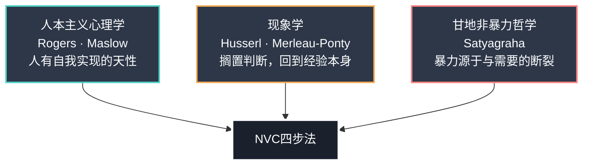
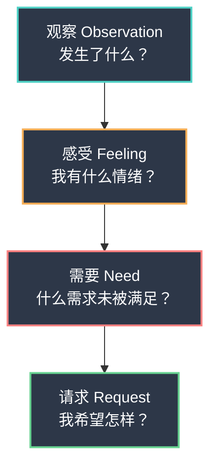
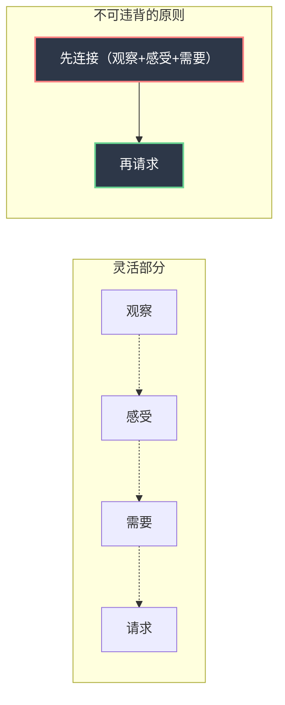

## 一、NVC四步法概述

非暴力沟通（Nonviolent Communication, NVC）的核心操作框架是四步法：**观察（Observation）、感受（Feeling）、需要（Need）、请求（Request）**。这四个要素不是一套话术模板，而是一种**思维操作系统**——它改变的不是你说什么，而是你如何理解自己和他人。

### 1.1 NVC四步法的起源与哲学根基

#### 1.1.1 马歇尔·卢森堡的实践起源

NVC四步法并非凭空设计的理论模型，而是马歇尔·卢森堡（Marshall Rosenberg, 1934—2015）在超过五十年的调解实践中逐步提炼出来的。卢森堡的个人经历深刻塑造了这一方法——他在底特律的种族冲突街区长大，童年时期亲身经历了基于种族、宗教和阶级的暴力。这些早期经历促使他追问一个根本问题：**是什么让人在冲突中把对方视为"敌人"，又是什么能让人们重新看到彼此的人性？**

卢森堡在威斯康星大学跟随人本主义心理学创始人卡尔·罗杰斯（Carl Rogers）完成临床心理学博士训练。罗杰斯的"无条件积极关注"和"共情理解"理论为NVC提供了心理学基础。此后，卢森堡深入研究了印度圣雄甘地的非暴力抵抗运动（Satyagraha），从中提炼出"非暴力"不仅是一种政治策略，更是一种日常沟通的哲学——**相信每个人都有天然的共情能力，暴力是后天习得的、可以被改变的**。

从1960年代开始，卢森堡在美国学校、社区和企业中实践调解工作，逐步形成了一套可教授、可复制的沟通框架。1970年代，他正式将这套方法命名为"非暴力沟通"（Nonviolent Communication），以向甘地的非暴力传统致敬。

#### 1.1.2 三大哲学支流

NVC四步法的理论架构融合了三个重要的思想传统：

**支流一：人本主义心理学（Carl Rogers, Abraham Maslow）**

罗杰斯认为，人类天生具有"自我实现"的倾向，但在成长过程中，大多数人学会了用"条件性价值"（conditional positive regard）来评判自己和他人——"只有当你满足我的期望时，你才是有价值的"。NVC的"需要"步骤直接继承了这一洞察：**当你说"我需要尊重"时，你不是在要求对方改变，而是在揭示一个关于人类本质的事实——所有人都有被尊重的深层需要。**

马斯洛的需求层次理论（Maslow's Hierarchy of Needs）为NVC的需求清单提供了分类学基础。NVC所列的七大需求类别——身体滋养、自主性、意义感、连接感、诚实、嬉戏、和谐——与马斯洛的生理需求、安全需求、社交需求、尊重需求和自我实现需求之间存在清晰的对应关系。

**支流二：现象学（Edmund Husserl, Maurice Merleau-Ponty）**

现象学的核心主张是"回到事物本身"（Zu den Sachen selbst）——搁置预设和判断，直接描述经验。NVC的"观察"步骤就是现象学方法的日常化应用：不要解释你看到的，不要评价你听到的，只要描述你能被摄像机记录下来的内容。这种"悬置判断"（epoché）的练习，训练的是将**原始感知**与**认知加工**分离的能力。

**支流三：甘地的非暴力哲学（Satyagraha）**

甘地的"Satyagraha"（真理之力）主张：暴力的根源不是人性的恶，而是人们在恐惧和匮乏感驱动下丧失了与自身需要的连接。卢森堡将这一政治哲学转化为个人层面的沟通实践——**当你能清晰地识别和表达自己的需要，你就不再需要用攻击、操控或回避来争取你想要的东西。**

### 1.2 四步法的完整框架

#### 1.2.1 基本句式结构

NVC四步法最基础的表达形式如下：

当我看到/听到 [观察：客观事实] 时，
我感到 [感受：真实情绪]，
因为我需要/看重 [需要：深层需求]。
你是否愿意 [请求：具体行动]？

一个完整的示例：

> 当我看到这周有三天你晚上十一点以后才到家（观察），我感到孤独和有些焦虑（感受），因为我需要亲密感和稳定感（需要）。你这周能不能选两天在九点前回来，我们一起吃晚饭？（请求）

这个句式是**学习阶段的脚手架**，不是终身使用的模板。它的目的是帮助初学者在内心建立"观察→感受→需要→请求"的思维路径。随着熟练度提高，你会逐渐脱离这个句式，用完全自然的语言表达NVC的精神。

#### 1.2.2 四步法的逻辑链条

四步法的每一步都是下一步的基础，形成一条严密的逻辑链：

| 步骤 | 核心问题 | 功能定位 | 对应能力 |
|------|----------|----------|----------|
| 观察 | 发生了什么具体事实？ | 建立共同事实基础，消除评判引发的防御 | 区分事实与评价 |
| 感受 | 我的内心状态是什么？ | 建立情感连接，让对方看到我的人性面 | 情绪觉察与命名 |
| 需要 | 什么需求驱动了这个感受？ | 找到冲突根源，将对话从立场之争转向需求理解 | 需求识别与表达 |
| 请求 | 我希望对方做什么？ | 创造具体改变的可能性，将理解转化为行动 | 提出可执行请求 |

四步之间不是简单的线性递进，而是存在**双向反馈回路**。当你在第四步提出请求后，对方的回应（同意、拒绝或协商）会成为新的观察输入，触发新一轮的四步循环。同样，当你在第三步识别出需要时，可能会重新审视第一步的观察——"等等，我注意到的事实是不是被我的情绪滤镜加工过了？"这种内省循环是NVC的深层价值所在。

#### 1.2.3 四步法的内在机制：对应人类冲突处理的认知阶段

为什么是这四步，而不是三步或五步？因为这四步精确对应了人类在冲突情境中的四个认知加工阶段——感知、情绪、意义建构和行动决策。NVC四步法本质上是对这一自然认知过程的**有意识引导**。

**第一步：观察——解决"事实被扭曲"的问题（感知阶段）**

人类大脑天生会对感知到的信息进行自动评判。神经科学研究表明，当信息进入杏仁核时，情绪反应先于理性判断（约快20毫秒）。这意味着我们"看到"的往往是经过情绪滤镜加工后的"故事"，而非事实本身。社会心理学中的"基本归因错误"（Fundamental Attribution Error）进一步加剧了这一扭曲——我们倾向于将他人的行为归因于其人格（"他就是懒"），而将自己的行为归因于情境（"我太忙了"）。

观察步骤要求我们暂停评判，回到可被摄像机记录的原始信息——这为后续对话创造了共同的事实基础。这一步的本质是**认知解耦**——将"我看到了什么"从"我对它有什么判断"中分离出来。

**第二步：感受——解决"情绪被压抑或伪装"的问题（情绪阶段）**

在大多数冲突中，人们要么压抑感受（"我没事"），要么用想法伪装感受（"我觉得你不尊重我"——这是想法，不是感受）。真正的感受只有两类：**需求被满足时的积极感受**（如开心、温暖、安心）和**需求未被满足时的消极感受**（如沮丧、焦虑、孤独）。

情绪神经科学的研究为这一步提供了理论支撑。安东尼奥·达马西奥（Antonio Damasio）的"躯体标记假说"（Somatic Marker Hypothesis）指出，情绪不是理性的敌人，而是决策的必要组成部分。当我们准确命名自己的情绪时（"我感到焦虑"而不是"我觉得被忽视了"），大脑的前额叶皮层活动增强，杏仁核活动降低——这被称为"情感标注效应"（Affect Labeling Effect）。简单地说，**给情绪命名本身就是一种情绪调节策略**。

表达真实感受能让对方放下防御，因为感受是不可争辩的——你不能告诉别人"你不应该感到难过"。

**中国文化语境的特殊挑战：** 在中国文化中，直接表达感受常被视为"太情绪化""不够成熟"。这导致很多人习惯用想法替代感受，或者干脆跳过感受直接指责。此外，中文的很多"感受词"实际上隐含了对对方的判断——"我感到委屈"暗含"你做了让我不公平的事"，"我感到心寒"暗含"你的行为辜负了我的期待"。应对策略：可以从较轻的感受词入手（"有点不习惯""稍微有些担心"），逐步培养表达感受的习惯；也可以通过书写而非口头来练习感受表达。

**第三步：需要——解决"停留在表面立场"的问题（意义建构阶段）**

这是四步法中最具转化力的一步。大多数冲突看似是关于具体行为的争论，实际上是对不同需求的表达。例如，伴侣吵架"你为什么不洗碗"，表面是对家务的分歧，深层可能是一方需要"被尊重"，另一方需要"休息和自主"。当双方都能看到彼此的需求时，冲突就从"谁对谁错"变成了"我们如何一起满足各自的需求"。

心理学中的"立场与利益"（Positions vs. Interests）理论——来自哈佛谈判项目——为这一步提供了学理支撑。罗杰·费希尔（Roger Fisher）和威廉·尤里（William Ury）在《Getting to Yes》中指出，人们在谈判中坚持的"立场"（position）背后总有更深层的"利益"（interest）。NVC的"需要"步骤就是将这一谈判理论应用于日常沟通——**不要争辩立场，要去理解立场背后的需要。**

当两个人都能看到彼此的需求时，他们会发现——对方不是敌人，只是和自己有不同需求的人。这种理解创造的不是妥协，而是真正的连接。卢森堡博士在卢旺达种族屠杀后的调解中发现，当图西族和胡图族的人听到彼此"需要安全""需要被看见"时，跨越民族的共情自然发生。

**第四步：请求——解决"空谈不落地"的问题（行动决策阶段）**

没有请求的NVC是不完整的。如果只表达感受和需求却不提出具体行动方案，对方可能表示理解但不知道该怎么做。请求将理解转化为行动，让改变真正发生。

这一步对应认知心理学中的"执行意图"（Implementation Intention）概念——彼得·戈尔维策（Peter Gollwitzer）的研究表明，将模糊的目标转化为"如果X发生，我就做Y"的具体计划，能将目标达成率从22%提高到62%。NVC的请求步骤就是帮助你将"我需要被尊重"这样的模糊需求转化为"下次朋友在场时，你能不能不要拿我的失误开玩笑"这样的可执行行动。

**四步法的完整认知映射：**

| 认知阶段 | NVC步骤 | 解决的问题 | 神经科学基础 |
|----------|---------|-----------|-------------|
| 感知 | 观察 | 事实被评判扭曲 | 杏仁核的情绪前置反应 vs 前额叶的理性加工 |
| 情绪 | 感受 | 情绪被压抑或伪装 | 情感标注效应：命名情绪降低杏仁核活动 |
| 意义建构 | 需要 | 停留在表面立场 | 立场-利益分层：从行为表象到需求本质 |
| 行动决策 | 请求 | 理解无法转化为行动 | 执行意图：从模糊目标到具体计划 |

### 1.3 四步法的本质：不是公式，而是思维框架

#### 1.3.1 NVC不是填空模板

初学者最常见的错误是把四步法当成填空题："当我看到___，我感到___，因为我需要___，请你___。"这种机械套用会让对话听起来生硬、不真诚，甚至让对方感到被操控——"你在跟我说话，还是在念公式？"

四步法真正的作用是提供一个**内心导航系统**。在任何对话中，你内心的思考路径应该是：

1. 眼前发生了什么？（观察）
2. 我的感受是什么？（感受）
3. 这个感受背后，我真正需要的是什么？（需要）
4. 为了让这个需求被满足，我可以请求什么？（请求）

这个内心过程可以完全不外显。你可以用极其自然的语言表达NVC的精神，而不必说出任何一个"标准句式"。

**两种表达模式的对比：**

模式A：机械套用（听起来像机器人）
"当我看到你这周有三天没有洗碗时，我感到不满，
因为我需要整洁和分担。请你从今天开始每天洗碗。"

模式B：内化后自然表达（听起来像真实的人）
"这周碗都是我洗的，说实话挺累的。你看咱俩能
怎么分担一下？"

模式B没有一个字在说"观察""感受""需要""请求"，但四步法的精神完全在里面：观察（碗都是我洗的）→ 感受（挺累的）→ 需要（分担）→ 请求（怎么分担一下）。NVC的目标不是让你说话像教科书，而是让你的思维路径比教科书更清晰。

#### 1.3.2 形式灵活，原则不变

NVC的四步法在实际运用中有极大的灵活性：

**不必每次都说全四步。** 有时候一句"我需要安静几分钟"就是一次有效的NVC表达——它隐含了观察（当前环境让我不舒服）、感受（我感到压力）、需要（我需要平静）、请求（给我几分钟），只是没有逐项展开。

**顺序可以调整。** 在某些场景中，先说请求反而更有效。例如在紧急情况下："请你先停下来（请求），因为当你这样大声说话的时候（观察），我感到害怕（感受），我需要安全的沟通环境（需要）。"

**可以只用其中一步。** 有时候最有效的NVC行为就是纯粹的观察——"我注意到你今天说话比平时少"——这句话可能比完整的四步表达更能打开对话。

**可以只用两步。** 服务场景中，"我预约了三点，现在三点半了（观察），能帮我确认一下还有多久吗？（请求）"——两步就够了，不需要在餐厅前台面前表达你的深层感受和人生需求。

**但有一条原则不可违背：先连接，再请求。** 如果没有先建立情感连接（通过观察和感受），直接提出请求往往会变成命令。对方的回应取决于他们是否感到被理解——在感到被理解之前，任何请求都会被视为要求。这不是NVC的主观偏好，而是人类大脑的基本运作方式：当感到被威胁时，人类不会合作，只会防御或反击。

#### 1.3.3 四步法 vs 其他表达框架

理解NVC四步法的独特性，可以通过与其他常见框架的对比来实现：

| 对比维度 | NVC四步法 | "我"信息（I-Message） | DESC法 | 三明治反馈法 |
|----------|----------|----------------------|--------|-------------|
| 结构 | 观察→感受→需要→请求 | "当…我感到…因为…" | 描述→表达→具体→结果 | 肯定→改进→肯定 |
| 核心关注 | 需求驱动，关注"为什么" | 关注感受表达 | 关注行为改变 | 关注接受度 |
| 是否包含需求 | 明确第三步为需求识别 | 隐含但不显式 | 不包含 | 不包含 |
| 对倾听者的要求 | 需要双方都理解NVC | 无特殊要求 | 无特殊要求 | 无特殊要求 |
| 适用深度 | 可深可浅，适合深度对话 | 适合浅层冲突 | 适合职场反馈 | 适合日常反馈 |
| 核心局限 | 初期学习曲线陡峭 | 容易变成"你让我…"的指责 | 缺乏情感连接 | 容易显得虚伪 |

NVC四步法的**独特优势**在于它的第三步——需求识别。这是其他框架都不具备的维度。"我"信息停在感受，DESC法停在行为，三明治法停在反馈；只有NVC追问"这个感受背后的需求是什么"，从而把对话从表面行为推向深层理解。

**另一个关键区别：** NVC不仅是"表达工具"，更是"倾听工具"。其他三个框架主要教你"怎么说"，而NVC同时教你"怎么听"——当你听到对方说"你从来不考虑我"时，NVC教你听到的不是攻击，而是"我需要被关心"。这种倾听能力是其他框架不具备的。

#### 1.3.4 NVC的"近敌"：看起来像NVC但不是NVC的做法

佛教修行中有一个概念叫"近敌"（near enemy）——一种品质的扭曲版本，外表与正品极其相似，但本质完全相反。NVC四步法也有几个常见的"近敌"，初学者尤其容易落入这些陷阱：

| 近敌 | 表面上像什么 | 实际是什么 | 区分方法 |
|------|------------|-----------|---------|
| **评判伪装成观察** | "我观察到你很自私" | 用"我观察到"包装评判 | 问自己：这句话去掉"我观察到"之后，是事实还是评价？ |
| **"我感到你…"句式** | "我感到你在操控我" | "我感到"后面接的是对他人的判断，不是感受 | 检验：能在前面加"我觉得"且去掉后仍是对他人的判断吗？ |
| **需求变成策略** | "我需要你每天给我打电话" | 具体行为要求不是需求，是策略 | 换一个人、换一种方式能同样满足吗？如果能，是需求；不能，是策略 |
| **请求变成要求** | "你能不能…？"（但不接受"不"） | 形式是问句，实质是最后通牒 | 对方说"不"后，你会生气、施压或冷暴力吗？ |
| **NVC操控术** | 用四步法"包装"真实目的 | 学了NVC的句式但用来说服/操控对方 | 你的目标是理解对方，还是让对方听你的？ |
| **强制积极** | 跳过消极感受直接说"但我感恩…" | 用正能量压制真实情绪 | 你是在表达感受，还是在逃避感受？ |

NVC的"近敌"之所以危险，是因为使用它的人可能真诚地相信自己在做NVC。识别近敌的最有效方法是**自问一个根本问题：我此刻的目标是建立连接，还是赢这场对话？**如果答案是后者，无论你的语言多"非暴力"，你在做的都不是NVC。

### 1.4 四步法的分步概览

本节为四步法的全景概述，后续各节将对每一步进行深度展开。以下是对每一步的核心要义进行简明介绍。

#### 1.4.1 第一步：观察（Observation）

**定义：** 客观描述你看到、听到、触摸到的具体事实，不加入任何评判、推论或标签。

**核心区分：**

观察（摄像机能记录的）          评论（加入了主观判断）
──────────────────          ──────────────────────
"你这周有三天晚上十点后到家"    "你总是这么晚回家"
"会上你三次打断了我的发言"      "你根本不尊重我"
"报告有两处数据没有标注来源"    "你的报告太不认真了"
"你连续三天没洗碗"             "你太懒了"

**为什么放在第一步：** 如果一开口就是评判（"你怎么这样！"），对方的杏仁核会在0.2秒内激活防御反应，后面的对话无论多真诚都很难被听进去。用观察开场，对方的大脑保持理性运作状态，才能真正"听见"你后面的话。戈特曼的研究（Gottman, 1999）表明，对话的前三分钟决定了整场对话的走向——以评判开场的冲突升级概率是以观察开场的4.3倍。

**常见陷阱：** 把形容词伪装成观察。"你很冷漠"看起来像是在描述，实际上是评判。检验标准——如果换一个人来看同样的场景，他会得出完全不同的结论吗？如果会，那就是评判而非观察。

**详细内容见：** 本节第二篇「第一步：观察（Observation）」

#### 1.4.2 第二步：感受（Feeling）

**定义：** 准确命名你当下的真实情绪状态，而不是用想法伪装成感受。

**核心区分：**

真正的感受                       伪装成感受的想法
──────────                     ──────────────────
"我感到沮丧"                     "我觉得你不尊重我"
"我感到焦虑"                     "我觉得被忽视了"
"我感到孤独"                     "我觉得你不在乎我"
"我感到开心"                     "我觉得你是对的"

判断标准：如果可以在这句话前面加上"我觉得"而不改变意思，那它就是想法而非感受。"我觉得我很沮丧"——仍然是感受；"我觉得你不在乎我"——去掉"我觉得"变成"你不在乎我"，这是一个对他人的判断，不是感受。

**为什么需要这一步：** 表达真实感受能建立情感连接。当你说"我很沮丧"时，对方可能产生同理心；当你说"你让我很沮丧"时，对方会立刻辩解。感受是不可争辩的——你无法否认别人的内心体验，但你可以争辩别人对你的判断。

**中国文化的特殊挑战：** 在中国文化语境中，直接表达感受常被视为"太情绪化""不够成熟"。这导致很多人习惯用想法替代感受，或者干脆跳过感受直接指责。应对策略：可以从较轻的感受词入手（"有点不习惯""稍微有些担心"），逐步培养表达感受的习惯；也可以通过书写而非口头来练习感受表达。

**详细内容见：** 本节第三篇「第二步：感受（Feeling）」

#### 1.4.3 第三步：需要（Need）

**定义：** 识别并表达驱动你感受的深层需求——那些普世的、所有人都有的基本人类需要。

**核心区分：**

需要（普世的、深层的）           策略（具体的、表面的）
───────────────────          ──────────────────────
"我需要被尊重"                  "你必须道歉"
"我需要亲密感"                  "你每天要给我打电话"
"我需要安全感"                  "你不能跟异性单独吃饭"
"我需要自主权"                  "你不要管我"

策略是满足需求的具体方式，而需求本身是更深层的。理解这个区分是解决冲突的关键——当双方争执"你必须道歉"vs"我不觉得我有错"时，其实是两个策略在打架。如果转到需求层面："我需要被尊重"和"我需要被理解"，这两个需求并不冲突，完全可以同时被满足。

**为什么这一步最有转化力：** 当两个人都能看到彼此的需求时，他们会发现——对方不是敌人，只是和自己有不同需求的人。这种理解创造的不是妥协，而是真正的连接。卢森堡博士在卢旺达种族屠杀后的调解中发现，当图西族和胡图族的人听到彼此"需要安全""需要被看见"时，跨越民族的共情自然发生。

**基本需求清单（NVC标准分类）：**

| 需求类别 | 具体需求 | 说明 |
|----------|----------|------|
| 身体滋养 | 食物、水、休息、住所、运动、安全感、身体接触 | 生理层面的基本需求，满足是其他需求的前提 |
| 自主性 | 选择自由、独立、空间、自主权 | 对自我决定权的需要，与被控制感相对 |
| 意义感 | 创造力、贡献、目标、价值实现 | 感到自己的存在有意义、对他人有贡献 |
| 连接感 | 爱、归属、亲密、信任、理解、尊重、支持 | 与他人建立真实关系的需要 |
| 诚实 | 真实、真诚、一致性、透明 | 对真诚沟通和言行一致的需要 |
| 嬉戏 | 乐趣、幽默、放松、探索 | 享受生活、不被压力完全占据的需要 |
| 和谐 | 平衡、美、秩序、稳定 | 对环境和关系处于可预期状态的需要 |

这个清单不是穷尽的——它是一个起点，帮助你在感受出现时快速定位背后可能的需要。随着练习的深入，你会发展出对自己独特需求模式的敏感度。比如，你可能发现自己对"自主性"的需求特别强烈，而你的伴侣对"连接感"的需求特别强烈——理解这种差异本身就是关系改善的开始。

**详细内容见：** 本节第四篇「第三步：需要（Need）」

#### 1.4.4 第四步：请求（Request）

**定义：** 提出具体、可行、正向的行动方案，并且真诚地允许对方说"不"。

**核心区分：**

请求（对方可以说不）             要求（对方不许拒绝）
────────────────              ────────────────────
"你这周能抽一天早点回来吗？"     "你必须每天八点前到家"
"你愿意听我说完吗？"            "你闭嘴听我说"
"你能告诉我你的想法吗？"        "你必须给我一个解释"

**判断标准：** 对方说"不"之后你的反应。如果你能平静地说"好的，我理解，我们还有其他选择吗"，那是请求；如果你生气、施压、冷暴力，那就是要求。

**好请求的三个特征：**

1. **具体**——"对我好一点"不是请求，"这周六下午陪我去公园散步一小时"是请求
2. **正向**——"你能不能别玩手机了"是否定式请求，换成"你愿意在晚饭时间和我聊天吗"是正向请求。否定式请求的问题在于，它告诉对方"不要做什么"却没有说"要做什么"，让对方不知道该采取什么行动
3. **当下可执行**——"以后对我好一点"太模糊，"接下来一小时你能陪我聊聊吗"是可执行的。好请求包含时间框架和行动细节

**好请求 vs 坏请求的快速检验：**

| 检验维度 | 好请求 | 坏请求 |
|----------|--------|--------|
| 具体性 | "这周五晚上我们能一起做饭吗？" | "你能不能多花点时间陪我？" |
| 正向性 | "你愿意在讨论时让我把话说完吗？" | "你能不能别老打断我？" |
| 可执行性 | "接下来半小时我们能一起看看这个方案吗？" | "你以后要更重视我的意见" |
| 可拒绝性 | 对方说"这周五不行"→"那周六呢？" | 对方说"不行"→沉默/叹气/翻旧账 |

**详细内容见：** 本节第五篇「第四步：请求（Request）」

### 1.5 四步法的使用场景与模式

#### 1.5.1 两种使用模式

NVC四步法有两种根本不同的使用模式：**自我表达**和**倾听他人**。大多数初学者只关注前者，但倾听他人同样重要——有时甚至更重要。

**模式一：自我表达（我→你）**

当我有某种强烈感受需要表达时，用四步法组织自己的表达：

"当你在朋友面前拿我的失误开玩笑时（观察），
我感到尴尬和有些受伤（感受），
因为我看重在社交场合被尊重（需要），
以后如果有类似情况，你能私下跟我聊吗？（请求）"

**模式二：倾听他人（你→我）**

当对方向你发泄情绪或表达不满时，用四步法的逻辑来理解对方：

对方说："你从来不考虑我的感受！"

你内心的NVC解码：
- 观察：（对方需要先说出具体事件，你可以引导）
- 感受：对方感到受伤、被忽视
- 需要：对方需要被关心、被看见
- 请求：（对方还没想好，你可以帮ta探索）

你的回应：
"你是不是在说最近有什么具体的事让你觉得受伤了？（引导观察）
你是不是感到有些委屈和不被理解？（反馈感受+需要）
你希望我怎么关注你的感受呢？（探索请求）"

倾听模式的核心技巧是**反馈**——不是反驳、不是解释、不是建议，而是用你自己的话重述你听到的观察、感受、需要和请求。这种反馈让对方感到"被听见了"，而"被听见"本身往往就能化解大部分攻击性。卢森堡说："当一个人感到被真正理解了，他会愿意听你说任何话。"

#### 1.5.2 完整应用示例

以下是一个完整的NVC对话示例，展示四步法在实际对话中的运作方式：

**场景：** 伴侣之间的家务分工冲突。

| 说话人 | 对话内容 | NVC分析 |
|--------|----------|---------|
| A | "这周的碗全是我洗的，你一次都没洗。" | 观察：用具体事实开场 |
| B | "你又在说我懒。" | 豺狗语言：把观察误读为评判 |
| A | "我不是说你懒。我是说这件事让我挺累的，因为我需要我们能一起分担。你这周能不能负责后三天的碗？" | 感受→需要→请求的完整表达 |
| B | "这周工作太忙了，每天到家都十点了。" | 表达了自己的困难 |
| A | "听起来你这周工作压力很大（反馈对方感受），你是不是也需要休息？（反馈对方需求）那我们看看有没有别的方式——要不周末我做简单菜你负责洗，工作日我们点外卖减轻负担？" | 倾听对方需求后提出替代策略 |

**分析：** A从观察开场避免了B的防御反应，B的防御反应（"你又在说我懒"）被A用感受+需求的表达化解，最终双方从"谁该洗碗"的立场之争进入了"如何一起减轻家务负担"的需求合作。注意A的第三轮回应——当B表达了自己的困难后，A没有反驳（"那你也不能什么都不做"），而是先反馈对方的感受和需要（"你工作压力大，也需要休息"），然后提出一个同时满足双方需求的替代方案。这是NVC从"表达工具"升级为"问题解决工具"的关键时刻。

#### 1.5.3 四步法在不同关系中的调整

NVC四步法的原则是普世的，但在不同关系中需要调整表达方式：

| 关系类型 | 调整要点 | 原因 | 示例调整 |
|----------|----------|------|----------|
| 亲密关系 | 可以更直接表达感受，使用更亲密的措辞 | 高信任基础，允许更多情感暴露 | "我感到孤独"可以更具体为"晚上你玩手机不跟我说话时，我感到被冷落了" |
| 职场关系 | 侧重观察和请求，感受表达相对克制 | 专业边界要求，避免情绪化印象 | "我注意到会议议程没有被提前分享（观察），这导致准备不充分，我们能提前三天发议程吗？（请求）" |
| 亲子关系 | 观察和请求要更具体，感受表达用孩子能理解的语言 | 孩子的认知发展水平限制了抽象理解 | "我看到作业本上有五道题没写完（观察），我有点担心（感受），因为学习对你很重要，你能现在花二十分钟写完吗？（请求）" |
| 跨代沟通 | 减少"你"开头的句子，多用"我们"和"咱们" | 中国文化中对长辈直接表达需要的文化敏感性 | 避免"你让我很失望"，改为"咱们家一直看重互相支持，我最近有些失落" |
| 陌生/服务场景 | 四步法高度精简，可能只用观察+请求两步 | 关系基础薄弱，过度表达感受不自然 | "我预约了三点，现在三点半了还没轮到（观察），能帮我确认一下还有多久吗？（请求）" |

#### 1.5.4 数字化沟通中的NVC

在短信、微信、工作群等文字沟通场景中，NVC四步法面临独特的挑战——**缺乏语气、表情和肢体语言**，观察性文字容易被误读为冷冰冰的指责。

**文字NVC的五条原则：**

1. **观察要更精确。** 文字中没有语调软化，"这周你三次没回我消息"可能读起来比口头说更刺眼。加上上下文——"我知道你这周特别忙，我注意到有三条消息没来得及回"。

2. **感受要显式标注。** 口头沟通中，你的眼神和语调会传递情感信息；文字中没有这些。所以"我挺失落的"比"嗯好吧"清晰得多。

3. **用表情符号辅助（适度）。** 一个😢或😔可以弥补文字中缺失的情感信息，但不要用表情符号替代文字表达——"你很过分😤"不是NVC。

4. **避免在情绪激动时发文字。** 文字沟通的危险在于，你有时间斟酌却容易过度思考，或者冲动发送后无法撤回感受的冲击。如果情绪强烈，先写一个草稿，过30分钟再发送。

5. **重要对话请用语音或面谈。** NVC最有力的部分是情感连接，而情感连接在文字中是最弱的。如果对话涉及关系核心问题，请优先选择面谈或至少语音通话。

### 1.6 四步法的学习路径

#### 1.6.1 从生硬到自然的四个阶段

掌握NVC四步法不是一蹴而就的。根据NVC培训体系的经验，学习者通常经历四个阶段：

**阶段一：无意识不胜任（不知道自己不会）**

在接触NVC之前，大多数人不知道自己的沟通方式存在问题。"我就事论事有什么错？""我已经很克制了！"这些反应说明尚未意识到自己常用的沟通模式是暴力的。这个阶段的特征是：你觉得沟通问题都是对方的错。

**阶段二：有意识不胜任（知道自己不会）**

学了NVC四步法之后，很多人反而更痛苦了——因为现在你能听到自己和他人话语中的评判、比较、指责了，但你还不知道怎么改。这个阶段会持续数周到数月，是正常的。很多人在这个阶段放弃，觉得"以前至少不用这么纠结"。**坚持住——这个"更痛苦"的阶段恰恰是成长正在发生的信号。**

**阶段三：有意识胜任（会，但需要刻意练习）**

经过一段时间的练习，你开始能够在低风险场景中自然运用四步法。在情绪不太激动的日常对话中，你能做到观察而非评判、表达感受而非想法。但在高压场景（激烈争吵、被攻击时）中，你仍然会"掉回"旧模式。

**阶段四：无意识胜任（自然而然就会了）**

经过数月到数年的持续练习，NVC思维模式成为你的默认设置。你不再需要在脑中过一遍"观察→感受→需要→请求"，而是自然地以非暴力的方式倾听和表达。这个阶段不意味着你永远不会"掉回去"——卢森堡博士自己也承认在极端情境中仍会失去NVC状态——但你能更快觉察、更快回归。

#### 1.6.2 各阶段的里程碑标志

| 阶段 | 核心标志 | 检验方法 |
|------|----------|----------|
| 阶段一→阶段二 | 你第一次意识到"我刚才说的话其实是评判" | 回顾一次冲突，能识别出自己的评判性语言 |
| 阶段二→阶段三 | 你第一次在低风险对话中完整使用了四步法 | 和同事/朋友的日常对话中，事后复盘发现自己做到了观察+感受+需要+请求 |
| 阶段三→阶段四 | 你在高压冲突中自动切换到NVC模式 | 和伴侣/家人的激烈争吵中，不需要提醒就能自然使用NVC |
| 阶段四→精通 | 你能教别人使用NVC | 你向朋友解释NVC时，对方能在实际对话中运用 |

#### 1.6.3 NVC四步法自评清单

用以下清单评估你当前对四步法各步骤的掌握程度。评分标准：1=完全不会，2=理解概念但无法应用，3=能在低风险场景中应用，4=能在大多数场景中应用，5=自然内化，无需刻意思考。

**观察能力自评：**

- [ ] 我能在对话前区分"我看到的事实"和"我对事实的判断"（评分：___）
- [ ] 我能避免使用"总是""从不""每次"等概括性词语（评分：___）
- [ ] 我能用具体的时间、频率、数量来描述事件（评分：___）
- [ ] 在情绪激动时，我仍然能先描述事实而非先下结论（评分：___）

**感受能力自评：**

- [ ] 我能区分"感受"和"想法"（如区分"我感到焦虑"和"我觉得你不关心我"）（评分：___）
- [ ] 我至少能命名10种不同的情绪（不只是"开心""不开心""生气"）（评分：___）
- [ ] 我能在对话中直接表达感受，而不是用行为暗示（评分：___）
- [ ] 我表达感受时不会让对方觉得是在指责（评分：___）

**需要能力自评：**

- [ ] 我能从感受出发追溯到背后的需要（评分：___）
- [ ] 我能区分"需要"和"策略"（如区分"我需要安全感"和"你不能跟异性吃饭"）（评分：___）
- [ ] 我能承认自己的需要而不觉得"太矫情"或"太自私"（评分：___）
- [ ] 我能在冲突中看到对方行为背后的需要（评分：___）

**请求能力自评：**

- [ ] 我的请求包含具体的时间、行为和场景（评分：___）
- [ ] 我的请求是正向的（说"要什么"而非"不要什么"）（评分：___）
- [ ] 我能真诚地接受对方说"不"而不施压（评分：___）
- [ ] 当对方拒绝时，我能探索替代方案而非生闷气（评分：___）

**总分解读：** 16-24分=阶段一到阶段二（入门期），25-48分=阶段二到阶段三（成长期），49-64分=阶段三到阶段四（熟练期），65-80分=阶段四到精通（内化期）。

#### 1.6.4 实践建议

**从低风险场景开始练习。** 不要在和伴侣最激烈的冲突中首次运用NVC。先从和快递员、收银员、同事的日常对话开始练习观察和感受表达。这些场景情绪负荷低，允许你犯错和调整。

**每天做一个微型练习。** 选一天中的一个对话，事后用NVC四步法重新分析：刚才发生的事实是什么（观察）？我的感受是什么（感受）？背后的需求是什么（需求）？我实际说了什么？如果用NVC我会怎么说？

**准备一张NVC提醒卡。** 把四步法写在一张小卡片上，放在钱包或手机壳里。在感觉对话即将升级时，找借口去洗手间，看一下卡片，回来时用NVC重新开始对话。卡片内容不需要复杂——"观察？感受？需要？请求？"六个字就够了。

**找到练习伙伴。** 找一个也对NVC感兴趣的人，每周做一次15分钟的角色扮演——一个人扮演用豺狗语言说话的人，另一个人练习用NVC倾听和回应。互换角色。角色扮演的价值在于：它让你在安全环境中体验高压对话中的NVC应用，缩小"低风险场景胜任"和"高压场景胜任"之间的差距。

**写NVC日记。** 每天晚上花5分钟写下一个当天的冲突或不舒服的互动，用四步法分析。格式：

日期：____
事件：____
观察（事实）：____
感受（情绪）：____
需要（深层需求）：____
请求（我实际说了什么？NVC会怎么说？）：____

这个练习的目的是加速从"有意识不胜任"到"有意识胜任"的过渡——通过书面分析降低认知负荷，让你在没有情绪干扰的情况下训练四步法思维。

### 1.7 常见疑问解答

**问：四步法会不会让对话变得太"套路化"？**

答：如果你把四步法当填空题来用，确实会。但如果你把它当成思维框架来内化，就不会。就像学开车一样——新手需要想"先踩离合，再挂挡，慢慢松离合"，但熟练之后你不需要想这些。四步法的目标是内化为思维习惯，而不是每次对话都"走程序"。检验标准很简单：如果对方觉得你在"好好说话"而不是"在念公式"，你就做对了。

**问：如果对方不懂NVC怎么办？**

答：NVC不需要双方都学过才能使用。你只需要用NVC的思维来倾听和表达，对方自然会感受到对话质量的变化。事实上，NVC最有力的应用场景之一，就是只有你一个人在用NVC——通过你的观察式表达和共情倾听，化解对方的攻击性语言。卢森堡经常说："NVC的美妙之处在于，你只需要改变一个人——你自己——就能改变整场对话的走向。"

**问：在中国文化中，直接说"我感到…"会不会太矫情？**

答：这取决于你用什么词。"我感到委屈""我有点担心"在中国文化中是完全可以接受的表达。"我感到被背叛了""我渴望灵魂的连接"这类过于文艺或过于强烈的表达可能让对方不适。关键是用词要符合你的个人风格和具体关系，而不是照搬书上的"标准感受词"。此外，NVC不一定要用"我感到…"的句式——你可以用更自然的方式表达感受，比如"说实话，这事儿让我挺闹心的"。

**问：四步法在紧急情况下有用吗？**

答：紧急情况下不适合完整使用四步法。如果你处于人身安全受威胁的场景，首要任务是保护自己，而不是进行非暴力沟通。NVC最适合的是日常冲突和关系修复——那些你有时间、有空间进行对话的场景。在紧急场景中，一个简化的版本是有效的：快速观察（"你现在拿着刀"）+ 快速请求（"请你把刀放下"），不加感受和需求。

**问：学会了四步法就等于学会NVC了吗？**

答：远没有。四步法是NVC最基础的操作层面，但NVC的完整体系还包括：共情倾听的深度技巧、自我共情（Self-Empathy）、调解冲突的高级方法、NVC的精神内核（对人性的基本信任）。四步法是进入NVC世界的入口，但不是全部。正如本节开头所说，四步法不是一套话术，而是一种看待人与人关系的哲学——真正掌握它需要持续的学习和实践。

**问：NVC会不会让我变成"讨好型人格"？**

答：这是一个非常重要且常见的误解。NVC不是让你放弃自己的需要去满足对方——恰恰相反，NVC的第三步（需要识别）要求你**清晰地知道自己要什么并大声说出来**。讨好型人格的特征是压抑自己的需要、回避冲突、过度适应对方；而NVC鼓励你直接表达需要，同时尊重对方的需要。区别在于：讨好者说"都行，你决定吧"（实际上内心有需要但不敢说），NVC实践者说"我需要X，你也需要Y，我们看看怎么同时满足"。

**问：对方一直用暴力语言攻击我怎么办？四步法没用啊。**

答：四步法不是万能的。在某些场景中——对方处于极度愤怒、精神崩溃或恶意攻击状态——四步法的温和表达可能无法穿透对方的情绪壁垒。此时的策略是：先用NVC倾听模式（不反驳、不解释、只反馈对方的感受和需要），如果对方仍然升级攻击，保护自己优先——"我能感受到你现在非常愤怒，我需要暂时离开一下，等我们都冷静了再聊。这不是逃避，是为了让我们都能好好沟通。"NVC不等于无限度地承受暴力。

**问：NVC是不是西方文化产物，在中国水土不服？**

答：NVC的核心理念——同理心、倾听、尊重需要——是普世的，不存在"水土不服"的问题。需要调整的是表达方式和词汇选择。中国文化中的"己所不欲勿施于人""将心比心""以和为贵"与NVC的精神高度一致。中国传统文化中的"恕道"（推己及人）就是NVC共情倾听的古典表达。需要本土化的是：感受词汇的选择、直接程度的调节、以及对"面子"文化的敏感性——而不是NVC的核心原则。

### 1.8 本节小结

| 要点 | 核心内容 |
|------|----------|
| 四步法结构 | 观察→感受→需要→请求，每步都是下一步的基础 |
| 哲学根基 | 人本主义心理学 + 现象学 + 甘地非暴力哲学 |
| 认知映射 | 四步对应感知→情绪→意义建构→行动决策四个认知阶段 |
| 本质 | 思维框架而非话术模板，内心导航系统 |
| 灵活性 | 顺序可调、可省略步骤，但"先连接再请求"不可违背 |
| 独特优势 | 第三步"需要识别"是其他框架不具备的维度 |
| 近敌识别 | 评判伪装观察、"我感到你…"、需求变策略、请求变要求、NVC操控术、强制积极 |
| 两种模式 | 自我表达（我→你）和倾听他人（你→我） |
| 场景调整 | 不同关系、不同媒介（面对面/文字）中表达方式需灵活调整 |
| 学习路径 | 从无意识不胜任到无意识胜任的四阶段进化 |
| 自评工具 | 四维度16项自评清单，量化当前掌握程度 |
| 核心原则 | 四步法是NVC的入门工具，不是NVC的全部；NVC不等于讨好 |

> **下一步行动：** 阅读本节下一篇「第一步：观察（Observation）」，开始深入学习四步法中的第一步——这是一切的基础。在阅读之前，你可以先做一个小练习：回想今天发生的一件让你不太舒服的事，试着用"摄像机测试"写出一个纯观察版本，再写一个你通常会说的"评论版本"，感受两者之间的差异。然后，试着用自评清单给自己打分——知道自己在哪个阶段，才能找到最有效的练习方式。
