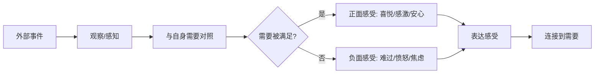

## 三、第二步：感受（Feeling）

在非暴力沟通四步法中，"感受"是继"观察"之后的第二步。观察帮我们剥离评判、锁定事实，而感受则要求我们转向内心，把事实引发的情绪体验如实说出来。这一步看似简单——谁不会说自己高兴或难过？——却是整个 NVC 框架中被误用最多的环节。大量沟通冲突的根源并非人们不愿表达感受，而是人们把想法、判断、推论当成了感受，或者干脆用"你让我……"的句式把感受的责任推给了对方。

马歇尔·卢森堡在《非暴力沟通》中反复强调：**感受是通向需要的桥梁**。当我们准确命名自己的感受，就打开了一扇门——门后是更深层的需要。如果我们在这一步走偏，后续的"需要"和"请求"都会建立在错误的地基上。

### 3.1 感受的本质：身心对需要是否被满足的信号

感受不是凭空出现的情绪波动，而是我们的身心对"某个需要是否正在被满足"发出的实时信号。这个定义包含三层含义：

1. **感受有来源**——它总是指向某个具体的需要（虽然我们不一定能立刻意识到是哪个需要）。
2. **感受是信息**——它告诉我们当前的状态，类似于身体的疼痛信号告诉我们哪里受伤了。
3. **感受不是事实的全部**——同一个事实可以引发不同的感受，因为不同人的需要不同。

#### 感受的发生机制

**关键洞察**：感受的触发器不是外部事件本身，而是我们对该事件是否满足自身需要的判断。这意味着两个人面对同一个事件（比如伴侣加班晚归），完全可能产生截然不同的感受——一个人感到孤独，另一个人却感到放松（因为获得了独处空间）。两人的感受差异来自他们当下不同的需要。

#### 感受与情绪的学术区分

在心理学文献中，"感受"（feeling）和"情绪"（emotion）并非完全同义。神经科学家安东尼奥·达马西奥（Antonio Damasio）在《笛卡尔的错误》中做出如下区分：

- **情绪（emotion）**：是身体对刺激的自动反应模式，包括神经递质释放、心率变化、肌肉张力改变等。情绪是生物性的、自动的、快速的。
- **感受（feeling）**：是大脑对这些身体变化的主观觉知和认知标签。感受是意识层面的、可以被命名的、需要一定认知加工的。

换句话说，情绪先于感受发生——你的心跳加速（情绪反应）在先，你意识到"我感到焦虑"（感受命名）在后。NVC 中所说的"表达感受"，准确地说是将已经发生的情绪反应用语言标签化，使之进入意识层面，从而获得处理的可能性。

### 3.2 感受与想法的核心区别

这是 NVC 初学者最容易踩的坑。日常语言中，"我觉得……"既可以引出感受，也可以引出想法，我们对此几乎不加区分。但在 NVC 中，这两者有本质不同：

| 维度 | 感受（Feeling） | 想法/判断（Thought/Judgment） |
|------|----------------|------------------------------|
| 指向 | 向内——描述自己内心的状态 | 向外——对他人或情境的评价 |
| 可验证性 | 只有自己能确认 | 可以被辩论、反驳 |
| 典型句式 | "我感到……" | "我觉得（某人/某事）……" |
| 效果 | 引发同理心，拉近距离 | 容易引发防御，制造对立 |
| 示例 | "我感到焦虑" | "我觉得这件事很不靠谱" |
| 生理基础 | 前岛叶皮层、前扣带回（内感受） | 前额叶外侧皮层（认知评估） |

#### 识别"伪感受"的三种模式

**模式一：含评判的想法伪装成感受**

- "我觉得被忽视了" → 这是"你忽视了我"的隐性指控，不是感受
- 真正的感受：**"我感到孤独"** 或 **"我感到受伤"**
- 判断标准：如果这句话可以加上"你"作为主语（"你忽视了我"），它就是想法而非感受

**模式二：对他人的推测伪装成感受**

- "我觉得你不爱我了" → 这是对你内心状态的猜测，不是我的感受
- 真正的感受：**"我感到害怕"** 或 **"我感到不安全"**
- 判断标准：如果你能用摄像机验证（"你确实不爱我了"需要读心术），它就不是感受

**模式三：被动语态隐藏了感受**

- "我感到被背叛了" → "被背叛"暗示有一个背叛者，已包含对他人行为的定性
- 真正的感受：**"我感到受伤、愤怒和深深的失望"**
- 判断标准：如果句子是被动语态（"被……"），通常需要转换为主动语态来找到真实感受

#### 快速自检公式

当你不确定自己说的是感受还是想法时，用这个公式检验：

> **"去掉'我觉得/我感到'之后，剩下的词能否被反驳？"**

- "我感到愤怒" → "愤怒"无法被反驳，只有我自己知道 → **这是感受**
- "我觉得不公平" → "不公平"可以被反驳（"这很公平啊"） → **这是想法**
- "我觉得被抛弃了" → "被抛弃"需要确认别人的行为意图，可以被反驳 → **这是想法**

#### 完整转换对照表

以下列出日常表达中常见的"伪感受"及其对应的真正感受，涵盖多个生活场景：

| 伪感受（实为想法/判断） | 真实感受 | 背后的需要 |
|------------------------|---------|-----------|
| 我觉得被忽视了 | 孤独、失落 | 连接、被看见 |
| 我觉得不被尊重 | 受伤、沮丧 | 尊重、平等 |
| 我觉得不公平 | 愤怒、委屈 | 公平、正义 |
| 我觉得被控制了 | 压抑、窒息 | 自主、自由 |
| 我觉得你不在乎我 | 害怕、悲伤 | 关爱、重视 |
| 我觉得自己没用 | 失望、无力 | 价值感、能力感 |
| 我觉得被利用了 | 愤怒、不信任 | 公平、真诚 |
| 我觉得你太自私了 | 受伤、失望 | 关怀、相互性 |
| 我觉得被抛弃了 | 恐惧、孤独 | 安全感、归属 |
| 我觉得压力很大 | 焦虑、疲惫 | 支持、休息 |
| 我觉得被误解了 | 委屈、沮丧 | 被理解、表达空间 |
| 我觉得被评判了 | 不安、羞耻 | 接纳、包容 |
| 我觉得没有话语权 | 愤怒、无力 | 参与、尊重 |
| 我觉得不被信任 | 受伤、失望 | 信任、能力被认可 |
| 我觉得被敷衍了 | 失落、不被重视 | 认真对待、重视 |

### 3.3 负责任的表达：从"你让我"到"我感到"

NVC 对感受表达有一个硬性要求：**用"我"开头，不用"你"开头**。这不是语法偏好，而是深层的哲学立场——我们为自己的感受负责。

#### 两种语言模式对比

**豺狗语言（Jackal Language）——归咎他人**：

豺狗语言是 NVC 术语中对"暴力沟通方式"的称呼。它的特征是把感受的责任推给对方：

- "你让我很生气" → 暗示：你控制了我的情绪，你是罪魁祸首
- "你让我感到失望" → 暗示：你有义务让我满意
- "你伤了我的心" → 暗示：你是一个伤害者

这种表达方式的危险在于：它把对方放在了"加害者"的位置，自己放在了"受害者"的位置。对方的第一反应通常是防御或反击，而不是理解。

**长颈鹿语言（Giraffe Language）——自我负责**：

长颈鹿是 NVC 的吉祥物，象征着"心领神会"（giraffe 是陆地上心脏最大的动物）。长颈鹿语言的核心是为自己的感受负责：

- "我感到生气" → 暗示：这是我的感受，来源于我的某个需要未被满足
- "我感到失望" → 暗示：我对某事有期待，期待没有实现
- "我感到心痛" → 暗示：我此刻很脆弱，需要理解

#### 为什么"你让我"是有害的？

从心理学角度看，"你让我……"这种句式存在三个问题：

1. **剥夺了自身的能动性**——暗示自己的情绪完全由他人掌控，自己只是一个被动的承受者。长期使用这种句式的人，往往在关系中感到越来越无力。心理学家马丁·塞利格曼（Martin Seligman）的研究表明，这种"外部归因"模式与习得性无助高度相关。
2. **触发对方的防御机制**——当对方听到"你让我生气"时，大脑的威胁检测系统（杏仁核）会激活，对方会本能地进入"战斗或逃跑"模式，理性对话变得几乎不可能。约翰·戈特曼（John Gottman）在婚姻研究中将这种句式归为"末日四骑士"之一——批评（Criticism）的核心特征。
3. **阻碍了需要的发现**——当我们把注意力放在"谁造成了我的感受"上时，就忽略了"我的什么需要没有被满足"这个真正重要的问题。

#### "你让我"背后的心理机制

为什么我们如此自然地使用"你让我"句式？心理学中有一个概念叫**"基本归因错误"（Fundamental Attribution Error）**：人们倾向于把他人的行为归因于其性格或意图（"你是故意的"），而把自己的行为归因于外部环境（"我也是被逼的"）。

在感受表达中，这个错误表现为：我把自己的负面感受归因于你的行为（"你让我生气"），却忽略了这个感受实际上源于我自己的需要没有被满足。

#### 转换练习

练习将"你让我"句式转换为"我感到"句式：

| 暴力表达 | 负责任的表达 | 背后的感受 |
|---------|------------|-----------|
| 你让我等了这么久！ | 我等了四十分钟，我感到焦虑和不被重视。 | 焦虑、不被重视 |
| 你总是让我失望。 | 我感到失望。 | 失望 |
| 你伤了我的心。 | 我听到那些话后感到心痛。 | 心痛 |
| 你让我觉得自己很渺小。 | 我在那种情境中感到渺小和无力。 | 渺小、无力 |
| 你让我很没有安全感。 | 我感到害怕和不安全。 | 害怕、不安全 |
| 你让我丢脸了。 | 我感到尴尬和难为情。 | 尴尬、难为情 |
| 你从来不关心我。 | 我感到孤独，此刻特别需要被关心。 | 孤独 |
| 你让所有人都看不起我。 | 我感到羞耻和不安全。 | 羞耻、不安全 |

**注意**：负责任的表达不是"忍气吞声"或"假装没事"。它恰恰要求你更诚实地面对自己的感受，只是把感受的"归属权"从对方身上拿回来，放在自己这里。这不是为对方开脱，而是为自己争取力量——只有当你承认"这是我的感受"时，你才有能力去处理它。

### 3.4 感受词汇库：建立你的情绪颗粒度

心理学家丽莎·费尔德曼·巴瑞特（Lisa Feldman Barrett）在《情绪是如何产生的》中提出了**"情绪颗粒度"（emotional granularity）**的概念：区分和命名不同情绪的能力。她的研究表明，情绪颗粒度高的人有三大优势：

1. **更好的情绪调节**——能够精确命名情绪的人，更容易选择合适的应对策略。"我感到焦虑"和"我感到愤怒"需要的处理方式截然不同，如果笼统地说"我感觉不好"，就无法对症下药。
2. **更强的心理韧性**——情绪颗粒度高的人在面对压力事件时，恢复速度更快。因为精确命名本身就启动了前额叶皮层对杏仁核的调节。
3. **更高质量的人际关系**——能够准确表达感受的人，伴侣和朋友更能理解他们，冲突解决效率更高。

以下词汇库分为两大类：需要被满足时的感受和需要未被满足时的感受。建议收藏并在日常练习中逐步内化。

#### 需要被满足时的感受

**愉悦类**：
- 高兴、愉快、欣喜、开心、快乐
- 兴奋、激动、振奋、热切
- 满足、满意、称心、如意

**感恩类**：
- 感激、感谢、庆幸、欣慰
- 温暖、感动、触动

**自信类**：
- 自信、自豪、有力量、坚定
- 胜任、从容、踏实

**安宁类**：
- 安心、放心、放松、平静
- 自在、舒适、坦然、释然

**连接类**：
- 亲密、亲近、被爱、被理解
- 归属感、融入、信任、依赖

**活力类**：
- 精力充沛、充满活力、生机勃勃
- 好奇、期待、向往

**敬佩类**：
- 敬佩、敬仰、敬畏、崇敬
- 钦佩、赞赏、惊叹

**自由类**：
- 无拘无束、洒脱、畅快
- 开阔、豁然开朗

#### 需要未被满足时的感受

**悲伤类**：
- 难过、悲伤、哀伤、心酸、心痛
- 沮丧、低落、消沉、失落
- 失望、绝望、灰心、气馁

**恐惧类**：
- 害怕、恐惧、畏惧、惊恐
- 担心、忧虑、焦虑、不安
- 紧张、慌张、提心吊胆
- 不安全、脆弱、暴露

**愤怒类**：
- 生气、愤怒、恼火、恼怒
- 烦躁、烦闷、不耐烦
- 暴怒、怒火中烧

**孤独类**：
- 孤独、寂寞、被忽视、被冷落
- 被排斥、被孤立、格格不入
- 疏远、隔阂、断裂

**困惑类**：
- 困惑、迷茫、不知所措
- 无助、无力、无能为力
- 束手无策、进退两难

**羞耻类**：
- 尴尬、窘迫、难为情
- 羞耻、羞愧、丢脸、无地自容
- 内疚、愧疚、自责、后悔

**疲惫类**：
- 疲惫、疲倦、精疲力竭
- 厌倦、麻木、空虚
- 不堪重负、喘不过气

**嫉妒类**：
- 嫉妒、眼红、酸涩
- 不甘心、不服气
- 相形见绌、自惭形秽

#### 情绪的光谱：不只是"好"和"坏"

很多人把情绪简单分为"正面"和"负面"，但真实的情绪远比这复杂。每一种"负面"感受都有其功能：

| 感受 | 表面信号 | 深层功能 |
|------|---------|---------|
| 愤怒 | 边界被侵犯 | 保护自己的力量来源 |
| 焦虑 | 未来不确定 | 提醒你做准备和规划 |
| 悲伤 | 失去了重要的东西 | 帮助你确认什么对你重要 |
| 恐惧 | 面临危险 | 保护你远离伤害 |
| 内疚 | 行为与价值观不符 | 引导你修正行为 |
| 嫉妒 | 别人拥有你渴望的东西 | 揭示你真实的渴望 |

理解这一点很重要：NVC 不是要消除"负面"感受，而是要听懂每一种感受在告诉你什么。当你感到愤怒时，它可能在说"我的自主权需要正在被侵犯"；当你感到焦虑时，它可能在说"我的安全感需要正在被威胁"。

### 3.5 进阶：身体感受与情绪感受的区分

NVC 中的"感受"不仅包括情绪层面的体验，还包括身体层面的感知。身体常常比意识更早捕捉到情绪信号。

#### 身体感受地图

不同情绪往往对应不同的身体部位反应，这些反应有跨文化的一致性。2013年芬兰阿尔托大学努米（Nummenmaa）等人的研究在《美国国家科学院院刊》（PNAS）上发表了著名的"身体情绪地图"（Bodily Sensation Maps），让701名受试者在人体轮廓图上标注不同情绪引发的身体感觉变化。以下是研究发现的中文本土化整理：

| 情绪 | 激活区域（感觉增强） | 抑制区域（感觉减弱） | 常见身体描述 |
|------|-------------------|-------------------|------------|
| 焦虑 | 胸口、喉咙、胃部 | 四肢末端 | 胸口发紧、呼吸急促、手心出汗、喉咙堵 |
| 愤怒 | 面部、拳头、上臂 | 腿部 | 面部发热、拳头紧握、牙关咬紧、肌肉绷紧 |
| 悲伤 | 喉咙、胸口、眼眶 | 四肢 | 喉咙发紧、胸口沉重、眼眶发热、四肢无力 |
| 恐惧 | 胸口、胃部、四肢 | 手臂 | 胃部翻搅、四肢发凉、心跳加速、呼吸浅快 |
| 羞耻 | 面部、胸口 | 四肢 | 面部发烫、想缩成一团、想躲藏 |
| 喜悦 | 全身（尤其是胸口） | 几乎无 | 胸口温暖、身体轻盈、想跳跃、微笑不自觉 |
| 厌恶 | 喉咙、胃部 | 全身 | 反胃、喉咙紧缩、想后退 |
| 轻蔑 | 面部（上半脸） | 无明显变化 | 嘴角上扬、鼻翼扩张 |
| 惊讶 | 全身短暂激活 | 随后恢复 | 瞪大眼睛、屏住呼吸、身体僵住 |
| 骄傲 | 全身（均匀激活） | 无 | 身体舒展、挺胸、感觉"膨胀" |

#### 身体觉察练习

当你难以识别自己的情绪时，试试这个"身体扫描"法：

1. **暂停**——在感受到不适时，暂停正在做的事情
2. **扫描**——从头顶到脚底，依次注意身体各部位的感觉
3. **命名**——试着描述身体感觉："我的胸口有一种收紧的感觉""我的肩膀很沉重"
4. **关联**——问自己："这种身体感觉通常对应什么情绪？"
5. **确认**——将身体感觉与情绪联系起来："胸口收紧可能意味着我感到焦虑"

这个练习的价值在于：很多时候我们"不知道自己是什么感受"，但身体信号是客观存在的。通过身体感受作为入口，可以绕过认知层面的阻抗，找到被掩盖的情绪。

#### 混合感受的辨析

现实中，我们很少只感受到一种纯粹的情绪。更多的时候，多种感受同时出现、相互交织。比如：

- 伴侣告诉你他要出国工作一年：你可能同时感到**骄傲**（为他高兴）、**恐惧**（害怕异地）、**悲伤**（不舍）和**愤怒**（为什么不早点商量）。
- 被提拔为经理：你可能同时感到**兴奋**（被认可）、**焦虑**（能力够吗）、**孤独**（与同事关系变了）和**期待**（新的可能性）。

处理混合感受的方法：

1. **逐一命名**——不要试图用一个词概括所有感受。"我同时感到骄傲和恐惧"比"我心情很复杂"精确得多。
2. **不急于排序**——不需要立刻判断哪种感受"更强烈"或"更正确"。先命名，再慢慢理清。
3. **注意对立感受**——当两种截然相反的感受同时出现（如"既高兴又难过"），通常意味着你有多个不同的需要在同时被激活或被威胁。
4. **写下来**——混合感受在脑中很难理清，写在纸上会清晰很多。可以用分栏法：左边写感受名称，右边写对应的需要。

### 3.6 中国语境下的感受表达：文化特殊性

#### "含蓄"不是"没有感受"

中国文化强调"喜怒不形于色""忍一时风平浪静"，很多人从小被教育"别哭""别闹""懂事一点"。这导致一个普遍现象：很多中国人不是没有感受，而是**长期压抑感受到意识之外**，甚至丧失了感知自己感受的能力。

心理学家将这种状态称为**"述情障碍"（Alexithymia）**——字面意思是"没有词语来描述情绪"。轻度述情障碍的表现包括：

- 被问"你什么感受"时，只能说"不知道""没什么""还好"
- 用身体症状替代情绪表达（"我头疼""我胃不舒服"，实际是焦虑或愤怒）
- 用行为替代语言表达（摔门代替说"我很生气"，沉默代替说"我很难过"）

#### 中国语境下的"伪感受"高频模式

在中国日常用语中，有几种特殊的"伪感受"模式值得注意：

| 中文表达 | 表面含义 | 实际是 | 真实感受 |
|---------|---------|-------|---------|
| 我觉得不太合适 | 礼貌的反对 | 想法/判断 | 不安、不舒服 |
| 我有点意见 | 委婉的不满 | 想法 | 愤怒、委屈 |
| 这让我很为难 | 暗示对方不体谅 | 伪感受 | 焦虑、左右为难 |
| 我没什么好说的 | 放弃沟通 | 压抑 | 失望、无力、愤怒 |
| 随便吧 | 不想继续讨论 | 压抑 | 疲惫、不被重视 |
| 我就是觉得…… | 强调主观判断 | 想法 | 需要确认自己的感受是合理的 |
| 心里不舒服 | 身体化表达 | 半感受 | 需要进一步辨析 |

#### 在中国文化中表达感受的策略

直接照搬西方 NVC 的表达方式在中国语境下可能"水土不服"。以下是几个实用的调整策略：

1. **先观察再感受**——中国人更习惯"摆事实"先行。先说出客观事实（观察），再引出感受，让对方有心理准备。
2. **适度软化语言**——"我感到很愤怒"在中文里听起来可能太直接。可以说"我心里有些不舒服"，然后再具体化。
3. **用"我们"过渡**——在团队或家庭场景中，"我们都希望项目顺利，我现在有些担心"比"我感到焦虑"更容易被接受。
4. **选择合适的场合**——中国文化中，当众表达强烈感受（尤其是负面感受）可能被视为"不给面子"。选择私下一对一的场合效果更好。
5. **身体语言先行**——有时一个表情、一个停顿，比语言更能让对方感受到你的情绪状态，而且不那么"突兀"。

### 3.7 感受表达的常见误区

#### 误区一：把想法当感受

这是最普遍的错误，已在 3.2 节详细讨论。快速判断法：**去掉"我觉得"三个字，剩下的部分是在描述你内心的状态，还是在评价外部的人或事？** 如果是后者，那就是想法，不是感受。

- "我觉得不公平" → 去掉"我觉得" → "不公平" → 这是在评价事件 → 想法
- "我感到愤怒" → 去掉"我感到" → "愤怒" → 这是在描述内心状态 → 感受

#### 误区二：模糊笼统的表达

- "我感觉不好" → "不好"不是一种感受，它可能包含数十种不同的感受
- "我心情很差" → "很差"无法帮助对方理解你的内心世界
- 正确做法：具体化。"我感到失望和疲惫"比"我感觉不好"有用一百倍

模糊表达的问题：它让对方无从回应。当你说"我感觉不好"时，对方不知道你是伤心、生气、焦虑还是疲惫，因此无法给予有针对性的理解或支持。

**从模糊到精确的升级路径**：

第一层（模糊）："我感觉不好"
    ↓ 问自己：是身体还是情绪？
第二层（粗分）："我情绪上不好"
    ↓ 问自己：是哪一类情绪？
第三层（分类）："我感到难过"
    ↓ 问自己：是哪一种难过？
第四层（精确）："我感到失落，因为我期待的那份认可没有到来"

#### 误区三：混合表达（感受+评判）

- "我感到很生气，因为你根本不考虑我的感受" → 前半句是感受，后半句是评判
- 正确做法：先纯粹表达感受，评判留到后面处理，或者转化为观察
- 修正："我感到很生气"（纯粹感受）→ 然后再接观察："因为我注意到我的三个提议都没有被讨论"

#### 误区四：压抑或否认感受

有些人受文化或家庭影响，认为表达感受是"软弱"的表现，于是习惯性地压抑感受：

- "我没事"（明明很难过）
- "都行，随便"（明明很在意）
- "这有什么好生气的"（明明很生气）

压抑感受的代价：长期压抑会导致身体症状（头痛、胃痛、失眠）、情感隔离（越来越感受不到自己和他人）、关系疏远（对方感受不到真实的你）。

NVC 不要求你把所有感受都大声说出来，但至少要求你在内心诚实地承认自己的感受。在安全的环境中逐步练习表达，你会发现表达感受不仅不是软弱，反而是建立深度连接的最强力量。

#### 误区五：用"我觉得"偷渡想法

中文里"我觉得"和"我感到"在日常使用中几乎同义，但在 NVC 语境下需要区分：

- "我觉得你应该道歉" → 这是请求或要求，不是感受
- "我觉得这件事做错了" → 这是判断，不是感受
- "我感到难过" → 这是感受

练习时可以尝试完全用"我感到"来替代"我觉得"，如果句子变得不自然，说明后面跟的不是感受。

#### 误区六：用感受操控他人

NVC 表达感受的目的是建立连接，不是操控对方。以下行为虽然表面上在"表达感受"，实际上是在利用对方的内疚感来达到目的：

- "你这样做我真的很伤心……"（暗示：你必须改变行为来修复我的情绪）
- "我都这么难过了你还不道歉？"（用感受绑架对方的行为）
- "你忍心看我这样吗？"（情感勒索）

判断标准：你的表达是在**分享**你的内心状态（邀请对方理解你），还是在**施压**要求对方改变行为（迫使对方服从你）？前者是 NVC，后者是操控。

#### 误区七：感受的"永久化"

- "我总是很焦虑" → "总是"让感受变成了身份标签
- "我从来都不快乐" → "从来"抹杀了所有正面体验
- "我就是一个悲观的人" → 把暂时的状态固化为不变的特质

修正：用具体的时间框架来限定感受。"最近这周我经常感到焦虑"比"我总是很焦虑"更准确，也更有助于找到触发因素。

### 3.8 感受与情绪管理的关系

NVC 表达感受的目的不是"发泄情绪"，而是**通过命名情绪来实现情绪调节**。神经科学研究表明：

- 当我们用语言精确命名一个情绪时（"我感到焦虑"），大脑杏仁核的激活程度会下降——这个现象叫 **"情感标签化效应"（affect labeling）**。加州大学洛杉矶分校（UCLA）的马修·利伯曼（Matthew Lieberman）等人通过 fMRI 实验发现，仅仅给情绪命名就能使杏仁核活动降低约 30%。
- 换句话说，说出"我感到焦虑"这个动作本身就能减轻焦虑。这不是自我欺骗，而是大脑前额叶（负责理性分析）对杏仁核（负责情绪反应）的调节作用。
- 2007年发表在《心理科学》（Psychological Science）上的研究进一步证实：使用越精确的情绪词汇（如用"恼怒"替代"不爽"），情绪调节效果越好。

这也解释了为什么 NVC 强调"说出来"而不仅仅是"心里知道"。内心默念"我很生气"和大声说出"我很生气"，调节效果是不同的。当我们在人际互动中说出感受时，我们同时完成了两件事：**自我调节**和**邀请连接**。

#### 感受的"半衰期"

一个有用的实验观察：当我们纯粹地命名一个感受（不加评判、不加故事、不加分析），它的强度通常会在 60-90 秒内自然减弱。这与神经科学研究一致——情绪的生理反应（心率升高、呼吸加快等）通常在 90 秒内完成一个完整的化学循环。

如果一个感受在命名后持续不减甚至越来越强，通常是因为我们在这个感受之上叠加了"故事"（"他一定是故意的""这事没法解决了""我总是这样"）。NVC 的练习就是帮助我们把感受和故事分离开来——先纯粹地与感受待一会儿，再处理故事层面的内容。

### 3.9 感受在实际对话中的应用

#### 场景一：职场反馈

**同事连续三次在会议上打断你的发言**

暴力版本："你总是打断我，你根本不在乎我的意见！"（评判+想法）

NVC 版本：
- 观察："我注意到今天会议上我的三次发言都在中途被打断了。"
- 感受："我感到有些沮丧，也有一点失落。"
- （完整四步）需要："因为我希望我的想法能够被完整地听到。"
- （完整四步）请求："下次我发言的时候，能不能让我先把话说完？"

注意：在职场中，感受表达要适度。"我感到沮丧"在大多数职场环境中是可以接受的，但"我感到愤怒"可能需要更谨慎的措辞（可以说"我感到有些不快"）。

#### 场景二：亲密关系

**伴侣连续几天回家后只看手机，不跟你说话**

暴力版本："你就知道玩手机，我在你眼里什么都不是！"（评判+想法）

NVC 版本：
- 观察："这周你回家后通常会直接拿起手机，我们每天的对话不超过两三句。"
- 感受："我感到孤独，也有些担心。"
- 需要："因为我很看重我们之间的连接和亲密感。"
- 请求："你能不能每天回家后，我们先花 15 分钟聊聊各自的一天？"

#### 场景三：亲子关系

**孩子考试成绩大幅下滑**

暴力版本："你考这么差，对得起我们吗？你怎么这么不用功！"（评判+指责）

NVC 版本：
- 观察："我看到你这次数学考了 58 分，比上次低了 30 分。"
- 感受："我感到担心和焦虑。"
- 需要："因为我希望你能顺利跟上学习进度，也想知道是不是遇到了什么困难。"
- 请求："你愿意跟我聊聊最近学习上有什么困难吗？"

注意：这里选择"担心和焦虑"而不是"失望"。"失望"虽然也是真实的感受，但容易让孩子觉得你在否定他这个人。"担心"则指向你对孩子未来的关心，更不容易触发孩子的防御。

#### 场景四：朋友关系

**朋友临时取消了你们约好的周末旅行**

暴力版本："你太不靠谱了！每次都这样放我鸽子！"（评判+夸大）

NVC 版本：
- 观察："你在出发前一天取消了这次旅行。"
- 感受："我感到失望和难过。"
- 需要："因为这次旅行我期待了很久，也很重视我们在一起的时间。"
- 请求："如果以后有变动，能不能尽量提前几天告诉我？"

#### 场景五：面对权威（上级/长辈）

**领导在众人面前批评你的方案，但没有给出具体改进意见**

暴力版本："您这样说让我很没面子，根本没建设性！"（对抗性强）

NVC 版本（适合中国职场的温和表达）：
- 观察："刚才您提到方案有几个地方需要改进。"
- 感受："我有些紧张，也有些困惑。"
- 需要："因为我确实想把这个方案做好，希望能了解具体哪些地方需要调整。"
- 请求："您能具体指出一两个最关键的改进方向吗？"

这个案例展示了如何在权力不对等的场景中使用 NVC——既表达了自己的感受，又保持了尊重，同时提出了建设性的请求。

### 3.10 练习：从日常生活中培养感受觉察

#### 每日感受日志

每天花 5 分钟，记录：

1. **今天我最强烈的一个感受是什么？**
2. **是什么事件触发了这个感受？**（用观察语言描述）
3. **这个感受指向了什么需要？**
4. **我是否表达了这个感受？如果没有，为什么？**

| 日期 | 事件（观察） | 感受 | 需要 | 是否表达 | 未表达原因 |
|------|------------|------|------|---------|-----------|
| 周一 | 会议上方案被否决，没有具体理由 | 沮丧、困惑 | 被尊重、理解 | 否 | 怕被认为"玻璃心" |
| 周二 | 妈妈打电话只问工作不问我过得怎样 | 失落、孤独 | 被关心、连接 | 部分 | 说了"最近挺忙"，没说真实感受 |
| 周三 | 同事主动帮我分担了一项任务 | 感激、温暖 | 支持、合作 | 是 | — |

#### 感受词汇扩展练习

每周选择一个你不常用的感受词汇（比如"敬畏""释然""怅然"），在这一周里有意识地注意自己是否有过这种体验，并尝试用它来描述。

具体步骤：
1. 周一选定一个词，查阅它的准确定义和使用场景
2. 每天晚上回顾：今天有没有某个瞬间可以使用这个词？
3. 如果有，在感受日志中用这个词记录；如果没有，观察是否出现了近似体验
4. 周日总结：这个词对应了我的哪种生活体验？我是否对这种感受更敏感了？

#### "暂停-觉察-命名"三步法

在日常对话中，当感受到情绪波动时：

1. **暂停**——深呼吸一次，在心里给自己 3 秒钟
2. **觉察**——注意身体的感觉（胸口发紧？肩膀僵硬？）
3. **命名**——在心里说出"我现在感到______"

这个练习可以在任何场景中进行，不需要告诉对方你在做什么。长期练习后，你会发现自己对情绪的觉察速度越来越快，从"事后才意识到我生气了"变成"当下就知道我在生气"。

#### 进阶练习：感受分享圈

找一个你信任的人（伴侣、好友），每周进行一次"感受分享"：

1. 轮流说出"这周我感到______，因为______"
2. 听的人只做两件事：复述对方的感受（"你感到……"）和表示理解（"我听到了"）
3. 不分析、不评判、不给建议、不说"你不应该这样想"
4. 每人 5 分钟，计时结束

这个练习的价值在于：它创造了一个安全的"感受训练场"。很多人不敢表达感受，不是因为不会，而是因为害怕被评判。在安全的环境中反复练习，可以逐渐建立"表达感受是安全的"这一信念。

### 3.11 自我检测清单

在表达感受之前，用这个清单快速自检：

- [ ] 我说的是**感受**（内心状态）还是**想法**（对外评价）？
- [ ] 我用了**"我感到"**而不是**"你让我"**？
- [ ] 我的感受**具体**到可以被理解和回应？（不是"我感觉不好"）
- [ ] 我的感受**没有夹带评判**？（不是"我感到你很过分"）
- [ ] 我的感受**不是对他人行为的定性**？（不是"我感到被背叛"）
- [ ] 我在**表达**感受而不是**操控**对方？（不是"我都这样了你还……"）
- [ ] 我对感受**负责**——承认它来源于我的需要，而不是对方的行为？
- [ ] 如果有多种感受，我**逐一命名**而不是笼统地说"心情复杂"？

如果以上全部通过，你的感受表达就是合格的 NVC 感受步骤。

### 3.12 本节小结

感受是 NVC 四步法中承上启下的关键环节——它连接观察（外在事实）和需要（内在渴望）。掌握感受表达的核心要点：

1. **感受指向自己**——不是对他人行为的评判
2. **感受有具体名称**——不是笼统的"好"或"不好"
3. **感受由需要驱动**——它告诉我们什么需要被满足或未被满足
4. **感受需要负责任地表达**——用"我感到……"而非"你让我……"
5. **感受是通往需要的桥梁**——命名感受是发现需要的第一步
6. **感受有身体信号**——学会从身体入口觉察被掩盖的情绪
7. **感受有文化语境**——在中国环境中需要适度调整表达方式

> "当我们学会诚实地表达自己的感受，我们就为真正的对话打开了一扇门。"
> ——马歇尔·卢森堡

***
