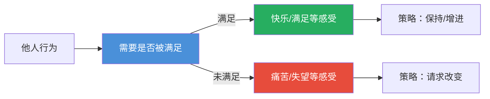

## 四、第三步：需要（Need）

### 4.1 核心概念：什么是需要

非暴力沟通将"需要"定义为人类共有的、普遍的、超越文化和个体差异的内在渴望与需求。马歇尔·卢森堡（Marshall Rosenberg）认为，**需要是一切感受的根源**，也是NVC四步法中最核心的一环——如果说观察是"看见事实"、感受是"连接情感"，那么需要就是"触及本质"。

在NVC框架中，需要具有以下关键特性：

| 特性 | 含义 | 重要性 |
|------|------|--------|
| **普遍性** | 所有人类共享相同的基本需要 | 连接的基础，消除"你和我不同"的隔阂 |
| **抽象性** | 需要本身不指向具体行为或对象 | 允许灵活探索多种满足方式 |
| **中立性** | 没有"好需要"或"坏需要"之分 | 减少羞耻感和自我批判 |
| **动态性** | 需要在不同时刻有不同优先级 | 理解情绪变化的内在驱动力 |

### 4.2 为什么需要是NVC的灵魂

卢森堡曾指出："每当人们听到自己的需要被理解时，他们就会放松下来。"需要之所以是NVC的灵魂，有以下几个深层原因：

**1. 需要是感受的根源——连接感受与核心动机**

感受不是凭空产生的，它是需要是否得到满足的信号系统。当我们感到快乐时，是因为某种需要得到了满足；当我们感到痛苦时，是因为某种需要未被满足。这种感受-需要的对应关系是一条黄金法则：

感受 → 信号 → 识别需要 → 采取行动 → 满足需要 → 新的感受

**2. 需要是冲突的底层结构——从对立走向共赢**

表面上的冲突通常是策略层面的冲突（"你要A，我要B"），但当双方回到需要层面时，往往发现目标一致（"我们都需要被尊重/被理解/参与决策"）。这就打开了创造性的问题解决空间。

**3. 需要的自我负责——告别指责循环**

当我们意识到"我的感受源于我的需要是否被满足，而非他人的行为"时，就从受害者心态中解放出来。这种内在的责任感是NVC最具变革性的洞见。



### 4.3 需要与策略的根本区别

这是NVC实践中**最核心也是最容易被误解的区别**。许多人说"我需要你早点回家"——这实际上是一个策略，而非需要。真正的需要是"陪伴"或"安全感"。

**根本区别对照表：**

| 维度 | 需要（Need） | 策略（Strategy） |
|------|-------------|------------------|
| 层次 | 抽象的、普遍的 | 具体的、个人的 |
| 范围 | 不受时空限制 | 受特定情境约束 |
| 替代性 | 不可替代（如爱） | 可替代（有多种方式表达爱） |
| 交涉空间 | 无法讨价还价 | 可以协商调整 |
| 冲突原因 | 需要本身不引起冲突 | 策略冲突是常见冲突来源 |

**深度示例对比：**

**示例一：亲密关系中的晚归冲突**

情境：伴侣经常加班晚归

- **混合表达**："我需要你早点回来" —— 听上去像一个需要，实则是一个策略
- **分离后的需要**："我需要陪伴和连接"
- **可能的策略**：
  - 每周至少三天一起晚餐
  - 午休时间打一个简短的电话
  - 周末安排专属的二人时光
  - 加班时发一条"想你了"的信息

练习：当对方无法执行某一策略时，回到需要层面，创造力涌现。

**示例二：职场中的决策权冲突**

情境：你希望参与重要项目的前期决策

- **表面策略**："我想要参加高层周会" 
- **深层需要**：贡献、参与、被重视
- **替代策略**：
  - 提交书面意见和建议
  - 与关键决策者开展一对一的会前沟通
  - 组织关键议题的专题讨论会
  - 通过邮件形式提出建设性方案

**为什么策略冲突可以化解而需要不可妥协？**

策略之所以可以协商，是因为满足一个需要的方式是无限的。我们需要"尊重"，但满足尊重的方式有千百万种——被倾听、被肯定、被征求意见、被给予空间。但如果试图"妥协"需要本身，比如为了维持关系而放弃对"尊重"的需要，那只会在更深层产生怨气和疏离。

### 4.4 需要的心理学理论基础

NVC关于需要的理念与多个心理理论流派高度一致，了解这些理论基础有助于加深理解。

**1. 马斯洛需求层次理论（Maslow's Hierarchy of Needs）**

| NVC需要类别 | 马斯洛层次 | 对应关系 |
|-------------|-----------|---------|
| 生理需要（食物、休息） | 生理需求 | 最底层，基础生存 |
| 安全与稳定 | 安全需求 | 身体和心理安全 |
| 连接与归属 | 爱与归属需求 | 亲密关系、社交连接 |
| 尊重与认可 | 尊重需求 | 自尊、他人认可 |
| 自主与成长 | 自我实现需求 | 潜能发挥、意义感 |

**差异**：NVC不采用层级结构——一个未满足的归属需要不会比一个未满足的尊重需要"更低级"。所有需要同等重要，不同时刻有不同优先级。

**2. 自我决定理论（Self-Determination Theory, SDT）**

由Deci和Ryan提出的SDT认为人类有三组基本心理需要：

- **自主性（Autonomy）**：感到自己的行为是自愿选择的
- **胜任感（Competence）**：感到自己有能力应对挑战
- **关系性（Relatedness）**：感到与他人有连接和归属

这三者与NVC中的"自主""成长""连接"需要类目完美对应，而大量实证研究表明，这三个基本需要的满足程度直接影响人的主观幸福感、工作投入和心理健康。

**3. 依恋理论（Attachment Theory）**

Bowlby的依恋理论指出，人类天生需要与重要他人建立安全的情感连接。安全型依恋的建立取决于：

- 可获得性（availability）——需要时对方在场
- 敏感性（sensitivity）——对方能准确理解自己的需要
- 回应性（responsiveness）——对方及时满足需要

NVC的需要表达正是为了促进这三点——清晰表达需要让他人更容易理解和回应。

### 4.5 如何识别自己的需要

识别自己的需要是NVC中最需要练习的技能，因为大多数人从小到大被训练成关注"别人要我做什么"而非"我真正需要什么"。

#### 4.5.1 从感受反推需要

感受是需要的信使。当你有强烈的情绪时，问自己这张"感受-需要对照表"中的问题：

| 感受类型 | 常见感受词汇 | 可能的未被满足的需要 |
|----------|-------------|---------------------|
| 愤怒/恼火 | 生气、烦躁、愤怒 | 尊重、公平、自主、被理解 |
| 悲伤/失望 | 难过、沮丧、失落 | 连接、陪伴、被重视、希望 |
| 恐惧/焦虑 | 害怕、担心、紧张 | 安全、稳定、可预测性、支持 |
| 孤独/疏离 | 寂寞、被冷落、格格不入 | 归属、连接、亲密、接纳 |
| 无力/疲惫 | 倦怠、无力、枯竭 | 休息、支持、合作、意义 |
| 羞耻/内疚 | 尴尬、羞愧、后悔 | 被接纳、自我尊重、完整性 |

**实操方法——三步反推法：**

第一步：命名感受 → "我感到……"（例如：沮丧）
第二步：联结感受 → "因为我的……需要未被满足"
第三步：验证需要 → "如果我满足了这个需要，我的感受会有什么变化？"

#### 4.5.2 身体觉察法

身体承载着未满足需要的信息。以下是常见的身体信号与需要的对应：

| 身体信号 | 可能指向的需要 | 自问 |
|---------|--------------|------|
| 胸口发紧、胸闷 | 安全感、信任 | "我担心什么会失去？" |
| 肩膀沉重、颈部僵硬 | 支持、分担 | "我是否独自承担了太多？" |
| 胃部不适、恶心 | 接纳、认同 | "我是否在抗拒什么？" |
| 呼吸急促、心跳加快 | 安全、可预测性 | "我面临什么不可控的威胁？" |
| 四肢沉重、乏力 | 休息、放松 | "我是否长期透支了自己？" |
| 喉咙发堵、想哭 | 被看见、被理解 | "有什么话我一直没说出口？" |

**练习**：每天选一个时刻，花30秒扫描身体，问："这个部位的感觉想告诉我什么需要？"

#### 4.5.3 情绪日记法

建立记录模板，每天记录1-3次情绪波动：

时间：_______
事件：________（某同事在会议上打断我的发言）
感受：________（恼火、受伤）
需要的觉察：________（我需要被尊重和被听见）
满足程度：1（非常不满）- 5（完全满足）：___
替代策略：________（与同事单独沟通，表达在被打断时的感受和需要）

坚持一周后，回顾记录，你会发现自己的核心需要模式——哪些需要频繁出现，哪些需要长期被忽视。

### 4.6 如何识别他人的需要

NVC不仅帮助我们表达自己的需要，也帮助我们听到他人的需要——这是共情的核心能力。

**从评判中听到需要：**

他人的批评、指责、攻击性语言背后，往往隐藏着未被满足的需要。学会"翻译"：

| 他人的语言（评判） | 翻译后的需要 |
|-------------------|-------------|
| "你从来不关心我" | 连接、被重视 |
| "你总是这么自私" | 合作、公平 |
| "这方案太差了" | 安全、质量、贡献 |
| "你根本不懂我" | 被理解、连接 |
| "你怎么这么慢" | 效率、可预测性 |

**同理倾听四步法：**

第一步：专注倾听，不打断、不辩解、不急于给建议
第二步：抓住情绪线索 → "听起来你很……"
第三步：猜测背后需要 → "因为你需要……"
第四步：请求确认 → "是这样吗？我理解得对吗？"

**示例对话：**

> **对方**："你从来都不听我说话！"
> 
> **你的回应**（豺狗语言）："我怎么不听你说话了？你讲啊！"
>
> **你的回应**（长颈鹿语言）：
> "听起来你很挫败（感受），因为你希望感到被倾听和被重视（需要），是这样吗？"
>
> **对方可能回应**："是……每次我说重要的事，你都在看手机，我觉得自己像空气。"

### 4.7 需要的表达技巧

在NVC四步法的完整表达中，需要可以用以下格式：

"我感到[感受]，因为我需要[需要]"

**关键要点：**

**1. 使用"因为"连接感受和需要**

- 正确："我感到孤独，因为我需要连接"
- 错误："我感到孤独，因为你不理我"（归咎他人）
- 错误："我感到孤独"（没有连接到需要，信息不完整）

**2. 区分"因为我需要"和"因为你让我"**

| 语境 | 自我负责的表达 | 归咎他人的表达 |
|------|--------------|---------------|
| 亲密关系 | "我感到受伤，因为我需要被信任" | "我感到受伤，因为你怀疑我" |
| 职场 | "我感到挫败，因为我需要参与决策" | "我感到挫败，因为你们不让我参与" |
| 亲子 | "我感到焦急，因为我需要你的安全" | "我感到焦急，因为你总是不听劝" |

**3. 避免需要表达中的隐含评判**

有些表达表面上在说需要，实际上隐含了对对方的评判：

- 隐含评判："我需要你更负责任" → 实际需要："我需要可靠性和配合"
- 隐含评判："我需要你尊重我" → 实际需要："我需要平等相待"（把焦点从"你不够尊重"转向"我渴望平等"）

**4. 区分真实需要与伪装的需要**

有些时候，我们嘴上说需要，实际是在用一个"高尚的需要"包装一个控制性策略：

| 伪装的需要 | 真正的运作方式 | 识别标志 |
|-----------|--------------|---------|
| "我需要你早点回来" | 这是一条指令，不是需要 | 对方无法说"不" |
| "我需要听话的孩子" | 这是在要求服从 | 隐含威胁 |
| "我需要你更努力" | 这是一个期望标准 | 有明确的评判 |

**判断标准**：如果对方说"不"时你会感到受伤或愤怒，那很可能你表达的不是需要，而是策略或要求。

### 4.8 常见误区

**误区一：把策略当作需要**

这是最常见的错误。我们从小被训练成"我要什么"的思维模式，把具体行动等同于内在需求。

- 误："我需要你每天给我打电话"
- 正："我需要连接和亲密感，你愿意每天通话或者换一种方式保持联系吗？"

**误区二：认为表达需要是"软弱"**

许多文化（尤其是东亚文化）教导我们"不要给别人添麻烦""讲需要就是自私"。但实际上，表达需要是勇气的体现——它意味着你对自己诚实，也信任对方能够承载你的真实。

**误区三：把需要等同于"指令"**

- 问题：在NVC中说了"我需要"，然后期待对方必须满足
- 真相：表达需要是为对话建立基础，不是下达命令。对方有权说"不"
- 练习：每次表达需要后，主动补充："你听到我的需要后有什么感受？"

**误区四：过度关注自己而忽视他人需要**

- 问题：只表达自己的需要，把NVC变成自我中心的工具
- 纠正：NVC是一个双向框架——既表达自己，也同理倾听他人

**误区五：需要表达过于宽泛**

- 模棱两可："我需要被理解"
- 更实用："你是否愿意告诉我，你刚才说的内容中你希望我先理解哪个部分？"

**误区六：认为需要无法改变**

人是动态的——今天最重要的需要明天可能退居次位。需要随情境、年龄、人生阶段而变化。定期自我检视是健康的习惯。

### 4.9 需要清单：完整分类

以下是一份系统化的需要清单，涵盖人类生活的各个层面：

#### 生理需要
- 食物、饮水、空气
- 休息、睡眠、放松
- 运动、活动、身体接触
- 住所、保护、温暖
- 性表达、生育
- 健康、疗愈、康复

#### 安全与稳定
- 安全感、保障、保护
- 稳定、秩序、可预测性
- 信任、可靠、诚信
- 舒适、安心、宁静
- 连续感、一致性
- 经济保障、物质基础

#### 连接与爱
- 爱、被爱、去爱
- 陪伴、亲密、亲近
- 归属感、被接纳
- 温暖、关怀、呵护
- 理解、被理解
- 同理心、共情
- 社区、团体、归属

#### 尊重与认可
- 尊重、被尊重
- 认可、欣赏、肯定
- 重视、存在感、被看见
- 公平、正义、平等
- 信誉、声望、尊严
- 名誉、身份认同

#### 自主与自由
- 自主权、自我决定
- 选择、灵活、弹性
- 独立、空间、隐私
- 自由表达、言论自由
- 自发、创造、创新
- 自我领导、自我管理

#### 意义与成长
- 意义、目的、使命感
- 成长、发展、进步
- 学习、探索、好奇
- 创造、表达、贡献
- 灵感、激情、愿景
- 超越、灵性、觉醒

#### 娱乐与活力
- 乐趣、幽默、快乐
- 游戏、玩耍、冒险
- 美、优雅、和谐
- 艺术、音乐、舞蹈
- 自然、户外、环境
- 活力、能量、热情

#### 支持与帮助
- 支持、鼓励、赋能
- 合作、协作、团队
- 理解、接纳、宽容
- 倾听、陪伴、在场
- 指导、建议、资源
- 认可脆弱、允许失败

### 4.10 高级实践：超越基本运用

#### 4.10.1 需要冥想

找一个安静的空间，闭上眼睛，深呼吸。让注意力从外界转向内在。依次问自己：

我最需要的是什么？（不加评判地观察浮现的需要）
这个需要被满足到了多少程度？（0-10打分）
如果现在有无限资源，什么样的策略能最美丽地满足它？
这个需要是否被我长期忽视了？

#### 4.10.2 需要冲突中的双赢策略

当两个人都表达了自己的需要（比如一个需要"陪伴"，一个需要"独处"），不是非此即彼，而是：

| 步骤 | 行动 |
|------|------|
| 1 | 双方清楚表达各自需要，不急于解决 |
| 2 | 确认双方理解了对方的全部需要 |
| 3 | 头脑风暴可能的策略，不评判、不否定 |
| 4 | 选择双方都能接受的方案 |
| 5 | 试行并评估，必要时调整 |

**示例**：
- A的需要：亲密感、连接、放松（需要周末共同活动）
- B的需要：独处、精力恢复、自主（需要周末独处时间）
- 可能的策略：
  - 周六各自活动，周天一起
  - 一起在家，但A在客厅看书，B在书房
  - 一起外出但各自有独立活动
  - 每月两周末一起，两周末分开

#### 4.10.3 需要觉察日记模板

```markdown
## 需要觉察日记

**日期**：________

### 事件一
情境：______________________________________________
我的感受：______________________________________________
我的需要：______________________________________________
我采取的行动：______________________________________________
效果评估：□很好 □一般 □有待改善

### 事件二（涉及他人）
情境：______________________________________________
对方的言行：______________________________________________
我猜测的对方需要：______________________________________________
我的回应方式：______________________________________________
如果再有一次机会，我会：______________________________________________
```

### 4.11 跨文化视角：需要表达的多样性

不同文化对需要的表达方式有显著差异，了解这些差异有助于在跨文化沟通中运用NVC：

| 文化类型 | 需要表达特点 | 对NVC的启示 |
|---------|-------------|-----------|
| 个人主义文化（如美国、北欧） | 直接表达需要被视为诚实 | 需要表达相对容易 |
| 集体主义文化（如中国、日本） | 间接表达需要以维护和谐 | 需要更多的猜测和语境理解 |
| 高语境文化（如东亚、中东） | 需要隐含在非语言信号中 | 重视身体语言和沉默 |
| 低语境文化（如德国、瑞士） | 需要明确说出才有效 | 注重语言精确性 |

在跨文化情境中运用NVC时需注意：

1. **不把自我暴露当标准**——在某些文化中，直接说"我需要爱"可能让对方不安
2. **尊重间接表达**——亚洲文化中"不需要"可能意味着"还需要时间考虑"
3. **调整提问方式**——从"你需要什么"改为"什么对你来说是重要的"

### 4.12 核心要点回顾

┌─────────────────────────────────────────────┐
│             需要（Need）核心要点              │
├─────────────────────────────────────────────┤
│ 1. 需要是感受的根源——情绪是需要的信使         │
│ 2. 需要是普遍的——所有人共享相同的基本需要       │
│ 3. 需要≠策略——需要抽象，策略具体，策略可变     │
│ 4. 从评判中听到需要——愤怒背后是未满足的需要     │
│ 5. 表达需要是勇气的体现——自我负责而非归咎他人   │
│ 6. 需要是双向的——我的需要和他人的需要同等重要   │
│ 7. 定期觉察自己的需要——避免长期忽视导致枯竭     │
└─────────────────────────────────────────────┘

### 4.13 本章练习建议

**练习一（入门）**：写下你今天的三个情绪波动，每个情绪用"我感到……因为我需要……"句式完成。

**练习二（进阶）**：遇到令你不快的事件时，先停下来，问自己三次"我真正需要的是什么？"——第一个答案往往是策略，挖深三次才能触及真实需要。

**练习三（高阶）**：在下一个冲突场景中（无论大小），不急于表达自己的立场，而是先问对方"你现在最需要的是什么？"观察对方的反应变化。

---

> **要点**：每次当你陷入情绪，问自己"我现在真正需要的是什么？"——这个提问本身就开启了通向解决问题的道路。需要是NVC的地基，地基有多深，沟通之树就能长多高。
