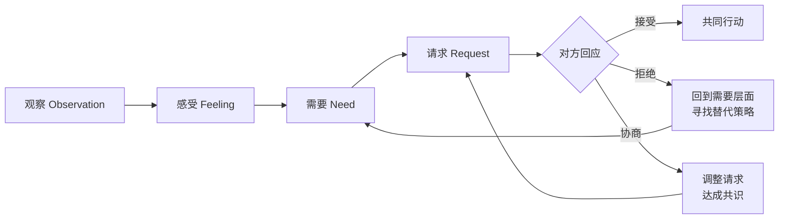
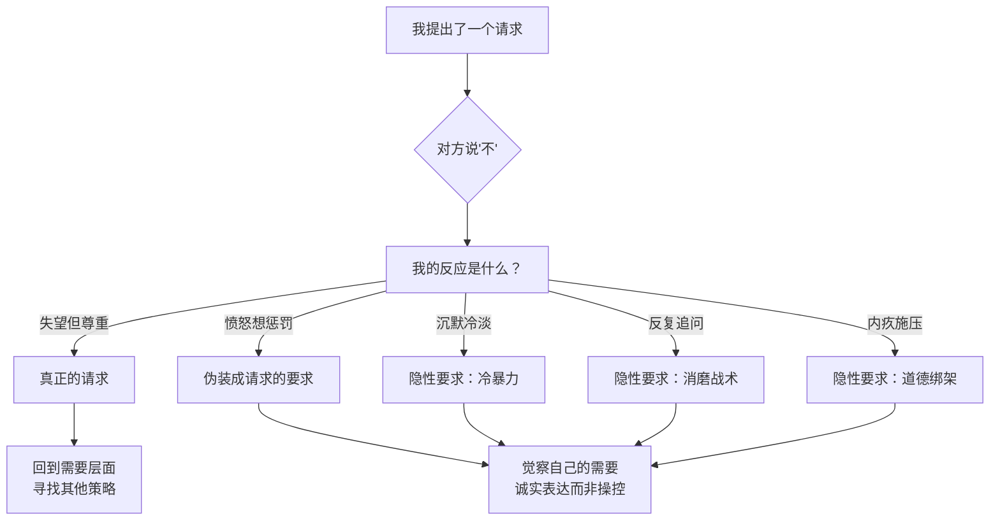
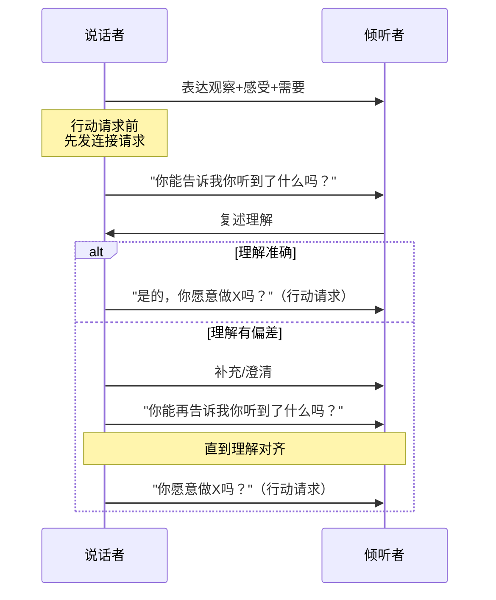
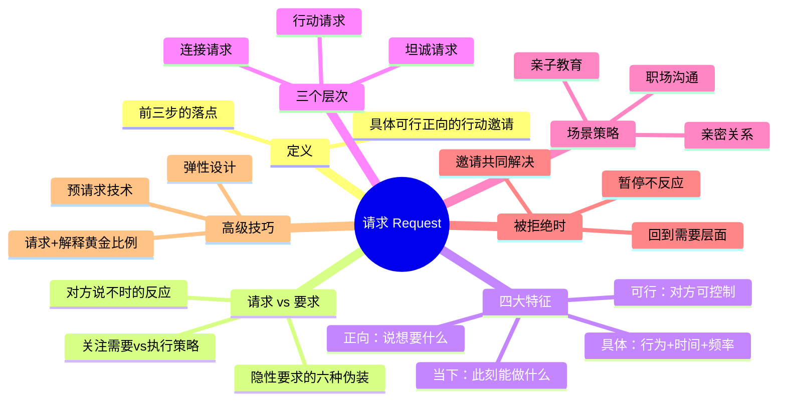

## 五、第四步：请求（Request）

前三步——观察、感受、需要——为沟通搭建了一座桥梁，但桥梁的最终目的是让人走过去。**请求**就是那最后一步：将内在的觉察转化为外在的行动邀请。没有请求的非暴力沟通，就像一封写好了却没有寄出的信——你完成了自我梳理，却没有给关系带来改变的机会。

马歇尔·卢森堡（Marshall Rosenberg）在《非暴力沟通》中反复强调：请求不是沟通的附属品，而是沟通的**落点**。前三步让你与自己连接，请求让你与对方连接。

### 5.1 什么是请求

请求是我们在充分表达观察、感受和需要之后，向对方提出的**具体、可行、正向的行动邀请**。

这个定义中的每一个词都值得拆解：

- **充分表达之后**：请求不是开场白。如果你跳过前三步直接提请求，对方听到的往往不是"邀请"，而是"命令"。先让对方理解你的处境和需要，请求才有被接受的情感基础。
- **具体**：模糊的请求让对方无从下手。"对我好一点"和"每天下班后花十五分钟聊聊"之间的差距，就是"被理解"和"被困惑"的差距。
- **可行**：请求必须在对方的能力和意愿范围内。要求一个人"永远不迟到"超出了任何人的控制范围，而"明天提前五分钟到"则是可以执行的。
- **正向**：告诉对方你**想要**什么，而不是你**不想要**什么。大脑处理"不要做什么"需要额外的认知转换，而且容易产生抵触情绪。
- **行动邀请**：请求的本质是邀请，不是命令。邀请意味着对方有说"不"的自由，而命令则预设了一个"正确答案"。

### 5.2 请求与要求的本质区别

这是非暴力沟通中最微妙也最容易混淆的概念之一。表面上，请求和要求使用的是同样的句式——"你愿意……吗？"——但它们的内在逻辑完全不同。

#### 5.2.1 核心差异对照

| 维度 | 请求 | 要求 |
|------|------|------|
| 对方说"不"时 | 尊重选择，回到需要层面探索 | 惩罚、施压、冷暴力、翻旧账 |
| 关注焦点 | 满足需要（策略可以多元） | 执行特定策略（只有一种"正确"方式） |
| 权力关系 | 平等协商 | 上对下的控制 |
| 情感基础 | 同理心、理解 | 恐惧、义务、内疚 |
| 对方的内在状态 | 自主选择，内在动机 | 被迫服从，外在压力 |
| 长期效果 | 增进信任和亲密 | 积累怨恨和疏离 |
| 语言标志 | "你愿意……吗？""你是否方便……" | "你应该……""你必须……""你为什么不……" |

#### 5.2.2 判断方法：三个自我提问

**第一个问题："如果对方说'不'，我会有什么反应？"**

- 如果你感到失望，但尊重对方的选择，并愿意回到需要层面探索其他策略 → 这是请求
- 如果你感到愤怒、受伤，想惩罚对方、冷暴力、翻旧账 → 这是要求

**第二个问题："我是希望对方自愿做，还是被迫做？"**

- 如果你真心希望对方是因为理解你的需要而行动 → 这是请求
- 如果你不在乎对方怎么想，只要对方照做就行 → 这是要求

**第三个问题："我是否给了对方真正的选择权？"**

- 如果对方可以在"做"和"不做"之间自由选择，且两种选择都不会带来负面后果 → 这是请求
- 如果"不做"会带来惩罚（情感上的或实际的） → 这是要求

#### 5.2.3 隐性要求的六种伪装

很多时候，我们以为自己在提请求，实际上在提要求。隐性要求比显性要求更具破坏性，因为它披着尊重的外衣，让对方无法明确拒绝。

**伪装一：语气暗示**

"你愿意把碗洗了吗？"（配合皱眉、叹气、沉默）

字面是请求，但语气传递的信息是"你最好照做"。

**伪装二：事后惩罚**

对方说"不"后，你没有发火，但接下来三天冷淡、不说话、拒绝亲密。

表面上你"尊重"了对方的选择，实际上用冷暴力施加了惩罚。

**伪装三：道德绑架**

"我为你付出了这么多，你就不能帮我这一次吗？"

用内疚感迫使对方服从，这不是请求，是情感勒索。

**伪装四：反复追问**

"你确定不行吗？""真的不行？""你再想想？"

对方已经说了"不"，但你不接受，反复追问直到对方妥协。这不是邀请，是消磨。

**伪装五：条件交换**

"如果你不做这件事，那我以后也不会为你做那件事。"

用互惠的名义施加压力，本质上是威胁。

**伪装六：公开施压**

在众人面前提请求，让对方因为面子无法拒绝。

利用社会压力迫使对方就范，这不是请求，是绑架。

### 5.3 有效请求的四大特征

#### 5.3.1 具体——让对方知道你到底想要什么

模糊的请求是沟通的黑洞。"我希望我们能更好地沟通"听起来很合理，但对方可能完全不知道该怎么做。"更好"是什么意思？"沟通"指的是什么？频率？深度？方式？

**具体化的三个维度：**

- **行为维度**：你要对方做什么具体动作？
- **时间维度**：什么时候做？持续多久？
- **频率维度**：做一次还是持续做？

| 模糊请求 | 具体请求 | 具体化维度 |
|----------|----------|------------|
| "对我好一点" | "每天下班后花十五分钟和我聊聊今天发生的事" | 行为+时间+频率 |
| "多关心我" | "我生病时，你愿意帮我倒杯水、问问我感觉怎么样吗？" | 行为+场景 |
| "认真工作" | "开会时你愿意把手机调成静音吗？" | 行为+场景 |
| "注意健康" | "你愿意每周和我一起去跑步三次吗？" | 行为+频率 |
| "少花钱" | "超过五百块的消费，你愿意先和我商量一下吗？" | 行为+金额阈值 |

#### 5.3.2 可行——在对方的能力范围内

可行性的关键在于：**请求的行为必须是对方可以直接控制的**。

"你以后再也不要迟到"——没有人能保证"永远"不迟到，交通、意外、身体状况都可能导致迟到。这个请求的可行性为零。

"明天的会议，你愿意提前五分钟到吗？"——这是一个具体的、可执行的、对方可以控制的行为。

**可行性检查清单：**

- 这个行为是对方可以直接控制的吗？（不是依赖外部条件）
- 这个行为在对方的能力范围内吗？（不是要求对方成为另一个人）
- 这个行为在当前情境下现实吗？（不是要求对方在疲惫时做高强度的事）
- 这个时间框架合理吗？（不是要求对方立刻改变长期习惯）

#### 5.3.3 正向——说你想要的，而非不想要的

人脑处理正面指令比处理否定指令更高效。"不要想一只粉色的大象"——你刚才想了。同理，"你不要总是玩手机"会在对方脑中强化"玩手机"这个画面。

**正向转换的技术：**

| 否定式请求 | 正向请求 | 转换逻辑 |
|------------|----------|----------|
| "不要总是玩手机" | "吃饭时把手机放在一边" | 用"放手机"替代"不玩手机" |
| "不要对我大吼大叫" | "你愿意用平静的语气和我说话吗？" | 用"平静语气"替代"不大吼" |
| "不要总是迟到" | "你愿意在约定时间前到吗？" | 用"提前到"替代"不迟到" |
| "不要把脏衣服扔地上" | "你愿意把脏衣服放进洗衣篮吗？" | 用"放进篮子"替代"不扔地上" |
| "不要忽视我的感受" | "当我表达感受时，你愿意认真听我说吗？" | 用"认真听"替代"不忽视" |

#### 5.3.4 当下——聚焦此刻可以做的事

"你以后要改变"——"以后"是一个没有终点的时间黑洞，对方不知道从哪里开始。

"现在，你愿意和我一起想想怎么解决这个问题吗？"——这是此刻可以做的事。

**当下化的技巧：**

- 用"现在""今天""这周"替代"以后""将来""总有一天"
- 把大目标拆解成小步骤："与其说'以后要多运动'，不如说'今晚你愿意和我散步二十分钟吗？'"
- 聚焦下一个可执行的动作："我们先从每天晚上聊十分钟开始，好吗？"

### 5.4 请求的三个层次

请求不只是"让对方做事"。根据沟通目的的不同，请求可以分为三个层次，从浅到深依次是：行动请求、连接请求、坦诚请求。

#### 5.4.1 行动请求（Action Request）

这是最常见的请求类型——你希望对方做一件具体的事。

**适用场景：** 日常协作、任务分配、习惯调整

**示例：**

- "你愿意在周五前完成报告吗？"
- "你愿意今晚陪我去散步吗？"
- "你愿意在做决定前先和我商量吗？"

**关键要点：** 行动请求必须满足前面提到的四大特征——具体、可行、正向、当下。

#### 5.4.2 连接请求（Connection Request）

在提行动请求之前，你可能需要先确认对方是否理解了你的意思。连接请求的目的不是让对方做事，而是**确认理解、建立共识**。

**适用场景：** 重要对话、冲突后的沟通、信息复杂的场景

**示例：**

- "你能告诉我你听到了什么吗？"（确认对方理解了你的表达）
- "你对这个想法有什么感受？"（了解对方的内在状态）
- "你觉得我的需要是什么？"（确认对方理解了你的需要）
- "你能复述一下你理解的我的立场吗？"（确认信息传递准确）

**为什么连接请求如此重要？**

沟通中最常见的失败模式是：**你说了A，对方听成了B，你以为对方理解了A，双方都认为共识已经达成，但实际执行时才发现南辕北辙**。

连接请求就像软件开发中的"握手协议"——在发送数据之前，先确认通道是否畅通。

#### 5.4.3 坦诚请求（Honesty Request）

有时候，你最需要的不是对方做某件事，而是对方说出真话。坦诚请求的目的是**邀请对方表达真实的内在状态**，尤其是那些可能因为害怕冲突而隐藏的想法。

**适用场景：** 信任建立、冲突化解、深层对话

**示例：**

- "你愿意告诉我你真正的想法吗？即使和我的不一样。"
- "你对这个方案有什么顾虑？说出来我们一起想办法。"
- "你是不是其实不太同意，但怕我不高兴？你可以直接告诉我。"
- "你心里是不是还有别的需要没有说出来？"

**坦诚请求的难点：** 对方可能因为过去的经历学会了隐藏真实想法。你需要用行动证明：说出真话不会带来惩罚。这意味着当对方说出你不爱听的话时，你的第一反应必须是感谢，而不是反驳。

### 5.5 请求的提出时机

请求不是随时都可以提的。时机不对，再好的请求也会被当作要求。

#### 5.5.1 适合提请求的时机

- **对方情绪平稳时**：对方正在气头上或极度疲惫时，任何请求都会被感知为压力。
- **充分表达之后**：你已经完整地表达了观察、感受和需要，对方理解了你的处境。
- **对方有回应空间时**：对方不是在赶时间、分心或处于公共场合。
- **关系信任度较高时**：信任度低时，请求容易被误解为控制。

#### 5.5.2 不适合提请求的时机

- 对方正在处理紧急事务
- 对方刚刚经历了情绪风暴，尚未平复
- 公众场合（除非请求本身适合公开讨论）
- 你自己情绪激动时（你可能把请求变成要求）
- 对方明确表示需要独处时间

### 5.6 不同场景中的请求策略

#### 5.6.1 亲密关系中的请求

亲密关系是请求最难发挥作用的场景之一，因为双方的期待最高、情绪投入最深、被拒绝的痛苦最强烈。

**常见陷阱：**

- **"你应该知道"陷阱**：期待伴侣能读懂你的心思，不用你开口就知道你需要什么。如果对方真的关心你，就应该主动做到。——这是一个危险的假设。关心不等于通灵。
- **"证明爱"陷阱**：把请求变成对爱的测试。"如果你真的爱我，你就应该……"这不是请求，是审判。
- **"积怨式请求"**：积攒了太多未表达的需要，一次性倾倒出来。对方被淹没，无法回应任何一条。

**有效策略：**

- 从小请求开始，建立"请求-回应"的正向循环
- 用"我"开头表达需要，而非"你"开头指出问题
- 给对方选择的空间，不要求立刻回应
- 定期进行"需要对话"，不要等到问题爆发

**示例：**

> "最近我注意到我们很少有时间单独相处（观察），我感到有些失落和孤独（感受），因为我需要亲密感和连接（需要）。你愿意这周找一个晚上，我们一起吃顿饭、聊聊天吗？（请求）"

#### 5.6.2 职场中的请求

职场请求面临额外的挑战：权力不对等、面子文化、竞争关系。

**向上级提请求：**

- 强调对团队/项目的益处，而非个人需要
- 提供选项而非单一方案
- 给出具体的时间框架和可衡量的结果

**示例：**

> "我注意到最近项目进度比较紧（观察），我感到有些压力（感受），因为我希望能在保证质量的前提下按时交付（需要）。您看我们是否可以把这个功能的截止日期延后一周，或者把另外两个低优先级任务暂时搁置？（请求+选项）"

**向同事提请求：**

- 明确你希望对方做什么，以及为什么
- 承认对方也有自己的工作压力
- 提出互惠的可能性

**向下级提请求：**

- 避免"请求"变成"命令"——即使是上下级关系，非暴力沟通的精神仍然是邀请而非控制
- 给对方表达困难的空间
- 关注对方的需要，而非只关注任务完成

#### 5.6.3 亲子关系中的请求

与孩子沟通时，请求需要额外注意语言的可理解性和能力匹配。

**年龄适配：**

| 年龄段 | 请求策略 | 示例 |
|--------|----------|------|
| 3-6岁 | 简单、具体、可视化 | "玩具玩完了，你愿意把它们放回这个蓝色的箱子里吗？" |
| 7-12岁 | 给出理由、提供选择 | "作业还没做完，你愿意现在开始做还是先休息十分钟再做？" |
| 13-18岁 | 尊重自主性、协商而非命令 | "我知道你想和朋友出去玩，但周末的作业也需要完成。你愿意和我商量一下怎么安排时间吗？" |

### 5.7 当请求被拒绝时

请求被拒绝是非暴力沟通中最关键的时刻之一。你的反应决定了你之前所有的努力是建立信任还是摧毁信任。

#### 5.7.1 被拒绝后的黄金三步

**第一步：暂停，不反应**

被拒绝时，你的第一反应可能是愤怒、受伤、失望。这些感受是真实的，但不要在这一刻行动。给自己三秒钟。

**第二步：回到需要层面**

对方拒绝的是你的请求（策略），不是你的需要。你的需要仍然存在，只是需要换一个策略来满足。

请求："你愿意这周陪我去爬山吗？"
对方："不，我这周很累。"
❌ 反应："你从来都不陪我！"（把拒绝策略等同于拒绝需要）
✅ 反应："我理解你需要休息。我需要和你共度时光，有没有其他方式我们可以一起放松？"

**第三步：邀请对方参与解决问题**

不要独自寻找替代方案，也不要要求对方想办法。邀请对方一起探索。

"我需要陪伴和连接，你也需要休息。我们能不能一起想想，有什么活动既能让你休息，又能让我们在一起？"

#### 5.7.2 被拒绝时的常见错误反应

| 错误反应 | 隐含信息 | 后果 |
|----------|----------|------|
| 翻旧账："我上次为你做了X，你现在连这个都不愿意？" | 你欠我的 | 对方感到被控制 |
| 冷暴力：沉默、冷淡、拒绝交流 | 你让我失望了，你要为此付出代价 | 对方学会隐藏拒绝 |
| 自我攻击："我果然是不值得被爱的" | 用内疚绑架对方 | 对方被迫安慰你，忽略了自己 |
| 升级威胁："如果你不做，我就……" | 不服从就有后果 | 对方被迫服从，积累怨恨 |
| 反复追问："真的不行吗？你再想想？" | 你的"不"不算数 | 对方失去说"不"的安全感 |

### 5.8 高级技巧

#### 5.8.1 请求的"弹性设计"

好的请求不是铁板一块，而是带有弹性的。你可以提供一个"理想版本"和一个"最小版本"，让对方根据自己的状态选择。

**示例：**

> "你愿意这周六花半天时间陪我去看看家具吗？如果半天太长，哪怕陪我逛一个小时也行。"

这种设计的好处：
- 降低了对方说"是"的门槛
- 让对方感到被尊重
- 增加了请求被接受的概率
- 即使是最小版本，也能满足你的部分需要

#### 5.8.2 "预请求"技术

在正式提请求之前，先用一个轻量级的问题试探对方的状态和意愿。

**示例：**

> "你现在方便聊一件事吗？"（预请求）
> "方便。"
> "我注意到……（观察），我感到……（感受），因为我需要……（需要）。你愿意……吗？"（正式请求）

如果对方说"现在不方便"，你可以问"什么时候方便？"，而不是强行推进。

#### 5.8.3 "请求+解释"的黄金比例

请求后面是否需要解释？答案是：需要，但要控制比例。

- **太少解释**：对方不知道为什么，缺乏行动动机
- **太多解释**：对方感到被说教，产生防御心理

**黄金比例**：一个请求 + 一到两句解释（说明这个请求如何满足你的需要）。

> "你愿意在开会时把手机调成静音吗？因为当你看手机时，我会觉得我说的话不被重视，这让我有点失落。"

解释的内容应该是你的感受和需要，而不是对对方行为的评判。

#### 5.8.4 面对权力不对等的请求

当你处于权力弱势方（如下属向上级、孩子向父母、服务人员向客户），请求需要额外的策略：

- **聚焦共同利益**：将你的需要包装成对双方都有益的结果
- **提供数据支撑**：用事实而非情感说服
- **给出选项**：让对方感到是在做选择，而非被要求
- **选择合适的场合**：私下沟通比公开场合更安全

**示例（员工向经理）：**

> "我注意到这个季度我们团队已经连续加班了六周（观察/事实），我担心长期下去会影响工作质量和团队士气（感受+需要）。您看我们是否可以重新评估一下项目优先级，把一些非核心功能移到下个迭代？（请求+选项）"

### 5.9 实践练习

#### 练习一：模糊请求具体化

将以下模糊请求改写为具体、可行、正向、当下的请求：

1. "我希望你能多关心我一点。"
2. "你能不能认真点？"
3. "别老是加班了。"
4. "你能不能成熟一点？"
5. "对我耐心一些。"

**参考改写：**

1. "我这周压力比较大，你愿意今晚花二十分钟听我聊聊吗？"
2. "这份报告明天要交，你愿意今天下午集中精力把它完成吗？"
3. "你这周已经加班四天了，今晚愿意七点前回家一起吃晚饭吗？"
4. "当我们意见不同时，你愿意先听我说完再回应吗？"
5. "我在学习新东西的时候进度比较慢，你愿意给我多一些时间，不要催我吗？"

#### 练习二：要求转请求

将以下要求改写为请求：

1. "你必须把房间收拾干净。"
2. "你应该多陪陪孩子。"
3. "你不许再抽烟了。"
4. "你得尊重我的隐私。"
5. "你以后不准再迟到。"

**参考改写：**

1. "我看到房间比较乱，心里有点烦躁，因为我需要整洁的环境。你愿意今天花半小时收拾一下吗？"
2. "孩子最近经常问爸爸/妈妈什么时候回来，我觉得他很想你。你愿意这周抽两个晚上陪他读故事书吗？"
3. "我担心你的健康，因为我需要你长久地陪伴我。你愿意和我聊聊你对戒烟的想法吗？"
4. "当我发现你看了我的手机时，我感到不舒服，因为我需要个人空间被尊重。你愿意以后先问我一下再用我的手机吗？"
5. "今天会议因为迟到延后了十五分钟，我感到有些焦虑，因为我希望我们的讨论能高效进行。明天的会议你愿意提前五分钟到吗？"

#### 练习三：三层请求练习

选择一个你最近遇到的沟通困境，分别写出三种层次的请求：

- **连接请求**：确认对方理解你的表达
- **坦诚请求**：邀请对方表达真实想法
- **行动请求**：提出具体的行动邀请

### 5.10 常见误区与纠正

#### 误区一："用了非暴力沟通的句式，就等于在做非暴力沟通"

很多人学会了"我观察到……我感到……因为我需要……你愿意……吗？"这个句式，然后机械地套用。但如果内心充满评判和控制，句式本身不能挽救沟通。

**纠正：** 非暴力沟通的核心是意识转变，不是语言技巧。先检查自己的内在状态——你是真的在邀请，还是在用更"高级"的方式控制对方？

#### 误区二："请求不能被拒绝"

如果你发现对方说"不"时你会强烈反应，说明你内心深处把它当成了要求。

**纠正：** 练习接受"不"。对方说"不"不等于否定你这个人，也不等于不在乎你。它只是说明这个特定策略不适合对方。你的需要仍然可以通过其他策略满足。

#### 误区三："我必须完美表达才能提请求"

有些人学习了非暴力沟通后变得过于谨慎，觉得必须先完美地表达观察、感受、需要，才能提请求。结果要么拖延表达，要么因为"没表达好"而自责。

**纠正：** 非暴力沟通不是考试，不需要满分。即使你的表达不完美，真诚地尝试也比不表达好。对方能感受到你的诚意。

#### 误区四："请求越多越好"

有些人把每个小不满都转化成请求，让对方感到被大量"需求"淹没。

**纠正：** 选择最重要的需要来表达。不是每一个不便都需要一个请求。学会区分"想要"和"需要"，优先表达深层需要。

#### 误区五："对方应该自动理解我的需要"

这是最常见的误区之一。你表达了感受和需要，但没有明确提出请求，然后期待对方"自然而然"地知道该怎么做。

**纠正：** 读心术不存在。即使对方非常爱你、非常理解你，也不能保证他们会准确地知道你需要什么。明确提出请求不是"不懂事"，而是对关系负责。

### 5.11 请求与文化背景

在中国文化语境中，提请求有一些特殊的考量：

#### 5.11.1 含蓄文化的挑战

中国传统文化推崇含蓄、谦让、"不用说就该懂"。这与非暴力沟通中"明确表达需要和请求"的理念存在张力。

**应对策略：**

- 在亲密关系中，可以先解释为什么你要明确提出请求："我知道我们习惯含蓄，但我发现直接说出来对我们更好。"
- 在职场中，可以用更正式的方式包装请求："想和您商量一下……""不知道您方不方便……"
- 含蓄和明确不矛盾——你可以用温和的语气说明确的话。

#### 5.11.2 面子与请求

在中国社会中，"面子"是重要的社交货币。在公众场合提请求需要特别注意：

- 避免在众人面前提出可能让对方难堪的请求
- 如果必须在公开场合讨论，先私下沟通获得共识
- 给对方"台阶"——用"可能我理解有误"替代"你做得不对"

#### 5.11.3 关系网络中的请求

中国社会的关系网络（人情、面子、互惠）会影响请求的动态：

- 人情债：对方可能因为"欠你人情"而接受请求，但这不等于真正的自愿。注意区分"因为人情而做"和"因为理解你的需要而做"。
- 中间人：有时候通过中间人提请求更有效，但要注意不要让中间人成为施压的工具。

### 5.12 本节核心要点回顾

请求是非暴力沟通四步中最需要勇气的一步。表达观察、感受和需要，你只需要面对自己；提出请求，你需要面对对方的回应——包括拒绝的可能。但正是这份勇气，让沟通从独白变成对话，让关系从猜测变成理解，让需要从沉默变成行动。

**记住：好的请求不是操控对方的工具，而是邀请对方走进你的世界的桥梁。**
