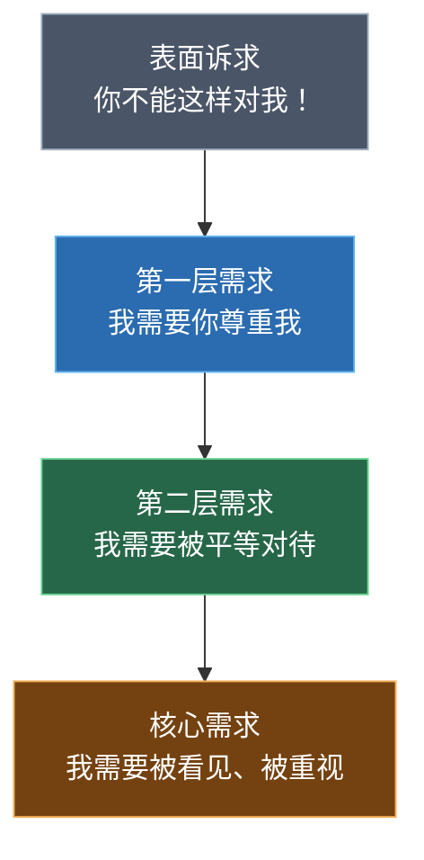
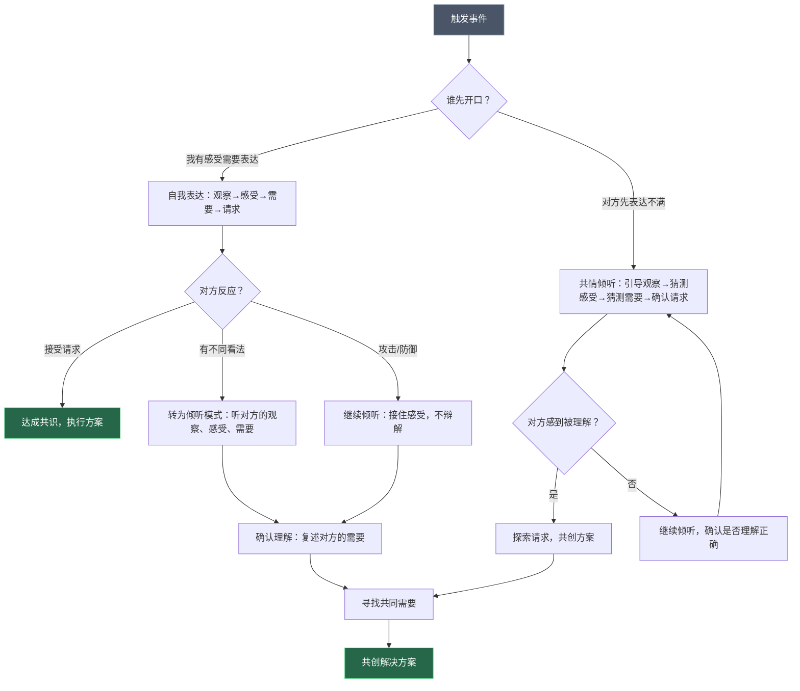

## 六、NVC的完整应用

前四节分别拆解了观察、感受、需要、请求四个步骤。但NVC不是四个零件的简单拼接——它是**一套完整的心智操作系统**。本节的核心任务是：把四步法从"知道"变成"会用"，从"单句练习"升级到"真实对话中的完整应用"。

### 6.1 自我表达的完整框架

自我表达是NVC最直观的应用模式：当你有某种感受需要表达时，用四步法组织自己的语言，把"攻击对方"变成"表达自己"。

#### 6.1.1 核心句式结构

当我 [观察：具体事实] 时，
我感到 [感受：真实情绪]，
因为我需要/看重 [需要：深层需求]。
你是否愿意 [请求：具体行动]？

这不是一个需要逐字背诵的模板，而是一条**思考路径**。在实际对话中，你可以用完全自然的语言表达同样的意思，只要内在逻辑是"事实→情绪→需求→行动"。

#### 6.1.2 不同场景的完整表达示例

**场景一：职场——提案被忽视**

> 当我在周一的部门会议上提出了新的用户增长方案，说完之后没有人回应，会议直接进入了下一个议题（观察），我感到有些沮丧和不被重视（感受），因为我希望自己的专业判断能被团队认真考虑（需要）。下次我提出方案后，你愿意花两分钟给一个简短的反馈吗？哪怕是"我需要时间想想"也可以（请求）。

**场景二：亲密关系——伴侣长期加班**

> 当我看到你连续三周都在晚上十点以后才回家（观察），我感到孤独和有些担心（感受），因为我需要陪伴和安心——知道你过得好不好（需要）。你这周能不能选一天在七点前回来，我们一起吃顿晚饭、聊聊天？（请求）

**场景三：亲子教育——孩子的房间**

> 当我走进你的房间，看到地上散落着衣服、书本和零食包装（观察），我感到焦虑（感受），因为我需要家里有基本的整洁和秩序（需要）。你愿意现在花十五分钟把地上的东西归位吗？如果你需要帮忙，我可以和你一起整理（请求）。

**场景四：朋友关系——被放鸽子**

> 我们约了周六下午三点在咖啡馆见面，我等到三点半给你发消息才知道你来不了了（观察），我感到失望和不太被尊重（感受），因为我需要确定感和被重视的感觉（需要）。下次如果你有事来不了，你愿意提前一两个小时告诉我吗？（请求）

**场景五：服务场景——餐厅上错菜**

> 我点的是清蒸鲈鱼，端上来的是红烧的（观察），我有点着急（感受），因为我需要吃到和预期一致的菜品——我对辣椒过敏（需要）。能帮我换一份清蒸的做法吗？（请求）

**场景六：跨代沟通——父母催婚**

> 妈，从过年到现在你每次打电话都会问我的感情状况（观察），说实话我感到有压力和不被理解（感受），因为我需要你们相信我在按自己的节奏生活，也需要和你们聊天时不总被这个话题占据（需要）。以后咱们打电话时，你愿意先不聊这个话题吗？如果我有进展，我一定会主动告诉你（请求）。

#### 6.1.3 自我表达的内在准备

在开口之前，先在内心完成三个准备步骤——这比直接"套公式"重要得多：

**第一步：暂停反应（Pause）。** 当你感到愤怒、委屈、受伤时，先给自己10秒钟。深呼吸一次。在这10秒里，你的大脑从杏仁核主导的"战斗或逃跑"模式切换到前额叶主导的"理性思考"模式。研究表明，杏仁核的情绪峰值大约持续6秒——撑过这6秒，你就不会说出后悔的话。

**第二步：区分事实与故事。** 问自己："如果把这件事拍成视频给一个陌生人看，他会看到什么？"你看到的是事实。你对事实的解读（"他故意不理我""她不在乎我"）是故事。NVC只要事实。

**第三步：找到真正的需要。** 问自己："我真正需要的是什么？"通常需要追问2-3层。比如：你对我发火→我需要你尊重我→为什么"尊重"对我这么重要→因为我需要被当作一个有价值的人。到了"有价值"这一层，才是真正的需求。

### 6.2 倾听他人的NVC框架

NVC不只是"如何表达自己"——同样重要的是"如何听懂别人"。当对方用攻击性语言、抱怨、指责来表达时，你用NVC框架来"解码"他们话语背后的观察、感受、需要，这就是**共情倾听**。

#### 6.2.1 倾听四步法

| 步骤 | 内心问自己的问题 | 外在回应方式 |
|------|------------------|-------------|
| 听观察 | 对方描述了什么具体事件？ | "你能说得更具体一点吗？发生了什么？" |
| 猜感受 | 对方可能感到什么情绪？ | "你是不是感到……？"（用猜测，不断言） |
| 猜需要 | 对方的什么需求没有被满足？ | "你是不是需要……？" |
| 确认请求 | 对方希望发生什么？ | "你希望我怎么……？" |

#### 6.2.2 倾听的核心原则：不急于解决问题

大多数人犯的一个关键错误是：对方一表达不满，你就立刻跳到"解决方案"模式——"那我以后改""那我怎么做"。这恰恰打断了对方的情感表达过程，让对方觉得"你根本没在听，你只是想赶紧结束这个话题"。

NVC倾听的核心不是解决问题，而是**让对方感到被听见、被理解**。只有当对方感到"你真的懂我了"，解决方案才有意义。

#### 6.2.3 倾听的完整对话示例

**示例一：伴侣抱怨**

> **对方**："你从来不关心我！"
>
> **你的NVC解码过程**（内心）：
> - 观察：对方说"从来不"——这是评判，不是观察。但我不要纠正它，而是引导对方说出具体事件。
> - 感受猜测：对方可能感到孤独、被忽视、不被重视。
> - 需要猜测：对方需要关心、陪伴、被看见。
> - 请求：对方可能还没想好要什么。
>
> **你的回应**：
> "你说'从来不关心'，能告诉我最近发生了什么具体的事让你有这种感觉吗？（引导观察）
> 听起来你可能感到挺孤独和失望的？（猜测感受）
> 你是不是希望我能更多地关注你的感受？（猜测需要）"

**示例二：同事抱怨**

> **对方**："这个项目完全就是个烂摊子，谁接谁倒霉！"
>
> **NVC解码**：
> - 观察：对方在参与一个他/她认为有问题的项目
> - 感受：沮丧、无力、可能焦虑
> - 需要：需要支持、需要清晰的职责边界、需要被听见
>
> **回应**："听起来你对这个项目挺有压力的，能说说哪些方面让你最头疼吗？（引导观察）你是不是希望能有人一起分担，或者至少把优先级理清楚？（猜测需要+请求）"

**示例三：孩子哭闹**

> **孩子**："我讨厌你！你不让我玩游戏！"
>
> **NVC解码**：
> - 观察：家长没有允许孩子玩游戏
> - 感受：愤怒、失望、挫败
> - 需要：自主权、乐趣、掌控感
>
> **回应**："你很生气，因为你想玩游戏但现在不能玩，是吗？（反馈感受+需要）我也理解游戏很好玩。你愿意和我商量一下什么时候可以玩吗？（探索替代方案）"

#### 6.2.4 倾听中的常见陷阱

| 陷阱 | 典型表现 | 为什么有害 | 正确做法 |
|------|---------|-----------|---------|
| 急于辩解 | "我不是那个意思！""你误解我了！" | 让对方觉得你在否定他/她的感受 | 先接住感受，再澄清事实 |
| 反向指责 | "你还好意思说我？你自己……" | 立刻把对话变成互相攻击 | 先倾听完，你的观点之后再说 |
| 过早给建议 | "你应该……""你为什么不……" | 对方还没感到被理解就被教育了 | 先确认对方感到被理解了 |
| 最小化对方感受 | "这有什么大不了的""你想多了" | 否定对方的内心体验 | 承认对方感受的合理性 |
| 假装倾听 | "嗯嗯""我知道了"但眼神游离 | 对方能感觉到你的敷衍 | 给出具体反馈证明你在听 |
| 跳过感受 | 对方说了事实你就直接给方案 | 感受连接被跳过，对话变成事务处理 | 在事实和方案之间插入感受确认 |

### 6.3 自我对话中的NVC（自我共情）

NVC最容易被忽视的应用场景是**自己跟自己对话**。你对自己的内心独白，往往比别人对你说的话更具"暴力性"——"我怎么这么笨""我又搞砸了""我不配"。

#### 6.3.1 自我共情的四步法

第一步（观察自己）：刚才发生了什么具体的事？
第二步（感受觉察）：我现在有什么感受？
第三步（需要识别）：我的什么需求没有被满足？
第四步（自我请求）：我现在可以为自己做些什么？

**示例：在会议上说错话**

- 观察：我在部门会议上汇报数据时说错了一个百分比，被同事指出来了。
- 感受：我感到尴尬、羞耻，还有一点害怕（怕领导觉得我不专业）。
- 需要：我需要被认可为一个认真负责的人，我需要能力感。
- 自我请求：我现在可以做三件事——(1) 会后主动更正数据并发邮件确认；(2) 提醒自己"一次口误不代表我不专业"；(3) 下次汇报前多检查一遍数据。

#### 6.3.2 自我共情 vs 自我批评

| 维度 | 自我批评 | 自我共情 |
|------|---------|---------|
| 内心对话 | "我怎么这么蠢" | "我犯了一个错误，这让我很不舒服" |
| 对感受的态度 | 压抑或沉溺 | 觉察和接纳 |
| 对需求的处理 | 否认或自责 | 承认并寻找满足方式 |
| 结果 | 降低自信，陷入内耗 | 增长自我理解，促进改变 |
| 心理机制 | 激活威胁系统（皮质醇升高） | 激活安抚系统（催产素分泌） |

研究表明，习惯性自我批评的人大脑中杏仁核的体积更大、反应更敏感——长期的自我暴力会实质性改变大脑结构。而自我共情的练习能激活前额叶皮层，增强情绪调节能力。

#### 6.3.3 自我共情的日常练习

**练习一：情绪日记。** 每天花5分钟，记录一件事：
- 今天发生了什么？（观察）
- 我当时有什么感受？（感受）
- 背后是什么需求？（需要）
- 明天我可以为自己做什么？（请求）

**练习二：身体扫描。** 当你感到不舒服但说不清是什么感受时，从头到脚扫描身体——你的肩膀紧吗？胃有没有发紧？胸口闷不闷？身体感受往往比思维更诚实。"胃发紧"可能对应"焦虑"，"胸口闷"可能对应"压抑"。

**练习三：改写内心独白。** 把"我怎么又迟到了，我真是个不靠谱的人"改写为"我迟到了，这让我很懊恼，因为我看重守时和可靠性。下次我可以提前15分钟出门。"——同样的事件，完全不同的内心体验。

### 6.4 完整NVC对话的流程

真实的NVC对话不是"我说完四步，你说完四步"这么简单。它是一个**动态的来回过程**，包含表达、倾听、确认、再表达的循环。

#### 6.4.1 一个完整对话的流程图

#### 6.4.2 完整对话实例：伴侣家务冲突

以下展示一次完整的NVC对话如何从冲突走向解决方案：

| 轮次 | 说话人 | 话语 | NVC分析 |
|------|--------|------|---------|
| 1 | A | "这周的碗全是我洗的，你一次都没洗。" | 观察开场，用事实而非评判 |
| 2 | B | "你又在说我懒。" | 豺狗语言：把观察误读为评判 |
| 3 | A | "我不是说你懒。我是说这件事让我挺累的，因为我需要我们能一起分担。你这周能不能负责后三天的碗？" | 不辩解"我没有说你懒"，而是用感受+需要+请求回应 |
| 4 | B | "这周工作太忙了，每天到家都十点了。" | 表达自己的观察+隐含的感受（疲惫） |
| 5 | A | "听起来你这周工作压力很大。（反馈对方感受）你是不是也需要休息？（反馈对方需求）那我们看看有没有别的方式——要不周末我做简单菜你负责洗，工作日我们点外卖减轻负担？" | 倾听对方需求后，提出替代策略 |
| 6 | B | "这个可以。要不我们买个洗碗机？从长远来看能省很多事。" | 对方在感到被理解后，主动提出建设性方案 |
| 7 | A | "好主意，我来查查哪款适合咱们厨房大小。周末一起去商场看看？" | 共同执行 |

**关键转折点**在第5轮——A没有在B表达困难后坚持"那你也得洗碗"，而是先确认理解B的需求（休息），再基于双方共同需求（减轻负担）提出替代方案。这让B从"被指责"的感觉中释放出来，自然进入合作模式。

#### 6.4.3 完整对话实例：上司质疑工作质量

| 轮次 | 说话人 | 话语 | NVC分析 |
|------|--------|------|---------|
| 1 | 上司 | "你这个方案写得太粗糙了，这种质量怎么给客户看？" | 对方用评判语言表达不满 |
| 2 | 你（内心解码） | 观察：方案被评价为"粗糙"；感受猜测：上司可能焦虑/不满；需要：上司需要方案质量达标，维护团队专业形象 | 用NVC框架理解对方 |
| 3 | 你 | "我理解你对方案质量有很高的要求。能告诉我具体哪些部分你觉得需要改进吗？" | 先确认理解，再引导对方给出具体观察 |
| 4 | 上司 | "第三部分的数据分析太笼统了，客户要的是具体数字，不是'显著提升'这种说法。" | 对方给出了具体观察 |
| 5 | 你 | "明白了，第三部分需要用具体数据替代定性描述。我今天下午补充完整，五点前发给你过目，你看这样可以吗？" | 承认问题，提出具体可执行的请求 |
| 6 | 上司 | "行，客户周四要看，注意周三之前定稿。" | 对话从指责转为协作 |

**分析**：如果在第2轮你辩解"我已经很认真写了"或反击"你上次的方案也没好到哪去"，对话将立刻恶化。NVC倾听让你绕过了评判语言中的攻击性，直接抓住了上司的核心需要——方案质量达标。

### 6.5 NVC在不同关系中的应用策略

NVC的四步法是通用的，但在不同关系类型中，表达策略需要根据关系基础、文化敏感度和权力结构做差异化调整。

#### 6.5.1 关系类型与表达策略对照表

| 关系类型 | 感受表达的直接程度 | 核心调整要点 | 典型陷阱 |
|----------|-------------------|-------------|---------|
| 亲密伴侣 | 高——可以深度暴露情感 | 多表达脆弱感受（"我害怕失去你"），少用防御性语言 | 把"表达感受"变成"翻旧账" |
| 亲子关系 | 中高——用孩子能理解的语言 | 观察和请求要非常具体，避免抽象需求 | 把NVC变成"高级说教" |
| 职场上下级 | 中低——侧重观察和请求 | 感受表达适度克制，聚焦工作影响 | 对上司用NVC时显得"越级"或"教上级做事" |
| 同事/平级 | 中——以事实为基础 | 用"我们"代替"你"，降低对抗感 | 忽视组织文化，过度直接 |
| 朋友 | 中高——取决于关系深度 | 可以适度幽默化，降低正式感 | 在对方不理解NVC时显得"过于认真" |
| 陌生人/服务 | 低——极简版NVC | 只用观察+请求两步，不暴露感受 | 对服务人员过度"共情"反而造成尴尬 |
| 跨代/长辈 | 低——文化敏感度高 | 用"咱们""我们家"代替"我需要你" | 让长辈觉得被"教训" |

#### 6.5.2 职场NVC的特殊处理

职场环境对NVC有几个特殊约束：

**约束一：权力不对称。** 对上司表达不满时，观察要更加客观（最好有数据支撑），请求要以"工作效率"而非"个人感受"为框架。例如：不要说"你总是否定我的想法让我很受伤"，而是说"我在上三次会议中提出了三个方案但都没有收到反馈（观察），这影响了我的后续工作安排（请求层面的正向表达），你能给我一个方向性的意见吗？（请求）"

**约束二：专业边界。** 职场中过度暴露感受可能被解读为"不专业"。建议：感受表达用较轻的词（"有些困惑""略感压力"而非"我崩溃了""我觉得被背叛了"），并将感受与工作影响挂钩。

**约束三：集体场景。** 在多人会议中使用NVC，要特别精简，避免让旁观者觉得你在进行"心理治疗"。通常只用"观察+请求"两步即可。

#### 6.5.3 中国语境下的表达本土化

直接翻译英文NVC教材中的句式往往在中国语境中显得生硬。以下是本土化的表达对照：

| 原版表达（直译） | 本土化表达 | 适用场景 |
|-----------------|-----------|---------|
| "我感到受伤和被忽视" | "说实话，这事儿让我心里不太舒服" | 亲密关系 |
| "我需要被尊重" | "我希望我的意见能被认真对待" | 职场 |
| "你愿意给我反馈吗？" | "你看这样行不行？" / "你觉得呢？" | 通用 |
| "我需要亲密感" | "我挺想咱们多待一会儿的" | 亲密关系 |
| "你是否愿意……" | "咱们能不能……" / "要不……" | 通用，尤其适合对长辈 |

**核心原则**：NVC的灵魂在于**真诚地表达感受和需要**，以及**真诚地倾听对方的感受和需要**。至于用什么词、什么句式，完全取决于你的个人风格和具体语境。不要被"标准句式"束缚——用你自己的话说出NVC的精神。

### 6.6 NVC应用中的常见困难与应对

#### 6.6.1 困难一：对方不配合

**场景**：你用NVC表达了感受和需要，但对方回应"别跟我来这套"或"你少装了"。

**原因**：对方可能觉得你在"套路"他/她，或者对方自己的情绪太强烈以至于无法倾听。

**应对策略**：

1. **放下"公式感"**——如果你的NVC表达听起来太"教科书"，切换到更自然的语言。"我知道你觉得我在说套话，但说实话，我现在确实挺难受的。"
2. **优先倾听**——暂时放下自己的表达需求，先去理解对方。"你现在是不是也很烦？能告诉我你在想什么吗？"
3. **承认局限**——"我现在说不清楚我的感受，但我希望能好好跟你聊这件事。"

#### 6.6.2 困难二：情绪太强烈，无法冷静使用NVC

**场景**：你正处于极度愤怒或悲伤中，根本想不起来"观察、感受、需要、请求"。

**应对策略**：

1. **紧急暂停**——"我需要几分钟冷静一下，我们十分钟后再聊。"这不是逃避，而是给自己创造使用NVC的空间。
2. **事后NVC**——如果当时无法冷静，事后用NVC重新发起对话。"昨天我们吵完之后，我想了想。当时你说的那句话让我感到……"
3. **书写NVC**——在情绪激动时，写下来比说出来更容易。给对方发一条消息或写一封邮件，按照四步法逐一写清楚。

#### 6.6.3 困难三：不知道自己的感受和需要是什么

**场景**：你知道"不开心"，但说不清具体是什么感受，更说不清背后的需求。

**应对策略**：

1. **用感受词汇表**——准备一份常见的感受词汇清单（如：焦虑、沮丧、孤独、尴尬、疲惫、失望、委屈、不安），逐一对照，找到最贴切的词。
2. **用身体感受定位**——"我胃发紧→可能是焦虑""我肩膀很僵→可能是压力""我想哭→可能是委屈"。
3. **用排除法找需要**——翻看基本需求清单（自主性、连接感、安全感、意义感等），逐个问自己"这个需求对我重要吗"，直到找到最相关的那个。
4. **先写下来再说话**——在纸上写"发生了什么→我感到→我需要"，写的过程本身就是觉察的过程。

#### 6.6.4 困难四：用NVC操控对方

**场景**：你表面用NVC的句式，但内心目的是"让对方按照我的意思做"。

**原因**：这是NVC最常见的"走偏"。当你用观察、感受、需要来包装一个实际上不可商量的要求时，对方会感觉到操控——"你说得很好听，但本质上还是在命令我。"

**识别方法**：问自己——如果对方说"不"，我能不能真心尊重他/她的选择？如果不能，那你内心的不是请求，而是要求。

**纠正方法**：回到需要层面。如果你的需要是"被尊重"，那么满足这个需要的方式不只是"对方道歉"。也许"对方认真听我说完"就已经满足了。放下对特定策略的执着，专注于需要本身，你会发现更多的可能性。

### 6.7 从单次对话到持续关系

NVC的真正价值不在于某一次对话"成功了"，而在于它逐渐改变你的**关系模式**。

#### 6.7.1 NVC对关系的长期影响

| 维度 | 没有NVC的关系 | 有NVC的关系 |
|------|-------------|-----------|
| 冲突模式 | 争吵→冷战→和好→再争吵 | 表达→倾听→理解→调整 |
| 情感表达 | 压抑或爆发（二选一） | 持续、适度地表达 |
| 信任积累 | 每次冲突都在消耗信任 | 每次冲突都在增加理解 |
| 关系弹性 | 脆弱——一次严重冲突可能造成永久伤害 | 强韧——冲突变成关系加深的机会 |
| 需要满足 | 双方都觉得自己的需要被忽视 | 双方都在学习同时关注自己和对方的需要 |

#### 6.7.2 关系中的"情感账户"比喻

把关系想象成一个银行账户：每次对方感到被你理解、被你尊重，就是存入一笔"情感存款"；每次对方感到被攻击、被忽视，就是取款。NVC的作用是**增加存款的频率，减少取款的金额**。

在关系初期，账户余额较低，每一次对话都需要更加谨慎地使用NVC。随着余额积累，关系会变得更有弹性——偶尔一次"暴力沟通"不会导致关系破产，因为账户里有足够的"余额"来承受。

#### 6.7.3 培养关系中的NVC文化

当只有你一个人在用NVC时，你已经能显著改善对话质量。但如果双方都理解NVC的基本原则，效果会指数级提升。以下是一些培养共同NVC文化的方法：

1. **分享而非教学**——不要试图"教会"对方NVC。把你的体验分享出去："最近我在尝试一种新的沟通方式，感觉挺有用的。"而不是"你应该学学NVC。"
2. **以身作则**——持续用自己的行动展示NVC的效果。当对方多次体验到"和你说话总是很舒服"，他/她自然会好奇你是怎么做到的。
3. **建立"暂停信号"**——和亲密的人约定一个信号（比如"我需要五分钟"），当任何一方感到对话要失控时，可以用这个信号暂停，冷静后再继续。
4. **共同复盘**——在关系状态好的时候，一起回顾之前的冲突："那次我们吵架，如果换一种方式说，你觉得会怎样？"这种回顾不是翻旧账，而是共同学习。

### 6.8 自测清单：你的NVC应用水平

用以下清单评估自己当前的NVC应用能力，找出需要加强的方面：

| 能力项 | 初级（偶尔做到） | 中级（大多数时候做到） | 高级（自然而然） |
|--------|-----------------|---------------------|----------------|
| 观察能力 | 能在冷静时区分观察和评判 | 能在大多数对话中用观察开场 | 自动过滤评判语言 |
| 感受表达 | 能说出"开心/不开心" | 能精确命名多种情绪 | 能在压力下表达真实感受 |
| 需要识别 | 知道自己"不高兴"但说不清原因 | 能关联感受到需要 | 能在对话中实时识别自己和对方的需要 |
| 请求能力 | 能提出"对我好一点"这样的模糊请求 | 能提出具体可行的请求 | 能在请求被拒绝后灵活调整策略 |
| 倾听能力 | 能忍住不反驳 | 能用NVC框架引导对方表达 | 能在攻击性语言中听到需要 |
| 自我共情 | 事后能反思自己的感受 | 能在情绪发生时觉察 | 能用自我共情快速从负面情绪中恢复 |
| 冲突应对 | 想用NVC但经常失败 | 能在低风险冲突中使用NVC | 能在激烈冲突中保持NVC状态 |

### 6.9 本节小结

| 要点 | 核心内容 |
|------|---------|
| 自我表达 | 四步法是思考路径，不是填空模板；用自然语言表达NVC精神 |
| 共情倾听 | 不急于解决问题，先让对方感到被理解；解码攻击性语言背后的需要 |
| 自我共情 | 用四步法跟自己对话，从自我批评转向自我理解 |
| 完整对话 | 动态的来回过程：表达→倾听→确认→再表达→共同解决 |
| 关系策略 | 不同关系需要不同的表达策略，核心原则不变但形式灵活 |
| 文化本土化 | 用符合中文习惯的方式表达NVC精神，不被"标准句式"束缚 |
| 常见困难 | 对方不配合、情绪太强烈、感受不清晰、用NVC操控对方——都有对应策略 |
| 长期价值 | NVC改变的不是单次对话，而是关系模式本身 |

> **下一步行动：** 阅读本节下一篇「NVC在冲突中的应用」，学习如何在冲突升级时运用NVC进行调解——这是NVC最高难度的应用场景，也是它价值最大的地方。

***
