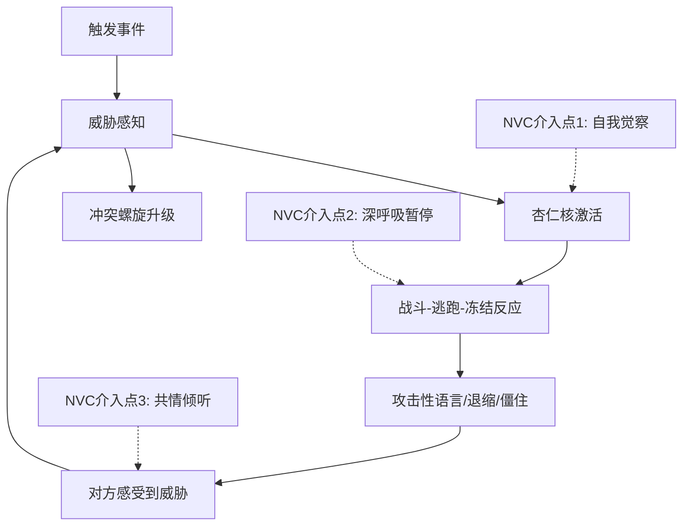
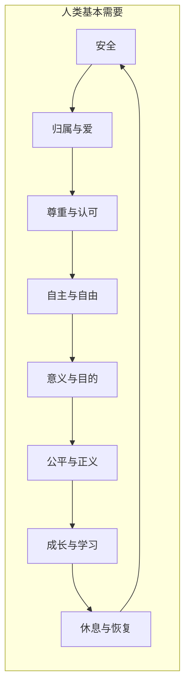

## 七、NVC在冲突中的应用

冲突是人类社会中最普遍也最被误解的现象之一。大多数人将冲突视为需要避免的"坏事"，或者需要通过胜负来解决的"战争"。非暴力沟通（NVC）提供了一个根本不同的视角：**冲突不是人与人之间的战争，而是策略与策略之间的竞争**。当我们穿透策略层面，回到人类共有的基本需要时，几乎所有的冲突都能找到出路。

本章将系统讲解如何将NVC应用于各类冲突场景——从家庭琐事到职场对抗，从内在挣扎到跨文化摩擦。你将掌握一套完整的冲突转化框架，不仅能化解眼前的争端，还能在冲突中深化彼此的理解和连接。

### 7.1 理解冲突的本质

#### 7.1.1 冲突的层次模型

冲突并非铁板一块。理解冲突的不同层次，是有效应对的前提。

| 层次 | 描述 | 典型表现 | NVC切入点 |
|------|------|----------|-----------|
| **策略层**（最表层） | 双方对"怎么做"意见不同 | "应该用方案A还是方案B" | 不在此层纠缠，向下探索 |
| **利益层** | 双方想要的具体结果 | "我要加薪" vs "我要控制成本" | 区分利益和立场 |
| **需要层**（核心） | 驱动利益的根本人类需要 | 双方都需要尊重、安全、自主 | 这是NVC的核心战场 |
| **身份层**（最深层） | 自我价值感和归属感 | "他不尊重我""我们被边缘化了" | 通过共情修复身份创伤 |

**关键洞察**：大多数冲突之所以难以解决，是因为双方停留在策略层争论——"我的方案更好"——而忽略了双方在需要层可能是完全兼容的。NVC的力量在于，它提供了一套系统的方法，将对话从策略层引导到需要层。

#### 7.1.2 冲突升级的心理机制

理解冲突为什么容易升级，有助于我们在关键时刻做出不同选择。



冲突升级的三个关键机制：

**机制一：威胁泛化**。当我们感到被攻击时，大脑会自动将当前事件与过去的创伤经历关联。伴侣忘记买牛奶这件小事，可能瞬间被编码为"你从来不在乎我"——过去所有被忽视的经历同时被激活。NVC通过聚焦当下的具体观察，帮助我们回到此刻的事实。

**机制二：归因偏差**。心理学研究反复证实，人类存在"基本归因错误"——我们倾向于将他人的行为归因于其品性（"他就是自私"），而将自己的行为归因于外部环境（"我是因为太忙才忘了"）。NVC的观察步骤要求我们区分事实和评判，直接对抗这一认知偏差。

**机制三：需要的对抗性幻觉**。在冲突中，我们很容易认为对方的需要和自己的需要是不相容的。"他需要自由，我需要安全，这两个需要不可调和。"但实际上，自由和安全是所有人类共享的需要——差异只在于满足这些需要的策略。NVC帮助我们穿透策略，看到彼此共享的人性。

#### 7.1.3 NVC看待冲突的三个核心前提

**前提一：所有冲突都可以转化为双方需要都得到满足的方案**。这不意味着总能找到完美方案，而是说在需要层面不存在真正的对立。当两个人都说"我需要尊重"时，他们实际上站在同一边——问题只是如何找到同时满足双方尊重需要的策略。

**前提二：暴力是未被满足的需要的悲剧表达**。当对方使用攻击性语言时，NVC不将其视为"敌人"，而是视为一个用悲剧方式表达痛苦需要的人。这个视角不是为暴力辩护，而是为我们提供了一个切入口——如果我们能听到语言背后的需要，就有机会转化冲突。

**前提三：强制力和惩罚是最后的手段，而非首选**。当时间紧迫、安全受威胁时，保护性强制（如阻止暴力行为）是必要的。但NVC强调，即使在这种情况下，事后仍需要回到需要层面进行对话，否则强制只会制造新的创伤和仇恨。

### 7.2 自我准备：进入冲突前的内在工作

在走进冲突之前，NVC要求我们先做好内在准备。没有这一步，再好的技巧也会变形为操控工具。

#### 7.2.1 自我共情清单

在介入冲突之前，问自己以下问题：

1. **我现在感受到什么情绪？** 命名它——愤怒、恐惧、羞耻、悲伤、无力。研究表明，仅仅是命名情绪（"affect labeling"）就能降低杏仁核的激活水平（UCLA的Lieberman等人的fMRI研究）。

2. **我有哪些需要没有被满足？** 不要急于指责对方，先对自己的需要保持诚实。

3. **我是否带着"敌人形象"进入对话？** 如果我内心已经把对方定义为"坏人""不讲理的人""自私的人"，我需要先处理这个形象，否则我的每一个字都会携带这种能量。

4. **我的意图是什么？** 是想赢得争论，还是想找到双方都满意的方案？是想证明自己是对的，还是想建立连接？

5. **我是否已经过了情绪峰值？** 如果愤怒值在8分以上（满分10分），先做深呼吸或短暂离开，等降到5-6分再进入对话。

#### 7.2.2 转化内在敌人形象

NVC中最有力量的练习之一，是将"敌人形象"转化为对对方需要的理解。这不是原谅或纵容，而是一种战略性的内在调整——它让你在对话中更清醒、更有影响力。

**练习步骤**：

1. 写下你对对方的所有评判（"他自私""她控制欲强""他们不讲信用"）。
2. 将每个评判转化为未被满足的需要（"他看重自主""她需要安全和秩序""他们需要可靠性"）。
3. 承认这些需要是合理的、人类共有的。
4. 区分需要和策略——对方的策略可能确实造成了伤害，但其背后的需要是正当的。

这个转化过程不意味着你放弃了自己的需要，也不意味着你认同了对方的行为。它意味着你获得了双重视角——既能看到自己的需要，也能看到对方的需要——这让你在谈判中处于更有利的位置。

### 7.3 冲突调解四步法

这是NVC冲突调解的核心框架。每一步都不可跳过，顺序至关重要。

#### 第一步：双方各自表达（使用NVC四要素）

**操作要求**：

- 甲方先完整表达：观察→感受→需要→请求
- 乙方只做倾听，不反驳、不解释、不辩护
- 然后角色互换：乙方表达，甲方倾听

**常见错误及纠正**：

| 常见错误 | 问题所在 | 纠正方法 |
|----------|----------|----------|
| "你总是迟到" | 评判而非观察 | "这周三次会议你分别迟到了10、15、20分钟" |
| "我觉得你不尊重我" | "觉得"后面跟的是想法，不是感受 | "我感到沮丧和无力" |
| "我需要你准时" | 需要和策略混淆 | "我需要尊重和被重视的感觉" |
| "你以后必须准时到" | 要求而非请求 | "你愿意和我一起想想怎么解决迟到的问题吗？" |

**表达模板**：

> "当[具体可观察的行为]发生时，我感到[情绪词汇]，因为我需要[基本人类需要]。你愿意[具体可执行的行动]吗？"

**深层表达模板**（当表面情绪掩盖了更深层的感受时）：

> "当[观察]发生时，表面上我感到愤怒，但更深处，我其实感到害怕和孤独，因为我需要[深层需要]。"

#### 第二步：确认理解（深度倾听与复述）

这一步的目标不是同意对方，而是让对方感到被真正听到了。研究表明，当人们感到自己的立场被理解后，他们的防御会降低50%以上（Harvard Negotiation Project的数据）。

**操作要求**：

- 甲方复述乙方的观察、感受、需要
- 乙方确认或纠正甲方的理解
- 乙方复述甲方的观察、感受、需要
- 甲方确认或纠正乙方的理解
- 反复进行，直到双方都说"是的，你理解了我"

**复述的技巧**：

- 用猜测的语气："我听到你说的是……对吗？"
- 复述需要，而不是复述故事："所以你需要的是安全感，对吗？"
- 不要加入自己的解读或评判
- 如果对方说"不，你没理解"，不要沮丧——请对方再表达一次

**当理解卡住时的三步突破法**：

1. **放大镜**："你能再具体说说，当时发生了什么让你有这种感受？"
2. **探照灯**："在所有的需要里面，最核心的那一个是什么？"
3. **镜子**："我听到你说了X和Y，哪一个对你更重要？"

#### 第三步：寻找共同需要

这是整个调解过程中最关键的转折点。当双方都感到被理解后，对话从"我的需要 vs 你的需要"转向"我们的共同需要"。

**操作要求**：

- 双方共同列出所有提到的需要
- 圈出双方共享的需要（通常包括：尊重、理解、公平、和谐、安全、信任）
- 确认哪些是最核心的需要——有时三四个需要里，真正核心的只有一个
- 用"我们"的语言重新框定问题："我们都需要被尊重，问题是找到一个让我们双方都感到被尊重的方案"

**共同需要探索清单**：



**为什么这一步如此重要？** 因为它重新定义了双方的关系——从对手变成共同面对问题的伙伴。当两个人面对同一个问题（"如何同时满足X需要和Y需要"）而不是面对彼此（"你 vs 我"），创造性解决方案就自然浮现了。

#### 第四步：共创解决方案

基于共同需要，双方一起头脑风暴可能的解决方案。

**操作规则**：

1. **数量优先**：先不评判，尽可能多地列出方案。目标是至少10个选项。
2. **评估标准**：每个方案都要对照双方的核心需要——它能满足甲方的核心需要吗？能满足乙方的核心需要吗？
3. **不选第一个出现的方案**：第一个方案通常是最显而易见的，但未必是最好的。继续探索，往往第7、8个方案才是真正有创意的。
4. **试验心态**："我们先试两周看看效果"——降低决策压力，增加灵活性。
5. **具体化**：方案必须具体到"谁在什么时间做什么"，不能是"以后多注意"这样的空话。

**方案评估表格**：

| 方案编号 | 方案描述 | 满足甲方需要？ | 满足乙方需要？ | 可行性 | 综合评分 |
|----------|----------|---------------|---------------|--------|----------|
| 1 | ... | ✓/✗/部分 | ✓/✗/部分 | 高/中/低 | 1-10 |
| 2 | ... | ✓/✗/部分 | ✓/✗/部分 | 高/中/低 | 1-10 |

### 7.4 完整调解案例

#### 案例一：室友家务冲突

**背景**：小A和小B合租一年。小A每天做饭和清洁，小B工作忙碌经常晚归。小A积累了三个月的不满，终于爆发。

**第一轮：甲方（小A）表达**

> "这周七天我做了所有的饭和清洁（观察）。我感到疲惫、委屈，还有一点愤怒（感受）。因为我需要公平、被看到、被支持（需要）。你愿意和我讨论一下家务分担的方案吗？（请求）"

**第一轮：乙方（小B）倾听后表达**

> "我听到你做了很多，感到疲惫和委屈，需要公平和支持。我理解。我的情况是：这三个月我接手了一个新项目，每天工作到晚上10点（观察），回到家已经筋疲力尽（感受），我需要休息和恢复，也需要你理解我现在的压力（需要）。我不是不想帮忙，是真的没有精力。"

**确认理解**：

- 小A复述："你需要休息和恢复，也需要被理解——你不是不愿意，是现在确实精力不够。对吗？"
- 小B确认："是的。你呢——你需要公平、被看到，不想一个人承担所有家务。对吗？"
- 小A确认："对，就是这样。"

**共同需要**：公平、和谐、相互支持、被理解、休息

**共创方案**（共列出8个，这里展示最终选择的3个）：

| 方案 | 内容 | 满足A的需要？ | 满足B的需要？ |
|------|------|--------------|--------------|
| 方案A | 工作日B负责点外卖/简单处理，周末B承担主要烹饪 | ✓ 公平 | ✓ 不消耗工作日精力 |
| 方案B | 每两周请一次保洁做深度清洁，费用AA | ✓ 减轻负担 | ✓ 不额外消耗精力 |
| 方案C | 项目结束后B连续一个月承包全部家务作为"补偿" | ✓ 公平感 | ✓ 短期有盼头 |

**最终方案**：A+B+C组合执行，两周后检查效果。

**调解者（如有的话）的观察**：这个案例的成功关键在于小B没有在第一时间解释和辩护，而是先完整倾听了小A。当小A感到被听到后，她自然也更愿意理解小B的处境。

#### 案例二：职场项目方向冲突

**背景**：产品经理和技术负责人对产品下一个版本的核心功能产生严重分歧。产品经理坚持做社交功能（认为能提高留存），技术负责人坚持重构底层架构（认为技术债已严重影响开发效率）。双方各执己见已持续两周，项目停滞。

**冲突诊断**：

- 策略层分歧："做社交功能" vs "重构架构"
- 利益层分歧：短期数据指标 vs 长期技术健康
- 需要层分析：双方都需要——成就感、影响力、被尊重、专业认可、产品成功

**调解过程**：

**产品经理表达**：
> "过去两周我提出的三个社交功能方案都被否决了（观察），我感到沮丧和焦虑（感受），因为我需要我的专业判断被尊重，也需要为产品的增长负责（需要）。你愿意听听我的完整方案再给反馈吗？（请求）"

**技术负责人表达**：
> "我看到过去半年线上故障率上升了40%，每次紧急修复都占用大量时间（观察），我感到压力很大，也有些愤怒（感受），因为我需要可持续性和对自己工作的自豪感（需要）。我希望我们能正视技术债的问题（请求）。"

**确认理解**：

- 产品经理："你需要可持续性——不只是现在能用，而是长期健康地运转。你对自己的工作有自豪感，技术债让你感到这份自豪感在流失。"
- 技术负责人："你需要增长——你的专业判断是基于数据分析的，被否定让你感到自己的价值被否定了。"

**共同需要**：产品成功、专业认可、可持续发展、被尊重、影响力

**共创方案**：

| 方案 | 内容 | 产品需要？ | 技术需要？ | 评估 |
|------|------|-----------|-----------|------|
| 1 | 做一个轻量社交功能+同时重构影响最大的1个技术模块 | ✓ | 部分 | 可行但两边都不够充分 |
| 2 | 本版本100%重构，下版本100%社交 | 部分 | ✓ | 产品等不了那么久 |
| 3 | 拆成两个子项目并行：A组做社交MVP（2周），B组重构核心模块（3周），合并发布 | ✓ 全力推进社交 | ✓ 同步解决技术债 | 最终选择 |

**结果**：方案3在两周后MVP上线，社交功能首周DAU提升12%。同时核心模块重构完成，后续开发效率提升约30%。双方都感到自己的专业贡献被看到了。

#### 案例三：亲密关系中的信任冲突

**背景**：妻子发现丈夫和异性同事频繁深夜微信聊天。虽然内容是工作相关，但妻子感到不安。丈夫认为妻子无理取闹，干涉自己的社交自由。

**妻子表达**：
> "我看到你最近两周和小李每天晚上11点后还在聊天（观察），我感到不安、害怕，还有嫉妒（感受），因为我需要安全感、专属感和被优先考虑（需要）。你愿意告诉我你们聊的内容，也愿意和我讨论一下界限吗？（请求）"

**丈夫防御性反应及调解者引导**：

丈夫最初说："你太敏感了，我们就是聊工作！"——这是典型的"豺狗语言"：评判+辩护。

调解者（或妻子用NVC倾听）引导丈夫表达：
> "你是不是感到被怀疑了？你需要信任和自由？"

丈夫确认后开始真实表达：
> "是的，我需要你信任我。我确实只是在聊工作。但我也承认，我可能没有考虑到你的感受。"

**共同需要**：信任、安全感、自由、被尊重、亲密

**共创方案**：

1. 丈夫主动分享聊天内容（自愿透明，不是被迫交出手机）
2. 双方共同定义"合适的社交边界"——具体到什么时间、什么频率
3. 妻子承诺不翻查手机，用表达感受代替监控
4. 每月一次"关系检查"，讨论边界是否需要调整

### 7.5 对方不配合NVC时怎么办？

这是NVC实践中最常见的挑战。你满怀善意地使用NVC，对方却继续攻击、退缩或冷暴力。

#### 7.5.1 应对攻击性语言

当对方说出"你就是个自私的人！"时：

**错误回应**：
- "我不是自私的人！"（辩护——升级冲突）
- "你才自私呢！"（反击——升级冲突）
- "好的好的，是我的错。"（屈服——损害自己）

**NVC回应——猜测对方的需要**：

> "我听到你说我很自私，我猜你是不是感到失望？你需要更多的关心和支持？"

这个回应做了三件事：
1. 不接受"自私"这个标签，但也不反驳
2. 将对话从评判引导到感受和需要
3. 给对方一个台阶——他可以确认或纠正你的猜测

**如果对方继续攻击**：

继续猜测，但加入自我表达：
> "我真的很想理解你的感受。同时，当你用'自私'这个词时，我感到受伤，因为我需要被公平地看待。你愿意告诉我，具体是什么事让你有这种感觉吗？"

#### 7.5.2 应对退缩和沉默

有些人面对冲突时不是攻击，而是关闭——沉默、回避、"随便你"。

**NVC回应——表达观察和感受，不施压**：

> "我注意到你沉默了（观察），我有些担心和不安（感受），因为我需要连接和理解（需要）。如果你现在需要空间，我可以等。你愿意告诉我你需要多长时间吗？（请求）"

**关键原则**：
- 给退缩者空间，但不放弃连接
- 不追问"你怎么不说话"
- 表达你的需要，同时尊重对方的节奏
- 设定一个明确的后续时间："我们明天晚饭后再聊？"

#### 7.5.3 应对持续不配合

如果对方长期拒绝任何形式的对话：

**NVC的边界设定**：

> "我尊重你现在不想讨论这个问题。同时，这个问题对我来说很重要，我需要找到解决的方式。如果两周内我们无法对话，我会[具体行动——如寻求第三方调解、书面表达、调整共同安排等]。"

这不是威胁，而是对自己需要的诚实表达。NVC不意味着你必须无条件接受对方的不配合。

### 7.6 特殊冲突场景的NVC应用

#### 7.6.1 权力不对等的冲突

当冲突双方存在明显的权力差异（上下级、父母与子女、服务提供者与客户），NVC的应用需要额外的敏感度。

**下级对上级使用NVC**：

> "老板，过去两周我的三个提案都没有收到反馈（观察），我感到有些不确定自己的方向是否正确（感受），因为我需要清晰和成长（需要）。您愿意抽15分钟和我聊聊这些提案吗？（请求）"

**注意事项**：
- 语言要更正式、更温和
- 请求要具体且低成本（"15分钟"而不是"好好聊聊"）
- 不要要求对方改变行为模式，而是要求一个具体的行动
- 如果被拒绝，不要当场坚持，可以书面表达

**上级对下级使用NVC**：

> "小张，我注意到过去三次交付都比截止日期晚了两天（观察），我有些担心（感受），因为我需要可靠性和对客户的承诺（需要）。你遇到什么困难了吗？我们一起看看怎么解决。"

**注意事项**：
- 不要用NVC包装命令——"你感到...你需要..."不是让你替对方说话
- 先询问对方的处境，不要一上来就提出请求
- 保持平等的姿态，即使你有权力优势

#### 7.6.2 群体冲突中的NVC

当冲突涉及多人（团队分歧、家庭争吵、社区争端），NVC的应用需要调整策略。

**调解者角色**：

在群体冲突中，通常需要一个中立的调解者。调解者的工作不是判断谁对谁错，而是：

1. **确保每个人都有表达机会**——"我想确保每个人的声音都被听到。小王，你有什么想说的？"
2. **帮助翻译**——当有人使用评判性语言时，帮助转化为需要的语言："我听到小李说'这不公平'，我猜你可能是需要公平和透明？"
3. **追踪共同需要**——在白板上列出所有提到的需要，圈出重叠的部分
4. **管理对话流程**——确保一次只有一个人说话，控制发言时间

**群体调解的特殊挑战**：

| 挑战 | 表现 | NVC应对 |
|------|------|---------|
| 从众效应 | 多数人的意见压制少数人 | 主动邀请少数意见："还有不同的看法吗？" |
| 联盟形成 | "我们这帮人" vs "他们那帮人" | 打破群体标签，回到个体表达 |
| 情绪传染 | 一个人的愤怒点燃全场 | 暂停，引导情绪表达："我看到大家情绪都很激动，我们先停一下，每个人用一句话说说自己的感受" |
| 跑题 | 从当前议题扯到历史恩怨 | "我理解这些事都很重要。现在让我们先聚焦在今天的议题上" |

#### 7.6.3 内在冲突的NVC

冲突不一定发生在两个人之间。很多时候，最激烈的冲突发生在自己内心——"我想辞职但又害怕"，"我应该原谅他但又做不到"。

**NVC内在调解的四个步骤**：

1. **列出内在的不同声音**：写下来，每个声音单独一段。
   - "一部分的我说：必须辞职，这个工作让我痛苦。"
   - "另一部分的我说：不能辞职，没有收入怎么办。"

2. **为每个声音找到需要**：
   - "辞职的声音代表了我的自主、成长、健康的需要。"
   - "留下的声音代表了我的安全、稳定、责任的需要。"

3. **承认所有需要都是正当的**：这不是非此即彼——安全和自主都是你的需要。

4. **创造性地满足所有需要**：
   - "有没有一个方案，能同时满足安全和自主？比如先找到下家再辞职？比如和老板谈调岗？比如在现有工作中寻找新的成长空间？"

### 7.7 NVC冲突调解与传统方法的对比

| 维度 | 传统谈判（立场式） | 原则性谈判（哈佛方法） | NVC冲突调解 |
|------|-------------------|----------------------|------------|
| **起点** | 我的立场是什么 | 我的利益是什么 | 我的感受和需要是什么 |
| **对待对方** | 对手 | 合作者 | 共同面对问题的人 |
| **核心策略** | 讨价还价 | 聚焦利益而非立场 | 连接到共同人性 |
| **情绪处理** | 忽略或压制 | 承认但不深入 | 深入探索情绪背后的需要 |
| **关系影响** | 消耗关系 | 维持关系 | 深化关系 |
| **适用场景** | 一次性交易 | 商业谈判 | 持续关系中的冲突 |
| **局限性** | 可能双输 | 需要双方理性参与 | 需要时间和练习 |

NVC不否定其他方法，而是为它们增加了"人性层"。在实际应用中，你可以将NVC与原则性谈判结合——先用NVC建立连接和理解，再用原则性谈判的框架共创方案。

### 7.8 冲突调解中的常见误区

#### 误区一：把NVC当成说服工具

**表现**："我用NVC的方式说了，但他还是不听！"

**纠正**：NVC的目标不是让对方接受你的方案，而是建立相互理解。如果你的目的是操控对方，对方会感受到，NVC就会失效。真正的NVC要求你准备好接受"对方的需要和我的需要同样重要"这个前提。

#### 误区二：跳过倾听直接给方案

**表现**："我理解你的感受了，那我们就这样做吧——"

**纠正**：当对方还没有充分表达自己的感受和需要时，任何方案都会被拒绝，因为它没有被"听到"。确认理解阶段可能需要反复3-5轮，耐心是必须的。

#### 误区三：把"不评判"变成"不表达"

**表现**："我不应该评判他，所以我什么都不能说。"

**纠正**：NVC不要求你沉默，而是要求你区分观察和评判。"你这周打了三次孩子"是观察；"你是个糟糕的父亲"是评判。你可以且应该表达观察、感受和需要。

#### 误区四：忽视自己的需要

**表现**："我应该无条件理解对方，自己的需要不重要。"

**纠正**：NVC不是自我牺牲。如果你总是忽略自己的需要去满足对方，你会积累怨恨，最终爆发。NVC要求对自己和对他人同样诚实和慈悲。

#### 误区五：在极端情境下机械使用

**表现**：在紧急危险时还在慢慢表达四要素。

**纠正**：NVC不排斥保护性强制。如果有人正在实施暴力，首要任务是确保安全，不是共情。事后可以使用NVC来处理残留的创伤和关系修复。

#### 误区六：要求对方也使用NVC

**表现**："你不能这样说，你应该用NVC的方式表达！"

**纠正**：你只能控制自己的表达方式。对方有权使用任何方式表达，你的任务是听到对方语言背后的需要，而非纠正对方的表达方式。

### 7.9 进阶：深度冲突调解的高级技巧

#### 7.9.1 按下暂停键的时机和方法

在冲突中知道何时暂停，比知道何时说话更重要。

**需要暂停的信号**：
- 心率明显加快（>100次/分钟）
- 开始翻旧账
- 音量不自觉提高
- 出现"你总是""你从来"等概括性语言
- 感到想哭或想摔东西

**暂停的正确方式**：

> "我现在感到情绪很强烈，需要10分钟冷静一下。这不是在逃避，我会回来继续聊。10分钟后我们在这里见。"

**错误的暂停方式**：
- 一声不吭地摔门而去
- "我不想跟你说了"（拒绝而非暂停）
- 暂停后不再回来

#### 7.9.2 修复性对话（Repair Conversation）

冲突后的修复和冲突中的调解同样重要。很多人在冲突平息后假装什么都没发生，这会让裂痕持续存在。

**修复性对话的结构**：

1. **承认伤害**："在刚才的争吵中，我说了X，我理解这让你感到Y。"
2. **表达自己的真实感受**："当时我表面上很愤怒，但内心其实感到害怕。"
3. **倾听对方的伤害体验**："你当时的感受是什么？"
4. **共同学习**："从这次冲突中，我们各自学到了什么？下次可以怎么做得不同？"
5. **具体承诺**："下次我感到愤怒时，我会先说'我需要暂停'，而不是直接攻击。"

#### 7.9.3 多轮调解的长期策略

有些深层冲突不是一次对话能解决的——特别是涉及长期积累的伤害、价值观差异或创伤经历。

**长期调解的节奏**：

```mermaid
gantt
    title 多轮调解时间线
    dateFormat  week
    section 第一周
    建立安全空间        :w1, week1, 1w
    section 第二周
    甲方完整表达        :w2, week2, 1w
    section 第三周
    乙方完整表达        :w3, week3, 1w
    section 第四周
    确认理解与共同需要  :w4, week4, 1w
    section 第五周
    共创方案            :w5, week5, 1w
    section 第六至八周
    方案执行与调整      :w6, week6, 3w
```

**每轮对话的时间控制**：
- 初次调解：60-90分钟
- 后续轮次：45-60分钟
- 不要超过2小时——疲劳会导致质量下降

**轮次之间的"作业"**：
- 自我共情日记：每天记录自己的感受和需要
- 对方需要猜测：写下你认为对方的三个最核心的需要
- 方案草稿：各自想出至少三个可能的解决方案

### 7.10 实战练习

#### 练习一：冲突转化模拟

**准备**：回忆一个你最近经历的冲突（不必是剧烈的，小摩擦也可以）。

**步骤**：
1. 写下你当时说的话（原话）
2. 用NVC四要素改写你当时想表达的内容
3. 猜测对方的观察、感受、需要（三要素，不需要请求）
4. 列出你和对方可能共享的三个需要
5. 想出五个可能的解决方案

#### 练习二：攻击性语言翻译

将以下"豺狗语言"翻译为NVC语言（猜测对方的感受和需要）：

| 原话 | 你的NVC翻译 |
|------|-------------|
| "你从来不听我说话！" | 感受：____ 需要：____ |
| "这个项目烂透了。" | 感受：____ 需要：____ |
| "你根本不关心这个家！" | 感受：____ 需要：____ |
| "随便吧，都听你的。" | 感受：____ 需要：____ |
| "你凭什么这么说我！" | 感受：____ 需要：____ |

**参考答案**：

| 原话 | 感受 | 需要 |
|------|------|------|
| "你从来不听我说话！" | 孤独、沮丧、被忽视 | 被理解、连接、重视 |
| "这个项目烂透了。" | 失望、疲惫、无力 | 意义感、成就感、胜任感 |
| "你根本不关心这个家！" | 害怕、孤独、不安全 | 爱、归属、安全感 |
| "随便吧，都听你的。" | 无力、沮丧、放弃 | 自主、被尊重、影响力 |
| "你凭什么这么说我！" | 受伤、被攻击 | 尊重、公平、被接纳 |

#### 练习三：内在冲突调解日志

连续一周，每天用5分钟记录一次内在冲突：

日期：____
内在声音A：____
内在声音A代表的需要：____
内在声音B：____
内在声音B代表的需要：____
所有需要的共同点：____
一个可以尝试的折中方案：____

### 7.11 本节核心要点

1. **冲突的本质是策略之争，不是人性之争**——穿透策略层，到达需要层，冲突就会转化。

2. **进入冲突前先做内在准备**——自我共情、转化敌人形象、确认意图。没有内在准备，外在技巧会失效。

3. **四步调解法不可跳过**——表达→确认理解→寻找共同需要→共创方案。跳过任何一步都会导致方案不稳定。

4. **对方不配合时，保持连接而非放弃**——通过猜测需要、设定边界、给空间但不断联来应对。

5. **不同场景需要不同策略**——权力不对等时更温和，群体冲突时需要调解者，内在冲突时需要对所有内在声音慈悲。

6. **冲突后的修复和冲突中的调解同样重要**——承认伤害、表达真实感受、共同学习、做出具体承诺。

7. **NVC不是万能的**——在紧急危险时优先确保安全，在对方持续不配合时设定边界，在深层创伤面前寻求专业帮助。

***
