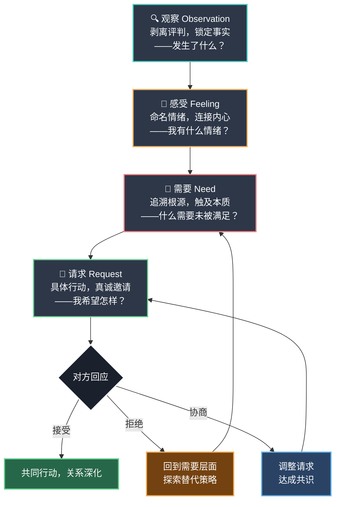

## 核心技巧总结：从理论到内化的完整地图

本节系统拆解了非暴力沟通（NVC）四步法的每一步——观察、感受、需要、请求——并展示了如何将它们整合为完整的沟通能力，以及如何在冲突场景中灵活运用。本篇小结将从全局视角重新审视这一体系，帮助你建立清晰的知识框架、识别关键要点、规避常见陷阱，并为后续的进阶练习做好准备。

### 一、四步法全景回顾

NVC四步法不是四个独立技巧的拼装，而是一条严密的**认知引导链**——每一步都是下一步的地基，跳过任何一步都会导致后续步骤失去支撑。

#### 每一步的核心要义与关键区分

| 步骤 | 核心问题 | 本质动作 | 最容易犯的错误 | 一句话检验标准 |
|------|----------|----------|--------------|--------------|
| **观察** | 发生了什么事实？ | 剥离评判，回到可被摄像机记录的信息 | 把形容词标签、绝对化概括、意图推论伪装成观察 | 去掉这句话后，换一个人看同一场景会得出不同结论吗？ |
| **感受** | 我的内心状态是什么？ | 准确命名情绪，为自己的感受负责 | 把想法/判断伪装成感受，用"你让我"归咎他人 | 去掉"我感到"三个字，剩下的是描述内心状态还是评价外部？ |
| **需要** | 什么深层需求驱动了这个感受？ | 从感受追溯到普世的、抽象的人类需要 | 把具体策略当作需要，把"需要你做X"当成需要表达 | 换一个人、换一种方式能同样满足吗？如果能，是策略而非需要 |
| **请求** | 我希望对方做什么具体行动？ | 提出正向、具体、可行的行动邀请 | 请求变成要求（不接受"不"），请求模糊不可执行 | 对方说"不"之后，你会施压、生气或冷暴力吗？ |

#### 四步之间的逻辑依赖关系

四步法不是简单的线性递进，而是存在双向反馈回路：

- **观察→感受**：没有事实基础的情感表达容易被反驳（"你太情绪化了"），以观察开场让对方保持理性倾听状态
- **感受→需要**：感受是需要的信使——准确命名感受才能追溯到背后的需要；如果跳过感受直接说"我需要"，往往说出的是策略而非真正的需要
- **需要→请求**：没有连接到需要的请求容易变成命令（"你必须道歉"），连接到需要后的请求才有灵活性（"我需要被尊重，你愿意告诉我你当时是怎么想的吗？"）
- **请求→观察**（反馈回路）：对方的回应（接受/拒绝/协商）构成新的观察输入，触发新一轮四步循环

### 二、四步法的核心能力清单

掌握NVC四步法需要发展四种相互关联的核心能力。以下清单可作为自我评估和持续练习的参照框架。

#### 2.1 观察能力：区分事实与评判

**能力定义**：能够客观描述感官接收到的具体信息，不加入评判、推论或标签。

**关键技能点**：

- **绝对化概括的识别与转化**：将"总是""从不""每次"替换为具体的次数和时间段——"这周你有三天在十点后回家"替代"你总是这么晚回来"
- **形容词标签的识别与转化**：将"你太懒了""你很冷漠"替换为具体的行为描述——"这周有三天你没有完成计划的任务"
- **意图推论的识别与转化**：将"你故意忽略我""你不在乎我"替换为可验证的行为——"我提了三个建议都没有被讨论"
- **隐性评判的识别**：注意"又""居然""显然"这类暗含判断的副词，以及"我观察到你很自私"这类用NVC外壳包装评判的"近敌"
- **正面观察的运用**：不只用于指出问题，也用于表达精确的欣赏——"你今天独立完成了整个项目的代码，没有一处报错"远比"你真棒"更有力量

**练习基准**：能够在日常对话中实时觉察自己的评判性语言，并在事后复盘时将其转化为观察性语言。

#### 2.2 感受能力：区分感受与想法

**能力定义**：能够准确命名当下的真实情绪状态，区分向内的感受描述和向外的判断评价。

**关键技能点**：

- **"伪感受"的识别**："我觉得被忽视了""我觉得不公平""我觉得你不爱我了"——这些都是想法，不是感受。真正的感受是"孤独""愤怒""害怕"
- **快速自检公式**：去掉"我觉得/我感到"后，剩下的词能否被反驳？如果能，就是想法；如果只有自己知道，就是感受
- **情绪颗粒度的提升**：从"不好"到"难过"到"失落"到"期待的认可没有到来"——颗粒度越高，情绪调节效果越好
- **身体感受的觉察**：胸口发紧（焦虑）、面部发热（愤怒）、喉咙发堵（悲伤）——身体往往比意识更早捕捉到情绪信号
- **负责任的表达**：用"我感到……"而非"你让我……"——为自己的感受负责，不把情绪归属权推给对方

**练习基准**：能够在感受到强烈情绪时，暂停评判，准确命名至少2-3种同时出现的感受，并连接到背后的需要。

#### 2.3 需要能力：区分需要与策略

**能力定义**：能够从感受出发追溯到深层的、普世的人类需要，并区分抽象的需要和具体的满足策略。

**关键技能点**：

- **从感受反推需要的三步法**：命名感受→"因为我的……需要未被满足"→"如果满足了这个需要，感受会有什么变化？"
- **需要与策略的核心区分**：需要是抽象的、普世的、不可替代的（如"尊重""安全感""连接"）；策略是具体的、个人的、可替代的（如"你必须道歉""你每天给我打电话"）
- **从评判中听到需要**：他人的攻击性语言背后往往隐藏着未被满足的需要——"你从来不关心我"背后是"连接和被重视"的需要
- **需要清单的内化**：熟悉七大需要类别（身体滋养、自主性、意义感、连接感、诚实、嬉戏、和谐）及对应的常见感受
- **需要冲突的双赢处理**：当两个人的需要看似矛盾时（一个需要"陪伴"，一个需要"独处"），回到需要层面寻找同时满足双方的策略

**练习基准**：在冲突场景中，能够在30秒内从愤怒/焦虑等情绪中识别出背后的需要，并区分自己表达的是需要还是策略。

#### 2.4 请求能力：区分请求与要求

**能力定义**：能够提出具体、正向、可行的行动邀请，并真诚地允许对方说"不"。

**关键技能点**：

- **好请求的三个特征**：具体（包含时间、行为、场景）、正向（说"要什么"而非"不要什么"）、当下可执行（不是"以后对我好一点"）
- **请求与要求的本质区分**：区别在于对方说"不"之后你的反应——能平静探索替代方案是请求，施压/生气/冷暴力是要求
- **否定式请求的转化**：将"你能不能别玩手机了"转化为"你愿意在晚饭时间和我聊天吗"
- **可拒绝性的实践**：每次表达请求后，内心真正为对方的"不"留出空间——这是NVC区别于操控的核心标志
- **先连接再请求的原则**：没有先建立情感连接（观察+感受+需要）的请求，无论句式多礼貌，都会被对方视为命令

**练习基准**：能够在提出请求前检查三个条件——是否具体？是否正向？是否允许说"不"？并能在对方拒绝时回到需要层面探索替代方案。

### 三、两种使用模式：自我表达与倾听他人

NVC四步法有两种根本不同的应用方向，二者同等重要。

| 维度 | 自我表达（我→你） | 倾听他人（你→我） |
|------|-------------------|-------------------|
| 方向 | 我有感受需要表达 | 对方有情绪需要被听见 |
| 核心动作 | 用四步法组织自己的表达 | 用四步法的逻辑解码对方的语言 |
| 关键技巧 | 观察→感受→需要→请求 | 反馈对方的观察/感受/需要/请求 |
| 常见错误 | 把NVC变成精心包装的指责 | 急于给建议/解释/反驳，而非先倾听 |
| 目标效果 | 让对方理解我的处境和需要 | 让对方感到"被听见了" |

**倾听模式的核心技巧——反馈**：

当对方向你发泄情绪时，不要反驳、不要解释、不要给建议，而是用你自己的话重述你听到的观察、感受、需要和请求。示例：

> 对方说："你从来不考虑我的感受！"
>
> 你的内心解码：感受——受伤、被忽视；需要——被关心、被看见
>
> 你的回应："你是不是在说最近有什么具体的事让你觉得受伤了？你是不是感到有些委屈和不被理解？你希望我怎么关注你的感受呢？"

"被听见"本身往往就能化解大部分攻击性。卢森堡说："当一个人感到被真正理解了，他会愿意听你说任何话。"

### 四、NVC的灵活性：形式可变，原则不变

四步法不是填空模板，而是内心导航系统。以下是几条关键的灵活性原则：

**不必每次都说全四步**。有时候一句"我需要安静几分钟"就是一次有效的NVC表达——它隐含了观察（当前环境不舒服）、感受（感到压力）、需要（平静）、请求（给我几分钟）。

**顺序可以调整**。紧急情况下先说请求："请你先停下来，因为你这样大声说话时我感到害怕，我需要安全的沟通环境。"

**可以只用其中一两步**。服务场景中，"我预约了三点，现在三点半了（观察），能帮我确认一下还有多久吗？（请求）"——两步就够了。

**但有一条原则不可违背——先连接，再请求**。如果没有先建立情感连接，直接提出的请求无论多礼貌都会变成命令。这是人类大脑的基本运作方式：当感到被威胁时，人类不会合作，只会防御或反击。

### 五、NVC的"近敌"：看起来像NVC但不是NVC的做法

这是学习NVC过程中最需要警惕的陷阱。以下六种"近敌"外表与NVC极其相似，但本质完全相反：

| 近敌 | 表面上像什么 | 实际是什么 | 识别方法 |
|------|------------|-----------|---------|
| 评判伪装成观察 | "我观察到你很自私" | 用"我观察到"包装评判 | 去掉"我观察到"后，是事实还是评价？ |
| "我感到你……"句式 | "我感到你在操控我" | "我感到"后面接的是对他人的判断 | 能否加上"我觉得"且去掉后仍是对他人的判断？ |
| 需要变成策略 | "我需要你每天给我打电话" | 具体行为要求不是需要 | 换一个人/方式能同样满足吗？ |
| 请求变成要求 | "你能不能……？"（但不接受"不"） | 形式是问句，实质是最后通牒 | 对方说"不"后你会生气/施压吗？ |
| NVC操控术 | 用四步法"包装"真实目的 | 学了句式但用来说服/操控 | 目标是理解对方，还是让对方听你的？ |
| 强制积极 | 跳过消极感受直接说"但我感恩…" | 用正能量压制真实情绪 | 你在表达感受，还是在逃避感受？ |

**识别近敌的根本问题：我此刻的目标是建立连接，还是赢这场对话？** 如果是后者，无论语言多"非暴力"，做的都不是NVC。

### 六、NVC在不同关系场景中的调整策略

四步法的原则是普世的，但在不同关系中需要调整表达的深度、措辞和侧重点：

| 关系类型 | 调整要点 | 表达侧重 | 典型示例调整 |
|----------|----------|----------|------------|
| **亲密关系** | 可以更直接表达感受，使用更亲密的措辞 | 感受+需要为主 | "晚上你玩手机不跟我说话时，我感到被冷落了，因为我需要亲密感" |
| **职场关系** | 感受表达相对克制，侧重观察和请求 | 观察+请求为主 | "我注意到会议议程没有被提前分享，这导致准备不充分，我们能提前三天发议程吗？" |
| **亲子关系** | 观察和请求要更具体，语言用孩子能理解的 | 观察+请求为主 | "我看到作业本上有五道题没写完，我有点担心，你能现在花二十分钟写完吗？" |
| **跨代沟通** | 减少"你"开头的句子，多用"我们""咱们" | 需要+请求为主 | "咱们家一直看重互相支持，我最近有些失落，以后打电话能先不聊感情话题吗？" |
| **服务场景** | 高度精简，可能只用观察+请求两步 | 观察+请求 | "我预约了三点，现在三点半了，能帮我确认一下还有多久吗？" |
| **数字化沟通** | 观察要更精确，感受要显式标注 | 全四步，但语言更温和 | "我知道你这周特别忙，我注意到有三条消息没来得及回，我挺失落的" |

### 七、NVC的学习路径：从生硬到自然的四个阶段

掌握四步法不是一蹴而就的，学习者通常经历四个阶段：

| 阶段 | 核心体验 | 标志性转变 | 持续时间 |
|------|----------|----------|---------|
| 无意识不胜任 | "我的沟通方式没问题，都是对方的错" | 第一次意识到"我刚才说的话其实是评判" | 接触NVC之前 |
| 有意识不胜任 | "我现在能听到评判了，但不知道怎么改，反而更痛苦" | 坚持住——更痛苦恰恰是成长正在发生的信号 | 数周到数月 |
| 有意识胜任 | "在低风险场景中能用四步法了，但高压场景会掉回去" | 第一次在日常对话中完整使用了四步法 | 数月 |
| 无意识胜任 | "NVC成了默认设置，不需要在脑中过公式" | 在激烈争吵中自动切换到NVC模式 | 数月到数年 |

**关键提醒**：阶段二（有意识不胜任）是放弃率最高的阶段。学了NVC之后"更痛苦"是正常的——因为你现在能听到自己和他人话语中的暴力了，但还不知道怎么改。**这个痛苦是成长正在发生的信号，不是退步。**

### 八、核心能力自评清单

用以下清单评估你对四步法各步骤的掌握程度。评分标准：1=完全不会，2=理解概念但无法应用，3=能在低风险场景中应用，4=能在大多数场景中应用，5=自然内化无需刻意思考。

**观察能力**（目标：总分≥16/20）：

- 我能在对话前区分"我看到的事实"和"我对事实的判断"（___/5）
- 我能避免使用"总是""从不""每次"等概括性词语（___/5）
- 我能用具体的时间、频率、数量来描述事件（___/5）
- 在情绪激动时，我仍然能先描述事实而非先下结论（___/5）

**感受能力**（目标：总分≥16/20）：

- 我能区分"感受"和"想法"（如区分"我感到焦虑"和"我觉得你不关心我"）（___/5）
- 我至少能命名10种不同的情绪（不只是"开心""不开心""生气"）（___/5）
- 我能在对话中直接表达感受，而不是用行为暗示（___/5）
- 我表达感受时不会让对方觉得是在指责（___/5）

**需要能力**（目标：总分≥16/20）：

- 我能从感受出发追溯到背后的需要（___/5）
- 我能区分"需要"和"策略"（如区分"我需要安全感"和"你不能跟异性吃饭"）（___/5）
- 我能承认自己的需要而不觉得"太矫情"或"太自私"（___/5）
- 我能在冲突中看到对方行为背后的需要（___/5）

**请求能力**（目标：总分≥16/20）：

- 我的请求包含具体的时间、行为和场景（___/5）
- 我的请求是正向的（说"要什么"而非"不要什么"）（___/5）
- 我能真诚地接受对方说"不"而不施压（___/5）
- 当对方拒绝时，我能探索替代方案而非生闷气（___/5）

**总分解读**：64-80分=NVC已基本内化；48-63分=有意识胜任阶段，持续练习即可；32-47分=有意识不胜任阶段，需要更多练习和耐心；16-31分=刚入门，建议从观察步骤开始逐步练习。

### 九、NVC的力量与边界

#### NVC能做到什么

- **化解表面冲突**：将"谁对谁错"的立场之争转化为"如何满足双方需要"的合作探索
- **建立深层连接**：通过表达脆弱（真实的感受和需要）而非展示强硬来建立信任
- **打破指责循环**：当一方开始用NVC表达，对方的防御反应会自然降低
- **提升自我觉察**：NVC练习的副产品是更清晰地认识自己的情绪模式和需要模式
- **促进创造性解决问题**：从策略层面（"你必须道歉"）回到需要层面（"我需要被尊重"），打开更多可能性

#### NVC的边界与局限

NVC不是万能的。在以下场景中，需要谨慎使用或配合其他方法：

- **紧急安全场景**：当存在身体暴力或严重心理伤害风险时，首要任务是确保安全，不是沟通
- **严重心理危机**：当对方处于重度抑郁、急性创伤反应等状态时，需要专业心理干预
- **单方面拒绝沟通**：NVC需要双方的基本意愿；当对方明确拒绝任何形式的对话时，NVC无法单方面起效
- **权力严重不对等**：在极端不平等的权力关系中（如职场霸凌、家庭暴力），NVC可能被强势方利用来操控弱势方
- **文化适应性**：直接的NVC表达在某些高语境文化中可能显得生硬或不合时宜，需要灵活调整

### 十、下一步：从知道到做到

回顾完核心技巧的全部内容后，重要的是明确：**NVC的价值不在于你理解了多少，而在于你实践了多少。** 后续两个小节将提供具体的支持：

- **进阶练习方法**：从日常观察日记到情绪颗粒度训练，从身体觉察到角色互换练习——一系列由浅入深的刻意练习方案，帮助你把四步法从"知识"转化为"本能"
- **常见误区**：系统梳理NVC实践中的典型错误——把NVC当成说话技巧、认为NVC意味着不能生气、把NVC当成万能药——帮助你在练习过程中少走弯路

**一个简单的起点**：从今天开始，每天选一个时刻，问自己三个问题——

1. 刚才发生了什么？（观察）
2. 我的感受是什么？（感受）
3. 这个感受背后，我真正需要的是什么？（需要）

不需要说出来，不需要改变任何行为，只需要在内心完成这个练习。坚持21天，你会发现——你看待冲突的方式，已经悄然改变了。

***
