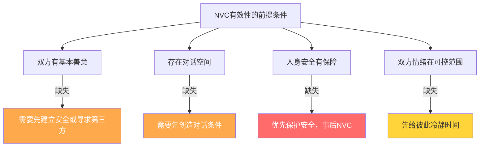
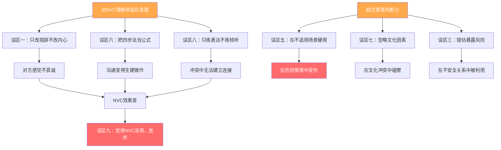

## 九、NVC应用中的常见误区

学习非暴力沟通的过程中，几乎每个人都会在某些阶段掉入特定的"坑"。这些误区不是因为你学得不够认真，而是因为旧有的沟通惯性太强、对NVC的理解容易停留在表面、以及实际情境的复杂性远超理论框架。

本节从**实操角度**出发，逐一拆解NVC实践中最常见的九类误区，重点放在：如何在第一时间识别自己正在犯错，以及如何快速矫正。每个误区都配有自检清单、对比示例和矫正练习，帮助你把"知道"转化为"做到"。

---

### 9.1 误区一：NVC就是说话好听

#### 误区的本质

很多人接触NVC后的第一反应是"这是一套好好说话的技巧"。于是开始改变措辞：把"你太自私了"换成"我感到受伤"，把"你总是迟到"换成"我注意到时间安排有些不同"。语言确实变柔和了，但内心的评判、愤怒、委屈一点没减少。

问题在于：**对方不是聋子，也不是傻子。** 你的微表情、语气节奏、身体姿态会泄露真实情绪。心理学中的"梅拉比安法则"（Albert Mehrabian, 1971）指出，在涉及情感态度的沟通中，语言内容只占7%，语调占38%，肢体语言占55%。也就是说，你精心包装的NVC措辞，只占对方感知的不到一成。

#### 自检清单

| 检查项 | 信号 |
|--------|------|
| 说出NVC句子时，内心是否有评判在翻涌？ | "我嘴上说'我感到孤独'，心里想的是'你怎么又这样'" |
| 对方听完后是否表现出困惑或不适？ | 对方皱眉、沉默、或说"你到底想说什么" |
| 你是否在说话前反复排练措辞？ | 花5分钟想怎么说，而不是想自己真正需要什么 |
| 表达之后你是否感到释然？ | 如果没有，说明你只是换了包装，没换内容 |

#### 对比示例

> **表面NVC**：
> "当你没有回复我的消息时（观察），我感到被忽视（感受），因为我需要被重视（需要）。你愿意及时回复我吗？（请求）"
>
> 内心独白："你凭什么不回我消息？你是不是不在乎我了？"
>
> **问题**：措辞是NVC的，但意图是操控的。对方能感觉到话里藏着的质问。

> **真诚的NVC**：
> 先对自己——"我现在很焦虑，因为我发了消息没收到回复。我需要安全感和被重视的感觉。这份焦虑是真实的，但我需要先搞清楚事实。"
>
> 再对对方——"嘿，我之前发的消息你看到了吗？我有点在意这个。"
>
> **区别**：后者没有用"标准句式"，但四个要素（观察、感受、需要、请求）都包含在内，而且是真诚的。

#### 矫正练习：内在扫描法

在表达之前，用30秒做一次快速内在扫描：

1. **觉察评判**（5秒）：我此刻对对方有什么评判？写下来或在心里默念，不做任何处理
2. **识别需要**（10秒）：这个评判背后，我真正需要的是什么？（安全感？尊重？连接？公平？）
3. **评估真诚度**（5秒）：如果我现在说出来，有多少是真诚的表达，多少是伪装？
4. **决定时机**（10秒）：现在说合适吗？我需要先冷静一下吗？

这个练习的目的不是"净化思想"，而是**让你看清自己**。带着评判去表达NVC并不是失败——觉察到自己的评判本身就是NVC的核心能力。

---

### 9.2 误区二：NVC意味着不能生气

#### 误区的本质

这个误区的逻辑链是：NVC叫"非暴力"→ 愤怒是暴力 → 所以用NVC就不能生气。这个推导每一步都是错的。

马歇尔·卢森堡在《非暴力沟通》中专门用一章讨论"表达愤怒"。他明确指出：**愤怒不是问题，用愤怒去攻击别人才是问题。** NVC不是让你压抑愤怒，而是帮你把愤怒转化为对自身需要的觉察。

愤怒在神经科学中有明确的生理基础：杏仁核检测到威胁信号后触发"战或逃"反应，肾上腺素和皮质醇分泌增加，心率加速，肌肉紧张。这个过程是自动的、不可控的。你不可能"决定不生气"，就像你不可能"决定不被烫到"。你能控制的是**愤怒之后的行为选择**。

#### 愤怒的NVC处理四步法

| 步骤 | 操作 | 内部过程 | 时间 |
|------|------|----------|------|
| 第一步：暂停 | 停下来，深呼吸3次 | 给前额叶皮层重新接管控制权的时间（需要约6秒） | 10-30秒 |
| 第二步：剥离想法 | 识别触发愤怒的想法 | "他不尊重我" → 这是一个想法/判断，不是事实 | 30秒-1分钟 |
| 第三步：追溯需要 | 问自己"我需要什么" | "我需要被尊重、被平等对待" —— 这才是愤怒的根源 | 1-2分钟 |
| 第四步：选择表达 | 决定如何表达这个需要 | 可以用NVC表达，也可以选择其他方式 | 视情况而定 |

#### 对比示例

> **用愤怒表达**（不推荐）：
> "你凭什么在那么多人面前批评我？你是不是故意让我难堪？你就是看我不顺眼！"
>
> 这是**用愤怒作为武器**——目的是攻击对方、宣泄情绪、赢得争论。

> **表达愤怒**（NVC方式）：
> "刚才在会议上，你指出了我方案中的三个问题（观察）。说实话，我现在很生气，也有点丢脸（感受，包含愤怒）。我需要自己的工作被尊重地对待，如果有问题可以私下沟通（需要）。你愿意以后先把问题告诉我，再在会上讨论吗？（请求）"
>
> 这是**表达愤怒这种感受**——目的是让对方了解你的状态，同时寻求改变。

#### 关键区分

| 维度 | 用愤怒表达 | 表达愤怒 |
|------|----------|---------|
| 意图 | 攻击、惩罚、控制 | 让对方了解你的感受和需要 |
| 对愤怒的态度 | 愤怒是武器 | 愤怒是信号 |
| 时机 | 愤怒的高峰（杏仁核劫持状态） | 愤怒稍缓后（前额叶重新参与） |
| 关注点 | 对方做错了什么 | 我的什么需要没有被满足 |
| 效果 | 对方防御或反击 | 对方有可能听到你的需要 |

#### 矫正练习：愤怒日记

连续一周，每天记录一次愤怒体验，格式如下：

日期：____
触发事件：____（只写事实，不写评判）
愤怒强度：1-10分：____
当时的想法：____（把脑子里的想法原样写下来）
背后的需要：____（问自己5次"为什么我在意这个"）
我做了什么：____
如果重来我会怎么做：____

这个练习的目的不是消灭愤怒，而是**缩短从愤怒爆发到需要觉察之间的时间**。初学者可能需要几小时才能意识到"我生气是因为我需要尊重"，熟练后可以在愤怒升起的几秒内完成这个转换。

---

### 9.3 误区三：NVC会让对方觉得我软弱

#### 误区的本质

这个误区背后有一个隐藏假设：**表达感受和需要 = 暴露弱点 = 在权力博弈中失去筹码。** 这个假设在某些情境中是成立的（见误区四），但作为一种普遍判断，它误解了NVC的力量来源。

布琳·布朗（Brené Brown）在TED演讲《脆弱的力量》中指出，适度的脆弱性表达不是软弱，而是勇气的体现。研究显示，领导者适度表达不确定性和感受时，团队的信任度和协作效率反而提升（Edmondson, 1999, "Psychological Safety"研究）。

但这里有一个重要的前提：**脆弱性表达只在安全的关系中才有效。** 在敌对环境中暴露脆弱确实危险——这不是NVC的问题，而是情境判断的问题。

#### 两种力量的对比

| 维度 | 刚性力量 | 韧性力量（NVC） |
|------|---------|----------------|
| 表现 | 不示弱、不妥协、不暴露感受 | 清晰表达立场，同时愿意倾听 |
| 短期效果 | 可能让对方服从 | 可能让对方理解 |
| 长期效果 | 关系僵化，信任流失 | 关系深化，信任积累 |
| 对方感受 | "他很强硬，我最好别惹他" | "他在认真对待这件事，我愿意配合" |
| 适用场景 | 紧急决策、需要快速权威 | 需要协作、需要长期关系 |
| 核心 | 控制 | 连接 |

#### NVC表达立场的示例

> **场景：同事总是把杂活推给你**
>
> **软弱版**（误以为的NVC）：
> "没关系，我可以帮你做。"（压抑自己的需要，讨好对方）
>
> **强硬版**：
> "你自己的活自己干，别总找我。"（表达立场，但损害关系）
>
> **NVC版**（韧性力量）：
> "我注意到最近几周你把X、Y、Z三个任务转给了我（观察）。说实话，我有点不高兴，也有压力（感受）。我需要公平的分工和对自己时间的掌控（需要）。你负责的部分还是由你来处理，如果有困难我们可以一起看看怎么解决（请求 + 边界）。"
>
> **区别**：NVC版既表达了立场（"你负责的部分由你来处理"），又保持了对关系的尊重（"如果有困难我们可以一起看看"）。这不是软弱，这是**有力量的温和**。

#### 矫正练习：角色切换法

当你担心"表达感受会让我显得软弱"时，做这个思维实验：

1. 想一个你尊敬的人（领导、导师、公众人物）
2. 想象他/她在同样的情境中，清晰而平静地说："我需要……，我希望……"
3. 你会觉得这个人软弱吗？
4. 大多数时候答案是不会——因为你尊敬的人**清晰表达需要**时，你感受到的是自信，不是软弱
5. 你在别人眼中也可以是这样的

---

### 9.4 误区四：NVC要求对方也用NVC

#### 误区的本质

"我用NVC了，但他还是用吼的/讽刺的/冷暴力的回应我，NVC根本没用！"——这是最常见的挫败感来源。问题不在于NVC没用，而在于对NVC作用机制的误解。

NVC的作用不是"改变对方的回应方式"，而是**改变你们之间互动的质量**。你无法控制对方说什么，但你可以控制自己如何回应。当你持续用同理心去回应对方的暴力语言时，对方感受到的不是"你用了什么技术"，而是"这个人真的在听我说话"。

这不需要对方"也学过NVC"。事实上，卢森堡在巴以冲突调解、监狱教育、学校冲突化解等场景中，面对的都是没有学过NVC的人，但效果依然显著。

#### 当对方用暴力语言回应时的应对策略

| 对方的回应 | 你的NVC回应 | 内在操作 |
|-----------|------------|---------|
| 对方吼叫 | "你现在很生气，对吗？你在乎的是……" | 翻译：愤怒 → 需要 |
| 对方讽刺 | "听起来你对这件事有很多不满，你愿意多说一些吗？" | 听到讽刺背后的需要 |
| 对方沉默 | "你现在需要一些空间吗？我等你准备好了再聊。" | 尊重对方的节奏 |
| 对方人身攻击 | "我听到你说的了。我想了解，是什么让你这么难受？" | 分离攻击行为和背后的需要 |
| 对方翻旧账 | "看来这件事对你影响很大。你现在最需要的是什么？" | 聚焦当下的需要 |

#### 关键原则

1. **你不需要"赢"**：NVC的目标不是让对方认输或道歉，而是建立连接
2. **倾听不等于同意**：理解对方的感受和需要，不等于接受对方的行为
3. **保护自己**：如果对方的行为升级到侮辱、威胁或暴力，优先保护自己（参见误区五）
4. **持续实践**：旧模式的改变需要时间，对方第一次可能不买账，但持续的同理心回应会逐渐改变互动模式

#### 矫正练习：翻译练习

当对方用暴力语言和你对话时，在内心做一个即时翻译：

对方说："你从来不考虑我的感受！你就是个自私的人！"

内心翻译：
- 评判："从来不考虑""自私" → 这是评判，不是事实
- 感受猜测：对方可能感到受伤、失望、被忽视
- 需要猜测：对方需要被重视、被考虑、被理解

NVC回应（内心或外在）：
"你现在很受伤，你觉得我没有考虑到你。你希望我更多地关心你的感受，对吗？"

这个翻译练习可以在心里做，不需要说出来。它的价值在于：**让你不再被对方的语言激怒，而是听到语言背后的需要。**

---

### 9.5 误区五：NVC是万能的

#### 误区的本质

"只要我坚持用NVC，所有冲突都能解决。"这个信念会导致两个问题：第一，当NVC"失败"时，你会怪自己"学得不够好"；第二，你会在NVC不适用的情境中强行使用，导致更严重的后果。

NVC有明确的适用前提：

#### NVC不适用的六类情境

| 情境 | 为什么不适用 | 应该怎么做 |
|------|------------|----------|
| 紧急安全威胁 | 时间不允许对话，每秒都是风险 | 直接行动保护安全，事后NVC沟通 |
| 对方有明确恶意 | NVC假设善意，恶意者会利用你的开放 | 设定边界，切断联系，必要时报警 |
| 严重权力不对等且无保护 | 表达需要可能招致报复 | 寻求第三方支持、制度保护 |
| 制度性/结构性问题 | 个人对话无法改变系统 | 政策倡导、集体行动、法律途径 |
| 对方处于极端情绪状态 | 大脑处于"杏仁核劫持"状态，无法理性对话 | 给空间，等情绪降温后再沟通 |
| 你自己的情绪过于激烈 | 你无法在极端情绪下保持NVC意识 | 先自我同理，找安全空间冷静后再回来 |

#### 一个关键区分

NVC"失败"有两种完全不同的含义：

1. **你真诚地尝试了，但对方没有回应** → 这不叫失败，这叫"你做了你能做的"。结果不完全在你控制范围内
2. **你用了NVC的句式，但内心充满操控意图** → 这不是NVC失败了，而是你没有真正使用NVC

#### 矫正练习：情境评估清单

在使用NVC之前，花30秒快速评估：

- [ ] 双方是否存在人身安全风险？→ 如果是，先保护安全
- [ ] 对方是否有基本的善意？→ 如果不确定，降低暴露程度
- [ ] 双方的情绪是否在可控范围？→ 如果不是，先给空间
- [ ] 当前是否有对话空间？→ 如果没有，创造条件或等待时机
- [ ] 我自己的情绪状态如何？→ 如果太激动，先自我同理

如果前三个选项中有任何一个答案是"是"或"不确定"，暂停NVC，先处理前置条件。

---

### 9.6 误区六：NVC就是"四步公式"

#### 误区的本质

"当我看到____（观察），我感到____（感受），因为我需要____（需要）。你愿意____吗？（请求）"——很多初学者把这个句式当成了NVC本身，每次对话都像在填表格。结果是：说话变得生硬、做作、不自然，对方能明显感觉到你在"使用一种技术"。

四步法是**学习阶段的脚手架**，不是最终形态。就像学习骑自行车时的辅助轮——它帮你建立平衡感，但你最终要拆掉辅助轮自由骑行。

#### 四步法的灵活运用

| 灵活方式 | 示例 | 说明 |
|---------|------|------|
| 省略步骤 | "你愿意帮我看看这个吗？"（只有请求） | 日常交流中不需要每句都四步齐全 |
| 调换顺序 | "我需要安静。刚才你在旁边放音乐，我有点烦躁。" | 需要→观察→感受，同样有效 |
| 要素融入自然语言 | "走吧，饿死了，去吃饭！" | 观察（饿了）、感受（难受）、需要（食物）、请求（一起去）全包含在一句话里 |
| 只用倾听侧 | "你是不是很生气？你觉得他们不尊重你？" | 不是每个NVC时刻都需要你自己表达 |
| 只表达其中一个要素 | "我需要一些时间想想。" | 有时候一个要素就够了 |

#### 自然NVC vs 机械NVC

> **机械版**：
> "当我看到你把碗放在洗碗池里没有洗的时候（观察），我感到有点不满（感受），因为我需要整洁的环境（需要）。你现在愿意去把碗洗了吗？（请求）"
>
> 对方感受：你在给我下指令，还用了一套"话术"来包装。

> **自然版**：
> "碗还没洗呢——我今天做饭累了，你去洗一下？"
>
> 观察（碗没洗）、感受（累了）、需要（休息/分工）、请求（去洗碗）全部包含在内，但完全不像在"做NVC"。

#### 内化四阶段

大多数NVC学习者卡在"有意识胜任"阶段——能用，但需要想，所以显得刻意。突破这个阶段的唯一方法是**大量练习**，而不是"更好地背诵四步法"。

#### 矫正练习：场景速练

每天选3个日常场景，用10秒在心里过一遍NVC四要素，但**不说出标准句式**，而是用你自然的语言说出来。

场景：室友把公共区域弄乱了
→ 10秒心里过：观察（东西散落一地）、感受（不舒服）、需要（整洁）、请求（收拾一下）
→ 自然说出来："嘿，你东西收一下呗，客厅都快没处下脚了。"

---

### 9.7 误区七：NVC不适用于中国文化

#### 误区的本质

"NVC太'西化'了，中国人不这样说话。"这个说法对了一半：NVC的**表达形式**确实需要文化适配，但NVC的**核心原则**——真诚、理解、尊重——是跨文化的。

中国文化语境中，NVC面临的三个核心张力：

| 张力 | 西方NVC假设 | 中国文化现实 | 适配方向 |
|------|-----------|------------|---------|
| 个人需要 vs 关系和谐 | 个人需要优先表达 | 关系和谐常常优先于个人表达 | 将个人需要转化为关系需要 |
| 直接表达 vs 含蓄暗示 | 清楚说出感受和需要 | "说出来"本身可能破坏面子 | 善用含蓄表达和暗示 |
| 平等对话 vs 等级关系 | 双方平等对话 | 上下级、长幼有序 | 根据关系调整表达姿态 |

#### 文化适配的具体策略

**策略一：将"我需要"转化为"我们都需要"**

> 西方式："我需要被尊重。"
>
> 中国文化适配："我觉得咱们团队互相尊重很重要。" —— 同样的需要，但嵌入了集体框架。

**策略二：借助权威和外部信息**

> 西方式："当你说这些话时，我感到受伤。"
>
> 中国文化适配："最近看了一篇文章，说沟通方式对团队效率影响挺大的。我觉得咱们可以试试……" —— 借助"第三方权威"来传达你的需要，减少直接冲突。

**策略三：书面形式降低尴尬**

有些感受面对面说不出口，写下来反而更自在。微信消息、邮件、手写便条都是NVC的载体。书面形式给了双方缓冲时间，也减少了即时情绪反应的压力。

**策略四：用"请教"替代"请求"**

> 西方式："你愿意以后私下给我反馈吗？"
>
> 中国文化适配："领导，我想请教一下，您觉得我哪些方面还可以改进？" —— "请教"姿态尊重了等级关系，同时隐含了"我希望获得建设性反馈"的需要。

**策略五：自我批评先行**

> 直接NVC："你做的事情让我不舒服。"
>
> 中国文化适配："这件事我也有做得不好的地方。同时我想和你聊一聊……" —— 先自我反思，降低对方的防御心理。

#### 适配不是妥协

文化适配不等于放弃NVC的核心。如果你的文化适配变成了：
- 完全压抑自己的需要（只照顾面子）
- 永远不直接表达感受（一直暗示对方猜）
- 在权力面前永远退让（从不敢对上级说"不"）

那不是文化适配，那是文化借口。**真正的文化适配是在坚持NVC核心精神的前提下，找到在这个文化中最有效的表达方式。**

#### 矫正练习：文化适配改写

选一个你觉得"在中国文化中说不出来"的NVC表达，用上面五种策略分别改写一遍：

原始NVC："妈妈，当你催我结婚时，我感到压力很大，因为我需要自主决定人生大事的权利。你愿意不再提这个话题吗？"

策略一（集体框架）："妈，我知道您希望我幸福，我也希望。我们都希望我找到对的人。"
策略二（借助权威）："妈，我最近看到一些研究说，婚姻压力太大反而影响择偶质量……"
策略三（书面形式）：发一条长微信，把感受和需要写清楚
策略四（请教姿态）："妈，您当年是怎么决定和爸结婚的？我也在想这个问题。"
策略五（自我反思先行）："妈，我知道我年纪不小了，这件事我自己也着急。同时……"

---

### 9.8 误区八：忽视倾听，只练表达

#### 误区的本质

NVC有两条腿：**表达**和**倾听**。大多数学习者把90%的精力放在"怎么用四步法说话"上，几乎不练习倾听。卢森堡本人反复强调：在冲突中，**先倾听对方**往往比先表达自己更有效。

原因很简单——人在强烈情绪中时，听不进任何话。你的NVC表达再完美，对方如果还在愤怒/伤心/恐惧中，他的大脑处于"杏仁核劫持"状态，前额叶皮层（负责理性思考）的功能被抑制。这时候你的话在他耳中就是噪音。

**只有当对方感到被理解之后，他才有能力听你说话。**

#### NVC倾听的五个层次

| 层次 | 操作 | 示例 | 效果 |
|------|------|------|------|
| 第一层：全身心在场 | 放下手机，面向对方，保持眼神接触 | 停下手里的事，看着对方 | "他在认真听我说" |
| 第二层：猜测观察 | 确认你理解的事实是否正确 | "你是说今天开会时……" | "他理解了事情经过" |
| 第三层：猜测感受 | 尝试命名对方的情绪 | "你是不是很生气？还有点失望？" | "他知道我的感受" |
| 第四层：猜测需要 | 触碰对方感受背后的需要 | "你希望你的努力被看到？" | "他真正理解我了！" |
| 第五层：确认连接 | 确认对方感到被理解 | "你现在感觉怎么样？还有想说的吗？" | "我可以听你说了" |

当倾听到达第四层时，你通常会看到对方的明显变化——叹气、眼神变软、肩膀放松、甚至流泪。这说明你触碰到了对方真正的需要，连接建立了。

#### 常见的"假倾听"

| 类型 | 表现 | 内心独白 |
|------|------|---------|
| 等待反驳型 | 表面在听，实际在想怎么反驳 | "等他说完我就告诉他为什么他错了" |
| 解决方案型 | 急于给建议 | "这个问题很简单，你只需要……" |
| 比惨型 | 把话题拉回自己 | "你这算什么，我那次更惨……" |
| 安慰型 | 急于消除对方的负面情绪 | "别想太多了，会好的" |
| 技术型 | 机械使用NVC倾听句式 | "你是不是感到……你是不是需要……" |

这五种类型的共同问题是：**关注点不在对方身上，而在自己身上。**

#### 矫正练习：倾听冥想

找一个伙伴，做10分钟的倾听练习：

1. A分享一个最近困扰自己的事（3分钟）
2. B只做倾听，不给建议、不评价、不分享自己的经历。只用猜测感受和需要来回应
3. A确认是否感到被理解："是的，你理解了"或"还差一点，我其实更需要的是……"
4. 交换角色
5. 结束后分享：被真正倾听是什么感觉？倾听别人时有什么困难？

---

### 9.9 误区九：期待立即见效

#### 误区的本质

"我学了NVC，但第一次用就失败了。"——如果你学了一周的钢琴，第一次弹就弹不好听，你会觉得钢琴"没用"吗？NVC是一套需要长期练习的能力，不是一颗吞下去就见效的药丸。

#### NVC学习的真实时间线

| 阶段 | 时间范围 | 典型体验 | 应该期待什么 |
|------|---------|---------|------------|
| 初始尝试期 | 第1-4周 | 感觉别扭，经常"失败"，四步法记不全 | 能记住四步法的名字就是进步 |
| 初见成效期 | 第1-3个月 | 偶尔成功，有时倒退，在安全关系中效果好 | 关注"成功时刻"而非"失败次数" |
| 习惯形成期 | 第3-12个月 | 越来越自然，但遇到老模式还是会"退化" | 能在冲突中暂停并觉察就是巨大进步 |
| 深度内化期 | 第1-3年 | 自然流露，遇到新挑战能应对 | NVC开始影响你看待世界的方式 |
| 持续精进期 | 3年以上 | 在复杂情境中灵活运用 | 学无止境，但你已经有了根基 |

#### 常见"失败"的重新解读

| "失败"体验 | 常见解读 | 更准确的解读 |
|-----------|---------|------------|
| "我用了NVC，对方更生气了" | "NVC让事情更糟了" | 对方可能在释放积压的情绪，这是变好的前兆 |
| "我改变了，他不改变" | "NVC没用" | NVC改变的是你，不是对方。你改变了互动模式的质量 |
| "我坚持了很久，关系没改善" | "白学了" | 有些关系问题超出沟通范畴，NVC不是万能的（见误区五） |
| "我总是退回旧模式" | "我不是用NVC的料" | 旧模式是几十年形成的，退化是正常的，觉察到退化本身就是进步 |

#### 进步的真正标志

不要用"冲突是否解决了"来衡量NVC的效果，而是用这些更细腻的指标：

1. **觉察速度**：从冲突发生到你意识到"我在用旧模式"的时间是否在缩短？
2. **恢复速度**：从情绪爆发到你重新回到NVC意识的时间是否在缩短？
3. **自我同理**：你是否能更快地连接自己的感受和需要？
4. **关系质量**：即使冲突没有减少，关系的整体信任感是否在增加？
5. **内在状态**：你是否感到更少的内耗、更多的清明？

#### 矫正练习：NVC进步日志

每周花10分钟回顾：

本周NVC实践回顾
日期：____

本周尝试NVC的场景：
1. ____
2. ____
3. ____

最成功的一次：____
为什么成功：____

最困难的一次：____
卡在了哪里：____

下周想练习的重点：____

和一个月前相比，我最大的变化是：____

---

### 9.10 误区的系统性识别与矫正

#### 误区之间的因果链

这九个误区不是孤立的，它们之间存在递进关系：

#### 五维自检框架

每次NVC实践后，用这个框架快速自检：

| 维度 | 检查问题 | 信号 |
|------|---------|------|
| **真诚性** | 我是在真诚表达还是在操控/表演？ | 对方说"不"时我是否愤怒/失望 |
| **完整性** | 我同时照顾了自己和对方的需要吗？ | 长期感到疲惫或委屈 |
| **情境适配** | 这个场景适合NVC吗？ | 存在紧急危险、恶意行为或严重权力不对等 |
| **文化适配** | 表达方式适合这个文化语境吗？ | 对方表现出不适、困惑或"你怎么这么说话" |
| **自然度** | 我的表达是否自然流畅？ | 对方能感觉到我在"使用技术" |

如果五个维度中有一个亮红灯，就回到对应的误区章节进行矫正。

---

### 本节小结

NVC的九类误区可以归纳为三个根本问题：

1. **理解偏差**（误区一、六）：停留在技术层面，没有进入意识层面
2. **情境误判**（误区五、七）：忽略了NVC的适用条件和文化边界
3. **实践失衡**（误区二、三、四、八、九）：在关注他人和关注自己、表达和倾听、期待和耐心之间失去平衡

避免误区的核心方法不是记住更多规则，而是**持续地、诚实地面对自己**——面对自己的评判、恐惧、需要和局限。当你对自己足够诚实的时候，NVC的表达自然会从内心流出。

> **"NVC不是让你变成一个更好的人，而是让你成为你本来就是的那个人。"**
> —— 马歇尔·卢森堡
