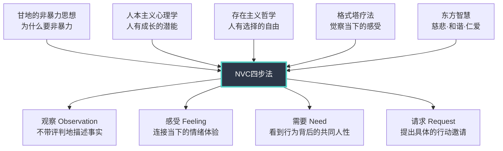

## 一、马歇尔·卢森堡与非暴力沟通的诞生

要真正理解非暴力沟通（Nonviolent Communication, NVC），不能只学它的四步法——那只是冰山露出水面的部分。水面之下，是一个人用六十年生命经历铸就的哲学体系。卢森堡不是在书房里空想出这套方法的，他是在底特律的种族暴乱中、在中东的炮火下、在卢旺达大屠杀后的废墟里，一次一次验证和修正它。理解他的经历，就是理解NVC为什么会是这个样子。

### 1.1 卢森堡的生平

#### 1.1.1 底特律的童年：暴力的亲历者

马歇尔·卢森堡（Marshall Rosenberg, 1934-2015）出生于美国密歇根州底特律。他的童年，恰好与美国种族冲突最激烈的年代重叠。

1943年底特律种族暴乱（Detroit Race Riot of 1943）是美国历史上最严重的城市种族冲突之一。暴乱持续三天，造成34人死亡、433人受伤、1893人被捕。卢森堡当时年仅9岁。他后来回忆说，那段经历让他第一次深刻意识到：**偏见和恐惧如何将人变成野兽，而语言——评判、标签、妖魔化——是这一切暴力的起点。**

卢森堡的家族本身也是偏见的受害者。作为犹太裔美国人，他在学校遭受过反犹太主义的欺凌和排斥。他描述过一个反复出现的场景：同学们用带有侮辱性的称呼叫他，而老师的回应方式——要么假装没听见，要么用"你别在意"来敷衍——让他深感愤怒和无力。这种"语言暴力被忽视"的经历，成为他日后研究沟通方式的最初动力。

更关键的是，卢森堡观察到一个让他困惑的现象：**施暴者往往不认为自己在施暴。** 那些用语言伤害他的同学，脸上带着"理所当然"的表情；那些对欺凌视而不见的成年人，觉得自己是在"维护秩序"。这个观察埋下了一颗种子：人们是如何在"觉得自己是对的"的状态下伤害别人的？

#### 1.1.2 师从罗杰斯：学术根基的奠定

卢森堡后来进入威斯康星大学（University of Wisconsin-Madison），攻读临床心理学博士学位，师从人本主义心理学的奠基人卡尔·罗杰斯（Carl Rogers）。

罗杰斯对卢森堡的影响是根本性的。罗杰斯提出了三个核心概念，直接成为NVC的理论基石：

**无条件积极关注（Unconditional Positive Regard）**：治疗师对来访者保持全然的接纳，不评判、不标签化。罗杰斯认为，当一个人感受到被无条件接纳时，他会自然地开始成长和改变。NVC中的"不带评判的观察"直接源于这一理念——如果我们用评判性语言与人交流，对方感受到的是"条件性关注"（只有你改变我才接受你），这会触发防御反应。

**共情性理解（Empathic Understanding）**：不是站在自己的角度去"理解"对方，而是真正进入对方的主观世界，用对方的眼睛看、用对方的耳朵听。罗杰斯区分了两种理解：一种是"我理解你是因为我有类似经历"（投射性理解），另一种是"我理解你是因为我真正听到了你"（共情性理解）。NVC中的"共情倾听"正是后者的具体操作化。

**一致性（Congruence）**：治疗师必须是真诚的、内外一致的，不能戴着"专业面具"假装关心。这个概念直接影响了NVC的一个重要原则：**NVC不是话术，不是表面的礼貌，而是内外一致的真诚表达。** 如果你内心在愤怒，却用NVC的句式包装出一个温和的外表，那就违背了NVC的核心精神。

卢森堡在罗杰斯的实验室里待了数年，但他后来坦率地说，他学到的最重要的一件事不是任何具体技术，而是罗杰斯与人互动时的那种**存在状态**——真正地在场、真正地好奇、真正地尊重。这种存在状态，是NVC的灵魂。

#### 1.1.3 从书斋到街头：民权运动中的实践

1960年代，美国民权运动如火如荼。卢森堡没有选择留在大学做纯学术研究，而是走上了街头。

他开始在种族冲突的现场担任调解人。这些经历让他发现了一个关键问题：**学术界研究的沟通理论，在真实冲突中几乎不可用。** 当两个群体互相仇恨、互相恐惧时，没有人在乎"积极倾听的五个步骤"。他们需要的是——有人能听到他们愤怒背后的痛苦。

正是在这些街头调解中，卢森堡开始发展出一套不同于传统心理咨询的方法。他发现：

- **当他说"我理解你的愤怒"时，没有人买账**——因为这句话听起来像是在居高临下地"分析"对方。
- **当他真正听到对方愤怒背后的恐惧和悲伤时，对方会突然安静下来**——不是因为他"说服"了对方，而是因为被真正听到本身就具有治愈力。
- **当他对施暴者说"你是不是也很害怕"时，施暴者会流泪**——因为从来没有人关心过施暴者的感受。

这些观察构成了NVC的核心洞见：**暴力行为的背后是未被满足的需求和未被表达的痛苦。** 要化解暴力，不是去压制它，而是去听到它背后的声音。

#### 1.1.4 NVC的成型：1960年代至1980年代

从1960年代到1980年代，卢森堡用了整整二十年时间，将他在街头调解中的经验系统化为一套可教授的方法论。这个过程不是线性的，而是螺旋上升的：

**1960年代：雏形阶段。** 卢森堡开始在社区工作坊中教授他的沟通方法，但还没有形成系统框架。他主要依赖现场演示——在冲突双方之间来回穿梭，用"翻译"的方式帮双方听到对方的真实需求。

**1970年代：框架形成。** 卢森堡正式将他的方法命名为"非暴力沟通"（Nonviolent Communication），取名自甘地的"非暴力"（Ahimsa）理念。他开始系统地教授"观察-感受-需要-请求"的四步结构。"豺狗语言"和"长颈鹿语言"的隐喻也在这个时期被引入，用以帮助学员直观地区分暴力沟通和非暴力沟通。

**1984年：非暴力沟通中心（CNVC）成立。** 卢森堡在加利福尼亚州创立了非暴力沟通中心（Center for Nonviolent Communication），这是一个全球性的教育组织，致力于NVC的培训和认证。CNVC的成立标志着NVC从卢森堡的个人实践正式成为一个有组织、可传播的方法论体系。

#### 1.1.5 全球冲突中的实战验证

NVC不是在安全的教室里验证的。卢森堡带着这套方法走进了世界上最危险的地方：

**以色列-巴勒斯坦冲突**：卢森堡多次前往中东，在以色列人和巴勒斯坦人之间进行调解。他在这些对话中展示了NVC最惊人的能力——**即使在双方都深信对方是"敌人"的情况下，NVC仍然能够创造对话空间。** 他的方法不是让双方"各退一步"，而是帮双方听到彼此深层的恐惧和需要。他描述过一个场景：当一个巴勒斯坦人真正听到一个以色列母亲对孩子安全的恐惧时，他说："你的恐惧和我的恐惧是一样的。"这种"需求层面的共鸣"是NVC解决冲突的核心机制。

**卢旺达大屠杀之后**：1994年卢旺达大屠杀造成约80万至100万人死亡。屠杀之后，卢森堡前往卢旺达，在胡图族和图西族幸存者之间组织对话。这些对话的难度远超一般的冲突调解——参与者中有大屠杀的施害者和受害者，他们坐在同一个房间里。卢森堡的工作不是"原谅"，而是帮助双方听到彼此的人性。他后来在演讲中提到，有一个图西族妇女在听到一个胡图族男人讲述他在屠杀期间的恐惧和胁迫后，流着泪说："我从来没想过，你也会害怕。"

**其他冲突地区**：卢森堡和他的同事还将NVC带入了尼日利亚、哥伦比亚、斯里兰卡、北爱尔兰等冲突地区。在每个地方，NVC都展示了同一个核心能力：**帮助人们从"谁对谁错"的争执，转向"谁需要什么"的对话。**

#### 1.1.6 晚年与遗产

卢森堡在生命的最后三十年里，几乎把全部精力投入到NVC的全球传播中。他在40多个国家举办过工作坊，培训了数千名NVC培训师，写了多本书籍，其中《非暴力沟通》（Nonviolent Communication: A Language of Life）被翻译成30多种语言，成为该领域的经典之作。

2015年2月7日，卢森堡在家中去世，享年80岁。他的去世并没有终结NVC——CNVC继续在全球运作，认证培训师网络遍布六大洲，NVC被应用于教育、医疗、司法、企业管理、外交谈判等众多领域。

但卢森堡留下的最重要的遗产，不是一套方法或一个组织，而是一种信念：**人类的本性不是暴力的，暴力是习得的——因此，和平也是可以学习的。**

### 1.2 NVC的诞生：关键转折点

NVC不是某一天突然被"发明"出来的。它是卢森堡在数十年实践中逐步提炼的产物。但有几个关键时刻，对NVC的形成起到了决定性作用。

#### 1.2.1 第一个转折点：童年的困惑

卢森堡在回忆录和多次演讲中反复提到一个童年经历：在学校被反犹太主义的同学欺凌后，他注意到自己的内心同时存在两种冲动——一种是想打回去的愤怒，另一种是想理解"他们为什么要这样做"的好奇。他的母亲建议他"别在意"，但他发现自己做不到。他需要理解暴力的根源。

这个"困惑"不是学术问题，而是一个存在性的问题：**为什么人类会伤害同类？有没有一种方式，可以既不忍受暴力，也不施加暴力？** 这个问题驱动了卢森堡的一生。

#### 1.2.2 第二个转折点：罗杰斯实验室中的发现

在罗杰斯的实验室里，卢森堡参与了大量心理治疗的观察和分析。他发现了一个规律：**治疗师的语言模式——特别是是否带有评判——比任何具体技术更能预测治疗效果。** 当治疗师说"你的行为是不健康的"时，来访者的防御反应会立即被激活；当治疗师说"我注意到你在这个情境中感到了痛苦"时，来访者会开始敞开心扉。

这个发现让卢森堡意识到：**评判性语言本身就是一种暴力，即使说话者完全没有恶意。** 人类的神经系统无法区分"善意的评判"和"恶意的评判"——评判就是评判，它会触发大脑的威胁检测系统。

#### 1.2.3 第三个转折点：社区调解中的顿悟

1960年代末，卢森堡在一次社区种族冲突调解中经历了他后来称为"顿悟"的时刻。当时，两个群体正在激烈争吵，互相指责对方"种族歧视"和"暴力倾向"。传统的调解方法——"请双方各让一步"——完全无效。

卢森堡尝试了一种新方法：他不再试图让双方"达成共识"，而是问每个人："当对方那样做的时候，你真正感受到的是什么？你真正需要的是什么？"

结果令人震惊。当一个白人居民说"我感到害怕，我需要知道我的孩子在上学路上是安全的"，而一个黑人居民说"我也感到害怕，我需要知道我的孩子不会因为肤色被区别对待"时，房间里突然安静了。**双方发现，他们的恐惧和需要是相同的——都是对安全和公正的需求。** 冲突的根源不是"对方是坏人"，而是"双方都在用暴力方式表达相同的需求"。

这次经历让卢森堡提炼出了NVC的核心公式：**评判和指责是需求的扭曲表达。如果我们能听到评判背后的需求，冲突就有了突破口。**

#### 1.2.4 第四个转折点：动物隐喻的引入

1970年代初，卢森堡在一次工作坊中需要向一群普通市民解释"暴力沟通"和"非暴力沟通"的区别。学术术语（"评判性语言"vs"描述性语言"）太抽象，学员听不懂。

他灵机一动，想到了两种动物：

- **豺狗（Jackal）**：在东非文化中，豺狗是狡猾、机会主义的动物，常在夜间发出刺耳的叫声。卢森堡用它来比喻评判、指责、攻击性的语言模式——那些让人想"逃走"或"反击"的语言。
- **长颈鹿（Giraffe）**：长颈鹿是陆地上心脏最大的动物（心脏约11公斤），同时也是脖子最长的动物——它能"从高处看到全局"，能"用心去听"。卢森堡用它来比喻非暴力沟通的语言模式——从心出发、看到全局、听到深层需求。

这个隐喻出乎意料地有效。学员们立即理解了两种语言模式的区别，而且记住了。从此，"豺狗语言"和"长颈鹿语言"成为NVC教学中的标志性概念。

### 1.3 NVC的理论渊源

NVC不是凭空创造的。它融合了多个思想传统的精华，并将它们整合为一套可操作的方法论。理解这些渊源，能帮助你理解NVC为什么这样设计——以及当实操遇到困难时，你可以回到这些原点重新思考。

#### 1.3.1 人本主义心理学：NVC的心理学根基

NVC最直接的理论来源是人本主义心理学（Humanistic Psychology），特别是卡尔·罗杰斯和亚伯拉罕·马斯洛的贡献。

**卡尔·罗杰斯的贡献**：

罗杰斯的人本主义治疗理论建立在一个核心假设之上：**人天生具有成长和自我实现的倾向，只要提供适当的环境条件（无条件积极关注、共情性理解、一致性），人就会自然地朝向健康方向发展。**

NVC将这个假设应用到了日常沟通中。卢森堡认为：**如果我们在沟通中能提供"无条件积极关注"（不评判）、"共情性理解"（听到需求）、"一致性"（真诚表达），对方也会自然地朝向合作和理解的方向发展。**

罗杰斯还提出了"治疗性关系"的概念——治疗的效果不取决于治疗师使用了什么技术，而取决于治疗关系的质量。NVC同样强调：**NVC的效果不取决于你说了什么"正确的话"，而取决于你是否真正与对方建立了心与心的连接。**

**亚伯拉罕·马斯洛的贡献**：

马斯洛的需求层次理论（Maslow's Hierarchy of Needs）为NVC的"需要"（Need）步骤提供了理论框架。马斯洛将人类需求分为五个层次：

| 层次 | 需求类型 | NVC中的对应 |
|------|----------|-------------|
| 第一层 | 生理需求（食物、水、睡眠） | 滋养身体的需求 |
| 第二层 | 安全需求（人身安全、健康、稳定） | 安全感、稳定性的需求 |
| 第三层 | 社交需求（归属感、爱、友谊） | 连接、归属、亲密的需求 |
| 第四层 | 尊重需求（自尊、认可、成就） | 尊重、认可、价值感的需求 |
| 第五层 | 自我实现需求（实现潜能、创造力） | 意义、成长、创造力的需求 |

NVC在此基础上进一步简化，提出了一个更通用的"人类基本需求清单"，包括：自由、连接、意义、玩耍、和谐、诚实、滋养身体、滋养心灵等。这些需求不分高低层级，被认为是所有人类共有的。

**关键区别**：马斯洛的需求层次理论强调"低层需求优先满足"，而NVC认为**任何层次的需求被忽略都会导致痛苦和冲突**。一个物质充裕但长期被忽视的人，和一个物质匮乏但被深爱的人，同样会感到痛苦——因为他们的需求没有被看到。

#### 1.3.2 甘地的非暴力思想：NVC的精神内核

NVC的"非暴力"一词直接来自圣雄甘地（Mahatma Gandhi）的非暴力（Ahimsa）理念。

**Ahimsa的核心含义**：

Ahimsa是梵语，字面意思是"不伤害"（non-harm）。但甘地对它的诠释远超字面意思。他认为，Ahimsa不仅是"不施加暴力"，更是"积极地爱"——**不是消极地避免伤害，而是积极地去理解、去连接、去化解造成暴力的根源。**

甘地有句名言："An eye for an eye only ends up making the whole world blind."（以眼还眼，最终全世界都会变成瞎子。）NVC的哲学正是建立在这个认识之上：**暴力——无论是身体暴力还是语言暴力——都会引发更多暴力。唯一的出路是从暴力的循环中跳出来。**

**Satyagraha（真理的力量）**：

甘地还提出了Satyagraha的概念，通常被翻译为"真理的力量"或"灵魂的力量"。Satyagraha的核心理念是：**通过坚持真理、展现爱和承受痛苦（而非施加痛苦）来感化对手。** NVC中的一个重要原则与此呼应：**当对方用暴力语言攻击你时，不反击、不退缩，而是用共情倾听来"接收"对方的痛苦——这种"接收"本身就是一种力量。**

卢森堡明确指出，NVC中的"非暴力"不是"软弱"的代名词。恰恰相反，**在愤怒中保持共情、在攻击中保持连接，需要极大的内在力量。** 这种力量不是来自压制情绪，而是来自对需求的清晰觉察。

#### 1.3.3 存在主义哲学：选择与责任

NVC还吸收了存在主义哲学的核心洞见，特别是维克多·弗兰克尔（Viktor Frankl）的思想。

弗兰克尔是纳粹集中营的幸存者，他在《活出生命的意义》（Man's Search for Meaning）中写下了这段被NVC反复引用的话：

> "在刺激和回应之间，有一个空间。在这个空间里，我们有选择回应方式的自由和力量。我们的成长和幸福在于我们的回应。"

这段话揭示了NVC的一个核心信念：**你无法控制别人说什么、做什么，但你可以选择如何回应。** 这种选择的自由，是NVC四步法的哲学前提。

存在主义的另一个贡献是**对"责任"的强调**。NVC中有一个重要概念叫"对自己的感受负责"——**别人不能"让你"生气，是你对别人行为的解读导致了你的感受。** 这不是在"责怪受害者"，而是在赋予每个人改变自己生活的力量：如果我的感受取决于我对事情的解读，那么改变解读就能改变感受。

让-保罗·萨特（Jean-Paul Sartre）的存在主义名言"存在先于本质"也在NVC中有回响：**你不是"一个愤怒的人"，你只是在此刻感到愤怒。** 标签化（把自己或他人固定为某种"本质"）是一种暴力，而NVC要求我们看到人的可变性和可能性。

#### 1.3.4 东方智慧：慈悲、和谐与无为

卢森堡在晚年多次提到，东方哲学——特别是佛家、道家和儒家的思想——与NVC有着深层的共鸣。

**佛家的慈悲与正语**：

佛教的"正语"（Right Speech）是八正道之一，强调说话要真实、有益、适时、温和。NVC的"观察而非评判"与"正语"的要求高度一致。

更深层的共鸣在于"慈悲"（Karuna）。佛教中的慈悲不是怜悯（怜悯暗含着"我比你高"的层级关系），而是**对众生痛苦的深度共情，以及帮助众生离苦得乐的愿望**。NVC中的"共情倾听"正是这种慈悲的实践形式——不是"可怜"对方，而是"听到"对方的痛苦并真诚地想要回应。

佛家的"缘起"理论也与NVC的因果观一致：**一切现象都是因缘和合的结果，没有孤立存在的"坏人"。** 一个人的暴力行为是他的经历、环境、需求和痛苦的综合结果。NVC不要求我们"原谅"暴力行为，但要求我们看到暴力行为背后的完整因果链。

**道家的和谐与无为**：

老子在《道德经》中说："善利万物而不争。"NVC的精神正是如此——**不是去"赢"一场对话，而是去创造一个双方需求都能被满足的解决方案。** "不争"不是放弃，而是从"零和博弈"转向"共赢"。

庄子的"齐物论"——万物平等、是非相对——也与NVC拒绝"对错"二元对立的精神一致。NVC不问"谁对谁错"，只问"谁需要什么"。

**儒家的仁与忠恕**：

孔子的"己所不欲，勿施于人"（恕道）是NVC的中国版表达。NVC的四步法本质上就是在践行"恕道"——**用我希望被对待的方式去对待别人：不被评判、被倾听感受、需求被看到、请求被尊重。**

孟子的"恻隐之心"——人天生具有同情心——与NVC的核心信念完全一致：人类天生具有共情能力，暴力是习得的偏离，而非本性。

#### 1.3.5 格式塔心理学与完形疗法

NVC还从弗里茨·珀尔斯（Fritz Perls）的格式塔疗法中汲取了灵感。格式塔疗法强调**对当下体验的觉察**——关注"此时此刻"的身体感受、情绪状态，而不是沉浸在过去的记忆或未来的担忧中。

NVC的"感受"步骤直接运用了这一理念：**感受是当下的、身体的体验，而不是对过去的评价或对未来的预测。** "我感到胸口发紧"是感受，"我觉得你以后还会这样"是想法。格式塔疗法帮助卢森堡区分了"感受"和"想法"——这是NVC四步法中最关键的区分之一。

#### 1.3.6 思想融合的逻辑

这些不同的思想传统并不是简单地被"拼凑"在一起的。卢森堡将它们融合为一个有机的整体：

- **甘地回答了"为什么要非暴力"**——因为暴力只会创造更多暴力，唯一的出路是理解。
- **罗杰斯回答了"如何创造安全的对话环境"**——无条件积极关注、共情性理解、一致性。
- **马斯洛回答了"人的行为背后的驱动力是什么"**——需求。
- **存在主义回答了"人是否有能力改变"**——是的，人有选择回应方式的自由。
- **格式塔回答了"如何觉察当下"**——关注身体感受，区分感受和想法。
- **东方智慧回答了"如何在冲突中保持人性"**——慈悲、恕道、不争。

NVC的四步法，就是将这些哲学洞见转化为日常可操作的行为指南。

### 1.4 NVC的核心洞见

在所有这些理论渊源的交汇处，卢森堡提炼出了几个改变了他的实践的核心洞见。这些洞见不是"理论"，而是他在数十年调解中反复验证的经验性发现。

#### 1.4.1 洞见一：评判是暴力的起点

卢森堡发现，几乎所有形式的人际暴力——从家庭争吵到种族屠杀——都始于评判性语言。当一个群体开始用"那些人是邪恶的/低等的/危险的"来描述另一个群体时，暴力就已经开始了。语言不是暴力的"前奏"，语言本身就是暴力的一种形式。

这个发现的实践意义是：**如果我们能学会不带评判地观察和描述，暴力循环就可以在起点被打破。** 这就是NVC四步法将"观察"放在第一位的原因。

#### 1.4.2 洞见二：愤怒的背后是未被满足的需求

卢森堡在调解中反复观察到：**愤怒不是"坏脾气"，而是未被满足的需求发出的信号。** 当一个人的需求长期被忽视或否定时，愤怒会以扭曲的方式表达出来——评判、指责、攻击。

但愤怒本身不是问题。问题在于我们对愤怒的回应方式。NVC不教人"控制愤怒"或"压抑愤怒"，而是教人**听到愤怒背后的需求，并找到不伤害他人的方式来满足那个需求。**

卢森堡说过一句被NVC社区广泛引用的话："Every criticism, attack, insult, and judgment is a tragic expression of an unmet need."（每一种批评、攻击、侮辱和评判，都是未被满足需求的悲剧性表达。）

#### 1.4.3 洞见三：共情是最强大的力量

卢森堡在最极端的冲突场景中验证了一个反直觉的发现：**共情比任何"强硬手段"都更有力量。** 当一个人在愤怒中被真正听到——不是被"分析"、被"建议"、被"安慰"，而是被真正听到——他的愤怒会自然地软化。

这不是"软弱"，而是人类神经系统的基本工作方式。当大脑的威胁检测系统（杏仁核）被激活时，人会进入"战斗-逃跑"模式，无法进行理性对话。**共情——真正被听到的体验——能解除杏仁核的警报**，让前额叶皮层（负责理性思考的部分）重新接管。

#### 1.4.4 洞见四：需求是普遍的，策略是个人的

NVC的一个核心区分是"需求"（Need）和"策略"（Strategy）的区别。需求是人类共有的——安全感、连接、尊重、自由、意义。策略是个人用来满足需求的具体方式——"你必须每天给我打电话"是策略，"我需要连接感和被重视"是需求。

这个区分是解决冲突的关键。**两个看起来不可调和的立场，往往只是满足同一需求的不同策略。** 当双方从"策略层面"上升到"需求层面"时，创造性解决方案就会出现。比如，两个人为"周末去哪"争吵——一个人想去爬山（策略），另一个人想宅在家（策略）。如果深入需求，两个人可能都需要"放松"（需求）和"在一起"（需求）。从需求出发，可以找到无数种双方都满意的方案。

### 1.5 NVC的全球传播与发展

#### 1.5.1 从个人实践到全球运动

NVC的传播路径很有特点。它不像某些方法论那样通过学术论文或政府推广传播，而是**主要通过工作坊、口碑和培训师网络传播**。

| 时期 | 里程碑 | 影响 |
|------|--------|------|
| 1960年代 | 卢森堡在社区工作坊中教授 | NVC在小范围内传播 |
| 1970年代 | 四步法框架正式形成 | 方法论可复制 |
| 1984年 | CNVC成立 | 组织化传播开始 |
| 1990年代 | 进入以色列、卢旺达等冲突地区 | 实战验证 |
| 2003年 | 《非暴力沟通》英文版出版 | 全球传播加速 |
| 2010年代 | 被翻译成30多种语言 | 全球化 |
| 2015年 | 卢森堡去世 | CNVC继续运作 |
| 2020年代 | 在线工作坊普及 | 可及性大幅提升 |

#### 1.5.2 NVC的应用领域扩展

NVC最初是为冲突调解设计的，但它的应用范围远超这个领域：

- **教育领域**：教师用NVC与学生沟通，减少课堂冲突，提升学生的学习动机。"教室里的NVC"（NVC in the Classroom）已成为一个独立的研究和实践领域。
- **医疗领域**：医患沟通中的NVC应用，帮助医生更有效地与患者及其家属沟通，特别是在临终关怀、坏消息告知等敏感场景中。
- **企业管理**：一些公司将NVC引入团队沟通培训，用于改善同事关系、提升会议效率、化解部门间冲突。
- **司法领域**：恢复性司法（Restorative Justice）运动与NVC有很多交叉，两者都强调"理解"而非"惩罚"。
- **亲密关系**：NVC在伴侣咨询中的应用最为广泛，因为亲密关系中的沟通问题往往不是"不爱"，而是"不知道怎么表达爱"。

#### 1.5.3 争议与局限

NVC不是没有争议的。在传播过程中，它也面临过批评和质疑：

- **"NVC太理想化了"**：批评者认为，在权力严重不对等的关系中（如家庭暴力、职场霸凌），NVC的"共情倾听"可能变成对受害者的二次伤害。
- **"NVC被工具化了"**：一些学习者将NVC当作"操控他人"的工具，用NVC的句式包装自己的要求，本质上还是在控制。
- **"NVC忽视结构性问题"**：NVC强调个人层面的改变，但种族歧视、性别不平等等问题是结构性的，仅靠个人沟通方式的改变无法解决。

卢森堡本人对这些批评持开放态度。他多次强调：**NVC不是万能的，它有适用范围和局限。** 了解这些局限，不是要否定NVC，而是为了更准确地使用它。

### 1.6 为什么理解NVC的起源很重要

你可能会问：我只是想学一个沟通方法，为什么要了解这么多"历史"？

原因很简单：**不理解起源的NVC，很容易沦为机械的话术。**

NVC的四步法——观察、感受、需要、请求——看起来很简单，甚至"太简单了"。很多学习者会把它当成一个"公式"来套用："我观察到……我感到……因为我需要……你愿意……吗？"这种机械套用不仅无效，还会让对方感到你在"玩技巧"。

理解卢森堡的经历和NVC的理论渊源，能帮你把握NVC的灵魂：**它不是话术，而是一种存在方式。** 它要求的不是"说出正确的话"，而是"以正确的方式存在"——带着好奇而非评判、带着共情而非防御、带着对人性的信任而非恐惧。

当你在实践中遇到困难时——比如你无法在愤怒中保持共情、你发现自己的"观察"其实还是评判、你感到NVC"没用"——回到这些原点，你会找到重新出发的力量。

正如卢森堡所说："NVC不是一个终点，而是一个方向。你永远不会'完美地'做到非暴力沟通，但你可以在每一次沟通中，朝这个方向多走一步。"

***
