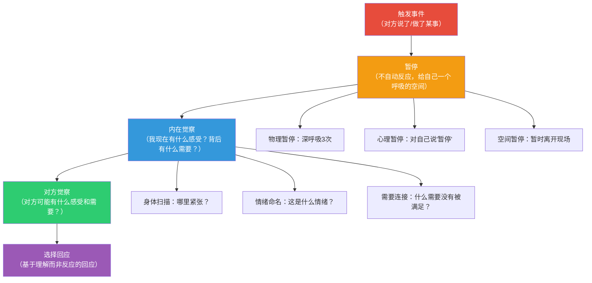
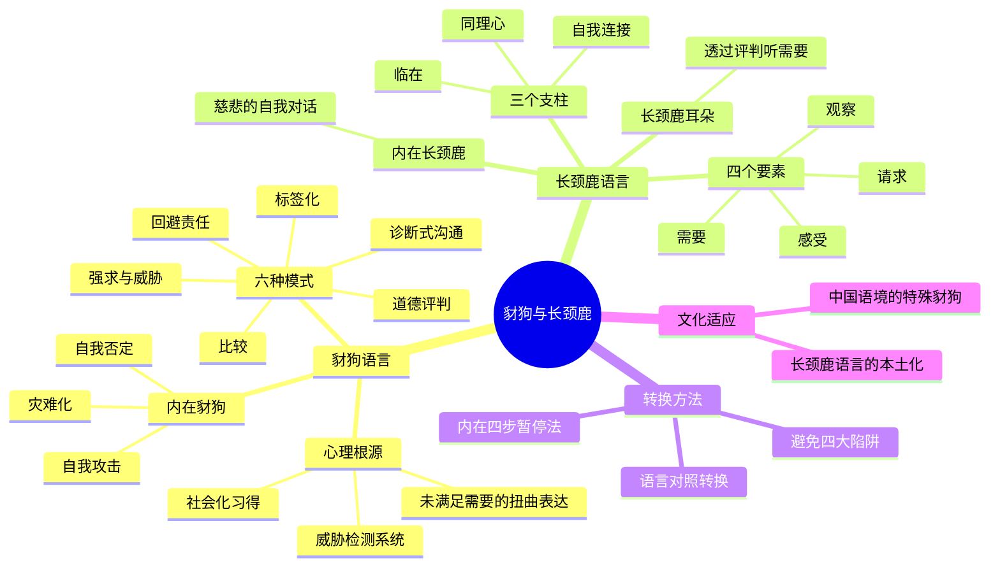

## 二、豺狗语言与长颈鹿语言

在非暴力沟通（NVC）的理论体系中，马歇尔·卢森堡创造了一对极具表现力的隐喻——"豺狗语言"（Jackal Language）与"长颈鹿语言"（Giraffe Language）。这对隐喻不是简单的标签分类，而是一套完整的心智模型，帮助我们识别、理解并转化日常沟通中的暴力模式。本节将从隐喻的设计逻辑出发，深入剖析两种语言模式的心理机制、表现形式、发展根源，并提供系统化的识别与转化方法。

### 2.1 为什么用动物比喻：隐喻的认知功能

#### 2.1.1 卢森堡的隐喻设计意图

卢森堡选择动物而非学术术语来命名两种沟通模式，是经过深思熟虑的教学设计。他在全球40多个国家推广NVC的过程中发现，直接使用"暴力沟通"和"非暴力沟通"这两个词会产生两个问题：一是"暴力"一词让人产生防御心理，觉得"我又没打人，怎么就暴力了"；二是学术化表述增加了认知负担，不利于普通人快速理解和应用。

动物隐喻巧妙地解决了这两个问题。它将抽象的沟通模式具象化为两个生动的形象，降低了理解门槛，同时避免了道德审判的色彩——你不是"坏人"，你只是暂时"像豺狗一样说话"。这种去人格化的表达方式，本身就是NVC理念的实践：区分行为与身份，评判行为而非评判人。

#### 2.1.2 认知语言学的支撑

从认知语言学的角度看，隐喻不仅仅是修辞手法，更是人类理解抽象概念的核心认知机制。语言学家乔治·莱考夫（George Lakoff）和哲学家马克·约翰逊（Mark Johnson）在《我们赖以生存的隐喻》中指出：人类的思维过程本质上是隐喻性的——我们通过具体的、身体化的经验来理解抽象的、概念性的领域。

豺狗和长颈鹿这两个隐喻之所以有效，是因为它们激活了人们的具身认知（Embodied Cognition）：

- **豺狗**的形象唤起"攻击、撕咬、群体狩猎"的身体图式，与攻击性沟通的心理感受形成映射
- **长颈鹿**的形象唤起"高远视野、温柔力量、心脏搏动"的身体图式，与同理心沟通的心理品质形成映射

这种具身映射使得学习者不仅在理智层面理解概念，更在直觉层面"感受到"两种模式的差异。

#### 2.1.3 为什么是豺狗和长颈鹿

卢森堡对动物的选择并非随意，每一种动物都承载着丰富的象征意义：

**豺狗（Jackal）的象征维度：**

| 维度 | 豺狗的特征 | 沟通中的映射 |
|------|-----------|-------------|
| 生存策略 | 杂食、机会主义、适应力强 | 暴力沟通往往出于自我保护的本能反应 |
| 社会行为 | 群体中有等级秩序，通过嚎叫宣示领地 | 评判性语言本质上是在划定"谁对谁错"的等级 |
| 攻击方式 | 用尖锐的叫声和撕咬获取食物 | 语言攻击如同"撕咬"，目的是获取控制权 |
| 文化形象 | 在非洲民间故事中常扮演狡猾的角色 | 暴力沟通常常伪装成"为你好"或"客观评价" |

**长颈鹿（Giraffe）的象征维度：**

| 维度 | 长颈鹿的特征 | 沟通中的映射 |
|------|-----------|-------------|
| 心脏 | 陆地上心脏最大的哺乳动物（重约11公斤） | 非暴力沟通以"心"为核心驱动力 |
| 视野 | 站高望远，能看到其他动物看不到的全景 | 同理心视角让人看到冲突背后更深层的需要 |
| 颈部 | 长脖子连接头脑和心脏 | 理性（头脑）与感性（心脏）的整合 |
| 性格 | 温和、安静，但力量巨大（一脚可以踢死狮子） | 温柔而坚定，不攻击但也不退缩 |
| 舌头 | 能够卷取带刺的金合欢树叶而不被伤害 | 能够"消化"困难的语言而不被伤害 |

#### 2.1.4 隐喻的局限与补充

需要指出的是，任何隐喻都有局限性。"豺狗"和"长颈鹿"的二分法可能让人误以为沟通模式是非此即彼的。实际上，大多数人在大多数时间处于两者之间的某个位置。卢森堡自己也强调，这两种"语言"不是固定的身份标签，而是可以随时切换的行为模式。就像我们可以在英语和法语之间切换一样，我们也可以在豺狗语言和长颈鹿语言之间切换——关键在于我们是否有意识地做出选择。

### 2.2 豺狗语言的心理机制与表现形式

豺狗语言不是"坏人"的语言，而是人类在进化过程中形成的本能反应模式。理解其心理机制，是转化的第一步。

#### 2.2.1 豺狗语言的心理根源

豺狗语言的产生有三个深层心理根源：

**第一，威胁检测系统的自动化反应。** 人类大脑中有一个古老的威胁检测系统（以杏仁核为核心），当它感知到潜在威胁时，会在200毫秒内启动"战斗-逃跑-僵化"反应。这个速度远快于理性思考（通常需要500毫秒以上）。当我们感到被批评、被忽视、被控制时，威胁检测系统会被激活，自动触发攻击性或防御性的语言模式。

**第二，社会化习得的沟通模板。** 从婴儿期开始，我们就通过观察和模仿学习沟通方式。如果成长环境中充满评判性语言（"你怎么这么笨""别人家的孩子多听话"），这些模式就会被内化为默认的沟通模板。神经科学研究表明，重复的语言模式会在大脑中形成强健的神经通路，使得这些模式在压力下自动激活。

**第三，未满足需要的扭曲表达。** 卢森堡有一个深刻的洞察：所有暴力行为（包括暴力语言）都是未满足需要的悲剧性表达。当一个人说"你太自私了"，他真正想表达的可能是"我需要被关心和重视"。但由于缺乏直接表达需要的语言和能力，需要只能通过评判、指责的方式"变形"表达出来。

#### 2.2.2 豺狗语言的六种核心模式

豺狗语言有六种核心模式，每一种都有独特的心理功能和语言特征：

**模式一：道德评判（Moral Judgment）**

道德评判是将个人偏好包装成客观道德标准。它的心理功能是通过占据道德高地来获得控制权。

| 评判类型 | 示例 | 隐藏的需要 |
|---------|------|-----------|
| 人格攻击 | "你就是个自私的人" | 我需要被关心 |
| 行为定性 | "这样做太不负责任了" | 我需要可靠性 |
| 动机揣测 | "你就是故意气我" | 我需要被尊重 |
| 道德定性 | "善良的人不会这样做" | 我需要价值观的共鸣 |
| 能力否定 | "连这都做不好" | 我需要能力得到认可 |

**识别线索：** 当句子中出现"就是""根本""从来""永远"这类绝对化词汇，或者"好/坏""对/错""应该/不应该"这类道德词汇时，很可能正在使用道德评判。

**模式二：比较（Comparison）**

比较是通过引入第三方参照物来贬低对方。它的心理功能是通过制造羞耻感来驱动行为改变——但事实是，羞耻感几乎从不产生持久的积极改变。

常见的比较模式包括：

- **向上比较（贬低型）**："你看看人家小王，工作三年就升主管了"——隐含的信息是"你不够好"
- **向下比较（威胁型）**："你再这样下去，迟早会被开除"——隐含的信息是"你即将面临灾难"
- **回忆比较（怀旧型）**："你以前不是这样的"——隐含的信息是"现在的你退步了"
- **他人比较（替代型）**："我的前任从来不会这样"——隐含的信息是"你不如别人"

心理学研究者布芮尼·布朗（Brené Brown）在《脆弱的力量》中指出：比较是连接的对立面。当我们将一个人与另一个人比较时，我们实际上在切断与这个人真实存在的连接。

**模式三：回避责任（Denial of Responsibility）**

回避责任的语言将个人选择伪装成外在强制。它的心理功能是减轻内疚感和决策压力。但代价是：当一个人否认自己有选择时，他也同时放弃了改变的可能。

回避责任的典型句式：

| 句式 | 示例 | 语言分析 |
|------|------|---------|
| "不得不" | "我不得不加班" | 将选择伪装成被迫 |
| "你让我" | "你让我很生气" | 将情绪责任推给他人 |
| "因为……所以" | "因为老板说了，所以我只能照做" | 用因果关系掩盖选择 |
| "大家都" | "大家都这样做" | 用从众心理规避个人责任 |
| "没办法" | "我也没办法" | 将主动放弃伪装成无奈 |
| "是规定" | "这是公司规定" | 用制度权威替代个人判断 |

卢森堡指出，当我们说"我不得不这样做"时，如果我们把"不得不"替换成"我选择……因为我需要……"，整个心理状态会发生根本性转变。例如，把"我不得不加班"改为"我选择加班，因为我需要稳定的收入和职业发展"——前者让人感到无力，后者让人感到自己是生活的主人。

**模式四：强求与威胁（Demand and Threat）**

强求是用权力不对等来迫使对方服从。它与请求的根本区别在于：如果对方不服从，强求会伴随惩罚，而请求不会。

强求的心理机制是"恐惧驱动"——通过激活对方的恐惧反应来获得服从。短期内可能有效，但长期代价巨大：

- **对关系的损害**：接收方产生怨恨和不信任，关系中的亲密感被逐步侵蚀
- **对自主性的损害**：接收方的内在动机被外在恐惧取代，一旦惩罚威胁消失，行为也消失
- **对自我的损害**：发出强求的人逐渐失去通过理解和协商解决问题的能力

强求的谱系从温和到严厉：

温和 ←————————————————————————————→ 严厉

建议    期望    要求    命令    威胁    惩罚
"你可以…  "我希望…  "你需要…  "你必须…  "如果你不…  "你不…就
 试试"    你能…"    去做"    照做"    我就…"    别想…"

**模式五：标签化（Labeling）**

标签化是将复杂的行为和人格简化为一个固定的标签。它的心理功能是降低认知复杂度——面对复杂的人际互动，给对方贴一个标签比真正理解对方容易得多。

标签化的危害在于其"自我实现预言"效应。社会心理学中的"标签理论"（Labeling Theory）指出：当一个人被反复贴上某个标签时，他倾向于按照标签所定义的方式行事。说一个人"懒"，他可能真的变得更懒；说一个人"敏感"，他可能真的变得更加敏感和防御。

标签化的三种变体：

- **人格标签**："你就是个控制狂"——将行为特征固化为不变的人格特质
- **群体标签**："男人都……""女人都……"——将个体行为泛化为群体特征
- **自我标签**："我就是个不会说话的人"——将暂时的能力局限固化为永久的身份认同

**模式六：诊断式沟通（Diagnosis-as-Connection）**

这是一种更隐蔽的豺狗语言形式，通常出现在学习了心理学知识的人群中。它以"分析"和"诊断"的名义进行评判：

- "你这是回避型依恋"
- "你有投射心理"
- "你的防御机制在起作用"
- "你这是原生家庭创伤"

这些表述可能包含客观的心理学事实，但当它们被用来解释对方的行为、为自己辩护、或赢得争论时，就从"理解"滑向了"评判"。真正的同理心不是诊断对方，而是理解对方此刻的感受和需要。

#### 2.2.3 豺狗语言的"内在版本"

豺狗语言不仅指向他人，也常常指向自己。内在豺狗（Inner Jackal）是我们内心的批评声音，它的破坏力往往比外在的豺狗语言更大，因为我们无处可逃。

内在豺狗的常见形式：

- **自我攻击**："我真笨，又犯了同样的错误"
- **自我否定**："我什么都做不好"
- **灾难化**："这次搞砸了，我的人生完了"
- **应该思维**："我应该更努力/更聪明/更坚强"
- **比较内耗**："别人都能做到，为什么我不行"

内在豺狗之所以特别危险，是因为它的声音听起来像"客观事实"而非"评判"。当我们对自己说"我就是不够好"时，我们很少意识到这是一种评判，而倾向于把它当作一个不可改变的事实。

### 2.3 长颈鹿语言的心理基础与核心能力

长颈鹿语言不是一套话术技巧，而是一种基于特定意识状态的沟通方式。学习长颈鹿语言的关键不在于记住句式模板，而在于培养支撑这种语言的内在品质。

#### 2.3.1 长颈鹿意识的三个支柱

长颈鹿语言建立在三种相互关联的意识品质之上：

**支柱一：临在（Presence）。** 临在是指全身心地处于当下这一刻，不被过去的记忆或未来的担忧所牵引。当我们处于临在状态时，我们能够真正"听到"对方在说什么，而不是在心里准备自己的回应。

临在的生理标志：呼吸平稳、肌肉放松、注意力集中在对方身上而非自己的思绪中。临在不是一种可以"做"的事情，而是一种需要"允许"的状态——通过放下评判、放下准备回应的冲动、放下对结果的控制欲，我们自然地进入临在。

**支柱二：同理心（Empathy）。** 同理心是理解他人内在体验的能力，但NVC中的同理心有其特定含义——它不是"理解对方的想法"或"认同对方的立场"，而是"听到对方的感受和需要"。

同理心与同情心的区别：

| 维度 | 同情心（Sympathy） | 同理心（Empathy） |
|------|-------------------|------------------|
| 空间位置 | 在岸上看着溺水的人 | 跳进水里与对方在一起 |
| 关注焦点 | "我能为对方做什么" | "对方正在经历什么" |
| 情感状态 | 怜悯、遗憾 | 共振、连接 |
| 权力关系 | 我高你低（我来帮你） | 我与你平等（我与你同在） |
| 效果 | 可能让人感到被俯视 | 让人感到被真正看见 |

**支柱三：自我连接（Self-Connection）。** 自我连接是觉察自己此刻的感受和需要的能力。它是同理他人的前提——一个与自己内在体验断开连接的人，很难真正与他人产生连接。

自我连接的核心实践是在每次开口之前先问自己三个问题：

1. 我此刻的感受是什么？（不是"我觉得你怎样"，而是"我内在正在经历什么"）
2. 这个感受背后有什么需要？（不是"我需要你做什么"，而是"什么对我来说是重要的"）
3. 我希望通过这次沟通实现什么？（不是"我要赢"，而是"我们如何都能得到满足"）

#### 2.3.2 长颈鹿语言的四要素详解

长颈鹿语言的四要素——观察、感受、需要、请求——在后续章节中会逐一深入讲解。这里先建立整体认知框架：

**要素一：观察（Observation）——像摄像机一样记录**

观察是不带评判地描述发生了什么。它的核心挑战在于：人类大脑天生就是一台评判机器——在感知到信息的瞬间，大脑就会自动进行好/坏、对/错、喜欢/不喜欢的分类。有意识地暂停这个自动评判过程，需要持续的练习。

观察的语言特征：
- 具体而非笼统："本周三天晚于约定时间"而非"总是迟到"
- 描述行为而非解释动机："你没有回复我的消息"而非"你故意忽视我"
- 时间锚定："上周二和周四"而非"最近"
- 可验证而非主观："报告中有三处数据不一致"而非"报告质量差"

**要素二：感受（Feeling）——对内在体验负责**

感受是对自己内在体验的诚实表达。NVC严格区分"真感受"和"假感受"：

- **真感受**：描述内在身体和情感状态——"我感到害怕""我感到温暖""我感到沉重"
- **假感受**：以"我觉得/感到"开头，实际是对他人行为的评判——"我感到被忽视""我觉得你不尊重我"

判断标准：如果一个"感受"可以被对方的行为"验证"或"否定"，那它大概率不是真感受，而是一个伪装成感受的评判。"我感到被忽视"可以被"我没有忽视你啊"否定，所以它不是感受；"我感到失落"无法被否定——你的失落是你的内在体验，不取决于对方的意图。

**要素三：需要（Need）——连接共同人性**

需要是感受背后的驱动力。NVC所说的"需要"具有以下特征：

- **普遍性**：所有人类共享相同的需要清单（安全感、尊重、归属、自主、意义等）
- **非排他性**：需要不指向特定的人或行为——"我需要陪伴"不等于"我需要你陪我"
- **中性**：需要没有好坏之分——"我需要控制"和"我需要自由"都是合理的需要
- **可同时存在**：矛盾的需要可以同时存在——"我需要独处"和"我需要亲密"可以共存

需要与策略的根本区别是：需要可以通过多种策略满足，而当我们执着于某个特定策略时，冲突就产生了。

**要素四：请求（Request）——可说"不"的邀请**

请求是将需要转化为具体、可执行、可协商的行动方案。请求与强求的唯一但根本的区别是：请求允许对方说"不"。

请求的质量标准：

| 标准 | 好的请求 | 不好的请求 |
|------|---------|-----------|
| 具体性 | "你愿意每周二和周四在七点前回家吗？" | "你能早点回来吗？" |
| 正向表述 | "你愿意和我分享你的想法吗？" | "你能不能不要总是沉默？" |
| 可执行性 | "你愿意在下次会议前把数据发给我吗？" | "你能不能更负责任一些？" |
| 有弹性 | "你愿意考虑这个方案吗？" | "你就照我说的做" |

#### 2.3.3 长颈鹿耳朵：倾听的艺术

长颈鹿语言不仅是"说"的方式，更是"听"的方式。卢森堡提出了"长颈鹿耳朵"（Giraffe Ears）的概念——用特定的倾听方式来接收对方的信息，无论对方使用的是什么语言。

当对方用豺狗语言说话时，长颈鹿耳朵的倾听策略是：透过评判听到需要。

| 对方说的（豺狗语言） | 长颈鹿听到的（背后的需要） |
|---------------------|------------------------|
| "你从来不关心我" | → 他/她需要被关心和重视 |
| "这个方案太蠢了" | → 他/她需要被认真对待、需要有效率 |
| "你怎么什么都做不好" | → 他/她需要能力和可靠性 |
| "这个世界太不公平了" | → 他/她需要公平和正义 |
| "我不想再听了" | → 他/她需要空间和自主 |

这种倾听方式不是为对方的攻击性语言"找借口"，而是一种战略性的理解选择——当你听到对方的需要时，你就从"被攻击"的位置转移到了"理解"的位置，回应方式也会完全不同。

#### 2.3.4 长颈鹿的"内在版本"

与内在豺狗相对，内在长颈鹿（Inner Giraffe）是内心的慈悲声音。它不是盲目乐观或自我欺骗，而是以温暖而诚实的方式与自己对话。

内在长颈鹿的实践模板：

当犯错时：
- 豺狗："我真蠢，又搞砸了"
- 长颈鹿："我做了让我后悔的选择。我感到懊恼，因为我重视学习和成长。现在我能做些什么来弥补？"

当感到压力时：
- 豺狗："我应该能处理得了这些，别人都可以"
- 长颈鹿："我此刻感到不堪重负，因为我需要支持和合理的节奏。我可以向谁寻求帮助？"

当与他人冲突时：
- 豺狗："都是他的错"
- 长颈鹿："我感到愤怒和受伤。我需要尊重和理解。我可以怎样表达这些需要？"

### 2.4 从豺狗到长颈鹿：语言转换的系统方法

#### 2.4.1 语言转换对照全景表

下表展示了六种豺狗模式向长颈鹿语言的系统转换，每组都包含原始豺狗语言、问题分析和长颈鹿版本：

**道德评判 → 观察 + 感受 + 需要**

| 豺狗语言 | 问题分析 | 长颈鹿语言 |
|---------|---------|-----------|
| "你太自私了" | "自私"是道德标签，对方会立刻防御 | "这周三次聚会你都选了你想去的餐厅（观察），我有些失落（感受），因为我希望在关系中也能感到被考虑（需要）" |
| "这样做是不对的" | "对错"是主观道德判断，引发权力争论 | "这个决定带来了一些我担心的后果（观察），我感到不安（感受），因为我需要透明和参与感（需要）" |
| "正常人不会这样做" | "正常"暗示对方"不正常"，是隐性的人格攻击 | "我注意到这个做法和我预期的不一样（观察），我有些困惑（感受），我想更好地理解你的考虑（需要）" |

**比较 → 聚焦当下**

| 豺狗语言 | 问题分析 | 长颈鹿语言 |
|---------|---------|-----------|
| "你看看别人家的孩子" | 比较让人感到自己不够好，产生羞耻感 | "我注意到你最近的成绩有些下滑（观察），我有些担心（感受），因为我希望你能发挥出自己的潜力（需要），我们可以一起看看哪里遇到了困难吗？（请求）" |
| "我的前任从来不会这样" | 引入第三方是关系中的核武器 | "我注意到你没有回复我的消息（观察），我感到不安（感受），因为我需要及时的沟通（需要），我们能约定一个回复的时间框架吗？（请求）" |

**回避责任 → 为选择负责**

| 豺狗语言 | 问题分析 | 长颈鹿语言 |
|---------|---------|-----------|
| "我不得不加班" | "不得不"否认了选择的存在 | "我选择加班（选择），因为我需要稳定的收入和职业发展（需要）" |
| "你让我很生气" | 将情绪责任推给他人 | "我感到生气（感受），因为我需要被尊重（需要）" |
| "没办法，是公司规定" | 用制度权威替代个人判断 | "这是公司的政策（观察），我理解你可能感到沮丧（同理心），在这个框架内，我们可以探讨一下有哪些可能的变通方案（请求）" |

**强求 → 请求**

| 豺狗语言 | 问题分析 | 长颈鹿语言 |
|---------|---------|-----------|
| "你必须在周五前完成" | 强求触发抗拒心理 | "这个项目需要在下周一前提交（观察），我有些着急（感受），因为我需要可靠性（需要），你愿意看看能否在周五前完成吗？如果不行，我们可以商量其他方案（请求）" |
| "你应该多关心我" | "应该"是隐性的道德审判 | "我最近感到有些孤独（感受），因为我需要亲密和连接（需要），你愿意这周我们一起吃两次晚饭吗？（请求）" |
| "如果你不道歉，我就再也不理你了" | 威胁损害信任基础 | "你之前说的话让我感到受伤（感受），我需要被尊重和理解（需要），你愿意听听我的感受吗？（请求）" |

**标签化 → 描述行为**

| 豺狗语言 | 问题分析 | 长颈鹿语言 |
|---------|---------|-----------|
| "你就是个懒人" | 标签将行为固化为人格特质 | "我注意到你的房间已经两周没有整理了（观察），我有些担心（感受），因为我需要整洁的共享空间（需要），你愿意这周末花半小时整理一下吗？（请求）" |
| "他是个控制狂" | 标签阻碍理解真实需要 | "他这周对我们的工作流程提了六次修改意见（观察），我感到有些窒息（感受），因为我需要自主空间（需要），我打算和他聊聊如何在保持质量的同时给团队更多自主权" |
| "她太敏感了" | "敏感"是评判，不是观察 | "上次反馈时她看起来很受伤（观察），我有些担心（感受），因为我也重视关系的和谐（需要），我可以先了解一下什么样的反馈方式对她更合适" |

#### 2.4.2 转换的内在过程

语言转换不仅是"换一种说法"，更是一个内在意识的转变过程。卢森堡将这个过程分为四个内在步骤：

**关键洞察：** 在触发事件和回应之间插入的这个"暂停"空间，是整个NVC实践中最重要的技能。正念减压创始人乔恩·卡巴金（Jon Kabat-Zinn）所说的"在刺激与反应之间有一个空间，在那个空间里有我们的自由和力量"，与此异曲同工。

#### 2.4.3 常见的转换陷阱

在从豺狗语言向长颈鹿语言转换的过程中，初学者常常落入以下陷阱：

**陷阱一：公式化的"我感到……因为我需要……"**

机械地套用句式会让语言听起来虚假和做作。真正的转换不是记住句式，而是培养觉察。如果"我感到……因为我需要……"这个句式不自然，完全可以用更自然的方式表达——关键是内容上做到了观察而非评判、表达感受而非想法、连接需要而非指责、提出请求而非强求。

**陷阱二：用长颈鹿语言包装豺狗意图**

"我感到你就是在故意刁难我，因为我需要被尊重"——这句话表面上用了"我感到"和"我需要"的句式，但"你就是在故意刁难我"是评判而非感受，"被尊重"是想法而非感受。这是最常见的伪长颈鹿语言。

**陷阱三：压抑愤怒，假装平静**

NVC不是让人压抑情绪。如果你感到愤怒，愤怒本身没有问题——问题在于你如何表达它。长颈鹿语言允许愤怒的存在，但会将愤怒转化为对未满足需要的觉察："我现在非常生气（诚实表达），因为我看重公平和尊重（连接需要），我需要暂停一下，等冷静后再讨论（自我照顾的请求）。"

**陷阱四：对所有人都用长颈鹿语言**

在某些情况下（如面对持续的虐待、权力极度不对等的关系、文化不兼容的场景），机械地使用长颈鹿语言可能不安全也不有效。NVC的目的是连接，而不是教条地执行某种"正确"的说话方式。如果一种表达方式无法促进连接，它就不是真正的NVC。

### 2.5 文化视角：豺狗与长颈鹿在中国语境中的表现

#### 2.5.1 中国文化中的特殊豺狗模式

中国文化中有几种独特的豺狗语言模式，它们植根于特定的社会文化土壤：

**"为你好"模式**：将控制包装为关爱。"我这都是为你好""等你长大就明白了"——这些话语背后的意图可能是真诚的，但当它们被用来否定对方的感受和选择时，就成为了阻止真实对话的壁垒。

**"丢面子"模式**：将沟通问题转化为面子问题。"你在这么多人面前说这些，让我面子往哪搁？"——面子文化使得直接表达感受和需要变得更加困难，因为"暴露脆弱"本身就是一种"丢面子"。

**"孝道绑架"模式**：用道德义务替代真实对话。"我养你这么大，你就这样对我？"——将爱的给予转化为债务，使得接受方无法自由地表达不同意见。

**"比惨"模式**：用比较来否定对方的感受。"你这算什么，我当年……"——将自己的苦难经历作为否定他人当前感受的依据。

#### 2.5.2 在中国语境中实践长颈鹿语言的调整

直接将西方NVC话术翻译成中文可能显得生硬和不自然。在中国语境中，长颈鹿语言的实践可以做以下调整：

- **减少直白的感受表达**：在关系亲密程度较低时，可以用更含蓄的方式表达感受，如"这件事让我有些想法"而非"我感到受伤"
- **善用故事和类比**：中国文化中丰富的寓言和故事传统可以成为表达需要的桥梁
- **注重场合和面子**：选择私密场合进行深度对话，公开场合维护双方的面子
- **渐进式而非一次性**：中国文化中关系的建立是渐进的，NVC的实践也可以渐进——先从观察开始，逐步加入感受和需要的表达

### 2.6 本节核心要点

**一句话总结：** 豺狗语言和长颈鹿语言不是"坏人"和"好人"的区别，而是"自动化反应"和"有意识选择"的区别。转化的关键不在于记住话术模板，而在于培养临在、同理心和自我连接这三种内在品质——当内在品质改变了，语言自然随之改变。

***
