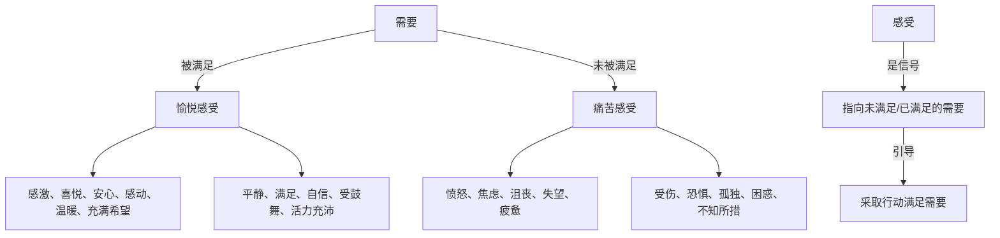
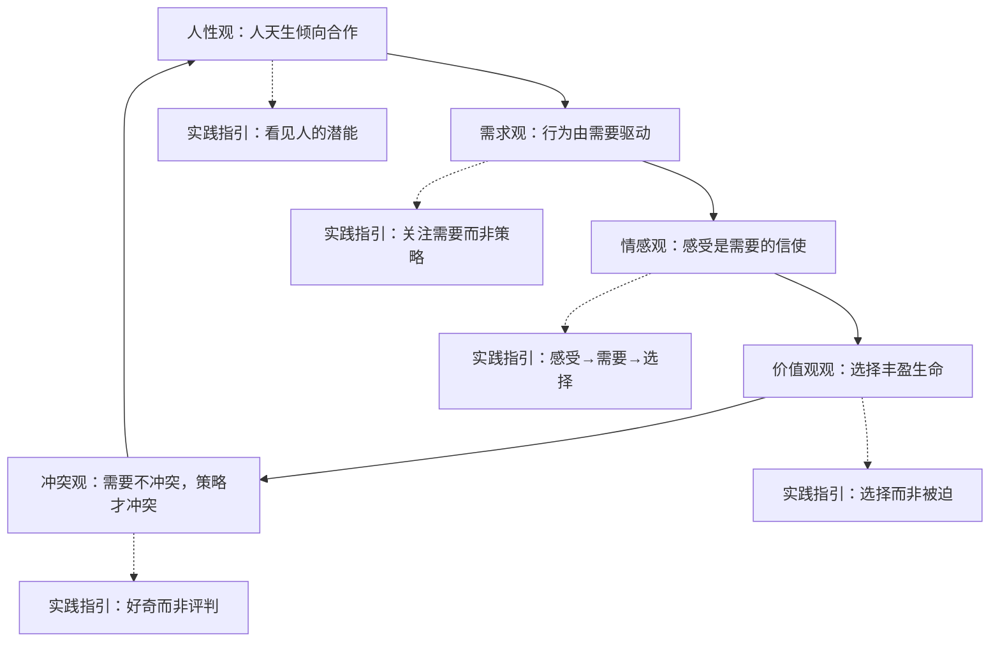

## 三、NVC的哲学基础

非暴力沟通不仅是一套说话技巧，更是一种看待人、看待世界的哲学立场。理解这些哲学基础，才能从"模仿句式"跃升到"内化精神"——前者让你在平静时说出漂亮话，后者让你在冲突中依然保持连接。

### 3.1 人性观：人天生倾向于合作

NVC对人性持积极假设，这不是一种天真的乐观，而是经过心理学研究和大量实践验证的工作前提。

#### 3.1.1 核心命题

NVC的人性观建立在四个相互关联的命题之上：

**命题一：人类天生具有共情能力。** 发展心理学研究表明，14个月大的婴儿看到他人受伤时会表现出安慰行为（Zahn-Waxler et al., 1992）。共情不是后天教育的产物，而是人类神经系统的基本配置。镜像神经元（mirror neurons）的发现从神经科学层面证实了这一点——当我们观察他人的动作和情绪时，大脑中负责执行同样动作和体验同样情绪的区域会被激活（Rizzolatti & Craighero, 2004）。

**命题二：给予是人类的自然倾向。** 卢森堡观察到，在没有外在奖惩压力的情况下，人类天然倾向于帮助他人。神经经济学家保罗·扎克（Paul Zak）的研究发现，利他行为会激活大脑的奖赏回路，释放催产素——与母婴依恋相同的神经化学物质。给予不是"牺牲"，而是人类神经系统设计好的"奖赏"。

**命题三：暴力是习得的，而非天性的。** 卢森堡在底特律的种族冲突中长大，他观察到：没有天生仇恨某个族群的儿童，仇恨是通过模仿、奖惩和意识形态灌输习得的。班杜拉的社会学习理论（Social Learning Theory）提供了坚实支撑——攻击行为主要通过观察和模仿习得，而非内在驱力的表达。

**命题四：每个人的行为都是为了满足某种需要。** 这是NVC最核心的人性假设。即使是看似破坏性的行为，其背后也存在一个正向的需要在驱动——只不过当事人选择了无效甚至有害的策略来满足它。一个对孩子大吼的父母，其行为背后的需要可能是"秩序"和"被尊重"；一个在工作中推卸责任的同事，其需要可能是"安全感"和"被认可"。

#### 3.1.2 与其他人性假设的对比

| 维度 | 霍布斯主义（人性本恶） | 行为主义（人性白板） | NVC（人性向善） |
|------|----------------------|-------------------|----------------|
| 核心假设 | 人天性自私，需要外部约束 | 人是环境的产物，无固定本性 | 人天性倾向合作与关爱 |
| 教育策略 | 奖惩制度、法律约束 | 条件反射、行为塑造 | 理解需要、滋养共情 |
| 冲突归因 | 利益冲突不可避免 | 环境强化了攻击行为 | 策略冲突（非需要冲突） |
| 管理方式 | 监督、惩罚、等级控制 | 正负强化、行为修正 | 自主管理、需要导向 |
| 对犯错的态度 | 惩罚以儆效尤 | 矫正行为模式 | 理解未满足的需要 |

需要强调的是，NVC的"人性向善"假设并非否认人类暴力行为的存在，而是提出了一个关键区分：**暴力是人类在特定条件下发展出的应对策略，而非人性的本质。** 正如卢森堡所说："我们不是天生就会用暴力的方式表达自己——我们是被教会的。"

#### 3.1.3 实践意义

这个人性观直接决定了NVC的实践态度：

- **面对攻击性语言**：不把对方定义为"坏人"，而是好奇"他/她正在经历什么？需要什么？"
- **面对自己的"阴暗面"**：不压制或否认攻击性冲动，而是倾听它背后未满足的需要。
- **面对系统性暴力**：不归咎于"人性之恶"，而是追问"什么样的制度和文化在鼓励这种行为？"

这种态度不是自我欺骗，而是一种**战略性选择**——当我们假设对方有合作的潜能时，我们更可能创造出促进合作的对话条件。

### 3.2 需求观：行为的底层驱动力

NVC的需求观是整个理论体系中最核心的哲学支柱。理解"需要"与"策略"的区别，是从暴力沟通转向非暴力沟通的关键转折点。

#### 3.2.1 需要的普遍性

NVC认为，所有人类共享一组基本需要，这些需要跨越文化、种族、性别和时代。这不是一种文化霸权式的声称，而是基于跨文化观察的经验总结。

心理学家马歇尔·卢森堡和经济学家曼弗雷德·马克斯-尼夫（Manfred Max-Neef）分别独立提出了类似的人类基本需要分类。马克斯-尼夫在《人类尺度的发展》（Human Scale Development, 1991）中提出了9类基本需要：

| 需要类别 | 含义 | 具体表现 |
|---------|------|---------|
| **生存（Subsistence）** | 身体存活的基本条件 | 食物、水、住所、健康、安全 |
| **保护（Protection）** | 免受伤害和威胁 | 照顾、预防、保障、稳定 |
| **情感（Affection）** | 与他人的情感连接 | 爱、亲密、温暖、归属 |
| **理解（Understanding）** | 认知世界的能力 | 学习、思考、分析、好奇心 |
| **参与（Participation）** | 影响周围环境的能力 | 贡献、合作、决策、行动力 |
| **休闲（Leisure）** | 享受和放松的空间 | 游戏、幽默、愉悦、平静 |
| **创造（Creation）** | 表达和构建的能力 | 设计、发明、表达、想象力 |
| **身份认同（Identity）** | 知道"我是谁" | 归属感、自尊、自我认知、意义 |
| **自由（Freedom）** | 自主选择的能力 | 自治、独立、选择、自主 |

NVC在此基础上更进一步，提供了一份更为实用的需要清单，涵盖：**自主性**（选择自己的计划、目标、价值观）、**庆祝**（庆祝生命的创造和完成）、**完整性**（真实、创造力、意义）、**相互依存**（接纳、亲密、社区、贡献、情感安全、同理心、诚实、爱、尊重、支持、信任、温暖）、**精神需要**（美、和谐、灵感、秩序、和平）、**玩耍**（乐趣、欢笑）、**身体需要**（空气、食物、运动、休息、性表达、庇护、触摸、水）。

#### 3.2.2 需要与策略的根本区分

这是NVC最精妙也最容易被误解的哲学区分：

**需要（Need）** 是普遍的、抽象的、不涉及特定人/事/物/时间/地点的。

**策略（Strategy）** 是具体的、个人的、涉及特定人/事/物/时间/地点的。

用一个公式来表达：

需要 = 我渴望体验到的状态（安全感、被理解、自主性……）
策略 = 我打算通过什么具体方式获得这个状态（某人做某事、某件事发生……）

**深度案例：一对夫妻的"家务之争"**

> 妻子："你从来不洗碗！"（这是策略层面的表达）
>
> 深挖背后的需要：
> - 可能的需要一：**公平感**——"我需要感觉到家务分工是公平的"
> - 可能的需要二：**被重视**——"我需要感受到你在意这个家"
> - 可能的需要三：**休息**——"我需要下班后有放松的时间"
> - 可能的需要四：**整洁**——"我需要一个干净的厨房"
>
> 丈夫拒绝洗碗，可能也不是因为"懒"：
> - 可能的需要一：**自主**——"我不希望被命令做事"
> - 可能的需要二：**认可**——"我需要你看到我做的其他贡献"
> - 可能的需要三：**休息**——"我工作一天也很累"
>
> 当双方都停留在策略层面争论"洗不洗碗"，冲突看起来无解。
> 但当双方回到需要层面——"你需要公平和休息，我也需要自主和休息"——合作的可能就打开了：
> - 策略选项A：轮流洗碗
> - 策略选项B：请家政服务
> - 策略选项C：洗碗机
> - 策略选项D：各自负责自己最在意的部分

这个区分为什么如此重要？因为**需要可以被多种策略满足，而当我们执着于某一策略时，就会制造冲突。** 卢森堡有句经典的话："需要就像饥饿——它不会指定你必须吃面条还是米饭，它只是告诉你，你需要吃东西。"

#### 3.2.3 常见混淆与纠正

| 混淆类型 | 错误示例 | 纠正 |
|---------|---------|------|
| 把策略说成需要 | "我需要你每天给我打电话" | 需要是"连接感"或"安全感"，打电话是策略 |
| 把别人的行为说成需要 | "我需要你不那么大声说话" | 需要是"平静"或"尊重"，降低音量是策略 |
| 把评判说成需要 | "我需要你对我诚实" | "诚实"确实是需要，但这句话可能暗含"你目前不诚实"的评判 |
| 把感受说成需要 | "我需要不那么焦虑" | 焦虑是感受，背后的需要可能是"安全感"或"确定性" |
| 把回避说成需要 | "我需要你别再提那件事了" | 这是策略；真正的需要可能是"被尊重"或"向前看" |

#### 3.2.4 需要的"饥饿感"

需要被满足与否，会产生对应的感受——这连接了NVC的需求观和情感观：

当我们把注意力从"谁让我有了这个感受"转向"这个感受在告诉我什么需要"时，我们就从受害者心态转向了自我负责的心态——这正是NVC哲学的核心转变。

### 3.3 情感观：感受是需要的信使

NVC对情感的理解既有哲学深度，又有神经科学支撑。这一节不仅解释"感受是什么"，更要说明"如何与感受建立正确的关系"。

#### 3.3.1 感受的信号功能

NVC认为，感受不是随机的情绪波动，而是身体对"需要满足状况"的实时监测系统。这个观点与安东尼奥·达马西奥（Antonio Damasio）在《笛卡尔的错误》（Descartes' Error, 1994）中的"躯体标记假说"高度一致——情绪不是理性的敌人，而是理性决策不可或缺的信号源。

**当需要被满足时：**

| 感受 | 信号含义 |
|------|---------|
| 感激 | "有人满足了我的需要" |
| 喜悦 | "我的某个重要需要正在被满足" |
| 安心 | "我的安全感需要得到了回应" |
| 温暖 | "我的连接/亲密需要正在被满足" |
| 自信 | "我的能力/效能需要得到了验证" |
| 放松 | "我的休息/平衡需要得到了满足" |
| 兴奋 | "新的需要满足的可能性出现了" |
| 感动 | "我的深层需要被看到了" |

**当需要未被满足时：**

| 感受 | 信号含义 |
|------|---------|
| 愤怒 | "某个重要需要被严重侵犯"（愤怒往往是最深层的保护信号） |
| 悲伤 | "我失去了某种重要的连接或满足" |
| 恐惧 | "我的安全/生存需要受到威胁" |
| 焦虑 | "我对某个需要能否被满足感到不确定" |
| 孤独 | "我的连接/归属需要未被满足" |
| 沮丧 | "我反复尝试满足某个需要但未成功" |
| 羞耻 | "我担心自己不被接纳"（身份认同需要受威胁） |
| 困惑 | "我需要清晰/理解，但目前没有获得" |

#### 3.3.2 感受与判断的关键区分

这是NVC情感观中最容易出错的环节。许多我们自认为在"表达感受"的话，实际上是在"做出判断"——而判断通常以"我觉得你……"或"我感到被……"的形式出现。

**真实感受 vs. 伪装成感受的判断：**

| 伪装成感受的判断 | 判断背后的真实感受 | 隐含的评判 |
|----------------|-----------------|-----------|
| "我感到被忽视" | 我感到孤独、失落 | "你忽视了我" |
| "我觉得不被尊重" | 我感到受伤、沮丧 | "你没有尊重我" |
| "我感到被利用" | 我感到愤怒、疲惫 | "你在利用我" |
| "我觉得不公平" | 我感到愤怒、失望 | "你做的事不公平" |
| "我感到被背叛" | 我感到恐惧、悲伤 | "你背叛了我" |
| "我觉得你在操控我" | 我感到不安、抗拒 | "你在操控我" |

区分方法：**如果你在"感到"后面用的词描述的是对方的行为（被忽视、被抛弃、被利用），那它就是一个判断，不是感受。** 真正的感受词描述的是你的内在状态，不涉及"谁做了什么"。

#### 3.3.3 "豺狗语言"中的情感扭曲

在第二章我们介绍了豺狗语言与长颈鹿语言的概念。从情感哲学的角度深入来看，豺狗语言对情感的扭曲主要体现在三个层面：

**层面一：情感归因外化。** "你让我很生气"这句话把感受的责任完全推给了对方。从NVC的哲学立场看，对方的行为是**刺激**（stimulus），但不是**原因**（cause）。感受的真正原因是"我的某个需要没有被满足"。这个区分至关重要——如果别人能"让我"生气，我就成了情绪的人质，永远无法获得情绪自主权。而如果我理解"生气是因为我的某个需要被侵犯"，我就有了选择：我可以表达这个需要，也可以选择其他满足方式。

**层面二：情感压抑。** 许多文化（尤其是东亚文化）教导人们压抑"负面"情绪。NVC认为没有"负面"情绪——所有情绪都是信号。愤怒告诉你需要被尊重，悲伤告诉你需要连接，恐惧告诉你需要安全。压抑情绪就像拆掉火警报警器——火灾不会因为警报消失而停止。

**层面三：情感武器化。** 把感受当作攻击工具："你让我很失望"，"你伤透了我的心"。这不是在表达感受，而是在用感受惩罚对方。NVC提倡的"负责任的表达"是：我承认我的感受是自己的，同时邀请对方理解这个感受背后的需要。

#### 3.3.4 情感的文化建构

NVC承认，虽然基本情绪（快乐、悲伤、恐惧、愤怒、厌恶、惊讶）是人类共有的，但**情绪的表达规则、触发条件和意义解读**都深受文化影响。

- **中国文化**："喜怒不形于色"是成熟的标志，直接表达愤怒可能被视为"不懂事"。NVC在中国语境中需要更细腻地处理"表达感受"这一步——可以不直接对领导说"我很愤怒"，但需要找到合适的方式让这个感受被表达出来（写日记、与信任的人倾诉、用更委婉的语言）。
- **日本文化**："建前"（表面立场）与"本音"（真实感受）的区分，使得NVC的"真诚表达"需要在文化规范和个人真实之间找到平衡点。
- **美国文化**：更鼓励直接表达情感，但容易把"表达感受"变成"以感受为武器"。

理解这些文化差异，不是为了放弃NVC的原则，而是为了**在坚持"感受是信使"这一哲学立场的同时，找到文化上恰当的表达方式**。

#### 3.3.5 情感发展的四个阶段

从NVC的视角看，人与自身情感的关系会经历四个发展阶段：

- **第一阶段（情感无觉察）**：被情绪控制，事后才意识到"我当时太冲动了"。常见表现：摔东西、冷暴力、突然发火后后悔。
- **第二阶段（情感识别）**：能在感受发生的当下命名它——"我现在感到愤怒"。这一步看似简单，但研究表明，仅仅是给情绪命名（affect labeling）就能降低杏仁核的激活程度，减轻情绪强度（Lieberman et al., 2007）。
- **第三阶段（情感连接）**：不仅知道"我愤怒"，还能追问"愤怒在告诉我什么需要被侵犯了？"——从情绪表层下潜到需要深层。
- **第四阶段（情感自主）**：能够选择如何回应感受，而不是被感受驱动。"我感到愤怒，我需要被尊重，我选择用清晰而非攻击的方式表达这个需要。"

大多数人停留在第一和第二阶段之间。NVC的练习本质上就是帮助人从第二阶段向第三、第四阶段发展。

### 3.4 价值观观：活出"丰盈生命"的选择

NVC的哲学不只是描述性的（人是什么样的），更是规范性的（什么样的生活更值得追求）。卢森堡提出了"丰盈生命"（Life-Enriching）的价值取向，与之对立的是"去生命化"（Life-Diminishing）的取向。

#### 3.4.1 两类价值取向

| 维度 | 丰盈生命取向 | 去生命化取向 |
|------|------------|------------|
| 行动动机 | 为了贡献生命、满足需要 | 为了逃避惩罚、获取奖赏 |
| 关系模式 | 基于相互理解和需要满足 | 基于权力、控制和义务 |
| 面对冲突 | 好奇对方的需要 | 赢得争论、证明自己正确 |
| 内在状态 | 出于爱和选择 | 出于恐惧和"不得不" |
| 沟通目标 | 建立连接、找到合作方案 | 达成目的、说服对方 |

#### 3.4.2 "应该"与"选择"

NVC特别警惕语言中的"应该"——它往往暗示着外部强制，剥夺了个人的选择感和自主性。

- "我应该去探望父母" → NVC翻译："我选择去探望父母，因为我重视亲情和孝道"
- "你应该道歉" → NVC翻译："我希望你能道歉，因为道歉会满足我对尊重和修复的需要"
- "我不得不加班" → NVC翻译："我选择加班，因为目前我的收入需要（或我害怕失去工作的安全感需要）比休息需要更强烈"

这不是文字游戏。当我们从"不得不"转变为"我选择"时，我们重新夺回了对自己行为的主权，同时也诚实地面对了选择背后的需要和代价。

### 3.5 冲突观：需要不冲突，策略才冲突

这是NVC最反直觉但最重要的哲学立场之一。

#### 3.5.1 核心命题

传统观点认为冲突的本质是"利益对立"——你赢我输，零和博弈。NVC提出了一个根本性的重新框架：

> **人类的基本需要从不相互冲突。冲突只发生在满足需要的具体策略层面。**

例如：
- 一对伴侣争吵"圣诞节去谁家过"——这是策略冲突。两个人的需要都是"与家人团聚"和"被伴侣重视"，这些需要完全兼容。
- 劳资双方争论工资——这是策略冲突。员工的需要是"生存保障"和"被公平对待"，企业的需要也是"生存"和"公平"（公平地衡量成本与产出）。需要层面并不对立。

#### 3.5.2 从"谁对谁错"到"各自的需要是什么"

这个哲学立场要求我们在面对冲突时进行一个根本性的认知转换：

传统思维："谁对谁错？谁让步？"
NVC思维："各自有哪些需要？如何找到满足双方需要的策略？"

这不是回避冲突或和稀泥，而是一种更深层的冲突解决方式。当双方都被听见、需要都被承认时，创造性解决方案才有空间出现。

### 3.6 批判性反思：NVC哲学的局限与争议

任何哲学立场都有其盲区。诚实面对NVC的局限，不是削弱它的价值，而是更负责任地使用它。

#### 3.6.1 "人性向善"假设的挑战

批评者指出，NVC对人性的积极假设在面对以下情境时可能显得天真：

- **反社会人格障碍**：少数人确实缺乏共情的神经基础（Blair, 2005），NVC的人性假设对这类人群不适用。
- **系统性压迫**：在权力极度不对等的环境中（如家暴、独裁政体），假设施暴者"只是用了错误的策略来满足需要"，可能忽视了权力结构的作用，甚至变成对受害者的二次伤害（"你需要理解他"）。
- **集体暴力**：种族灭绝、战争等大规模暴力行为中，个体的"需要"解释力不足，还需要社会心理学、政治学的解释框架。

**NVC的回应**：卢森堡本人经历过大屠杀，他并非不知道人类暴力的极端面。他的立场是：即使在最极端的情境中，"将对方视为有需要的人"仍然是最有可能打开对话空间的态度——这不是天真，而是一种基于实践的选择。

#### 3.6.2 "感受自负责"的边界

"别人不让我生气，是我自己的需要没被满足"这个立场在大多数日常情境中是解放性的，但在权力不对等的情境中可能变成一种受害者指责。当一个被霸凌的孩子被告知"你生气是因为你的需要没被满足"时，这种说法可能反而让他觉得"是我的问题"。

**区分关键**：NVC的"感受自负责"是指"我有权利也有能力为自己的感受负责"，而非"别人对我的伤害是合理的"或"我不应该生气"。它是一种赋权，不是一种压制。

#### 3.6.3 文化适用性的限制

NVC诞生于美国中产阶级的人际沟通语境，其哲学假设带有特定文化烙印：

- **高度个人主义**：强调个人感受和需要的表达，在集体主义文化中可能被视为"自私"或"不懂事"。
- **平等主义假设**：假设对话双方地位平等，但在等级分明的文化（东亚企业、军队）中直接表达感受可能带来现实后果。
- **语言透明假设**：假设用准确的语言表达感受和需要就能被理解，但许多文化中"言外之意""看眼色""体面"比直说更重要。

**实践建议**：在跨文化语境中使用NVC，需要将哲学原则（关注需要、表达感受、寻求连接）与文化策略（委婉表达、选择合适时机、考虑面子）相结合，而非机械套用四步公式。

### 3.7 哲学基础的整合：一张全景图

将NVC的五大哲学支柱整合起来，可以看到一个自洽的理论体系：

这五根支柱共同支撑起NVC的核心转换——**从"谁对谁错"到"各自的需要是什么"**。人性观提供了前提（人值得被信任），需求观提供了工具（需要清单），情感观提供了导航（感受指向需要），价值观提供了方向（选择丰盈生命），冲突观提供了信心（需要层面的合作是可能的）。

掌握这些哲学基础后，你在第四章学习具体的四步法时，就不会只是在模仿句式，而是在表达一种深刻的对人的理解。

***
