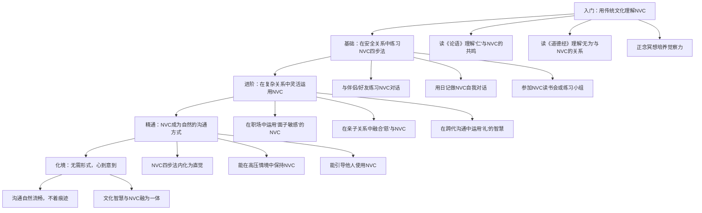

## 四、NVC与传统文化的融合

非暴力沟通（NVC）诞生于西方人本主义心理学传统，但其核心精神——关注需要、放下评判、追求连接——与东方传统文化中的许多思想有着深层共鸣。这种共鸣不是牵强附会的巧合，而是因为人类对善意沟通的追求具有跨文化的普遍性。理解这种融合，不仅帮助中国读者更自然地接受NVC，也能让NVC在本土文化语境中获得更深的根基和更灵活的表达。

本节将系统梳理NVC与中国儒、释、道三大思想传统的交汇点，同时探讨法家、墨家等其他流派的相关智慧，最终给出在中国文化语境中实践NVC的具体策略。

### 4.1 儒家"仁"的思想与NVC的深层共鸣

#### 4.1.1 "仁"的本质结构

孔子所说的"仁"，不是一个抽象的道德标签，而是一套完整的伦理关系操作系统。"仁"字的结构本身就揭示了其内涵——"人"与"二"的组合，意指人与人之间的关系。这与NVC的核心假设完全一致：沟通的本质不是信息传递，而是人与人之间的情感连接和需要的相互满足。

"仁"的核心内涵可以分解为三个层次：

| 层次 | 儒家表达 | NVC对应 | 共同指向 |
|------|---------|---------|---------|
| 情感层 | 恻隐之心 | 共情感受 | 对他人痛苦的自然回应 |
| 认知层 | 推己及人 | 换位思考 | 理解他人视角的能力 |
| 行为层 | 己欲立而立人 | 满足彼此需要 | 双赢的行为取向 |

孟子进一步将"仁"具体化为"四端"：恻隐之心（仁之端）、羞恶之心（义之端）、辞让之心（礼之端）、是非之心（智之端）。其中"恻隐之心"直接对应NVC中对他人需要的敏感度——当你看到他人的痛苦时，内心自然涌起的关怀，不需要理性分析，不需要道德说教，这是一种本能的、非暴力的回应。

#### 4.1.2 "忠恕之道"与NVC的双向表达

孔子将"仁"的实践方法概括为"忠恕之道"。"忠"是"己欲立而立人，己欲达而达人"——真诚地表达自己的需要，同时帮助他人实现需要；"恕"是"己所不欲，勿施于人"——自己不想要的，不要强加给别人。

这个双向结构与NVC的双向通道完美对应：

**"忠"→ NVC的真诚表达（Self-Expression）**

当NVC教我们用"观察-感受-需要-请求"四步法表达自己时，本质上就是在践行"忠"——忠于自己的感受和需要，同时以尊重的方式向对方呈现。不是压抑自己迎合他人（那不是"忠"，是"乡愿"），也不是强迫对方接受（那不是"仁"，是"暴"），而是真诚地袒露内心，邀请对方理解。

**"恕"→ NVC的共情倾听（Empathic Listening）**

当NVC教我们放下评判、全身心倾听对方时，本质上就是在践行"恕"——不急于反驳、不急于建议、不急于自我辩护，而是先去理解对方的观察、感受、需要和请求。这种倾听不是被动的沉默，而是主动的、充满关怀的理解行为。

**实践案例：父母与成年子女的"催婚"对话**

传统冲突模式：
> 父母："你都三十了还不结婚，让我们怎么放心？"
> 子女："我的事不用你们管！"（防御、对抗）

融合"忠恕之道"的NVC实践：
> 父母运用"忠"——真诚表达："看到你一个人在大城市打拼（观察），我们心里有些担心（感受），因为我们很看重家庭的温暖和有人互相照顾（需要），你愿意跟我们聊聊你对未来的打算吗（请求）？"
>
> 子女运用"恕"——先倾听理解："我听到你们是担心我一个人太辛苦、没人陪伴（共情倾听），你们对我的关爱我能感受到。我也想跟你们分享我的想法……"

这个案例中，"忠"让父母不再用指责的方式表达爱，"恕"让子女不再用防御的方式回应关心。两者的交汇点，正是NVC所说的"从心与心的连接出发"。

#### 4.1.3 "礼"的智慧与NVC的分寸感

儒家强调的"礼"，常被误解为僵化的等级制度，但其本质是关于人际边界的智慧——什么场合说什么话、对什么人用什么方式、在什么时机提出什么请求。这与NVC中"请求"（Request）的艺术高度相关。

NVC强调请求必须是"具体的、正向的、可操作的"，而"礼"的智慧进一步补充了"得体的"这一维度。在中国文化语境中，一个"正确"的NVC请求不仅要满足形式上的要求，还需要考虑：

- **关系层级**：对长辈、平辈、晚辈的表达方式不同，但尊重的态度一致
- **场合敏感**：公开场合与私下场合的表达策略不同
- **面子考量**：给对方留有余地，不把对方逼到墙角
- **情面平衡**：在维护关系的同时不回避真实

"礼"不是NVC的对立面，而是NVC在中国文化语境中的调适器。马歇尔·卢森堡本人也强调，NVC的四要素不是僵化的公式，而是需要根据具体情境灵活运用。"礼"提供了这种灵活运用的文化框架。

#### 4.1.4 "和而不同"与NVC的冲突观

孔子说"君子和而不同，小人同而不和"。这句话精确地表达了NVC对冲突的态度——追求的不是表面的和谐（回避冲突、压抑需要），而是深层的和谐（在差异中找到连接）。

"和而不同"的三个实践原则与NVC的对应：

1. **承认差异的正当性**：NVC从不要求你放弃自己的需要，正如"和"不要求"同"
2. **在差异中寻找共同需要**：表面上的立场冲突，往往底层有共同的需要（安全、尊重、归属）
3. **创造满足多方需要的方案**：NVC的"创造性地解决冲突"，正是"和"的最高形态

### 4.2 佛家慈悲观与NVC的正念基础

#### 4.2.1 慈悲的结构性理解

佛家的"慈悲"不是一个模糊的好意，而是有精确结构的心理训练：

- **慈（Maitrī）**：愿一切众生获得快乐及其快乐之因——对应NVC中"识别并满足需要"的积极取向
- **悲（Karuṇā）**：愿一切众生远离痛苦及其痛苦之因——对应NVC中"看到痛苦背后的未满足需要"
- **喜（Muditā）**：随喜他人的快乐——对应NVC中"庆祝需要得到满足"
- **舍（Upekṣā）**：平等心，不偏不倚——对应NVC中"不评判、不偏袒"的观察态度

这"四无量心"恰好覆盖了NVC的完整循环：识别需要（慈）→ 理解痛苦（悲）→ 庆祝满足（喜）→ 保持觉察（舍）。

#### 4.2.2 "无分别心"与NVC的"去评判化"

NVC的第一步就是区分"观察"和"评论"——描述事实，不附加评判。这个要求对很多人来说是最难的，因为我们从小就被训练用评判的方式思考。

佛家的"无分别心"为此提供了深层的理论支撑。佛学认为，痛苦的根源之一是"分别心"——把世界分成"好/坏"、"对/错"、"我/他"。当我们带着分别心沟通时，我们看到的不是真实的人，而是我们头脑中的标签和故事。

具体来说，NVC中的"评判"与佛学中的"分别心"有如下对应：

| NVC中的评判类型 | 佛学中的分别心 | 实际沟通中的表现 |
|----------------|--------------|----------------|
| 道德评判 | 善恶分别 | "你这样做是不对的" |
| 比较评判 | 高下分别 | "你看看别人家的孩子" |
| 标签化评判 | 自他分别 | "你就是个自私的人" |
| 应该化评判 | 执着分别 | "你应该知道我在想什么" |

NVC的"去评判化"练习，本质上就是佛学"放下分别心"的沟通版本。当你学会只说"这周你有三天晚上十一点后回家"（观察），而不是"你总是不顾家"（评判），你实际上是在进行一种正念练习——回到当下的事实，放下头脑编造的故事。

#### 4.2.3 正念（Mindfulness）与NVC的觉察力

正念是NVC的重要隐性基础。马歇尔·卢森堡虽然没有直接使用"正念"这个术语，但NVC的每一个步骤都需要正念的支撑：

- **观察**需要正念：在情绪涌起的瞬间，觉察到"我正在做评判"而不是"我在说事实"
- **感受**需要正念：觉察身体的感觉信号，区分"我感到受伤"和"我认为他伤害了我"
- **需要**需要正念：在情绪背后看到更深层的需要，而不是停留在表面的偏好
- **请求**需要正念：觉察自己的请求是否变成了隐性的要求

一行禅师（Thich Nhat Hanh）将正念与沟通的关系表达得最为透彻："正念说话意味着，我们在说话时保持完全的觉知，知道自己在说什么，倾听自己的话语，并观察这些话语对自己和他人产生了什么影响。"

**正念沟通的三步训练：**

1. **说话前的停顿**：在开口之前，花一秒钟问自己——"我接下来要说的话，是出于连接还是出于分离？"
2. **说话中的觉察**：注意自己的语速、语调、身体姿态——你是在表达需要，还是在发泄情绪？
3. **说话后的回顾**：对话结束后，花一分钟回顾——哪些时刻我保持了连接，哪些时刻我滑入了"豺狗模式"？

#### 4.2.4 "业力"概念与NVC的因果观

佛学中的"业"（Karma）强调行为的因果性——每一个行为都会产生后果，而沟通行为的后果直接影响关系质量。NVC对此有完全一致的认识：暴力沟通产生隔阂和防御，非暴力沟通产生连接和合作。

这个因果关系不是神秘的宗教信仰，而是可以被心理学验证的机制：

- **暴力沟通的因果链**：评判 → 对方感到被攻击 → 触发防御机制（战斗/逃跑/冻结）→ 关系受损 → 更多暴力沟通
- **非暴力沟通的因果链**：观察+感受 → 对方感到被理解 → 触发同理心回应 → 关系深化 → 更多非暴力沟通

理解这个因果链，能够帮助实践者在困难时刻保持耐心——即使当前的NVC没有立即产生效果，也知道自己正在种下"善因"。

### 4.3 道家"无为"智慧与NVC的自然之道

#### 4.3.1 "无为"的正确理解

"无为"是道家最容易被误解的概念。它不是"什么都不做"，而是"不违背自然规律地做"——不强求、不控制、不逆势而为。老子说"为无为，则无不治"，意思是当你顺应事物的自然规律去行动，反而能达到最好的效果。

在沟通领域，"无为"对应的是NVC的一个核心区分：请求与要求。

**"有为"的沟通（要求）**：
- 不管对方是否准备好，强行推进
- 如果对方不答应，就施加压力
- 把"我需要你做X"变成"你必须做X"
- 结果：对方感到被控制，关系出现裂痕

**"无为"的沟通（请求）**：
- 提出请求，同时给对方真正的选择空间
- 如果对方说"不"，先去理解对方的需要
- 保持"即使对方不答应，我也能找到其他方式满足需要"的心态
- 结果：对方感到被尊重，更可能自愿配合

老子说"生而不有，为而不恃，长而不宰"——创造但不占有，行动但不自恃，引导但不控制。这恰恰是NVC"请求"的最高境界。

#### 4.3.2 "上善若水"与NVC的柔和力量

> 老子说："天下莫柔弱于水，而攻坚强者莫之能胜，以其无以易之。弱之胜强，柔之胜刚，天下莫不知，莫能行。"

水的特质与NVC的柔和表达之间有着深刻的对应关系：

| 水的特质 | NVC的对应 | 实践表现 |
|---------|---------|---------|
| 水善利万物而不争 | NVC关注满足需要而非争对错 | 不争论"谁对谁错"，而是问"我们各自需要什么" |
| 水善下之 | NVC以谦逊的态度倾听 | 放下"我是对的"的执念，先去理解对方 |
| 水无常形 | NVC灵活适应不同情境 | 不固守公式，根据场景调整表达方式 |
| 水滴石穿 | NVC的持续实践改变关系模式 | 一次对话可能看不到效果，但长期坚持会改变关系 |

这个比喻揭示了NVC一个常被忽视的特点：NVC的"柔和"不是软弱，而是一种战略性选择。就像水选择向下流不是因为它没有力量，而是因为它找到了最有效的路径。选择用NVC沟通的人，不是因为害怕冲突，而是因为他们找到了比冲突更有效的方式。

#### 4.3.3 "道法自然"与NVC的有机性

老子说"人法地，地法天，天法道，道法自然"。这个"自然"不是指大自然，而是指"自然而然"——事物本来的样子。

NVC的"道法自然"体现在：它不是一套外在的技巧，而是帮助人回归自然的沟通状态。马歇尔·卢森堡观察到，儿童天生就会用需要和感受来沟通——"我饿了"、"我害怕"、"我想要抱抱"。是后天的教育和社会化过程，让我们学会了评判、指责、比较和命令。

NVC不是教你说一种新的语言，而是帮你去除那些后天习得的、妨碍连接的沟通习惯，回到人与人之间最自然的连接方式。这与道家"复归于婴儿"的理想不谋而合——不是幼稚化，而是回归本真。

#### 4.3.4 阴阳平衡与NVC的双向性

道家的阴阳思想为NVC的双向性提供了更深的框架。NVC既教人表达（阳），也教人倾听（阴）；既关注自己的需要（阳），也关注他人的需要（阴）；既提出请求（阳），也接受拒绝（阴）。

如果只有表达没有倾听，就变成了"独白式沟通"——只关心自己的需要，不顾对方。如果只有倾听没有表达，就变成了"讨好式沟通"——压抑自己的需要，表面上和平，实际上积累怨气。NVC追求的，正是阴阳平衡的沟通状态——既真诚地表达自己，也全然地倾听对方。

### 4.4 其他传统思想与NVC的交汇

#### 4.4.1 墨家"兼爱"与NVC的普遍关怀

墨子提倡"兼爱"——不分亲疏远近地关爱所有人。这与NVC的一个重要理念相通：非暴力沟通不仅适用于亲密关系，也适用于陌生人、甚至"敌人"。

马歇尔·卢森堡在巴以冲突地区、卢旺达大屠杀后的调解工作中，都实践了这种"兼爱"式的NVC——不因为对方的身份、立场、过去的行为而拒绝理解他们的需要。这与墨子"视人之国若视其国，视人之家若视其家，视人之身若视其身"的精神完全一致。

NVC的"兼爱"实践有一个具体的技巧：在与"对手"沟通时，先在心里对自己说"这个人和我一样，也有需要，也在试图满足自己的需要"。这个心理准备，能帮助你在最困难的对话中保持连接。

#### 4.4.2 法家"循名责实"与NVC的观察步骤

法家强调"循名责实"——根据实际表现来评判，而非根据主观印象。这与NVC的"观察"步骤有着意外的共鸣。

NVC要求我们区分"观察"和"评论"：

- **评论**（非法家的"循名"）："你总是迟到" → 基于主观印象的泛化判断
- **观察**（法家的"责实"）："这周三次会议你分别迟到了5分钟、10分钟和15分钟" → 基于具体事实的描述

虽然法家的目的是管理效率，NVC的目的是情感连接，但在"基于事实而非臆断"这一点上，两者殊途同归。在职场沟通中，NVC的观察步骤甚至可以借助法家"循名责实"的精神来训练——每次要评价他人时，先问自己"我能指出具体的时间、地点、行为吗？"

#### 4.4.3 禅宗"直指人心"与NVC的真诚性

禅宗讲究"直指人心，见性成佛"——不绕弯子，直接面对本质。这与NVC对"真诚"的要求高度一致。

NVC不是一种话术，不是教你用漂亮的话包装真实的意图。NVC的四要素（观察-感受-需要-请求）是帮助你更准确地表达内心，而不是帮你更巧妙地操控对方。如果一个人用NVC的格式说出不真诚的话——比如假装表达感受实际上在指责——那就违背了NVC的初衷。

禅宗有个著名的公案：有僧人问赵州"如何是道"，赵州答"墙外的"。僧人说"我问的不是那个"，赵州说"你问的是哪个？"这个公案揭示了一个沟通的核心问题——我们常常以为自己在谈论同一件事，实际上各说各话。NVC的四要素就是帮助双方回到同一个层面——需要的层面——来对话，而不是在立场和策略的层面打转。

### 4.5 中国语境下的NVC实践策略

#### 4.5.1 "面子"文化与NVC的调适

中国社会的"面子"文化是NVC本土化必须面对的核心挑战。NVC鼓励直接表达感受和需要，但在中国文化中，过于直接可能被视为"不懂事"或"让人下不来台"。

调适策略不是放弃NVC，而是在NVC框架内增加"面子敏感度"：

**策略一：先肯定再表达**
- 西方NVC风格："当你没有完成报告时，我感到焦虑，因为我需要可靠性。"
- 中国调适版："我知道你最近手上的项目很多（肯定对方的努力），同时我也有些担心进度（表达感受），我们能不能一起看看怎么安排比较好（协作式请求）？"

**策略二：用"我们"代替"你"**
- 把"你没有做好"转化为"我们遇到了一个挑战"
- 把"你需要改变"转化为"我们可以一起找到更好的方式"
- 这不是回避问题，而是把问题从"你的错"变成"我们的课题"

**策略三：私下而非公开**
- 在中国文化中，公开指出他人的问题比私下沟通更伤面子
- NVC的深度对话更适合一对一的私密场景
- 公开场合用"简版NVC"——只提观察和请求，不展开感受和需要

#### 4.5.2 "关系本位"与NVC的关系导向

中国文化是"关系本位"的——人们更看重关系的维护，而非个体权利的主张。这与NVC有天然的亲和力，因为NVC的核心也是"关系连接"而非"个体胜利"。

但也有需要注意的差异：NVC强调"在关系中不牺牲自己的需要"，而中国的"关系本位"有时会导致"为了关系和谐而压抑需要"。真正的NVC融合是——**在维护关系的同时，也不委屈自己**。

具体实践：
- 在表达需要时，加上对关系的关怀："我很珍惜我们的关系，同时我也有一个需要想跟你分享"
- 在拒绝他人时，给出理解和替代方案："我理解你需要帮助，这次我确实无法做到，但我可以帮你想想其他办法"
- 在冲突中，始终锚定关系的价值："我们现在意见不同，但我相信我们都是希望这件事做好"

#### 4.5.3 "含蓄"传统与NVC的渐进表达

中国文化的含蓄传统并不与NVC矛盾，反而可以成为NVC的"高级形态"。NVC的最高境界不是机械地输出四要素，而是在关系中建立足够的信任和理解，使得有时候一个眼神、一个动作就能传达"我理解你"。

含蓄式的NVC实践：
- **用行动代替语言**：在伴侣生气时，默默倒一杯水递过去——这个动作传达了"我看到你不舒服（观察），我在乎你的感受（需要），我希望你好起来（请求）"
- **用隐喻代替直述**：在中国文化中，恰当的典故和比喻有时比直接表达更有力量
- **用留白代替填满**：不把话说尽，给对方思考和回应的空间

### 4.6 跨文化融合的常见误区

#### 误区一："NVC是西方的东西，不适合中国"

这种观点忽略了人类沟通需求的普遍性。无论哪种文化，人们都有被理解、被尊重、被关爱的需要。NVC的四要素——观察、感受、需要、请求——是跨文化的基本沟通结构，只是表达方式需要本土化调适。

#### 误区二："用传统文化就够了，不需要学NVC"

传统文化提供了价值观和原则层面的指引（如"仁"、"慈悲"、"无为"），但缺少具体的操作方法。NVC恰好填补了这个空缺——它把"仁者爱人"这样的宏观原则，拆解成了可以一步步练习的具体技能。

#### 误区三："NVC要求你放弃自己的文化"

NVC是一个框架，不是一个文化替代品。你可以用儒家的语言来实践NVC，用佛家的正念来支撑NVC，用道家的智慧来调适NVC。NVC提供的是沟通的"操作系统"，而你的文化传统是运行在上面的"应用程序"。

#### 误区四：把"面子"当成回避真实沟通的借口

有些人以"面子文化"为由，拒绝任何直接的情感表达。但真正的"面子"不是掩盖问题，而是以得体的方式处理问题。NVC恰恰提供了这种方式——既不伤人面子，也不委屈自己。

### 4.7 融合实践的进阶路径

### 4.8 本节小结

NVC与中国传统文化的融合，不是简单的"1+1=2"的叠加，而是"你中有我、我中有你"的有机整合。儒家的"仁"提供了NVC的情感动力，佛家的"慈悲"和"正念"提供了NVC的觉察基础，道家的"无为"提供了NVC的实践智慧。三者共同作用，使NVC在中国文化语境中不仅可行，而且可能比在西方文化中更加自然——因为中国传统文化本身就是一个重视关系、强调修养、追求和谐的思想宝库。

关键不在于选择"用NVC还是用传统智慧"，而在于理解它们的共同指向——回到人与人之间最本真的连接。当你真正理解了"仁者爱人"，你已经在实践NVC；当你真正做到了"观察而不评判"，你已经在修行正念；当你真正学会了"请求而非要求"，你已经在践行"无为"。

道不远人。NVC也不远人。
