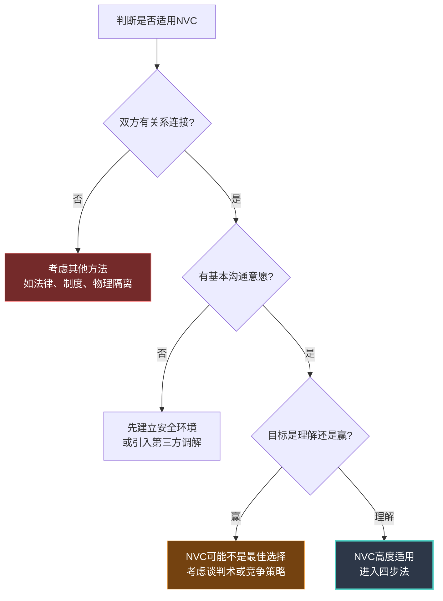
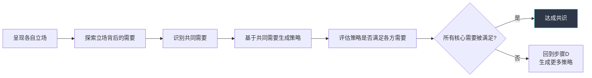
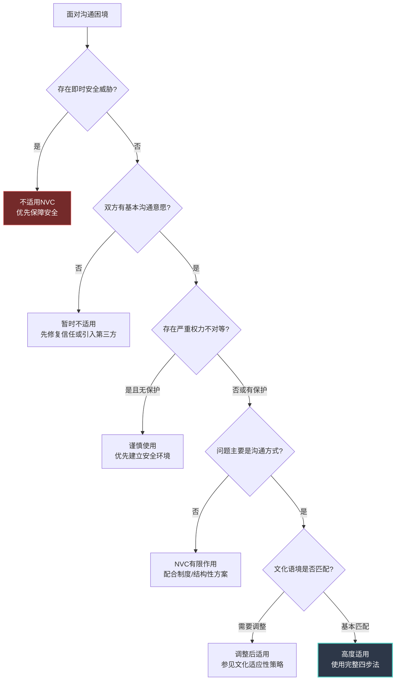
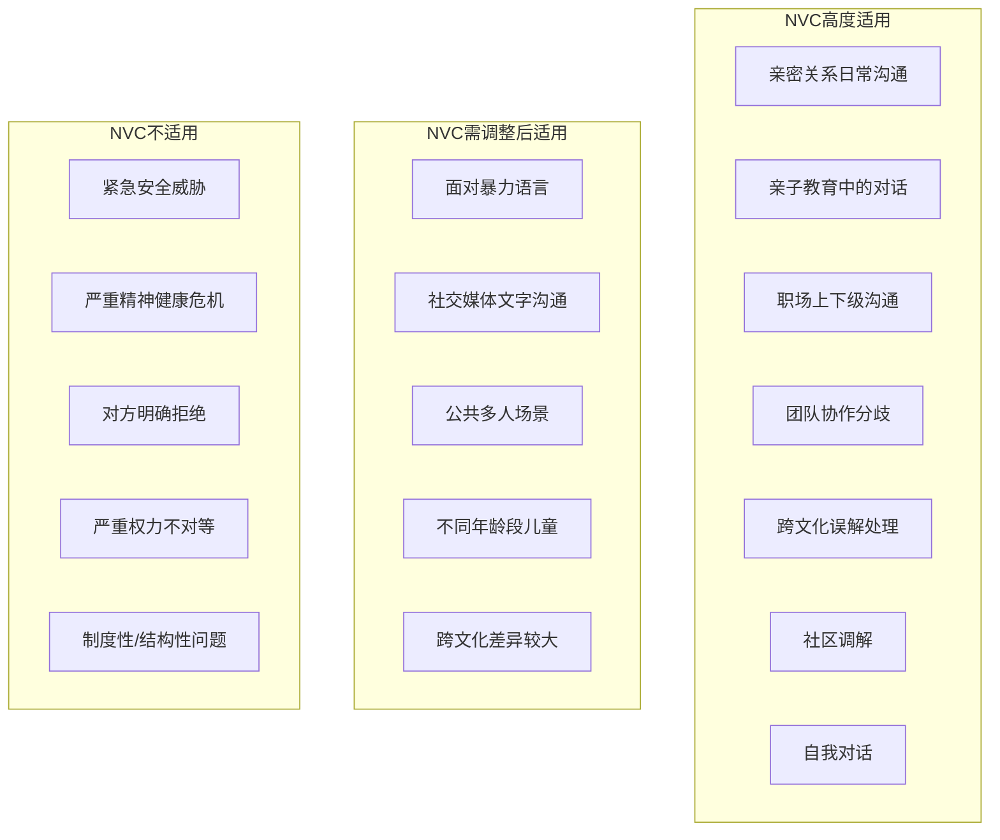

## 五、NVC的适用范围

任何方法论都有其适用边界。牛顿力学在宏观低速世界精确无比，但到了量子尺度或接近光速时就失效了——这不是牛顿力学的缺陷，而是它的适用范围。NVC同样如此。理解NVC能做什么、不能做什么、在哪些场景中效果最佳、在哪些场景中需要调整或暂停，是正确使用NVC的前提。很多NVC实践者的挫败感，不是来自方法本身，而是来自在错误的场景中强行使用了正确的方法。

本节将系统梳理NVC的适用情境、不适用情境、有条件适用情境，以及NVC的目标澄清——它追求什么、不追求什么、容易被误认为追求什么。

### 5.1 NVC的核心适用情境

NVC的本质是一套**基于需要的对话框架**，它最适合满足以下条件的场景：双方（或多方）之间存在某种关系连接，存在沟通意愿但表达方式造成了障碍，目标是理解彼此而非单方面获胜。

#### 5.1.1 亲密关系中的日常沟通

亲密关系是NVC最经典的应用场景，也是卢森堡博士投入最多精力的实践领域。原因很简单：亲密关系中的双方有最强的情感连接，也有最深的脆弱性暴露，因此最容易因为表达方式不当而造成伤害。

**典型场景：**

- **家务分工争执。** 伴侣A觉得家务分配不公平，说"你从来不做家务"（评判），伴侣B立刻防御"我上周不是拖了地吗"（反驳事实），对话变成事实争论，真正的需要——被尊重、被看见、公平感——完全被掩埋。NVC的介入点：将"你从来不做家务"转化为"这周的七顿晚饭中，有五顿是我做的，碗也是我洗的（观察）。我感到疲惫和一点委屈（感受），因为我需要公平和被看见（需要）。你愿意我们坐下来重新商量一下家务分工吗（请求）？"

- **情感表达不足。** 一方觉得另一方"不够浪漫""不在乎我"，但用的是评判性语言，导致对方感到被否定而非被邀请。NVC帮助将"你一点都不关心我"转化为对陪伴和被重视的具体需要的表达。

- **育儿分歧。** 在孩子的教育方式上产生冲突时，NVC帮助双方看到各自行为背后的需要——一方可能需要安全感（"孩子必须好好学习才能有未来"），另一方可能需要自主性（"孩子应该有自己的选择"）——从而找到兼顾双方需要的策略。

**为什么NVC在亲密关系中特别有效：** 亲密关系中的冲突，表面上是关于具体事件（谁洗碗、谁接孩子、花了多少钱），底层几乎都是关于需要——被爱、被尊重、被理解、安全感、自由。NVC的四步法恰好是从表面事件（观察）逐层深入到需要的过程，因此与亲密关系冲突的结构天然匹配。

#### 5.1.2 亲子教育中的代际沟通

孩子——尤其是幼儿和青少年——的语言表达能力有限，他们的"不听话""发脾气""叛逆"往往是未被满足的需要的扭曲表达。NVC为父母提供了一个框架，穿透孩子的行为表面，听到背后的声音。

**年龄分层应用：**

| 年龄段 | 发展特点 | NVC调整策略 | 示例 |
|--------|---------|------------|------|
| 2-5岁 | 语言能力有限，情绪表达直接 | 大量使用观察+猜测感受/需要，减少对孩子的请求 | "你把积木推倒了（观察），你是不是很生气（猜测感受）？你想要那个玩具但拿不到是吗（猜测需要）？" |
| 6-10岁 | 开始理解因果，有初步共情能力 | 可以引导孩子使用简单的四步法 | "你能告诉妈妈，弟弟做了什么（观察），你当时感觉怎样（感受），你想要什么（需要）？" |
| 11-14岁 | 青春期前期，自主意识增强，对评判高度敏感 | 减少NVC的"教育"色彩，更多作为平等对话工具 | 避免用NVC"教"孩子怎么说话，而是自己先示范 |
| 15-18岁 | 价值观形成期，挑战权威 | 尊重孩子的自主性，NVC主要用于修复关系而非管控行为 | "我注意到这周你有三天很晚回来（观察），我有些担心（感受），因为我需要知道你是安全的（需要）。你愿意我们商量一个双方都能接受的时间吗（请求）？" |

**NVC在亲子教育中的独特价值：** 传统教育强调"听话"和"服从"，NVC强调"理解"和"协商"。这不是纵容，而是帮助孩子发展情绪智力和沟通能力——这些能力在他们的整个人生中都将发挥作用。研究表明，在家庭中使用NVC模式沟通的孩子，在学校表现出更高的同理心水平和更低的攻击性行为（Marlow et al., 2012）。

#### 5.1.3 职场中的上下级沟通

职场是NVC应用中最具挑战性的场景之一，因为它同时涉及权力不对等、组织文化约束和专业角色边界。但正是这些挑战，使得NVC在职场中的价值尤为突出——如果NVC能在权力不对等的场景中创造对话空间，那么它的效用就远远超出了"平等交流"的理想情境。

**向上沟通（下属对上级）：**

下属在向上沟通中面临的核心困境是：表达不满可能被视为"不服从"，不表达则积压怨气。NVC提供了一条中间路线——用观察替代评判，用需要替代抱怨。

- **传统表达：** "领导，我觉得你分配任务不公平，每次都把最难的给我。"
- **NVC表达：** "领导，我注意到过去三个月中，我负责的四个项目中有三个是新客户开拓类的（观察），我想跟您聊聊，因为我对工作的公平性有一些关切（感受+需要的精简表达），您方便的时候我们能讨论一下任务分配的标准吗（请求）？"

**向下沟通（上级对下属）：**

管理者使用NVC的关键是：避免将NVC变成更精致的控制工具。"我观察到你的绩效不达标，我感到失望，我需要你提高效率"——这看起来像NVC，但"绩效不达标"是评判而非观察，"失望"是在施加道德压力，"我需要你提高效率"是伪装成需要的要求。

真正的NVC向下沟通： "上季度你的三个项目中，有两个延期了两周以上（观察）。我有些担心（感受），因为我需要确保团队的交付承诺是可靠的（需要）。你愿意跟我聊聊是什么导致了延期，以及我能提供什么支持吗（请求）？"

#### 5.1.4 团队协作中的分歧解决

团队中的分歧往往不是人际冲突，而是观点冲突——不同的人基于不同的信息、经验和优先级得出了不同的结论。NVC在团队中的应用不一定是四步法的完整使用，而更多是一种**基于需要的决策对话框架**。

**团队NVC决策框架：**

**示例：** 产品团队讨论新功能优先级。工程师A主张先做技术债务清理，运营B主张先做用户增长功能。

- 立场层面：A要清理代码，B要做增长——看似不可调和。
- 需要层面：A需要工作的可持续性和成就感（技术债务让每个新功能都越来越难做），B需要业务成果和用户价值（没有增长指标，团队预算会被削减）。
- 共同需要：都需要团队的长期生存和自己的专业价值被认可。
- 兼顾策略：用两周时间做最高优先级的技术重构（满足A的核心需要），同时做一个低成本的增长实验（满足B的核心需要），四周后根据数据决定下一步。

#### 5.1.5 跨文化沟通中的误解处理

跨文化沟通中的许多冲突，根源不是恶意，而是文化规范的差异——对"礼貌"的定义不同，对"直接"的容忍度不同，对"个人空间"的边界不同。NVC的观察步骤在跨文化场景中尤其有价值，因为它帮助我们将行为与文化解读分离。

**案例：** 一位中国经理与一位德国工程师合作。工程师在会议上直接指出方案中的问题："这个方案有三个致命缺陷。"中国经理感到被冒犯——在中国文化中，公开批评上级的方案是不礼貌的。

NVC的介入：帮助中国经理区分"观察"和"文化解读"——观察是"他在会议上列出了方案中的三个问题"，文化解读是"他在挑战我的权威"。同时帮助工程师理解：他的直接表达在中国文化中可能被接收为攻击性语言，即使他的意图是建设性的。

#### 5.1.6 社区和组织中的调解

社区邻里纠纷、业主委员会争议、志愿者组织内部矛盾——这些场景的共同特点是：当事人之间有一定的关系但不密切，冲突往往涉及公共资源分配或规则执行。

NVC调解在社区场景中的优势在于：它不预设谁对谁错，而是帮助各方表达自己的需要，然后寻找满足所有人核心需要的方案。这比"依法裁决"或"和稀泥"都更有可能达成持久的和解。

#### 5.1.7 个人内在的自我对话

这是NVC最被低估的应用场景。卢森堡博士生前反复强调：**NVC首先是一种与自己沟通的方式，然后才是与他人沟通的方式。**

自我对话中的暴力——自我批评、自我否定、内疚感——往往比外界的暴力更具破坏性，因为我们无法"离开"自己。NVC的四步法可以直接转化为内在对话的工具：

- **观察：** "这周的三次健身计划中，我只完成了一次。"（而非"我又失败了，我真是个废物"）
- **感受：** "我感到失望和沮丧。"（而非"我太懒了"——这是评判不是感受）
- **需要：** "我需要对自己的承诺有信任感，也需要身体健康。"（而非"我应该更自律"——"应该"是豺狗语言）
- **请求（对自己）：** "我能不能把健身目标从一周三次调整为一周两次，先建立稳定习惯？"

**自我NVC与自我慈悲的关联：** 克里斯汀·内夫（Kristin Neff）的自我慈悲三要素——善待自己、共通人性、正念觉察——与NVC的自我对话高度契合。善待自己对应NVC的自我共情（用需要而非评判来理解自己的行为），共通人性对应NVC对需要普遍性的理解（每个人都有未被满足的需要，这是人之常情），正念觉察对应NVC的观察步骤（不加评判地看见当下的现实）。

### 5.2 NVC的局限与不适用情境

NVC不是万能药。承认这一点不是对NVC的否定，而是对它的尊重——任何声称适用于所有场景的方法论都值得警惕。以下是NVC明确不适用或需要谨慎使用的情境。

#### 5.2.1 紧急危险情况

当存在即时的身体安全威胁时，需要的是行动而非对话。如果有人正在实施暴力、发生火灾、或存在其他紧急危险，正确的做法是：撤离、报警、采取保护措施——而不是尝试与施暴者进行NVC对话。

**关键原则：** NVC的前提是双方至少有最基本的沟通意愿。在紧急危险中，这个前提不存在。试图在暴力进行中使用NVC，不仅无效，还可能因为延迟行动而加剧危险。

**NVC的事后价值：** 在紧急情况过去、安全环境恢复后，NVC可以用于处理创伤后的对话——帮助当事人表达恐惧、愤怒和悲伤，帮助关系修复。但这是"事后修复"而非"即时干预"。

#### 5.2.2 严重的精神健康危机

当一方处于严重抑郁、精神分裂发作、急性自杀倾向、严重的创伤后应激反应等精神健康危机状态时，需要的是专业的心理/精神科干预，而非沟通技巧。

**NVC与心理治疗的关系：** NVC是沟通工具，不是心理治疗。它可以作为心理治疗的补充——许多治疗师在家庭治疗中使用NVC框架——但它不能替代专业诊断和治疗。将NVC用于"治疗"他人的心理问题，是NVC实践中最危险的越界行为之一。

**判断标准：** 如果对方的行为让你担心他们可能伤害自己或他人，或者对方的情绪反应严重超出情境的正常范围（例如因为小事而崩溃、出现幻觉、完全无法进行逻辑思考），应该寻求专业帮助而非尝试NVC对话。

#### 5.2.3 对方明确拒绝沟通

当对方清楚地表示"我不想和你说话""别跟我说这些""我拒绝讨论这个话题"时，继续使用NVC会适得其反——它变成了另一种形式的"不尊重边界"。

**正确做法：**

1. **尊重拒绝。** "我听到你说现在不想讨论这个，我尊重你的选择。"
2. **表达开放性。** "如果你以后想聊，我随时都在。"
3. **反思自身。** 对方拒绝沟通可能是因为过去的沟通经历让他感到不安全。这可能意味着需要先修复信任关系，才能在此基础上进行NVC对话。
4. **寻找替代路径。** 对方拒绝面对面沟通，可能愿意通过文字交流，或通过第三方调解。

#### 5.2.4 权力严重不对等且无第三方监督

NVC假设双方都有表达的自由和说"不"的权利。当这个假设不成立时——例如家暴关系中的一方、职场霸凌中的下属、被控制的未成年人——NVC可能成为一种危险的误导。

**为什么在这种情境中NVC可能有害：** 让弱势方向强势方表达感受和需要，可能招致报复。"当你打我的时候，我感到恐惧，因为我需要安全"——这句话在理论上是完美的NVC表达，但在现实中可能导致施暴者的进一步暴力。

**NVC的前提条件：** 表达感受和需要需要一个基本安全的环境。如果这个环境不存在，首要任务是建立安全——可能意味着离开、寻求保护、引入第三方——而非使用NVC。

#### 5.2.5 文化背景极度不同且缺乏基本理解

NVC诞生于西方个人主义文化传统，它的许多假设——个人感受的重要性、直接表达需要的正当性、平等对话的可能性——在某些文化中可能不成立或需要大幅调整。

**典型挑战：**

- 在高度集体主义的文化中，个人需要可能被认为应该服从于集体利益。
- 在高权力距离的文化中，下属对上级表达感受可能被视为越权。
- 在高语境文化中，直接说出需要可能被视为粗鲁或幼稚。
- 在某些宗教或传统社区中，特定话题（如性、情感）被视为不应公开讨论。

**在这些情境中使用NVC的前提：** 需要先建立跨文化理解，找到NVC原则与当地文化规范的结合点。详见本节第5.4部分关于NVC文化适应性的讨论。

#### 5.2.6 纯技术性或制度性问题

有些问题的根源不在沟通，而在制度设计、资源分配或结构性不平等。例如：公司裁员不是因为"沟通不好"，而是因为财务困境；员工过劳不是因为"没有表达需要"，而是因为不合理的工作制度。

**NVC在这些场景中的作用：** NVC可以帮助个人在面对制度性问题时保持内在清晰——理解自己的需要，做出符合需要的选择（包括离开）。但它不能替代制度变革、法律保护或结构性解决方案。

将NVC用于解决本质上是结构性的问题，会把系统性问题个人化——"你不满意是因为你没有好好沟通"——这是对NVC的滥用。

### 5.3 有条件适用的情境

除了完全适用和完全不适用的两极，还有大量"灰色地带"——NVC可以使用，但需要根据情境进行调整。

#### 5.3.1 面对习惯性使用暴力语言的人

当对方持续使用评判、指责、人身攻击的语言时，使用NVC是可能的但极其困难。你不仅要管理自己的情绪反应，还要在被攻击的状态下听到对方语言背后的需要。

**调整策略：**

1. **先自我共情。** 在回应之前，先给自己3秒钟，连接自己的感受和需要。"我现在感到愤怒和受伤，因为我需要尊重。"
2. **使用"长颈鹿耳朵"。** 尝试翻译对方的豺狗语言——"你这个蠢货"可能是"我很沮丧，因为这件事对我来说很重要，我需要事情按预期发展"。
3. **设定边界。** NVC不是无限度地承受攻击。"我愿意听你的想法，但当你用这些词语的时候，我很难保持对话。你愿意换一种方式告诉我你需要什么吗？"
4. **接受可能失败。** 如果对方拒绝改变语言方式，你可以选择暂停对话。这不是NVC的失败，而是对现实的清醒判断。

#### 5.3.2 在社交媒体和异步文字沟通中

文字沟通缺少语调、表情、肢体语言等非语言信号，NVC四步法的使用需要调整。

**调整要点：**

- **观察要更精确。** 文字容易被误解，所以观察描述需要更加具体和详细。
- **感受要更明确。** 不能依赖语调来传递情绪色彩，需要用更清晰的语言表达感受。
- **添加语境说明。** "我写这条消息的时候心情是平静的，不是在生气"——在文字沟通中主动提供语境信息，防止对方投射情绪。
- **避免长篇NVC独著。** 在微信/邮件中发送大段NVC表达可能让对方感到压力。可以先简短表达核心需要，再约定时间进行深入对话。

#### 5.3.3 在公共场合和多人场景中

NVC对话通常需要一定的私密性——表达感受和需要是一种脆弱性暴露。在公共场合（家庭聚会、公开会议、群体社交中），完整使用四步法可能让当事人感到尴尬。

**调整策略：** 在多人场景中，可以使用NVC的"精简版"——重点使用观察和请求，适当淡化感受和需要的表达。例如在团队会议中："我注意到我们已经讨论了40分钟还没有结论（观察），我们能不能先确认一下大家最关心的核心问题是什么（请求）？"

#### 5.3.4 与儿童和青少年的沟通

如5.1.2所述，与不同年龄段的孩子使用NVC需要调整语言复杂度和互动方式。一个额外的考量是：孩子的情绪调节能力尚未发育完全，在孩子情绪爆发的当下，可能需要先使用身体安抚（拥抱、陪伴）而非语言对话，等情绪平复后再进行NVC式的复盘。

#### 5.3.5 在法律和正式投诉场景中

NVC不适合用于法律文件、正式投诉或纪律处分——这些场景需要的是事实陈述和规则引用，而非感受和需要的表达。但在法律程序之前或之后的非正式沟通中，NVC可以发挥作用。例如：在正式投诉之前，先尝试用NVC与对方直接沟通，往往能解决问题而不必走到法律层面。

### 5.4 NVC适用范围的判断框架

面对一个具体的沟通情境，如何判断NVC是否适用？以下是一个实用的决策框架：

**使用这个框架的注意事项：** 这个框架是启发式的，不是机械的判断清单。现实中许多情境是混合型的——例如既有沟通问题也有结构性问题，既有文化差异也有个人意愿不足。使用框架的目的是帮助你更清醒地评估情境，而不是替代你的判断力。

### 5.5 NVC的目标澄清

关于NVC的目标，存在大量误解。许多人在学习NVC后设定了错误的目标，导致实践中的挫败感。以下是NVC真正追求的目标、常见的误解目标，以及这些误解如何产生。

#### 5.5.1 NVC不是要达成的目标

**误解一："让所有人喜欢我。"**

NVC不是社交技巧训练，不以获得他人好感为目标。事实上，实践NVC可能会让某些人感到不舒服——因为你的表达方式改变了，打破了原有的互动模式。伴侣可能会说"你说话怎么突然变得这么奇怪"，同事可能会觉得你"太认真了"。这些都是正常反应，不代表你做错了。

**误解二："避免所有冲突。"**

NVC不追求无冲突的人际关系。冲突是人类关系的自然组成部分——不同的需要之间天然存在张力。NVC追求的不是消除冲突，而是改变冲突的表达方式：从互相攻击转向互相理解，从"谁对谁错"转向"如何满足所有人的需要"。

**误解三："让对方按照我的意愿行事。"**

这是对NVC最危险的误解。当NVC被用作操控工具——"我用NVC的句式说了，你就应该答应我"——它就变成了另一种形式的暴力沟通。NVC的请求是真正的请求，对方可以说"不"。如果你无法接受对方的拒绝，那你提出的不是请求，而是要求。

**误解四："成为完美的沟通者。"**

NVC的实践是一个终身学习过程，而不是一个可以达成的终点。卢森堡博士练习了几十年，仍然会有"掉回豺狗模式"的时刻。追求"完美NVC"本身就是一种自我暴力——"我不应该有情绪""我不应该评判别人"——这些"应该"恰恰是NVC要消除的语言模式。

**误解五："NVC是唯一的正确沟通方式。"**

NVC是众多沟通方法中的一种，有其独特价值，但不是唯一正确的沟通方式。在许多场景中，其他方法可能更有效——有时候直接说"不行"比用NVC绕一大圈更合适，有时候沉默比表达更智慧，有时候幽默比真诚更有效。

#### 5.5.2 NVC真正追求的目标

**目标一：建立基于真诚和理解的人际关系。**

NVC的终极追求不是"有效地沟通"，而是"真诚地连接"。这意味着在关系中，双方都敢于表达真实的感受和需要，同时也有意愿去理解对方的感受和需要。这种关系不是没有冲突的，而是有冲突时能够安全地面对。

**目标二：创造满足所有人需要的解决方案。**

NVC的核心信念是：人的需要之间不存在根本性矛盾，矛盾的是满足需要的策略。"我要安静"和"我要听音乐"看似矛盾，但底层需要可能是"放松"和"愉悦"——同一个需要可以通过不同策略满足，不同需要也可以被同时尊重。NVC追求的是找到这些兼顾策略。

**目标三：培养内在的平和与慈悲。**

NVC不仅改变你与他人的沟通方式，更改变你与自己的关系。通过练习观察而不评判、连接需要而不执着于策略、提出请求而不强求结果，你会逐渐培养出一种内在的平和——不是压抑情绪的假性平静，而是理解了需要之后的自然安宁。

**目标四：在人与人之间建立真正的连接。**

连接不等于认同，理解不等于赞同。NVC追求的连接是：即使我不同意你的做法，我仍然能够感受到你是一个有感受、有需要的人，值得被尊重地对待。这种连接超越了立场的对立，在最根本的人性层面建立桥梁。

#### 5.5.3 目标澄清的实践意义

理解NVC的真正目标，直接影响你的实践方式：

| 如果你认为目标是… | 你的实践倾向 | 问题 | 正确的实践方式 |
|-------------------|-------------|------|--------------|
| 让对方改变 | 用NVC包装自己的要求 | 对方感到被操控 | 先理解对方的需要，再表达自己的需要 |
| 避免冲突 | 压抑自己的真实感受 | 积累怨气，最终爆发 | 真诚表达，接受冲突是正常的 |
| 证明自己是好人 | 过度自我牺牲 | 耗竭式共情 | 平衡自己的需要和他人的需要 |
| 掌握一种技术 | 机械套用四步法 | 对方感到不自然 | 将NVC内化为思维方式，灵活运用 |
| 建立真诚连接 | 真实表达+愿意倾听 | 偶尔会笨拙和失败 | 接受不完美，持续练习 |

### 5.6 NVC与其他方法的协同使用

NVC不是孤岛。在实际应用中，它往往需要与其他方法配合使用，才能发挥最大效果。

**NVC + 正念冥想：** 正念帮助你培养觉察力——在情绪升起的瞬间就能注意到它，而不是等到爆发后才意识到。这种觉察力是NVC四步法的前提。没有觉察，你不会在"你这个人太自私了"脱口之前意识到自己正在使用豺狗语言。

**NVC + 情绪调节技术：** 当情绪过于强烈时（愤怒值8分以上），四步法的理性框架很难被调用。此时需要先使用情绪调节技术——深呼吸、暂时离开、身体活动——将情绪强度降低到可以思考的程度，再使用NVC。

**NVC + 认知行为疗法（CBT）：** CBT帮助你识别和挑战扭曲的思维模式（灾难化、非黑即白、读心术等），NVC帮助你将清晰的思维转化为有效的沟通行为。两者结合，先清理思维中的噪音，再用NVC进行表达。

**NVC + 专业调解：** 在严重冲突中，NVC认证调解师的介入可以提供中立的对话空间。调解师使用NVC框架帮助双方表达和倾听，但作为受过专业训练的第三方，能够处理个人使用NVC时难以应对的复杂动态。

### 5.7 本节小结

NVC的适用范围可以用一句话概括：**当两个（或多个）有关系连接的人，面对沟通困境，愿意以理解而非征服为目标进行对话时，NVC高度适用。**

掌握NVC的适用范围，不是为了限制你使用NVC，而是为了让你在正确的场景中更自信地使用它。当你清楚地知道NVC能做什么、不能做什么时，你就不会再因为"NVC不起作用"而怀疑这个方法——你会知道，那只是因为你用在了一个需要不同工具的场景中。

正如卢森堡博士所说："非暴力沟通不是一把万能钥匙，但它是一把能打开很多扇门的钥匙。知道哪些门它能打开，哪些门需要另一把钥匙，这才是真正的智慧。"
