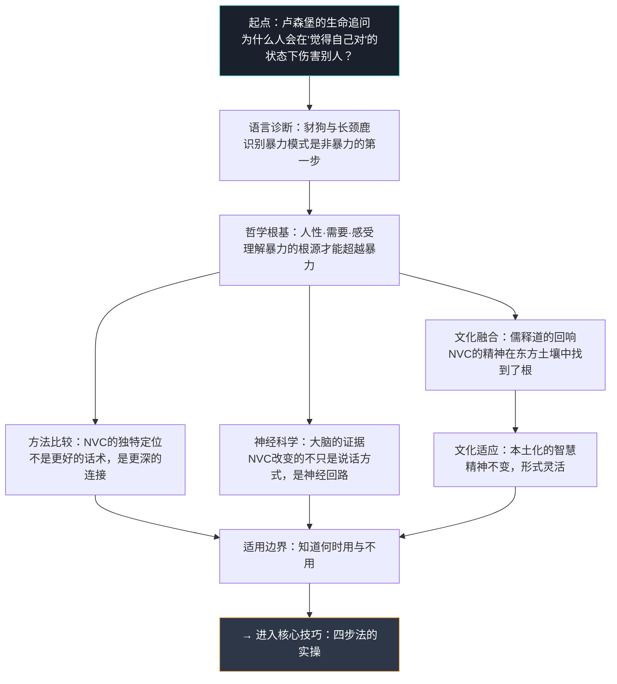

## 本节小结

理论基础部分完成了对非暴力沟通（NVC）全景式的思想梳理——从创始人的生命历程，到语言隐喻的认知设计，到哲学根基的三大支柱，再到与东方智慧的深层对话，以及神经科学的实证支撑。本节对前述八个主题做结构化提炼，帮助你建立完整的知识地图，并为下一节"核心技巧"的操作学习做好认知准备。

### 6.1 八个主题的核心要点回顾

下表将理论基础的全部内容浓缩为一张可速查的参照表：

| 主题 | 核心命题 | 一句话精华 |
|------|---------|-----------|
| 卢森堡与NVC的诞生 | NVC源自真实冲突中的六十年实践，不是书房理论 | 在暴力中追问"为什么人会伤害人"，用一生给出了答案 |
| 豺狗语言与长颈鹿语言 | 两种语言模式代表两种截然不同的思维操作系统 | 豺狗评判人，长颈鹿理解人——你随时可以切换频道 |
| NVC的哲学基础 | 人性向善、需要与策略的区分、感受是信使 | 每个人的行为都在试图满足某种需要，暴力只是选错了策略 |
| NVC与传统文化的融合 | 儒家忠恕、佛家正念、道家无为与NVC精神高度共鸣 | NVC不是舶来品，它回应的是人类共通的善意追求 |
| NVC的适用范围 | 适用于日常沟通到组织调解，但不是万能药 | 知道何时用NVC和知道何时不用NVC同样重要 |
| NVC与其他沟通方法的比较 | NVC的独特价值在于同时关注自我连接、他人连接和行动 | 不是更好的话术，而是更深的连接方式 |
| NVC的神经科学基础 | 长颈鹿语言激活前额叶和催产素系统，豺狗语言激活杏仁核和皮质醇 | NVC有效不是因为它"听起来好"，而是因为它改变了大脑的化学反应 |
| NVC的文化适应性 | 在面子文化、含蓄表达的语境中需要灵活变通 | 形式可以本土化，精神不可打折 |

### 6.2 理论体系的内在逻辑

八个主题并非孤立的知识点，而是一条层层递进的认知链条：

这条链条的逻辑是：**理解创始人的生命动机 → 识别语言模式的差异 → 理解差异背后的哲学根源 → 在本土文化中找到共鸣 → 明确NVC的定位和边界 → 用神经科学验证其有效性 → 在具体文化语境中灵活应用**。走完这条链，你就不再是"学了一个技巧"，而是"理解了一种看待人的方式"。

### 6.3 三个必须带走的核心认知

在所有理论内容中，有三个认知是后续学习核心技巧的必要前提。如果只记住三件事，就记住这三个：

**认知一：需要和策略是两回事。**

这是NVC最核心的理论贡献。"需要被尊重"是需要，"你必须听我的"是策略。需要是普遍的、有限的（NVC归纳了约七十种人类共通需要），策略是多样的、无限的。冲突几乎总是发生在策略层面——两个人都需要"安全感"，但一个通过控制来满足，一个通过逃离来满足。当你能把注意力从"谁的策略更好"转移到"我们各自的需要是什么"，冲突就从死结变成了可解题。

**认知二：感受是指向需要的信使，不是需要管理的麻烦。**

传统观念认为情绪是需要被"控制"或"管理"的东西。NVC提供了一个根本性的视角转换：每一种感受都在告诉你一个关于需要的信息。愤怒告诉你"我的某个需要被严重侵犯了"，悲伤告诉你"我失去了一样对我很重要的东西"，焦虑告诉我"我预感到某个需要可能无法被满足"。当你把感受当信使而不是敌人，你就获得了一个强大的自我认知系统。

**认知三：NVC不是话术，是一种存在状态。**

这是最容易被误解、也最容易被违背的一点。NVC四步法（观察-感受-需要-请求）看起来像一个句式模板，但如果你只是在形式上套用它，内心却没有真正的同理心和好奇心，对方感受到的不是连接，而是操控。卢森堡反复强调："NVC不是关于你说什么，而是关于你为什么说。"真诚的笨拙永远胜过精巧的伪装。

### 6.4 理论基础中学到的关键区分

NVC理论贡献了若干重要的概念区分，这些区分将在后续的技巧学习中反复用到：

| 区分项 | 一端 | 另一端 | 为什么重要 |
|--------|------|--------|-----------|
| 语言模式 | 豺狗语言（评判、标签、命令） | 长颈鹿语言（观察、感受、请求） | 语言模式决定对话走向 |
| 表达层次 | 评论（"你太自私了"） | 观察（"你连续三天没有回复我的消息"） | 观察引发好奇，评论引发防御 |
| 情绪定位 | 情绪是需要被控制的麻烦 | 情绪是指向需要的信使 | 信使被杀掉，信息就丢失了 |
| 冲突理解 | 需要冲突（不可调和） | 策略冲突（可以创造第三方案） | 绝大多数"不可调和的冲突"其实是策略冲突 |
| 人性假设 | 人天性自私，需要外部约束 | 人天性倾向合作，暴力是习得的 | 假设决定了你创造什么样的对话条件 |
| 关系模式 | 条件性接纳（你改了我才接受你） | 无条件接纳（我接受你这个人，同时表达我的需要） | 无条件接纳是NVC产生连接效果的心理基础 |
| 沟通目标 | 赢得争论、说服对方 | 彼此理解、共同寻找满足需要的方案 | 目标不同，整个对话的路径就不同 |

### 6.5 理论到实践的桥梁

理论基础解决的是"为什么"的问题——为什么NVC有效，为什么我们应该放弃评判性语言，为什么感受值得被倾听。但知道"为什么"并不等于能做到。从理论到实践，中间有一个关键的跳跃：**内化**。

内化不是靠"记住"四个步骤实现的，而是靠反复练习直到新的思维路径变得比旧路径更自然。神经科学告诉我们，旧的沟通习惯（评判、防御、攻击）之所以根深蒂固，是因为它们在大脑中已经形成了强健的神经通路。建立新的通路需要时间和刻意练习——就像学习一门新语言，最初每个句子都需要在脑中翻译，直到有一天你开始"用那门语言思考"。

以下是对后续核心技巧学习的几点建议：

- **从觉察开始，不从完美开始。** 学完理论后，你最先要做的不是"用NVC说话"，而是"觉察自己正在用豺狗语言说话"。觉察本身就是改变的开始。
- **先对自己使用NVC。** 在尝试对外使用NVC之前，先用"观察-感受-需要-请求"的框架与自己对话。当你能清晰地识别自己的感受和需要时，对外表达自然会变得更真诚。
- **接受笨拙期。** 刚开始使用NVC时，你会觉得别扭、不自然，甚至觉得"这样说话好奇怪"。这是正常的。任何深层习惯的改变都会经历一个"能力倒退"的阶段——旧方法已经放弃，新方法还不熟练。坚持过去，就会迎来质变。
- **带着好奇心而非工具箱进入对话。** NVC不是一个你"对别人使用"的工具，而是你"与别人一起探索"的邀请。当你带着真正的好奇——"这个人在经历什么？他需要什么？"——进入对话时，即使你的四步法还不够标准，对方也能感受到你的真诚。

### 6.6 从理论基础到核心技巧的衔接

下一节"核心技巧"将进入NVC的四步法实操——观察、感受、需要、请求。每一步都将从"是什么"（定义与原理）、"怎么做"（具体方法与句式）、"常见陷阱"（容易犯的错误）三个维度展开。

带着本节建立的理论框架进入下一节，你会发现：观察不是简单的"描述事实"，而是对评判性思维模式的系统训练；感受不是简单的"说出情绪"，而是对自己内心世界的一次深度探索；需要不是简单的"提要求"，而是对人类共同处境的一次哲学确认；请求不是简单的"要东西"，而是一次关于"我们如何共同生活"的真诚对话。

理论给了你看见水的眼睛，核心技巧将给你在水中游泳的能力。

***
