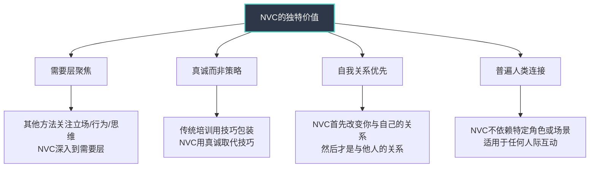
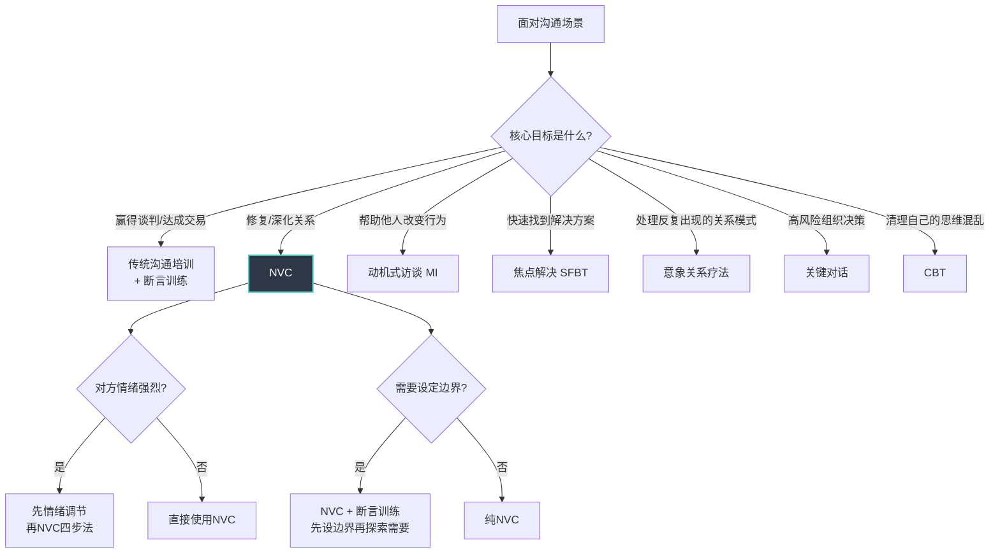
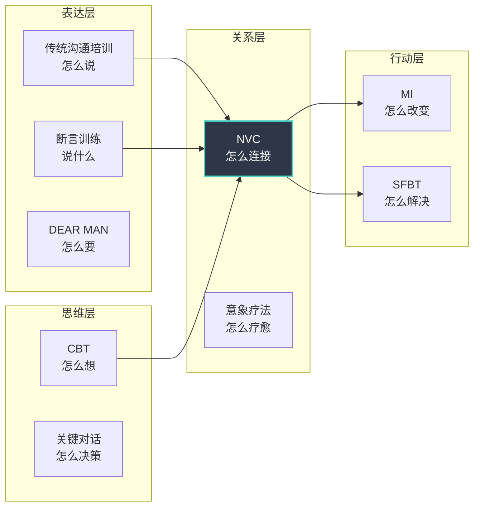

## 六、NVC与其他沟通方法的比较

沟通方法论的大花园里，NVC只是众多花卉中的一种。玫瑰有玫瑰的芬芳，茉莉有茉莉的清香——没有哪种花能取代所有其他花的存在价值。理解NVC与其他主流沟通方法的异同，不仅能帮助你更精准地选择适合特定场景的工具，还能让你从其他方法中借鉴精华，丰富自己的沟通能力体系。

本节将NVC与八大主流沟通方法进行系统比较：从方法起源、核心假设、操作流程、适用场景、局限性等多个维度展开深度分析，并提供一个实用的方法选择决策框架。

### 6.1 比较维度总览

在进入逐一对比之前，先建立一个统一的分析框架。每种方法的比较都将围绕以下六个核心维度展开：

| 维度 | 说明 |
|------|------|
| 核心假设 | 这种方法认为沟通问题的根源是什么？ |
| 核心目标 | 这种方法追求的最终成果是什么？ |
| 操作框架 | 具体的操作步骤或流程是什么？ |
| 对情绪的态度 | 如何处理沟通中的情绪因素？ |
| 对冲突的理解 | 如何看待冲突的本质和功能？ |
| 证据基础 | 有哪些研究支持其有效性？ |

### 6.2 NVC vs 传统沟通培训

#### 6.2.1 背景差异

传统沟通培训（如戴尔·卡耐基的人际关系课程、谈判技巧培训、销售话术训练）诞生于20世纪初的美国商业环境，核心驱动力是"如何在商业和社交中获得成功"。NVC诞生于20世纪60年代的美国民权运动和人本主义心理学浪潮，核心驱动力是"如何在人与人之间建立真正的理解"。

#### 6.2.2 核心假设对比

| 维度 | 传统沟通培训 | 非暴力沟通 |
|------|-------------|-----------|
| 问题根源 | 表达技巧不足 | 与自己和他人的需要断连 |
| 核心目标 | 达成目标、赢得胜利、建立影响力 | 建立连接、满足需要、创造理解 |
| 关注焦点 | 说话的技巧——怎么说 | 说话的意图和心态——为什么说 |
| 对冲突的理解 | 需要解决或赢取的对抗 | 需要理解和转化的信号 |
| 对情绪的态度 | 需要控制或策略性展示的变量 | 需要倾听和尊重的信使 |
| 成功标准 | 对方接受了我的观点或方案 | 双方都感到被理解，需要得到尊重 |
| 对"他人"的定位 | 需要被说服或影响的对象 | 同样有感受和需要的平等个体 |

#### 6.2.3 操作层面对比

传统沟通培训强调的是**策略性表达**——如何开场、如何陈述观点、如何应对反对意见、如何收尾。它的工具箱里装的是：话术模板、肢体语言技巧、说服心理学（如互惠原则、社会证明、稀缺效应等）。

NVC强调的是**真诚性表达**——先与自己的感受和需要连接，再用观察-感受-需要-请求的框架与他人分享。它的工具箱里装的是：观察练习、感受词汇表、需要清单、请求句式。

**同一个场景的对比：**

场景：同事在会议上公开批评你的方案。

- **传统沟通培训的回应**：保持微笑，使用"三明治反馈法"——先肯定对方的参与，然后用数据和逻辑反驳对方的观点，最后表达对合作的期待。策略核心：维护自己的专业形象，同时用逻辑压倒对方。
- **NVC的回应**："我注意到你在会议上指出了我方案中的三个不足（观察）。说实话，我感到有些紧张和不舒服（感受），因为我需要我的工作被尊重地对待，也需要在讨论中感到安全（需要）。你愿意在会后单独和我聊聊你的具体想法吗？这样我们可以更充分地交流（请求）？"核心：表达真实的感受，同时尊重对方可能也有未被满足的需要。

#### 6.2.4 各自的优势与局限

**传统沟通培训的优势：**

- 上手快，短期效果明显——学几个技巧就能立刻改善沟通效果
- 在竞争性场景（销售、谈判、辩论）中效果显著
- 文化适应性强——"怎么说好话"比"表达感受"在很多文化中更容易被接受
- 不需要情感暴露——可以保持心理距离

**传统沟通培训的局限：**

- 关注技巧而非关系——赢得了对话却可能输掉了信任
- 可能沦为操控——当"话术"用得过于熟练时，对方会感到被操纵
- 无法处理深层冲突——当冲突的根源是未被满足的需要时，技巧只是在表面涂脂抹粉
- 忽视自我关系——不教你如何与自己的感受相处

**NVC的优势：**

- 从根源解决冲突——触及需要层面而非停留在立场表面
- 深化关系——真诚表达和深度倾听创造信任
- 可持续——内化后成为一种自然的沟通方式，不需要"表演"
- 兼顾自我与他人——在表达自己需要的同时关注对方的需要

**NVC的局限：**

- 学习曲线陡峭——需要长期练习才能自然运用
- 在竞争性场景中可能"吃亏"——当对方使用传统话术时，NVC者可能被"算计"
- 文化适应挑战——直接表达感受和需要在某些文化中不被鼓励
- 需要情感投入——对某些人来说，表达感受本身就是巨大的挑战

### 6.3 NVC vs 积极倾听（Active Listening）

#### 6.3.1 起源与核心理念

积极倾听由卡尔·罗杰斯（Carl Rogers）在20世纪50年代提出，是人本主义心理咨询的核心技术。罗杰斯认为，当一个人感到被真正倾听时，他会自然地更开放、更愿意探索自己的内心。积极倾听的核心操作是：**反映对方的感受和内容，不做评判，不给建议**。

NVC吸收了积极倾听的精华——卢森堡博士明确承认受罗杰斯影响——但在三个关键维度上进行了扩展。

#### 6.3.2 操作层面对比

| 维度 | 积极倾听 | NVC倾听 |
|------|---------|---------|
| 反映内容 | "你觉得项目被取消很沮丧" | 同左 |
| 反映感受 | "你感到沮丧" | 同左 |
| 探索需要 | 不作为核心步骤 | "你是因为需要自己的努力被认可而感到沮丧吗？" |
| 确认理解 | "我理解得对吗？" | "你最希望我理解的是什么？" |
| 表达自己 | 积极倾听主要关注对方 | NVC倾听后会自然过渡到自我表达 |
| 请求层面 | 不包含 | "你愿意告诉我，你接下来最需要的是什么吗？" |

**同一个场景的完整对比：**

场景：伴侣抱怨"你总是加班，根本不在乎这个家"。

- **积极倾听的回应**："你觉得我工作太多，让你感到被冷落了，是这样吗？"
- **NVC倾听的回应**："我听到你说我最近加班很多（反映观察），你是不是感到孤独和失落（猜测感受），因为你需要陪伴和被重视（猜测需要）？你最希望我理解的是什么（确认性请求）？"

#### 6.3.3 深度差异

积极倾听是一种**单向接收技术**——它的核心目标是让对方感到被听到。NVC倾听是一种**双向连接技术**——它在让对方感到被听到的同时，还帮助对方连接到自己的深层需要，并为后续的对话（包括表达自己的需要）创造条件。

打个比方：积极倾听像是给一面镜子，让对方看到自己的情绪；NVC倾听不仅给镜子，还给一扇窗户，让对方看到情绪背后更深层的东西——需要。

#### 6.3.4 融合使用建议

在实际操作中，NVC倾听完全可以看作积极倾听的升级版。如果你已经掌握了积极倾听的技能，升级到NVC倾听只需要增加两步：

1. **在反映感受之后，加入需要猜测**："你感到……，是因为你需要……吗？"
2. **在理解对方之后，过渡到自己的表达**："我听到了你的需要，我也想分享一下我这边的感受和需要，你愿意听吗？"

### 6.4 NVC vs 断言训练（Assertiveness Training）

#### 6.4.1 起源与核心理念

断言训练（又称自信训练）兴起于20世纪70年代的行为主义心理学流派，核心理念是：**每个人都有权利表达自己的想法、感受和需要，同时也有责任尊重他人的同等权利。** 它的理论基础是行为主义的"被动-攻击-断言"三分模型——被动是放弃自己的权利，攻击是侵犯他人的权利，断言是在两者之间找到平衡。

NVC与断言训练共享"表达自己"的核心诉求，但在表达的框架和对"他人"的处理上存在根本差异。

#### 6.4.2 操作框架对比

断言训练的经典框架是"DESC"：

- **D**escribe（描述）：客观描述情境——"你连续三次会议迟到了"
- **E**xpress/Effect（表达/影响）：表达自己的感受或行为的影响——"这影响了会议效率"
- **S**pecify（具体说明）：明确说明期望——"我需要你准时参加会议"
- **C**onsequences（后果）：说明正面或负面后果——"否则我会考虑调整会议时间"

NVC的四步法在前两步与DESC有重叠，但后两步有根本区别：

- **O**bservation（观察）：同Describe，但更严格地排除评判
- **F**eeling（感受）：表达自己的内心体验，而非行为的"影响"
- **N**eed（需要）：连接感受背后的普遍人类需要
- **R**equest（请求）：提出具体、可拒绝的请求，不包含后果暗示

#### 6.4.3 关键差异深度分析

**差异一：对"后果"的处理**

断言训练中，"后果"是一个合法的工具——"如果你继续这样做，我将……"。这在某些场景中是有效的（如设定边界、执行规则），但它本质上是一种条件性施压。

NVC拒绝使用后果作为沟通工具，因为后果暗示会激活对方的恐惧系统，导致顺从而非真正的理解和合作。NVC的请求是真正可拒绝的——如果对方说"不"，NVC者会尝试理解对方的"不"背后的需要，而非升级施压。

**差异二：对"对方需要"的处理**

断言训练主要关注"我"的权利和需要——"我有权表达""我需要你做什么"。对对方的需要，断言训练的态度是"尊重但不主动探索"。

NVC将对方的需要置于同等重要的位置——在表达自己的需要之前或之后，NVC会主动探索"你这样做是因为你需要什么吗？"

**同一个场景的对比：**

场景：室友经常不洗碗。

- **断言训练的表达**："你用完厨房后不洗碗（描述），这让我感到不舒服，因为厨房变得脏乱（影响）。我需要你用完后立刻清洗（具体说明）。如果你继续不洗碗，我会把你的碗放到你房间里（后果）。"
- **NVC的表达**："我注意到这周的碗大部分是我洗的（观察），说实话我感到有些疲惫和不公平（感受），因为我需要整洁和公平（需要）。你愿意我们商量一个双方都觉得合理的厨房清洁方案吗（请求）？顺便问一下，你觉得现在的安排有什么不方便的地方吗（探索对方需要）？"

#### 6.4.4 选择建议

- 当你需要快速设定清晰边界、且对方是你没有长期关系的人（如商家、陌生人），断言训练的DESC框架可能更直接有效
- 当你在乎与对方的长期关系，且冲突的根源可能是双方需要未被满足时，NVC更有可能创造双赢
- 当对方使用攻击性语言时，断言训练的"界限设定"技巧可以与NVC结合——先用断言设定底线，再用NVC探索解决方案

### 6.5 NVC vs 关键对话（Crucial Conversations）

#### 6.5.1 背景与定位

《关键对话》（Crucial Conversations，Patterson等，2002）是美国最受欢迎的沟通培训项目之一，专门针对"高风险、强情绪、不同意见"的对话场景。它的核心概念是"对话伙伴"（Dialogue Partner）——当对话变得危险时，人们要么退缩（沉默），要么攻击（暴力），而关键对话的目标是在这两种反应之间创造第三条路——对话。

#### 6.5.2 核心框架对比

| 维度 | 关键对话 | NVC |
|------|---------|-----|
| 核心概念 | 安全感 + 共享信息池 | 连接 + 需要 |
| 处理情绪 | "从心开始"——先管理自己的动机 | 觉察感受→连接需要 |
| 恢复安全 | 用对比法消除误解 + 共同目标声明 | 通过观察+共情重建信任 |
| 处理分歧 | 探索对方的"故事"——事实→解读→感受→行动 | 探索对方的需要——行为→感受→需要→请求 |
| 行动导向 | 决策规则（投票/共识/委托） | 兼顾各方需要的创造性策略 |

#### 6.5.3 深度分析：对"故事"vs对"需要"

关键对话的核心洞察是：**在事实和情绪之间，存在一个"故事"（解读/诠释）层**——同一件事（事实），不同的人会编出不同的"故事"（解读），这些"故事"产生了不同的情绪和行为。

例如：老板没回复你的邮件（事实）→ 你编的故事是"他不重视我"（解读）→ 你感到愤怒（情绪）→ 你去找他理论（行为）。

关键对话的方法是：帮助你识别和检验自己编的"故事"——"我是不是在做假设？有没有其他可能的解读？"

NVC的方法是：跳过"故事"，直接连接"需要"——"我没收到回复，我感到焦虑，因为我需要被重视和及时回应。"然后去表达这个需要，而非质问对方"为什么不重视我"。

两种方法可以互补：关键对话帮你清理思维中的"噪音"（错误解读），NVC帮你用建设性的方式表达真实感受和需要。

#### 6.5.4 适用场景对比

- **关键对话更适合**：职场正式场景、组织决策对话、多方利益博弈、需要达成具体行动方案的对话
- **NVC更适合**：亲密关系、亲子关系、个人内在对话、修复信任、处理深层情感冲突

### 6.6 NVC vs 认知行为疗法（CBT）

#### 6.6.1 核心差异

CBT关注的是**思维模式**——识别和改变不合理的认知（如灾难化、过度概括、非黑即白等）。NVC关注的是**沟通模式**——从评判性表达转化为连接性表达。

两者在"改变内在过程"这一点上高度一致，但切入角度不同。

#### 6.6.2 对"你总是迟到"的处理

**CBT的处理路径**：

1. 识别自动思维："你总是迟到"
2. 识别认知扭曲：过度概括（从几次迟到推断"总是"）
3. 检验证据：事实上有多少次迟到？
4. 生成替代思维："他最近三次见面中有两次迟到了，这让我很不舒服"
5. 行动：用更准确的想法替代扭曲想法

**NVC的处理路径**：

1. 将评判转化为观察："这周你有三天晚于约定时间回家"
2. 连接感受："我感到失望和不被尊重"
3. 连接需要："我需要被重视和守时代表的可靠性"
4. 提出请求："你愿意告诉我，是什么让你最近回来得晚了吗？我们一起想想有没有办法？"

#### 6.6.3 互补价值

CBT解决的是"想清楚"的问题——帮你在内心层面纠正扭曲的认知，让你看到更接近现实的图景。NVC解决的是"说清楚"的问题——帮你在表达层面用建设性的方式传递你的观察、感受、需要和请求。

最佳实践是**先CBT后NVC**：

1. 先用CBT清理自己的认知扭曲（"他'总是'迟到吗？还是我有过度概括？"）
2. 清理完后，用观察陈述连接到真实感受
3. 用NVC的框架与对方沟通

这个组合特别适合处理"情绪驱动的沟通"——你因为愤怒而脱口而出的话，往往混合了认知扭曲和暴力语言。先CBT去扭曲，再NVC来表达，能显著提升沟通质量。

#### 6.6.4 研究支持

CBT拥有大量随机对照试验（RCT）支持其在焦虑、抑郁等领域的有效性（Butler等，2006的元分析）。NVC的循证研究相对较少，但Marlow等（2012）的研究显示NVC培训能显著提高同理心水平和降低攻击性行为。Hull（2010）的博士论文发现，NVC在大学生群体中显著改善了沟通满意度和关系质量。

### 6.7 NVC vs 动机式访谈（Motivational Interviewing, MI）

#### 6.7.1 背景

动机式访谈由William Miller和Stephen Rollnick在1983年提出，最初用于成瘾行为治疗，后来扩展到健康行为改变、教育、社会工作等领域。MI的核心理念是：**人们有改变的内在动力，咨询师的任务是帮助他们发现和放大这种动力，而非施加外在压力。**

#### 6.7.2 核心理念对比

| 维度 | 动机式访谈 | NVC |
|------|-----------|-----|
| 核心假设 | 人们有内在改变动力，需要被引导发现 | 人们有基本需要，需要被听见和理解 |
| 关注点 | 对方对改变的矛盾心理（ambivalence） | 对方的感受和需要 |
| 表达方式 | 开放式问题、反映性倾听、肯定、总结 | 观察、感受、需要、请求 |
| 目标 | 促进对方做出改变决定 | 建立相互理解和满足需要 |
| 权力关系 | 明确的"引导者-来访者"角色 | 尽可能平等的对话关系 |
| 应用领域 | 健康行为、成瘾治疗、教育 | 任何涉及人际沟通的场景 |

#### 6.7.3 技术层面的交集

MI的核心技术——OARS（开放式问题、肯定、反映性倾听、总结）——与NVC的倾听阶段有大量交集。两者都强调：不评判、不建议、专注于理解对方。

但MI更"目标导向"——它的终极目标是推动行为改变（戒烟、减重、遵医嘱等），而NVC更"关系导向"——它的终极目标是建立真诚连接。

#### 6.7.4 融合使用

在需要帮助他人改变行为的场景中（如健康教练、教育、管理），MI + NVC是一个强大的组合：

1. **用NVC倾听**建立信任和连接（感受+需要层）
2. **用MI的OARS技术**探索对方对改变的矛盾心理
3. **用NVC表达**自己的感受和需要（如果涉及双方关系）
4. **用MI的放大技术**帮助对方找到自己的改变动力

### 6.8 NVC vs DBT人际效能技巧（GIVE / DEAR MAN）

#### 6.8.1 背景

辩证行为疗法（DBT）由Marsha Linehan在1990年代创立，最初用于边缘型人格障碍治疗。DBT的人际效能模块包含两组技巧：

- **GIVE**（温和、感兴趣、确认、轻松）：维护关系的技巧
- **DEAR MAN**（描述、表达、坚持、强化、正念、自信、协商）：达成目标的技巧

#### 6.8.2 DEAR MAN与NVC四步法对比

| DEAR MAN | NVC | 差异 |
|----------|-----|------|
| **D**escribe（描述情境） | Observation（观察） | 基本相同，都是客观描述 |
| **E**xpress（表达感受） | Feeling（感受） | 基本相同 |
| **A**ssert（坚持请求） | Request（请求） | DEAR MAN强调坚定，NVC强调可拒绝 |
| **R**einforce（强化奖励） | — | NVC不使用奖励/惩罚机制 |
| **M**indful（保持正念） | 隐含于整个过程 | DBT将其显式化为独立步骤 |
| **A**ppear confident（自信外表） | — | NVC不要求"表演"自信 |
| **N**egotiate（协商） | 探索对方需要 | NVC通过理解对方需要来自然协商 |

#### 6.8.3 关键差异：奖励机制与可拒绝性

DEAR MAN的"R"（Reinforce）明确要求使用奖励——"如果你帮我搬家，下周我也帮你搬"。这是一种互惠策略，在很多场景中有效（尤其在职场和正式关系中），但它将关系简化为"交易"。

NVC拒绝使用奖励/惩罚框架，因为它认为真正的连接不能建立在条件交换之上。NVC的请求是真正可拒绝的，不附带后果暗示。

**选择建议：**

- 在需要达成具体目标的场景（协商、交易、规则执行），DEAR MAN的结构化框架更直接
- 在需要深化关系的场景（亲密关系、信任修复），NVC的无条件关注更合适
- GIVE中的"温和"和"确认"可以直接融入NVC的倾听阶段

### 6.9 NVC vs 焦点解决短期治疗（SFBT）

#### 6.9.1 核心理念

焦点解决短期治疗（Solution-Focused Brief Therapy, SFBT）由Steve de Shazer和Insoo Kim Berg在1980年代创立。SFBT的核心假设是：**问题的解决不依赖于对问题原因的深入分析，而依赖于发现和扩展已有的解决方案。** 它的标志性技术包括"奇迹问句"（如果明天问题奇迹般消失了，你的生活会有什么不同？）和"刻度问句"（从1到10，你现在的状态是几分？）。

#### 6.9.2 与NVC的根本差异

NVC是**需要导向**的——它深入挖掘感受背后的需要，认为满足需要是解决问题的根本途径。SFBT是**解决导向**的——它不去深挖原因，而是直接探索"你想要什么不同的结果"以及"你曾经怎样做到过"。

**同一个场景的对比：**

场景：夫妻之间缺乏亲密感。

- **NVC的路径**：探索双方的需要——"你需要陪伴和情感连接""我需要个人空间和被信任"→ 寻找同时满足两种需要的策略
- **SFBT的路径**：奇迹问句——"如果明天醒来你们之间的亲密感恢复了，你会注意到什么具体的不同？"→ 从小的、可观察的变化开始

#### 6.9.3 互补价值

SFBT擅长**快速定位行动方向**——它不纠缠于"为什么出了问题"，而是问"你想要什么"。NVC擅长**深度理解冲突根源**——它通过探索需要来理解为什么之前的解决方案不起作用。

结合使用：先用SFBT的奇迹问句明确目标（"你理想中的关系是什么样的？"），再用NVC的需要探索理解当前障碍（"是什么阻止了你们达到那个状态？双方的核心需要是什么？"），最后用SFBT的例外问句发现已有的成功经验（"有没有哪些时刻，你们曾经达到过那种亲密？那次是怎么做到的？"）。

### 6.10 NVC vs 意象关系疗法（Imago Relationship Therapy）

#### 6.10.1 核心意象关系疗法由Harville Hendrix创立，核心理论是：我们选择的伴侣往往是童年创伤的"镜像"——伴侣身上那些最让我们愤怒的特质，恰恰反映了我们童年未被满足的需要。冲突不是关系出了问题，而是关系正在邀请我们去疗愈旧伤。

#### 6.10.2 与NVC的关系

意象关系疗法的核心对话工具"意象对话"（Imago Dialogue）实际上与NVC高度相似，包含三个步骤：

1. **镜映（Mirroring）**：精确重复对方的话——类似NVC的观察反映
2. **确认（Validation）**：表达"你说的有道理"——类似NVC中"我理解你的逻辑"
3. **共情（Empathy）**：猜测对方的感受——类似NVC的感受猜测

**关键差异**：意象关系疗法会明确引导伴侣探索"这个冲突触发了你童年的什么记忆"——这是一个更深的心理治疗层面，NVC不涉及。NVC停留在"当下"的感受和需要，不追溯到童年经历。

#### 6.10.3 适用建议

- 如果冲突模式反复出现（"为什么我总是吸引到同一类型的人？"），意象关系疗法的童年视角可能更有突破性
- 如果是具体的、当下的沟通困难，NVC的当下聚焦更直接有效
- 两者可以结合：用NVC处理当下的沟通，用意象视角理解为什么某些特定话题总是引发强烈反应

### 6.11 NVC的独特价值再审视

通过以上八种方法的系统比较，NVC的独特价值可以更精确地提炼为以下四点：

**独特价值一：需要层聚焦。** 大多数沟通方法关注的是行为层面（怎么说、怎么做）或思维层面（怎么想），NVC深入到需要层面（为什么）。这种深度使得NVC不仅能解决表面冲突，还能预防冲突的反复出现——因为需要被看见了，就不再需要通过冲突来"呐喊"。

**独特价值二：真诚取代策略。** NVC是少数几种明确反对使用策略和技巧的沟通方法。卢森堡博士反复强调："如果对方感到你在使用'技术'，那你就没有在实践NVC。"NVC追求的不是"有效"的沟通，而是"真实"的沟通——真实本身就是一种力量。

**独特价值三：自我关系优先。** 大多数沟通方法关注的是"如何与他人沟通"，NVC的起点是"如何与自己沟通"——你的自我批评、自我否定、内在冲突，是外在沟通困难的根源。改变从内向外发生。

**独特价值四：普遍性。** NVC不是一套针对特定场景的技巧集合，而是一种可以应用于任何人际互动的思维方式——从亲密关系到职场会议，从自我对话到国际调解，从亲子教育到临终关怀。这种普遍性源于NVC对人类需要的关注——需要是普遍的，因此基于需要的沟通框架也是普遍适用的。

### 6.12 方法选择决策框架

面对具体的沟通场景，如何选择最适合的方法？以下是一个实用的决策框架：

**核心原则：方法是工具箱，不是信仰。** 一个成熟的沟通者不会只用一种方法，而是根据场景灵活选择——就像一个好厨师不会只用一把刀，切菜用菜刀，削皮用削皮刀，剔骨用剔骨刀。NVC是你最重要的那把刀，但不是唯一的刀。

### 6.13 常见误区

**误区一："学了NVC就不需要其他方法了。"**

NVC不是万能钥匙。在销售谈判中，你需要传统谈判技巧；在帮助来访者改变行为时，你需要动机式访谈的结构化引导；在处理反复出现的关系创伤时，你可能需要更深层的心理治疗方法。NVC的价值在于它的深度和真诚性，但不意味着它适用于所有场景。

**误区二："其他方法都是'豺狗语言'。"**

将所有非NVC的沟通方法贴上"暴力"标签，本身就是一种评判。传统沟通培训中的积极倾听、断言训练中的边界设定、CBT中的认知纠正——这些都是有价值的工具。NVC的"豺狗语言"概念指的是评判、指责、命令的语言模式，而非特定的方法体系。

**误区三："NVC比其他方法更'高级'。"**

没有哪种方法在所有维度上都优于其他方法。NVC在关系深度和真诚性上可能更胜一筹，但在快速达成目标、结构化问题解决、或需要明确角色边界的专业场景中，其他方法可能更合适。方法的"好坏"取决于它与场景的匹配度，而非方法本身的"先进程度"。

**误区四："方法之间是互斥的。"**

实际上，大多数顶级沟通培训师都在融合使用多种方法。NVC的倾听可以与MI的提问技术结合，NVC的观察可以与CBT的认知纠正结合，NVC的需要探索可以与SFBT的解决方案聚焦结合。方法之间是互补的，而非竞争的。

### 6.14 本节小结

NVC与其他沟通方法的关系，可以用一个比喻来理解：如果把人类的沟通能力比作一座花园，传统沟通培训教你修剪枝叶，断言训练教你划定边界，CBT教你改良土壤，关键对话教你应对暴风雨，SFBT教你选择向阳的位置，而NVC教你倾听每棵植物的需要——它需要多少水、多少阳光、多少空间。每种方法都在照料花园的不同方面，一个真正的园丁需要掌握所有这些技能。

理解了这些方法之间的关系，你就不会在"NVC好还是其他方法好"的二元对立中纠结，而是能够在每个具体的沟通场景中，选择最适合的工具——或者将几种工具巧妙组合，发挥1+1>2的效果。这，才是真正的沟通智慧。
