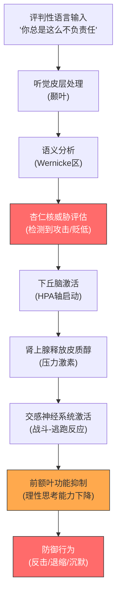
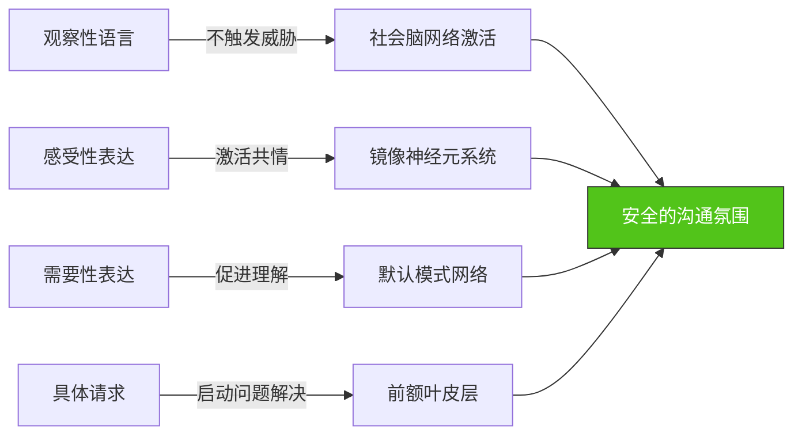
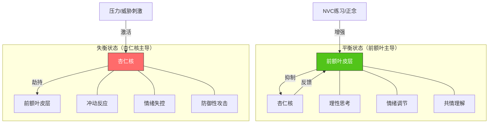
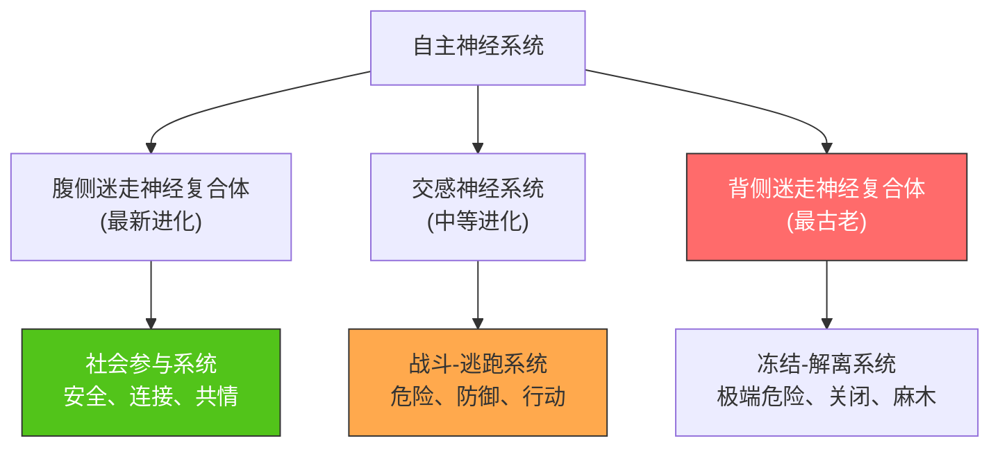

## 七、NVC的神经科学基础

非暴力沟通（NVC）不仅是一套沟通技巧，更是一套与人类神经系统运作机制高度契合的沟通范式。现代神经科学的研究成果，为NVC的有效性提供了坚实的生物学解释。当我们理解大脑如何处理语言、情绪和社交信息时，就能更深刻地理解为什么NVC的四步法（观察、感受、需要、请求）能够产生如此显著的沟通效果。

本节将从神经科学的视角，系统剖析NVC的工作原理，帮助读者从"知其然"走向"知其所以然"。

### 7.1 大脑的威胁检测系统：杏仁核与战斗-逃跑反应

#### 7.1.1 杏仁核的核心功能

杏仁核（Amygdala）是大脑边缘系统的重要组成部分，位于颞叶深处，左右各一个，形状类似杏仁。它是大脑的"威胁检测器"，负责快速评估环境中的潜在威胁，并在检测到危险时启动防御反应。

杏仁核的运作特点是**快而自动**。它不经过意识层面的分析，直接对感官输入做出反应。这种机制在进化上具有重要意义——当原始人类在丛林中遇到猛兽时，没有时间进行理性分析，必须立即做出逃跑或战斗的决定。这种快速反应机制被神经科学家称为"杏仁核劫持"（Amygdala Hijack），由丹尼尔·戈尔曼在其著作《情商》中首次提出。

#### 7.1.2 评判性语言如何触发威胁反应

神经影像学研究揭示了一个重要事实：**语言可以像物理威胁一样激活杏仁核**。当我们听到评判性、指责性或命令性的语言时，大脑的反应模式与面对物理威胁时高度相似。

以下是豺狗语言（评判性、指责性语言）的神经反应链条：

这一反应链条揭示了一个关键问题：**当杏仁核被激活时，前额叶皮层的功能会受到抑制**。前额叶皮层是大脑中负责理性思考、共情理解、情绪调节和长期规划的区域。这意味着，当一个人处于防御状态时，他/她**在生理层面上无法进行有效的沟通和理解**。

这正是马歇尔·卢森堡反复强调"先建立连接，再解决问题"的神经科学依据——如果对方的杏仁核已经被激活，任何理性的讨论都是徒劳的。

#### 7.1.3 皮质醇与压力反应的恶性循环

当杏仁核触发威胁反应后，下丘脑-垂体-肾上腺轴（HPA轴）被激活，导致皮质醇（Cortisol）的大量释放。皮质醇是一种重要的压力激素，短期内它能帮助我们应对威胁，但长期高水平的皮质醇会带来严重的负面影响：

| 影响维度 | 短期效应（急性压力） | 长期效应（慢性压力） |
|---------|-------------------|-------------------|
| 认知功能 | 注意力集中，反应加快 | 记忆力下降，判断力减弱 |
| 情绪状态 | 警觉性提高 | 焦虑、抑郁风险增加 |
| 社交能力 | 短暂的防御性增强 | 共情能力下降，社交退缩 |
| 身体健康 | 免疫力短暂增强 | 免疫系统抑制，慢性炎症 |
| 前额叶功能 | 轻度抑制 | 严重抑制，决策能力下降 |

在长期处于评判性沟通环境中的人身上，皮质醇水平会持续偏高，形成**慢性应激状态**。这种状态下，个体的杏仁核会变得过度敏感——即使面对中性的语言刺激，也会产生威胁感知。这就是为什么长期处于批评性关系中的人会变得"过度敏感"或"容易发火"的神经科学解释。

#### 7.1.4 NVC如何绕过威胁反应

与豺狗语言形成鲜明对比，NVC的四步法从神经科学的角度巧妙地绕过了杏仁核的威胁检测：

**观察（Observation）**——使用客观描述性语言，不包含评判。神经科学研究表明，中性的描述性语言不会激活杏仁核，而是被引导到大脑的"社会脑网络"（Social Brain Network），包括内侧前额叶皮层（mPFC）和颞顶联合区（TPJ），这些区域负责理解他人的意图和心理状态。

**感受（Feeling）**——表达真实的情感。情感词汇的表达能够激活岛叶（Insula），这是大脑中负责内感受（Interoception）的区域，帮助我们觉察自己的身体状态和情绪。同时，表达脆弱性的情感（如"我感到害怕"）能够触发对方的共情反应。

**需要（Need）**——连接到深层的人类需要。当沟通指向普遍的人类需要（如安全、尊重、连接）时，能够激活大脑的默认模式网络（Default Mode Network, DMN），促进自我反思和对他人的理解。

**请求（Request）**——提出具体、可执行的请求。明确的请求激活前额叶皮层的问题解决功能，而不是触发威胁反应。当请求是具体且可选择的时，它不会激活自主权威胁反应。

### 7.2 镜像神经元与共情的神经机制

#### 7.2.1 镜像神经元的发现

1990年代，意大利帕尔马大学的贾科莫·里佐拉蒂（Giacomo Rizzolatti）团队在研究猕猴运动皮层时，意外发现了一类特殊的神经元——当猴子执行某个动作（如抓取食物）时，这些神经元会放电；而当猴子**观察**其他个体执行相同动作时，这些神经元**同样会放电**。这类神经元被命名为"镜像神经元"（Mirror Neurons）。

后续的人类脑成像研究证实，人类大脑中也存在类似的镜像系统，主要分布在：

- **前运动皮层**（Premotor Cortex）：动作理解
- **下顶叶**（Inferior Parietal Lobule）：意图理解
- **脑岛**（Insula）：情绪体验
- **前扣带回**（Anterior Cingulate Cortex）：痛苦体验

#### 7.2.2 镜像神经元如何支持NVC倾听

NVC的核心技能之一是"同理心倾听"（Empathic Listening），即全身心地关注对方，试图理解对方的观察、感受、需要和请求。从神经科学的角度，同理心倾听激活了大脑的镜像神经元系统，产生以下效应：

**动作层面的镜像**：当我们全神贯注地倾听对方时，我们的面部肌肉会微弱地镜像对方的表情。这种无意识的面部模仿会被本体感受器反馈到大脑，帮助我们"感受到"对方的情绪状态。

**情绪层面的镜像**：脑岛中的镜像神经元使我们能够"感同身受"。当我们倾听他人表达痛苦时，我们自己的脑岛和前扣带回也会被激活，产生类似的情绪体验。这种神经层面的"共鸣"是共情的生物学基础。

**意图层面的镜像**：下顶叶的镜像神经元帮助我们理解对方行为背后的意图。在NVC的框架中，这意味着我们能够超越表面的语言，理解对方表达背后的深层需要。

#### 7.2.3 催产素：连接的神经化学基础

催产素（Oxytocin）是一种由下丘脑合成的神经肽，被称为"连接激素"或"信任激素"。它在社交 bonding、信任建立和共情增强中扮演关键角色。

NVC实践中的多个要素能够促进催产素的释放：

| NVC要素 | 神经机制 | 催产素效应 |
|--------|---------|----------|
| 眼神接触 | 激活梭状回面孔区 | 释放催产素，增强连接感 |
| 温和的语调 | 激活颞叶听觉皮层 | 降低皮质醇，增加信任 |
| 表达脆弱性 | 激活脑岛和前扣带回 | 触发保护和关怀反应 |
| 积极倾听 | 镜像神经元系统激活 | 增强双方的情感连接 |
| 非评判态度 | 降低杏仁核激活 | 减少防御，促进开放 |

催产素的效应是双向的——它不仅增强倾听者的共情能力，也使说话者感到更安全、更愿意敞开。这种正向循环是NVC能够快速建立信任关系的神经化学基础。

#### 7.2.4 共情疲劳与"同理心陷阱"

然而，神经科学也揭示了共情的一个重要限制：**共情疲劳**（Empathy Fatigue）或"同理心陷阱"。

当我们持续地、深度地感受他人的痛苦时，大脑的前扣带回和脑岛会持续激活，导致类似"同情疲劳"的状态。这在助人职业（心理咨询师、医护人员、社工）中尤为常见。

NVC对此有独特的应对机制。马歇尔·卢森堡区分了两种"同理心"：

- **同在的同理心**（Empathic Presence）：只是陪伴和理解，不吸收对方的痛苦。这种状态激活的是前额叶皮层的"心智化"（Mentalizing）功能，而不是脑岛的痛苦体验功能。
- **创伤性共鸣**（Traumatic Resonance）：过度代入对方的痛苦，导致自身的情绪耗竭。这种状态会过度激活杏仁核和应激系统。

NVC训练的核心技能之一，就是学会保持"同在的同理心"，避免陷入"创伤性共鸣"。这需要持续的正念练习和自我觉察能力。

### 7.3 前额叶皮层与情绪调节

#### 7.3.1 前额叶皮层的核心功能

前额叶皮层（Prefrontal Cortex, PFC）是人类大脑中最发达的区域，占大脑皮层总面积的约29%。它是"执行功能"的神经基础，负责：

- **工作记忆**：在脑中保持和操作信息
- **认知灵活性**：在不同任务和思维模式之间切换
- **抑制控制**：抑制冲动反应，选择更适当的反应
- **情绪调节**：调节杏仁核等边缘系统的活动
- **社会认知**：理解他人的心理状态和意图
- **决策规划**：评估选项，制定长期计划

在NVC的语境中，前额叶皮层的功能至关重要。它使我们能够：

1. 在感受到情绪冲动时，暂停自动化反应
2. 将注意力从"对方做了什么"转向"对方需要什么"
3. 选择符合价值观的回应方式，而不是被情绪驱动
4. 理解对方的立场，即使我们不同意

#### 7.3.2 前额叶-杏仁核的动态平衡

神经科学研究表明，前额叶皮层和杏仁核之间存在一种动态的"跷跷板"关系：

当我们处于压力或威胁状态时，杏仁核的活动会增强，前额叶皮层的功能会被抑制——这被称为"自上而下的控制失败"。相反，当我们感到安全、放松时，前额叶皮层能够有效地调节杏仁核的活动，保持理性思考和情绪调节的能力。

NVC的核心价值之一，就是帮助我们**维持前额叶皮层的活跃状态**。通过练习观察而不评判、表达感受而非指责、连接需要而非要求，我们实际上在训练前额叶皮层的"情绪调节肌肉"。

#### 7.3.3 神经可塑性：NVC如何重塑大脑

神经可塑性（Neuroplasticity）是指大脑根据经验改变其结构和功能的能力。这一特性意味着，**NVC的持续练习可以在物理层面改变大脑的神经连接**。

关键的神经可塑性研究发现：

**髓鞘化增强**：当我们反复练习某种技能时，相关神经通路的髓鞘（Myelin Sheath）会增厚，提高信号传导速度。NVC练习者在经过持续训练后，前额叶皮层与边缘系统之间的连接会变得更加高效。

**突触强化**：赫布定律（Hebb's Law）指出，"一起放电的神经元会连接在一起"（Neurons that fire together, wire together）。当我们反复练习NVC的四步法时，观察-感受-需要-请求的神经通路会变得越来越强，最终形成自动化的反应模式。

**灰质密度增加**：长期冥想练习者的研究显示，前额叶皮层、脑岛和海马体的灰质密度显著增加。这些区域正是NVC实践所依赖的核心脑区。

**杏仁核反应性降低**：研究表明，持续的正念练习可以降低杏仁核的基线活动水平和反应性，使我们更不容易被触发防御反应。

这意味着，NVC不仅仅是一套"技巧"，而是一种**大脑重塑训练**。随着练习的深入，NVC的思维方式会从"刻意使用"变成"自然而然"，因为相关的神经通路已经被强化到自动化的程度。

### 7.4 多迷走神经理论与NVC的安全感

#### 7.4.1 波格斯的多迷走神经理论

斯蒂芬·波格斯（Stephen Porges）提出的多迷走神经理论（Polyvagal Theory）是理解NVC神经科学基础的重要框架。该理论揭示了自主神经系统（ANS）的三层结构，每一层对应不同的社交和生存状态：

**腹侧迷走神经复合体（Ventral Vagal Complex）**：这是最进化的神经通路，支持社会参与行为——面部表情、语调变化、眼神接触、积极倾听。当我们处于"腹侧迷走状态"时，我们感到安全、开放、有连接感。这正是NVC希望创造的沟通状态。

**交感神经系统（Sympathetic Nervous System）**：当感知到威胁时，交感神经系统被激活，启动战斗或逃跑反应。这是豺狗语言触发的主要神经通路。

**背侧迷走神经复合体（Dorsal Vagal Complex）**：当威胁过于强烈或无法逃避时，背侧迷走神经系统被激活，导致冻结、解离或情感关闭。这是长期处于评判性沟通环境中可能出现的状态——个体变得情感麻木、"什么都无所谓了"。

#### 7.4.2 神经觉（Neuroception）：无意识的安全评估

波格斯提出了一个关键概念：**神经觉**（Neuroception）。它是指大脑在意识觉察之前，对环境进行的安全/危险评估。这种评估是自动的、无意识的，基于以下线索：

**安全线索**（激活腹侧迷走系统）：
- 温和的语调
- 开放的面部表情
- 适当的眼神接触
- 身体姿态的放松
- 节奏稳定的话语

**危险线索**（激活交感系统）：
- 尖锐或提高的语调
- 皱眉、咬牙等面部表情
- 死盯或回避眼神
- 身体前倾或紧绷
- 语速过快或过慢

**生命威胁线索**（激活背侧迷走系统）：
- 长期的、无法逃避的威胁
- 情感忽视或虐待
- 极端的孤立和排斥

NVC的实践与多迷走神经理论高度契合。NVC强调的"连接先于内容"原则，本质上是在确保对方的**神经觉**将沟通环境评估为"安全"，从而激活腹侧迷走系统（社会参与系统），而不是交感系统（战斗-逃跑）或背侧迷走系统（冻结-关闭）。

#### 7.4.3 "社会参与系统"的NVC应用

波格斯将腹侧迷走神经复合体称为"社会参与系统"（Social Engagement System），它包括以下神经通路：

- **面部神经（CN VII）**：控制面部表情，传达情感信号
- **三叉神经（CN V）**：感知面部触觉，调节中耳肌肉
- **舌咽神经（CN IX）**：控制咽部肌肉，影响语调
- **迷走神经（CN X）**：调节心率、呼吸，影响声音的韵律

在NVC实践中，以下要素直接激活社会参与系统：

1. **语调调节**：NVC强调使用温和、平稳的语调。这直接通过舌咽神经和迷走神经，向对方的神经觉发送"安全"信号。

2. **面部表情**：NVC的同理心倾听要求保持开放、接纳的面部表情。面部表情通过面部神经被对方的大脑快速识别，影响其神经觉评估。

3. **呼吸节奏**：深而平稳的呼吸不仅帮助自己保持平静，还通过迷走神经影响对方——人类的呼吸节律会无意识地同步。

4. **身体姿态**：开放的身体姿态（面向对方、手臂放松）是社会参与系统的重要输入，有助于建立安全的沟通氛围。

### 7.5 默认模式网络与自我觉察

#### 7.5.1 默认模式网络的发现

默认模式网络（Default Mode Network, DMN）是大脑在"休息状态"下活跃的神经网络，包括内侧前额叶皮层（mPFC）、后扣带回皮层（PCC）、楔前叶（Precuneus）和颞顶联合区（TPJ）。

DMN最初被认为是大脑的"背景噪音"，但后续研究发现它在以下功能中扮演核心角色：

- **自我反思**：思考自己的想法、感受和经历
- **心理理论**：理解他人的心理状态和意图
- **自传体记忆**：回忆个人经历和人生叙事
- **未来想象**：规划和想象未来的场景
- **道德推理**：评估行为的道德含义

#### 7.5.2 DMN与NVC的"需要"层次

NVC的第三步——连接需要（Need）——与DMN的功能高度相关。当我们问自己"我真正需要什么"或"对方真正需要什么"时，我们实际上在激活DMN的多个子网络：

- **内侧前额叶皮层**：自我反思，识别自己的内在状态
- **颞顶联合区**：心理理论，推测对方的需要和意图
- **后扣带回皮层**：整合自我和他人的信息，形成整体理解

研究表明，DMN的活跃程度与共情能力正相关。经常进行自我反思练习的人，其DMN的神经连接更加发达，能够更准确地识别自己和他人的需要。

#### 7.5.3 DMN的两面性：健康反思vs.反刍思维

需要注意的是，DMN也与**反刍思维**（Rumination）有关——即反复纠缠于负面想法和情绪。反刍思维与抑郁、焦虑等心理健康问题密切相关。

NVC提供了一种健康的DMN激活模式：

| 反刍思维模式 | NVC反思模式 |
|------------|-----------|
| "他怎么能这样对我？" | "我的什么需要没有被满足？" |
| "都是我的错" | "我当时的感受和需要是什么？" |
| "他永远不会改变" | "他的行为背后可能有什么需要？" |
| "这太不公平了" | "我如何表达我的需要，同时尊重他的需要？" |

关键区别在于：反刍思维是**评判性的、循环的、无出路的**；而NVC反思是**好奇的、探索性的、指向行动的**。从神经科学的角度，反刍思维会激活与自我批评相关的脑区（如膝下前扣带回），而NVC反思则激活与自我关怀和问题解决相关的脑区（如腹内侧前额叶皮层和背外侧前额叶皮层）。

### 7.6 神经整合：NVC如何创造"全脑"沟通

#### 7.6.1 丹尼尔·西格尔的神经整合模型

丹尼尔·西格尔（Daniel Siegel）提出的"心智"（Mindsight）和"神经整合"（Neural Integration）理论，为理解NVC的深层机制提供了重要框架。西格尔认为，心理健康的核心是**整合**——大脑不同区域之间的协调连接。

整合包括多个维度：

- **左右脑整合**：逻辑思维（左脑）与情感体验（右脑）的协调
- **上下脑整合**：脑干和边缘系统（下层）与皮层（上层）的协调
- **记忆整合**：将过去的经历转化为连贯的人生叙事
- **人际整合**：在关系中保持自我与连接的平衡

NVC的四步法恰好覆盖了这些整合维度：

| NVC步骤 | 整合维度 | 神经机制 |
|--------|---------|---------|
| 观察 | 左右脑整合 | 左脑的客观描述 + 右脑的整体感知 |
| 感受 | 上下脑整合 | 脑干的身体信号 + 皮层的情感标签 |
| 需要 | 记忆整合 | 连接过去经验与当前需要 |
| 请求 | 人际整合 | 表达自我需要 + 考虑他人需要 |

#### 7.6.2 "全脑"沟通状态

当NVC被熟练运用时，大脑会进入一种高度整合的状态，西格尔称之为"FORES"状态：

- **F**lexible（灵活的）：能够适应不同的沟通情境
- **O**pen（开放的）：对新信息和不同观点保持开放
- **R**esilient（有韧性的）：能够从沟通挫折中恢复
- **E**nergized（有活力的）：充满能量和热情
- **S**table（稳定的）：情绪稳定，不被轻易触发

在这种状态下，大脑的各个区域能够高效协作：前额叶皮层提供理性和远见，边缘系统提供情感深度，脑干提供基本的生存智慧，镜像神经元系统提供共情能力。这种全脑协作正是NVC追求的理想沟通状态。

### 7.7 正念、冥想与NVC的神经基础

#### 7.7.1 正念练习的神经效应

正念（Mindfulness）与NVC的结合已经被广泛研究。正念练习对大脑的影响可以从多个层面理解：

**灰质密度变化**：哈佛大学萨拉·拉扎尔（Sara Lazar）团队的研究发现，8周正念减压训练（MBSR）后，参与者的以下脑区灰质密度显著增加：

- **海马体**（记忆和学习中心）
- **颞顶联合区**（共情和心理理论）
- **脑岛**（内感受和自我觉察）
- **前扣带回**（注意和自我调节）

**白质连接增强**：正念练习增强了前额叶皮层与边缘系统之间的白质连接，使得"自上而下"的情绪调节更加高效。

**杏仁核反应性降低**：多项研究证实，正念练习者在面对负面刺激时，杏仁核的激活程度更低，恢复速度更快。

#### 7.7.2 NVC中的正念实践

NVC的实践本身就包含正念的要素，但可以更系统地结合：

**觉察暂停（Pause Practice）**：在回应之前，暂停3-5秒，觉察自己的身体感受、情绪状态和冲动。这个简单的暂停，给了前额叶皮层时间来调节杏仁核的反应。

**身体扫描（Body Scan）**：在沟通前或沟通中，快速扫描身体，觉察紧张、不适或放松的区域。身体信号是感受的重要来源——脑岛通过内感受系统持续监测身体状态。

**呼吸锚定（Breath Anchor）**：将注意力放在呼吸上，特别是呼气时。延长呼气可以激活迷走神经的副交感功能，帮助从交感激活状态切换到腹侧迷走状态。

**慈悲冥想（Loving-Kindness Meditation）**：向自己和他人发送善意和祝福。研究表明，慈悲冥想能够增强前脑岛和颞顶联合区的活动，提高共情能力和亲社会行为。

#### 7.7.3 神经科学支持的NVC练习方案

基于神经科学研究，以下练习方案被证实能够有效增强NVC的神经基础：

**基础练习（每天10-15分钟）**：

1. **晨间正念呼吸**（5分钟）：专注于呼吸，每次走神时温柔地将注意力带回。这训练前额叶皮层的注意力控制功能。

2. **身体感受觉察**（5分钟）：从头到脚扫描身体，觉察每个部位的感受。这增强脑岛的内感受功能，提高感受识别能力。

3. **慈悲短语**（5分钟）：默念"愿我平安，愿我快乐，愿我健康，愿我自在"，然后扩展到他人。这激活慈悲相关的神经通路。

**进阶练习（每天20-30分钟）**：

1. **同理心倾听练习**：与伙伴进行10分钟的倾听练习，专注于不评判、不建议、只是理解。这训练镜像神经元系统和社会脑网络。

2. **NVC四步法冥想**：回顾最近的一次沟通，用NVC的四步法重新分析——观察发生了什么、感受是什么、需要是什么、请求是什么。这整合DMN和执行控制网络。

3. **角色互换练习**：想象自己是对方，尝试理解对方的观察、感受、需要和请求。这激活颞顶联合区的心理理论功能。

### 7.8 神经科学视角下的NVC常见误区

#### 7.8.1 "NVC压抑真实情感"

**神经科学的纠正**：NVC不是压抑情感，而是改变情感表达的神经通路。压抑情感需要持续的认知努力，消耗前额叶皮层的资源，最终导致"自我损耗"（Ego Depletion）。而NVC是将情感从杏仁核驱动的自动化反应，转化为前额叶参与的有意图表达。这种转变不是压抑，而是**升级**——从低级的、反射性的情感反应，升级到高级的、整合性的情感表达。

#### 7.8.2 "NVC让人变得软弱"

**神经科学的纠正**：NVC实际上增强了前额叶皮层的功能，这是大脑中最复杂、最需要勇气的区域。能够暂停自动化反应、选择符合价值观的回应方式，需要的是更多的神经资源和更强的自控力，而不是更少。神经影像学研究显示，情绪调节能力强的人，其前额叶皮层的灰质密度更高，这与"软弱"恰恰相反。

#### 7.8.3 "NVC在高冲突场景中无效"

**神经科学的纠正**：高冲突场景意味着双方的杏仁核都被高度激活，前额叶功能被严重抑制。在这种情况下，任何沟通策略都会面临挑战——不仅仅是NVC。但NVC的独特优势在于，它提供了**具体的神经调节技术**（观察而不评判、表达感受而非指责），这些技术被证实能够降低杏仁核激活水平，恢复前额叶功能。在高冲突场景中，NVC不是"无效"，而是需要更多的练习和更熟练的运用。

#### 7.8.4 "NVC只适用于西方文化"

**神经科学的纠正**：NVC所基于的神经机制是**人类共有的**，不受文化影响。杏仁核的威胁反应、镜像神经元的共情功能、前额叶的情绪调节、催产素的社会连接效应——这些神经机制在全球所有人类中都是相同的。虽然不同文化对情感表达有不同的规范，但NVC的基本原则——观察而非评判、连接需要而非表面立场——具有跨文化的神经基础。

### 7.9 实践应用：基于神经科学的NVC工作坊设计

#### 7.9.1 神经科学导向的NVC培训要点

理解NVC的神经科学基础，对NVC培训和教练工作有重要启示：

1. **安全第一**：根据多迷走神经理论，培训环境必须首先激活参与者的社会参与系统。这意味着：温和的语调、开放的姿态、明确的规则（如保密、不评判）、渐进式的深度。

2. **身体参与**：神经科学强调"具身认知"（Embodied Cognition）——认知不仅发生在大脑中，也发生在身体中。NVC培训应包含身体练习，如呼吸觉察、身体扫描、姿态调整。

3. **重复练习**：神经可塑性需要重复。NVC技能的掌握不是一次性的"顿悟"，而是持续的、渐进的神经通路强化。培训应设计足够的重复练习机会。

4. **及时反馈**：大脑的学习依赖于及时的反馈。培训中的角色扮演、小组练习应提供即时的、具体的反馈，帮助参与者调整自己的NVC实践。

5. **渐进挑战**：神经通路的强化遵循"用进废退"原则。培训应从中性场景开始，逐步增加到更具挑战性的场景，让参与者的"情绪调节肌肉"得到渐进式的锻炼。

#### 7.9.2 团队应用：基于神经科学的NVC工作坊流程

一个2小时的NVC神经科学工作坊可以这样设计：

**第一部分：建立安全（20分钟）**
- 欢迎和介绍（激活社会参与系统）
- 呼吸练习（调节自主神经系统）
- 分享期望（建立心理安全感）

**第二部分：神经科学基础（30分钟）**
- 杏仁核劫持的演示（让参与者体验威胁反应）
- 前额叶功能的体验练习
- NVC四步法的神经机制讲解

**第三部分：体验练习（40分钟）**
- 观察vs评判的语言练习
- 感受词汇的身体觉察练习
- 需要连接的DMN激活练习
- 请求vs命令的神经反应对比

**第四部分：整合与应用（30分钟）**
- 小组分享体验
- 制定个人NVC练习计划
- 闭幕和祝福（强化社会连接）

### 7.10 延伸阅读与研究资源

#### 7.10.1 推荐学术文献

1. **Porges, S. W. (2011).** *The Polyvagal Theory: Neurophysiological Foundations of Emotions, Attachment, Communication, and Self-Regulation.* W. W. Norton & Company.
   - 多迷走神经理论的经典著作，详细阐述了自主神经系统与社交行为的关系。

2. **Siegel, D. J. (2010).** *Mindsight: The New Science of Personal Transformation.* Bantam Books.
   - 丹尼尔·西格尔关于神经整合和心智化的重要著作。

3. **Davidson, R. J., & Begley, S. (2012).** *The Emotional Life of Your Brain.* Hudson Street Press.
   - 关于情绪风格和大脑可塑性的神经科学研究。

4. **Lieberman, M. D. (2013).** *Social: Why Our Brains Are Wired to Connect.* Crown Publishers.
   - 关于社会脑网络和人类连接需要的神经科学著作。

5. **van der Kolk, B. (2014).** *The Body Keeps the Score: Brain, Mind, and Body in the Healing of Trauma.* Viking.
   - 关于创伤如何影响大脑和身体的重要著作，对理解NVC在创伤恢复中的应用有重要参考价值。

#### 7.10.2 神经科学与沟通的前沿研究方向

- **超扫描技术**（Hyperscanning）：同时扫描两个互动中的人的大脑，研究"脑间同步"（Brain-to-Brain Coupling）现象，可能为NVC的"连接"概念提供新的神经科学证据。

- **肠脑轴**（Gut-Brain Axis）：肠道微生物群如何通过迷走神经影响情绪和社交行为，可能为NVC强调的"身体感受"提供新的科学解释。

- **表观遗传学**（Epigenetics）：NVC实践如何通过神经可塑性改变基因表达，影响下一代的社交能力发展。

### 7.11 本节小结

非暴力沟通的每一个核心要素——观察、感受、需要、请求——都与特定的神经机制相对应。NVC的有效性不仅来自沟通技巧层面，更来自它与人类大脑运作方式的深度契合：

- **观察而非评判**：避免激活杏仁核的威胁反应，保持前额叶的理性功能
- **表达感受**：激活脑岛的内感受系统，促进自我觉察和情感连接
- **连接需要**：激活默认模式网络，促进深层理解和自我反思
- **具体请求**：启动前额叶的问题解决功能，避免触发自主权威胁

从神经科学的视角来看，NVC的练习是一种**大脑重塑训练**。通过持续的练习，我们可以在物理层面改变大脑的神经连接，使NVC的思维方式成为自然而然的反应模式。

更重要的是，NVC所创造的沟通状态——安全、开放、连接、共情——正是人类大脑最优化的工作状态。在这种状态下，前额叶皮层能够发挥最大效能，镜像神经元系统能够充分激活，催产素能够自由流动，整个大脑进入高度整合的"全脑"状态。

这也许就是NVC最深刻的智慧：**它不是在教我们一种新的沟通技巧，而是在帮助我们回到大脑最自然、最健康的工作状态**。在这种状态下，连接和理解不是需要努力维持的目标，而是自然而然发生的过程。

神经科学为NVC提供了坚实的生物学基础，但最终，NVC的价值在于实践——在于每一次真实的沟通中，我们选择用观察代替评判，用感受代替指责，用需要代替立场，用请求代替要求。每一次这样的选择，都在重塑我们的大脑，也在重塑我们的关系和世界。

