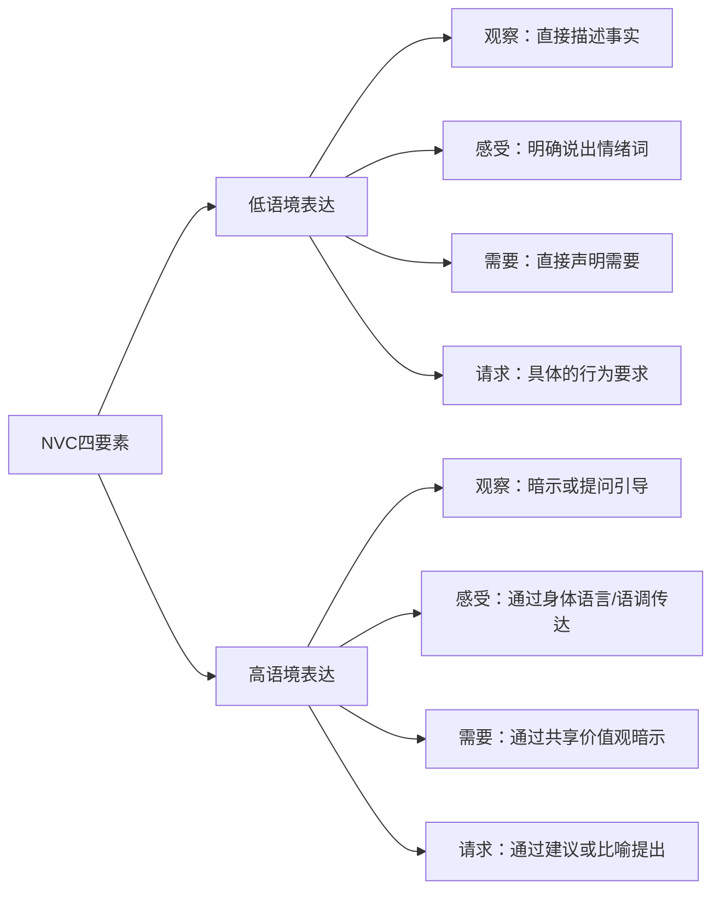
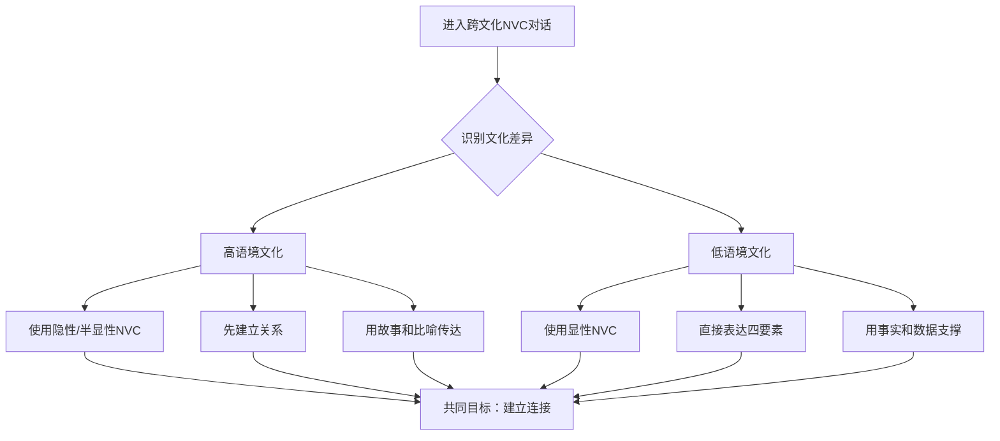

## 八、NVC的文化适应性

非暴力沟通诞生于美国加州，根植于西方人本主义心理学传统。但人类的情感和需要是跨文化的——日本人会感到羞耻，巴西人会感到愤怒，中国人会感到委屈，德国人会感到失望，这些感受的背后都是未被满足的需要。问题不在于NVC是否适用于不同文化，而在于如何让NVC的四要素在不同的文化编码系统中正确"解码"。

本节将系统探讨NVC在不同文化背景下的适应性调整，提供可操作的跨文化沟通框架，并深入分析中国文化语境中的特殊策略。

### 8.1 文化维度理论：理解差异的底层框架

#### 8.1.1 霍夫斯泰德文化维度与NVC的关系

荷兰社会心理学家吉尔特·霍夫斯泰德（Geert Hofstede）提出的六维文化模型，为理解NVC的文化适应性提供了系统性框架。每个维度都直接影响NVC四要素的表达方式。

| 文化维度 | 定义 | 高分文化代表 | 低分文化代表 | 对NVC的影响 |
|---------|------|------------|------------|------------|
| 权力距离（PDI） | 对权力不平等的接受程度 | 中国、马来西亚、菲律宾 | 丹麦、以色列、新西兰 | 决定观察和请求的表达方式 |
| 个人主义/集体主义（IDV） | 个人利益vs群体利益的优先级 | 美国、澳大利亚、英国 | 中国、韩国、哥伦比亚 | 决定需要表达的参照框架 |
| 男性化/女性化（MAS） | 竞争导向vs关怀导向 | 日本、匈牙利、意大利 | 瑞典、挪威、荷兰 | 决定感受表达的接受度 |
| 不确定性规避（UAI） | 对模糊和未知的容忍度 | 希腊、葡萄牙、日本 | 新加坡、丹麦、瑞典 | 决定请求的明确程度 |
| 长期导向/短期导向（LTO） | 对未来vs当下的侧重 | 中国、日本、韩国 | 美国、尼日利亚、巴基斯坦 | 决定NVC策略的时间维度 |
| 放纵/克制（IVR） | 对欲望满足的态度 | 墨西哥、哥伦比亚、瑞典 | 中国、俄罗斯、埃及 | 决定感受表达的开放程度 |

这些维度不是非此即彼的标签，而是影响沟通风格的连续谱系。一个在美国生活十年的中国人，其文化维度可能已经发生了显著偏移。NVC实践者需要感知的是**对方当前的文化编码**，而非刻板地套用国籍标签。

#### 8.1.2 高语境与低语境沟通

人类学家爱德华·霍尔（Edward T. Hall）提出的高/低语境沟通理论，是理解NVC文化适应性的关键视角。

**低语境文化**（美国、德国、北欧）：
- 信息主要通过语言本身传递
- 沟通风格直接、明确
- NVC的四要素可以直接、显性地表达
- "我感到焦虑，因为我需要确定性" 在低语境文化中是自然的

**高语境文化**（中国、日本、阿拉伯国家）：
- 信息主要通过语境、关系、非语言线索传递
- 沟通风格含蓄、间接
- NVC的四要素需要通过间接方式传达
- 同样的内容，高语境文化可能需要通过故事、比喻、沉默来表达

理解这个光谱的意义在于：**NVC的目标不变（建立连接），但达成目标的路径需要根据文化语境调整**。

### 8.2 中国文化语境下的NVC深度适应

#### 8.2.1 面子机制的运作原理

"面子"不是简单的虚荣心，而是一个精密的社会信用系统。社会学家胡先缙将中国人的"面子"区分为两个层次：

- **脸（liǎn）**：社会对个人道德品格的信任，失去则难以恢复
- **面子（miànzi）**：社会对个人成就和地位的认可，可以通过努力获得

这个区分对NVC实践至关重要。当NVC的表达方式可能威胁到对方的"脸"时（暗示对方道德有问题），冲突程度远高于仅威胁"面子"（暗示对方能力不足）。NVC的适应策略需要同时保护这两个层次。

**威胁"脸"的表达**（应避免）：
> "你说话不算话，答应的事总是做不到。" → 暗示对方品格有问题

**威胁"面子"的表达**（风险较低）：
> "这次的进度比计划慢了三天。" → 指向能力/效率，不指向品格

**NVC适应版**：
> "上周我们约定周五提交方案（观察），目前看到的是周三才完成初稿（观察），我有些担心后续环节的时间（感受），因为我需要对整个项目的节奏有信心（需要），我们能一起看看哪些环节可以优化吗（请求）？"

这个版本的特点：观察基于具体事实而非品格评判，感受指向自己的担忧而非对方的过失，请求是协作式而非追责式。

#### 8.2.2 "关系本位"下的需要表达策略

中国文化是"关系本位"的——个体需要的正当性往往需要通过关系框架来确认。直接说"我需要个人空间"在中国文化中可能被理解为"你不想跟我亲近"，而在西方文化中则是健康的自我表达。

**策略一：关系锚定法**

在表达个人需要之前，先确认关系的价值：

| 西方NVC表达 | 中国适应版 |
|------------|-----------|
| "我需要独处的时间。" | "我很珍惜我们在一起的时间。同时我发现，当我有安静思考的空间后，和你在一起时会更有质量。你愿意支持我每周有几个小时的独处时间吗？" |
| "我需要你尊重我的决定。" | "我知道你是因为关心才给建议，这份心意我很感激。我也有一个需要想和你分享——在做重大决定时，我需要有机会自己思考和承担。你能在给我建议的同时，也给我一些自己决定的空间吗？" |
| "你的批评让我很受伤。" | "我知道你是希望我变得更好，这份期待我理解。当听到比较直接的反馈时，我内心会有些波动，因为我需要先消化一下。你愿意在给我反馈时，先说说你觉得我做得好的地方吗？" |

**策略二：集体需要框架**

在集体主义文化中，将个人需要包装为集体需要更容易被接受：

- 个人版："我需要学习新技能。" → 可能被理解为"不满足现状"
- 集体版："我想学习一些新方法，这样我们团队的效率可以进一步提升。"

注意：这不是说谎或操控，而是选择一个对方文化编码系统中更易接受的表达框架。真实的需要（成长和发展）并没有改变，只是翻译方式不同。

#### 8.2.3 含蓄文化的渐进式NVC实践

中国文化偏好含蓄表达，这与NVC鼓励的"直接表达感受和需要"存在表面张力。但深入理解会发现，含蓄不是NVC的对立面，而是NVC的一种高级形态——当关系信任度足够高时，NVC的四要素可以通过一个眼神、一杯茶、一次沉默来传达。

**渐进式NVC的三个阶段**：

**阶段一：隐性NVC（关系初期）**

不使用NVC的术语和显性结构，但内核是非暴力的：

> 传统方式："你怎么又忘了接孩子？"
> 隐性NVC："今天孩子在幼儿园等了半个小时。"（只提供观察，不评判，给对方空间自己体会）

这种方式甚至不说出感受和需要，但通过只提供事实观察而非评判，就已经在实践NVC的核心精神。

**阶段二：半显性NVC（关系中期）**

使用NVC的部分要素，但不按标准格式排列：

> "我注意到最近几次约好的事情都改了时间（观察），是不是你那边确实太忙了（邀请对方表达需要）？我这边也有调整的空间（表达自己的灵活性），我们一起重新安排一下？（请求）"

**阶段三：显性NVC（关系成熟期）**

当双方都有NVC基础时，可以更直接地使用四步法：

> "我想跟你聊聊最近的一件事。上周你三次改了我们的约会时间（观察），我感到有些失落（感受），因为我需要确定感和被重视（需要）。你能告诉我你的实际情况吗？我们一起找到对双方都好的方式（请求）。"

这个渐进路径的关键原则：**NVC的目标（连接和理解）不变，但表达的显性程度需要匹配关系的信任度和对方的文化舒适区**。

#### 8.2.4 等级关系中的NVC策略

中国文化中的权力距离指数较高（PDI=80，美国=40），这意味着在面对上级、长辈时，NVC的表达方式需要特殊调整。

**向上沟通的NVC适应原则**：

1. **观察部分：用"请教"替代"指出"**
   - 标准版："这个方案的数据有三处错误。"
   - 适应版："在核对方案数据时，有几个地方我不太确定，想请教一下。"

2. **感受部分：用"困惑"替代"不满"**
   - 标准版："这个决定让我感到不安。"
   - 适应版："关于这个方向，我有一些思考想和您分享，不确定是不是我理解有偏差。"

3. **需要部分：用"团队目标"替代"个人需要"**
   - 标准版："我需要更多的自主权。"
   - 适应版："如果在执行层面有一些灵活度，我觉得能更好地实现您设定的目标。"

4. **请求部分：用"选择题"替代"问答题"**
   - 标准版："您能给我更多自主权吗？"
   - 适应版："关于执行方式，我准备了A和B两个方案，您看哪个更合适？或者您有其他想法？"

**向下沟通的NVC注意点**：

作为上级使用NVC时，要特别注意：
- 你的"请求"对下属来说可能更接近"要求"，因为权力不对等
- 需要额外创造安全空间，让下属知道表达不同意见是被欢迎的
- 感受表达要适度——上级过多表达负面感受可能让下属过度紧张

> 经理："上周的项目延期了三天（观察），我想了解过程中遇到了什么困难（邀请下属表达），而不是直接讨论责任。你觉得哪些环节可以改进？（协作式请求）"

### 8.3 其他主要文化区的NVC适应

#### 8.3.1 日本文化：间接中的精确

日本是典型的高语境、高不确定性规避文化。日本人不直接说"不"，但会通过"ちょっと…"（有点…）等模糊表达传达拒绝。NVC在日本的应用需要特别注意：

**感受表达的调整**：
日本文化对直接表达强烈情感感到不适。可以使用"気になります"（我在意/挂心）这样柔和的感受表达，替代直白的"我感到愤怒"。

**观察表达的精确化**：
日本文化高度重视精确性（高不确定性规避），这意味着NVC的观察步骤需要特别精确，使用具体数据和时间点，避免任何模糊性。

**请求的间接化**：
日本文化中，直接请求可能被视为施压。更有效的方式是描述困难，让对方主动提出帮助："最近这个项目的某个部分让我有些困惑"比"你能帮我处理这个部分吗"更符合日本文化习惯。

#### 8.3.2 中东/阿拉伯文化：关系先行

阿拉伯文化是高度关系导向的。在进入NVC对话之前，需要投入大量时间建立个人关系（喝茶、寒暄、询问家庭）。跳过关系建设直接进入"观察-感受-需要"会被视为粗鲁。

**NVC的关系前置**：
在中东文化中使用NVC，前15-30分钟的寒暄不是浪费时间，而是NVC"连接"本质的体现。当关系建立后，阿拉伯文化对情感表达的接受度其实很高——哭、大声表达感受都是可以的，只要发生在关系信任的基础上。

#### 8.3.3 北欧文化：低语境中的平等

北欧文化（瑞典、挪威、丹麦）是低语境、低权力距离、高女性化文化。NVC在北欧的适应相对简单，因为文化本身就鼓励：
- 直接而礼貌的表达
- 重视共识和协商
- 接受情感表达
- 不强调等级差异

但需要注意：北欧文化中的"詹代法则"（Janteloven）——"不要认为你比别人特殊"——可能导致人们不习惯表达独特的个人需要。在北欧使用NVC时，将个人需要与集体福利关联会更自然。

#### 8.3.4 拉丁美洲文化：热情中的NVC

拉丁美洲文化通常具有高语境、高情感表达、关系导向的特点。巴西、墨西哥等文化中，人们习惯于热烈的肢体语言和情感外露。NVC在这些文化中的挑战不在于"如何表达感受"，而在于"如何不把情绪发泄当作感受表达"。

**关键区分**：拉丁文化中的"大声争论"不等于暴力沟通，有时只是激情的表达方式。NVC的适应重点是帮助人们区分"激情表达"和"评判攻击"，而非要求所有人像北欧人一样冷静。

### 8.4 跨文化NVC应用的系统框架

#### 8.4.1 文化感知四步法

在跨文化场景中应用NVC之前，先完成文化感知的准备工作：

**第一步：识别文化维度差异**
- 对方文化在权力距离、个人/集体主义、高/低语境等维度上处于什么位置？
- 这些差异会如何影响对方对"直接表达感受"的接受度？

**第二步：调整表达的显性程度**
- 低语境文化 → 显性NVC（直接说出四要素）
- 高语境文化 → 隐性NVC（通过暗示、提问、故事传达）

**第三步：调整观察的精确度**
- 高不确定性规避文化 → 需要非常具体的观察（数据、时间、行为）
- 低不确定性规避文化 → 可以接受概括性描述

**第四步：调整请求的直接程度**
- 低权力距离文化 → 可以直接请求
- 高权力距离文化 → 用建议、选择题、邀请替代直接请求

#### 8.4.2 NVC四要素的跨文化翻译矩阵

| NVC要素 | 低语境/低权力距离 | 高语境/高权力距离 | 适应原则 |
|---------|-----------------|-----------------|---------|
| 观察 | "上周你三次迟到" | "最近大家都注意到出勤有些波动" | 从个体指向转向情境描述 |
| 感受 | "我感到失望" | "这个情况让我有些在意" | 从强烈情感词转向温和状态词 |
| 需要 | "我需要可靠性" | "我们团队需要稳定的节奏" | 从个人需要转向集体需要 |
| 请求 | "你能在9点前到吗" | "早会的时间是否需要调整" | 从行为要求转向方案讨论 |

#### 8.4.3 混合文化场景的处理

现实中的跨文化沟通往往是混合的——一个在美国工作十年的中国经理，一个在中国留学三年的德国工程师，一个嫁到日本的巴西妻子。在这些混合文化场景中：

1. **观察对方的实际反应**，而非假设其文化属性
2. **使用"文化试探"**：先用中等直接程度的NVC表达，观察对方反应，再决定是调高还是调低直接程度
3. **直接谈论文化差异**："我发现我习惯直接说感受，不确定这种方式对你是否舒适。你觉得怎样的沟通方式最好？"——这本身就是一次NVC式的沟通

### 8.5 特殊场景的文化适应

#### 8.5.1 跨国团队会议

跨国团队中，成员来自不同文化背景，NVC表达的直接程度难以统一。

**双层策略**：
- **会议中**：使用相对低语境、中等直接程度的NVC，确保信息传递效率
- **会后**：根据个别成员的文化偏好，进行一对一的深度NVC对话

**具体模板**：

> 会议中（适合混合文化团队）：
> "在刚才的讨论中，我注意到我们对项目优先级有不同的看法（观察）。我想确认一下，大家的核心关切是什么？（邀请表达需要）我们可以在会后针对各自关切的部分做更深入的讨论。（请求）"

#### 8.5.2 代际文化差异

即使在同一文化中，不同代际之间的沟通风格也有显著差异。中国80后、90后、00后的表达方式差异巨大：

| 代际 | 沟通特征 | NVC适应策略 |
|------|---------|------------|
| 60后/70后 | 含蓄、重视集体、关注实际 | 用"我们"框架，强调实际利益，避免过度暴露情感 |
| 80后 | 折中、理性、务实 | 可以接受中等直接度的NVC，关注解决方案 |
| 90后 | 个性化、重视感受、接受直接表达 | 可以使用较高直接度的NVC，重视感受确认 |
| 00后 | 高度个性化、平等意识强、网络化表达 | 接受最直接的NVC表达，但需要使用对方习惯的语言风格 |

#### 8.5.3 线上沟通的文化适应

线上沟通（微信、邮件、Slack）剥离了大量非语言信息，使高语境文化的信息传递效率大幅下降。NVC在线上场景中的文化适应：

1. **观察步骤更精确**：线上缺乏语境补充，需要更详细地描述事实背景
2. **感受步骤更显性**：非语言线索缺失时，需要更明确地写出感受词
3. **需要步骤更具体**：避免对方在文字中"猜"你的需要
4. **请求步骤更明确**：线上沟通中，模糊的请求更容易被误解或忽略

**线上NVC模板（微信消息）**：

> "嗨，关于我们之前讨论的那个方案，我想跟你分享一下我的想法。我注意到你昨天发来的版本跟之前的讨论有几处不同的地方（观察）。我感到有些困惑（感受），因为一致性对我很重要——这样我们执行的时候能少走弯路（需要）。你方便的时候，能帮我标注一下改动的原因吗（请求）？这样我能更好地理解你的思路。"

### 8.6 NVC文化适应的常见误区

#### 误区一：把文化刻板印象当作个人特征

"他是中国人，所以他肯定不喜欢直接表达"——这种推论忽略了个体差异。文化维度描述的是群体趋势，不是个体命运。每次沟通前，应该观察对方的**实际沟通风格**，而非假设其文化属性。

**纠正方法**：用"文化试探"替代"文化假设"。先以中等直接程度开始，根据对方的反应调整。

#### 误区二：用"文化差异"为暴力沟通辩护

"在我们文化里，骂人是正常表达"——这不成立。无论哪种文化，评判、指责和攻击都会损害关系。NVC的文化适应调整的是**表达方式的显性程度**，不是放弃非暴力的核心原则。

**纠正方法**：区分"表达风格"和"沟通内核"。风格可以文化化，内核（观察而非评判、表达感受而非指责、请求而非要求）是普适的。

#### 误区三：为了适应文化而放弃自我表达

有些人以"尊重文化差异"为名，完全压抑自己的感受和需要。这不是文化适应，而是自我牺牲。NVC的核心理念是**在不牺牲任何一方需要的前提下，找到满足彼此需要的方式**。

**纠正方法**：文化适应是调整"怎么说"，不是决定"说不说"。你的感受和需要始终有表达的权利，问题只是找到最适合当前文化语境的表达方式。

#### 误区四：把NVC的"柔和"等同于"软弱"

在中国文化中，有些人认为NVC"太温柔"、"不硬气"。这种误解源于对NVC本质的不了解。NVC选择柔和的方式不是因为没有力量，而是因为这是最有效的方式。水是天下最柔弱的东西，但没有什么能胜过水对岩石的力量。

**纠正方法**：理解NVC的"柔和"是战略性选择，不是被动退让。真正的强大是在愤怒时仍能选择连接，在冲突中仍能看到对方的需要。

#### 误区五：机械套用西方NVC模板

直接翻译英语NVC教材中的例句，在中文语境中往往显得生硬。"我感到受伤，因为我需要尊重"这样的表达，对很多中国人来说过于直白，甚至有些"鸡汤化"。

**纠正方法**：内化NVC的精神而非背诵NVC的句式。用你自己习惯的说话方式，融入NVC的观察、感受、需要、请求四要素。

### 8.7 进阶：构建个人的文化适应能力

#### 8.7.1 文化智商（CQ）的四维提升

文化智商（Cultural Intelligence）是跨文化NVC实践的底层能力，由四个维度组成：

| 维度 | 含义 | NVC相关训练 |
|------|------|------------|
| CQ驱动力 | 对跨文化沟通的意愿和信心 | 每周主动与不同文化背景的人进行一次深度对话 |
| CQ知识 | 对不同文化的了解 | 学习霍夫斯泰德文化维度，阅读跨文化沟通案例 |
| CQ策略 | 跨文化沟通的计划能力 | 每次跨文化NVC对话前，花2分钟思考对方的文化编码 |
| CQ行动 | 实际执行跨文化沟通的能力 | 练习在不同直接程度之间切换，观察对方反应 |

#### 8.7.2 自我文化觉察练习

在进行跨文化NVC之前，先理解自己的文化编码：

**练习一：文化日记**
连续一周记录自己的沟通行为，标注每个行为背后的文化逻辑：
- "今天同事犯错我没有直说"——是面子文化的影响？还是个人性格？
- "我对妻子直接说了不满"——是NVC的训练成果？还是文化安全区的放松？

**练习二：文化镜像**
找一位不同文化背景的朋友，请对方观察你的沟通风格并给出反馈：
- "你觉得我说话直接吗？"
- "当我不满时，你能从我的表达中分辨出我的感受吗？"
- "你觉得我在什么时候最含蓄？"

**练习三：文化角色互换**
选择一个冲突场景，分别用"你的默认文化风格"和"对方的文化风格"写出NVC表达，感受两种方式的差异。

#### 8.7.3 跨文化NVC的自我检测清单

每次跨文化NVC对话结束后，用以下清单回顾：

1. 我是否识别了对方的文化沟通风格，而非假设？
2. 我的表达方式是否匹配对方的接受度？
3. 观察步骤是否足够客观，没有夹带文化偏见？
4. 感受表达是否在对方文化的舒适区内？
5. 需要表达是否使用了对方文化容易接受的框架？
6. 请求是否考虑了对方文化中的权力距离和面子机制？
7. 对方的实际反应是否与我的预期一致？如果不一致，原因是什么？
8. 我是否因为文化差异而压抑了自己的真实需要？

### 8.8 本节小结

NVC的文化适应性不是对NVC原则的妥协，而是NVC智慧的最高体现。一个真正理解NVC的人，能够在任何文化语境中——从北京的胡同到纽约的办公室，从东京的会议室到里约的咖啡馆——建立人与人之间的真实连接。

文化适应的核心公式可以概括为：

> **不变的是**：对人类共通需要的关注、对评判的放下、对连接的追求
> **可变的是**：表达的直接程度、表达的显隐程度、表达的框架参照

掌握这个公式的关键，不在于背诵每种文化的沟通规则，而在于培养一种"文化敏感的觉察力"——在每次对话中，既看到眼前这个人独特的需要，也看到他所处的文化语境如何影响他表达需要的方式。

NVC的最终目标是让人与人之间的沟通回归本真。而"本真"在不同的文化中，有不同的表达形态——但其内核，始终是对善意和理解的追求。

> 东方有东方的含蓄之美，西方有西方的坦率之力。NVC不选择东或西，它选择连接。
