# 第二十七章 沟通与个人品牌

## 为什么个人品牌是沟通的终极应用

你有没有注意过这样的现象：两个能力相当的人，一个被猎头追着跑，另一个投简历石沉大海；一个在行业会议上被众星捧月，另一个在角落里无人问津。差距不在能力本身，而在于**别人是否"知道"你的能力**。

LinkedIn 2024年的调研数据显示，拥有清晰个人品牌的专业人士，获得职业机会的概率是同等能力者的3.2倍，薪资溢价平均高出20%-30%。Edelman信任度调查报告指出，63%的消费者更信任"个人"而非"企业"发布的信息——这意味着个人品牌已经成为信息时代最强大的信任载体。

但问题在于：大多数人把个人品牌理解为"包装"或"人设"，结果要么过度美化导致崩塌，要么无从下手原地踏步。个人品牌的本质不是表演，而是**将你的真实价值通过系统化的沟通策略传递给正确的受众**。它是沟通能力在战略层面的最高应用——你不仅要"会说"，还要知道"对谁说"、"说什么"、"在哪说"、"怎么说才让人记住"。

本章将从理论模型到实操方法，从定位到传播，从建设到危机管理，为你构建一套完整的个人品牌沟通体系。

***

## 本章学习目标

通过本章的系统学习，读者将获得五个层次的能力提升：

### 第一层：认知框架——理解个人品牌的底层逻辑

掌握个人品牌的学术定义、构成要素和理论模型。理解大卫·阿克（David Aaker）的品牌资产模型如何迁移到个人品牌领域，掌握特劳特和里斯的定位理论在个人品牌中的三层次应用。你将从认知心理学的角度理解首因效应、光环效应、社会认同等心理机制如何影响他人对你的认知，从而明白个人品牌"为什么有效"而非只知道"怎么做"。

### 第二层：定位能力——找到你的独特品牌位置

学会使用"三环定位法"（能力×热情×市场需求）找到个人品牌的最佳切入点，掌握一句话品牌声明的撰写方法，运用五种差异化策略（方法论差异化、经历差异化、风格差异化、受众差异化、组合差异化）在同质化竞争中脱颖而出。这些工具将帮助你回答个人品牌建设中最关键也最困难的问题："我是谁？我和别人有什么不同？"

### 第三层：表达能力——用故事和内容塑造品牌

掌握约瑟夫·坎贝尔"英雄之旅"框架在个人品牌故事中的七步简化应用，构建使命故事、专业故事、日常故事三层嵌套的叙事体系。同时建立"写作（地基）—演讲（加速器）—视频（放大器）"三位一体的内容输出体系，学会内容金字塔的配比策略和内容日历的制定方法。

### 第四层：传播能力——让品牌影响力产生裂变

理解涟漪传播模型的四层结构，掌握KOL借力策略（内容共创、背书策略、圈层渗透、事件营销）和口碑传播的四大触发机制（超预期体验、社交货币、情感共振、实用价值）。你将学会如何从核心圈向外逐层扩展影响力，以及如何管理跨平台的社交媒体人设——保持"核心一致、形式适配"。

### 第五层：维护能力——让品牌持久且安全

掌握公众认知管理的四个层面（搜索引擎、社交媒体、线下口碑、危机认知），学会品牌危机的沟通应对策略，理解品牌衰减规律以及如何通过"真实价值×持续输出×时间"的公式实现品牌的长期可持续发展。

***

## 章节结构

本章共分为八个部分，按照"理论→定位→表达→传播→维护→案例→反思→拓展"的逻辑递进：

| 部分 | 标题 | 核心内容 | 建议阅读时间 | 难度 |
|------|------|----------|:------------:|:----:|
| 00 | 章节概览 | 全章导航、学习目标、核心概念导览 | 15分钟 | ★☆☆ |
| 01 | 理论基础 | 个人品牌定义与构成要素、品牌资产模型、定位理论与心智占位、认知心理学基础、品牌生命周期、信任机制、衡量指标、数字化时代挑战 | 45分钟 | ★★☆ |
| 02 | 核心技巧 | 三环定位法、英雄之旅故事框架、涟漪传播模型、内容输出体系、社群运营沟通、社交媒体人设管理、公众认知管理、危机沟通策略、长期经营策略 | 60分钟 | ★★★ |
| 03 | 实战案例 | 李明的品牌跃迁之路、张薇的短视频品牌之路、王强的翻车与重建、完美人设崩塌的失败教训、B2B技术影响力之路、播客品牌从0到1 | 40分钟 | ★★☆ |
| 04 | 常见误区 | 过度包装、定位模糊、急于求成、忽视危机管理、缺乏内容体系、只输出不互动、盲目模仿 | 20分钟 | ★☆☆ |
| 05 | 练习方法 | 自我品牌审计、品牌定位画布、故事打磨练习、内容日历制定、电梯演讲练习、社交媒体一致性检查、危机模拟演练 | 30分钟 | ★★☆ |
| 06 | 本章小结 | 核心要点回顾、行动指南、进阶阅读推荐、关键术语索引 | 15分钟 | ★☆☆ |
| 07 | 深度拓展 | 个人品牌的经济学分析（信号理论、无形资产估值、网络效应）、AI时代个人品牌的演化趋势、全球化背景下的跨文化个人品牌策略 | 40分钟 | ★★★ |

**总计建议阅读时间**：约3.5小时（建议分3-4次完成）

***

## 知识体系全景图

本章的知识体系按照"道—法—术—器"四层结构组织：

```mermaid
graph TD
    A["个人品牌 = 沟通的终极应用"] --> B["道：理论基础"]
    A --> C["法：方法论"]
    A --> D["术：实战技巧"]
    A --> E["器：工具与平台"]

    B --> B1["品牌资产模型"]
    B --> B2["定位理论"]
    B --> B3["认知心理学"]
    B --> B4["品牌生命周期"]
    B --> B5["信任机制"]

    C --> C1["三环定位法"]
    C --> C2["英雄之旅框架"]
    C --> C3["涟漪传播模型"]
    C --> C4["内容金字塔"]
    C --> C5["公众认知管理"]

    D --> D1["品牌声明撰写"]
    D --> D2["故事打磨"]
    D --> D3["社群运营"]
    D --> D4["危机沟通"]
    D --> D5["跨平台人设管理"]

    E --> E1["写作平台"]
    E --> E2["社交媒体"]
    E --> E3["视频/播客"]
    E --> E4["SEO工具"]
    E --> E5["数据分析"]

    style A fill:#2d3748,color:#fff
    style B fill:#2b6cb0,color:#fff
    style C fill:#2f855a,color:#fff
    style D fill:#c05621,color:#fff
    style E fill:#6b46c1,color:#fff
```

## 核心学习路径

上图展示了个人品牌建设的核心路径。每个节点对应本章02核心技巧中的一个专题，建议按照从左到右的顺序依次学习和实践。需要注意的是，这不是一个线性过程——在实践中你会频繁回到前序步骤进行调整和迭代。

***

## 关键概念导览

以下是本章涉及的核心概念，按照逻辑关联分为四组。每个概念后标注了首次出现的小节和一句话定义，方便你在阅读过程中快速定位。

### 第一组：品牌认知层（01理论基础）

- **个人品牌**（01）：一个人在特定受众心智中所形成的独特认知、情感联想和价值判断的总和。本质是"你不在场时，别人如何描述你"。
- **品牌资产**（01）：借鉴大卫·阿克模型，个人品牌资产由四个维度构成——品牌知名度（你是否被"看见"）、品牌联想（别人提到你时想到什么）、感知质量（别人认为你有多专业）、品牌忠诚度（别人是否持续关注并推荐你）。
- **心智占位**（01）：定位理论的核心目标——当目标受众想到某个特定问题或领域时，你是否是第一个被想到的人。心智占位一旦形成，极难被竞争对手撼动。
- **品牌生命周期**（01）：个人品牌经历探索期→定位期→建设期→传播期→维护期五个阶段，每个阶段有不同的核心任务和关键指标。理解生命周期有助于你在正确的阶段做正确的事。
- **信任机制**（01）：信任是个人品牌的核心货币。信任由能力信任（你能不能做到）、意图信任（你是否为我好）和一致性信任（你是否始终如一）三个维度构成，任何一维的缺失都会导致信任崩塌。

### 第二组：品牌建设层（02核心技巧）

- **三环定位法**（02）：找到"你擅长什么"（能力）、"你热爱什么"（热情）和"市场需要什么"（价值）三个圆环的交集，即为你的品牌定位。三环缺一不可——只有能力和热情但无市场需求，品牌无法变现；只有能力和市场但无热情，品牌无法持续。
- **英雄之旅框架**（02）：将约瑟夫·坎贝尔的经典叙事结构简化为七步（平凡世界→召唤与拒绝→跨越门槛→考验与磨难→关键突破→归来→新使命），用于打造打动人心的个人品牌故事。神经科学研究表明，故事能让听众的大脑"体验"你的经历而不只是"了解"你的经历，记忆效果是纯数据的22倍。
- **涟漪传播模型**（02）：品牌传播从核心圈（你自己）向外逐层扩展——亲密关系→直接受众→间接受众→公众层面。每层先夯实再扩散，跳层传播是品牌根基不稳的主要原因。
- **内容金字塔**（02）：内容输出的配比策略——顶层10%深度思考（低频高质，建立权威）、中层30%方法论和教程（中频中质，提供价值）、底层60%日常互动（高频低质，保持存在感）。

### 第三组：品牌传播层（02核心技巧）

- **KOL借力策略**（02）：通过内容共创、背书策略、圈层渗透和事件营销四种方式，借助已有影响力的人或平台放大你的品牌声音。一句来自行业权威的推荐语，胜过你自说自话一百遍。
- **口碑传播触发机制**（02）：超预期体验（超出预期引发分享冲动）、社交货币（分享能让人显得有见识）、情感共振（强烈情感驱动传播）、实用价值（有直接用处的内容触发囤积和转赠本能）。
- **社交媒体人设管理**（02）：跨平台一致性与差异化并存的运营策略。核心原则是"核心一致、形式适配"——你的定位和价值观在所有平台保持一致，但表达方式根据平台特性调整（公众号深、微博快、视频号活、知乎专、小红书真）。

### 第四组：品牌维护层（02核心技巧 + 07深度拓展）

- **公众认知管理**（02）：主动引导而非被动接受外界评价，覆盖四个层面——搜索引擎管理（搜索结果优化）、社交媒体管理（内容一致性维护）、线下口碑管理（言行举止的长期影响）、危机认知管理（负面信息的透明回应）。
- **品牌危机沟通**（02）：当个人品牌遭遇危机时的沟通策略——速度第一（24小时黄金窗口）、态度真诚（承认而非否认）、行动可见（用行动证明改变）、长期修复（信任重建需要时间）。
- **品牌影响力公式**（02）：**品牌影响力 = 真实价值 × 持续输出 × 时间**。三者缺一不可：只有价值没有输出，别人不知道你；只有输出没有价值，品牌不可持续；两者都有但时间不够，品牌无法形成。
- **信号理论**（07）：从经济学角度理解个人品牌——它是一种解决信息不对称的信号机制，帮助降低雇主、客户、合作伙伴的信息搜索成本，提高市场匹配效率。
- **网络效应**（07）：个人品牌的价值具有网络效应——每一个新关注者、每一次新互动，都会增加品牌对其他所有人的价值。拥有10万精准粉丝的品牌价值可能是一万粉丝品牌的100倍而非10倍。

***

## 前置知识与章节关联

### 建议先阅读

本章假设你已经具备以下基础知识。如果对某个主题不够熟悉，建议先阅读对应章节：

| 前置知识 | 对应章节 | 本章中的应用场景 |
|----------|----------|------------------|
| 倾听技巧 | 第三章《倾听的艺术》 | 社群运营中的互动沟通、受众需求洞察 |
| 非语言沟通 | 第四章《非语言沟通》 | 演讲和视频中的肢体语言、形象管理 |
| 演讲表达 | 第七章《演讲表达》 | 品牌化的演讲策略、电梯演讲练习 |
| 说服与影响力 | 第十一章《说服与影响力》 | 内容说服力、KOL借力策略、口碑传播机制 |
| 跨文化沟通 | 第十二章《跨文化沟通》 | 全球化背景下的跨文化个人品牌策略 |
| 高情商沟通 | 第十六章《高情商沟通》 | 危机沟通中的情绪管理、公众认知管理 |
| 危机沟通 | 第十三章《危机沟通》 | 品牌危机的沟通应对策略 |

### 与后续章节的关系

本章所建立的个人品牌能力，将在后续章节中得到应用和深化：

- **第二十八章《职场政治与沟通》**：个人品牌是职场政治博弈中的核心筹码，清晰的品牌定位能帮你在组织中获得更大的话语权。
- **第二十九章《沟通工具与技术》**：各类数字工具将为你的个人品牌建设提供技术支撑——从内容创作到数据分析。
- **第三十章《沟通能力评估与成长》**：个人品牌的建设过程本身就是沟通能力的综合训练，你可以用评估框架来衡量品牌建设的进展。

***

## 适用人群与阅读建议

### 适用人群

- **职场白领和管理者**：希望建立职场影响力，让能力被"看见"，获得更多的晋升和跳槽机会
- **内容创作者和自媒体人**：正在打造个人IP，需要系统化的方法论而非零散的技巧
- **专业人士**（律师、医生、咨询师、工程师等）：需要提升行业知名度，将专业能力转化为商业价值
- **职业转型者**：希望通过个人品牌实现从一个领域到另一个领域的跨越
- **创业者和自由职业者**：个人品牌直接关系到获客能力和商业变现
- **对个人品牌建设感兴趣的任何人**：即使你目前没有明确的需求，理解个人品牌的逻辑也能帮你更清醒地看待信息时代的社交和商业规则

### 分层阅读建议

**快速入门（1小时）**：阅读本概览（00）+ 常见误区（04）+ 本章小结（06），建立对个人品牌的整体认知框架，避免踩坑。

**核心学习（2.5小时）**：精读理论基础（01）+ 核心技巧（02），将方法论逐一理解并对照自身情况做初步的品牌定位。这是本章最核心的部分，值得反复阅读。

**案例深化（1小时）**：阅读实战案例（03），将方法论与真实案例对照理解，重点关注成功案例中的关键决策点和失败案例中的教训。同时阅读深度拓展（07），理解个人品牌的经济学逻辑和未来趋势。

**实践落地（持续进行）**：按照练习方法（05）中的七个练习逐步执行——从自我品牌审计开始，到品牌定位画布、故事打磨、内容日历制定，最终完成危机模拟演练。实践是品牌建设的唯一路径。

***

> **本章核心观点**：个人品牌的本质是"你不在场时，别人如何谈论你"。沟通是你塑造这个"谈论"的最有力工具。品牌的终极公式是：**品牌影响力 = 真实价值 × 持续输出 × 时间**。三者缺一不可——没有真实价值的品牌是空中楼阁，没有持续输出的品牌会被遗忘，没有时间沉淀的品牌无法形成。
