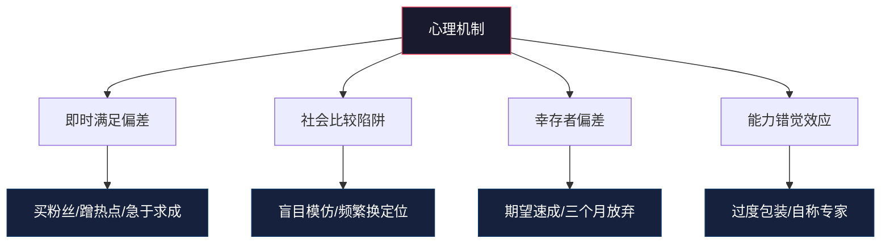
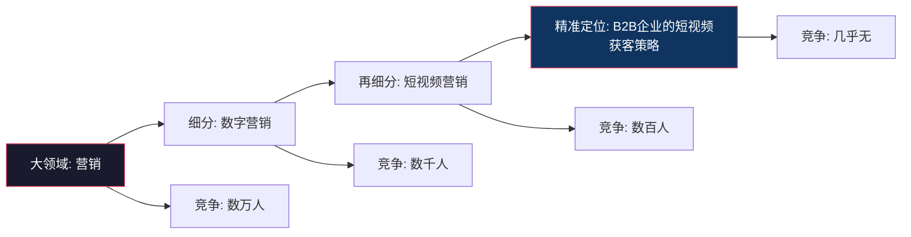
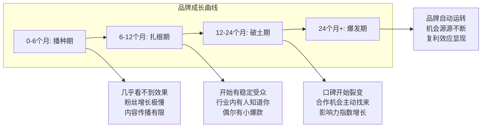
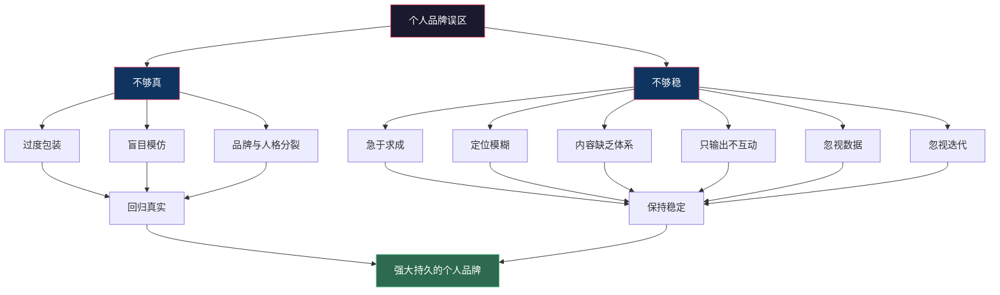

# 常见误区：个人品牌建设中的陷阱与纠偏

个人品牌建设是一条"看起来简单、做起来复杂"的路。每个人都能在社交媒体上发内容、写简介、展示自己，但真正建立起强大个人品牌的人却少之又少。原因不在于方法论的匮乏——市面上关于个人品牌的文章和课程多如牛毛——而在于人们在执行过程中反复踩入相同的陷阱。

本章系统梳理个人品牌建设中最常见的十大误区，每个误区不仅解释"为什么错"，更提供具体的诊断方法和纠正路径。读完本章后，你应该能对自己的品牌建设状态做一次全面"体检"。

## 一、为什么我们会踩进误区：误区背后的心理机制

在逐一分析具体误区之前，有必要先理解一个根本问题：为什么聪明人会在个人品牌建设中反复犯错？答案藏在几个心理机制里。

### 1.1 即时满足偏差

人类大脑天然偏好即时回报。发布一条精心包装的内容，立刻获得几十个赞，这种即时反馈带来的多巴胺刺激，远比"持续输出高质量内容三个月后逐渐获得认可"更有吸引力。这就是为什么"买粉丝""蹭热点""过度包装"如此诱人——它们能立刻给你"品牌在成长"的错觉。

但个人品牌的本质是**延迟满足**。你需要在看不到即时回报的阶段持续投入，就像存养老金一样——每月存钱时看不到明显变化，但复利效应会在未来给你巨大回报。

### 1.2 社会比较陷阱

当你打开社交媒体，看到同领域的人粉丝比你多、合作比你多、影响力比你大时，焦虑感会驱使你做出不理性的决策：模仿他们的风格、追逐他们的热点、甚至贬低他们的内容来抬高自己。

这种社会比较的问题在于，你看到的永远是别人精心策展的"高光时刻"，而非他们背后数年的默默积累。用别人的结果来衡量自己的过程，必然导致焦虑和误判。

### 1.3 幸存者偏差

媒体热衷报道"一夜爆红"的故事，却很少讲述"三年默默耕耘后才被看见"的故事。这导致很多人对个人品牌的成长速度有严重错误的预期。他们不知道：那些"一夜成名"的人，绝大多数在此前已经积累了多年。

### 1.4 能力错觉效应

心理学中的"达克效应"（Dunning-Kruger Effect）在个人品牌领域表现得尤为明显：刚起步的人往往高估自己的专业水平和品牌影响力，而真正的专家反而觉得自己"还不够格"。这种认知偏差直接导致了"过度包装"和"定位混乱"两大误区。

理解了这些心理机制，你就能在"本能反应"和"理性决策"之间建立一个缓冲区。当你感到焦虑、急于求成或想要模仿他人时，先停下来问自己：**"这是我的理性判断，还是某种心理偏差在驱动我？"**

## 二、十大核心误区的深度剖析

### 误区一：过度包装，名不副实

#### 典型表现

过度包装在个人品牌领域有多种面貌：

- **头衔通胀**：简历上写满各种来路不明的"头衔"和"认证"——"全球知名导师""XX领域第一人""百万粉丝博主"（实际可能只有几万僵尸粉）。某些人甚至会购买虚假的行业认证或参加付费就能获得的"颁奖典礼"，然后把奖杯放在社交媒体首页。
- **人设造假**：社交媒体上的生活看起来光鲜亮丽——豪车、名表、高端会议、名人合影——但实际状态差距巨大。有些人租豪车拍照、参加活动时蹭名人合影、用修图软件制造虚假的生活场景。
- **成果虚报**：将团队成果包装成个人成就（"我带领团队完成了XX亿的业绩"，实际上你只是团队中一个普通成员），将偶然的成功包装成系统的能力（"我投资回报率300%"，但只投了一个项目且带有极大运气成分）。
- **履历美化**：夸大职位名称（"经理"写成"总监"）、延长在职时间、模糊公司规模（把5人创业公司写成"知名科技企业"）。

#### 深层危害分析

过度包装的短期效果确实存在——它能帮你通过第一道筛选、获得初始关注、甚至签下一些合作。但它带来的危害是系统性的、长期的、几乎不可逆的：

**信任链断裂**：个人品牌的核心资产是信任。每一次过度包装都是在透支信任额度。当真相暴露时（而真相总会暴露），不仅当下的信任归零，连之前的正面印象也会被重新解读为"一直在骗人"。

**口碑的涟漪效应**：负面口碑的传播速度和广度远超正面口碑。心理学研究表明，一个人的负面体验平均会告诉11个人，而正面体验只会告诉3个人。在社交媒体时代，这个比例差距更大——一条曝光"虚假人设"的帖子可能获得数千转发。

**内部自信崩塌**：长期维持虚假人设需要巨大的心理能量。你知道自己在"演戏"，这种认知失调会侵蚀你的自我价值感。当你的品牌建立在虚假之上时，你永远无法真正自信——因为你知道地基是空的。

**法律风险**：在某些领域，虚假宣传不仅是道德问题，更是法律问题。虚假的学历认证、伪造的客户案例、夸大的产品效果，都可能引发法律纠纷。

#### 诊断清单

用以下问题自检你的品牌是否存在过度包装：

| 检查项 | 诚实回答 |
|--------|----------|
| 你声称的能力，能否在面试中被当场测试？ | 是/否 |
| 你展示的成果，是否有可验证的第三方证据？ | 是/否 |
| 你的头衔/认证，是否来自有公信力的机构？ | 是/否 |
| 如果你的全部信息被公开审查，你会紧张吗？ | 是/否 |
| 你是否曾因为"包装"而获得了超出实际能力的机会？ | 是/否 |

如果超过两项回答让你不安，说明你的品牌存在过度包装的风险。

#### 正确做法

**"最好的自己"原则**：你可以选择展示最好的自己——这不是虚伪，这是策略。但展示的必须是真实的自己。就像拍照时选择好的光线和角度，你呈现的是"美化"而非"伪造"。

**成果导向叙事**：与其罗列头衔和认证，不如展示你实际完成的项目、解决的问题、创造的价值。一个有具体数据支撑的项目描述（"我设计的方案帮助客户将转化率从2.1%提升到4.7%"）比十个空洞的头衔更有说服力。

**"可验证性"标准**：你说的每一句话都应该经得起验证。建立一个简单的规则——如果有人花30分钟深入调查你，你的品牌应该更加坚固而非脆弱。公开你的作品集、项目案例、客户评价，让事实为你说话。

**主动暴露"不完美"**：适度展示你的学习过程、失败经历、仍在努力的方向，反而能增强可信度。人们信任"真实的人"，不信任"完美的人设"。分享"我去年在这个项目上犯了什么错误，我从中学到了什么"比"我从不犯错"更有效。

---

### 误区二：定位模糊，什么都想做

#### 典型表现

定位模糊是个人品牌最常见的"慢性病"，它的症状往往是隐蔽的：

- **定位漂移**：今天的定位是"营销专家"，明天变成"管理顾问"，后天又成了"人生教练"。不是因为你在成长，而是因为你根本不知道自己要做什么。
- **内容散焦**：你的社交媒体时间线上，行业分析、个人感悟、美食分享、育儿心得、读书笔记混杂在一起。受众看完后说不清"你到底是干什么的"。
- **受众泛化**：对所有受众说所有话。你的自我介绍写着"帮助所有人实现财务自由"——这种定位等于没有定位。
- **"机会恐惧症"**：害怕"定位太窄会错过机会"，所以选择"大而全"。你担心如果只做"短视频营销"，就会错过"品牌战略"的客户。结果是两个都没做好。

#### 为什么定位模糊是致命的

在信息过载的时代，人们的心智带宽极其有限。心理学家乔治·米勒（George Miller）的经典研究表明，人类短期记忆只能同时处理7±2个信息单元。在个人品牌领域，这个数字更残酷——大多数人对一个细分领域只能记住1-2个人。

定位理论的奠基人阿尔·里斯（Al Ries）和杰克·特劳特（Jack Trout）指出：**"你想对所有人说话，结果就是没人听。"** 品牌的本质是在人们心智中占据一个独特的位置，而定位模糊意味着你在哪里都占据不了位置。

从信息论的角度看，定位模糊的品牌传递的"信息熵"很高——信号弱、噪声多、难以被编码和存储。而定位清晰的品牌信息熵低——信号强、辨识度高、容易被记忆和传播。

#### 细分定位的力量

这个图展示了定位细分的逻辑：越细分，竞争越少，你成为"领域第一"的可能性越大。而一旦在细分领域建立了足够的影响力，扩展到更大领域就变得容易得多。

#### 定位选择的"三圈模型"

选择定位时，找到以下三个圆的交集：

| 维度 | 说明 | 自检问题 |
|------|------|----------|
| **能力圈** | 你真正擅长的事 | 你在什么事情上比90%的人做得好？ |
| **热情圈** | 你真正热爱的事 | 什么事情你愿意免费做10年？ |
| **价值圈** | 市场愿意付费的事 | 什么问题有人愿意花钱解决？ |

三圈交集就是你的最佳定位区域。只有能力没有热情，你会倦怠；只有热情没有能力，你会失败；有能力有热情但市场不买单，你会饿死。

#### 定位测试方法

**电梯演讲测试**：用30秒向一个完全不了解你的人解释"你是谁，你做什么，你能帮什么忙"。如果对方能在听完后准确复述你的定位，说明定位足够清晰；如果对方一脸困惑或记不住，说明定位需要调整。

**"所以呢？"测试**：每次你描述自己的定位时，想象对方在心里问"所以呢？这跟我有什么关系？"如果你的定位无法在3秒内回答这个问题，它需要更具体。

**内容一致性审计**：翻看你过去3个月发布的内容，计算有多少比例直接围绕你的核心定位。如果低于70%，说明你的内容输出存在散焦问题。

#### 正确做法

- **选择一个细分领域深耕**：宁可在小池塘里做大鱼，也不要在大海里做小虾。"B2B企业的短视频获客专家"比"营销专家"有力十倍。
- **围绕一个核心主题展开所有内容**：所有输出都围绕你的品牌定位展开，形成"内容合力"。
- **先做深再做宽**：在一个领域建立足够的影响力后，再考虑扩展。扩展时采用"同心圆"策略——从核心定位向外逐步扩展，而非跳跃式切换。
- **接受"少即是多"**：定位越窄，聚焦越强，穿透力越大。你不是在缩小市场，你是在集中火力。

---

### 误区三：急于求成，追求速成

#### 典型表现

- **一夜成名幻想**：希望发一条视频就爆火、写一篇文章就出圈、参加一个节目就成为"网红"。
- **数据造假**：花钱买粉丝、买流量、买好评、买转发。用虚假的数字来制造"品牌很成功"的假象。
- **策略频繁切换**：三个月看不到效果就放弃当前策略，换一种新的。结果是每种方法都浅尝辄止，没有任何一种积累到临界点。
- **热点依赖症**：追逐每一个热点，希望通过"蹭流量"快速涨粉。内容跟风、观点跟风、形式跟风，完全没有自己的节奏。
- **捷径迷信**：沉迷于各种"快速涨粉秘籍""个人品牌速成课"，期望找到一个"银弹"能一夜之间解决所有问题。

#### 复利曲线：品牌成长的真实节奏

个人品牌的成长遵循一条典型的"曲棍球棒"曲线：前期漫长而平缓，后期加速而陡峭。

**关键数据**：根据对大量个人品牌案例的分析，大多数成功的个人品牌在前6个月几乎没有可见的增长，前12个月的增长也极为缓慢。真正的"拐点"通常出现在持续输出12-18个月之后。那些"三个月速成"的案例，要么是极少数的幸存者偏差，要么是靠大量资金投入（本质是花钱买时间），要么根本就是营销话术。

#### 买来的数字为什么毫无价值

买粉丝和买流量不仅无效，而且有害：

| 指标 | 真实粉丝 | 买来的粉丝 |
|------|----------|------------|
| 互动率 | 3-8% | 0.01-0.1% |
| 转化率 | 1-5% | 接近0% |
| 传播力 | 会转发推荐 | 从不互动 |
| 平台风控 | 安全 | 可能被封号 |
| 品牌价值 | 正向 | 负向（拉低算法推荐） |

社交媒体平台的算法会根据互动率来决定是否推荐你的内容。大量僵尸粉会拉低你的互动率，导致算法认为你的内容质量低，从而减少推荐——这比没有粉丝还糟糕。

#### 正确做法

**建立"复利思维"**：把每一篇内容、每一次互动都看作一笔"品牌存款"。单笔存款看起来微不足道，但积累到一定量级后，利息会开始产生利息——你的旧内容被重新发现，你的口碑开始自我传播，你的品牌开始自动运转。

**关注"过程指标"而非"结果指标"**：

| 过程指标（你应该关注的） | 结果指标（不要太在意的） |
|--------------------------|--------------------------|
| 内容质量是否在提升 | 粉丝总数 |
| 互动深度（评论质量） | 点赞数量 |
| 受众画像是否精准 | 总阅读量 |
| 内容一致性（是否稳定输出） | 单篇爆款数据 |
| 行业内的口碑变化 | 合作数量 |

**给自己一个"不看数据"的窗口期**：品牌建设的前6个月，建议完全不看数据——因为这个阶段的数据一定不好看，看了只会影响心态。把注意力100%放在内容质量和输出稳定性上。

**建立"最小可持续节奏"**：与其制定雄心勃勃的计划（每天发一条）然后三天打鱼两天晒网，不如找到一个你能坚持一年的节奏（比如每周两篇）。持续性比强度重要十倍。

---

### 误区四：忽视危机管理

#### 典型表现

- **"不会发生在我身上"心态**：认为只要自己不犯错就不会有危机，完全没有准备。
- **鸵鸟策略**：面对负面评价时选择忽视、删帖、关闭评论，假装问题不存在。
- **对抗升级**：在危机中采取对抗态度——怼网友、发声明反驳、威胁起诉——把小危机变成大灾难。
- **信息混乱**：在危机中多人发声、口径不一致、前后矛盾，让问题更加复杂。

#### 危机的不可避免性

在社交媒体时代，危机不是"会不会发生"的问题，而是"什么时候发生"的问题。即使你个人行为完美无缺，也可能因为以下原因陷入危机：

- **误解和断章取义**：你五年前的一句话被人翻出来，脱离上下文后看起来完全是另一个意思。
- **恶意攻击**：竞争对手、心怀不满的前同事或纯粹的网络暴力，都可能发起有组织的攻击。
- **关联危机**：你的合作伙伴、推荐的产品、参与的项目出了问题，连带影响到你。
- **环境变化**：社会价值观的变化可能让曾经无害的言论变得有争议。

#### 危机应对的黄金框架

本章提供一个简洁但完整的危机应对框架。关于危机沟通的更详细策略（包括具体话术、案例分析、恢复路径），请参阅本章"核心技巧"部分的"个人品牌的危机沟通策略"一章。

**第一时间（0-2小时）**：
- 快速评估危机类型和严重程度
- 统一内部口径，指定唯一发言人
- 发布简短声明："我已关注到这个问题，正在了解情况，会在XX时间内给出正式回应"

**应对阶段（2-24小时）**：
- 查明事实，不急于下结论
- 如果确实有错：坦诚承认 + 具体道歉 + 整改措施
- 如果被误解：用事实澄清 + 保持冷静 + 不人身攻击

**恢复阶段（1-4周）**：
- 持续跟进整改措施的执行
- 用行动而非言语重建信任
- 复盘总结，完善危机预案

#### 危机中的"绝不"清单

| 绝不做的事 | 为什么 | 正确替代 |
|-----------|--------|----------|
| 删除负面评论 | 会被截图传播，显得心虚 | 正面回应或置顶澄清 |
| 保持沉默 | 沉默=默认=心虚 | 至少表明"在处理" |
| 指责受害者/批评者 | 激化矛盾，制造对立 | 承认对方感受，聚焦解决方案 |
| 让多人同时发声 | 口径不一致造成混乱 | 指定唯一发言人 |
| 发情绪化的回应 | 情绪化=失控=不可信 | 写完后等1小时再发 |
| 做无法兑现的承诺 | 二次失信比首次更严重 | 只承诺你能做到的事 |

#### 正确做法

- **提前准备危机预案**：列出你可能面临的5种最常见危机场景，为每种场景准备一套应对策略和话术模板。
- **建立"危机雷达"**：定期搜索自己的名字和品牌关键词，及时发现负面信息的萌芽。小火苗好灭，等烧成大火就来不及了。
- **培养"信任储蓄"**：危机来临时，你的"信任储蓄"决定了你能承受多大的冲击。平时积累的信任越多，危机中的缓冲空间越大。
- **将危机视为品牌升级的契机**：处理得当的危机不仅能恢复信任，甚至能提升品牌——因为它向公众展示了你的品格、担当和处理问题的能力。

---

### 误区五：内容输出缺乏体系

#### 典型表现

- **随机创作**：想到什么写什么，缺乏内容规划。今天分享行业新闻，明天发个人感悟，后天又转一段鸡汤。
- **节奏混乱**：长时间不更新（一两个月没有动静），然后突然"爆发"连续发布十几条内容。受众完全无法建立对你的稳定预期。
- **质量波动**：有些内容精心打磨，有些内容随意敷衍，质量参差不齐。
- **平台复制**：同一条内容不加修改地发布到所有平台，完全忽视不同平台的内容特性和用户习惯。

#### 内容体系为什么至关重要

个人品牌在受众心智中的形象，是由你的内容体系共同构建的。单篇内容的作用就像单块拼图——单独看每块都可能不错，但如果拼不出完整的画面，就无法形成清晰的品牌认知。

缺乏体系的内容输出会带来三个致命问题：

**品牌认知模糊**：受众无法从你的内容中归纳出"你是谁"。今天你是行业分析师，明天你是生活博主，后天你是鸡汤作者——最终在受众心中，你什么都不是。

**记忆衰减**：心理学中的"艾宾浩斯遗忘曲线"表明，信息的遗忘速度先快后慢。如果你的更新节奏是"一个月发一次"，那么每次发新内容时，大部分受众已经忘了你是谁。

**算法惩罚**：所有社交媒体平台的算法都偏爱"稳定输出"的创作者。间断性更新会导致算法降低你的推荐权重，形成恶性循环——你发得少，算法推荐少，你看到数据差，更不想发。

#### 内容日历的构建方法

一个有效的内容日历应该包含以下要素：

**时间维度**：
- 年度主题：今年你的品牌要传递的核心信息是什么？
- 季度重点：每个季度围绕一个子主题深入展开
- 月度规划：每月确定具体内容选题
- 周度执行：每周确定发布时间和平台

**内容类型矩阵**：

| 内容类型 | 占比 | 目的 | 发布频率 | 示例 |
|----------|------|------|----------|------|
| 核心内容 | 50-60% | 建立专业形象 | 每周2-3篇 | 深度分析、方法论、案例拆解 |
| 辅助内容 | 20-25% | 展现人格特质 | 每周1-2篇 | 个人故事、行业观察、幕后花絮 |
| 互动内容 | 15-20% | 促进社群活跃 | 每周1-2篇 | 提问、投票、讨论话题 |
| 热点内容 | 5-10% | 增加曝光 | 有热点时 | 结合自身定位的热点评论 |

**平台差异化策略**：

| 平台 | 内容特性 | 最佳形式 | 更新节奏 |
|------|----------|----------|----------|
| 微信公众号 | 深度阅读、私域沉淀 | 长文、系列文章 | 每周1-2篇 |
| 知乎 | 专业问答、知识分享 | 回答、专栏文章 | 每周2-3篇 |
| 小红书 | 视觉化、生活方式 | 图文笔记、短视频 | 每天1条 |
| B站 | 中长视频、深度内容 | 教程、分析视频 | 每周1-2条 |
| 抖音/快手 | 短平快、娱乐化 | 短视频、直播 | 每天1-2条 |
| LinkedIn | 职业社交、行业洞察 | 专业文章、行业评论 | 每周2-3篇 |

#### 正确做法

- **制定内容日历**：至少提前两周规划内容选题和发布时间。用工具（如Notion、飞书多维表格、Trello）管理你的内容管线。
- **建立内容质量标准**：每篇内容发布前用以下三个问题过滤——（1）这是否符合我的品牌定位？（2）这是否对受众有实质价值？（3）这是否达到了我最低的质量标准？三个问题有任何一个答案为"否"，就不发布。
- **保持稳定的更新频率**：宁可降低频率也要保持稳定。每周一篇高质量内容比一个月五篇然后消失两个月有效得多。
- **建立内容复用机制**：一篇深度长文可以拆解为5-10条社交媒体短内容，一场演讲可以转化为一篇文章和若干金句图。一次创作，多次分发。

关于内容输出体系的完整方法论（包括写作技巧、演讲品牌化、视频内容策略），请参阅本章"核心技巧"部分的"内容输出体系"一章。

---

### 误区六：只输出不互动

#### 典型表现

- **广播模式**：把社交媒体当作单向传播的"电视台"——只管发布，不看反馈。评论区从不回复，私信从不打开。
- **缺席行业对话**：从不参与行业讨论、从不在别人的内容下发表有价值的评论、从不参加行业社群的交流。
- **反馈黑洞**：对受众的需求和反馈漠不关心。受众反复问的问题不回答，受众表达的困惑不回应，受众提出的建议不采纳。
- **自说自话**：内容全是"我认为""我觉得""我要分享"，完全没有"你们问我的""上次有人提到""根据大家的反馈"。

#### 互动为什么是品牌的命脉

社交媒体的本质是"社交"，不是"媒体"。这个平台设计的底层逻辑就是双向互动，而非单向广播。如果你只输出不互动，你就在违背平台的底层逻辑——算法不会偏爱你，受众也不会亲近你。

互动的价值体现在三个层面：

**算法层面**：所有社交媒体平台的算法都会根据互动率（评论率、回复率、转发率）来决定内容的推荐权重。一个有大量高质量评论的内容，会获得远超沉默内容的推荐量。

**信任层面**：互动是建立信任最快的方式之一。当受众在你的内容下留言并收到你的真诚回复时，他们会感受到"被看见""被重视"，这种体验会在他们心中建立远超单向内容的情感连接。

**洞察层面**：互动是了解受众需求最直接的渠道。通过与受众的对话，你可以发现他们真正关心什么、困惑什么、需要什么——这些都是你调整内容策略和品牌方向的宝贵信息。

#### 高效互动的策略矩阵

| 互动类型 | 时间投入 | 价值产出 | 具体方法 |
|----------|----------|----------|----------|
| 回复评论 | 每天15-30分钟 | 高（增强信任） | 回复每一条评论，尤其是前1小时内 |
| 行业评论 | 每天15分钟 | 高（增加曝光） | 在行业KOL内容下发表专业见解 |
| 私信交流 | 每天10分钟 | 中（深度连接） | 回复有价值的私信，建立一对一关系 |
| 社群参与 | 每周2-3小时 | 中（行业融入） | 加入行业社群，定期参与讨论 |
| 主动发起话题 | 每周1-2次 | 高（引领讨论） | 发起投票、提问、辩论话题 |

#### 评论回复的艺术

不是所有评论都用同样的方式回复。以下是针对不同评论类型的回复策略：

- **正面评论**：表达感谢 + 延伸对话。不要只说"谢谢"，可以追问"你在这方面有什么经验？"来延续对话。
- **质疑评论**：尊重 + 用事实回应。不要防御性地反驳，可以说"这是个好问题，我的理解是……你怎么看？"
- **负面评论**：冷静 + 真诚。如果批评有道理，坦诚接受；如果批评有误解，用事实澄清。
- **求助评论**：耐心 + 具体。尽量给出实质性的建议，即使答案很长。这不仅是帮助提问者，也是向所有围观者展示你的专业和真诚。

#### 正确做法

- **每天留出固定的互动时间**：建议每天至少30分钟，分为早上15分钟和晚上15分钟。把互动当作和写内容同等重要的品牌活动。
- **主动发起话题和讨论**：不要等受众来找你。定期发起投票、提问、讨论话题，创造互动机会。
- **将受众反馈融入内容创作**：受众的问题就是你最好的选题来源。"很多人问我XXX"比"今天我想聊XXX"更有吸引力。
- **建立"核心圈"关系**：与最活跃、最忠诚的受众建立更深层的连接。他们不仅是你的受众，更是你的品牌传播者。

---

### 误区七：盲目模仿他人

#### 典型表现

- **风格克隆**：看到某个大V火了，就完全模仿他的说话方式、内容风格、甚至穿着打扮和拍摄角度。
- **公式套用**：套用别人的成功公式——"他发这种标题火了，我也发"、"她用这种封面涨粉了，我也用"——期望得到相同的结果。
- **失去自我**：在模仿的过程中，逐渐失去了自己的特色和风格，变成"某某的翻版"。
- **频繁换偶像**：今天模仿A，明天模仿B，后天模仿C，品牌始终没有稳定的面貌。每次切换都意味着之前积累的风格认知归零。

#### 模仿为什么注定失败

个人品牌的核心价值在于"个人"——你的独特性。模仿他人注定只能成为"第二"，而人们只会记住"第一"。

从神经科学的角度看，受众的大脑对"原创"和"模仿"有天然的识别能力。模仿出来的内容缺乏"灵魂"——一种只有经历过真实思考和创作过程才能产生的质感。受众也许说不出具体哪里不对，但能感觉到"这个人不是真的"。

更关键的是，你模仿的对象之所以成功，往往不是因为他们的表面形式（标题风格、拍摄角度、说话方式），而是因为以下你看不到的因素：

- **时机优势**：他们可能在某个领域还没有竞争者时就开始积累了。
- **资源积累**：他们可能有你看不到的资源（人脉、资金、经验积累）。
- **个人特质**：他们的风格与他们的人格高度匹配，而你的人格可能完全不适合这种风格。
- **隐性知识**：他们的成功背后有大量试错和调整，你看到的只是最终结果。

#### 正确的"学习"而非"模仿"

学习和模仿的区别在于：

| 维度 | 学习（正确） | 模仿（错误） |
|------|-------------|-------------|
| 对象 | 方法论和思维模式 | 表面形式和具体技巧 |
| 目标 | 理解"为什么有效" | 复制"看起来怎样" |
| 过程 | 提炼原则，融入自己的体系 | 照搬形式，套用自己的内容 |
| 结果 | 形成自己的风格 | 成为别人的影子 |

#### 找到你的"原生优势"

每个人都有独特的"原生优势"——那些与你的经历、性格、知识结构深度绑定的特质。它们是你最强大的品牌差异化武器。

发现原生优势的四个问题：

1. **经历独特性**：你经历过什么别人很少经历的事？（比如：在三个不同行业工作过、在海外生活过十年、从零开始创业过）
2. **视角独特性**：你看问题的角度有什么不同？（比如：同时懂技术和商业、既理解甲方也理解乙方）
3. **表达独特性**：你说话/写作的方式有什么特点？（比如：善于用比喻、逻辑特别清晰、幽默感独特）
4. **价值观独特性**：你在乎什么别人不在乎的事？（比如：极度重视可验证性、坚持长期主义、特别关注公平）

#### 正确做法

- **学习方法论，而非模仿表现形式**：研究成功者的定位逻辑、内容策略、传播机制，但不要复制他们的表达方式和人设。
- **找到自己的"原生优势"并放大它**：你的独特经历、视角、风格就是你最大的竞争壁垒。
- **允许自己慢慢成长**：品牌风格不是一天形成的。给自己6-12个月的"探索期"，在不断尝试中找到最适合自己的表达方式。
- **建立"反模仿"检查机制**：每次创作内容前问自己——"如果把我名字去掉，别人能看出这是模仿谁的吗？"如果答案是"能"，说明你走偏了。

---

### 误区八：忽视数据，盲目自信

#### 典型表现

- **只看感觉不看数据**："我觉得这篇文章写得不错"——但数据显示阅读完成率只有15%。
- **只看虚荣指标**：只关注粉丝数、点赞数这些"看起来好看"的数字，不关注互动率、转化率、留存率这些真正有意义的指标。
- **不做A/B测试**：同一主题不测试不同标题、不同发布时间、不同内容形式的效果差异。
- **不做复盘**：从不回顾过去的内容表现，不分析什么有效、什么无效、为什么。

#### 数据驱动的品牌优化

数据不是用来"证明你做得好"的，而是用来"帮助你做得更好"的。以下是个人品牌建设中应该追踪的核心数据指标：

**内容层面**：
- 阅读/播放完成率（反映内容质量）
- 评论率和评论质量（反映互动深度）
- 收藏/转发率（反映内容价值）
- 新增关注来源分析（反映传播效果）

**品牌层面**：
- 品牌关键词搜索量（反映品牌认知度）
- 自然增长vs主动获客比例（反映品牌吸引力）
- 合作邀约的质量和数量（反映商业价值）
- 行业提及和引用频率（反映行业影响力）

**受众层面**：
- 受众画像变化（是否触达了目标人群）
- 受众留存率（关注后是否持续互动）
- 受众分层（核心粉丝、普通关注、路人粉的比例）

#### 正确做法

- **建立"数据日"习惯**：每周花1小时分析上周的内容数据，找出规律和趋势。
- **关注"领先指标"而非"滞后指标"**：互动率是领先指标（预示未来增长），粉丝数是滞后指标（反映过去成绩）。
- **持续A/B测试**：同一主题尝试不同标题、不同开头、不同形式，用数据而非直觉来决定最佳实践。
- **建立内容"金矿"档案**：记录你表现最好的内容——它们的共同特征是什么？这些特征就是你的"金矿"，应该持续开采。

---

### 误区九：品牌与人格分裂

#### 典型表现

- **线上人设，线下另一个**：在社交媒体上是一个温暖、专业、乐于助人的人，现实中却是冷漠、敷衍、斤斤计较的人。
- **公私矛盾**：在品牌内容中倡导"长期主义"，但私下做事总是追求短期利益。
- **知行不一**：教你应该怎么做，但自己根本做不到。
- **选择性展示**：只展示符合品牌定位的一面，完全隐藏矛盾的一面，导致人设单一且脆弱。

#### 品牌一致性的底层逻辑

品牌的本质是"承诺"——你向受众承诺你是什么样的人、能提供什么样的价值。而承诺必须通过一致性来兑现。如果你的线上人设和线下行为不一致，受众迟早会发现——通过线下接触、通过熟人传播、通过你自己不经意的"穿帮"。

品牌与人格分裂的最大危害是**认知失调**。当你需要在"真实的自己"和"品牌人设"之间不断切换时，你会感到巨大的心理压力。这种压力不仅影响你的心理健康，还会逐渐渗透到你的内容中——受众能感觉到你的"不自然"。

#### 正确做法

- **让品牌成为"最好的自己"而非"虚构的自己"**：你的品牌应该放大你最好的特质，而不是创造你没有的特质。
- **接受"不完美"是品牌的一部分**：适度展示你的缺点和挣扎，反而能增强真实感和亲和力。
- **线下言行与线上一致**：如果你在线上倡导"终身学习"，你线下就应该真的在学习。一致性是最好的品牌策略。
- **定期"人格审计"**：每季度问自己——"我的品牌展示的是真实的我吗？"如果答案是"不完全"，需要调整品牌或调整自己。

---

### 误区十：忽视品牌迭代

#### 典型表现

- **"定型"思维**：认为品牌定位一旦确定就永远不能变，即使市场环境和自身情况都发生了巨大变化。
- **抗拒反馈**：面对受众和市场的反馈，固执己见，拒绝调整。
- **路径依赖**：因为"一直这么做"就继续这么做，即使数据显示效果越来越差。
- **跟不上时代**：内容形式、传播渠道、受众偏好都在变化，但你的品牌策略停留在三年前。

#### 品牌需要持续进化

品牌不是纪念碑，而是有机体——它需要不断适应环境变化才能生存和成长。这不意味着你要频繁改变定位（那是误区二），而是意味着你要在保持核心定位稳定的前提下，持续优化表达方式、内容形式和传播策略。

品牌的迭代周期可以参考以下框架：

| 周期 | 频率 | 迭代内容 |
|------|------|----------|
| 微调 | 每月 | 内容形式、发布时间、互动策略 |
| 优化 | 每季度 | 内容主题配比、平台策略、受众定位 |
| 调整 | 每年 | 品牌表达方式、视觉形象、核心叙事 |
| 转型 | 3-5年 | 品牌定位、目标受众、核心价值主张 |

#### 正确做法

- **建立"反馈循环"**：定期收集受众反馈、市场数据和行业趋势，作为品牌迭代的依据。
- **拥抱变化，坚守核心**：表达方式可以变，传播渠道可以变，内容形式可以变——但你的核心价值观和品牌承诺不应轻易改变。
- **小步快跑**：与其做一次大的品牌重塑，不如持续做小的调整和优化。每次调整都是可逆的，大的变革往往是不可逆的。
- **向行业外学习**：不要只关注自己领域的品牌实践。跨行业的最佳实践往往能带来意想不到的启发。

---

## 三、误区诊断：你的品牌"体检"报告

以下是个人品牌健康的全面诊断框架。对每个维度打分（1-5分），加总后对照评估标准。

| 诊断维度 | 检查项 | 评分(1-5) |
|----------|--------|-----------|
| **真实性** | 品牌展示与实际能力一致 | _____ |
| | 能经受背景调查 | _____ |
| | 线上线下人格一致 | _____ |
| **聚焦度** | 定位清晰，能30秒说清 | _____ |
| | 70%以上内容围绕核心定位 | _____ |
| | 受众能准确描述"你是谁" | _____ |
| **持续性** | 有稳定的更新节奏 | _____ |
| | 能坚持至少12个月 | _____ |
| | 有内容日历和规划 | _____ |
| **互动性** | 每天有固定的互动时间 | _____ |
| | 评论回复率>80% | _____ |
| | 参与行业社群讨论 | _____ |
| **危机准备** | 有危机应对预案 | _____ |
| | 定期监测品牌舆情 | _____ |
| | 有足够的"信任储蓄" | _____ |
| **数据驱动** | 定期分析内容数据 | _____ |
| | 关注过程指标而非虚荣指标 | _____ |
| | 持续A/B测试和优化 | _____ |
| **进化能力** | 有定期的品牌复盘机制 | _____ |
| | 能根据反馈调整策略 | _____ |
| | 表达方式与时俱进 | _____ |

**评估标准**：
- **60-85分**：品牌健康，继续保持，关注短板维度
- **40-59分**：品牌亚健康，需要针对性改善
- **40分以下**：品牌危机，需要系统性重建

---

## 四、误区的底层规律：两大核心问题

回顾全部十大误区，可以归纳为两个根本问题：

### 4.1 "不够真"

过度包装（误区一）、品牌与人格分裂（误区九）、盲目模仿他人（误区七）——本质上都是品牌与真实自我的脱节。"不够真"的品牌也许能获得短期关注，但无法建立持久的信任。信任是个人品牌的"硬通货"，没有信任的品牌就像没有根基的楼——看着高，风一吹就倒。

### 4.2 "不够稳"

急于求成（误区三）、定位模糊（误区二）、内容缺乏体系（误区五）、只输出不互动（误区六）、忽视数据（误区八）、忽视迭代（误区十）——本质上都是品牌建设过程的不稳定。"不够稳"的品牌无法在受众心智中建立持久的认知，每次变化都在消耗之前积累的品牌资产。

**回归真实，保持稳定**——这八个字是避开所有误区的根本方法。听起来简单，但做到很难。它要求你抵抗诱惑（不包装、不抄近路、不追热点）、对抗焦虑（不急于求成、不盲目比较）、保持自律（持续输出、持续互动、持续优化）。

这就是为什么个人品牌建设是一场马拉松而非百米冲刺——它考验的不是你的聪明才智，而是你的品格和耐力。
